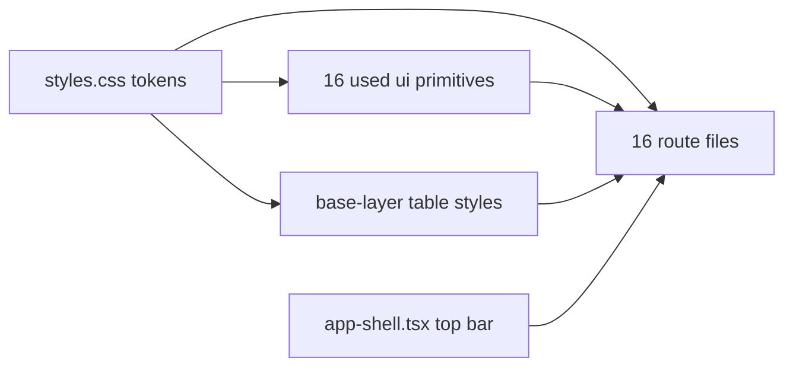

# Aetheria glass retheme

## Stack decision

Staying on the current stack: React 19, TypeScript, Tailwind v4, Radix (via shadcn/ui) on TanStack Start with a Nitro server. No Next.js migration - it would mean rewriting all 68 `createServerFn` handlers, the file-based routing and the auth middleware for no visual gain. The theme work is CSS and component level, so it is independent of the framework underneath.

Order of work: theme first, then the Supabase backend (Phase 6), which is blocked until project credentials arrive.

## What is changing and what is not

Not changing: routes, navigation structure (top header bar stays), permission gating, data flow, server functions, demo mode, component placement, page order.

Changing: colour palette, typography, surface treatment (flat white cards become blurred translucent glass), button/badge/input styling, and per-page spacing and hierarchy to match the mockups. Plus the pre-existing defects listed in Phase 5.

## Key discovery that shapes the approach

An audit found roughly 816 semantic-token utility uses across 56 files, against exactly one hardcoded Tailwind palette utility in app code (in [src/components/arrival-alerts.tsx](src/components/arrival-alerts.tsx)). So re-pointing the token values in [src/styles.css](src/styles.css) carries the new palette across all 16 routes without touching them, and the per-page work becomes layout and hierarchy polish rather than a colour hunt.

The three exceptions that tokens will not reach, handled explicitly below: the raw `<table>` markup used everywhere instead of `ui/table.tsx`, the hex-based practitioner and treatment colours, and the `bg-black/80` overlay scrims in the dialog primitives.

## Phase 1 - Design tokens ([src/styles.css](src/styles.css))

Keep every existing token *name* so nothing breaks; only the values change.

- `--background` becomes the Aetheria wash: `#f6f7f8` under two radial gradients (butter at top-left, peach at top-right) plus the 14px notebook rule `repeating-linear-gradient`, applied on `body` with `background-attachment: fixed`.
- `--foreground` to ink `#2f3f66`; `--muted-foreground` to `rgba(47,63,102,.6)`.
- `--card` / `--popover` to translucent white `rgba(255,255,255,.52)`; `--secondary` / `--muted` to `rgba(255,255,255,.34)`.
- `--border` / `--input` to the light edge `rgba(255,255,255,.78)`.
- `--primary` and `--accent` to the butter accent `#eed488` with `--primary-foreground` / `--accent-foreground` as `#332d18`; add `--accent-ink: #7a6220` for link and emphasis text.
- `--destructive` to rose `#dc6c96`, `--success` to mint `#4a9d75`, `--warning` to lilac `#b9a6e8`, `--teal` retired onto the accent, `--consent` / `--arrived` / `--aftercare` onto sky/lilac/rose.
- `--lane-1..8` and their `-ink` pairs remapped onto the theme's pastel set (mint `#a6dccd`, pink `#ef9bc4`, lilac `#b9a6e8`, sky `#8fc7ea`, accent, plus soft peach/lemon/green fills).
- New glass tokens registered in `@theme inline` so they become utilities: `--glass-2`, `--edge-hi`, `--sheen`, `--bloom`, `--glass-line`, `--blur: 26px`, `--accent-50`, `--accent-100`.
- Radius: `--radius` from `0.875rem` to `1.375rem` (22px) so `rounded-lg` lands on the theme's `--r-lg`; the derived sm/md steps then fall near 15px and 11px.
- Colour format: the file's header comment mandates oklch. Values will be written as oklch with an alpha channel (for example `oklch(1 0 0 / 52%)` for glass) to honour that convention while keeping the translucency the theme depends on.
- Delete the `.dark` block and `@custom-variant dark`; the theme ships light values only.

Fonts: swap the Google Fonts link in [src/routes/__root.tsx](src/routes/__root.tsx) from Inter + IBM Plex Serif to Space Grotesk (400/500/600/700), and point **both** `--font-sans` and `--font-serif` at Space Grotesk. That last detail matters - about 45 headings across the app use `font-serif`, and aliasing the token turns all of them into correct display headings with zero file edits. [schedule.tsx](src/routes/_authenticated/schedule.tsx) also injects its own duplicate Inter link in its route `head()`, which needs the same swap.

Non-token colour sources that the diary and settings depend on also need remapping onto the pastel set, since they bypass CSS variables entirely:

- [src/lib/practitioner-colours.ts](src/lib/practitioner-colours.ts) - lane classes plus inline hex for custom practitioner colours.
- [treatment-catalogue-settings.tsx](src/components/treatment-catalogue-settings.tsx) - native colour picker defaulting to `#8b5cf6`.
- [colour-wheel-button.tsx](src/components/colour-wheel-button.tsx) - conic-gradient of saturated hex swatches.
- [src/lib/demo/data.ts](src/lib/demo/data.ts) - demo treatment colour hex map (`#0f766e`, `#be123c`, ...).
- [src/lib/error-page.ts](src/lib/error-page.ts) - inline HTML/CSS greys on the server-rendered error page.

## Phase 2 - Glass primitives ([src/components/ui/](src/components/ui/))

- `card.tsx`: translucent background, `backdrop-blur` with saturation, 1px light edge, the theme's layered shadow, and the diagonal sheen overlay (theme's `.card::before`) via a `before:` pseudo-element.
- `button.tsx`: `default` becomes the butter gradient pill with the bloom shadow and dark ink text; `outline` and `secondary` become glass pills; `ghost` gets a glass hover. Already `rounded-full`, so sizing is untouched.
- `badge.tsx`: switch from `rounded-md` to the theme's `rounded-full` tag, and add tinted variants matching `.t-v` / `.t-m` / `.t-r` / `.t-a` / `.t-s` / `.t-n` (accent, mint, rose, lilac, sky, neutral) plus the up/down delta chips used on KPI cards.
- `input.tsx`, `textarea.tsx`, `select.tsx`: glass fields with the inset top highlight.
- `tabs.tsx`: restyled as the theme's `.seg` pill segmented control.
- `dialog.tsx`, `popover.tsx`, `dropdown-menu.tsx`, `hover-card.tsx`: glass panels with matching blur and edge.
- `avatar.tsx`, `switch.tsx`, `checkbox.tsx`: accent-tinted to match `.av`, `.tgl`, `.chk`.
- Overlay scrims: `dialog.tsx`, `sheet.tsx`, `drawer.tsx` and `alert-dialog.tsx` all hardcode `bg-black/80`, which reads as a hole punched in a pastel interface. Replace with a light frosted scrim.

Only the 16 primitives actually imported by app code get reworked. `table.tsx`, `separator.tsx`, `tooltip.tsx`, `progress.tsx` and 26 others are dead stock that nothing imports, so they are left alone.

Tables: nothing uses `ui/table.tsx` - every table in the app is a raw `<table>` inside a `Card` (patients list, earnings, performance, today's snapshot, at-risk). Rather than touch each one, add a scoped base-layer rule in [src/styles.css](src/styles.css) styling `table` / `th` / `td` to the theme's table vocabulary (small ink-3 headers on a hairline rule, roomier cells, accent-tinted row hover), so all of them pick it up at once.

## Phase 3 - App shell ([src/components/app-shell.tsx](src/components/app-shell.tsx))

Structure stays identical: logo, nav links, Reports dropdown, megaphone, notification bell, user dropdown on the right.

- Header becomes a glass bar with the light edge underneath.
- Logo tile takes the butter gradient.
- Active nav item picks up the theme's `.item.on` treatment (butter gradient wash, inset edge, icon in a tinted tile); inactive items get the glass hover.
- The name/role block on the right adopts the `.who` card styling with an accent avatar.
- Main container padding aligned to the mockups.

## Phase 4 - Page polish

In this order, matching each mockup while keeping existing layout and component order:

1. **Dashboard** - [dashboard.tsx](src/routes/_authenticated/dashboard.tsx) plus [kpi-grid](src/components/dashboard/kpi-grid.tsx), [today-snapshot](src/components/dashboard/today-snapshot.tsx), [attention-list](src/components/dashboard/attention-list.tsx), [follow-up-tasks](src/components/dashboard/follow-up-tasks.tsx), [notes-panel](src/components/dashboard/notes-panel.tsx). The existing structure already mirrors `dashboard.html` one-to-one, so this is stat cards with tabular-numeral figures and delta chips, the glass today's-list table, and the three-column attention/tasks/notes row with coloured rails and note cards.
2. **Diary** - [schedule.tsx](src/routes/_authenticated/schedule.tsx), the biggest file at 1875 lines: week grid on the theme's `.cal` vocabulary (54px time gutter, hairline cells, events with coloured left rails), month glance with dot markers, and the practitioner lane pills.
3. **Patients** - [patients.index.tsx](src/routes/_authenticated/patients.index.tsx) and [patients.$id.tsx](src/routes/_authenticated/patients.$id.tsx).
4. **Reports** - [retention.tsx](src/routes/_authenticated/retention.tsx), [performance.tsx](src/routes/_authenticated/performance.tsx), [earnings.tsx](src/routes/_authenticated/earnings.tsx) and their `components/retention/*` and `components/performance/*` children. Charts come in two flavours and both need repointing: recharts areas/bars/lines in [performance-trends.tsx](src/components/performance-trends.tsx) and [retention-trend.tsx](src/components/retention/retention-trend.tsx) (already reading `var(--primary)`, `var(--success)`, `var(--accent)`, so mostly free once the tokens change, but the fill opacities need lifting for the pastel palette), and hand-rolled SVG sparklines in [performance-table.tsx](src/components/performance/performance-table.tsx).
5. **Remainder** - [settings.tsx](src/routes/_authenticated/settings.tsx), [team.index.tsx](src/routes/_authenticated/team.index.tsx), [team.$id.tsx](src/routes/_authenticated/team.$id.tsx), [profile.tsx](src/routes/_authenticated/profile.tsx), [my-record.tsx](src/routes/_authenticated/my-record.tsx).
6. **Shells outside AppShell** - these carry their own chrome and each needs its own pass: the marketing landing [index.tsx](src/routes/index.tsx), the split-screen logins [auth.tsx](src/routes/auth.tsx) and [portal.tsx](src/routes/portal.tsx) (the brand panels become glass heroes), the 404 and error pages in [__root.tsx](src/routes/__root.tsx), the auth spinner in [_authenticated/route.tsx](src/routes/_authenticated/route.tsx), [route-error-boundary.tsx](src/components/route-error-boundary.tsx), and the fixed bottom-right overlays [arrival-alerts.tsx](src/components/arrival-alerts.tsx) and [demo/role-switcher.tsx](src/components/demo/role-switcher.tsx).

Also fix the single hardcoded palette utility, `hover:bg-emerald-600 hover:text-white` on the Arrived button in [arrival-alerts.tsx](src/components/arrival-alerts.tsx).

## Phase 5 - Defect fixes and verification

Pre-existing defects found during the earlier demo-mode audit, fixed as part of this pass rather than faithfully re-skinned:

- Missing React `key` on the rows rendered by [performance-table.tsx](src/components/performance/performance-table.tsx), which logs a console warning on the performance page.
- Invalid HTML nesting on [team.index.tsx](src/routes/_authenticated/team.index.tsx) (a `
` inside a `
`), which triggers a hydration error.
- Negative-value KPI delta badges rendering as an up-arrow chip regardless of direction.
- The retention page rendering empty for the front desk role.

Verification: run the demo server (`npm run dev:demo`) and walk all 16 routes across the manager, practitioner, front desk and patient personas with the existing Playwright script, confirming a clean console and no unstyled or low-contrast regions. Then run ESLint over the changed files.

Success criteria: every route renders in the new palette with no leftover Inter/serif type, no opaque white cards, no `dark:` utilities left in the tree, and a clean console on every route for every persona.

## Phase 6 - Supabase backend (blocked on credentials)

The backend is designed, not missing: 23 tables, 33 migrations, 104 RLS policies and 7 database functions already exist in [supabase/migrations](supabase/migrations), with generated types in [src/integrations/supabase/types.ts](src/integrations/supabase/types.ts). So this phase is provisioning a clean project and applying that schema, not writing one.

Needed from you before this can start: the new project's URL, anon/publishable key, and **service role key**.

1. Install the Supabase CLI (not currently present) and link it to the new project id.
2. Apply all 33 migrations in order via `supabase db push`, then verify the 23 tables, policies and functions landed.
3. Create the storage buckets, which the migrations do **not** cover: `message-attachments` (used by [message-composer.tsx](src/components/message-composer.tsx) and [message-attachments.tsx](src/components/message-attachments.tsx)) and `patient-photos` (used by [patients.$id.tsx](src/routes/_authenticated/patients.$id.tsx)), plus the staff avatar and document bucket referenced by [staff-files.tsx](src/components/staff-files.tsx) - each with matching RLS policies.
4. Update `.env` with the new `SUPABASE_URL`, `SUPABASE_PUBLISHABLE_KEY`, `VITE_*` equivalents and `SUPABASE_PROJECT_ID`, and add the missing `SUPABASE_SERVICE_ROLE_KEY` that `supabaseAdmin` requires - its absence is one of the two reasons the app could not load earlier. Update `supabase/config.toml` to the new project id.
5. Regenerate `src/integrations/supabase/types.ts` from the live schema.
6. Seed the database. The demo fixture generator in [src/lib/demo/data.ts](src/lib/demo/data.ts) already produces a realistic 635-patient clinic, so it can be adapted into a seed script rather than inventing data again.
7. Create the staff and patient auth users and their `user_roles` rows so each persona can actually sign in.
8. Fix the two real code defects found in the original audit: [loadIdentity](src/lib/clinic.functions.ts) silently swallows Supabase errors and misclassifies staff as patients, and a failing `getMe` leaves the app stuck on "Loading…" forever instead of surfacing the error.
9. Verify by running `npm run dev` (not demo mode) and walking the same 16 routes per persona against live data.

The second earlier failure, the `PGRST303` "JWT issued at future" clock-skew error, was infrastructure on the old project and should clear with a fresh one - to be confirmed at step 9.