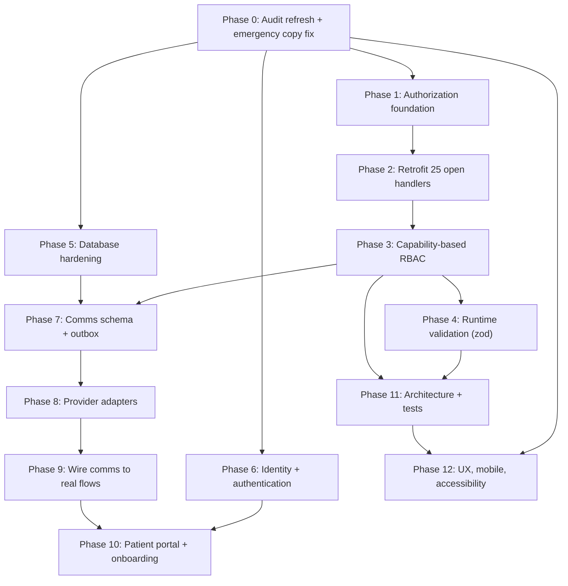

# Aetheria Remediation Master Plan

## 1. Audit status at HEAD (`c443aac`)

The audit is **still valid**. Of the ten critical/high findings re-verified, one is fixed.

- **Fixed:** 4.5 staff notifications, now scoped by `recipient_id` ([clinic.functions.ts:1368](src/lib/clinic.functions.ts)).
- **Still present:** 4.2, 4.3, 4.4, 4.6, 4.7, 4.8, 4.9, 8.2.
- **New since audit:** a fifth `manager` role, staff chat/inbox, ex-team archive, admin-set passwords.

Codebase grew: 75 to 88 handlers, 35 to 43 migrations, `clinic.functions.ts` 2,856 to 4,106 lines. All four god-components grew rather than being split.

**Corrected authorization count** (the audit's "~40 of 75" was an estimate; this is measured):

- 88 handlers total: **53 guarded**, **10 self-scoped by `userId`**, **25 genuinely open**.
- New handlers use `assertStaffPeer` correctly, so the pattern is understood — the old handlers just need retrofitting.

The 25 open handlers, by risk tier:

- **Tier A, PHI reads (6):** `listPatients:637`, `getPatient:683`, `listAppointments:849`, `getPractitionerDay:1486`, `getAppointmentNote:3752`, `listStaffDirectory:1404`
- **Tier B, clinical writes (8):** `updateAppointmentState:1044`, `savePatient:1086`, `addPhoto:1199`, `sendDocument:1226`, `resendDocument:1266`, `sendMessage:1279`, `reviewHistory:1762`, `rescheduleAppointment:3336`
- **Tier C, reference reads (7):** `getCatalogue:820`, `listPractitioners:831`, `listMessageTemplates:1698`, `listTreatmentColours:3385`, `listColourThemes:3437`, `listCatalogueItems:3541`, `getClinicDetails:3623`
- **Tier D, verify self-scoping (4):** `changeOwnPassword:2251`, `acknowledgeWelcome:2274`, `getMyNote:3723`, `saveMyNote:3736`

## 2. RBAC: what exists today

Worth stating clearly, because the foundation is **better than the audit implied** and should not be rebuilt from scratch.

**What is already good:**

- Five roles (`owner`, `manager`, `practitioner`, `front_desk`) plus an implicit patient, in a Postgres `app_role` enum.
- A real `role_permissions` table with `UNIQUE (role, permission)`, `updated_by` and an updated-at trigger.
- Its RLS is correct: reads are `is_staff()`, all writes are `is_owner()`. `user_roles` even prevents an owner removing their own role (`user_id <> auth.uid()`).
- `setRolePermission` ([:3687](src/lib/clinic.functions.ts)) is properly guarded — owner check, permission-key allowlist, and an audit entry.

**The actual gaps:**

1. **The permission surface does not cover clinical work.** All seven keys are `reports.*`, `team.*`, `settings.treatments`, `notifications.delete`, `tasks.delete`. Nothing governs patients, appointments, treatments, documents, photos or messages — those are binary `isStaff`. A front-desk user therefore has the same clinical write access as a practitioner.
2. **Two evaluation paths.** `permissions.ts` exports `can()`, but `clinic.functions.ts` never imports it — the server re-implements permission logic inline, so client and server can drift silently.
3. **Data scoping is ad-hoc, not modelled.** Practitioner "own book" scoping is an inline expression (`identity.isManager || !identity.roles.includes("practitioner")`) repeated in several handlers, rather than a declared property of a capability.
4. **No resource-level rules.** Nothing expresses "a practitioner may edit only their own appointments".
5. **Two keys are UI-only in practice.** `notifications.delete` and `tasks.delete` are checked client-side but not enforced on the mark/dismiss handlers.
6. **No capability for comms.** Phase 9 will let staff send real emails and texts to patients; there is currently no key to govern who may do that.
7. **Adding a role means editing code**, including the hardcoded audience logic at [:1127](src/lib/clinic.functions.ts).

## 3. Authentication: what exists today

- Email/password via Supabase Auth on both `/auth` (staff) and `/portal` (patients).
- **Google OAuth already works**, but through `@lovable.dev/cloud-auth-js` ([auth.tsx:80](src/routes/auth.tsx), [portal.tsx:98](src/routes/portal.tsx)) rather than native `supabase.auth.signInWithOAuth` — a vendor dependency in the authentication path.
- Manager-set temporary passwords plus a `ForcePasswordChangeGate`.

Missing: self-service password reset, MFA, SSO, session management, login rate limiting, and a closed signup. For a system holding special-category health data, **MFA matters more than SSO** and should land first.

## 4. The comms situation

There is no email or SMS provider: no dependency, no `supabase/functions/`, no SMTP in `config.toml`, no `pg_cron`/`pg_net`. But **the UI reports success anyway**, which makes this a safety issue rather than a missing feature:

```javascript
// today-snapshot.tsx:845-875 - checks email exists, writes an IN-APP message, then:
{ onSuccess: () => toast.success(`Consent reminder sent to ${target}`) }
```

`bookingNotifyDescription()` ([payment-link.ts:84](src/lib/payment-link.ts)) does the same for bookings. Staff believe consent reminders and deposit chases went out; nothing left the building. This gets corrected in Phase 0, before any transport work.

What exists to build on: `message_templates` (CRUD, UI-only), `retention_outreach` and `recall_tasks` (intent logs), `documents.access_token` (generated, never emailed). Missing entirely: transport, delivery tracking, opt-out/consent columns, scheduling.

## 5. Artefacts and how phases connect

Three conventions, created in Phase 0:

- **`docs/WORKLOG.md`** — one append-only entry per completed phase: date, commits, what changed, what was verified, what was deferred, residual risk. This is the durable record.
- **`docs/plans/phase-NN-<slug>.md`** — the micro-plan for a phase. Written immediately before that phase starts, when the codebase state is known. Contains per-file task breakdown, acceptance criteria, verification commands, rollback notes.
- **`docs/AUDIT-2026-08-22.md`** — amended once in Phase 0 with a "Status at HEAD" delta section. Findings are never deleted; they are marked resolved with the commit that closed them, so the audit stays a reviewable trail.

**Working loop, per phase:** write the micro-plan, get it approved, build it, verify it, append the work log entry, then update this master plan's todo status. No phase begins without its micro-plan; none closes without a work log entry citing the verification that proves it done.

## 6. Dependency graph



Phases 0, 5 and 6 have no upstream blockers. Everything authorization-critical funnels through Phase 1, and RBAC (Phase 3) must settle before comms (Phase 7) so the new send capability is governed from day one.

**Note on Phase 6:** password reset needs email, but *not* our outbox — Supabase Auth sends its own reset mail once SMTP is configured. That deliberately decouples authentication from Phases 7-9, so MFA and reset can ship early.

## 7. Phases

### Phase 0 — Audit refresh and emergency copy fix (no dependencies)

Highest value per hour in the whole plan; ships same day.

1. Amend `docs/AUDIT-2026-08-22.md` with a "Status at HEAD `c443aac`" section: mark 4.5 resolved, record corrected counts (88/53/10/25), add the `manager` role and staff chat to the role and surface inventory.
2. Add new findings the audit predates: staff-chat attachment paths are client-supplied and unverified (same class as `addPhoto`); `listStaffDirectory` omits `manager` from its role filter ([clinic.functions.ts:1408](src/lib/clinic.functions.ts)), so managers may be missing from alert recipients.
3. **Correct every misleading success message.** `today-snapshot.tsx:871`, `schedule.tsx:1236` and `1049` change to "Reminder posted to their patient portal". `bookingNotifyDescription()` stops claiming email/text.
4. Fix the static booking copy at `schedule.tsx:798` and `836` ("Confirmation is sent by email and text").
5. Create `docs/WORKLOG.md` and `docs/plans/`, seed the templates.
6. Add a `.node-version` file recording Node 22, so the WebSocket failure does not recur for another developer.

### Phase 1 — Authorization foundation (depends on 0)

Build the guard layer once, correctly, before touching 25 handlers.

1. Create `src/lib/auth/guards.server.ts` exporting `requireStaff`, `requirePatientSelf(patientId)`, `requireStaffOrOwnPatient(patientId)`, re-exporting existing `requireOwner`/`requireManager`/`requirePermission`.
2. Add an identity cache keyed on `userId` for the request lifetime — `loadIdentity` currently fires four queries per call, and a page issuing eight server functions runs 32 redundant identity queries.
3. Fix `requireOwner` ([:1873](src/lib/clinic.functions.ts)) to throw on query error rather than treating failure as "not an owner"; apply the same to `requireManager`.
4. Fix `reviewProfileChange` ([:2717](src/lib/clinic.functions.ts)) — destructure and check the status-update error; it currently returns `{ ok: true }` on failure.
5. Make `audit()` failures visible instead of silently discarded across ~40 call sites.
6. Write the guard decision table into the micro-plan: for each of the 25 handlers, which guard applies and why.

### Phase 2 — Retrofit the 25 open handlers (depends on 1)

Work tier by tier, each tier a separate commit and a separate manual role-sweep.

1. **Tier B first** (clinical writes, 8 handlers) — highest consequence. Includes deriving `sendMessage.author` from identity instead of `data.as`, and adding an ownership predicate to `signDocument` and `deleteMyDocument`.
2. **Tier A** (PHI reads, 6 handlers) — `requireStaff`, plus `clinic_id` scoping on `listPatients`/`getPatient` which currently omit it.
3. **Tier C** (reference reads, 7) — `requireStaff`. Low risk, mechanical.
4. **Tier D** (4) — confirm each is genuinely `userId`-scoped; add explicit guards where not.
5. Verify `addPhoto` and `sendStaffChatMessage` storage paths belong to the caller/patient before persisting.
6. After each tier, log in as owner, manager, practitioner, front desk and patient and confirm no regression. Record in the work log.

### Phase 3 — Capability-based RBAC (depends on 2)

Turn the coarse role checks of Phase 2 into a real capability model. Keep the existing `role_permissions` table and its owner-gated RLS — extend, do not replace.

1. **Expand `PERMISSION_KEYS`** from 7 to cover the clinical surface: `patients.view`, `patients.edit`, `patients.delete`, `appointments.view`, `appointments.edit`, `appointments.reschedule`, `treatments.record`, `documents.send`, `documents.sign`, `photos.manage`, `messages.send`, `comms.send`, alongside the existing `reports.*`, `team.*`, `settings.*` and delete keys.
2. **One source of truth.** Server imports `can()` from [permissions.ts](src/lib/permissions.ts); delete every inline permission expression in `clinic.functions.ts`. Client and server then evaluate identically by construction.
3. **Declarative policy map** — a single table mapping handler name to required capability and scope resolver, so authorization is reviewable in one place rather than read from 88 handler bodies. This is also what makes the Phase 11 test suite tractable.
4. **Model data scope explicitly.** Replace the ad-hoc `isManager || !roles.includes("practitioner")` expressions with a declared `scope: "clinic" | "own"` per role per capability, resolved centrally.
5. **Resource-level ownership rules** — practitioners edit only their own appointments and notes unless granted clinic scope.
6. **Seed defaults per role** in a migration: front desk gets scheduling and patient demographics but not clinical records; practitioners get clinical write on their own book; managers get reports and team. Owner keeps everything.
7. **Enforce the two UI-only keys** (`notifications.delete`, `tasks.delete`) on the server handlers.
8. **Effective-permissions viewer** for owners: "what can this person actually do", derived from the same `can()` used at runtime, so the answer cannot be wrong.
9. **Make roles data-driven** where practical, including the hardcoded audience logic at [:1127](src/lib/clinic.functions.ts).
10. Extend `audit()` coverage on every permission and role change (`setRolePermission` already does this; match it elsewhere).

### Phase 4 — Runtime validation (depends on 3)

1. Add zod schemas for all 62 `.validator()` call sites — zod 3.24.2 is already a dependency with zero importers.
2. Start with handlers accepting IDs, money, dates and enums; these are where a malformed payload does damage.
3. Route `saveAppointmentNote` body through the existing `sanitizeNoteHtml` ([:3739](src/lib/clinic.functions.ts)) — it currently stores raw HTML into a clinical record.
4. Share schemas with the client for inline form errors, replacing toast-only server errors.

### Phase 5 — Database hardening (depends on 0, parallel with 1-4)

1. `REVOKE TRUNCATE, DELETE, UPDATE ON ALL TABLES IN SCHEMA public FROM anon` — `anon` currently holds all seven privileges on all 23 tables.
2. Add `UNIQUE` on `patients.user_id` (check duplicates first); `current_patient_id()` is non-deterministic without it.
3. Immutability trigger rejecting updates to signed `documents`.
4. Replace patient `ON DELETE CASCADE` with soft-delete plus legal hold — needs a governance decision on retention first.
5. Decide tenancy: enforce `clinic_id` in RLS and make it `NOT NULL`, or delete the multi-clinic scaffolding. Zero of 84 policies reference `clinic_id` today.
6. Add the nine missing indexes from audit section 5.8.
7. Reconcile the migration ledger: 43 files, some applied out-of-band. Stop editing applied migrations.
8. Move the ES256 service-role workaround out of `auth-middleware.ts`, which is marked auto-generated and would be overwritten.

### Phase 6 — Identity and authentication hardening (depends on 0)

Deliberately independent of the comms outbox: Supabase Auth sends its own transactional mail.

1. **Configure Supabase Auth SMTP** on the clinic domain. This single step unblocks reset, invite and confirmation mail without waiting for Phases 7-9.
2. **Self-service password reset** — `resetPasswordForEmail` plus an `/auth/reset` route, for both staff and patients. Closes audit finding 8.2.
3. **Migrate OAuth to native Supabase.** Replace `@lovable.dev/cloud-auth-js` with `supabase.auth.signInWithOAuth`, removing a vendor dependency from the authentication path and giving control over scopes and redirects. Decision required — see section 9.
4. **Add Microsoft/Azure AD** alongside Google; UK clinics are commonly on Microsoft 365.
5. **TOTP MFA**, enforced for `owner` and `manager` and optional for other staff. Supabase supports AAL2; gate sensitive routes on it. **Prioritise this above SSO** — it is the larger real-world risk reduction for a PHI system.
6. **Domain-restricted staff OAuth** so only clinic-domain Google/Microsoft accounts can reach the staff surface.
7. **SAML SSO** for multi-site clinic groups. Requires a Supabase Pro plan; scope only if that tier is in place.
8. **Session management** — active session list, remote revoke, configurable idle timeout. Reception machines are shared, so idle logout is a practical requirement, not a nicety.
9. **Login rate limiting and lockout** with audit entries on repeated failures.
10. **Close public signup** or add an explicit "awaiting clinic approval" state; today a signup silently produces an unusable account.
11. **Separate the staff and patient auth surfaces** so a patient account cannot authenticate into `/auth` and vice versa.
12. **Step-up re-authentication** for destructive actions: deleting a patient, changing role permissions, revoking staff.

### Phase 7 — Comms schema and outbox (depends on 3, 5)

Transport is built on a durable outbox so a provider outage never silently loses a consent reminder.

1. Migration for `communications`: `id`, `clinic_id`, `patient_id`, `channel` (email/sms), `to_address`, `template_key`, `subject`, `body`, `status` (queued/sending/sent/failed/bounced), `provider`, `provider_message_id`, `error`, `attempts`, `scheduled_for`, `sent_at`, `created_by`, `related_entity`, `related_id`.
2. Migration for patient comms preferences: `email_opt_in`, `sms_opt_in`, `reminders_opt_in`, `marketing_opt_in`, `unsubscribed_at`. UK PECR requires opt-in for marketing; transactional reminders still need an opt-out.
3. RLS: staff read, service-role write, no client writes. Reads gated on the Phase 3 `comms.send` capability.
4. `enqueueCommunication()` server helper — the single write path.
5. Indexes on `(status, scheduled_for)` for the drain query.
6. Correct `retention_outreach` and `recall_tasks` semantics: today `status = "sent"` means "task created", which is misleading in the same way the toasts were.

### Phase 8 — Provider adapters (depends on 7)

1. Email adapter `src/lib/comms/email.server.ts` — Resend recommended (simple API, good UK deliverability, generous free tier).
2. SMS adapter `src/lib/comms/sms.server.ts` — Twilio, with a UK alphanumeric sender ID.
3. Domain setup: SPF, DKIM and DMARC on the clinic domain. Without this, consent emails land in spam and the feature fails in a way that looks like it works.
4. `dispatch.server.ts` — claims a queued row, calls the adapter, records `provider_message_id` or `error`, increments `attempts`, applies backoff.
5. Drain mechanism. Recommended: `pg_cron` + `pg_net` calling a secret-protected server route, since appointment reminders need scheduled sends anyway and this keeps everything inside Supabase. Alternative is a Supabase Edge Function; note this adds a deploy surface the project does not currently have.
6. Provider webhooks for delivery, bounce and complaint, updating `communications.status`.
7. Sandbox mode: in dev and demo, write to the outbox and log instead of dispatching.

### Phase 9 — Wire comms to real flows (depends on 8, 4)

Each item replaces a currently-fake path from Phase 0, and each is gated on the `comms.send` capability from Phase 3.

1. **Consent documents** — build the signing URL from `documents.access_token`, add the public signing route (none exists), email and optionally text it on `sendDocument`/`resendDocument`.
2. **Booking confirmations** — dispatch `bookingDetailsMessage()` on `saveAppointment`, keeping the portal message as a secondary channel.
3. **Appointment reminders** — scheduled sends at a configurable offset. This is the feature with the clearest revenue impact via no-show reduction.
4. **Deposit and payment chasing** — wire the payment chip to real dispatch.
5. **Recall and retention** — replace the `mailto:`/`sms:` handoff in `send-recall-dialog.tsx:183-197` with real sends, keeping manual logging for phone calls.
6. **Staff invitations** — switch to `inviteUserByEmail`/`generateLink`; stop returning plaintext temporary passwords to the UI.
7. Wire `message_templates` into dispatch, with variable interpolation.
8. Unsubscribe handling and a comms audit trail on the patient record.

Calls stay click-to-dial: keep `tel:` links, but log call attempts against `communications` so outreach history is complete.

### Phase 10 — Patient portal and onboarding (depends on 6, 9)

1. Portal invitations linking `patients.user_id` to an auth account. No code path exists today, which is why `patients.user_id` is never set.
2. Storage policy letting patients read their own `patient-photos`; before/after images cannot currently be shown in the portal.
3. Fix the before/after picker so photo type is chosen explicitly rather than inferred from which control was used.
4. Portal-side consent and medical-history UX, including the labelled signature field from Phase 12.

### Phase 11 — Architecture and tests (depends on 3, 4)

1. `IdentityProvider` at the layout: removes 13 duplicated loading gates and ~15 surplus realtime channels.
2. Error UI for data queries — only one file in `src/routes` references `isError`; 13 routes render an indefinite "Loading...".
3. Extract `lib/appointment-stage.ts`; deduplicate `ConsentChip`, `PaymentChip`, `StageTracker`.
4. Split `schedule.tsx` (2,344 lines) into planner, week, month and booking dialog; then `today-snapshot.tsx` (1,112) and `patients.$id.tsx` (1,117).
5. One shared booking dialog and a single `invalidateAppointmentCaches()` helper, replacing three copies.
6. Decompose `clinic.functions.ts` (4,106 lines) into auth, audit and per-domain modules; type `Ctx.supabase` as `SupabaseClient<Database>` instead of `any`.
7. Unify live and demo behind shared services so they cannot diverge — demo is currently *stricter* than production in places.
8. Test suite, starting with the Phase 3 policy map: assert every handler's required capability for all five roles. That matrix is the regression that matters most.

### Phase 12 — UX, mobile, accessibility (depends on 0; polish after 11)

1. **Mobile drawer** in `app-shell.tsx` using the already-present but unimported `ui/sidebar.tsx` Sheet and `use-mobile.tsx`. At 390px the sidebar takes 285px and content is clipped, not scrollable, so it is unreachable.
2. Retention page: mirror the permission redirect in `performance.tsx:61` instead of rendering fabricated zeros.
3. Fix the "Manager access only" copy at `team.$id.tsx:79` — the real gate is the `team.view` permission.
4. Skip links, `aria-live` on arrival alerts, `aria-pressed` on diary view toggles, label the portal consent signature field.
5. Unsaved-changes protection; confirmation on staff revoke; disable submit during mutation on Record Treatment.
6. Contrast measurement pass on the glass theme.
7. Memoise the patients filter/sort; virtualise long lists.
8. Fix the Tiptap duplicate-extension warning.

## 8. Sequencing summary

Security precedes comms, per your decision. Phase 0 ships immediately because the misleading toasts are a live clinical risk that costs an hour to remove. Phases 1-4 close authorization, RBAC and validation so the new handlers in Phase 9 inherit a correct pattern instead of repeating the old one. Phases 5 and 6 run in parallel — one is pure SQL, the other is auth configuration, and neither blocks the other.

## 9. Open decisions to resolve in micro-plans

- **OAuth ownership** (Phase 6.3): keep `@lovable.dev/cloud-auth-js`, or move to native Supabase OAuth. Native gives control and removes a vendor from the auth path; the Lovable wrapper is less work today.
- **SSO tier** (Phase 6.7): SAML needs a Supabase Pro plan. Confirm before scoping.
- **MFA enforcement scope** (Phase 6.5): all staff, or owner and manager only.
- **Retention versus erasure** (Phase 5.4): needs a governance ruling before code.
- **Tenancy** (Phase 5.5): commit to single-clinic or enforce multi-clinic.
- **Drain mechanism** (Phase 8.5): `pg_cron` + `pg_net` versus an Edge Function.
- **Provider accounts**: Resend and Twilio need billing and a verified clinic domain before Phase 8 can be tested end to end.

## 10. Explicit non-goals

No real telephony (Twilio Voice, call recording, IVR) — calls stay click-to-dial per your decision. No dependency upgrades beyond what comms and auth require. No visual redesign; the Aetheria theme stays. Compliance items are engineering observations, not legal sign-off.
