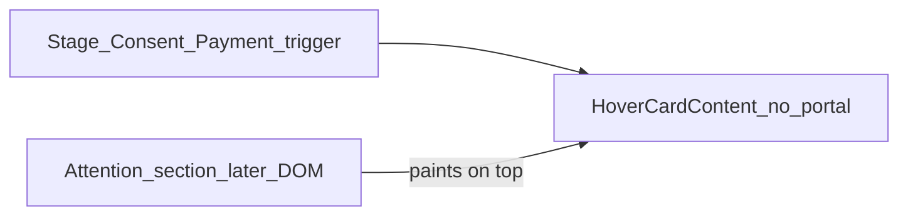

# Fix hover stacking, shadows, notes, and interactive polish

## Root causes (bugs)

1. **Hover menus behind Attention Needed** — [`hover-card.tsx`](src/components/ui/hover-card.tsx) renders `Content` **without** a Radix `Portal`. Stage / Consent / Unpaid menus in [`today-snapshot.tsx`](src/components/dashboard/today-snapshot.tsx) stay inside the diary card stacking context (`.glass-card > * { z-index: 1 }`), so later sections paint over them.
2. **Flat white cards** — `--shadow-glass` is nearly invisible on `#f6f7f8`.
3. **Notes height** — manual drag handles; textarea does not grow with content.
4. **Weak clickable feedback** — primary buttons only use `hover:brightness`; outline/ghost use a light `accent-wash` that barely reads on the wash background; many chip/pills lack a darker pressed state.

---

## 1. Portal HoverCard

In [`src/components/ui/hover-card.tsx`](src/components/ui/hover-card.tsx):

- Wrap content in `HoverCardPrimitive.Portal` (match [`popover.tsx`](src/components/ui/popover.tsx)).
- Keep `z-50`; apply popover elevation shadow (see §2).

In [`today-snapshot.tsx`](src/components/dashboard/today-snapshot.tsx):

- Unify Stage / Consent / Payment menus: `bg-card`, `border-edge-2`, shared elevated shadow; anchor with `side="bottom"` + `align="end|start"`.
- Remove redundant `z-[60]`.

---

## 2. Contrasting shadows on cards and pop-ups

In [`src/styles.css`](src/styles.css):

- Strengthen `--shadow-glass` (multi-layer ink drop + inset highlight) so `.glass-card` / `.glass-panel` lift from the wash.
- Add `--shadow-popover` stronger than cards.
- Bump `--shadow-lift` so hover lift still reads above the new base.

Apply `--shadow-popover` to HoverCard, Popover, Dropdown, Select, Dialog, Sheet (and Tooltip if it uses glass shadow).

---

## 3. My Notes: auto-grow only

In [`notes-panel.tsx`](src/components/dashboard/notes-panel.tsx):

- Remove height + corner resize; keep width-only resize on `lg+`.
- Content-driven height; compact empty min-height (~160–200px).

In [`ios-notes-editor.tsx`](src/components/notes/ios-notes-editor.tsx):

- Auto-size textarea via `scrollHeight` on value change; `resize-none`; stop using `flex-1` fill.

---

## 4. Darker highlights on clickable controls

Stack: **Radix** (behavior) + **Tailwind** + **CVA** (variants). Best practice from Radix/Tailwind design-system guides: every interactive surface needs distinct **hover → active → focus-visible**, not hover alone; prefer `focus-visible` rings; use `active:` for press; keep transitions ~150–200ms.

### Button primitive ([`button.tsx`](src/components/ui/button.tsx))

Current gaps: default only brightens; outline/ghost wash is too light; no dedicated darker `active:` fill beyond `active:scale-[0.98]`.

Implement:

- **default:** keep bloom; add `hover:brightness-[1.05]` + `active:brightness-[0.92]` (or slight darker gradient stop) so press reads clearly.
- **outline / secondary / ghost:** darker hover wash — prefer `hover:bg-[rgba(47,63,102,0.08)]` / `hover:bg-glass` with `hover:border-edge-2`, and `active:bg-[rgba(47,63,102,0.14)]` (ink tint, not only gold wash). Keep a light gold tint optional via `accent-wash` layered under, but ink tint must be the dominant “I’m clickable” cue.
- **destructive:** `active:bg-destructive/80`.
- Keep `focus-visible:ring-2` and `duration-200`.

### Chip / pill clickables (same pass)

Apply the same darker hover/active pattern to:

- Stage / Consent / Payment triggers in [`today-snapshot.tsx`](src/components/dashboard/today-snapshot.tsx)
- Day/Week / Quick book controls on the dashboard (and schedule view toggles if they share classes)
- [`tabs.tsx`](src/components/ui/tabs.tsx) inactive triggers: add `hover:bg-[rgba(47,63,102,0.06)]`
- [`period-picker.tsx`](src/components/period-picker.tsx) if still soft-only on hover
- Nav items in [`app-shell.tsx`](src/components/app-shell.tsx) already use `accent-wash`; deepen inactive hover slightly for consistency

Do **not** invent a second button system — extend `buttonVariants` and reuse `buttonVariants({ variant: "ghost"|"outline", size: "…" })` on chip triggers where practical.

---

## 5. UI aesthetics audit (screenshots + current work)

### What works

- Clear brand lockup (Æ), warm butter accent, soft pastel status lanes.
- Sidebar IA (Clinic / Reports / Practitioners) is scannable.
- KPI chips communicate change / risk denser than old % arrows.
- Empty states for tasks / attention are intentional.

### Friction from screenshots + live UI

| Issue | Why it hurts | Direction |
|-------|--------------|-----------|
| White cards on near-white wash | No depth | Stronger `--shadow-glass` (§2) |
| Hover menus under Attention | Broken interaction | Portal HoverCard (§1) |
| Soft gold-only hovers | Low affordance | Darker ink hover/active (§4) |
| Notes manual resize | Fights “notes grow with text” mental model | Auto-grow (§3) |
| KPI + diary + Attention density | First viewport feels busy on narrow widths | Keep layout; ensure hierarchy via shadow/type, not more chrome |
| Chip menus (journey / pay / consent) look like popovers but were translucent/glass | Hard to read over busy cards | Solid `bg-card` + popover shadow |
| Empty dashed panels vs solid cards | Mixed elevation language | Empty states: dashed `edge-2` + no heavy shadow; solid cards get elevation |
| Sticky toolbar ghost icons | Hard to find until scroll | Scrolled outline already helps; ensure idle hover is darker (§4) |

### Component inventory (what we have)

**Primitives (`src/components/ui/` — shadcn-style on Radix):** accordion, alert, alert-dialog, aspect-ratio, avatar, badge, breadcrumb, button, calendar, card, carousel, chart, checkbox, collapsible, command, context-menu, dialog, drawer, dropdown-menu, form, hover-card, input, input-otp, label, menubar, navigation-menu, pagination, popover, progress, radio-group, resizable, scroll-area, select, separator, sheet, sidebar, skeleton, slider, sonner, switch, table, tabs, textarea, toggle, toggle-group, tooltip.

**Product / feature components (built for Aetheria):**

- Shell / brand: `app-shell`, `brand-mark`, `notification-bell`, `arrival-alerts`, `demo/role-switcher`
- Dashboard: `kpi-grid`, `today-snapshot`, `attention-list`, `follow-up-tasks`, `notes-panel`, `role-shortcuts`
- Booking: `quick-add-appointment`, `appointment-time-editor`, schedule blocks in routes
- Retention: `at-risk-table`, `retention-breakdown`, `suggested-actions`, `send-recall-dialog`, `staff-task-hovercard`, `risk-badge`, `recall-tasks-panel`, `retention-trend`
- Performance: `performance-table`, `performance-trends`
- Settings / team: `treatment-catalogue-settings`, `clinic-details-settings`, `access-control-settings`, `invite-staff-dialog`, `staff-files`, `staff-alert-dialog`
- Notes / messaging: `ios-notes-editor`, `message-composer`, `message-attachments`, `visit-note-chip`
- Misc: `period-picker`, `practitioner-hovercard`, `colour-wheel-button`, `drilldown-date-picker`, `no-show-followup-dialog`, `route-error-boundary`

### Radix + Tailwind improvements that fit this product

Prioritize changes that reuse tokens and existing primitives (no new component libraries).

**In scope for this plan (implement):**

1. Portal + elevation for floating layers (HoverCard parity with Popover).
2. Stronger surface shadows (cards vs popovers).
3. Darker interactive states on Button + key chips/tabs.
4. Notes auto-grow.
5. Small consistency: TabsTrigger hover wash; diary chip menus solid surface.

**Suggested follow-ups (document only — not blocking this PR unless quick):**

- Prefer **Popover** (click) over HoverCard for stage/payment actions on touch devices; keep HoverCard for desktop previews or add click-to-pin. Clinic staff often use iPads.
- Use Radix **Tooltip** on icon-only toolbar actions (megaphone, bell, panel toggle) for discoverability.
- Standardize empty states as one small pattern component (icon + title + hint) instead of one-off dashed boxes.
- Ensure `data-[state=open]` styles on DropdownMenuTrigger / SelectTrigger match button hover language.
- Consider `ScrollArea` for long hover menus (journey list) instead of overflowing the viewport.
- Mobile shell: sidebar still needs a Sheet drawer later (called out in prior audit) — out of scope here.

---

## Files to touch (implementation)

| File | Change |
|------|--------|
| [`src/components/ui/hover-card.tsx`](src/components/ui/hover-card.tsx) | Portal + popover shadow |
| [`src/styles.css`](src/styles.css) | Stronger `--shadow-glass`, `--shadow-popover`, maybe `--shadow-lift` |
| [`src/components/ui/button.tsx`](src/components/ui/button.tsx) | Darker hover/active per variant |
| [`src/components/ui/tabs.tsx`](src/components/ui/tabs.tsx) | Darker inactive hover |
| [`src/components/ui/popover.tsx`](src/components/ui/popover.tsx) | Popover shadow |
| [`src/components/ui/dropdown-menu.tsx`](src/components/ui/dropdown-menu.tsx) | Popover shadow |
| [`src/components/ui/select.tsx`](src/components/ui/select.tsx) | Popover shadow |
| [`src/components/ui/dialog.tsx`](src/components/ui/dialog.tsx) | Popover shadow |
| [`src/components/ui/sheet.tsx`](src/components/ui/sheet.tsx) | Popover shadow if applicable |
| [`src/components/dashboard/today-snapshot.tsx`](src/components/dashboard/today-snapshot.tsx) | Chip menu surface + chip hover/active |
| [`src/components/dashboard/notes-panel.tsx`](src/components/dashboard/notes-panel.tsx) | Remove height drag |
| [`src/components/notes/ios-notes-editor.tsx`](src/components/notes/ios-notes-editor.tsx) | Textarea auto-grow |
| [`src/routes/_authenticated/dashboard.tsx`](src/routes/_authenticated/dashboard.tsx) | Day/Week/Quick book hover if custom (not Button) |

---

## Verification

- Booked / Consent / Unpaid menus fully above Attention Needed, anchored to chips.
- Cards and popovers clearly elevated from the wash.
- Hovering / pressing Button (all variants), tabs, and diary chips shows a **darker** wash; press darker than hover.
- My Notes grows with text; no bottom/corner drag; width drag on desktop still works.
- Spot-check: schedule view toggles, account menu, notification icon hover.
