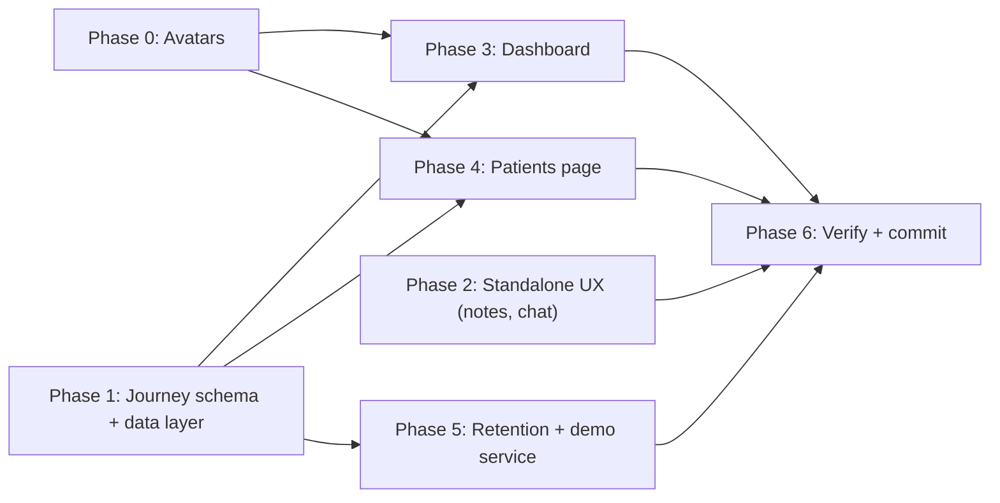

# Clinic portal upgrade from v3 mockups

Per your choices: journeys get a real DB schema; the Patients Metrics tab shows patient-base metrics; the collapsed chat is a floating bottom-right bubble; the Task column shows open recall tasks + chase items. Additionally: **every patient card shows an AI-generated photo avatar** like the mockups, the plan is split into dependency-ordered phases (least dependent first), every phase has granular to-dos plus a work log, and the build ends with a **commit to `patient0` pushed with Zaisam's token**.

## Phase ordering

---

## Phase 0 — Patient avatar assets + component (no dependencies)

Every patient card across the portal gets a small AI-generated photo avatar, as in the mockups.

- Reuse the seven existing headshots from [docs/patient-portal/v3/public/assets](docs/patient-portal/v3/public/assets) (emma, alex, grace, priya, leila, theo, chen) and generate ~6 more with `GenerateImage` (varied age/gender/skin tone, same soft off-white style) for a pool of ~12; downscale to 256px and place in the app's `public/patient-avatars/`.
- New shared `src/components/patient-avatar.tsx`: deterministic mapping `hash(patientId) -> avatar index` so a patient always gets the same face; initials fallback; `size` variants (table 24px, card 34px, header 56px); accepts a future `photoUrl` override so real photos can replace the generated pool later without touching call sites. Demo fixture for Grace pins the grace headshot for continuity.
- Surfaces that adopt it (in their phases): dashboard TodayCard, Safe-to-proceed rows, Active treatment journeys rows, patients Records table, Journey board cards, patient record header, retention at-risk table, follow-up task rows.

**To-dos:** `p0-avatars-gen`, `p0-avatar-component`

**Work log:**
- Generated 6 new headshots (avatar-p1…p6: man 40s, Black man 30s, woman late 50s, Latina woman 30s, South Asian man late 20s, red-haired woman early 20s) via GenerateImage.
- `public/patient-avatars/` now holds the 12-image pool (6 reused from `docs/patient-portal/v3/public/assets`, 6 new, all ≤256px, 196 KB total). Excluded the white-coat `avatar-chen` from the patient pool.
- New [src/components/patient-avatar.tsx](src/components/patient-avatar.tsx): FNV-1a hash of `patientId` → pool index (stable face per patient), `photoUrl` override seam, `onError`/no-id fallback to an initials disc (`bg-accent-soft` + `shadow-inset-hi`), sizes xs 24 / sm 28 / md 34 / lg 56 or custom px. Exported `patientAvatarUrl()` for non-component uses.
- Decision: skipped pinning demo-Grace to the grace headshot — deterministic hashing already guarantees a stable face per patient; pinning would have required plumbing an avatar field through prod+demo response shapes for no functional gain.
- Verified: `tsc --noEmit` clean; `ring-edge`/`bg-accent-soft` confirmed as valid theme tokens (`--color-edge` in styles.css @theme).

---

## Phase 1 — Journey schema + data layer (foundation for phases 3–5)

New migration `supabase/migrations/<ts>_treatment_plans.sql` following the comms-outbox pattern (tight grants, staff policies, RESTRICTIVE `clinic_isolation`):

- `treatment_plans`: `id, clinic_id, patient_id, practitioner_id, catalogue_id?, name, phase (enum: consult | foundation | build | results), status (active | completed | cancelled), total_sessions, started_at, created_at…`
- `plan_milestones`: `id, clinic_id, plan_id, idx, title, kind (session | task | conditional), status (upcoming | current | done | skipped), due_date?, appointment_id?, completed_at?`

Wiring required by the check scripts: add both tables to [src/integrations/supabase/types.ts](src/integrations/supabase/types.ts) and to `CLINIC_SCOPED_TABLES` in [src/lib/auth/clinic-scope.server.ts](src/lib/auth/clinic-scope.server.ts); apply via `node scripts/apply-migrations.mjs`.

Server functions appended to [src/lib/clinic.functions.ts](src/lib/clinic.functions.ts) (each with a `POLICY` entry in [src/lib/auth/policy.ts](src/lib/auth/policy.ts), zod schema in [src/lib/validation/schemas.ts](src/lib/validation/schemas.ts), matching demo export + fixtures):

- `listTreatmentPlans({ practitionerId?, atRiskOnly?, query? })` — board data: plan + patient + practitioner + milestone progress + next milestone + at-risk flag (next milestone overdue / no upcoming appointment)
- `createTreatmentPlan`, `updatePlanMilestone` — minimal CRUD so the board is real
- Extend `getDashboard` to also return `journeys` (active-plan count, per-phase groupings) and `safeToProceed` (upcoming appointments with blocking items: consent due, deposit unpaid, balance due, allergy alert)

**To-dos:** `p1-migration`, `p1-wiring`, `p1-functions`, `p1-demo`

**Work log:**
- Migration `supabase/migrations/20260917000000_treatment_plans.sql`: 4 enums, `treatment_plans` + `plan_milestones` with board/patient/practitioner indexes, staff-manage + patient-read-own policies, RESTRICTIVE `clinic_isolation`, Phase 5.1-style grants. Applied via `scripts/apply-migrations.mjs` (ledger 58 applied, 0 pending).
- Wiring: both tables + 4 enums added to [src/integrations/supabase/types.ts](src/integrations/supabase/types.ts) (alphabetical, full Row/Insert/Update/Relationships) and to `CLINIC_SCOPED_TABLES` — `check:tenancy` passes (25 clinic-scoped tables).
- [src/lib/clinic.functions.ts](src/lib/clinic.functions.ts): `getDashboard` extended with a second fan-out (active plans + milestone counts + today/tomorrow booked appointments) returning `journeys` (activeCount + per-phase plan groups, practitionerOwnBook-scoped), `safeToProceed` (blockers: consent not signed / deposit unpaid / balance due / allergy, capped at 8) and `safeReadyCount`. New handlers appended: `listTreatmentPlans` (progress, next milestone, at-risk = overdue next step or no upcoming booking, practitioner/at-risk/query filters), `createTreatmentPlan` (plan + milestones, first step current, audited), `updatePlanMilestone` (status change, auto-promote next step, auto-complete plan, audited).
- Policy entries: `listTreatmentPlans` staff; create/update share `treatments.record`. Schemas `ListTreatmentPlans` / `CreateTreatmentPlan` / `UpdatePlanMilestone` in schemas.ts.
- Demo twins in [src/lib/clinic.functions.demo.ts](src/lib/clinic.functions.demo.ts) with identical validators; fixtures in [src/lib/demo/data.ts](src/lib/demo/data.ts): 10 plan recipes across all four phases (two at-risk via overdue step, one via no upcoming booking) with 3–8 milestones each, plus stable `avatar_url` pool assignment for all 33 demo patients.
- Verified: `check:policy` 104 handlers ok, `check:validators` 74 validators prod↔demo in step, `check:tenancy` ok, tsc error set identical to the pre-change baseline (59, all pre-existing).

---

## Phase 2 — Standalone UX: floating notes + collapsible chat (no schema dependency)

- **Notes → movable card** ([src/routes/_authenticated/dashboard.tsx](src/routes/_authenticated/dashboard.tsx)): remove `<NotesPanel />` from the bottom row; add a notes icon button in the `.page-header` (top right) opening a floating draggable card (drag pattern cloned from `offset`+`translate` grip in [src/components/quick-add-appointment.tsx](src/components/quick-add-appointment.tsx)), reusing `RichNotesEditor` + existing `getMyNote`/`saveMyNote`; open state and position persist in localStorage.
- **Collapsible chat** ([src/routes/_authenticated/patients.$id.tsx](src/routes/_authenticated/patients.$id.tsx) + [src/components/patient-chat-panel.tsx](src/components/patient-chat-panel.tsx)): minimise button in the panel header; collapsed (persisted) state collapses the `--chat-width` grid column to single-column and shows a floating chat bubble fixed bottom-right (composing with the existing alert stack in `app-shell.tsx`) with an unread badge; clicking restores the panel.

**To-dos:** `p2-notes`, `p2-chat`

**Work log:**
- New [src/components/dashboard/floating-notes.tsx](src/components/dashboard/floating-notes.tsx): header icon button (aria-pressed pill) + portal card (380px, max-h 70vh) that drags by its grip header using QuickAdd's offset pattern, clamped to the viewport; position (`aetheria.notes-float-pos`) and open state (`aetheria.notes-float-open`) persist; Escape closes. Save logic (react-query + 900ms autosave + pagehide/visibility flush) carried over from the old panel, still on `getMyNote`/`saveMyNote`.
- [dashboard.tsx](src/routes/_authenticated/dashboard.tsx): `<FloatingNotes />` added as the page-header's right-aligned child; `<NotesPanel />` removed from the bottom row; `notes-panel.tsx` deleted (fully superseded).
- [patient-chat-panel.tsx](src/components/patient-chat-panel.tsx): optional `onCollapse` prop renders a Minus minimise button in the header.
- [patients.$id.tsx](src/routes/_authenticated/patients.$id.tsx): `chatCollapsed` state persisted under `aetheria.patient-chat-collapsed`; collapsed layout drops the `--chat-width` grid column; new `ChatBubble` (52px, `bg-primary`, unread badge counting unread patient messages) fixed bottom-right.
- Two placement collisions found by the live probe and fixed: the corner at `bottom-5 right-5` is owned by the demo role switcher and the arrival/urgent alert stack, so the bubble sits at `bottom-24` with `z-[60]` (a reachable 52px bubble beats a momentarily overlapped alert corner).
- Verified live in `dev:demo` with Playwright: notes card opens/drags/persists position + open state across reload; chat minimises to bubble, restores, and the expanded state survives reload; zero console/page errors.

---

## Phase 3 — Dashboard upgrade (depends on Phases 0 + 1)

- **Appointment cards** — restyle `TodayCard` in [src/components/dashboard/today-snapshot.tsx](src/components/dashboard/today-snapshot.tsx) to the Journey-mockup design: time range + status chip top row, **PatientAvatar** beside the patient name, "Session X of Y" (from the active plan when present, else `#treatment_number`), treatment line, "⚕ practitioner", chips row (consent / payment / visit note). All existing behaviour kept; glass styling; no left accent rails.
- **Active skin plans KPI** — new item in [src/components/dashboard/kpi-grid.tsx](src/components/dashboard/kpi-grid.tsx) (value from `journeys.activeCount`, chip "patients on a treatment journey"), linking to Patients → Journey board.
- **Safe to proceed** — new `src/components/dashboard/safe-to-proceed.tsx` under the "Attention needed" title beside `FollowUpTasks` (bottom row now full-width: `AttentionList`, then `FollowUpTasks | SafeToProceed`); avatar rows from `getDashboard.safeToProceed`, each linking to the patient.
- **Active treatment journeys** — new `src/components/dashboard/treatment-journeys.tsx` at the page bottom: three phase columns (Foundation / Build & Support / Results) with progress track and per-plan avatar rows (patient, plan, X of Y) linking to the record; "View journey board →" link.

**To-dos:** `p3-today-cards`, `p3-kpi`, `p3-safe`, `p3-journeys`

**Work log:**
- [today-snapshot.tsx](src/components/dashboard/today-snapshot.tsx): `TodayCard` restyled to the Journey mockup — time + stage chip top row, `PatientAvatar` (md) beside the name, "Session X of Y · treatment" line (clamped: falls back to `#n` when the appointment number exceeds the plan's session count), "⚕ practitioner" row for managers, chips row unchanged. All behaviour kept (time editor, stage menu, detail dialog).
- `getDashboard` (prod + demo) now attaches `plan { name, totalSessions }` per today-appointment via a patient→active-plan map, and the diary join selects `avatar_url`.
- [kpi-grid.tsx](src/components/dashboard/kpi-grid.tsx): "Active skin plans" card (Layers icon, value `journeys.activeCount`, rose/mint "N overdue steps" chip from a new `journeys.overdueCount`, links to `/patients?tab=board`); grid now handles 5 cards (`lg:grid-cols-3 xl:grid-cols-5`).
- New [safe-to-proceed.tsx](src/components/dashboard/safe-to-proceed.tsx): avatar rows with when-label and blocker chips (allergy = destructive tone, others warning tone), empty state, each row links to the patient. Sits in a new two-column grid beside `FollowUpTasks` under the Attention section (bottom row now full-width since notes floated away in Phase 2).
- New [treatment-journeys.tsx](src/components/dashboard/treatment-journeys.tsx): four phase columns (only non-empty phases render) with count, sub-line, avatar rows, inset progress bars and "X of Y", plus a "View journey board →" link.
- `tab` added to the patients route `validateSearch` (records | metrics | board) so the two new links type-check — the tab UI itself is Phase 4.
- Verified live in dev:demo (screenshots): 5 KPI row, avatar diary cards with session lines, Safe-to-proceed populated with real blockers (consent/deposit/balance/allergy), journeys section grouped by phase; zero console errors; tsc delta vs baseline back to zero after widening `photoUrl` for exactOptionalPropertyTypes.

---

## Phase 4 — Patients page: three tabs (depends on Phases 0 + 1)

Segmented pill control (PeriodPicker markup, placed in `.page-header` right of the title per the pill-controls rule) driving a `tab` search param in [src/routes/_authenticated/patients.index.tsx](src/routes/_authenticated/patients.index.tsx): **Records | Metrics | Journey board**.

- **Records** — columns: Patient (**avatar** + name + ref), Last treatment, Next treatment, Active practitioner(s), Task, Status (drop Next due and Paperwork). Extend `listPatients` fan-out with one `recall_tasks` select (open/contacted grouped by patient) and practitioner names from already-fetched treatments/appointments. Task renders as a count chip with a HoverCard listing open recall tasks + chase items (consent due / deposit unpaid / balance due).
- **Metrics** — new `src/components/patients/patient-metrics.tsx` + `getPatientMetrics` server fn (with demo twin): stat cards (active / inactive / new this month / treatments due) plus charts — new patients per month, status split, top treatments, due-vs-overdue.
- **Journey board** — new `src/components/patients/journey-board.tsx` fed by `listTreatmentPlans`: four phase columns of plan cards (**avatar**, patient, plan, progress fraction, next milestone + when, on-track/at-risk chip), practitioner filter, at-risk-only toggle, search. **Role defaults via `useIdentity()`**: owners/managers/front-desk default to all practitioners; a practitioner defaults to "My patients" with a toggle to "All patients".

**To-dos:** `p4-tabs`, `p4-records`, `p4-metrics`, `p4-board`

**Work log:**
- [patients.index.tsx](src/routes/_authenticated/patients.index.tsx): segmented pill (Records | Metrics | Journey board) in the page-header right group per the pill-controls rule, driven by the `tab` search param; subtitle adapts per tab; search/DOB/New-patient controls only render on Records.
- Records table columns now Patient (PatientAvatar sm + name + ref), Last treatment, Next treatment, Active practitioner(s) (`PractitionersCell`: first two + "+n"), Task (`TaskCell`: warning count chip with HoverCard listing each open item and its kind), sortable Status. Next-due and Paperwork columns and their sorts removed.
- `listPatients` (prod + demo) extended in one extra fan-out: open recall tasks per patient, practitioner names (next booking's owner first, then recent treaters), and derived chase items (forms awaiting signature, treatment overdue) returned as `practitioners` + `openTasks`.
- New `getPatientMetrics` (prod + demo, POLICY staff, no input): totals, monthly new patients (12 months), top treatments (12 months), due-by-month (6 months) + overdue backlog. New [patient-metrics.tsx](src/components/patients/patient-metrics.tsx): 4 stat cards + recharts bar (new patients), donut (active/inactive), top-treatments progress list, due-vs-overdue bars (overdue cell in rose).
- New [journey-board.tsx](src/components/patients/journey-board.tsx) on `listTreatmentPlans`: four phase columns of avatar cards (plan, progress fraction + bar, next milestone with due label, overdue in destructive tone, on-track/at-risk chip, practitioner). Filters: practitioner select (managers/front-desk), at-risk-only toggle with live count, debounce-free search. **Role default**: practitioners open on "My patients" with an inline "My patients | All patients" pill; everyone else sees the whole clinic with a practitioner select.
- Verified in dev:demo (screenshots of all three tabs): tabs switch, avatars render, Task chips show "N open", board shows 4 columns with risk chips ("Next step overdue", "No upcoming booking") and the at-risk counter (5); zero console errors; tsc delta zero; `check:policy` 105 handlers.

---

## Phase 5 — Retention + demo data service (depends on Phase 1)

- **Mock data service** — enrich the `DEMO=1` fixtures in [src/lib/demo/data.ts](src/lib/demo/data.ts) (more patients, treatments, outreach history, varied risk tiers, treatment plans) so retention, the journey board and the dashboard journeys render richly in demo mode.
- **Where to focus** — extract suggestion computation from `retention.server.ts` into a typed insights engine `src/lib/retention-insights.server.ts` (pure function returning `{ id, severity, icon, title, detail, filter }`), shaped so an API/model-driven engine can replace it later. Upgrade [src/components/retention/suggested-actions.tsx](src/components/retention/suggested-actions.tsx) rows to the v3 style (icon tile + title + detail + chevron) inside the existing `glass-item` buttons, keeping click-to-filter. At-risk table rows adopt **PatientAvatar**.

**To-dos:** `p5-demo-service`, `p5-insights`

**Work log:**
- Demo data service: Phase 1 already added 10 treatment-plan recipes + per-patient avatar assignment; this phase added five more `retention_outreach` fixtures across phone/email/portal channels (feeding the at-risk outreach trail) — the retention page was audited first and already renders richly (71% rate, full trend, populated at-risk tiers), so enrichment was targeted rather than wholesale.
- New [src/lib/retention-insights.server.ts](src/lib/retention-insights.server.ts): the five suggestion rules extracted from `retention.server.ts` into a pure `deriveRetentionInsights(signals) → RetentionInsight[]` engine, each insight typed with `severity` (urgent/attention/opportunity) and `icon`; the header comment documents the replace-the-body seam for a future API/model-driven recommender. `buildRetention` now just delegates, and demo mode inherits it automatically (the demo `getRetention` imports the same builder).
- [suggested-actions.tsx](src/components/retention/suggested-actions.tsx) upgraded to the v3 row style: severity-toned icon tile (destructive/warning/success) + title + detail + chevron, click-to-filter preserved; subtitle now sets the "engine improves with data" expectation.
- [at-risk-table.tsx](src/components/retention/at-risk-table.tsx): patient cell adopts `PatientAvatar` (xs).
- Verified in dev:demo: retention renders the new insight rows with tiles, avatars in the at-risk table, zero console errors, tsc delta zero.

---

## Phase 6 — Verification + commit (depends on all phases)

- `npm run check:policy && npm run check:validators && npm run check:tenancy`, `tsc --noEmit`, migration ledger clean.
- Demo-mode Playwright sweep (`npm run dev:demo`): dashboard renders all new sections with avatars, notes card drags and persists, patients tabs switch with the Task column populated, journey board role defaults verified via the demo role switcher, chat collapses to the bubble and restores, retention shows enriched data with the new insight rows.
- Ensure every phase's **Work log** section in this plan is filled in as that phase completes (files touched, decisions, verification results) so code maps back to the plan, then **commit everything to `patient0` and push with Zaisam's token** via the token URL (keychain untouched), as done for previous pushes.

**To-dos:** `p6-checks`, `p6-sweep`, `p6-commit`

**Work log:**
- Checks: `check:policy` ok (105 handlers, all authorized), `check:validators` ok (74 validators, prod↔demo in step), `check:tenancy` ok (34 tables classified, 25 clinic-scoped incl. the two new plan tables), migration ledger 58/58 applied 0 pending, `tsc --noEmit` error set byte-identical to the pre-change HEAD baseline (59 pre-existing errors, zero introduced).
- Playwright sweep in `dev:demo` — 23/23 checks, zero console/page errors: Active-skin-plans KPI, Safe-to-proceed and Active-treatment-journeys sections render with 26 loaded avatar images and "Session X of Y" diary lines; notes card opens, drags, and open state + position survive reload; Records tab shows the practitioner column and Task chips with working HoverCard; Metrics tab renders its recharts; board's at-risk toggle filters 10 → 5 cards; **role default verified via the demo_role cookie** — a practitioner (Dr Nadia Rahman) lands on "My patients" (only her plans on the board), toggles to "All patients" and the board widens, while the owner gets the practitioner select; chat minimises to the bubble and restores; retention shows the severity-tiled insight rows, avatar at-risk rows, and insight-click filtering.
- Committed everything to `patient0` and pushed with Zaisam's token via the token URL (keychain untouched); local `origin/patient0` tracking ref synced.

---

## Out of scope

Patient-portal surfaces, the v1–v3 docs (untouched), plan-authoring UI beyond minimal create/update, real patient photo upload/storage (the avatar component leaves a `photoUrl` seam), and the future "learning" recommendations engine (the insights service leaves the seam for it).