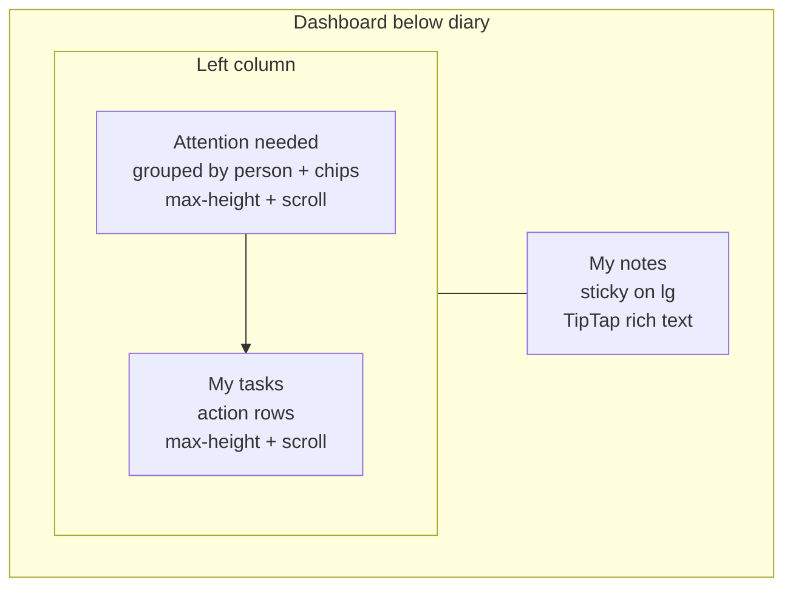

# Dashboard carousel, attention, tasks, and rich notes

## Recommendations (locked in)

**Carousel:** Keep Embla, but stop overlaying arrows on cards. Put arrows in side gutters outside the track so every card is fully readable.

**Attention needed:** One row per person (within Urgent / This week). Outstanding issues become chips (`consent due`, `unpaid`, `no show`, etc.). Let the list grow naturally, then cap height and scroll inside the card so the page does not explode.

**My tasks:** Keep a dense action list (phone / email / chat / Complete) — not a carousel. Tasks are discrete actions; carousels hide work. Same pattern: grow until a max height, then internal scroll. Fix truncated task notes so the reason is readable.

**Alignment with My notes:** Do not force equal heights. Notes stay top-aligned and sticky on desktop while the left column scrolls. Unequal heights are fine; sticky notes remove the “floating empty gap” feeling.

**My Notes editor:** Replace the current plain `textarea` (bullets / theme / font size only) with **TipTap** — a ProseMirror-based React editor that fits headless UI + Tailwind. Store HTML in the existing `user_notes.body` string. Keep appointment visit notes on the light textarea for this pass.

---

## 1. Carousel: arrows outside the cards

File: [`src/components/dashboard/today-snapshot.tsx`](src/components/dashboard/today-snapshot.tsx)

- Remove the left/right fade gradients that wash out edge cards.
- Restructure `AppointmentCarousel` as a horizontal flex:
  - Left arrow button (fixed ~40px)
  - Embla viewport (`flex-1 min-w-0`)
  - Right arrow button (fixed ~40px)
- Vertically center arrows with the track (not the counter). Keep `n / total` under the track only.
- Keep `slidesToScroll: 2` and fixed card widths.
- Hide/disable arrows when they cannot scroll (current behavior).

Result: arrows sit beside the strip at card level without covering content.

---

## 2. Attention needed: one person, many tags

Files:
- [`src/components/dashboard/attention-list.tsx`](src/components/dashboard/attention-list.tsx)
- Item shape already comes from [`src/lib/clinic.functions.ts`](src/lib/clinic.functions.ts) / demo (fields: `kind`, `urgency`, `title`, `subtitle`, `patientId`, `appointmentId`, optional `href`)

**Grouping (client-side in `AttentionList`):**

- Split by urgency as today (`urgent` / `this_week`).
- Within each section, group by `patientId`, else `href` / `id` for incomplete profiles.
- Parse display name from `title` before ` — ` (existing title format).
- Dedupe kinds into chips with labels:
  - `no_show` → No show
  - `consent_due` → Consent due
  - `payment_due` → Unpaid
  - `balance_due` → Balance due
  - `treatment_due` → Treatment due
  - `message` → Message
  - `incomplete_profile` → Incomplete profile
- Chip tones reuse existing semantic colors (attention icon tones already in the file).
- Subtitle under the name: compact treatment summary (unique treatment names from item subtitles, `line-clamp-1` if many).
- Section badge count = **number of people**, not raw issue rows.
- Row links to `/patients/$id` when `patientId` exists, else existing `href`.

**Height behavior:**

- Card grows with rows (true auto-adjust).
- After ~8 people (or `max-h-[28rem]`), set `overflow-y-auto` on the list so Attention cannot push the whole dashboard indefinitely.
- Sticky section header inside the scroll area so “Urgent today” stays visible while scrolling.

No backend change required for the first pass; grouping is a presentation concern.

---

## 3. My tasks: capped action list (not a carousel)

File: [`src/components/dashboard/follow-up-tasks.tsx`](src/components/dashboard/follow-up-tasks.tsx)

- Keep one row per recall task (actions must stay visible).
- Replace `truncate` on the note with `line-clamp-2` + `break-words` so “No show for Aesthetic Consultation…” is readable.
- Wrap the task list in the same scroll pattern: auto-grow until `max-h-[22rem]`, then `overflow-y-auto`.
- Show a small count in the section header (`N open`) so truncated-by-scroll lists still communicate volume.
- Empty state unchanged.

---

## 4. Column layout: sticky notes, no fake equal heights

Files: [`src/routes/_authenticated/dashboard.tsx`](src/routes/_authenticated/dashboard.tsx), [`src/components/dashboard/notes-panel.tsx`](src/components/dashboard/notes-panel.tsx)

- Keep the two-column layout (Attention + Tasks | Notes).
- On `NotesPanel` aside: `lg:sticky lg:top-14 lg:self-start` so notes stay in view while Attention/Tasks scroll.
- Left column stays `min-w-0 flex-1`; notes keep resizable width.
- No CSS equal-height forcing.

---

## 5. My Notes: TipTap rich-text editor

### Why TipTap (not Lexical / Quill / Slate)

Current editor in [`src/components/notes/ios-notes-editor.tsx`](src/components/notes/ios-notes-editor.tsx) is a plain `<textarea>` with bullet helpers, theme, and font size — no real formatting.

| Option | Fit |
| --- | --- |
| **TipTap** | Best for React + Tailwind/shadcn; headless; extension model; HTML or JSON; strong docs |
| Lexical | Powerful but heavier Meta stack and more DIY chrome |
| Quill | Older, harder to style to match glass UI |
| Slate | Flexible but more boilerplate for a notes panel |

**Locked choice: TipTap** (`@tiptap/react`, `@tiptap/starter-kit`, plus small extensions).

### Feature set (toolbar)

Ship a compact toolbar that matches Aetheria chrome (rounded icon buttons, not a Word clone):

- Bold, italic, underline, strikethrough
- Headings (H2 / H3) and paragraph
- Bullet list, ordered list, checklist (TaskList)
- Blockquote, horizontal rule
- Link (set / unset)
- Undo / redo
- Optional keep: paper/cream/graphite surface + base font size prefs from `useNotesPrefs` (apply to editor shell, not as fake rich-text)

Keyboard shortcuts: TipTap defaults (Cmd/Ctrl+B/I etc.).

### Architecture

New shared component, e.g. [`src/components/notes/rich-notes-editor.tsx`](src/components/notes/rich-notes-editor.tsx):

- TipTap `useEditor` with StarterKit + Underline + Link + TaskList / TaskItem
- Controlled HTML string via `content` + `onUpdate` → `editor.getHTML()`
- Empty document normalized to `""` (not `

`) before save so “empty” stays empty
- Debounced save stays in [`notes-panel.tsx`](src/components/dashboard/notes-panel.tsx) (existing ~900ms path)
- Min height + auto-grow feel via CSS (`min-h`, editor content padding); internal scroll if notes get very long inside the sticky panel (`max-h-[min(70vh,36rem)] overflow-y-auto` on the editor surface)

Wire [`NotesPanel`](src/components/dashboard/notes-panel.tsx) to `RichNotesEditor`; keep [`visit-note-chip.tsx`](src/components/visit-note-chip.tsx) on the existing light `NotesTextarea` for this plan (clinical visit notes stay simple).

### Storage / migration

- `user_notes.body` is already a string ([`getMyNote` / `saveMyNote`](src/lib/clinic.functions.ts)); store **HTML**.
- On load: if body has no HTML tags, wrap as a single TipTap paragraph (plain-text migration) so existing notes remain readable.
- Raise save validator cap from `20000` → `50000` chars to allow HTML markup overhead (update both live + demo handlers).
- Sanitize on save with a small allowlist (e.g. `sanitize-html` or TipTap’s generated schema only — no scripts/iframes). Prefer schema-constrained TipTap output + strip disallowed tags server-side if a sanitizer is already available; otherwise add a minimal allowlist sanitizer in the save handler.

### Visual consistency

- Editor chrome uses existing `glass-card` / `bg-glass-2` / edge tokens.
- Toolbar sits above the editable area (or sticky at top of the notes card).
- Prose styles for lists/headings in [`src/styles.css`](src/styles.css) under a `.rich-notes` (or `@tailwindcss/typography` only if already present — prefer a few scoped CSS rules to avoid a large dependency if unused).

### Packages to add

- `@tiptap/react`
- `@tiptap/pm`
- `@tiptap/starter-kit`
- `@tiptap/extension-underline`
- `@tiptap/extension-link`
- `@tiptap/extension-task-list`
- `@tiptap/extension-task-item`

---

## 6. Visual consistency (lists / carousel)

- Attention chips match dashboard chip language (radii / inset shadow like consent/payment chips).
- Carousel gutter arrows use the existing outline/circle style, relocated.
- Shared max-height classes: `max-h-[28rem]` attention, `max-h-[22rem]` tasks.

---

## Out of scope

- Changing how `getDashboard` builds attention items.
- Migrating appointment visit notes (`visit-note-chip`) to TipTap (follow-up).
- Collaborative editing, images/attachments, markdown import/export.
- Virtualization libraries for Attention/Tasks.
