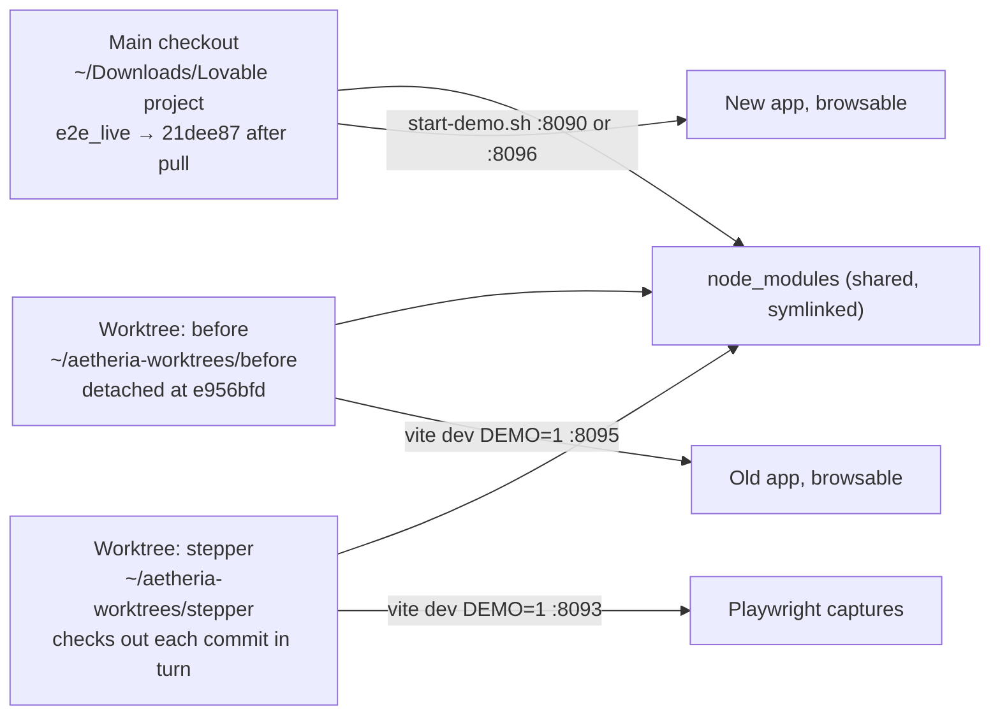

# Pull e2e_live and document every commit with before/after captures

## What is on the remote (read-only check done)

`origin/e2e_live` is at `21dee87`, 19 commits ahead of local `e956bfd`, status `ahead` (a clean fast-forward, nothing diverged). Of the 19:

- 3 are merge commits (`bc02152`, `cc21081`, `d5a5789`) that merge our own pushes into Zaisam's line; no new content.
- `95cc4eb` only adds static mock-up HTML files and `public/ipad-qc.html`; no app change.
- The 15 in your screenshots are the real app changes, in this order (parent → child, all linear):

1. `a9913cc` Profile tabs incl. Performance; earnings moved to `practitioner-earnings.tsx`; my/staff performance KPIs; team member page; phone validation in quick-add appointment; profile governance migration.
2. `3b3d678` Named clinic roles and permissions (`clinic-roles.ts`), access control settings, invite-staff dialog, owner setup gate, clinic setup migration.
3. `d15817d` Profile change request approvals (owner grants to managers), `profile-change-policy.ts`, `docs/CODEBASE_MAP.md`.
4. `20a1e58` Access control UI: role icons, collapsible panels, pinned column header.
5. `142563a` Access history dialog, notification bell wording and styling.
6. `46dff1a` Team chat tab in the floating dock (1:1 staff threads), chat window supports team and patient threads.
7. `d625c36` Practitioner hovercard with availability and urgent notes in the sidebar; alert acknowledge/dismiss in staff chat.
8. `765c1cc` Sidebar team list sorting; alerts open in the chat window from day cards.
9. `a4c6f6d` Schedule and chat cleanup; quick-reply toast slimmed from 353 lines to 32; needs-action logic trimmed.
10. `971c04c` Reply to team alerts; message composer; journey board and treatment plan card copy (`plan-step-copy.ts`).
11. `8a89a91` Overdue labels on the journey board and treatment plan card.
12. `789f666` Treatment-due visibility and booking across roles; attention list; notification bell; large data-layer change (+1452/-727 in `clinic.functions.ts`).
13. `9202460` Treatment plan card shows booking per step and no-shows; attention list shows profile change requests; `plan-step-state.ts`; adds `docs/audits/` and three `check-*.mjs` scripts.
14. `58d3dbe` Insights fixture recalculation; deposit urgency; `metrics/period.ts`, `metrics/rules.ts`; payments and deposits settings.
15. `21dee87` Removes the `check-*.mjs` scripts; metrics refactor into `book`, `dashboard`, `funnel`, `visits`, `retention` modules; period picker rewrite; insights, earnings and retention server rewrites.

Facts that shape the approach: `package.json` and the lockfile are unchanged between `e956bfd` and `21dee87`, so old and new checkouts can share one `node_modules`. Five new `supabase/migrations/2026093000*.sql` files arrive; demo mode uses fixtures, so they are documented, not applied. `a9913cc` also commits `launch-plan/website/.tmp-claude/` (zips and temp JSON); noted in the index, left alone.

## Keeping the old app alive: git worktrees

A worktree is a second checkout of the same repository in another folder, with its own HEAD. Pulling in the main folder never touches it.

- `git worktree add --detach ~/aetheria-worktrees/before e956bfd` and `... stepper` (outside the repo so the main dev server does not watch it). `ln -s` the main `node_modules` into each. No `.env` in the worktrees: set the same placeholder `VITE_SUPABASE_*` variables `launch-plan/ngrok/start-demo.sh` uses.
- Every server (before, after, stepper) runs with the same pinned clock, `DEMO_NOW=2026-09-28T09:30:00Z`, so fixture dates and numbers match between before and after captures even if the walk spans an hour.
- Port 8090 is currently held by a Python process (pid 39471, not one of mine). `start-demo.sh` refuses a busy port, so the after app uses `APP_PORT=8096` unless you free 8090.

## Steps

1. Worktrees and the old app: create both worktrees, symlink `node_modules`, start the before app on 8095 (`DEMO=1 DEMO_NOW=… npx vite dev --port 8095 --strictPort`). You can open it straight away.
2. Pull: `git fetch origin`, confirm `git merge-base --is-ancestor HEAD origin/e2e_live` and an empty `git diff HEAD origin/e2e_live -- package.json package-lock.json`, then `git pull --ff-only origin e2e_live`. Start the after app with `APP_PORT=8096 DEMO_NOW=… ./launch-plan/ngrok/start-demo.sh --background` (production build in demo mode, the same thing the public demo runs).
3. Capture harness (new files, all under the repo):
   - [playwright.changelog.config.ts](playwright.changelog.config.ts): three projects, `chromium-1440` (1440×1400, as the review pack), `ipad-landscape` and `ipad-portrait` (Playwright `iPad Mini landscape` and `iPad Mini`, WebKit). `baseURL` and output folder from env; no `webServer` block, the walk script owns the server.
   - [e2e/changelog/commit-captures.spec.ts](e2e/changelog/commit-captures.spec.ts): a scene catalogue built on the existing review pack in [e2e/review/feedback-captures.spec.ts](e2e/review/feedback-captures.spec.ts) (persona cookie, settle selector, optional open step), plus the scenes these commits need: team page and access control panel, team member page, invite-staff dialog, profile tabs, my performance, practitioner earnings, floating dock chat window and team chat tab, notification bell open, sidebar practitioner hovercard, quick-add appointment dialog, journey board, patient record plan card, patient portal records, settings payments tab, insights, retention, performance, patients metrics. Open steps are tolerant: if a control does not exist at that commit the page is captured as-is and the scene is marked "control not present". The dock is hidden only in scenes that are not about it. Scene list comes from env so each run captures only what is asked.
   - [scripts/changelog/walk-commits.mjs](scripts/changelog/walk-commits.mjs): a table of the 15 commits with their scenes (from the file lists above; refined after reading the diffs). For each of the 16 states (`d5a5789` base, then each commit): `git -C stepper checkout <sha>`, start vite on 8093, wait for HTTP 200, run the spec for scenes(k) ∪ scenes(k+1) into `test-results/changelog-states/<sha>/` (already git-ignored), stop the server. Afterwards copy each commit's scenes into `docs/changelog/2026-09-28-e2e-live/commits/NN-<sha>/{before,after}/<scene>--<device>.jpg`. A `manifest.json` records what was captured or missing per state.
   - [scripts/changelog/compose.mjs](scripts/changelog/compose.mjs): renders before and after side by side into `compare/<scene>--<device>.jpg` with Playwright (no new dependencies).
4. Run the walk: about 16 server starts, 3 devices, 6 to 10 scenes per state, roughly 40 to 60 minutes unattended.
5. Documentation, one file per commit at `docs/changelog/2026-09-28-e2e-live/commits/NN-<sha7>.md`, written after reading each diff with `git show`:
   - Header: sha, author, date, parent.
   - The commit message, verbatim.
   - What changed, in plain language: user-visible behaviour, who sees it (owner, manager, practitioner, front desk, patient), data and permission changes, tests added, migrations, anything server-only that cannot be shown.
   - Files by area (components, routes, lib, tests, migrations) with line counts.
   - For each scene: the composite image, then links to the before and after captures per device; a note where the control did not exist before.
   - Index at `docs/changelog/2026-09-28-e2e-live/README.md`: what was pulled, the skipped merges and mock-up commit, the method (worktrees, pinned clock, devices, how to rerun), the migrations list, observations, and a table linking the 15 commit pages.
   - `docs/changelog/` is a rolling folder: every future pull gets a dated sibling (`YYYY-MM-DD-<branch>/`), and a short `docs/changelog/README.md` lists them.
6. Verify and hand over: a link check that every referenced image exists; spot-check a few composites in the browser; leave the before (8095) and after (8096) apps running with their URLs in the summary. Nothing is committed or pushed until you say so.

## Notes and assumptions

- Commit `3b3d678` adds an owner setup gate in `route.tsx`; if it intercepts the owner persona in demo mode, that is captured and documented rather than worked around.
- Composites and captures are JPEG quality 60, roughly 15 to 25 MB for the whole set; only images referenced by a commit page are copied into `docs/`, the full per-state set stays in the ignored `test-results/` folder.
- The stepper worktree is removed at the end. The before worktree stays running so you can browse the old app; once you are done comparing, `git worktree remove ~/aetheria-worktrees/before` deletes it. Nothing depends on it afterwards: the captures are copied into `docs/`, the old commit stays in history, and the shared `node_modules` is only a symlink.