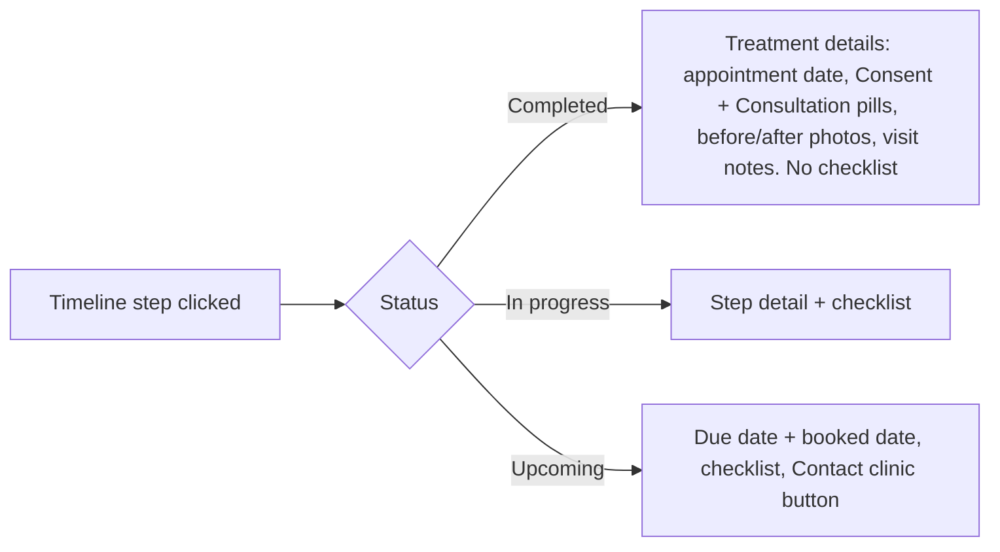

# Feedback corrections: clinic and patient portals

## This is Workstream 1 of 3 — two follow-up plans still to come

The feedback PDF splits into three workstreams of very different size. This plan delivers the first; the other two are **not built here** and each needs its own plan written after this one ships.

- **Workstream 1 — Corrections (this plan).** The ~25 targeted UI/UX fixes across both portals, plus demo/live parity and test coverage.
- **Workstream 2 — Treatment workflow (BUILT).** Feedback pages 7-8. Planned in [treatment_workflow_arrival_to_complete_64caca63.plan.md](treatment_workflow_arrival_to_complete_64caca63.plan.md), shipped as commit `ecccbb6` on `e2e` with work log `docs/treatment-workflow-worklog.md`. To-do `followup-treatment-workflow` is closed.
- **Workstream 3 — Offers and marketing (BUILT).** Feedback pages 3 and 8-9. Planned in [offers_and_marketing_2dd1428d.plan.md](offers_and_marketing_2dd1428d.plan.md), shipped on `e2e` with work log `docs/offers-marketing-worklog.md`. To-do `followup-offers-marketing` is closed.

Both follow-ups are scoped in [Follow-up plans](#follow-up-plans-workstreams-2-and-3) at the foot of this document. All three workstreams are now built.

A naming note, because the letters collide: **A, B and C below are the internal phases of this plan** (clinic portal, patient portal, then parity and ship). They are not the three workstreams.

## Findings that change what is worth building

- **Treatments due is already practitioner-scoped.** Verified live: owner sees 1376, practitioner 567 ([clinic.functions.ts](src/lib/clinic.functions.ts) L440-443 filters `dueDates` through `scopeFor`). The real defect is that the card never says *whose* number it is, so an owner reasonably reads it as "mine". Fix is labelling, not scoping.
- **Total clients is not scoped at all** — 641 for both roles ([clinic.functions.ts](src/lib/clinic.functions.ts) L432-451). This is the card the feedback asks to split.
- **The account-menu "My record" link works.** Verified: it navigates to `/my-record`. The report almost certainly dates from when port 8080 was serving a stale server or the unrelated EMSOS service. The genuine bug nearby is the sidebar active-state test `pathname === "/my-record"` ([app-shell.tsx](src/components/app-shell.tsx) L334), which misses a trailing slash.
- **There is no "confirmed" appointment status.** The enum is `booked | attended | cancelled | no_show` with a separate visit stage. Gating the home card on confirmation needs a new `appointments.patient_confirmed_at` column plus a portal confirm action — a migration, not a CSS change.
- **The check-in sliders are decorative.** `PortalSlider` in [portal/ui.tsx](src/components/portal/ui.tsx) L146-162 renders a static bar; "not working" is accurate.

## Phase 0 — shared foundations

- Standardise the period control: `PeriodPicker` ([period-picker.tsx](src/components/period-picker.tsx)) gains a year default and is adopted by retention, performance, insights and earnings so all metrics pages behave identically (feedback: "consistent duration picker... default is year").
- Add an equal-height card primitive for the portal grids, since "all boxes/cards across all the tabs" must match in size. Today the portal grids use `items-start`, which is exactly why heights differ.
- Migration: `appointments.patient_confirmed_at` + `confirmAppointment` server fn, needed by the home card.

**To-dos:** `p0-period`, `p0-cardgrid`, `p0-confirm-migration`

## Phase A — clinic portal

- **A1 Carousel "dancing".** Remove the hover auto-glide in [today-snapshot.tsx](src/components/dashboard/today-snapshot.tsx) (L269-338 and the full-height edge `<button>` zones at L471-505) which steals the pointer and makes cards unclickable. Keep click-to-page, drag and wheel scrolling; the edge zones become plain arrow buttons.
- **A2 Total clients.** Practitioner's own client count as the headline, clinic total on the line below, and a month-over-month change chip — per the annotation on page 3.
- **A3 Treatments due.** Label the card with whose book it covers ("Your patients" vs "Clinic"), matching A2's pattern.
- **A4 Numbers QC.** Audit dashboard, insights, retention and performance for repeated or contradictory figures and reconcile them ("QC, Audit, redundancy check of all numbers").
- **A5 Retention by period.** [retention.tsx](src/routes/_authenticated/retention.tsx) has no picker at all; add one and make all four stat cards, the trend and the breakdown respond to it.
- **A6 Insights cards clickable.** The pipeline funnel tiles ([funnel-tiles.tsx](src/components/insights/funnel-tiles.tsx)) are static `Card`s; make them scroll to and highlight their in-depth section.
- **A7 Pause requests contact button.** Add Contact alongside Approve/Decline in [pause-requests.tsx](src/components/dashboard/pause-requests.tsx) L67-83.
- **A8 Comms into tabs.** `CommsPreferencesCard` and `CommsLogCard` sit above the tabs on [patients.$id.tsx](src/routes/_authenticated/patients.$id.tsx) L584-594; move them into a new Contact tab.
- **A9 Journey card rethink** ([treatment-journeys.tsx](src/components/dashboard/treatment-journeys.tsx)) — you said all four concerns apply: clarify what "N of M" counts, stop retention plan names like "Win-back Review" reading as clinical plans, state the card's purpose and what action it invites, and give columns a consistent min-height so one patient does not leave a large empty card.
- **A10 Visit notes.** Keep notes on the patient profile tied to their treatment, and make the diary hover note explicitly the pre-read for the upcoming appointment.

**To-dos:** `a1-carousel`, `a2-total-clients`, `a3-treatments-due`, `a4-numbers-qc`, `a5-retention-period`, `a6-insights-clickable`, `a7-pause-contact`, `a8-comms-tab`, `a9-journey-card`, `a10-visit-notes`

## Phase B — patient portal

- **B1 Navigation.** Remove the Messages page and its sidebar entry; move Billing and Settings into the avatar dropdown ([app-shell.tsx](src/components/app-shell.tsx) L252-261, L514-529); fix the Home active-state test at L334.
- **B2 Home.** Gate the next-appointment card on `patient_confirmed_at` with a booking CTA otherwise; correct the green ticks in the progress track; show read state on the latest-message card and make Reply open the dock chat rather than navigate.
- **B3 Banners.** Remove "You're doing great" ([my-record.index.tsx](src/routes/_authenticated/my-record.index.tsx) L326-333) and "Consistency brings real results" ([my-record.plan.routine.tsx](src/routes/_authenticated/my-record.plan.routine.tsx) L250-257).
- **B4 Overview.** Make the check-in sliders interactive and persist on release; relabel the link to "Add note" and have it open a real note field; rename "View checklist" to "View more details"; apply the Phase 0 equal-height grid.
- **B5 Timeline.** Remove the Clinician guidance block; show the completion date instead of "To be confirmed" on completed steps; make "View the step" deep-link to that step, scrolled into view and highlighted; and build the three step-card states in the diagram above, including a Contact clinic button on upcoming steps. The completed card reads existing treatments, documents, photos and visit notes — it will populate further once the treatment workflow lands.
- **B6 Journal.** Tags on one line without wrapping, drop the fixed `w-[100px]` tag column ([my-record.plan.journal.tsx](src/routes/_authenticated/my-record.plan.journal.tsx) L191-210), and replace the chip row with a single Tags filter button.
- **B7 Routine.** Add a per-product edit control; the patient pastes a product link and a server fn fetches it, extracts name and how-to from OpenGraph/meta (falling back to Cohere, then to manual entry), and stores a patient override beside the clinic's recommendation.
- **B8 My Clinic.** Rebalance the card grid and add a working Message Clinician button that opens a thread reaching both the clinician and the clinic inbox, so it surfaces on the practitioner's side.

**To-dos:** `b1-nav`, `b2-home`, `b3-banners`, `b4-overview`, `b5-timeline`, `b6-journal`, `b7-routine-link`, `b8-my-clinic`

## Phase C — parity, tests, ship

- **C1 Demo/live parity.** Every server fn touched gets its matching demo twin, and demo fixtures gain the new states (confirmed appointments, read messages, patient routine overrides, completed-step dates) so the demo shows the same behaviour as production. `check:policy`, `check:validators` and `check:tenancy` stay green.
- **C2 Tests.** Extend `e2e/patient-portal/` for every changed control and add clinic-portal specs for the carousel, KPIs, retention period and the journey card. Re-run the visual parity capture.
- **C3 Ship.** Full `verify` run, tsc delta, lints, then commit and push to `e2e`.

**To-dos:** `c1-parity`, `c2-tests`, `c3-ship`

## Follow-up plans (Workstreams 2 and 3)

Neither is built by this plan. Each needs its own plan written once this one ships — scoped here so that can be done without re-reading the PDF.

### Workstream 2 — Treatment workflow (feedback pages 7-8) — built

Shipped in `ecccbb6` (see the dedicated plan and `docs/treatment-workflow-worklog.md`). Kept here for the record; the loop as built:

- Status only moves to `waiting` when the patient is checked in as `arrived` **and** consent is complete; if consent is outstanding, reception has them complete it in clinic, and completing it is what advances the status.
- Reaching `waiting` notifies the patient's practitioner and nudges them to start treatment.
- "Start treatment" opens a three-page treatment form on the patient's record: page 1 patient and treatment details plus previous visit notes to read beforehand; page 2 treatment results, treatment notes and visit notes; page 3 aftercare points matched to the treatment type.
- Each page's button advances the appointment card status so the rest of the clinic can see it: `in_treatment` → `aftercare` → `complete`.
- On completion the form is saved to the patient's profile and fans out into the tabs: treatment history (with notes), visit notes, and before/after photos — and the form itself is retained as a viewable document.

Dependency worth noting: this is what fully populates the completed-treatment card that Phase B5 of *this* plan builds on the patient timeline.

### Workstream 3 — Offers and marketing (feedback pages 3, 8-9)

- Offers categorised by the patient's stage, with automated email plus portal delivery: pre-consultation, post-consultation with nothing booked, single-treatment, and skin plan nearing its end.
- Email links through to login, where the offer appears on the portal home to activate or claim.
- A "Design Your Offer Template" page, role-gated to the clinic owner and any marketing team member, offering manual and AI-assisted template design for email and later channels, reached from the avatar dropdown.
- A per-patient "Send Offer" button on the staff patient page for one-offs.
- Bulk send from the patient table: select by status, then a paper-plane action offering the template list.
- The Insights marketing surface, including a next-steps view with "send offer" and patient selection.