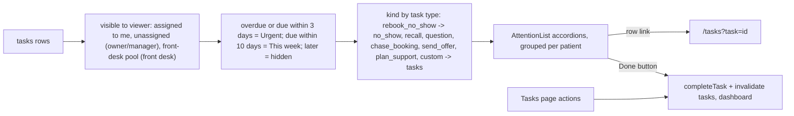

# Fixes.docx — clinic portal fixes and redeploy notes

## Decisions already taken (from your answers)
- Sqinos contact address everywhere the product needs one: `contact.sqinos@gmail.com`.
- Owner/manager dashboards show tasks assigned to them **plus unassigned** tasks; practitioners and front desk see tasks assigned to them (front desk also sees the unclaimed front-desk pool).
- Everything uncommitted from the Cloudflare session (`launch-plan/cloudflare/*`, launch-plan script/env edits, both technical-documentation files) is committed first as its own commit.

## Assumptions (tell me if any is wrong)
- Item 1 "the rule" = the whole monospace source line under each task card (`Rule · …`, `Portal · …`, `Manual · …`), replaced by a patient-type tag.
- Item 9 "the table under" = the second screenshot (Retention over time); the fix is the light series-coloured text in both chart tooltips.
- Item 3 reuses the existing Staff-access switch `team.approve_changes` (already in the Team page grid, off for managers by default) rather than adding a second key; it is relabelled "Approve staff requests" and now covers all three request types.

## 1. Tasks page cards (items 1, 8) — `src/components/tasks/task-row.tsx`, `src/routes/_authenticated/tasks.tsx`
- Remove the `task-source` span and `taskSourceLine` (plus its two lines in `tests/unit/task-types.test.ts`); add `data-source={task.source}` on the `<li>` so QC still has the source (`e2e/retention.spec.ts:86` switches from text to `[data-source="manual"]`).
- Add a patient-type pill after the type chip, reusing `PATIENT_TYPE_META[...].pill` from `src/lib/patients/records-summary.ts` ("Skin plan" / "Regular" / "New patient"), `data-qc="task-patient-type"`.
- Data: `PatientLite` (`src/lib/tasks/service.ts:75`) gains `patientType`; `loadPatientContext` (`src/lib/tasks/tasks.server.ts:110`) already loads active plans and 2-year treatments, so derive it there; mirror in `demoPatientLite` (`src/lib/clinic.functions.demo.ts:5833`). Small helper `patientTypeFrom(hasPlan, visitCount)` in records-summary.ts, used by `patientType()` too.
- **Reply opens the chat**: in `rowActions`, `question` → `requestChat({ patientId, patientName })` from `useFloatingDock()` and remember `{ taskId, patientId }` in a ref. Dock context (`src/components/floating-dock/dock-context.tsx`) gains `patientMessageSent: { patientId, seq } | null` + `notifyPatientMessageSent(patientId)`, called from the `onSent` in `chat-bubble.tsx:586`. Tasks page effect: when a message for the pending patient is sent → `actions.complete(task, "replied", "Replied")` (optimistic + Undo toast, as today). Server fallback already exists: the evaluator auto-closes `portal_question:*` once a staff reply exists.

## 2. Sidebar count (item 2) — `src/components/app-shell.tsx`
- Drop `badge: tasksSummary?.openForMe` (line 590), the `["tasks-summary"]` query (545–551) and the now-unused `badge` slot in `NavLink`/`NavItem`. `e2e/tasks.spec.ts:56` asserts the badge is gone.

## 3. Dashboard "Attention needed" (items 3, 4, 5)
`src/lib/tasks/service.ts` `taskAttentionItems` (690–720), `src/components/dashboard/attention-list.tsx`, `getDashboard` in `src/lib/clinic.functions.ts` (834–950) and `src/lib/clinic.functions.demo.ts` (716–792), `src/lib/profile-change-policy.ts`, `src/lib/permissions.ts:134`.

- **Remove the two aggregate rows** ("Tasks — N overdue · 9 rebooks, …"). Emit one item per task: `{ id: task-<id>, kind, urgency, title: "<patient> — <task title>", subtitle: task title + due label, patientId, href: /tasks?task=<id>, taskId, dueAt }`. Constants `TASK_ATTENTION_URGENT_DAYS = 3`, `TASK_ATTENTION_WEEK_DAYS = 10` (clinic days via `clinicDayDiff`); undated tasks land in This week. `canSeeTask` still applies (clinical questions never reach the front desk).
- Attention list: new `CHIP_META`/`KIND_ORDER`/`railFor` entries for `recall` ("Recall"), `question` ("Patient questions"), `chase_booking` ("Chase booking"), `send_offer` ("Send offer"), `plan_support` ("Plan support"); `rebook_no_show` joins the existing "No show" accordion and `custom` stays under "Tasks". Grouping by `patientId` already merges a diary no-show and its rebook task into one row (no duplication). Rows with `taskId` get a small check button (`data-qc="attention-task-done"`) that calls a new `completeById(taskId, firstName)` in `src/components/tasks/use-task-actions.ts` (same optimistic/Undo/invalidate path, which already refreshes `dashboard`). Take-over/reassign moves the row to the new assignee's dashboard automatically because scope is by assignee.
- **Requests to approve**: `profileChangeAttentionItems` emits `kind: "staff_request"` (title "Name — profile change", href unchanged); drop the `profile_change` meta. One gate for the whole block: new `canApproveStaffRequests(identity)` in `src/lib/staff-access.ts` = owner/admin, or manager with `team.approve_changes`; replaces both `canManageProfiles(...)` and `canSeeProfileChangeAttention(...)` gates in prod + demo `getDashboard` (helper in profile-change-policy.ts removed if orphaned). Relabel `team.approve_changes` → "Approve staff requests" with a description covering profile changes, time off and working-pattern requests on the dashboard. Time-off/pattern approval handlers keep their current `team.manage_profiles` policy.
- Tests: rewrite `e2e/patients.spec.ts` "attention needed aggregates tasks" (owner/practitioner/front desk: per-kind rows, link lands on the highlighted task, Done button clears the row and the Tasks page); update `e2e/profile-governance.spec.ts:92–115` (owner sees profile changes under "Requests to approve"; manager sees nothing until the owner toggles "Approve staff requests" in Staff access, then sees them); extend `tests/unit/tasks-service.test.ts` (or the existing service test) for the 3/10-day windows and scope.

## 4. Payroll team email (item 6)
- `src/lib/demo/data.ts:128` clinic `email` → `contact.sqinos@gmail.com` (feeds the Create invoice "Payroll team" line via `clinic.data.email`, `src/components/profile/invoice-dialog.tsx:122`). Also default `PUBLIC_CONTACT_EMAIL=contact.sqinos@gmail.com` in `launch-plan/website/.env.example`; your git-ignored `launch-plan/website/.env.local` still has it empty — the README step will tell you to set it before `redeploy.sh website`.

## 5. Staff profile booking (item 7) — `src/components/profile/front-desk-view.tsx`, `src/components/profile/qualifications-card.tsx`
- Pass `catalogue.filter(c => bookableIds.has(c.id))` to `QuickAddAppointment` (fall back to the full list only when the practitioner has no bookable treatments yet).
- Colour the "Can be booked for" chips with `toneForTreatment(name, useTreatmentColours())` (`src/lib/practitioner-colours.ts:176`, same source as the Settings swatches and diary): `tone.softBg` + `tone.text` + `style={tone.style}`; same treatment in the owner/manager Qualifications card chips so both views match.

## 6. Chart tooltip text (item 9) — `src/components/insights/funnel-chart.tsx:73`, `src/components/retention/retention-trend.tsx:97`
- Add `itemStyle={{ color: "var(--foreground)", fontWeight: 600 }}` and `labelStyle={{ color: "var(--foreground)" }}` so series names/values read in ink instead of butter/sky/pink.

## 7. "· opens the form" (item 10) — `src/routes/_authenticated/schedule.tsx:238`, `src/components/dashboard/today-snapshot.tsx:949`
- Remove the suffix spans (behaviour unchanged); drop the `toContainText(/opens the form/)` assertion at `e2e/treatment-workflow.spec.ts:76`.

## 8. README: redeploying after a change
- New section in the root `README.md` after the launch section: pull/check out `e2e_exp` → `npm ci` only if `package.json` changed → `./launch-plan/cloudflare/redeploy.sh app` (portal code under `src/`), `website` (Astro site; set `PUBLIC_CONTACT_EMAIL` in `launch-plan/website/.env.local` first), `all`, or `tunnel`; gateway edits need `stop.sh` + `start-public.sh`; verify with `status.sh` / `curl -sI https://www.sqinos.com/healthz`; logs under `launch-plan/.run/logs/`; hard-reload stale tabs ("server function not found"). Links to `launch-plan/cloudflare/README.md` for first launch and troubleshooting.

## Verification and commits
- Gates as before: `npm run test:unit` (11 pre-existing failures only), `check:policy` 191 / `check:tenancy` 62 / `check:validators` (2 pre-existing), tsc compared against `/tmp/pt-baseline-tsc.txt` (0 new), `python3 /tmp/pf-newlint2.py` → `new-by-line 0`; e2e on 8091 for `tasks`, `patients`, `patients-records`, `retention`, `profile-governance`, `profile-r2`, `treatment-workflow`, `offers`; `RESPONSIVE_GATE=major` for dashboard/tasks/team pages; QC screenshots of dashboard (3 roles), Tasks page, Tom's profile, invoice dialog, both tooltips.
- Commits on `e2e_exp` with the existing author, exact paths only (never `.cursor/`, `Claude outputs/`, `.env.local`, `.run/`): (1) Cloudflare session files; (2) dashboard requests + task sync; (3) Tasks page cards, reply-to-chat, sidebar; (4) profile booking colours, payroll email, tooltips, "opens the form"; (5) README redeploy section. No push.