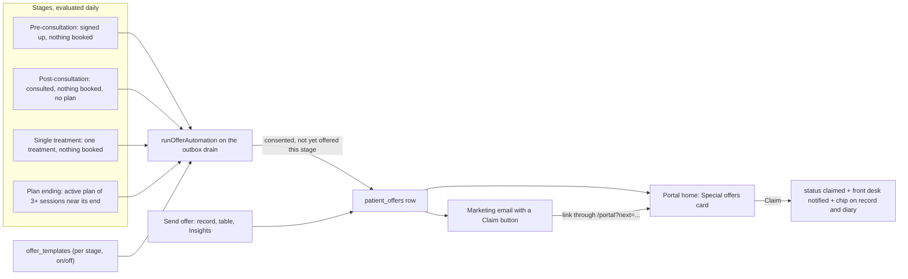

# Offers and marketing: stage-based offers, templates and sends

Workstream 3 of the feedback round (pages 3, 8-9). The last of the three plans. Decisions taken with you: the marketing surface is gated by a **new `offers.manage` permission** (owner always; grantable to any role from the Team access matrix); stage automation is **on/off per stage, off by default**, sending on the daily outbox run with a "who would receive this today" preview — no approval queue.

## What exists today (audited)

- The outbox is complete: `communications` (channel email/sms, purpose transactional/reminder/**marketing**, `scheduled_for`, statuses), `enqueueCommunication` in [enqueue.server.ts](src/lib/comms/enqueue.server.ts) with PECR enforced by `assertCanSend` ([preferences.ts](src/lib/comms/preferences.ts) L52-88: refuses without `marketing_opt_in`, respects `email_opt_in`/`sms_opt_in`/`unsubscribed_at`), the drain in [dispatch.server.ts](src/lib/comms/dispatch.server.ts) behind `POST /api/comms/drain` and the demo "Process queue", Resend/Twilio adapters (sandbox by default), HMAC unsubscribe footer via `/u/$token`. Email is **plain text only** — no HTML, no button.
- `sendRecall` + [send-recall-dialog.tsx](src/components/retention/send-recall-dialog.tsx) is the one existing promotional send (marketing purpose, in-app/email/SMS tabs, `message_templates` with `renderTemplate`). It is the pattern to copy for a one-off offer.
- Portal offers are a clinic-wide broadcast: `clinic_offers` rows, `getPortalHome` returns the newest unexpired one, the home "Special offers" card's CTA only navigates to Resources. Nothing is per patient, nothing tracks a claim.
- Insights already derives two of the four stages: `waiting` (signed up, nothing booked) and `consultedNoTreatment` ([insights.server.ts](src/lib/insights.server.ts) L274-289) with `ActionList` rows offering Schedule/Open. "Single treatment, no follow-up" and "plan nearing its end" exist nowhere.
- The patient table ([patients.index.tsx](src/routes/_authenticated/patients.index.tsx)) has view pills and search but no row selection or bulk action.
- Roles are owner/manager/practitioner/front_desk; capabilities are per-role rows in `role_permissions`, edited on the Team page ([access-control-settings.tsx](src/components/access-control-settings.tsx)), enforced by `authorize()` `capability` policies. Adding a key means `PERMISSION_KEYS`/`PERMISSION_META`/`PERMISSION_GROUPS` + a seed migration.
- Cohere is already wired twice ([care-assistant.server.ts](src/lib/ai/care-assistant.server.ts), [product-link.server.ts](src/lib/portal/product-link.server.ts)) with a deterministic fallback.
- A logged-out hit on `/my-record?offer=…` goes to `/auth` and **drops the query** ([route.tsx](src/routes/_authenticated/route.tsx) L59-61); the patient login at `/portal` does honour `?next=`.

## Target behaviour

## Phase 0 — Schema, permission, stage rules, fixtures

- Migration `offer_templates`: `id, clinic_id, name, stage ('pre_consultation'|'post_consultation'|'single_treatment'|'plan_ending'|'custom'), subject, headline, body, value_text ("10% off your next session"), code, cta_label, valid_days, channels (email/sms/portal booleans), automation_enabled, automation_delay_days, created_by, archived_at, timestamps`. Staff read; `offers.manage` write via server fns; `clinic_isolation`.
- Migration `patient_offers`: `id, clinic_id, patient_id, template_id, stage, status ('sent'|'viewed'|'claimed'|'expired'|'cancelled'), source ('automation'|'one_off'|'bulk'|'insights'), code, sent_by, communication_id, sent_at, viewed_at, claimed_at, expires_at`. Staff manage; patients read and update (claim) their own; partial unique index `(patient_id, stage) where source = 'automation'` so automation fires once per patient per stage.
- Migration: `offers.manage` seeded into `role_permissions` (false for every role; the owner passes implicitly) and `communications.template_key` values `offer`/`offer_blast` documented.
- [permissions.ts](src/lib/permissions.ts): key, label "Design and automate offers", group Marketing; tests in `permissions.test.ts`.
- `src/lib/offers/stages.ts` (pure, unit-tested): `stageOf(patientFacts) -> Stage | null` from facts the server gathers (source/lead, consultation dates, non-consult treatment count, next booking, active plan with sessions done/total and duration progress); `planNearingEnd` (3+ sessions and one session or less left, or past 80% of `duration_days`); delays per stage (post-consult 7 days, single treatment 21 days, defaults editable per template); `renderOffer(template, patient)` producing subject, text body, HTML body with the button, and the portal card fields.
- Types hand-maintained; `CLINIC_SCOPED_TABLES` extended.
- Demo fixtures: four stage templates (two switched on), a `custom` one, `patient_offers` in each status (one claimed on Olivia so the portal and the record show it), patients that land in each stage.

**To-dos:** `p0-offer-tables`, `p0-permission`, `p0-stage-rules`, `p0-fixtures`

## Phase A — Server

- **A1 Templates**: `listOfferTemplates` (staff), `saveOfferTemplate`, `archiveOfferTemplate`, `setOfferAutomation({id, enabled, delay_days})` (all `offers.manage`).
- **A2 AI draft**: `draftOfferTemplate({stage, brief, tone})` (`offers.manage`) — Cohere with JSON response format returning subject/headline/body/cta/value, same key/model/fallback pattern as the care assistant; without a key returns a sensible stage default.
- **A3 Cohorts**: `previewOfferStage({stage})` (`offers.manage`) — who would receive it today, split into "will send" and "skipped: no marketing consent / already offered / no email". Shared `gatherStageFacts(ctx)` reads patients, leads, appointments, treatments, plans and milestones once and feeds `stageOf`.
- **A4 Sending**: `sendOffer({template_id, patient_ids[], message?, source})` (`comms.send`) — for each patient: insert `patient_offers`, enqueue a marketing email (`enqueueCommunication`, `templateKey: "offer"`, HTML + text) whose button links to `/portal?next=/my-record?offer=<patient_offer_id>`, optional SMS if the template allows; returns sent/skipped with the PECR reason per skip. The portal card needs no send — it reads `patient_offers`.
- **A5 Automation**: `runOfferAutomation(ctx)` in `src/lib/offers/automation.server.ts`, called from the drain ([dispatch.server.ts](src/lib/comms/dispatch.server.ts), so the existing `/api/comms/drain` cron and the demo "Process queue" both run it): for each enabled template, cohort minus already-offered, respecting the stage delay, then A4's path with `source: automation`. Idempotent under the unique index.
- **A6 Email HTML**: `email.server.ts` gains an optional `html` alongside `text` (Resend accepts both; sandbox logs both); `communications` carries the HTML in a new nullable `body_html` column.
- **A7 Portal**: `getPortalHome` returns the patient's live `patient_offers` (newest first) ahead of the clinic broadcast; `markOfferViewed`, `claimOffer` (`patientSelf`) — claim stamps `claimed_at`, raises `staff_notifications` kind `offer_claimed` to front desk and managers with `patient_id`; `listPatientOffers({patient_id})` (staff) for the record page; `getDashboard` today rows carry `claimedOffer` for the diary chip.

**To-dos:** `a1-templates-fns`, `a2-ai-draft`, `a3-cohort-preview`, `a4-send-offer`, `a5-automation`, `a6-email-html`, `a7-portal-fns`

## Phase B — Design Your Offer Template page

- **B1** Route `src/routes/_authenticated/offers.tsx` (`/offers`), gated by `offers.manage` (redirects otherwise); account-menu entry **Offer templates** in [app-shell.tsx](src/components/app-shell.tsx) beside Team/Settings, shown only when `can(identity, "offers.manage")`; Team access matrix shows the new permission automatically.
- **B2** Layout: four stage cards (name, what the stage means, template on/off, "N patients would receive this today", last run) plus a "One-off templates" list; a template editor sheet with the fields above, **Draft with AI** (brief + tone → fills the fields, editable), and a live preview that renders the email (with the button) and the portal card side by side.
- **B3** Automation switch with the cohort preview dialog (from A3) before enabling; the delay in days; send history per template (from `patient_offers`) with status counts.

**To-dos:** `b1-offers-route`, `b2-designer`, `b3-automation-ui`

## Phase C — Send surfaces (page 9 and page 3)

- **C1 Patient record**: **Send offer** beside Send form on [patients.$id.tsx](src/routes/_authenticated/patients.$id.tsx) (`comms.send`): template picker with preview, optional personal line, channel summary, PECR state shown up front ("Olivia has not opted in to marketing — this can only go to her portal"); sends via A4. An **Offers** list on the Contact tab: sent/viewed/claimed with dates and codes.
- **C2 Patient table**: selection checkboxes per row and select-all for the current view; a **paper-plane** toolbar button appears with a count → template picker → A4 with `source: bulk`; the result dialog lists who was sent and who was skipped and why.
- **C3 Insights**: the two "Needs a next step" lists gain a **Send offer** row action and multi-select with a bulk send (`source: insights`); the pipeline section subtitle says which stage template each list maps to.

**To-dos:** `c1-record-send`, `c2-table-bulk-send`, `c3-insights-send`

## Phase D — Patient portal

- **D1 Deep link**: the logged-out gate in [route.tsx](src/routes/_authenticated/route.tsx) sends `/my-record*` paths to `/portal?next=<full path>` instead of `/auth`, so the email button lands on the offer after login. `?offer=<id>` on the home marks it viewed and scrolls to the card.
- **D2 Special offers card** ([my-record.index.tsx](src/routes/_authenticated/my-record.index.tsx)): the patient's offers first (flag New / Claimed, value, expiry, code), **Claim offer** → `claimOffer` → confirmation state with **Book with this offer** opening the dock chat with a draft that quotes the code; the clinic broadcast stays as the fallback. Resources lists every offer, claimed ones marked.
- **D3 Staff-side visibility**: bell routes `offer_claimed` to the record's Contact tab; a small **Offer claimed** chip on the diary card when the patient has a live claimed offer, so front desk applies it at booking.

**To-dos:** `d1-deep-link`, `d2-portal-card`, `d3-claim-visibility`

## Phase E — Parity, tests, ship

- **E1** Demo twins for every fn, fixtures for every stage and status, `check:policy` / `check:validators` / `check:tenancy` green, unit tests for `stages.ts` and `renderOffer`.
- **E2** `e2e/offers.spec.ts`: permission gating (owner sees the page, front desk does not until granted from the Team matrix); create a template, AI draft fills the fields (fallback path in tests), automation preview shows the cohort, enable → Process queue → the patient's comms log shows the marketing email and the portal card shows the offer; one-off send from the record with the PECR skip surfaced; bulk send from the table; Insights send; portal claim → front desk bell and diary chip; deep link through the portal login.
- **E3** Work log `docs/offers-marketing-worklog.md`, full verify, tsc delta, lints, commit and push to `e2e`; close `followup-offers-marketing` in the corrections plan.

**To-dos:** `e1-parity`, `e2-tests`, `e3-ship`

## Assumptions

- Automation targets patient records only. A website lead with no patient record has no consent record, so PECR forbids emailing them; the pre-consultation card lists them as "needs a patient record" instead. Pre-consultation therefore means "patient record from a sign-up with no consultation and nothing booked".
- Once per patient per stage for automation; one-off and bulk sends are unlimited but the record shows the history.
- A claim does not change prices; it records the claim, shows the code to staff and patient, and front desk applies it when booking. Expiry is `valid_days` from send.
- SMS is per template, off by default; email plus the portal card are the defaults the feedback describes.
- Cohere drafts are suggestions the user edits; nothing is sent by the AI.