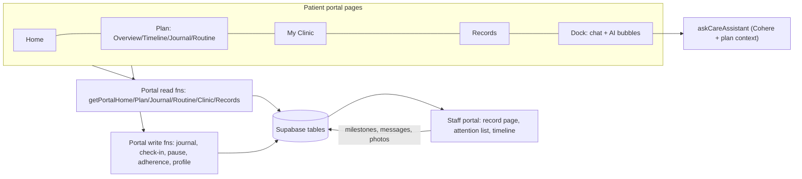

# Production patient portal from the V4 wireframes

## Audit findings that shape this plan

- Today the patient surface is a single page, [src/routes/_authenticated/my-record.tsx](src/routes/_authenticated/my-record.tsx), and [route.tsx](src/routes/_authenticated/route.tsx) L140-144 hard-redirects every non-staff user to exactly `/my-record`. That redirect must allow `/my-record/*` before any multi-page portal can exist.
- Roughly half of V4 is already backed: `treatment_plans`, `plan_milestones`, `appointments`, `treatments`, `documents`, `treatment_photos`, `messages`, `patients.allergies/medications/conditions`, `clinics`, `profiles`.
- Nine areas have no backing at all: journal (+photos, voice), skincare routines, routine adherence/reminders, recovery check-ins, plan pause requests, clinic news, offers, emergency contact + address, other-clinic history, plus milestone `detail`/`guidance`/checklist/month-group and plan `strapline`/`duration_days`.
- `getMyRecord` does not load plans, milestones or appointments even though patient RLS for them exists.
- The floating dock is staff-only ([app-shell.tsx](src/components/app-shell.tsx) L638), so patients have no chat or AI bubble. The V4 wireframes also omit the two bubbles the mockups show bottom-right; both need them.
- Playwright already runs against demo mode on port 8091 with a `demo_role` cookie ([playwright.config.ts](playwright.config.ts), [e2e/fixtures.ts](e2e/fixtures.ts)), serial because demo fixtures are shared mutable state. New specs extend that harness.

## Phase 0 — branch and wireframe completion

- Cut `e2e` from the current tip (`5ae7d4e`, the V4 commit) and work there throughout.
- Add the two circular bubbles the mockups show bottom-right of [docs/patient-portal/v4](docs/patient-portal/v4) but the wireframes missed: a message bubble and an AI/sparkle bubble, in the butter-gradient treatment already used by the clinic dock. Wire them to a chat panel and an assistant panel in the wireframe, then re-run `scripts/capture.mjs` so the comparison sheets stay current.

**To-dos:** `p0-branch`, `p0-bubbles` · **Work log:** _(filled during implementation)_

## Phase A — schema (no app dependencies)

Four migrations in the house style of [supabase/migrations/20260917000000_treatment_plans.sql](supabase/migrations/20260917000000_treatment_plans.sql): enums, `clinic_id NOT NULL`, `COMMENT ON`, `(clinic_id, ...)` indexes, `REVOKE`/`GRANT`, staff `FOR ALL` policy, `patients read own` policy, restrictive `clinic_isolation`.

- **A1 plan enrichment**: `treatment_plans.strapline`, `duration_days`; `plan_milestones.detail`, `guidance`, `month_group`, `month_title`, `icon`; new `plan_milestone_checklist` table (label, done, completed_by_clinic); `plan_pause_requests` (reason, notes, status, requested_by, decided_at) and a `paused` value on `treatment_plan_status`.
- **A2 patient self-care** (patient-writable): `journal_entries` (+ `journal_attachments` for photos and voice notes), `recovery_checkins` (redness/sensitivity/dryness + note), `routine_completions` (period, completed_on) which adherence is computed from.
- **A3 clinic-managed content**: `skincare_routines` + `routine_items` (period, step, product, how-to, order), `clinic_news`, `clinic_offers`.
- **A4 patient profile**: `patients.address_line1/2`, `city`, `postcode`, `emergency_contact_name/relationship/phone`; `external_treatments` (date, treatment, clinic name) for other-clinic history.
- **A5**: regenerate [src/integrations/supabase/types.ts](src/integrations/supabase/types.ts), add every new table to `CLINIC_SCOPED_TABLES` in [clinic-scope.server.ts](src/lib/auth/clinic-scope.server.ts), get `npm run check:tenancy` green.

**To-dos:** `a1-plan-migration`, `a2-selfcare-migration`, `a3-content-migration`, `a4-profile-migration`, `a5-types-tenancy` · **Work log:** _(filled during implementation)_

## Phase B — server layer (depends on A)

All in [src/lib/clinic.functions.ts](src/lib/clinic.functions.ts) with identical demo twins in [clinic.functions.demo.ts](src/lib/clinic.functions.demo.ts), `POLICY` entries in [policy.ts](src/lib/auth/policy.ts) and zod schemas in [schemas.ts](src/lib/validation/schemas.ts); `check:policy` and `check:validators` stay green.

- **B1 reads** (`self` or `staffOrOwnPatient`): `getPortalHome`, `getPortalPlan`, `getPortalTimeline`, `getPortalJournal`, `getPortalRoutine`, `getPortalClinic`, `getPortalRecords` — each shaped to exactly what its page renders so no page over-fetches the way `getPatient` does.
- **B2 writes** (`patientSelf`): `createJournalEntry`, `deleteJournalEntry`, `submitRecoveryCheckin`, `requestPlanPause`, `markRoutineComplete`, `snoozeRoutineReminder`, `updateEmergencyContact`, `addExternalTreatment`, `deleteExternalTreatment`, plus `toggleMilestoneChecklistItem` restricted to non-clinic items.
- **B3 AI**: `src/lib/ai/care-assistant.server.ts` + `askCareAssistant({ question })`, reusing the Cohere plumbing already proven in [patient-ai.server.ts](src/lib/demo/patient-ai.server.ts). System prompt carries the patient's own plan, routine and next appointment; it must refuse diagnosis and dosage changes and direct clinical concerns to Messages; canned fallback when `COHERE_API_KEY` is absent.
- **B4 staff-side sync** so patient writes are not write-only: pause requests surface in the staff attention list with approve/decline, and the patient's journal and check-ins appear on [patients.$id.tsx](src/routes/_authenticated/patients.$id.tsx).

**To-dos:** `b1-read-fns`, `b2-write-fns`, `b3-ai-fn`, `b4-staff-sync`, `b5-policy-schemas-demo` · **Work log:** _(filled during implementation)_

## Phase C — UI port (depends on B)

Pixel-faithful port of V4, reusing its exact markup and the clinic portal's existing tokens (V4's `aetheria.css` was copied from [src/styles.css](src/styles.css), so classes map onto Tailwind utilities with no visual drift).

- **C1 routes + shell**: `my-record.tsx` becomes a layout with `<Outlet/>`, `my-record.index.tsx` is Home, siblings `my-record.plan.tsx` (+ `.timeline`, `.journal`, `.routine`), `.clinic`, `.records`, `.appointments`, `.billing`, `.settings`, `.resources`, `.messages`. Relax the `route.tsx` non-staff redirect to allow the `/my-record/*` subtree, and give patients the V4 sidebar (Skin Plan & Journey with sub-items, My Clinic, Records, Appointments, Billing, Settings; Support: Resources, Messages with unread badge; "Need help?" card) in [app-shell.tsx](src/components/app-shell.tsx).
- **C2 primitives**: port V4's `ui.tsx` into `src/components/portal/` (stat tile, progress ring, pill tabs, milestone track, read sliders, photo block, banner, note callout).
- **C3-C9**: Home, Plan Overview, Timeline (step-details panel + pause modal with its validation state), Journal, Routine, My Clinic, Records — one to-do each, matching the V4 screens element-for-element.
- **C10 folded features, nothing lost**: document signing and the health-update form move into Records; `CommsPreferencesCard` and `CommsLogCard` into Settings; `PortalProducts` into Resources/Offers; Appointments, Billing and Messages get real content from B1.
- **C11 patient dock**: extend [floating-dock.tsx](src/components/floating-dock/floating-dock.tsx) so patients get exactly two bubbles — chat (reusing `PatientChatThread` and `sendMessage`) and the AI assistant (`askCareAssistant`) — reusing the corner-ownership, peek and z-order behaviour already built and QC'd for staff.

**To-dos:** `c1-routes-shell`, `c2-primitives`, `c3-home`, `c4-overview`, `c5-timeline`, `c6-journal`, `c7-routine`, `c8-clinic`, `c9-records`, `c10-folded`, `c11-dock` · **Work log:** _(filled during implementation)_

## Phase D — exhaustive Playwright QC (depends on C)

New `e2e/patient-portal/` specs on the existing fixture harness, `test.use({ role: "patient" })`.

- **D1 per-page**: one spec per page asserting every heading, card, chip, KPI and list the V4 screen shows, plus zero console/page errors on each.
- **D2 every control**: a spec per page walking every button, link, checkbox, slider, select and input — Confirm/Reschedule, the four quick actions, Upload result, month collapse, each step row into Step details, checklist links, Pause plan modal (validation error, reason, notes counter, cancel, submit), all seven journal filters, search, New entry creating a visible entry, calendar days, share document, Edit routine, Add product, Mark as complete, Snooze, Add past treatment creating a visible row, the three Records Edit flows saving, View all links, gallery, settings toggles, chat bubble send, AI bubble answer. Backed by a **no-dead-control sweep** that enumerates every interactive element per page and asserts each one navigates, opens a surface, or fires a mutation.
- **D3 navigation + roles**: every sidebar item, sub-item, plan tab and brand link resolves with correct active state; deep links work; a patient cannot reach staff routes and a staff user cannot reach the patient subtree.
- **D4 cross-portal sync**: staff message appears in the patient thread; a staff milestone advance shows on the patient timeline; a patient pause request appears in the staff attention list; a patient journal entry appears on the staff record page.
- **D5 visual parity**: reuse `scripts/capture.mjs` to screenshot the live portal at 1672x941 and diff against `docs/patient-portal/v4/comparisons/shots/` so the integration is provably the V4 design.
- **D6**: fix every finding, run `check:policy`/`check:validators`/`check:tenancy`, `test:unit`, the full `test:e2e`, a tsc delta against baseline and lints; fill all work logs; commit and push the `e2e` branch with Zaisam's token.

**To-dos:** `d1-e2e-pages`, `d2-e2e-controls`, `d3-e2e-nav-roles`, `d4-e2e-sync`, `d5-visual-parity`, `d6-checks-commit` · **Work log:** _(filled during implementation)_

## Out of scope

Staff-side authoring UI for clinic news, offers and skincare routines (seeded via migration and editable in SQL for now), patient-side billing payments, and native mobile shells.