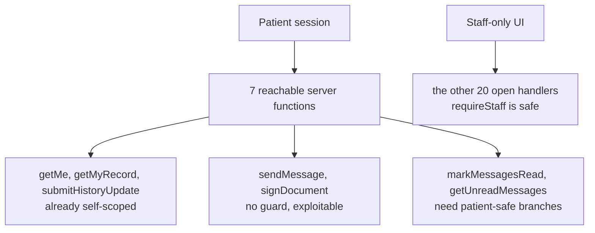

# Phase 2 Micro-Plan — Retrofit the open handlers

**Parent:** Aetheria Remediation Master Plan, Phase 2
**Depends on:** Phase 1 (complete) — the guards and the decision table
**Blocks:** Phase 3 (RBAC)
**Risk:** medium-high. This is the first phase where a mistake locks real users out of working pages.

## What the research changed

I mapped every server function a patient can reach. Two findings reshape the phase.

**Only 2 of the 22 open handlers are patient-reachable** — `markMessagesRead` and `getUnreadMessages`. The other 20 are staff-UI-only, so `requireStaff` on them cannot break anything a user does today. The retrofit is far safer than the count suggests.

**The two worst vulnerabilities are not in the 22 at all.** They are audit items 2 and 3 in the remediation backlog, both patient-reachable, and both currently exploitable by the test patient account:

- `sendMessage` ([clinic.functions.ts:1185](src/lib/clinic.functions.ts)) takes `patient_id` and `as: "staff" | "patient"` from the request body with **no guard**. A patient can write into any patient's thread, and can set `as: "staff"` so the message renders as if it came from the clinic. That is clinical impersonation.
- `signDocument` ([clinic.functions.ts:1757](src/lib/clinic.functions.ts)) updates by `.eq("id", data.id)` with **no guard and no ownership check**. Any authenticated user can sign any consent document by ID.

These go first.



## Decisions taken

- `signDocument` is restricted to **the patient who owns the document**. Staff cannot sign on a patient's behalf; no staff page calls it today.
- Patients can still reach staff **routes** (`/retention` and `/earnings` render staff chrome with empty data). No PHI leaks, since every query is role-gated. **Recorded as a finding, not fixed here** — Phase 2 stays server-side.

## Tier B — the three exploitable writes

**`sendMessage`** — derive the author from the session instead of the body, and scope the thread:

```ts
const identity = await loadIdentity(ctx);
if (identity.isStaff) {
  // staff may write to any thread in the clinic
} else if (identity.patient?.id !== data.patient_id) {
  throw new Error("Not your conversation");
}
const author = identity.isStaff ? "staff" : "patient";
```

The `as` field stays in the validator for now so the client keeps compiling; it is ignored. Removing it from the client is Phase 4's validator work.

**`signDocument`** — load the document's `patient_id` first and require it to match the caller's own patient record, via `requirePatientSelf`. This is the guard added in Phase 1 for exactly this case and currently unused.

**`deleteMyDocument`** ([:2704](src/lib/clinic.functions.ts)) — add `.eq("user_id", identity.userId)`. Verified safe: the delete button is behind `!readOnly` in [staff-files.tsx:386](src/components/staff-files.tsx), and [team.$id.tsx:312](src/routes/_authenticated/team.$id.tsx) passes `readOnly`, so no manager path deletes another person's document.

## Tier A and C — the 22, per the Phase 1 table

Line numbers verified current. Mechanical work: add the guard, and where a handler already calls `loadIdentity` with a hand-written check, replace it with the guard's return value so identity is not loaded twice.

- **`requireStaff` (16):** `getDashboard` :279, `listPatients` :543, `getCatalogue` :726, `listPractitioners` :737, `listAppointments` :755, `updateAppointmentState` :950, `addPhoto` :1105, `resendDocument` :1172, `listStaffDirectory` :1310, `getPractitionerDay` :1392, `dismissStaffInboxItem` :1464, `listMessageTemplates` :1604, `rescheduleAppointment` :3229, `listTreatmentColours` :3278, `getClinicDetails` :3516, `getAppointmentNote` :3645.
- **`requireStaffOrOwnPatient(patientId)` (2):** `getPatient` :589, `markMessagesRead` :1649.
- **`requirePermission("settings.treatments")` (2):** `listColourThemes` :3330, `listCatalogueItems` :3434.
- **Branch guard (1):** `getUnreadMessages` :1212. **The one place the obvious move is wrong.** Its patient branch is already correct and is polled by `NotificationBell` on every patient page. A guard at function entry breaks the portal bell. Only the staff branch gets `requireStaff`.

`getCatalogue`, `listTreatmentColours` and `getClinicDetails` take `requireStaff` per the decision you confirmed at the end of Phase 1.

## Verification — the part Phase 1 could not do

We now hold a patient and a manager login, so guards get tested by attacking them rather than by reading them.

1. **Capture the shape.** Sign in as the patient in Playwright and record the network request the app makes for a real `sendMessage`, to learn the server-function URL and payload format.
2. **Attack, expecting refusal.** Replay as the patient with: `as: "staff"` (must be forced to `patient`), another patient's `patient_id` (must throw), `signDocument` on a document belonging to another patient (must throw), and direct calls to `listPatients` and `getPatient` (must throw). Run each **before** the fix to confirm it currently succeeds — otherwise the test proves nothing.
3. **Portal still works.** As the patient: `/my-record` loads, the notification bell resolves, a message sends and appears as `patient`, and their own document signs.
4. **Staff still works.** Owner and manager sweeps over `/dashboard`, `/schedule`, `/patients`, `/patients/$id`, `/team`, `/settings`, `/performance`, `/retention`, with zero console errors.
5. `npx tsc --noEmit` stays at or below **52**.

## Documentation

Update the audit: resolve §4.3 and §4.4, mark the 22 closed, and add the new finding that patients can reach staff route chrome. Append the Phase 2 work log entry and write `docs/plans/phase-02-guard-retrofit.md`.

## Commit and push

Per your new workflow: **one commit at the very end**, once every to-do is built and verified. Then push to `origin/main` with legitzaisam's token, passed inline rather than stored in the keychain. That push carries the 8 unpushed commits already on `main` — phases 0 and 1 — plus Phase 2.

## Out of scope

No route-level redirects. No demo twin changes; the Vite plugin swaps the module by path, so demo keeps its looser behaviour and the drift stays recorded for Phase 11. No new permission keys (Phase 3), no zod (Phase 4), no schema changes (Phase 5).