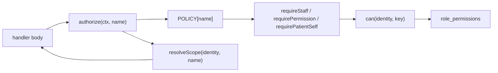

# Phase 3 — Capability-based RBAC

## Critical finding, discovered while planning

Six clinical write handlers in [src/lib/clinic.functions.ts](src/lib/clinic.functions.ts) have **no authorization statement of any kind**. Phase 2 closed the 22 handlers the audit listed; these were never on that list. Any authenticated user — including a patient with a portal login — can call them today:

- `savePatient` (:1004) — create or edit any patient's demographics, allergies, medications, conditions
- `addTreatment` (:1065) — write a clinical treatment record against any patient
- `saveAppointment` (:782) — book, edit or cancel any appointment, and trigger portal messages
- `sendDocument` (:1145) — issue a consent document to any patient
- `reviewHistory` (:1700) — stamp a medical history version as clinically reviewed, under the caller's name
- `saveAppointmentNote` (:3732) — write into a clinical note

Each begins straight at `const supabase = (context as Ctx).supabase;` with no guard. Since `requireSupabaseAuth` hands the handler a service-role client, RLS enforces nothing. This is Tier 0 and lands before anything else in the phase.

A whole-file sweep found 17 of 88 handlers with no guard reference. The other 11 are self-scoped by `user_id = context.userId` (`getMyRecord`, `submitHistoryUpdate`, `changeOwnPassword`, `getMyNote`, staff notification reads), so they are safe by construction but still undeclared.

## Deviation from the master plan

`patients.delete` is dropped. No handler hard-deletes a patient or its child rows, so the key would be a switch in the owner's grid that governs nothing. **`patients.edit` replaces it**, governing `savePatient`. Key count is unchanged at six new.

## Design

Capabilities govern **staff only**. Patients hold no capabilities and are governed by ownership rules (`requirePatientSelf`, `requireStaffOrOwnPatient`). This matters for `sendMessage`, which both staff and patients call — the capability check applies only when `identity.isStaff`, or the portal composer breaks.



New file `src/lib/auth/policy.ts`:

```ts
export type Access =
  | { kind: "staff" }
  | { kind: "capability"; key: PermissionKey }
  | { kind: "manager" } | { kind: "owner" }
  | { kind: "staffOrOwnPatient" } | { kind: "patientSelf" }
  | { kind: "self" };            // any signed-in user; handler self-scopes by userId

export const POLICY: Record<string, Access> = {
  savePatient: { kind: "capability", key: "patients.edit" },
  getMyRecord: { kind: "self" },
  // ... all 88
};
```

`authorize()` lands in [src/lib/auth/guards.server.ts](src/lib/auth/guards.server.ts) beside the existing guards, dispatches on the entry, and returns the identity — so it replaces both the guard call and the `loadIdentity` that usually follows it. Handlers needing a resource pass it: `authorize(ctx, "getPatient", { patientId: data.id })`.

## Scope: declared, not changed

Per your decision, no user sees different data after this phase. `resolveScope` centralises the three handlers that already self-scope and preserves their current — and mutually inconsistent — rules:

- `getDashboard` and `getRetention`: own book for a practitioner who is not a manager; clinic for everyone else including front desk
- `listOpenRecallTasks`: own assignments for anyone who is not a manager, which **includes front desk**

Declaring them side by side is what makes that inconsistency visible. Every other handler declares `clinic` explicitly.

## Work

**Tier 0 — close the six.** Guard the handlers above through the policy map, then verify by attack as the patient test account that each is refused.

**Tier 1 — keys 7 to 13.** Add `patients.edit`, `appointments.edit`, `treatments.record`, `documents.send`, `photos.manage`, `comms.send` to [src/lib/permissions.ts](src/lib/permissions.ts) with `PERMISSION_META` copy. The grid in [src/components/access-control-settings.tsx](src/components/access-control-settings.tsx) already iterates `PERMISSION_KEYS`, so rows appear automatically; add section headings since 13 flat rows scan poorly.

**Tier 2 — retrofit.** Replace roughly 45 ad-hoc checks with `authorize()`, including eight verbatim copies of `!identity.isOwner && !identity.permissions.includes("settings.treatments")` and around 20 copies of `if (!identity.isStaff) throw`.

**Tier 3 — completeness assertion.** A module-load check that every `export const … = createServerFn` name has a `POLICY` entry, and that `POLICY` has no entry without a handler. This is the control that makes another six-handler hole impossible, and it is the fixture the Phase 11 test suite builds on.

**Tier 4 — `notifications.delete` server-side.** Enforce on `dismissStaffInboxItem` and `dismissStaffInboxItems` only. Not on `markStaffNotificationRead` — [notification-bell.tsx](src/components/notification-bell.tsx):71 gates the dismiss and complete buttons, not marking read, and guarding read would break the bell for practitioners and front desk.

**Tier 5 — defaults and demo parity.** A migration seeds the six new keys **enabled for manager, practitioner and front desk**, so no staff member loses an ability they have today; the owner can now tighten them, which is the point of the phase. The work log will record the recommended clinical tightening (front desk off for `treatments.record`) as a deliberate owner decision rather than a silent change. [src/lib/clinic.functions.demo.ts](src/lib/clinic.functions.demo.ts):30-38 keeps its own duplicate copy of `PERMISSION_KEYS` — delete it and import from `permissions.ts`, then extend the seed in [src/lib/demo/data.ts](src/lib/demo/data.ts):179.

**Tier 6 — effective-permissions viewer.** A panel on the staff profile at [team.$id.tsx](src/routes/_authenticated/team.$id.tsx):310, between the profile card and documents. `getStaffProfile` returns the resolved grants computed by the same `can()` used at runtime, so the display cannot disagree with enforcement. Owners render as "Full access (clinic owner)".

**Tier 7 — audit coverage.** `setRolePermission` already writes to `audit_log`; match it in `updateStaffMember`, `revokeStaffAccess` and `restoreExTeamMember`.

## Verification

Reuse the Phase 2 Playwright harness and the `TestPhase2!2026` accounts. Confirm each Tier 0 handler is exploitable as a patient before the fix and refused after; sweep owner, manager and patient routes for regressions and zero console errors; toggle a capability off in the grid and confirm the matching handler refuses.

## Out of scope

Per-user permission overrides, RLS-level capability enforcement, and any real change to who sees which patients. Zod validation is Phase 4.