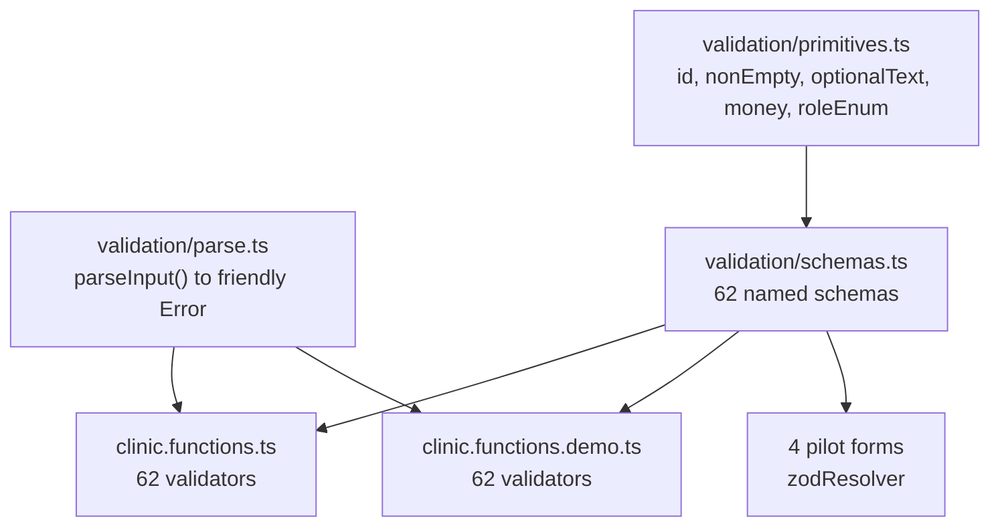

# Phase 4 — Runtime validation with zod

## What the research changed

Four findings move this away from a naive "add zod" pass.

**1. Schemas must not be passed directly to `.validator()`.** TanStack Start's `execValidator` detects Standard Schema (which zod 3.24+ implements) and reports failures as raw JSON:

```168:178:node_modules/@tanstack/start-client-core/dist/esm/createServerFn.js
async function execValidator(validator, input) {
	if (validator == null) return {};
	if ("~standard" in validator) {
		const result = await validator["~standard"].validate(input);
		if (result.issues) throw new Error(JSON.stringify(result.issues, void 0, 2));
```

Around 52 call sites do `onError: (e: Error) => toast.error(e.message)`, so `.validator(SavePatient)` would render a multi-line JSON blob in a toast. Every validator therefore keeps its function form and calls a wrapper that throws a readable single-line `Error`. This also preserves the declared TypeScript input type at each call site, avoiding type churn across 62 handlers.

**2. Validation is server-only.** The same file gates it on `env === "server"`, so the schema never runs in the browser. Server enforcement is real; inline client errors are genuinely net-new work, which is why the pilot forms are a separate task.

**3. Demo parity is free here.** The Vite plugin only rewrites `src/lib/clinic.functions.ts`:

```26:29:vite.config.ts
      if (source.includes("clinic.functions.demo")) return null;
      const resolved = await this.resolve(source, importer, { ...options, skipSelf: true });
      if (!resolved || path.normalize(resolved.id.split("?")[0]!) !== REAL_DATA_MODULE) return null;
      return this.resolve(DEMO_DATA_MODULE, importer, { ...options, skipSelf: true });
```

A new `src/lib/validation/` module is not swapped, so both `clinic.functions.ts` and its demo twin (which also has exactly 62 validators) import the same schemas. Unlike Phase 1's production-only guards, there is no drift to accept.

**4. The master plan's XSS premise is wrong and the plan says so.** `saveAppointmentNote` does skip `sanitizeNoteHtml`, but appointment notes are rendered as escaped React text everywhere (`patients.$id.tsx:1038`, `visit-note-chip.tsx:253`), and the only `dangerouslySetInnerHTML` in `src/` is static chart CSS in `ui/chart.tsx:73`. This is defence-in-depth, not a live vulnerability, and the audit will record it that way rather than claiming a fix.

## Strictness rule

Schemas mirror today's declared shapes plus safe hardening only: enums, number ranges, max lengths, `.trim()`, and non-empty on required fields. No format assertions that could reject data the app accepts today.

The concrete reason: demo ids are 6-4-4-4-12, not UUIDs.

```65:69:src/lib/demo/data.ts
function id(prefix: string) {
  idCounter += 1;
  const n = String(idCounter).padStart(12, "0");
  return `${prefix}0000-0000-4000-8000-${n}`.slice(0, 36);
}
```

So no `.uuid()`, and no `.datetime()` since `date_of_birth` is `YYYY-MM-DD` while `starts_at` is a full ISO string. Emails reuse the existing `checkEmail` from [src/lib/email.ts](src/lib/email.ts) rather than `z.string().email()`, keeping one definition of "valid email" across client and server.

## Structure



`parseInput(schema, data)` flattens a `ZodError` into one sentence naming the offending fields, so the existing toast pipeline stays useful without touching any `onError`.

## Server wiring

Each validator changes from a pass-through to a parse, keeping the input type annotation:

```ts
// before
.validator((data: { id: string }) => data)
// after
.validator((data: { id: string }) => parseInput(GetPatient, data))
```

The three validators that already coerce keep their behaviour: `saveMyNote` (line 3675) retains `sanitizeNoteHtml`, `getAppointmentNote` (3692) and `saveAppointmentNote` (3725) retain their `String()` and 20k slice, with the slice expressed as `.max()` in the schema.

`saveCatalogueItem` reuses the exported `CatalogueInput` type (clinic.functions.ts:3495) so the schema and type stay aligned.

## Completeness control

`scripts/check-validators.mjs`, modelled on the existing [scripts/check-policy.mjs](scripts/check-policy.mjs), fails the build if any validator is still a bare pass-through, if a schema is unused, or if a handler's production and demo validators reference different schema names. Registered as `npm run check:validators` alongside `check:policy`.

## Pilot forms

Four surfaces gain `useForm` + `zodResolver` against the same schemas, finally consuming the orphaned [src/components/ui/form.tsx](src/components/ui/form.tsx):

- [src/components/invite-staff-dialog.tsx](src/components/invite-staff-dialog.tsx) — already has hand-rolled email error state to replace
- [src/routes/_authenticated/patients.index.tsx](src/routes/_authenticated/patients.index.tsx) — uncontrolled `FormData`, currently only HTML `required`
- [src/components/treatment-catalogue-settings.tsx](src/components/treatment-catalogue-settings.tsx) — numeric fields where coercion bugs hide
- [src/routes/_authenticated/team.$id.tsx](src/routes/_authenticated/team.$id.tsx) — `commissionRate` number field

Deliberately excluded: `quick-add-appointment.tsx` and the `schedule.tsx` booking dialog. Both branch into an inline new-patient path spanning two schemas and are the highest-regression forms in the app; they belong in their own pass once the pattern is proven.

## Verification

Mirrors the Phases 2 and 3 method:

- `tsc --noEmit` no worse than baseline; `npm run check:policy` and `npm run check:validators` both green
- A new `/tmp/p4-attack.mjs`, reusing the authenticated session harness from `/tmp/p2-attack.mjs`, posts malformed payloads (wrong types, missing required fields, over-length bodies, invalid enum values) to representative handlers and asserts each is refused with a readable message rather than a JSON blob or a 500
- Regression sweeps `/tmp/p2-regress.mjs`, `/tmp/p2-positive.mjs`, `/tmp/p2-staffside.mjs` pass with zero console errors
- A demo-mode sweep under `npm run dev:demo` confirms the non-UUID fixture ids still validate
- Manual pass over the four pilot forms confirming inline errors appear and valid submits still succeed

## Risks

- The largest regression risk is a schema being stricter than reality in a field the audit did not sample. The attack script tests rejection; the regression sweeps test acceptance, and both must pass before commit.
- `sanitizeNoteHtml` is regex-based, not a real HTML sanitizer, and `saveMyNote` HTML is re-parsed by Tiptap `setContent` on read. Since that note is self-scoped, the exposure is self-XSS only. Replacing it with a proper sanitizer is out of scope here and will be recorded as a residual risk.
- The Tiptap duplicate `link`/`underline` extension warning in `src/components/notes/rich-notes-editor.tsx:92` remains unfixed and out of scope.