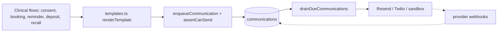

# Phase 9 — Wire comms to real flows, behind a real regression suite

## What I found

The pipe is finished; nothing is plugged into it.

- `enqueueCommunication` in [src/lib/comms/enqueue.server.ts](src/lib/comms/enqueue.server.ts) is the single insert path into `communications`, it already enforces PECR via `assertCanSend`, and **zero clinical flows call it**. The only caller is the standalone handler at [src/lib/clinic.functions.ts:1778](src/lib/clinic.functions.ts).
- Adapters, sandbox, backoff, drain route and provider webhooks all work ([src/lib/comms/dispatch.server.ts](src/lib/comms/dispatch.server.ts), [src/routes/api.comms.drain.ts](src/routes/api.comms.drain.ts)).
- Every patient-facing flow still writes an in-app `messages` row and nothing else. `send-recall-dialog.tsx:188` still hands off to `mailto:`.
- **No test runner is installed.** Zero test files, zero `data-testid`, no CI. `playwright@1.62.1` is in `node_modules` from an ad-hoc install but is not a declared dependency.

Two schema facts that shape the work:

- `documents` already has `access_token` (24 random bytes, DB default), `expires_at`, `viewed_at` and `signed_ip` ([migration :182](supabase/migrations/20260811000643_aff14f8f-3fe3-444a-83a0-912425c27725.sql)). The magic link needs **no new columns** — only an index and code that actually uses them.
- `communications.patient_id` is `NOT NULL`, so **staff invites cannot go through the outbox**. They go through Supabase Auth's own mail (Phase 6 SMTP), which is the right transport anyway.

## Design decisions

- **Reminders are enqueued at booking time** with a future `scheduled_for`, not swept by a nightly cron. The Phase 8 drain already respects `scheduled_for`, so this needs no new scheduling surface. Reschedule and cancel supersede pending rows, which requires one new enum value: `cancelled`.
- **Single-use signing falls out of Phase 5.** The `documents_signed_immutable` trigger raises `restrict_violation` on any update where `OLD.status = 'signed'`, and it fires for the service-role client. A replayed magic link cannot re-sign.
- **Unsubscribe tokens are HMACs**, not a stored column: `HMAC(patient_id, COMMS_UNSUBSCRIBE_SECRET)`. No migration, not enumerable.
- **Purpose per flow:** consent, booking, reschedule and deposit are `transactional`; appointment reminders are `reminder`; recall and retention are `marketing`. That is the conservative PECR reading and it means recall respects `marketing_opt_in`, which is the behaviour change staff will notice most.
- **`bookingNotifyDescription()` and the six "posted to their patient portal" toasts get rewritten last**, once dispatch is proven. Reverting copy before behaviour is exactly the mistake Phase 0 existed to fix.



---

## Phase 9a — Regression suite against the current baseline

Built first and committed first, so Phases 0-8 behaviour is locked before anything moves.

### Tier 1: Vitest units for logic demo mode cannot reach

`vitest@^5` is the correct major — it declares `vite: ^8.0.0` and needs Node >= 22.12, both of which this repo already satisfies. Add `vitest.config.ts` with `environment: "node"` and the `vite-tsconfig-paths` plugin so `@/` resolves.

New `tests/unit/`:

- `comms-preferences.test.ts` — the full `assertCanSend` truth table: 3 purposes x 2 channels x opt-in combinations, plus that `unsubscribed_at` blocks reminder and marketing but **not** transactional, and `nextUnsubscribedAt` only stamps when both flags are off.
- `comms-dispatch.test.ts` — `applyDelivery` for sent, retry-with-backoff, and `failed` at `COMMS_MAX_ATTEMPTS`; `claimDueInMemory` for due/not-due, the 5-minute stale-`sending` reclaim, ordering and limit; `drainInMemory` summary counts.
- `comms-config.test.ts` — `backoffSeconds` doubling and the 3600s cap.
- `comms-webhooks.test.ts` — `applyWebhookStatus` mapping, and that `verifyResendSignature`/`verifyTwilioSignature` reject a missing or wrong signature.
- `payment-link.test.ts` — `bookingDetailsMessage` for each `paymentStatus` branch, deposit arithmetic, and `patientPaymentUrl` encoding.
- `permissions.test.ts` — `can()` for all five roles across the expanded key set.
- `policy-scope.test.ts` — `resolveScope` for each `ScopeRule` x role, which is the matrix the master plan calls "the regression that matters most".

### Tier 2: Playwright E2E on demo mode

Determinism first: demo fixtures derive from `const NOW = new Date()` at [src/lib/demo/data.ts:71](src/lib/demo/data.ts), so the diary shifts daily. Add a `__DEMO_NOW__` define next to `__DEMO_MODE__` in [vite.config.ts:43](vite.config.ts), declare it in [src/lib/demo/enabled.ts](src/lib/demo/enabled.ts), and make line 71:

```ts
const NOW = DEMO_NOW ? new Date(DEMO_NOW) : new Date();
```

Playwright then runs with a pinned `DEMO_NOW`, and every fixture date becomes stable.

`playwright.config.ts`: `webServer: { command: "npm run dev:demo", url: "http://127.0.0.1:8080", reuseExistingServer: !process.env.CI }`, Chromium only, `trace: "on-first-retry"`.

`e2e/fixtures.ts` provides a `rolePage` fixture that sets the `demo_role` cookie (read server-side at [src/lib/clinic.functions.demo.ts:76](src/lib/clinic.functions.demo.ts)) and hides the demo role switcher, so tests skip `/auth` entirely — which matters because the auth pages instantiate the real Supabase client.

Specs, covering everything built so far:

- `smoke.spec.ts` — all 16 routes render for each of `owner`, `practitioner`, `front_desk`, `patient`; no error boundary, no indefinite "Loading...".
- `rbac.spec.ts` — nav item visibility and permission redirects per role; asserts front desk cannot reach `/performance`, practitioner sees own-book scoping on `/dashboard`.
- `schedule.spec.ts` — book an appointment through the dialog, reschedule it, walk the stage tracker.
- `patients.spec.ts` — search and filter, open a record, each tab, save demographics.
- `documents.spec.ts` — issue a consent form, use Remind.
- `comms.spec.ts` — the outbox card shows the queued Olivia fixture; Process queue moves it to `sent` with provider `sandbox`; preference toggles persist.
- `retention.spec.ts` — recall dialog, task lifecycle `open` to `contacted` to `completed`.
- `portal.spec.ts` — as `patient` on `/my-record`: sign a document, submit history, read messages.
- `team.spec.ts` — team list, member detail, invite dialog.

Selectors use role plus accessible name (99 `aria-label`s already exist). Add `data-testid` **only** where that is genuinely ambiguous — diary grid cells in `schedule.tsx` and patient list rows. Not a blanket rollout.

### Tier 3: one gate

```json
"test:unit": "vitest run",
"test:e2e": "playwright test",
"verify": "npm run lint && npm run check:policy && npm run check:validators && npm run check:tenancy && npm run test:unit && npm run test:e2e"
```

Plus `.github/workflows/verify.yml` running the same thing. `tsc --noEmit` stays a manual check against its current error count (~49) rather than a gate, matching how Phase 8 handled it.

**Commit:** `test: add unit and end-to-end regression suites`

---

## Phase 9b — Consent magic link and public signing route

1. **Migration** `20260914000000_comms_phase9.sql`: index on `documents(access_token)`; `ALTER TYPE communication_status ADD VALUE 'cancelled'`; new `document_access_events` table (`document_id`, `event` view/sign/rejected, `ip`, `user_agent`, `created_at`) which serves double duty as consent evidence and as the per-IP rate-limit source.
2. **`src/lib/documents/access.server.ts`** — `resolveDocumentByToken(token)` using the admin client: returns the document only when the token matches, `status <> 'signed'` and `expires_at > now()`. Every other outcome returns the same uniform not-found, so the route cannot be used to probe. Records the access event and stamps `viewed_at`.
3. **`src/routes/d.$token.tsx`** — public, `ssr: false`, no auth middleware. Renders title, body and fields, a labelled signature-name input, and posts to a `signDocumentByToken` route handler that writes `status`, `signed_at`, `signed_name`, `signature_data` and `signed_ip` from the request. No patient PHI beyond the document itself. A replay hits the Phase 5 trigger and shows "already signed".
4. **Wire `sendDocument`** ([clinic.functions.ts:1237](src/lib/clinic.functions.ts)) — set `expires_at` (14 days) on insert, then `enqueueCommunication` with `purpose: "transactional"`, `templateKey: "consent_request"`, `relatedEntity: "documents"`. Keep the portal `messages` insert as the secondary channel.
5. **Wire `resendDocument`** ([:1278](src/lib/clinic.functions.ts)) — currently only bumps `sent_at` and writes no portal message at all, despite the UI claiming otherwise. Add both the enqueue and the missing portal message.

**Tests:** `e2e/consent-magic-link.spec.ts` (issue, open `/d/$token` unauthenticated, sign, confirm replay is refused, confirm a garbage token 404s identically to an expired one) and unit tests for `resolveDocumentByToken` outcome mapping.

**Commit:** `feat: email consent documents with a public signing link`

---

## Phase 9c — Transactional flows

1. **`src/lib/comms/templates.ts`** — pure `renderTemplate(body, vars)` reusing the `{{first_name}}`, `{{full_name}}`, `{{treatment}}`, `{{due_date}}`, `{{clinic}}` set already implemented client-side in [send-recall-dialog.tsx:108](src/components/retention/send-recall-dialog.tsx), plus a `TEMPLATE_KEYS` registry of built-in transactional bodies. Extract the duplicated client interpolation to import from here. Fully unit tested, including unknown variables and unclosed braces.
2. **`channelsFor(patient, purpose)`** in the same module — email when an address exists; add SMS for reminders only, where it actually moves no-shows. One rule, one place.
3. **Booking confirmations** — `saveAppointment` ([:831](src/lib/clinic.functions.ts)) already builds the body with `bookingDetailsMessage()` and only inserts it into `messages`. Enqueue the same body. The update path at `:879` currently returns silently; give it a reschedule confirmation.
4. **`rescheduleAppointment`** ([:3758](src/lib/clinic.functions.ts)) — send a reschedule confirmation and cancel superseded reminder rows.
5. **Deposit chasing** — the `PaymentChip` in [today-snapshot.tsx:924](src/components/dashboard/today-snapshot.tsx) and `PaymentStatusChip` in [schedule.tsx:1024](src/routes/_authenticated/schedule.tsx) both call `sendMessage`. Add a `sendPaymentRequest` handler (policy `{ kind: "capability", key: "comms.send" }`) that enqueues and posts to the portal, and point both chips at it. This also removes one copy of duplicated chip logic.
6. **Recall and retention** — replace the `mailto:`/`sms:` handoff at [send-recall-dialog.tsx:183-197](src/components/retention/send-recall-dialog.tsx) with a real `marketing` send, and populate `retention_outreach.communication_id`, which Phase 7 added and nothing has ever written. Keep the manual log path for phone calls.
7. **Staff invitations** — `inviteStaffMember` ([:2171](src/lib/clinic.functions.ts)) returns a plaintext temporary password that the manager copies or pastes into `mailto:`. Switch to `supabaseAdmin.auth.admin.generateLink({ type: "invite" })`, stop returning `temporaryPassword`, and strip its display from [invite-staff-dialog.tsx:95-117](src/components/team/invite-staff-dialog.tsx). Not the outbox — `communications.patient_id` is `NOT NULL`.
8. **Correct the copy**, now that it is true: `bookingNotifyDescription()` ([payment-link.ts:89](src/lib/payment-link.ts)), the six portal-only toasts, the `schedule.tsx:798/836/840` booking-dialog text, and the still-misleading chip hover copy at `schedule.tsx:1135/1159` and `today-snapshot.tsx:1038/1062` that Phase 0 did not reach.

Each new handler needs a `POLICY` entry, an `authorize(ctx, name)` call, a zod schema and a demo twin, or `check:policy` and `check:validators` fail.

**Commit:** `feat: send bookings, deposits, recall and staff invites for real`

---

## Phase 9d — Scheduled reminders, unsubscribe, audit trail

1. **Reminder offsets** — add `reminder_offsets` (default `[168, 24]` hours) to clinic settings, exposed in [settings.tsx](src/routes/_authenticated/settings.tsx). `saveAppointment` enqueues one `reminder` row per offset with `scheduled_for = starts_at - offset`, skipping any already in the past.
2. **Supersede on change** — a `cancelPendingCommunications(relatedId, purpose)` helper setting queued rows to `cancelled`, called from reschedule and cancel. `dispatch.server.ts` claims only `queued`, so `cancelled` is inert by construction.
3. **Unsubscribe** — `src/lib/comms/unsubscribe.server.ts` with `unsubscribeToken(patientId)` / `verifyUnsubscribeToken(token)` over `COMMS_UNSUBSCRIBE_SECRET`, a public `src/routes/u.$token.tsx` that clears `marketing_opt_in` and `reminders_opt_in` and stamps `unsubscribed_at`, and a footer line appended by `renderTemplate` for non-transactional email. Add the secret to `.env.example`.
4. **Comms audit trail** — the existing `CommsLogCard` on the patient record gains the `template_key`, `related_entity` and `purpose` columns so outreach history reads as one story. Log click-to-dial attempts against `communications` as the master plan asks, so calls appear alongside sends.
5. **`message_templates` into dispatch** — add a nullable `key` column, seed the four demo templates with keys, and let staff-composed sends resolve a template by key and render it server-side rather than client-side.

**Tests:** unit coverage for the HMAC round-trip (including a tampered token), offset computation and `cancelPendingCommunications`; `e2e/reminders.spec.ts` asserting two queued reminder rows appear after booking and flip to `cancelled` after reschedule; `e2e/unsubscribe.spec.ts` for the public route.

**Commit:** `feat: schedule appointment reminders and handle unsubscribes`

---

## Verification

1. `npm run verify` → green. Expect ~95 unit assertions and ~60 E2E cases.
2. `npm run check:policy` → handler count rises from 96 to ~100, all declared and all calling `authorize()`.
3. `npm run check:validators` → rises from 67 in step with the new handlers, prod and demo validators matching.
4. `npm run check:tenancy` → 31 tables classified (`document_access_events` added to `UNSCOPED_TABLES`); raw `supabaseAdmin` count in `clinic.functions.ts` unchanged, since the public routes are separate files like `api.comms.drain.ts` already is.
5. Demo, owner, Olivia: issue a consent form → outbox shows a queued `transactional` row → Process queue → `sent`, provider `sandbox`. Open `/d/$token` in a fresh incognito context → sign → document shows signed with an IP. Reload the same link → refused.
6. Demo, front desk: recall a patient with `marketing_opt_in` off → blocked with "has not opted in to marketing messages", and **no** row is queued.
7. `curl -X POST localhost:8080/api/comms/drain` → still 401.
8. Confirm nothing reaches Resend or Twilio: `COMMS_SANDBOX=1` and demo is always sandbox.

## Out of scope

pg_cron scheduling (still the manual dashboard step Phase 8 defined), SPF/DKIM/DMARC, real telephony, portal invitations linking `patients.user_id` (Phase 10), live-Supabase E2E, and the god-component splits (Phase 11) — though 9c removes one duplicated chip on the way past.

## On completion

Append `docs/WORKLOG.md` entries for Phases 6, 7 and 9 (6 and 7 shipped without one), write `docs/plans/phase-09-comms-flows.md`, and set Phase 9 complete in the master plan.