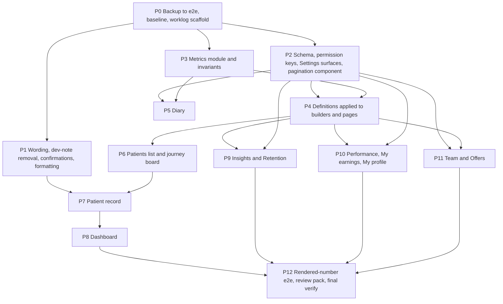
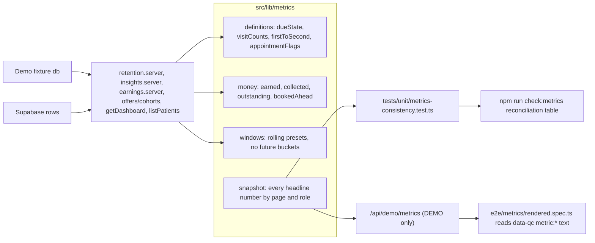

# Clinic portal feedback, diary Needs-action filter, metrics validation layer

Sources: `Claude outputs/Aetheria clinic portal owner view to-do.md`, `Claude outputs/diary-status-filter-mockup.html`. Scope agreed: Before-2-October items, every per-page fix, the diary control and the validation layer; large features go to a follow-on phase (listed at the end). The Attention-needed chase list is out.

## Branch and credentials (applies to every phase)

- All development happens on `e2e_live`, which stays checked out for the whole plan. `e2e` receives one fast-forward push at the start of Phase 0 as a backup of everything built so far and is not touched again by this plan (no checkout, no commits, no further pushes to it unless you ask).
- Every push uses Zaisam's token in the remote URL: `git push https://<ZAISAM_TOKEN>@github.com/legitzaisam/patientsys.git <refspec>`. Never `git push origin …` (that would go through the macOS keychain credential), never `--force`, never rebase, amend or squash anything already pushed (Lovable-connected repo).
- Commits carry the existing author identity: `git -c user.name="$(git log -1 --format=%an)" -c user.email="$(git log -1 --format=%ae)" commit …`. `.cursor/`, `Claude outputs/` and `.tmp-*.mjs` are never committed.

## Decisions taken (from the two question rounds)

- Due / overdue / to chase: only active patients with no upcoming booking count. Due soon = next due within 30 days; Overdue = next due in the past (no 180-day cut-off; Lapsing/Lost become a days-since-last-visit breakdown of the same people). To chase = Overdue + Due soon + lapsing/lost without a due date. Dashboard "Treatments due" = Overdue + Due soon.
- One visit only / Treated once: exactly one treatment visit ever (any type), population = patients seen in the selected period; the Insights Book tab gains the period picker.
- First-to-second: of patients whose first visit was in the period and at least 180 days ago, share with a second visit within 180 days. One function for Insights, Retention and the cohort table.
- "1 year" preset = rolling 12 months ending today, heading "Last 12 months", on every picker; affected e2e expectations are updated.
- Money: Earned = value of treatments performed in the period; Collected = the paid part of that value (full payment in full, deposit at its 30%); Outstanding = Earned − Collected. Future-booking money is a separate "Booked ahead" line. My earnings shows the practitioner's share of each and is renamed "Your share".
- Names: "Grace Adeyemi" in prose and cards; surname-first only in the sortable Patients table; title only on the record header.
- Diary Needs action applies to day and week views; month shows counts only.
- Patients list pagination 25 per page; Insights lists and Settings treatments 10 per page; Select all selects all matching across pages.
- "What sold" and retail share move to Performance. My earnings hidden for an owner with no treatments as practitioner in the last 12 months. iPad: tap opens the desktop hover card as a popover.
- Validation layer: all four layers (shared definitions, unit invariants, check:metrics guard, rendered-number e2e).

## Interpretations to confirm at review (small items the doc leaves open)

- "Yellow outline to the icons on header" = a butter ring (`ring-1 ring-accent`) on the four toolbar icon buttons in `src/components/app-shell.tsx`, always on.
- "Journey tab" on the record: the record has no plan view, so journey cards deep-link to a new Treatment plan card at the top of the Treatments tab (`/patients/$id?tab=treatments#plan`), built from the plan/milestone rows the board already uses.
- Recall task "due date" = new nullable `due_at` column (migration + demo), defaulting to 7 days after creation, editable when creating; "owner" = assignee.
- Quick book "details incomplete" = new `details_incomplete` flag (migration + demo) set by Quick book, cleared on edit; shown as a chip and as a fifth Needs-action type.
- Access defaults: Receptionist loses Insights and Treatments & colours; Practitioner gains Insights; Manager gains Design and automate offers. New keys: `patients.edit` (manager and practitioner on, receptionist off) and `reports.commission` (owner only by default; a manager without it sees counts, attendance and retention on Performance, never money).
- Receptionist "medical alert flag without details": follow the who-sees-what table instead (receptionist sees allergies, medication, conditions); receptionist loses Medical history and From the patient by default; Documents shows signed/due status only; Archive opens to owner and manager.
- Cohort table with H = 180: cohorts younger than six months show "N% so far" in muted type; the current month shows "Too early".
- Offer results: booked = a non-cancelled appointment created after the claim; revenue = treatments performed for that patient after the claim within validity + 90 days.
- Settings tabs are created only for what exists (Clinic, Treatments, Products, Payments and deposits, Integrations); Payments and deposits is new because the dashboard deposit rule must read from it (`deposit_lead_days`, `deposit_percent` on `clinics`).
- Week-view fullness uses 09:00–18:00 until real working hours exist (follow-on).
- Timestamps become date + HH:mm; "Last seen today / yesterday / N days ago".

## Phase order and dependencies

Phases run from the least dependent to the most dependent. Each phase ends with a verify step, one commit on `e2e_live`, and its own worklog file.

## Worklog per phase

`docs/portal-feedback/README.md` is the index: every bullet of the to-do doc, the phase that handles it, and its status (done / follow-on / declined with reason). Each phase writes `docs/portal-feedback/worklog/NN-<phase>.md` with the same template:

- Scope: the doc bullets covered, quoted.
- Changes: one entry per item: files touched, what changed and why, migration or demo parity if any.
- Verification: the exact commands run and their results (counts, deltas), and which e2e expectations were updated and why.
- Captures: paths of the screenshots taken for the item (from Phase 5 onwards, using the responsive config).
- Notes: anything left, any interpretation made, anything for the follow-on phase.

## Architecture of the validation layer

Every page computes through the same functions (production and demo paths both call the shared builders already; `getDashboard` and `listPatients` inline their maths today and are moved onto the module). Every rendered number gets `data-qc="metric:<id>"` so the e2e spec can compare the DOM with the snapshot.

## Phase 0: backup to e2e, baseline, worklog scaffold (no product code)

- Backup: stay on `e2e_live`; confirm the tree is clean and `e2e_live` matches `origin/e2e_live` (`a21909d`); `git push https://<ZAISAM_TOKEN>@github.com/legitzaisam/patientsys.git e2e_live:e2e` is a fast-forward from `94fc1b6` (Zaisam's token in the URL, keychain untouched, no force, no history rewrite); `git fetch` with the same URL and `git branch -f e2e origin/e2e` to move the local `e2e` ref without checking it out; confirm with `git ls-remote` that `e2e` is at `a21909d`. From here `e2e` is the backup and every commit in Phases 1–12 lands on `e2e_live`.
- Baseline: full Chromium e2e (126/131 with the five known failures listed), unit (132/133, `policy-scope`), `tsc` (103), `test:responsive:gate`, non-Prettier lint counts on the files this plan touches. Recorded in `worklog/00-backup-and-baseline.md`.
- Scaffold `docs/portal-feedback/README.md` with the full bullet index (all rows "pending" and their phase) and the worklog template.

## Phase 1: wording, dev-note removal, confirmations, formatting (depends on nothing)

Everything here is string, style or dialog work with no data dependency, so it goes first and de-risks the rest.

- Dev notes: `src/components/security-settings.tsx:192`, `src/components/comms/comms-preferences.tsx:61`, `src/components/comms/comms-log.tsx` (subtitle, "Process queue", provider "sandbox", attempts behind a new `showDiagnostics` prop passed as `identity.isAdmin` from `patients.$id.tsx:694`), `src/components/retail-product-settings.tsx:86`, `src/components/insights-integrations-settings.tsx` moved to the software-admin `/access` surface. `e2e/comms.spec.ts` and `e2e/offers.spec.ts` drive the drain as admin.
- Team subtitle `team.index.tsx:369`; "Receptionist" in `demo/role-switcher.tsx:9`, `dashboard.tsx:114`, `invite-staff-dialog.tsx:38`, `staff-alert-dialog.tsx:36,44`, `notes/share-note-button.tsx:23`, demo note bodies; benchmarks in `insights/patient-metrics.tsx:60,71,78,191`; marketing sub-toggles in `comms-preferences.tsx`.
- Wording: Insights (`funnel-tiles.tsx:22`, `funnel-chart.tsx`, `insights.tsx:66-148`, `access-catalogue.ts:217`), Retention (`suggested-actions.tsx:54`, `retention.tsx:147`), Performance (`performance-table.tsx:147`, `performance.tsx:102`), Security and Profile (`security-settings.tsx:248,373`, `profile.tsx:182`), record tab rename (`patients.$id.tsx:667`, `access-catalogue.ts:157`, `permissions.ts:139`; `e2e/patients.spec.ts:29`, `e2e/responsive/pages.ts:493`), dashboard "Session N" (`today-snapshot.tsx:593`), sidebar badge (`app-shell.tsx:528-543`).
- `src/lib/format.ts` (`moneyWhole`, `dateTime`, `daysAgoLabel`, `displayName`) applied at `performance.tsx:130`, `retention.tsx:147`, `earnings.tsx:57-65`, `my-performance-kpis.tsx`, `staff-performance-kpis.tsx`, `performance-table.tsx`, `at-risk-table.tsx:430`, `comms-log.tsx:125`, `patients.$id.tsx:434,1251`, `sent-staff-alerts.tsx:51`.
- `src/lib/journey-phases.ts` replaces `journey-board.tsx:35` and `treatment-journeys.tsx:38`.
- `AlertDialog` confirmations (`team.index.tsx:433-468`, `offers.tsx:217`, `message-composer.tsx:233`, Settings archives); `src/hooks/use-unsaved-changes.ts` on the four page forms.
- Header ring, sidebar Team scroll + "See all", list captions, dashboard skeleton and error states, DOB placeholder and Select-all label.
- Verify: unit; e2e patients, comms, offers, team, smoke, rbac; tsc and lint deltas 0. Commit. `worklog/01-wording-and-consistency.md`.

## Phase 2: schema, permission keys, Settings surfaces, pagination component (depends on nothing; many phases depend on it)

- Migrations (nullable, demo parity, `check:validators` and `check:tenancy` green): `clinics.deposit_lead_days` / `deposit_percent`; `appointments.details_incomplete`; `recall_tasks.due_at`; `profiles` registration and insurance fields; `offer_templates` rules; capability seeding for `reports.commission` and `patients.edit`.
- `permissions.ts` and `access-catalogue.ts`: the two new keys, the defaults review, and the audit note; `setRolePermission` writes `audit_log` through `audit()` (demo `auditLog`).
- POLICY: `listAccountsMissingEmail` → `manager` (demo twin authorizes), `archivePatient` → `manager`.
- `src/components/pagination-bar.tsx` + `usePagination` on `ui/pagination.tsx`; Settings tabs; treatments list paginated 10 with "Show archived"; reset icon hidden at default; retail "Archive" as text; Payments and deposits tab.
- Verify: `check:*`, unit (access-catalogue, permissions updated), e2e rbac, team, smoke; tsc. Commit. `worklog/02-schema-keys-settings.md`.

## Phase 3: metrics module and invariants (depends on nothing; Phases 4–12 depend on it)

- `src/lib/metrics/definitions.ts`, `appointment-flags.ts` (with `phaseOf` moved out of `arrival-alerts.tsx`), `money.ts`, `windows.ts`, `snapshot.ts`; `period-picker.tsx` rolling 12 months and headings.
- `tests/unit/metrics-definitions.test.ts` (edge cases) and `tests/unit/metrics-consistency.test.ts` over the real demo `db` through `vitest.metrics.config.ts` (pinned `__DEMO_NOW__`). Invariants: dashboard treatmentsDue = overdue + dueSoon; dashboard overdue = Retention overdue; to chase = Retention at-risk length; Retention oneVisit(window) = Insights treatedOnce(window); composition none + once + twoPlus = population; Insights f2s = Retention headline f2s = cohort weighted average; Earned = Collected + Outstanding per practitioner and in totals; My earnings share = Σ earnedShare; Offers singleTreatment = oneVisit − booked − onPlan; Patients "Treatments due" filter count = dashboard treatmentsDue; each list row's open pill = the record's open items; Treatments tab badge = bookingChase length; sidebar Diary badge = today's appointments; every window ends ≤ now and no chart bucket is in the future; portal plan progress for Olivia = clinic-side plan progress. The UI-wired ones are `todo` until Phase 7.
- `scripts/check-metrics.mjs` and `npm run check:metrics` (in `verify`).
- Verify: unit. Commit. `worklog/03-metrics-module.md`.

## Phase 4: definitions applied to builders and pages (depends on 2 and 3; completes Before-2-October)

- `retention.server.ts`, `insights.server.ts`, `earnings.server.ts`, `offers/cohorts.ts`, `getDashboard` and `listPatients` (prod and demo) onto the module; the Finn Thornhurst next-due fix; server-side "Treatments due" and "No upcoming treatment" filters.
- Surfaces name their window and comparison; Performance "Booked ahead"; dashboard retention card loses its change chip; treatments completed in period on practitioner rows.
- `e2e/feedback-corrections.spec.ts` label updates.
- Verify: `check:metrics`, unit, full Chromium e2e, tsc, `test:responsive:gate`. Commit and push. `worklog/04-definitions-applied.md`.

## Phase 5: Diary (depends on 2.2 and 3.2)

- `src/components/schedule/needs-action-control.tsx` and the day/week/month wiring per the mockup; colour key; own-diary default (`schedule.tsx:327`); tap popover; `getPractitionerDay` (`clinic.functions.ts:2590`) on `clinic-time`; details-incomplete chip.
- Verify: e2e schedule, reminders, treatment-workflow; responsive schedule pages with a `needs-action-open` state. Commit. `worklog/05-diary.md`.

## Phase 6: Patients list and journey board (depends on 2 and 4)

- `patients.index.tsx`: pagination 25, filters, hint, cross-page Select all, Next treatment date, surname-first via `displayName`, pill link, practitioner default; Send offer warning and recall-task closure; board Book button, late colour, at-risk ordering, Due/Booked labels.
- Verify: e2e patients, offers, feedback-corrections; responsive patients and board. Commit. `worklog/06-patients-list-and-board.md`.

## Phase 7: Patient record (depends on 1, 2, 3, 6)

- Header actions and ⋯ menu; Open chat with unread badge; side chat panel removed (`registerChatPage` at `patients.$id.tsx:157` sets `docked: false`); badge semantics; Recall tasks card = open items with Assign to; Treatment plan card (`#plan`); who-sees-what; lifetime spend; last-seen wording.
- Verify: e2e patients, treatment-workflow, patient-portal sync; responsive record states; UI-wired invariants asserted. Commit. `worklog/07-patient-record.md`.

## Phase 8: Dashboard (depends on 2, 3, 4, 7)

- Card order; week summary strip; journey links to `#plan`; My tasks due and assignee; KPI links; deposit copy from settings; server-side week filter.
- Verify: e2e feedback-corrections, treatment-workflow, smoke; responsive dashboard. Commit. `worklog/08-dashboard.md`.

## Phase 9: Insights and Retention (depends on 2, 3, 4)

- Patient base tab with period picker and last-visit buckets; paginated next-step lists with Schedule; palette; What sold removed here; at-risk table sticky column, no practitioner column, Assign to in Send recall; cohort Too early / so far; y-axis %.
- Verify: e2e retention, feedback-corrections; responsive insights and retention; `check:metrics`. Commit. `worklog/09-insights-and-retention.md`.

## Phase 10: Performance, My earnings, My profile (depends on 2, 3, 4)

- Performance single period and two series, expanded-row fit, `reports.commission` gating, retail share and What sold; My earnings "Your share", hide rule, rate, payout status, CSV and print, icons, dock clearance; My profile summary and link, period highlight, registration fields and owner reminder, tabs above the heading.
- Verify: e2e feedback-corrections:137, rbac, smoke; responsive performance, earnings, profile; `check:metrics`. Commit. `worklog/10-performance-earnings-profile.md`.

## Phase 11: Team and Offers (depends on 2, 3, 4)

- Team columns and audit notes; Offers card width, reconciled stage labels, toggle-on preview, results per offer, rules enforced in `offers/send.ts`, delay on the card.
- Verify: e2e offers, team; responsive offers and team; `check:metrics`. Commit. `worklog/11-team-and-offers.md`.

## Phase 12: rendered-number e2e, review pack, final verify (depends on everything)

- `data-qc="metric:<id>"` on every number in both portals; `src/routes/api/demo/metrics.ts` (DEMO only); `playwright.metrics.config.ts` with pinned `DEMO_NOW`; `e2e/metrics/rendered.spec.ts` for five roles; `npm run test:metrics`.
- `e2e/review/feedback-captures.spec.ts` under the responsive config → `docs/portal-feedback/captures/` and `docs/portal-feedback/REVIEW.md` mapping every doc bullet to its status and capture, for sign-off against the doc.
- Full verify: `check:policy`, `check:validators`, `check:tenancy`, `check:metrics`, unit, Chromium e2e (known failures either fixed by the new labels or exactly the pre-existing set), `test:metrics`, `test:responsive:gate` at major, tsc delta 0, lint delta 0. Finish the README index and `worklog/12-validation-and-review.md`. Commit and push `e2e_live`.

## Regression guardrails throughout

- Every renamed string is grepped in `e2e/` and updated in the same commit ("History updates", "Process queue", "sandbox", "This year", "Front desk").
- Existing `data-qc` hooks and e2e selectors are preserved; new controls get new hooks.
- No whole-file reformatting; edits stay surgical; the regression `playwright.config.ts` is untouched (metrics and review runs use their own configs).
- Unit and the affected e2e after every phase; the full stack (e2e, tsc, checks, responsive gate) after Phases 4, 8 and 12; one commit per phase on `e2e_live`, pushed to `origin/e2e_live` with Zaisam's token URL (never via `origin`) at the end of Phases 4 and 12 and any time you ask. `e2e` is not pushed to again after the Phase 0 backup.
- Production stays working: new columns land as nullable migrations with demo parity and `check:validators` / `check:tenancy` green.

## Follow-on phase (not in this plan)

Medical-update review workflow (the doc's top safety item; say if you want the thin slice of badge + notification + Mark reviewed pulled forward), working hours / breaks / leave with diary shading and real `getPractitionerDay` hours, server-side enforcement of the record role table (`getTreatmentRecord`, `getTreatmentSession`, `getAppointmentNote`) and the front-desk clinical seed defaults, the missing Settings (hours, cancellation and no-show policy, rooms, templates, VAT, payment provider, retention period, subscription, audit log view), retail sales against a visit with stock, more offer stages, and the roadmap items.
