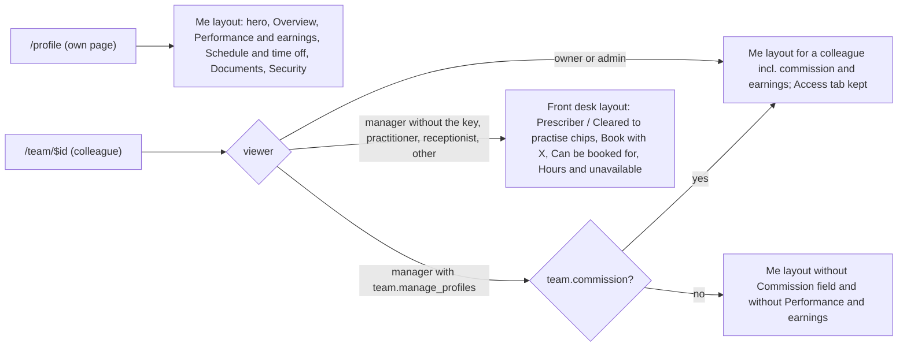

# Profile redesign and Sqinos logo

Decisions confirmed: role-routed views (no View-as toggle); the missing features are built for real (schema, server functions, demo fixtures); new mark **and** wordmark `SQINOS` everywhere `BrandMark` renders; **two** new owner-toggleable keys for the manager.

**Who gets which layout.** Owner (and software admin) always see the full "Me" layout of any colleague. A manager sees it only while the owner has granted `team.manage_profiles`, and sees commission and earnings inside it only with `team.commission`. Every other staff role — practitioners, receptionists, anyone else — always sees the Front desk layout of a colleague, regardless of grants. On your own `/profile` everyone sees the Me layout of themselves.

Branch `e2e_live`; commits carry the existing author identity; `.cursor/`, `Claude outputs/`, `.tmp-*` and the other agent's uncommitted files (`launch-plan/`, `src/components/app-shell.tsx`, `src/routes/auth.tsx`, `index.tsx`, `portal.tsx`, `vite.config.ts`, `src/lib/demo/enabled.ts`) are never staged — every `git add` lists exact paths. No push unless asked.

## Documentation contract (every phase, every to-do)

- `docs/profile-redesign/README.md`: phase table (worklog link, scope, commit) and a to-do table (`id | phase | what | status | worklog anchor`). Updated at the end of every phase.
- `docs/profile-redesign/worklog/NN-<phase>.md`: one `### <todo-id>` section per to-do written as that to-do finishes — files changed, what changed and why, how it was checked (command or screenshot path), anything left for a later to-do — plus a phase summary (verification table, commit hash, lint and tsc deltas).
- Captures under `docs/profile-redesign/captures/before/` (P0) and `captures/after/` (P10), same file names, so the regression proof is a side-by-side.

## Theme mapping (applies to all UI phases)

Cards → `Card`; soft wells `#FAF7F1` → `bg-glass-2 shadow-inset-hi`; butter CTAs → default `Button`; dark month card `#2A3152` → `bg-foreground text-background`; amber / green / pink chips → `warning` / `success` / `destructive` bg and ink tokens; lilac → the existing lilac tone; tab bar → the standard pill track (full-width content tabs, exempt from the right-of-title rule), `data-qc="profile-tab-<key>"`; every rendered number keeps or gains `data-qc="metric:…"` (`metric:earnings.share|collected|treatments` preserved); no left accent rails.

## Phase 0 — Baseline and scaffolding (depends on nothing)

Docs index and worklog scaffold; tsc / lint / test baselines recorded; before-captures of `/profile` and `/team/<nadia>` for owner, manager, practitioner and front desk, and of every page that must not change (dashboard, diary, patients, record, retention, insights, performance, offers, team, settings, patient portal home). One commit.

## Phase 1 — Logo (depends on nothing)

- `public/`: `sqinos-mark.svg`, `sqinos-mark-inverse.svg`, `favicon.svg` copied with the C2PA `<metadata>` block stripped; `favicon.ico` regenerated from `favicon-64.png` (Pillow or sharp, whichever is installed).
- [src/components/brand-mark.tsx](src/components/brand-mark.tsx): `BrandMark` renders the inline ring-and-drop SVG (ring `var(--foreground)`, drop gradient `#fffaf0 → #eed488 → #c9a64a`) at the existing 28 / 30 px sizes with no chip background; `variant="on-gold"` uses the light ring. `BrandLockup` wordmark `SQINOS` (`tracking-[0.06em]`); `light` prop unchanged.
- [src/routes/__root.tsx](src/routes/__root.tsx) line 111: `{ rel: "icon", type: "image/svg+xml", href: "/favicon.svg" }` before the `.ico` link.
- Visible in the patient portal only as the sidebar and login logo, by your choice. Route `<title>` strings still read "— Aetheria" (follow-up, see the end).

## Phase 2 — Pure helpers (depends on nothing)

`src/lib/staff-schedule.ts`, no I/O: pattern (`patternSummary`, `weeklyHours`, `isWorkingDay`), time off (`workingDaysBetween` with half days, `overlapsRange`, `timeOffTotals`), calendar (`monthGrid`, `dayState`, `nextWorkingDays`), `UK_BANK_HOLIDAYS` (England and Wales 2026–2027, `upcomingBankHolidays`), invoices (`invoiceNumber` `INV-<initials>-YYYY-MM`, `invoicePeriod`, `nextInvoiceSendDate`), earnings grouping (`groupLinesByDay` / `byMonth` / `byTreatment`). `tests/unit/staff-schedule.test.ts` uses the mockup's fixtures (Nadia's pattern; Nov 9–13 2026 = 4 working days when Tue is off).

## Phase 3 — Capability keys and policy (depends on nothing; needed by P5)

- [src/lib/permissions.ts](src/lib/permissions.ts): `team.manage_profiles` — "Edit staff profiles": edit a colleague's details, working pattern, bookable treatments; approve their time off. `team.commission` — "Set staff commission": see and set a colleague's commission rate and open their Performance & earnings. Both `managerOnly: true`; Team group.
- `access-control-settings.tsx` (Team → Staff access, the page you named for the toggle): `managerOnly` keys show a dash for Receptionist and Practitioner ("Manager only"); the Manager switch works as today with the changed-by note.
- Migration `20261001000100_team_profile_keys.sql` seeds both keys (manager true; practitioner and front_desk false); demo `rolePermissions` rows.
- `src/lib/staff-access.ts`: `canManageProfiles(identity)` = owner or admin, or manager role holding `team.manage_profiles`; `canSetCommission(identity)` likewise with `team.commission`. Used by [src/lib/auth/policy.ts](src/lib/auth/policy.ts) moves (`updateStaffMember` → `team.manage_profiles`, `setCommissionRate` → `team.commission`), by the other-person branches of `listMyDocuments`, `setMyAvatar`, `getMyEarnings`, and by the UI. Demo twins share the helper. Two demo-only gaps closed on the way: `setCommissionRate` (no authorization) and `deleteMyDocument` (no caller scope).

## Phase 4 — Schema and fixtures (depends on nothing; needed by P5)

Migration `20261001000200_staff_schedule_invoices_bookable.sql`, each table with `clinic_id`, RLS `is_staff` + `clinic_isolation`, grants and comments as in `20260930000300_clinic_setup_roles.sql`:

- `staff_working_patterns` (user_id, weekday 0–6, start_time, end_time; null times = off) unique (user_id, weekday).
- `staff_time_off` (user_id, type holiday|training|sickness|other, starts_on, ends_on, start_half full|afternoon, end_half full|morning, working_days, note, status pending|approved|declined|withdrawn, requested_at, reviewed_by, reviewed_at, reviewer_note).
- `practitioner_treatments` (user_id, catalogue_id) unique.
- `practitioner_invoices` (user_id, number, period_start, period_end, recipient payroll|owner, note, status scheduled|sent|paid, scheduled_for, sent_at, paid_at, amount, treatments) unique (user_id, period_start).

`types.ts` rows, `CLINIC_SCOPED_TABLES`, and demo fixtures mirroring the mockup for Dr Nadia Rahman (pattern, October time off, August invoice paid 5 Sep, five bookable treatments), plain Mon–Fri patterns for the others, bookable lists for Amara and Tom.

## Phase 5 — Server functions (depends on P2, P3, P4)

Production in `clinic.functions.ts`, demo twins, zod schemas in `schemas.ts` (validator shape = schema fields for `check:validators`), POLICY rows:

- Schedule: `getStaffSchedule(userId?, year)`, `setWorkingPattern` (manage), `requestWorkingPatternChange(note)` → staff notification to the owner and managers holding the key, linking to `/team/<me>?tab=schedule`.
- Time off: `requestTimeOff` (self; `working_days` from the helper; notifies approvers), `withdrawTimeOff`, `reviewTimeOff` (manage; notifies the requester), `addTimeOff` (manage; lands approved).
- Bookable: `listBookableTreatments`, `setBookableTreatments` (manage).
- Invoices: `listPractitionerInvoices(userId?)`, `createPractitionerInvoice({ month, recipient, note, mode: send|schedule })` — amount and count from the same share maths as `getMyEarnings`; `send` = staff notification to the owner plus a transactional email through the comms outbox to the clinic email (payroll) or the owner's email; `schedule` = `scheduled_for` first of next month, delivered by `deliverScheduledInvoices` at the start of the outbox drain (`dispatch.server.ts`; demo `drainCommunications`); `markInvoicePaid` (canSetCommission).
- `getStaffProfile` adds `canManage`, `canCommission`, `bookable`, `pattern`, `upcomingUnavailable` (approved dates only) and strips registration number/expiry, insurance and commission when the viewer cannot manage; `getMyProfile` adds `bookable` and the pattern summary.

## Phase 6 — Page shell, hero, tabs, Overview (depends on P5)

`src/components/profile/staff-profile-page.tsx` with `mode: "self" | "manage" | "frontdesk"` drives [src/routes/_authenticated/profile.tsx](src/routes/_authenticated/profile.tsx) (self) and [src/routes/_authenticated/team.$id.tsx](src/routes/_authenticated/team.$id.tsx) (manage when `canManage`, else frontdesk; Back to team, self → `/profile` redirect and revoked/restore path kept). Hero, tab pill, and the Overview grid (`minmax(0,1fr) 360px`, single column under `lg`): Personal details (view tiles / Edit mode; manage adds Access level and, with `canCommission`, Commission rate), Registration & insurance rings, Qualifications chips + bookable treatments, right column month-so-far dark card, Your week, Documents progress. Field save paths are the existing ones: `submitProfileChange` for gated fields on a non-owner self page, `saveMyProfile` for the owner's own page, `updateStaffMember` in manage mode, `saveMyInstantProfile` for qualifications and insurance.

## Phase 7 — Performance & earnings (depends on P6)

Month stepper, KPI cards, daily bars, table with By day / By month / By treatment, bottom tiles, Export CSV, and `invoice-dialog.tsx`. Shown on the self page to practitioners and owners who treat, and in manage mode only with `canCommission`.

## Phase 8 — Schedule & time off (depends on P6)

Working pattern card (request a change / manage edit), month calendar with legend, time off summary, requests (Withdraw; Approve / Decline in manage mode), bank holidays, and `time-off-sheet.tsx` (self: `requestTimeOff`; manage: `addTimeOff`).

## Phase 9 — Documents, Security, Access, Front desk layout, retirement (depends on P6)

Documents tab on the existing upload flow; Security = `SecuritySettings embedded` (self only); Access = `EffectivePermissions` (manage only, kept so nothing an owner uses today disappears); `front-desk-view.tsx` for every non-owner, non-manager viewer and for managers without `team.manage_profiles`; retire `profile-account-tabs.tsx`, `staff-record-tabs.tsx`, `earnings/practitioner-earnings.tsx`, `earnings/earnings-lines-table.tsx`, `performance/my-performance-kpis.tsx`. `/earnings` keeps redirecting to `/profile`.

## Phase 10 — Tests, full verification, after-captures, docs (depends on everything)

New `e2e/profile-redesign.spec.ts` (practitioner self, owner on Nadia, manager Maya with keys on then off, front desk on Nadia); updates to the touched specs and the responsive matrix; guards, unit, full Chromium e2e (only the known pre-existing failures), `test:metrics`, full responsive gate at major, tsc delta ≤ 0, lint delta 0 on touched files; after-captures side by side with P0's; README and worklog finished; final commit, no push unless asked.

## Explicit non-goals (so other pages stay untouched)

- The diary does not yet read working patterns or time off, booking forms do not yet filter by bookable treatments, and the dashboard's Attention list does not list time-off or pattern requests — approvers are reached through the existing staff notification bell (the notification links to the colleague's Schedule tab). All three are the natural follow-on once this lands.
- The Staff access grid change is limited to rendering the two manager-only keys; no other row or behaviour moves.
- Route `<title>` strings still read "— Aetheria"; say if the wordmark change should reach them and the sign-in email copy.
