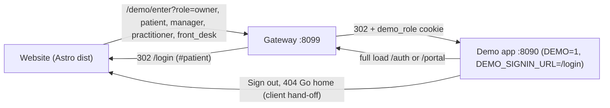
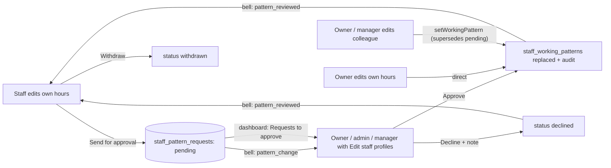

# Profile review round 2: website stitching, pickers, pattern approval, earnings order, invoice on behalf, invoice document

Branch `e2e_live`, on top of `b2bf012`. Same working rules as round 1: exact-path staging (never `.cursor/`, `Claude outputs/`, `.tmp-*`, `launch-plan/.env.local`, `launch-plan/qc/captures/`), author identity from `git log -1`, no push unless asked, no whole-file reformatting, tsc delta ≤ 0 against 109, lint delta 0 on touched files (`/tmp/pf-newlint2.py`, recreated if gone), workspace rules (no left accent rails; pill controls right of the title). New this round: `launch-plan/**` and the seven app files of the stitching hand-off (`src/routes/auth.tsx`, `portal.tsx`, `index.tsx`, `src/components/app-shell.tsx`, `src/lib/demo/enabled.ts`, `src/lib/demo/handoff.ts`, `vite.config.ts`) are in scope and get committed in Phase S once the QC is green.

## Website ↔ demo stitching: what I found

The earlier plan ([website_and_demo_stitching_qc](.cursor/plans/website_and_demo_stitching_qc_f62e53a4.plan.md)) built the whole chain — gateway `/demo/enter?role=…` → `Set-Cookie demo_role` → 302 into the app; `/auth` and `/portal` full loads → website `/login`; a demo-only hand-off in the app (Sign out, 404 Go home, brand link → website); manager persona; a Playwright QC suite under [launch-plan/qc](launch-plan/qc/) with Chromium desktop and WebKit iPhone projects — and its report passed **at `c291ab1`**. Since then:

- None of it is committed: `launch-plan/**` (gateway, website, qc, ngrok scripts) and the seven app files are modified or untracked in the working tree.
- The website build is stale: `dist/` is from 28 Sep 20:25, while `links.ts` and `login.astro` were edited 29 Sep 01:14.
- Nothing runs the stitched stack now. Yesterday the gateway was on 8099 (app on 8090); I started the raw demo app on 8099 for profile testing, so `http://localhost:8099/` currently shows the app, not the website — the most likely "it broke".
- Twelve profile commits landed after the QC run: the SQINOS mark and wordmark, the `/favicon.svg` link in `__root.tsx` (a path `routes.json` gives to the website), the profile route rewrites. None should touch the flow, but the QC has not been re-run against them.

The flow to prove, on Chromium desktop and WebKit phone, is the one you described: from the website, top-bar **Sign in** → *Clinic team* lands on `/dashboard` as the owner and *Patients* on `/my-record` as the patient, with no login page in between; the **For patients** / **For clinics** sections' portal buttons and every `/login` persona and `/demo` card do the same; full loads of `/auth` and `/portal` come back to the website's `/login`; Sign out returns to the website with the `demo_role` cookie cleared.



## What the five screenshots ask for, and what I found

1. **Boxy picker** — the Working pattern editor uses native `<input type="time">` ([working-pattern-card.tsx](src/components/profile/working-pattern-card.tsx) lines 171/184) and the Registration / insurance card uses native `<input type="date">` ([registration-insurance-card.tsx](src/components/profile/registration-insurance-card.tsx) lines 339/450). Chrome renders both as the grey boxy dropdown in the screenshot. `ui/calendar.tsx` (react-day-picker 9) exists but is unused anywhere; there is no themed time picker in the app.
2. **Pattern approval** — today a staff member can only send a free-text note (`requestWorkingPatternChange({ note })`); the owner / manager edits hours directly with `setWorkingPattern`. There is no request record, nothing to approve.
3. **Tiles** — [earnings-tab.tsx](src/components/profile/earnings-tab.tsx): stepper row → KPI cards → Daily earnings → table → four small tiles (line 504). Decision: KPI cards → small tiles → Daily earnings.
4. **Missing Create-invoice button** — confirmed on the running app: on `/team/<nadia>` (owner or manager, `profile-page-manage`) the Month-so-far card renders without `month-invoice`, the hero has no `hero-invoice`, the earnings tab has no `earnings-invoice`. All three are `mode === "self"` only, and `createPractitionerInvoice` is own-only (`POLICY: { kind: "staff" }`, no `userId`). The self page does have the button.
5. **Invoice document** — the dialog pre-fills the month, but "Download PDF" calls `window.print()` on the whole page and the email is text-only. No PDF library is installed; nothing else in the app produces a real document.

## Decisions taken (say if any should change)

- Approvers for a pattern change = the time-off approvers: owner / software admin always; a manager holding `team.manage_profiles`; a non-owner manager's own change goes to the owner (`requires_owner`, mirroring `profileChangeRequiresOwner`). The owner's own change applies directly.
- "Requests to approve" on the dashboard covers both pending working-pattern requests and pending time-off requests (the other approval in this area, which today has no dashboard surface), shown only to approvers, each linking to `/team/<id>?tab=schedule`.
- Invoice on behalf: the owner / admin, or a manager with `team.commission`, can build, schedule or send a colleague's month invoice. The invoice stays "from" the practitioner; the practitioner is notified that it was raised for them.
- PDF without a dependency: an isolated print sheet (only the invoice prints, A4, file name = invoice number) plus the same document as the email's HTML alternative. Adding jsPDF is the fallback if you want a byte-level PDF file instead of the browser's Save-as-PDF.
- Pickers are built as reusable primitives (`ui/time-field.tsx`, `ui/date-field.tsx`) but wired only into the profile; the other native inputs (quick add, schedule, patients) stay as they are — follow-up.



## Documentation contract

- `docs/profile-redesign/r2/README.md`: phase table (worklog, scope, commit), to-do table (`id | phase | what | status | worklog anchor`), regression-proof table (before / after captures). One line added to [docs/profile-redesign/README.md](docs/profile-redesign/README.md) pointing at round 2.
- `docs/profile-redesign/r2/worklog/NN-<phase>.md`: one `### <todo-id>` section per to-do (files, what and why, how checked) plus a phase summary (verification table, commit, tsc / lint deltas).
- Captures under `docs/profile-redesign/r2/captures/before/` (P0 for the profile views, Phase S for the stitching flows as `stitching-<flow>-<device>.jpg`) and `captures/after/` (P7), same names.
- Worklog order: `00-baseline`, `S-stitching`, `01-pickers`, `02-earnings-and-invoice-document`, `03-schema`, `04-server`, `05-pattern-approval-ui`, `06-invoice-on-behalf-ui`, `07-tests-and-verify`.

## Phase 0 — Baseline and scaffolding (depends on nothing)

Docs index and worklog 00; re-record tsc (109), guards, unit (198 + 11 pre-existing), lint baselines for the files to be touched, and the current full-Chromium failure set (last run: the P0 six + `team-chat-dock:100`, `team.spec:28`, `patient-portal/sync:101`); before-captures (1440 px): `/profile?tab=schedule` practitioner with the editor open, owner on Nadia schedule tab, owner on Nadia overview (blue card), `/profile?tab=earnings` practitioner, `/dashboard` owner and manager (Attention), the invoice dialog. One commit.

## Phase S — Website ↔ demo stitching: restore, QC, commit (depends on nothing; runs right after P0)

- **Audit** (read-only, into `worklog/S`): ports 8090 / 8099 and what holds them, `git status` of `launch-plan/**` and the seven app files, dist vs source mtimes, the report's commit, and a three-way check that `gateway/routes.json demoRoles` = `website/src/lib/links.ts` personas = `login.astro` buttons (`owner, manager, practitioner, front_desk, patient`).
- **Before-captures**: stop my raw app on 8099; start the stack as it was — `launch-plan/ngrok/start-demo.sh --background` (app on 8090, `DEMO_SIGNIN_URL=/login`) and `node launch-plan/gateway/server.mjs` on 8099 with the existing `dist` — then a Playwright script drives Chromium (1440) and WebKit (iPhone 15) through: top-bar Sign in → Clinic team, → Patients; `/#patients` and `/#clinics` portal buttons; each `/login` persona; each `/demo` card; full loads of `/auth`, `/portal`, `/auth?idle=1`; Sign out from the dashboard; the 404's Go home. Screenshot every landing to `r2/captures/before/stitching-<flow>-<device>.jpg`, record URL, persona pill and any failure. This is the evidence of what actually broke.
- **Gateway**: `node launch-plan/gateway/test.mjs` at HEAD; fix the gateway for any failing case.
- **Website**: `npm run build` in [launch-plan/website](launch-plan/website) so `dist` carries the current `links.ts`, `login.astro`, `TopBar.astro`, `demo.astro`; `routes.spec.ts` cross-checks pages ↔ `routes.json` ↔ `demoRoles` ↔ `links.ts`; confirm no website path collides with an app route (the SVG favicon is served by the website for both).
- **QC suite**: `launch-plan/qc/run.sh --rebuild` (throwaway app 8094 + gateway 8097; `links`, `demo-entry`, `return-paths`, `gateway-health` on Chromium desktop and WebKit phone). Fix each failure at its source — gateway, website or the app hand-off — and keep the suite honest (no loosened assertions). Likely suspects after the profile round: the app-detection regex in [qc/lib.ts](launch-plan/qc/lib.ts) (`Aetheria`), the persona pill labels, the favicon path, Sign-out's cookie clear. `REPORT.md` is regenerated and stamped with HEAD.
- **App hand-off review**: the seven files' diff is demo-only and inert without `DEMO_SIGNIN_URL` (the e2e suite never sets it); run `e2e/smoke.spec.ts e2e/rbac.spec.ts` and unit without the variable; tsc / lint deltas on those files.
- **Commit**: `launch-plan/**` (never `.env.local`, `qc/captures/`) and the seven app files, in one commit; leave gateway 8099 + app 8090 running so you can click through by hand; `worklog/S` summary with the before-capture table.

## Phase 1 — Themed time and date pickers (depends on nothing)

- `src/lib/field-parse.ts` (pure): `normaliseClock("9:5" | "0930" | "5pm") → "09:05"…`, `clockOptions(step, from, to)`, `parseDayInput("13/11/2027" | "2027-11-13" | "13 Nov 2027") → "2027-11-13"`, `formatDayInput(key) → "13/11/2027"`. `tests/unit/field-parse.test.ts`.
- `src/components/ui/time-field.tsx`: a text `Input` (`inputMode="numeric"`, placeholder `09:00`, normalises on blur / Enter, `aria-invalid` on bad input) with a clock button opening a `Popover`: a `bg-glass-2 shadow-inset-hi rounded-[20px]` well holding two scroll columns — hours (06–22 by default, `min`/`max` props) and minutes (00 / 15 / 30 / 45) — items `h-9 rounded-xl`, selected `bg-foreground text-background font-bold`, hover `bg-[rgba(47,63,102,0.08)]`, picking a minute closes. Same idiom as the time-off sheet's day grid, no rails.
- `src/components/ui/date-field.tsx`: a text `Input` showing `13/11/2027` with a calendar button opening a `Popover` with `Calendar` (`mode="single"`, `weekStartsOn={1}`, `locale={enGB}` from `date-fns/locale`, `min`/`max` → `disabled`), restyled through `classNames`: day `h-9 w-9 rounded-xl`, selected `bg-foreground text-background`, today `ring-1 ring-foreground/40`, outside days `text-ink-3`, round glass nav buttons. Picking closes; typing ISO or `DD/MM/YYYY` both parse (so the existing e2e `fill(dayKey)` keeps working).
- Wire in: the pattern editor's start / end (`data-qc="pattern-start-<wd>"` stays on the text input so `.fill("10:00")` still works) and the two registration / insurance dates. Responsive check phone / tablet / desktop with a popover open. Commit.

## Phase 2 — Earnings order and the invoice document (client only; depends on nothing)

- Tiles: move the `SmallTile` grid to sit between the KPI grid and `earnings-daily`; hooks unchanged (`earnings-patients`, …).
- `src/lib/invoice-document.ts` (pure, importable by client and server): `buildInvoiceDocument({ number, issuedOn, dueOn, from, billTo, period, qty, amount, note })` and `invoiceDocumentHtml(doc)` — a self-contained HTML string (inline styles) with the mockup's layout: mark + INVOICE, number, Issued / Due, From / Bill to, the treatments line, Adjustments £0.00, Total due, footer "Generated by SQINOS from completed treatments in the diary." `tests/unit/invoice-document.test.ts`.
- `src/components/profile/invoice-sheet.tsx`: the React rendering of the same model; the dialog's preview and the print sheet both use it, so they cannot drift. The print sheet is portalled to `document.body` with `hidden print:block` and `data-print-sheet`.
- Download PDF: sets `document.body.dataset.printing = "invoice"` and `document.title = number`, calls `window.print()`, restores both on `afterprint`. [src/styles.css](src/styles.css) gains:

```css
@media print {
  body[data-printing="invoice"] > :not([data-print-sheet]) { display: none !important; }
  body[data-printing="invoice"] [data-print-sheet] { display: block !important; }
  @page { size: A4; margin: 14mm; }
}
```

- For an already-sent month the sheet uses the stored number, amount and `sent_at`; for an open month the live `getMyEarnings` figures — the same "auto-generated for that month" data the preview shows today. Commit.

## Phase 3 — Schema and fixtures (depends on nothing; needed by P4)

- Migration `20261002000100_staff_pattern_requests.sql`: `staff_pattern_requests` (id, clinic_id, user_id, rows jsonb — seven `{ weekday, start, end }`, note, requires_owner, status pending|approved|declined|withdrawn, requested_at, reviewed_by, reviewed_at, reviewer_note, created_at), RLS `is_staff` + `clinic_isolation`, grants and comments as in `20261001000200_staff_schedule_invoices_bookable.sql`.
- `types.ts` row types; `CLINIC_SCOPED_TABLES` entry; demo fixture `staffPatternRequests` on `db`: one pending request from Dr Tom Whitfield (Saturday off, Wednesday added) so the owner's and manager's dashboards show a request to approve out of the box. Commit.

## Phase 4 — Server functions (depends on P2, P3)

- `requestWorkingPatternChange({ rows?, note? })` — validator and `schemas.RequestWorkingPatternChange` change together (`check:validators`). With `rows`: reject an unchanged pattern; owner / admin → apply directly (`{ applied: true }`); otherwise supersede any pending request (→ withdrawn), insert pending with `requires_owner = profileChangeRequiresOwner(identity)`, notify approvers through the existing `profileManagerIds` / `notifyStaffMembers` (kind `pattern_change`, body from a new `patternChangeSummary(current, proposed)` in [staff-schedule.ts](src/lib/staff-schedule.ts): "Thu 09:00–17:00 (was 12:00–20:00)"). Without `rows` the current note-only behaviour stays, so the branch works between P4 and P5.
- `withdrawWorkingPatternChange({ id })` (own pending only), `reviewWorkingPatternChange({ id, approve, reviewerNote? })` (`managerCapability team.manage_profiles`; `requires_owner` rows owner / admin only) → approve writes the seven rows through a shared `writeWorkingPattern(ctx, userId, rows)` used by `setWorkingPattern` too, audits `staff.pattern_set { via: "request" }`, notifies the requester (`pattern_reviewed`). `setWorkingPattern` marks a colleague's pending request withdrawn ("Superseded by a direct change").
- `getStaffSchedule` returns `patternRequest` (latest pending, with rows, note, `requires_owner`) for self or `canManage`; null for the front desk.
- Dashboard: `getDashboard` (production and demo) adds `staff_request` attention items — pending pattern requests and pending time-off requests, excluding the viewer's own, `requires_owner` rows for owner / admin only — for viewers passing `canManageProfiles(identity)`; `{ kind: "staff_request", urgency: "this_week", title: "Dr Tom Whitfield — working pattern", subtitle: <summary>, href: "/team/<id>?tab=schedule" }`. Pure builder `staffRequestAttentionItems()` beside `profileChangeAttentionItems` in [profile-change-policy.ts](src/lib/profile-change-policy.ts), unit-tested.
- `createPractitionerInvoice({ userId?, … })`: target = `userId ?? ctx.userId`; another person needs `canSetCommission(identity)`; `from` = the target's profile; owners notified except the creator; the practitioner notified (`invoice`, "Dr Amara Osei raised your September invoice · £12,773.25 · sent to payroll"). `sendInvoiceNow` passes `invoiceDocumentHtml(...)` as the email's `html`.
- POLICY rows (`withdrawWorkingPatternChange: staff`, `reviewWorkingPatternChange: managerCapability team.manage_profiles`), zod schemas, demo twins, `check:policy` / `check:validators` / `check:tenancy`, persona probes (practitioner requests → manager approves; manager's own → owner only; front desk gets nothing; owner raises Nadia's invoice; practitioner cannot raise Tom's). Commit.

## Phase 5 — Pattern approval UI (depends on P1, P4)

- Self: "Request a change" opens the same editor as manage mode (TimeFields, Day off / Add hours), an optional note, weekly total, Cancel and `Send for approval` (`pattern-request-send`); owner self keeps `Save hours`. While a request is pending the card shows a banner "Change requested · awaiting your manager / the clinic owner" listing only the changed days (proposed vs current) with `Withdraw` (`pattern-request-withdraw`); the button reads "Change requested ✓" as today.
- Manage: a "Proposed change" panel in the Working pattern card with the same per-day comparison, `Approve` (`pattern-approve`) and `Decline` (`pattern-decline` → reason dialog, `pattern-decline-confirm`), the requester's note; the requests card lists it as a row "Working pattern · <summary>" with the status chip. Invalidates `staff-schedule`, `staff-profile/<id>`, `my-profile`, `staff-notifications`, `dashboard`.
- Dashboard: [attention-list.tsx](src/components/dashboard/attention-list.tsx) — `CHIP_META.staff_request = { label: "Requests to approve", className: "bg-accent-soft text-accent-ink" }`, kind order entry, `personKey` by id (one row per request), rail tone; rows link to the Schedule tab. Commit.

## Phase 6 — Invoice on behalf UI (depends on P2, P4)

- `MonthSoFarCard`, the earnings tab's `earnings-invoice` and the hero's `hero-invoice` render in manage mode when `viewer.canCommission` (owner / admin always) and the subject treats; labels unchanged ("Create September invoice", "Create & send invoice").
- `InvoiceDialog` takes `mode` and the subject: queries and `createPractitionerInvoice` carry `userId` in manage mode; copy becomes "Built from Nadia's completed treatments", "Payroll has Nadia's September invoice…"; number from the subject's initials. Done state invalidates `practitioner-invoices`, `staff-notifications`. Commit.

## Phase 7 — Tests, full verification, after-captures, docs (depends on everything)

- New `e2e/profile-r2.spec.ts`: time picker (open, pick 10:00, typed "0930" normalises), date picker on "I've renewed"; tiles precede Daily earnings in DOM order; practitioner sends hours for approval → banner → owner's dashboard shows "Requests to approve" (Tom from the fixture + Nadia) → owner approves on Nadia's Schedule tab → rows update, banner gone; decline with a reason; manager's own request needs the owner; withdraw; owner raises Nadia's invoice from the blue card → done; Download PDF (stub `window.print`, assert `data-printing`, title = number, and under `emulateMedia({ media: "print" })` only the sheet is visible); front desk sees none of it.
- Updates: [profile-redesign.spec.ts](e2e/profile-redesign.spec.ts) pattern-edit step, [profile-governance.spec.ts](e2e/profile-governance.spec.ts) Attention test unaffected but asserts the new chip for the owner, [responsive/pages.ts](e2e/responsive/pages.ts) states `pattern-editor` and `time-field-open`, capture specs; unit tests for `field-parse`, `invoice-document`, `patternChangeSummary`, `staffRequestAttentionItems`.
- Full stack: `check:policy` / `check:validators` / `check:tenancy` / `check:metrics`, unit, full Chromium e2e (only the recorded pre-existing failures), `test:metrics` (hooks unchanged), responsive gate at major on all seven devices, tsc ≤ 109 with 0 new, lint delta 0 on every touched file.
- Stitching re-run at the final HEAD: `launch-plan/qc/run.sh` (Chromium + WebKit) so `REPORT.md` is stamped with the last commit, `gateway/test.mjs`, and the Phase S click-through script again with screenshots to `r2/captures/after/stitching-*` — the profile changes must not have moved any entry or return path.
- After-captures with the P0 names, side-by-side table (profile rows and stitching rows), README to-do statuses, worklog 07 summary. Commit; no push unless asked. The gateway on 8099 and the app on 8090 stay up afterwards for your own click-through.

## Non-goals

Native inputs outside the profile keep their browser pickers; the diary still does not read patterns or time off; no jsPDF unless you ask for a byte-level PDF; the Team page request inbox is not extended (the dashboard chip, the bell and the Schedule tab are the approval surfaces); the ngrok tunnel is not started (local gateway only — `start-public.sh` needs your token and is unchanged); the website's own copy and design are not touched beyond what the QC needs.