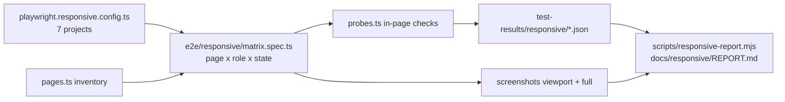

# Responsive QC audit and fixes across devices

Two stages, one plan. Stage 1 builds the harness, captures the full matrix and hands you a ranked report. Stage 2 fixes by tier and re-runs until the matrix is green. Decisions taken with you: staged flow with a review pause; 7 viewports with Safari-realistic WebKit for iPhone/iPad.

## What we already know (so the report is not a surprise)

- The Aug audit (`docs/AUDIT-2026-08-22.md` §8.4) found mobile unusable: the shell renders a fixed-width `<aside>` (238 px default, remembered in `localStorage`) with **no responsive branch**, so at 390 px the content is clipped, not scrollable. Nothing has changed since: [app-shell.tsx](src/components/app-shell.tsx) L693-722 still has no `md:` branch, and the ready-made mobile `Sheet` in [ui/sidebar.tsx](src/components/ui/sidebar.tsx) L189-210 and [use-mobile.tsx](src/hooks/use-mobile.tsx) (768 px) are unused.
- The Sep 13 mobile capture only looks fine because the sidebar was collapsed by hand.
- 44 components use fixed px/rem widths; 10 grids hardcode 3+ columns without a breakpoint; 11 tables rely on `overflow-x-auto`; the day planner is `min-w-[680px]` inside `overflow-auto` (scrolls, but no affordance); the offer editor sheet is `w-3/4 sm:max-w-[1040px]` (281 px wide on a phone); the toolbar carries five chips plus a 220 px account pill.
- `.page-header` already stacks under 640 px (`styles.css` L617-628 / L705-716), so the pill-control rule has a mobile branch; the harness will verify it rather than fight it.
- iOS-specific risks to probe in WebKit: inputs under 16 px trigger Safari focus-zoom; `datetime-local` renders natively; `backdrop-filter` and `100dvh` behaviour; `position: sticky` inside the `#app-main-scroll` container.

## Stage 1 — Harness, matrix capture, findings report

### 1.1 Device matrix

New `playwright.responsive.config.ts` (separate from the regression config so `npm run test:e2e` stays Chromium-only and fast); same `webServer` on 8091 with `DEMO=1`, serial, one worker. Projects:

- `iphone-se` — `devices["iPhone SE"]` with viewport overridden to 375×667 (Playwright's descriptor is the 320 px first-gen), WebKit, touch
- `iphone-15` — `devices["iPhone 15"]` 393×659 layout viewport, WebKit, touch
- `ipad-mini-portrait` — `devices["iPad Mini"]` 768×1024, WebKit, touch
- `ipad-pro-landscape` — `devices["iPad Pro 11 landscape"]` 1194×834, WebKit, touch
- `laptop-1366`, `laptop-1440`, `desktop-1920` — Chromium, 1366×768 / 1440×900 / 1920×1080

One-off: `npx playwright install webkit`. Scripts: `test:responsive` (run matrix), `qc:responsive` (run + build report). `verify` is unchanged.

### 1.2 Page inventory (`e2e/responsive/pages.ts`)

One table of `{ path, roles, settle, states }` covering everything in [src/routes](src/routes):

- Public: `/`, `/auth`, `/auth/reset`, `/portal`, `/d/<fixture token>` (the known `TODAY_TOKEN` from the treatment-workflow spec), `/u/<token>` (via `tokenFor` as in `unsubscribe.spec.ts`)
- Staff, as owner / practitioner / front_desk / admin: `/dashboard`, `/schedule` (day, week, month), `/patients` (Records, Journey board), `/patients/$id` for Olivia (every tab), `/insights` (Pipeline, Book), `/retention`, `/performance`, `/earnings`, `/offers`, `/team`, `/team/$id`, `/settings`, `/profile`, `/access` (admin)
- Patient: all eleven `/my-record*` pages
- States per page (where they exist): sidebar open and closed; account menu; notification bell; staff dock alert and chat panels; portal dock chat and AI; New booking / Quick book; Record treatment; Send form; Send offer; offer editor sheet; automation dialog; treatment form dialog (`?treat=`); consent-in-clinic dialog; today-card detail dialog; patient chat rail; demo role switcher (kept visible: demo chrome is under test)

### 1.3 Probes (`e2e/responsive/probes.ts`, run with `page.evaluate` on every state)

- **Overflow**: `documentElement.scrollWidth > innerWidth`; `#app-main-scroll.scrollWidth > clientWidth`; any element with `rect.right > innerWidth + 1` or `rect.left < -1`, allow-listing intentional scrollers (`[data-qc="day-planner-scroll"]`, `.overflow-x-auto` descendants)
- **Reachability**: the last content element can be scrolled into the viewport (the Aug clipping bug detected directly)
- **Clipped text**: `scrollWidth > clientWidth` under `overflow: hidden` without `text-overflow: ellipsis`
- **Overlay overlap**: pairwise intersection of `position: fixed` elements (docks, role switcher, toasts, sticky toolbar) and of overlays with the bottom-most primary action
- **Tap targets** (touch projects): interactive elements smaller than 24×24 fail, 24–43 warn (WCAG 2.5.8 / Apple HIG)
- **Type floor**: computed font-size < 10 px fail, < 11 px warn on phones; **inputs < 16 px on iPhone projects** warn (Safari focus-zoom)
- **Dialog fit**: dialog/sheet `rect` within viewport, scrollable when content taller, close control reachable
- **Header rule**: at ≥ 640 px the `.page-header` control sits on the title row (workspace rule); under 640 stacked is accepted
- **Runtime**: console errors, page errors, failed requests
- **Screenshots**: viewport and full-page (reusing the `expandShell` trick from [capture-screens.mjs](docs/clinic-portal/capture-screens.mjs) L42-60) per device/role/page/state

### 1.4 Touch interaction checks (`e2e/responsive/interactions.spec.ts`, WebKit projects)

Tap: stage menu, tabs, switches, sliders (recovery check-in), dialog close, dock open/close, carousel next/prev. Drag: diary drag-to-reschedule, sidebar resize handle, carousel swipe — recorded as *works / has a tap alternative / touch-only gap*. Touch-only gaps become decision points in the report, not silent fixes.

### 1.5 Report (`scripts/responsive-report.mjs` → `docs/responsive/REPORT.md`)

Aggregates the JSON into a findings table: device × page × state × probe, severity (Blocker: unreachable content, overflow, broken interaction; Major: overlap, clipped text, tap < 24; Minor: tap 24–43, type floor, alignment), screenshot link, proposed fix and tier. Plus my manual review of every phone (375) and tablet (768) capture for alignment and UX issues probes cannot catch (misaligned chips, orphaned pills, awkward wraps), and a per-breakpoint note on 1194 (between `lg` 1024 and `xl` 1280) and 1366.

Commit: harness, report, and a curated phone + tablet capture set only; the full matrix stays in `test-results/` (gitignored) given the 129 MB `.git`.

**Checkpoint: you review `REPORT.md` and set priorities before Stage 2 starts.**

## Stage 2 — Fixes by tier, probes become gates

Tiers are provisional until the report exists; the expected shape:

- **Tier 1, Blockers**: shell drawer under `md` (default closed on phones, state remembered only ≥ 768; reuse `ui/sidebar.tsx` `Sheet` or a plain `Sheet`), toolbar compaction on phones (collapse alert chips into one menu, shorter account pill); dialogs and sheets `w-full` under `sm` (offer editor, treatment form, booking); horizontal-scroll affordance for the day planner and wide tables (fade edge + sticky first column, or a card list under `md` for Patients, Team, Retention); any page with overflow or unreachable content; iOS input zoom (16 px inputs on phones)
- **Tier 2, Major**: overlaps between docks / switcher / toasts; clipped text; tap targets; record-page header buttons and tab strip on phones; week and month diary views on phones
- **Tier 3, Minor**: iPad-landscape and 1366 grid breakpoints, type floor, alignment polish from the manual review

Each fix re-runs the affected pages across all 7 projects; when a tier is done the probes for that tier are switched from *report* to *fail*, so the responsive suite becomes a regression gate. Existing gates stay green throughout: `check:policy` / `check:validators` / `check:tenancy`, unit tests, the 130-test Chromium e2e suite (desktop behaviour must not change), tsc delta against the `b2e554e` baseline (103 errors), lints. Work log `docs/responsive-worklog.md`, commit and push to `e2e` per tier.

## Assumptions

- Demo mode is the test surface for every device (as for the existing suites); live Supabase is not exercised.
- Orientation coverage is portrait for phones, both for iPad via the two iPad projects; 1194 landscape doubles as the small-laptop check between `lg` and `xl`.
- Workspace rules hold on every device: no left accent rails, pill controls right of the title at ≥ 640 px and stacked under it below.
- `reminders.spec.ts` (pre-existing failure) and the stale `policy-scope.test.ts` invariant from the pull are out of scope here and will be noted, not fixed, unless you say otherwise.