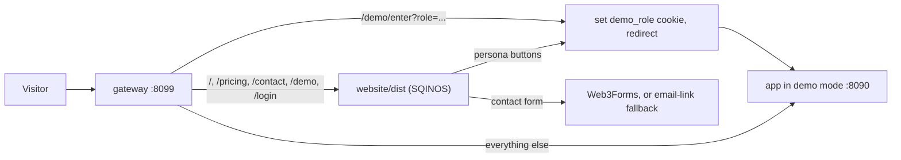

# SQINOS website: mockups, new pages and demo integration

## Scope guard

- Every change stays inside `Claude outputs/launch-plan/`. Most of it is in `website/`. The only edits outside `website/` are in `gateway/`, `ngrok/` and `scripts/`, and they exist so the live demo can run from this folder.
- Before any edit, save `git status --porcelain` (everything outside `Claude outputs/launch-plan/`) to `launch-plan/.run/baseline-status.txt`. At the end, diff against it. It must be identical.
- App code (`src/`, `vite.config.ts`, the root `package.json`) is never edited. The demo build writes into `launch-plan/.run/`, not into the repo root's `.output/`.
- The four `sqinos-mockups/clinic-portal/` screens are out of scope (your call). They stay as input for later app work.

## What the mockups are

- `website-screens/01..05` are coded exports of a `JourneyScreen.astro` component that neither the folder nor `launch-plan.zip` contains. All five share one identical stylesheet, about 1,460 lines, so they port as one component with a `kind` prop: `book`, `treat`, `after`, `progress`, `return`.
- The same stylesheet includes `.ui--overlay` and `.pop--badge` for drawing on a real screenshot. The Consent chapter uses these with the existing `consent-1600.webp`, so the journey keeps six chapters.
- The mockup README says some parts shown don't exist in the app yet: the front desk panel, the "now" line, the Overview tab, the routine reminders layout, the pause request with a reason and length, and the offer card in the patient portal. The journey lede therefore changes from "Every screen below is the real product" to wording like "Drawn from the clinic and patient portals, shown with demo data."
- The app is still branded Aetheria (Æ). The live demo will show Aetheria inside a SQINOS website until you rename the app yourself.

## Step 0: sync and baseline

- Copy the five newer files from `Claude outputs/launch-plan.zip` into `website/`: `DemoNote.astro` (new), `links.ts` and `Base.astro` (website-only preview mode), `TopBar.astro` (iPhone safe-area padding) and `hero-gl.ts` (the headline never stays hidden on slow devices). These are your own later edits of the same site.

## Step 1: rebrand to SQINOS (visible strings only)

- Wordmark "SQINOS" in `TopBar.astro`, `Footer.astro`, `login.astro`, `404.astro`, and the title and description in `Base.astro`. The device URL pill changes from `app.aetheria` to `app.sqinos` in `Journey.astro`.
- `Mark.astro`, `Loader.astro` and `public/favicon.svg` keep the butter droplet with an "S" in place of the Æ, matching the S tile in the mockups. Update `site.webmanifest`.
- Internal names (the package name, the `aetheria:*` storage keys and event names) stay as they are to keep the diff small.

## Step 2: journey section with the coded screens

- New `website/src/components/JourneyScreen.astro`: the shared stylesheet plus markup for the five kinds, and a `consent` kind (screenshot plus a "Signed · witnessed · locked" badge). Remove the left accent rails on `.appt` and `.note` (workspace rule) and use the existing `--c-bg` wash plus a small colour dot instead.
- `Journey.astro`: replace each `` in `.device__screen` and `.chapter__shot` with a `div[data-shot]` wrapper (`container-type: inline-size`) holding `<JourneyScreen kind=...>`. The existing script already toggles `is-active`, which triggers the screens' entrance animations. Update the URL list to `diary`, `patients / grace / documents`, `patients / grace`, `my-record`, `my-record / timeline`, `offers`. Rewrite the Treat chapter copy to match the new patient-record Overview screen.

## Step 3: pricing page (`/pricing`)

Research (published UK prices, September 2026, ex VAT):

- Faces: free, with fees on deposits and product sales.
- Fresha: £14.95 per bookable member, plus 20% commission on new marketplace clients; not clinical.
- Consentz: £49 per login.
- Pabau: Starter £50 (1 user, 100 clients), Solo £118, Team (2–3 users) £162, Medium (4–5) £216, Group (6–15) £310, each per location. Add-ons: Marketing Plus about £66.50, Engage Plus (AI and phone) £99. Setup £150 to £1,799.
- Clinicminds: from about £140 per practitioner; support staff free.
- Calyx: free (2 practitioners), £249 (up to 8), £499 (unlimited, 3 sites).
- Phorest aesthetics: quote only, about £200–300 reported, plus per-booking fees.
- US reference: Aesthetic Record $15–19 per user plus $399 onboarding.
- A clinic with 4 practitioners and 2 front desk staff typically pays £290–480 a month once logins and add-ons are counted.

Recommended SQINOS pricing. All numbers live in one file, `website/src/lib/pricing.ts`, so they are easy to change:

- **Solo £79/mo** (£66 a month billed annually): 1 practitioner, unlimited patients, and the full patient portal (plan, roadmap, aftercare routine, check-ins, AI aftercare assistant). Also diary and booking, consent-gated visits with witnessed signatures, treatment records and photos, and payments.
- **Clinic £229/mo** (£191 annually), marked Most popular: up to 5 practitioners. Adds retention scoring and recall tasks, stage-based offers and automation, practitioner earnings, insights and performance.
- **Group £449/mo** (£374 annually): up to 15 practitioners and 3 locations, cross-site reporting, priority support.
- **Enterprise: custom**, for 4+ sites or 16+ practitioners. Links to Contact sales.
- On every plan: front desk and managers are never charged, there are no per-patient or booking fees and no marketplace commission, data migration and export are free, text messages are charged at cost, card payments are at the payment provider's rates, and contracts are monthly (annual billing gives 2 months free).

Page layout:

- Header row: title and subtitle on the left, the Monthly/Annually pill on the right on the same row. This follows `.cursor/rules/pill-controls.mdc`, rebuilt in the site's CSS with the same track, segment and active styling.
- Tier cards, an "on every plan" list, and an unnamed comparison: "What clinics usually pay: £290–480 a month" against "SQINOS Clinic: £229", with a footnote on the basis. No competitor names on the public page.
- FAQ, then CTAs to `/contact?topic=sales` and `/demo`.

## Step 4: contact page (`/contact`)

- Header row with a pill on the right: "Talk to sales" / "General enquiry". `?topic=sales` preselects the first. Sales shows clinic name, number of practitioners, locations and current software. Both show name, email and message.
- Sends to Web3Forms (`PUBLIC_CONTACT_FORM_KEY`, endpoint overridable with `PUBLIC_CONTACT_FORM_ENDPOINT`), with a honeypot field and inline success and error states. Without a key it falls back to a prefilled `mailto:` link to `PUBLIC_CONTACT_EMAIL`. The direct email address is shown beside the form.

## Step 5: demo page (`/demo`)

- New `MacWindow.astro`: traffic lights, a URL pill, and a 16:10 screen.
- If `public/media/sqinos-demo.mp4` exists at build time (checked with `fs.existsSync`, with an optional `sqinos-demo-poster.webp`), it plays muted, looped and inline, with a visible pause button. With reduced motion it does not autoplay. The gateway already serves `/media/` with byte ranges.
- Until the file exists, the window shows a placeholder: `<JourneyScreen kind="book">` under a frosted layer with a play glyph and "Demo video coming soon".
- Below the window: "Try the live demo" cards for Clinic owner, Practitioner, Front desk and Patient, all linking through `links.ts` to `/demo/enter?role=...`.

## Step 6: navigation and CTAs

- `TopBar.astro` nav: How it works, For clinics, For patients, Pricing, Contact. The same links go in the mobile nav. "Explore the demo" now goes to `/demo`. The Sign in menu still goes straight to the portals.
- `Footer.astro`: add Pricing, Demo, Contact sales and Contact. In `ClosingCta.astro`, "Talk to us" always shows and goes to `/contact`.

## Step 7: live demo from this folder (launch-plan only)

- `gateway/routes.json`: add `/demo` and `/contact` to `exact`. `/pricing` is already there, and `/demo/enter` is still handled first.
- `scripts/load-env.sh` and `.env.example`: change the default `APP_DIR` from `..` to `../..`, because the folder now sits under `Claude outputs/`.
- `ngrok/vite.demo.config.ts`: change the import to `../../../vite.config.ts`. Add `nitro: { output: { dir }, buildDir }` and `cacheDir`, all pointing into `launch-plan/.run/`. Nitro merges the `nitro` key from the Vite config.
- `ngrok/start-demo.sh`: run `node "$RUN_DIR/app-output/server/index.mjs"`, and pass `--config` with the demo config in dev mode too, so the Vite cache also stays in `.run/`.
- `scripts/check-isolation.sh`: work out the folder's own path prefix instead of assuming `launch-plan/`, and compare against `baseline-status.txt` so your own work in progress doesn't count as a failure.

## Step 8: verify

- In `website/`: `npm install`, `npm run check`, `npm run build`. In `gateway/`: `node test.mjs`.
- `./ngrok/start-public.sh --local`, then in the browser check `/`, `/pricing`, `/contact`, `/demo`, `/login`, and `/demo/enter?role=owner`, `front_desk` and `patient` landing in the app. Capture screenshots at 1440 px, iPad mini and iPhone 15, plus one with reduced motion. Check the pinned journey and the stacked list on phones.
- Diff the baseline: nothing outside `Claude outputs/launch-plan/` has changed, and the modified time of the repo root's `.output/` is unchanged.
- Update the page list and env variables in `website/README.md`.