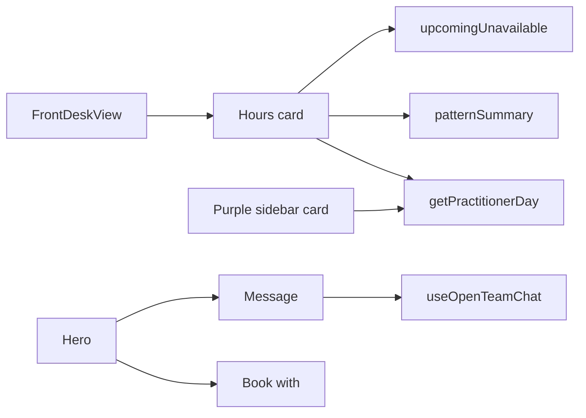

# Staff profile: hours card + Message

The screenshot is the **front-desk colleague view** of Dr Tom Whitfield (`FrontDeskView` on `/team/$id` when the viewer cannot manage profiles). Only that layout is in scope. The owner/manager “Me” layout already has a Schedule tab.

## Card: three sections instead of one

Rewrite the second grid card in [`src/components/profile/front-desk-view.tsx`](src/components/profile/front-desk-view.tsx) (`data-qc="frontdesk-hours"`). Keep the same glass `Card` and column; no left accent rail.

Titles (picked for clarity — **Hours** over “Availability” so it does not collide with Free today; **Time off** over “Holidays” because the rows are approved absences of any type):

1. **Free today** — chips matching the purple card.
2. **Hours** — existing `subject.patternSummary` (Tom: `Mon, Tue, Thu, Fri 10–7 · Sat 9–2`).
3. **Time off** — existing `subject.upcomingUnavailable` rows via `timeOffLabel()`.

Each section is a short heading (`text-sm font-semibold`) plus content, divided by the same `border-t border-edge-2` the card already uses. Drop the per-row “Unavailable” label — the section title covers it. Empty Time off stays as “Nothing booked off in the weeks ahead.”

### Free today uses the purple card’s API

Do not invent a second gap algorithm. Fetch [`getPractitionerDay`](src/lib/clinic.functions.ts) the same way [`PractitionerDayCard`](src/components/practitioner-hovercard.tsx) does:

```ts
useQuery({
  queryKey: ["practitioner-day", subject.userId, clinicDayKey()],
  queryFn: () => fetchDay({ data: { practitionerId: subject.userId, date: clinicDayKey() } }),
  staleTime: 60_000,
});
```

Format chips with the same `hhmm` helper (`09:00–09:30`). Reuse the existing chip look from the hover card (rounded-full, tabular-nums, `bg-glass-2` / `shadow-inset-hi`) without the lane colour wash — this card stays white.

Known limitation we keep on purpose: `getPractitionerDay` scans **09:00–18:00** appointment gaps and returns at most four slots of 15+ minutes. That is why the purple card and this card will match, even when Tom’s pattern is 10–19.

Empty / loading: “Loading today’s diary…” then “No free slots left today”.

Keep `frontdesk-pattern` and `frontdesk-unavailable`. Add `frontdesk-free-today` on the chip row.



## Message button next to Book with

In the hero card, wrap the actions in a `flex shrink-0 gap-2` group.

- Keep **Book with {first}** as the existing butter primary (`data-qc="frontdesk-book"`), still gated on `treats && !subject.revoked`.
- Add **Message** (`data-qc="frontdesk-message"`) as `variant="outline"` at the same `h-11` height, with the same `MessageSquare` icon the hover card uses. Always shown on this page (it is always a colleague). Click:

```ts
const openTeamChat = useOpenTeamChat();
openTeamChat({ userId: subject.userId, name: subject.fullName });
```

That is the same hand-off as the purple card’s “Send message”: it opens the floating dock `ChatBubble` on the Team tab, thread = viewer ↔ Tom. No new chat API.

## Tests

Update [`e2e/profile-redesign.spec.ts`](e2e/profile-redesign.spec.ts):

- Front desk on Tom: Message is visible; clicking it opens the dock chat (reuse the same visibility check as [`e2e/team-chat-dock.spec.ts`](e2e/team-chat-dock.spec.ts) if one already exists for the bubble).
- Front desk on Nadia: keep `frontdesk-pattern` “Thu 12–8”; change the unavailable assertion from the word “Unavailable” to the date label; assert `frontdesk-free-today` is present (slots or the empty copy).

No new server functions. No changes to the purple hover card.

## Verify

On `/team/{Tom}` as front desk (or any non-manager):

1. Hours card lists the same Free today chips as opening Tom from the sidebar.
2. Hours still shows the weekly pattern; Time off still shows the November block.
3. Message opens the Tom thread in the dock; Book with Tom still opens the booking dialog.
4. Repeat on Nadia’s colleague view so the e2e path stays green.
