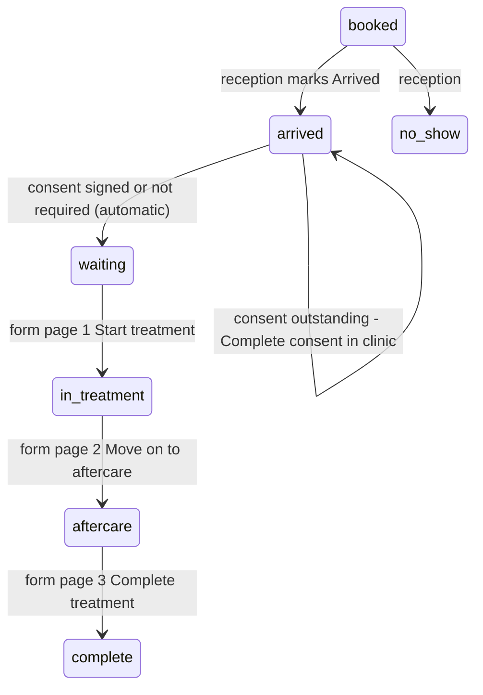
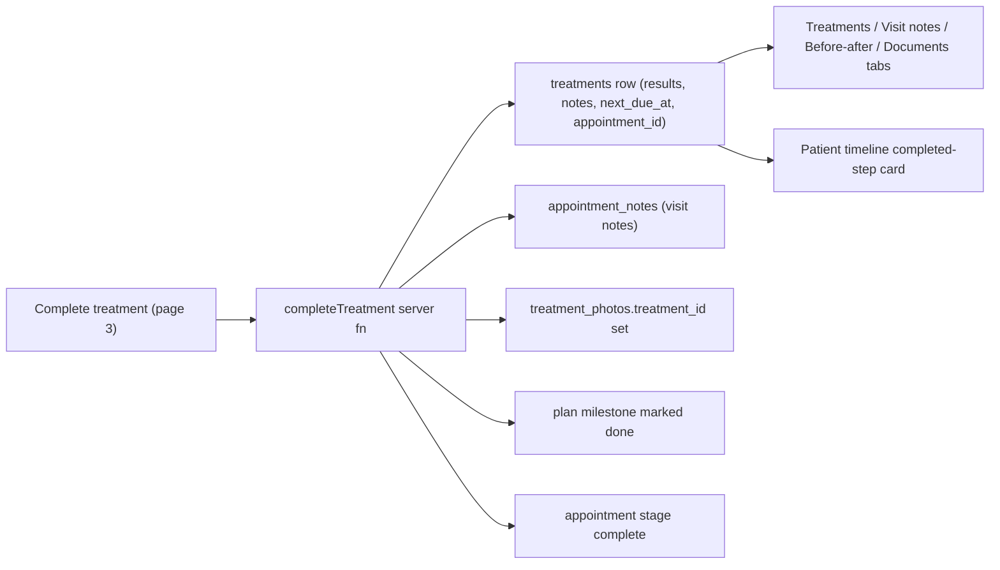

# Treatment workflow: arrival to complete

Workstream 2 of the feedback round (pages 7-8). Builds on the shipped corrections plan; in particular it is what populates the completed-step card on the patient timeline (B5).

Decisions taken with you: in-clinic consent is **signed on the clinic's device**, witnessed by the staff member; the manual stage menu becomes **guided** (Waiting gated on consent, In treatment opens the form, the rest stays free).

## What exists today (audited)

- Stage is a free jump. `StageBadge` ([today-snapshot.tsx](src/components/dashboard/today-snapshot.tsx) L832-860) and `StageTracker` ([schedule.tsx](src/routes/_authenticated/schedule.tsx) L145-229) list every stage regardless of the current one; nothing checks consent. `updateAppointmentState` ([clinic.functions.ts](src/lib/clinic.functions.ts) L1519-1564) only patches stage/status and audits.
- The "pop-up on the right" is the arrival-alerts dock card ([arrival-alerts.tsx](src/components/arrival-alerts.tsx)): polls `getDashboard` every 60s, offers Arrived / No show for `booked` slots only.
- Consent is signed only by the patient: portal `signDocument` (policy `patientSelf`) or the magic link `signDocumentByToken` ([access.server.ts](src/lib/documents/access.server.ts) L115). There is no staff-side signing path.
- "Record treatment" is a single dialog calling `addTreatment` (L1668-1719). `treatments` has no `appointment_id`; visit notes (`appointment_notes`), photos (`treatment_photos.treatment_id` optional), documents and plan milestones are all independent writers. Nothing links a completed treatment to a plan milestone in production (`plan_milestones.appointment_id` is set only by the demo seed).
- No aftercare content exists per treatment; `treatment_catalogue` has `requires_consent` and `interval_days` but no aftercare column. `getDashboard`'s today query does not join the catalogue, so cards cannot tell whether consent is required.
- No staff document viewer exists; `/d/$token` renders `body` only.

## Target behaviour

Reaching `waiting` raises a `patient_waiting` notification for the appointment's practitioner and a dock card with **Start treatment**, which opens the form on the patient record at `/patients/$id?treat=<appointmentId>`.

## Phase 0 — Schema, pure rules, fixtures (no UI dependency)

- Migration `treatment_sessions`: the form itself. `id, clinic_id, appointment_id UNIQUE, patient_id, practitioner_id, catalogue_id, treatment_id (set on complete), pre_checks jsonb, results jsonb (area/product/dose), treatment_notes, visit_notes, aftercare_points jsonb, aftercare_extra, status ('started'|'treating'|'aftercare'|'complete'), started_at, treating_at, aftercare_at, completed_at, created_at, updated_at`. Staff manage, `clinic_isolation` RESTRICTIVE, house style of [20260922000003_portal_profile.sql](supabase/migrations/20260922000003_portal_profile.sql).
- Migration of small columns: `treatment_catalogue.aftercare_points text[]`, `treatments.appointment_id uuid` (FK, index), `treatment_photos.appointment_id uuid` (photos taken during the visit before a treatment row exists), `documents.witnessed_by uuid` (staff who witnessed an in-clinic signature).
- Hand-maintain [types.ts](src/integrations/supabase/types.ts); add `treatment_sessions` to `CLINIC_SCOPED_TABLES` in [clinic-scope.server.ts](src/lib/auth/clinic-scope.server.ts).
- `src/lib/visit-stage.ts` (pure, unit-tested): `consentState(appt) -> "not_required" | "outstanding" | "signed"` from `documents.status` + `treatment_catalogue.requires_consent`; `stageAfterArrival(consent)`; `manualStageOptions(current, consent)` implementing the guided menu; `src/lib/aftercare-defaults.ts` with category-keyed default points used when a catalogue row has none.
- Demo fixtures ([data.ts](src/lib/demo/data.ts)): `treatmentSessions` array; `aftercare_points` on catalogue rows; make today's cards obey the rule (an `arrived` patient with signed consent becomes `waiting`; a `waiting` patient with consent due becomes `arrived`); one `waiting` patient on Dr Nadia Rahman's book so the practitioner nudge demos; one completed session behind an existing treatment so the record viewer has content.

**To-dos:** `p0-sessions-migration`, `p0-columns-migration`, `p0-types-tenancy`, `p0-stage-rules`, `p0-fixtures`

## Phase A — Arrival, consent and Waiting (server)

- **A1** `advanceToWaitingIfReady(db, appointmentId)` in `src/lib/visit-stage.server.ts`: if stage is `arrived` and consent is signed or not required, set `waiting`, insert `staff_notifications` kind `patient_waiting` (recipient = `practitioner_id`, else managers; carries `appointment_id`, `patient_id`), audit. Called from A2-A4.
- **A2** `updateAppointmentState`: on `stage: "arrived"` run A1 and return the resolved stage; on a manual `stage: "waiting"` with consent outstanding, throw "Consent is outstanding — complete it in clinic first". Demo twin identical.
- **A3** New `completeConsentInClinic({ appointment_id, signed_name })` (capability `documents.send`): if the appointment has no `consent_document_id`, create the consent `documents` row (title from the treatment, body from the existing consent text) and link it; then sign it (`status signed, signed_at, signed_name, signature_data, signed_ip, witnessed_by = ctx.userId`); audit; run A1. Plus `getAppointmentConsent({ appointment_id })` (staff) returning title, body and state for the dialog.
- **A4** Hook the two patient signing paths — `signDocument` and `signDocumentByToken` — to run A1 for any appointment whose `consent_document_id` is the signed document.
- **A5** `getDashboard` / `listAppointments`: join `treatment_catalogue(requires_consent)` and expose `consentState` per appointment; bell ([notification-bell.tsx](src/components/notification-bell.tsx)) routes `patient_waiting` to `/patients/$id?treat=<appointment_id>`.

**To-dos:** `a1-advance-helper`, `a2-arrival-rule`, `a3-consent-in-clinic-fn`, `a4-hook-patient-signing`, `a5-consent-state-and-bell`

## Phase B — Diary and dock UI

- **B1** Guided stage menu in `StageBadge` and `StageTracker` via `manualStageOptions`: Waiting disabled with tooltip while consent is outstanding; In treatment navigates to the form; Booked / Arrived / Aftercare / Complete / No show unchanged.
- **B2** `ConsentInClinicDialog`: opened from **Complete consent in clinic** on the arrived card (today card, schedule chip, dock). Shows the consent title and body, a "read and understood" checkbox, a typed-name signature field and the witnessing staff name; submits A3; toast "Consent signed — {first name} is now waiting".
- **B3** Dock ([arrival-alerts.tsx](src/components/arrival-alerts.tsx), [alert-bubble.tsx](src/components/floating-dock/alert-bubble.tsx)): two new card kinds beside the arrival prompt — *"{name} has arrived — consent outstanding"* with Complete consent (staff with `documents.send`), and *"{name} is waiting · {treatment} · since {time}"* with **Start treatment** (the appointment's practitioner; owners and managers see all). Count includes them. Freshness: the bell's `staff_notifications` realtime handler (prod) and 4s poll (demo) invalidate `["dashboard"]` on `patient_waiting` so the card appears within seconds, not 60.
- **B4** Card copy: "Waiting since 14:02" under the Waiting badge; the TodayCard detail dialog gains **Start treatment** when waiting and **Complete consent** when arrived-outstanding.

**To-dos:** `b1-guided-menu`, `b2-consent-dialog`, `b3-dock-waiting-cards`, `b4-card-copy`

## Phase C — Treatment form (server)

All staff fns take `treatments.record`; demo twins mirror each; schemas and POLICY entries added.

- **C1** `getTreatmentSession({ appointment_id })`: appointment with patient (allergies, medications, conditions), catalogue, practitioner, consent state, session N of M from the linked plan milestone; the existing session draft if any; previous visit notes (last five `appointment_notes` for the patient) and the last treatment of the same type; aftercare points (catalogue or category default); the pre-treatment check template.
- **C2** `startTreatment({ appointment_id, pre_checks })`: refuses unless consent is signed/not required; upserts the session (`treating`, `started_at`); stage → `in_treatment`; audit.
- **C3** `moveToAftercare({ appointment_id, results, treatment_notes, visit_notes })`: saves page 2; session `aftercare`; upserts `appointment_notes` now (so the diary hover already shows the visit note); stage → `aftercare`; audit.
- **C4** `completeTreatment({ appointment_id, aftercare_points, aftercare_extra })`: inserts the `treatments` row (name/catalogue/practitioner, product/area/dose from results, `notes` = treatment notes, price from the appointment, `performed_at` = appointment start, `next_due_at` from `interval_days`, `consent_document_id`, `appointment_id`, commission snapshot); sets `session.treatment_id` and `complete`; re-points photos with this `appointment_id` to the treatment; marks the linked `plan_milestones` row done (falling back to the active plan's current `session` milestone) and promotes the next, reusing `updatePlanMilestone`'s logic; stage → `complete`; `patients.last_visit_at`; audit. Returns `treatment_id`.
- **C5** `saveTreatmentSessionDraft` (debounced autosave of page fields, no stage change) so notes are never lost on refresh.
- **C6** `getTreatmentRecord({ treatment_id })`: session + treatment + photos + consent document, for the read-only viewer.

**To-dos:** `c1-get-session`, `c2-start-treatment`, `c3-move-to-aftercare`, `c4-complete-treatment`, `c5-autosave`, `c6-get-record`

## Phase D — Treatment form UI

- **D1** [patients.$id.tsx](src/routes/_authenticated/patients.$id.tsx): `?treat=<appointmentId>` opens `TreatmentFormDialog` — a large centred Dialog with a three-step header; entry points are the dock card, the bell, the TodayCard dialog, the guided menu and the upcoming-appointments row on the Treatments tab.
- **D2** Page 1 *Before you start*: patient details with allergies flagged, treatment details (time, type, practitioner, session N of M, consent pill), previous visit notes and last same-type treatment, pre-treatment checks (standard yes/no with note: changes to medical history or medications, pregnancy/breastfeeding, recent sun or actives, allergies confirmed). **Start treatment** → C2; every diary card updates.
- **D3** Page 2 *Treatment*: results (area, product, dose/units — the same fields as Record treatment), treatment notes and visit notes on the notes editor primitives ([ios-notes-editor.tsx](src/components/notes/ios-notes-editor.tsx)), before/after photo upload attached to the appointment. **Move on to aftercare** → C3.
- **D4** Page 3 *Aftercare*: the treatment's points as a read-out checklist (tick what was covered, add a custom line). **Complete treatment** → C4, then a done state with **View record** and **Back to diary**.
- **D5** `TreatmentRecordView` (read-only rendering of the three pages plus photos and consent) opened from **View record** on Treatments-tab rows that have a session, and listed under *Treatment records* on the Documents tab; `print:` styles for a physical copy.
- **D6** Settings: aftercare points editor per catalogue item inside the existing editor behind `saveCatalogueItem` (`settings.treatments`).
- **D7** Verify the fan-out reads: Treatments, Visit notes, Before and after and Documents tabs, and the patient timeline completed-step card (appointment date, consent and consultation pills, photos, visit note).

**To-dos:** `d1-form-shell`, `d2-page1`, `d3-page2`, `d4-page3`, `d5-record-viewer`, `d6-settings-aftercare`, `d7-fanout-check`

## Phase E — Parity, tests, ship

- **E1** Demo twins for every fn, fixtures for the new states, `check:policy` / `check:validators` / `check:tenancy` green; unit tests for `visit-stage.ts`.
- **E2** `e2e/treatment-workflow.spec.ts`: arrived + signed → Waiting automatically and the practitioner's dock and bell show the nudge; arrived + outstanding stays Arrived, in-clinic signing moves it to Waiting; the magic-link signing path does the same; guided menu (Waiting disabled, In treatment opens the form); the full form run with the dashboard card reading In treatment → Aftercare → Complete; each tab and the portal timeline card populated; the record viewer opens. Extend `e2e/feedback-corrections.spec.ts` where the journey card now shows the completed session.
- **E3** Work log `docs/treatment-workflow-worklog.md` (every code change, per phase), full `verify`, tsc delta against branch point, lints, commit and push to `e2e`.

**To-dos:** `e1-parity`, `e2-tests`, `e3-ship`

## Assumptions to confirm by reading, not asking

- Completing a treatment completes the linked plan milestone (or the active plan's current session milestone if unlinked). Not in the feedback text, but the timeline card, journey card and plan progress all depend on it.
- Pre-treatment checks are a fixed standard set, not per-treatment templates ("maybe put some questions... if that's needed").
- The visit note on page 2 is the appointment's `appointment_notes` row — the same note the diary pre-read shows — so a pre-read becomes the visit record once treatment starts, consistent with A10.
- Out of scope here: sending aftercare to the patient, room assignment, per-treatment consultation questionnaires. Workstream 3 (offers and marketing) remains a separate plan.