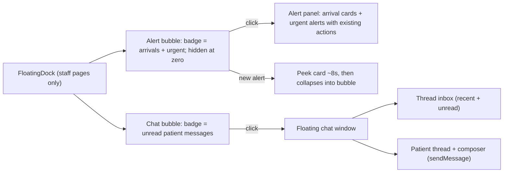

# Two-bubble floating dock: alert bubble + chat bubble

## Audit findings (QC performed with Playwright against dev:demo)

- The chat bubble exists only on [src/routes/_authenticated/patients.$id.tsx](src/routes/_authenticated/patients.$id.tsx), only after manually minimising the docked panel, and clicking it re-expands the docked column — it never opens a chat window. No chat bubble exists on the dashboard or any other page, and there is no cross-patient threads API (only `getUnreadMessages` counts and the heavy per-patient `getPatient`).
- Arrival alerts ([src/components/arrival-alerts.tsx](src/components/arrival-alerts.tsx), fed by `getDashboard` polling) and urgent team alerts ([src/components/urgent-staff-alerts.tsx](src/components/urgent-staff-alerts.tsx), fed by `listStaffNotifications`) render as auto-expanded cards in a fixed bottom-right stack in [src/components/app-shell.tsx](src/components/app-shell.tsx) (L645–656), alongside the demo role switcher — up to four floating elements compete for one corner, and alerts "keep coming" by design.

## Target UX (best-practice pattern: persistent launchers, transient previews)

Exactly two launchers, stacked bottom-right in one owner component; everything else leaves the corner.

- **Standards applied:** 52px bubbles, 12px gap, chat bottom-most (most-used), alert bubble auto-hides at zero count ("comes and goes with context"), badges cap at 9+, new-alert peek auto-collapses after ~8s (hover pauses) so time-critical arrivals are still seen without permanently owning the corner, Escape/click-outside closes surfaces, `role="dialog"` + aria labels, `prefers-reduced-motion` respected, z-order: bubbles 60 / surfaces 70 / sonner toasts above, demo role switcher moves to bottom-left.
- **Context rules:** both bubbles on staff pages only (dashboard, patients + tabs, record, schedule, retention, performance); patient-role users see neither. On the patient record the chat bubble hides while the docked panel is open (the context already shows chat) and appears when minimised — clicking now opens the floating window with that patient loaded; a "dock to page" button in the window restores the side column.

## Phase A — chat data layer

- New server fns in [src/lib/clinic.functions.ts](src/lib/clinic.functions.ts) + demo twins + `POLICY` entries + zod schemas: `listPatientThreads` (recent conversations across patients: patient id/name/avatar_url, last message preview + time, unread count, limit ~15, staff-only) and `getPatientMessages({ patient_id })` (light thread fetch — `getPatient` is far too heavy for a chat window). Reuse existing `sendMessage` + `markMessagesRead`.

**To-dos:** `a-threads-fn` · **Work log:** _(filled during implementation)_

## Phase B — chat bubble + floating chat window

- Extract the thread + composer body of [src/components/patient-chat-panel.tsx](src/components/patient-chat-panel.tsx) into a reusable `PatientChatThread` so the docked panel and the floating window render the same chat.
- New `src/components/floating-dock/chat-bubble.tsx`: launcher with unread badge (from `getUnreadMessages`, shared query key with the bell) + floating window (380px, max-h 70vh, glass card): inbox list → thread view (marks read on open, composer sends via `sendMessage`) → back; on the record page it opens directly on that patient with a dock-back action.
- Rewire [patients.$id.tsx](src/routes/_authenticated/patients.$id.tsx): minimise keeps collapsing the column, but the bubble now opens the floating window (the old restore behaviour moves to the window's dock-back button).

**To-dos:** `b-thread-extract`, `b-chat-bubble`, `b-record-wiring` · **Work log:** _(filled during implementation)_

## Phase C — alert bubble consolidation

- New `src/components/floating-dock/alert-bubble.tsx` + `floating-dock.tsx`: single owner of the corner. Refactor `ArrivalAlerts` and `UrgentStaffAlerts` so their card bodies and actions (Arrived / No show / call / snooze / Acknowledge / Message) render inside the alert panel, keeping their data hooks and the sessionStorage snooze util intact; the components export active counts for the badge.
- Peek behaviour: a newly appearing alert renders one card beside the bubble for ~8s (pause on hover), then collapses; escalations (late → overdue) re-peek, matching the existing snooze phases.
- [app-shell.tsx](src/components/app-shell.tsx): replace the L645–656 stack with `<FloatingDock identity={identity} />`; move `DemoRoleSwitcher` to bottom-left.

**To-dos:** `c-alert-bubble`, `c-dock-shell` · **Work log:** _(filled during implementation)_

## Phase D — Playwright QC suite, fixes, commit

- Durable QC script `scripts/qc-floating-dock.mjs` (run against `npm run dev:demo`), asserting on dashboard, patients (all three tabs), patient record and retention: exactly two launchers bottom-right and no other fixed elements in the corner region; alert peek auto-collapses within 8s; alert bubble badge → panel opens → Acknowledge/Arrived act and decrement; chat bubble on dashboard → inbox → open a thread → send → message appears and unread clears; record page minimise → bubble → floating window → dock-back restores the column; patient role sees neither bubble; bubbles and demo switcher bounding boxes never intersect; zero console/page errors.
- Fix everything the suite catches, run the existing check scripts (`check:policy`, `check:validators`, `check:tenancy`, tsc-delta), fill all work logs, then commit to `patient0` and push with Zaisam's token via the token URL (keychain untouched).

**To-dos:** `d-qc-suite`, `d-fixes-checks`, `d-commit` · **Work log:** _(filled during implementation)_

## Out of scope

Staff↔staff chat (the quick-reply toast and staff chat panel stay as they are), realtime transport changes (existing polling/realtime kept), patient-side portal chat UI, and the notification bell dropdown (unchanged; the alert bubble covers only the corner stack).