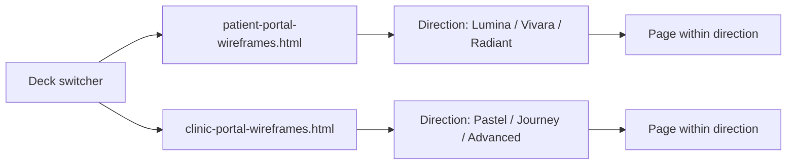

# V2 patient and clinic portal wireframes

## What the screenshots actually contain

Fifteen screens across six design directions, two aspect ratios.

**Patient portal — 3 directions, 1 screen each (1448x1086, 4:3):**
- `lumina` — Lumina Skin Clinic. Left sidebar, deep green accent, plan roadmap list with numbered steps grouped by month, right-hand detail drawer (Blood Test Check), "Today's focus" checklist. Browser chrome: macOS traffic lights + URL pill (`portal.lumina-skinclinic.co.uk`).
- `vivara` — Vivara. Top nav, tab bar (Overview/Timeline/Today/Photos/Messages), Today-Next Action panel, Upcoming, Conditional steps, right rail (Recovery Check-in sliders, Before & After, Routine adherence, Safe to Proceed). Full Chrome tab bar chrome.
- `radiant` — Radiant Health "Glow Garden View". Left sidebar, illustrated garden hero with milestone stones, view toggle (Glow Garden / Clinical / Hide artwork layer), task cards, progress rings, calendar, photos, notification toggles. No browser chrome.

**Clinic portal — 3 directions, 12 screens:**
- `clinic-pastel` (5 screens, 4:3, no chrome) — Aetheria Clinic Portal. Sidebar, multi-pastel accents. Pages: Clinic overview, Clinic diary, Patients list, Patient record, Performance.
- `clinic-journey` (3 screens, 4:3, macOS chrome, `clinic.aetheria.co.uk`) — Aetheria Skin Clinic, journey-led green. Pages: Clinic overview, Patient Skin Journey, Retention & outcomes.
- `clinic-advanced` (4 screens, 1672x941, 16:9, full Chrome tab bar, `clinic.aetheria.com`) — AETHERIA ADVANCED SKIN HEALTH, top nav. Pages: Clinic Overview, Clinic Diary, Patient record, Journey Board.

## Deliverables

- [docs/patient-portal/v2/patient-portal-wireframes.html](docs/patient-portal/v2/patient-portal-wireframes.html) — 3 screens
- [docs/patient-portal/v2/clinic-portal-wireframes.html](docs/patient-portal/v2/clinic-portal-wireframes.html) — 12 screens
- `docs/patient-portal/v2/assets/` — generated PNGs (garden hero, before/after skin, avatars, sidebar artwork)

## Navigation model

Three switching dimensions, extending the proven v1 harness in [docs/patient-portal/v1/aetheria-patient-portal-wireframes.html](docs/patient-portal/v1/aetheria-patient-portal-wireframes.html), which already has `SCREENS`/`ORDER`, `S(id, def)`, `render(id)`, a grouped rail, and the chrome-dock with `prev2`/`next2`/`screenjump2`/Tools.



The `S()` signature gains a `version` field:

```js
S('clinic-journey-overview', {
  version:'clinic-journey', group:'Clinic', title:'Clinic overview',
  route:'/dashboard', chrome:'mac', url:'https://clinic.aetheria.co.uk',
  frame:'4:3', notes:'...', html:`...`
});
```

- Rail groups by `version`, then lists pages under it.
- Dock keeps prev/next plus a jump select, and gains a direction pill row.
- A persistent link in both files cross-navigates to the other deck, so "patient <-> clinic" is one click.

## Fidelity approach

**Palette: sampled, not guessed.** Before writing CSS, run a Playwright script that loads each PNG into a canvas and reads pixels at named coordinates (sidebar fill, accent, chip backgrounds, text, borders), emitting a per-direction palette JSON. The CSS then uses those exact hex values. This is what makes "do not deviate" checkable rather than a claim.

**Charts: hand-built inline SVG.** Performance needs an earnings line with a dashed collected series, appointment bars, an attendance area+line with a tooltip callout, and no-show bars; Retention needs a five-stage funnel and horizontal progress bars. Inline SVG gives exact control over the shapes in the screenshots, keeps both files self-contained with no CDN dependency, and avoids fighting a charting library's default styling.

**Photographic and illustrative content: generated images** via `GenerateImage` with the source screenshot passed as `reference_image_paths`, saved into `assets/`:
- Radiant Health garden hero (16:9, the layered botanical path with stepping stones)
- Before/after skin close-ups (a small reusable set)
- Practitioner and patient avatars
- The soft leaf panel in the pastel sidebar and the silk panel in the journey sidebar

**Browser chrome** reproduced per screen via a `chrome` property: `mac` (traffic lights + centred URL pill), `tab` (full Chrome tab bar with favicon, tab title, back/forward/reload, star), or `none`.

**Type.** Google Fonts approximating the source: Inter for UI, Cormorant Garamond for the letterspaced serif logos, Caveat for the handwritten taglines ("Confident skin brighter futures", "Progress looks good on you", "Healthier Skin Brighter Tomorrows"). The screenshots are AI-generated, so these are the closest real specimens rather than exact matches.

**Frame sizing.** Two stage presets: `4:3` at 1448x1086 and `16:9` at 1672x941, scaled to fit the viewport so proportions match the source exactly.

## Verification

Extend the existing Playwright render harness to both decks:
- Every screen renders in both stage presets, zero console and zero page errors.
- Rail button count matches `ORDER`; no orphans; direction switcher reaches every screen.
- The label/description stacking check that caught the v1 `display:block` bug.
- Per screen, capture the rendered stage and write a side-by-side composite against its source screenshot into `/tmp/v2-compare/`, so fidelity is judged visually rather than asserted.

## Out of scope

Only the 15 screens in the screenshots. No extra flows, no sign-in or settings pages that no screenshot shows, no spec or handoff document unless asked. v1 stays untouched.