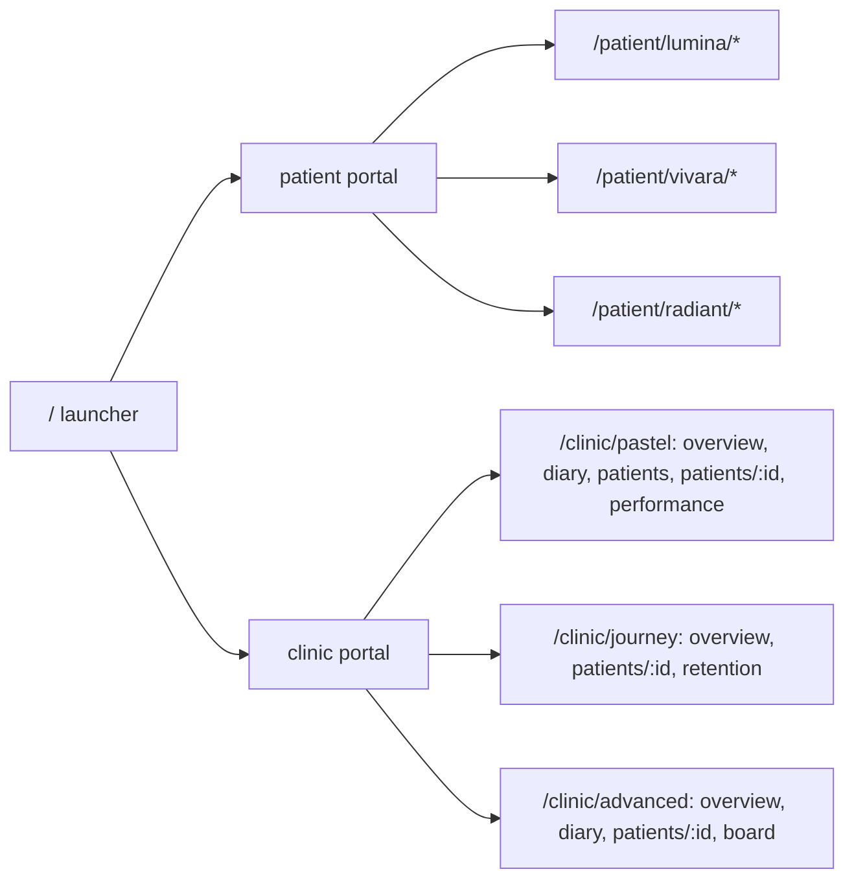

# V3: fully interactive patient + clinic portals

## What changes from v2

V2 renders each screen as a fixed 1448px/1672px canvas scaled to fit — visually faithful but static. V3 is a real app: fluid layouts, actual React components, client-side routing, and every control wired to state or a mock API call. Same six design directions, same 15 screens, same sampled palettes and generated assets.

## Stack and location

Standalone app in `docs/patient-portal/v3` with its own `package.json` (React 19, react-router 7, Vite 8, TypeScript — matching the repo's versions; Node 22). No Tailwind: the pixel-tuned per-direction CSS from [docs/patient-portal/v2/clinic-portal-wireframes.html](docs/patient-portal/v2/clinic-portal-wireframes.html) and [patient-portal-wireframes.html](docs/patient-portal/v2/patient-portal-wireframes.html) gets ported into per-direction stylesheets and made fluid (max-width containers instead of scaled frames). The 16 generated images copy from `v2/assets` into `v3/public/assets`. Own `.gitignore` for `node_modules`/`dist`. v1 and v2 stay untouched.

```
docs/patient-portal/v3/
  package.json  vite.config.ts  tsconfig.json  index.html  .gitignore
  public/assets/            # copied from v2
  src/
    main.tsx  router.tsx
    styles/                 # base.css + one file per direction
    mock/                   # db.ts (seed), api.ts (typed async API), storage.ts
    components/             # Chip, Modal, Toast, Tabs, Toggle, ProgressRing,
                            # DataTable, charts (Line/Bar/Area/Funnel), DeckSwitcher
    portals/
      patient/  lumina/  vivara/  radiant/
      clinic/   pastel/  journey/  advanced/   # each with its own Shell (sidebar/topnav)
```

## Routing



- `/` is a small launcher listing both portals and all six directions.
- A floating **DeckSwitcher** (successor of the v2 dock) is present on every route: portal pill, direction pills, screen jump, prev/next, and a Reset demo data button.
- Sidebar/topnav items without a designed v2 screen (e.g. Lumina "Billing", pastel "Retention") route to lightweight functional pages rendered from mock data (simple lists) — no dead links anywhere.

## Mock backend

`src/mock/` — no service worker, per your choice:
- `db.ts`: seed data derived from the v2 screens — ~633 generated patients (the named ones from v2 first), 4 practitioners, diary appointments, the 14-step microneedling plan, tasks, checklists, notes, message threads, retention metrics, journey-board cards, and per-period performance series.
- `api.ts`: typed async functions with 150–300 ms latency (`getPatients({query, filter, sort, page})`, `getDiary(date)`, `createBooking`, `toggleTask`, `sendMessage`, `getPerformance(period)`, `setPreference`, `completeMilestone`, `sendReminder`…). Components show loading skeletons while awaiting.
- `storage.ts`: persists mutations under a `aetheria-v3` localStorage key; `resetDemoData()` restores the seed.

## Interactivity inventory (what clicking does)

- **Lumina**: roadmap rows open the detail drawer for that step (Blood Test Check is step 7's instance); checklist ticks persist; Upload Result opens a mock file modal that completes the checklist item; Today's focus toggles; Message Clinic opens a compose modal.
- **Vivara**: all five tabs render content (Overview is the designed screen; Timeline/Today/Photos/Messages are functional views from mock data); recovery sliders draggable; Upload result / Book a blood test / View checklist all open modals.
- **Radiant**: Glow Garden / Clinical View toggle actually swaps the hero for a clinical timeline of the same data; Hide artwork layer works; Mark day complete updates the progress rings; calendar month navigation; notification toggles persist; garden milestone chips open popovers.
- **Pastel clinic**: New booking modal writes a block into the diary; diary day navigation re-fetches; patients table has working search, filter pills, column sort and pagination over 633 records; patient record tabs switch, preference toggles persist, message input appends to the thread; performance period pills (This month / Last month / This year) re-fetch and re-render the four SVG charts with hover tooltips.
- **Journey clinic**: support-queue rows and snapshot rows navigate to the patient; clinician action panel checkboxes persist; Send reminder marks the at-risk row "Reminder sent" with a toast; funnel stages show a hover breakdown.
- **Advanced clinic**: diary blocks load that appointment into the Visit Prep side panel; board filters and the At-risk-only toggle filter the cards; board cards click through to the patient; preparation checklist updates the 4-of-5 counter.
- Actions with no designed destination fire a themed toast, so every single button responds.

## Verification

Playwright script: visits every route with zero console/page errors, click-crawls all buttons and links asserting each one navigates, opens an overlay, mutates visible state, or fires a toast; exercises table search/sort/pagination and the booking flow end-to-end; screenshots the 15 designed screens for a final visual pass against the v2 sources.

Run: `cd docs/patient-portal/v3 && npm install && npm run dev` (Vite on :5173; the v2 static server on :4280 keeps running independently).