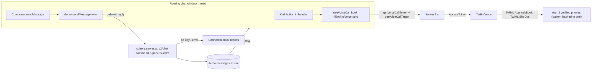

# VoIP call button + AI patient responder (demo)

Phases run least-dependent first: Phase 0 (deps/env/docs, no code paths touched) → Phase A (AI responder, self-contained in demo fixtures, no Twilio dependency) → Phase B (voice server layer, depends only on Phase 0 env) → Phase C (voice UI, depends on B) → Phase D (QC over everything). Every phase ends with its work log filled in below.

## Phase 0 — foundations (no dependencies)

- Install `twilio` (server-side AccessToken minting) and `@twilio/voice-sdk` (browser device); confirm the tsc baseline is unchanged after install.
- Extend [.env.example](.env.example): `TWILIO_ACCOUNT_SID`, `TWILIO_API_KEY_SID`, `TWILIO_API_KEY_SECRET`, `TWILIO_TWIML_APP_SID`, `TWILIO_DEMO_NUMBERS` (comma-separated E.164 pool you own), `COHERE_API_KEY`, `COHERE_MODEL` (default `command-a-plus-05-2026`).
- `docs/voice-call-setup.md`: one-time Twilio console walkthrough — create API key/secret, create a TwiML Bin containing `<Response><Dial callerId="YOUR_TRIAL_NUMBER"><Number>{{To}}</Number></Dial></Response>`, point a TwiML App's Voice URL at the Bin (no public webhook or ngrok needed), verify your ~3 demo numbers, and the trial caveats (calls arrive from the Twilio trial number with a preamble, 10-minute cap, verified same-country numbers only).

**To-dos:** `p0-deps`, `p0-env`, `p0-docs` · **Work log:** _(filled during implementation)_

## Phase A — AI patient responder (independent of Twilio)

- `src/lib/demo/patient-ai.server.ts`: POST `https://api.cohere.ai/v2/chat` with `COHERE_API_KEY`; model from `COHERE_MODEL`. System prompt builds a persona from demo fixtures (name, age, treatments, recent appointments) and constrains style: terse SMS, 1–2 sentences, no markdown. History maps staff→`user`, patient→`assistant` (the model speaks as the patient), last ~12 messages. Missing key, API error, or rate-limit → rotating canned replies so demos never stall (trial budget: 1,000 calls/month, 20/min).
- Demo `sendMessage` twin in [src/lib/clinic.functions.demo.ts](src/lib/clinic.functions.demo.ts): staff message → schedule exactly one reply after 4–8s; a per-patient pending registry collapses rapid follow-ups into a single reply against the latest thread. Patient-portal-authored messages never trigger replies.
- Demo `getPatientMessages` returns a `typing` flag while a reply is pending (response-side only; input schema untouched).
- `ThreadView` in [src/components/floating-dock/chat-bubble.tsx](src/components/floating-dock/chat-bubble.tsx): typing bubble while `typing` is set, and a faster poll (~4s for ~30s) after sending.

**To-dos:** `a1-cohere`, `a2-sendhook`, `a3-typing`, `a4-thread-ui` · **Work log:** _(filled during implementation)_

## Phase B — voice server layer (depends on Phase 0)

- `src/lib/comms/voice.server.ts` following the [config.server.ts](src/lib/comms/config.server.ts) pattern: env reads, `voiceAvailable()`, AccessToken minting with VoiceGrant (`TWILIO_TWIML_APP_SID`), and a deterministic patient-id hash into the `TWILIO_DEMO_NUMBERS` pool so every patient consistently rings the same of your ~3 phones (`{ phone, label: "Demo line N" }`).
- Three server fns in [src/lib/clinic.functions.ts](src/lib/clinic.functions.ts) + identical demo twins (telephony is real even in demo): `getVoiceCallConfig()` → `{ available }`; `getVoiceCallToken()` → `{ token, identity }`; `getVoiceCallTarget({ patient_id })`.
- `POLICY` staff entries + zod schemas; `check:policy` and `check:validators` stay green.

**To-dos:** `b1-voice-server`, `b2-voice-fns`, `b3-policy-schemas` · **Work log:** _(filled during implementation)_

## Phase C — voice UI (depends on Phase B)

- `src/components/floating-dock/use-voice-call.ts`: lazy-imports `@twilio/voice-sdk` on first call, mints token, `device.connect({ params: { To } })`; state machine idle → connecting → ringing → connected (mm:ss timer, mute toggle) → ended/error; cleans up the device on window close.
- [chat-bubble.tsx](src/components/floating-dock/chat-bubble.tsx): phone icon button in the thread header right of the patient name (next to dock/close); slim call strip above the thread showing state, target label ("Demo line 2"), timer, mute, hang up. Logs via existing `logCallAttempt` so calls land in the comms trail. Unconfigured env → disabled button with tooltip.

**To-dos:** `c1-call-hook`, `c2-call-ui` · **Work log:** _(filled during implementation)_

## Phase D — QC, checks, commit (depends on all)

- Playwright QC: without keys the call button shows its disabled/unconfigured state; with fake-mic launch flags the call strip appears and fails gracefully; sending a chat message produces a patient reply (canned fallback) preceded by the typing indicator; zero console/page errors. With your keys in `.env`: manual check that your phone rings and Cohere answers in character.
- Fix findings; run `check:policy` / `check:validators` / `check:tenancy`, tsc delta, lints; fill any remaining work logs.
- Commit to `patient0`, push with Zaisam's token (URL push, keychain untouched).

**To-dos:** `d1-qc`, `d2-checks`, `d3-commit` · **Work log:** _(filled during implementation)_

## Out of scope

AI answering the voice call itself (calls go to real humans), production-mode AI replies, patient-portal-side automation, and SMS delivery (chat stays in-app).
