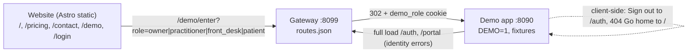

# Stitch the website and the demo app, with automated QC

## Audit findings (read-only, done)

How things connect today:

Working: every website link is a full page load (no Astro client router), so the gateway sees them all; every demo entry goes through `/demo/enter`; the home-page anchors `#patients`, `#clinics`, `#journey`, `#safety` all exist; `/login`, `/pricing`, `/contact`, `/demo` are routed to the website.

Gaps:

- The app's `/auth` and `/portal` are dead ends in the demo: they call Supabase password sign-in against the placeholder `https://demo.invalid`. Full loads reach them via [src/routes/_authenticated/route.tsx](src/routes/_authenticated/route.tsx) (`window.location.replace("/auth")` on identity errors) or a typed URL.
- Two in-app navigations never touch the gateway: **Sign out** in [src/components/app-shell.tsx](src/components/app-shell.tsx) (`navigate({ to: "/auth" })`) and the 404 page's **Go home** in [src/routes/__root.tsx](src/routes/__root.tsx) (`<Link to="/">`, the app's own landing with its own sign-in buttons). `BrandLockup` on `/auth`, `/portal`, `/d/*`, `/u/*` also links to `/`.
- `manager` is a real demo persona (Maya Chen) but is missing from the website's `/login` and from `demoRoles` in [launch-plan/gateway/routes.json](launch-plan/gateway/routes.json); `/demo/enter?role=manager` returns a plain-text 400.
- `routes.json` lists `/about`, `/investors`, `/sitemap.xml` that have no page (they fall to the website 404; nothing links to them). Paths outside the website list (a typo URL) go to the app's 404, not the website's.
- Brand mismatch: the website says SQINOS, the app still says Aetheria. Known; out of scope here, recorded in the report.

## Changes

### 1. Gateway: sign-in redirects, manager role, safe `next`

[launch-plan/gateway/routes.json](launch-plan/gateway/routes.json):
- `demoRoles`: add `"manager": "/dashboard"`.
- New `signIn` block: `{ "/auth": "/login", "/portal": "/login#patient" }`, with a comment that these apply to exact GET paths only; `/auth/callback`, `/auth/reset` and anything with a query other than `idle` stay with the app.

[launch-plan/gateway/server.mjs](launch-plan/gateway/server.mjs):
- In `handle`, before the website check: exact GET `/auth` or `/portal` → 302 to the configured website page, carrying `?idle=1` through as `/login?idle=1`. Off when `DEMO_SIGNIN_REDIRECT=false` (so the same gateway can front a live app later).
- `demoEnter`: unknown role → 302 to `/login?role=unknown` instead of a 400 text page; accept an optional `next` that must be a same-origin path (`/…`, not `//…`), else fall back to the role's default page.

[launch-plan/gateway/test.mjs](launch-plan/gateway/test.mjs): tests for the redirects, the `idle` pass-through, `/auth/callback` untouched, unknown role, `next` accepted and rejected, manager role.

### 2. Website: manager persona and the return points

- [launch-plan/website/src/lib/links.ts](launch-plan/website/src/lib/links.ts): add `manager: demo("/demo/enter?role=manager")`.
- [launch-plan/website/src/pages/login.astro](launch-plan/website/src/pages/login.astro): personas become Clinic owner, Manager, Practitioner, Front desk; `id="patient"` on the patient half so `/login#patient` lands there; a small note when `?idle=1` ("You were signed out after a period of inactivity") or `?role=unknown` ("That demo role does not exist; pick one below").
- [launch-plan/website/src/pages/demo.astro](launch-plan/website/src/pages/demo.astro): add the Manager card to "Try the live demo".
- [launch-plan/website/README.md](launch-plan/website/README.md) and [launch-plan/ngrok/README.md](launch-plan/ngrok/README.md): the persona list and the sign-in redirect rule.

### 3. App: demo-only hand-off to the website (four files, all behind `DEMO_MODE`)

Config: [vite.config.ts](vite.config.ts) gains one define, `__DEMO_SIGNIN_URL__: JSON.stringify(process.env["DEMO_SIGNIN_URL"] ?? null)`; [src/lib/demo/enabled.ts](src/lib/demo/enabled.ts) exports `DEMO_SIGNIN_URL` the same way it exports `DEMO_NOW`. [launch-plan/ngrok/start-demo.sh](launch-plan/ngrok/start-demo.sh) exports `DEMO_SIGNIN_URL=/login`. Without the variable (plain `npm run dev:demo`, the e2e suite) behaviour is exactly as today.

When `DEMO_MODE && DEMO_SIGNIN_URL`:
- [src/routes/auth.tsx](src/routes/auth.tsx) and [src/routes/portal.tsx](src/routes/portal.tsx): on mount, `window.location.replace(DEMO_SIGNIN_URL)` (a full load, so the gateway serves the website). Nothing else on those pages changes.
- [src/routes/index.tsx](src/routes/index.tsx): same redirect to `/` (the website home) so the 404's Go home and the brand link on sign-in pages land on the website.
- [src/components/app-shell.tsx](src/components/app-shell.tsx) `signOut()`: in demo, also clear the `demo_role` cookie and `window.location.assign(DEMO_SIGNIN_URL)` instead of `navigate({ to: "/auth" })`.

Live mode, and demo mode without the variable, are untouched; the existing e2e suite runs without `DEMO_SIGNIN_URL` and is unaffected. `npm run test:unit` and the affected e2e specs (`smoke`, `rbac`) run after the change.

### 4. QC suite: `launch-plan/qc/`

Runs with the repo's Playwright: `npx playwright test --config launch-plan/qc/playwright.config.ts`. A `launch-plan/qc/run.sh` wraps it (builds the website first, prints the report path). Ports 8094 (app) and 8097 (gateway) so nothing collides with the running 8095/8096 or the e2e suite.

- `playwright.config.ts`: two `webServer` entries, the demo app (`DEMO=1 DEMO_SIGNIN_URL=/login DEMO_NOW=… npx vite dev --port 8094`) and the gateway (`GATEWAY_PORT=8097 APP_PORT=8094 WEBSITE_DIST=… node launch-plan/gateway/server.mjs`); projects `desktop` (Chromium 1440) and `phone` (iPhone 15, WebKit) for the link checks; `baseURL http://127.0.0.1:8097`.
- `routes.spec.ts` (no browser): every `website/src/pages/*.astro` has its path in `routes.json`; every `routes.json` exact path resolves in `dist` or is listed as a known placeholder; every persona in `links.ts` and `login.astro` exists in `demoRoles`, and vice versa; no website path collides with an app route (`src/routes`).
- `links.spec.ts`: crawl `/`, `/pricing`, `/contact`, `/demo`, `/login`, `/404` at desktop and phone (mobile menu opened). For every `a[href]`: same-origin path → 200, or 302 for `/demo/enter`; `#hash` → the id exists on the target page; `mailto:` and external skipped but listed. Every stylesheet, script and image on each page → 200; `/_astro/` assets carry the immutable cache header. Fails on any link to an app-owned path other than `/demo/enter`.
- `demo-entry.spec.ts`: for each of the five roles, `/demo/enter?role=…` (redirect manual) → 302, `Set-Cookie demo_role`, expected Location; then in the browser click every persona button on `/login`, every "Try this view" on `/`, every card on `/demo` and the two Sign in panel rows: land on `/dashboard` or `/my-record` on the gateway origin, the Demo pill shows the right persona (Clinic owner, Manager, Practitioner, Receptionist, Patient) and the page heading renders. `next` deep link lands on `/patients?tab=board`; a bad `next` and an unknown role fall back safely.
- `return-paths.spec.ts`: full loads of `/auth`, `/portal`, `/auth?idle=1` → website `/login` (with the note); `/auth/callback` and `/auth/reset` still reach the app; in-app **Sign out** → website `/login` and the `demo_role` cookie is gone; the app 404's **Go home** (`/no-such-page` reached through the app) → website home; brand link on `/d/<token>`-style pages not exercised (needs a token) and noted.
- `gateway-health.spec.ts`: `/healthz`; `/api/demo/metrics` proxied 200; a server-function POST through the proxy succeeds (toggle an offer's automation switch, expect the preview count, no "Forbidden"), which proves the CSRF origin mapping; `/journal/anything` → website 404 with status 404; a typo path → app 404 page (recorded as expected behaviour).
- `report.ts` (a Playwright reporter or `afterAll`): writes `launch-plan/qc/REPORT.md` with the run date, one table per spec (every link and entry checked, status, note) and the list of known gaps; landing screenshots go to `launch-plan/qc/captures/` (added to [launch-plan/.gitignore](launch-plan/.gitignore)). `REPORT.md` is committed.

### 5. Wire into the launch flow

- [launch-plan/ngrok/doctor.sh](launch-plan/ngrok/doctor.sh): mention `qc/run.sh` as the last pre-flight step.
- [launch-plan/README.md](launch-plan/README.md): a "QC" row and the persona table update.

## Verification

1. `node launch-plan/gateway/test.mjs` passes (existing 8 plus the new cases).
2. `cd launch-plan/website && npm run build`, then `launch-plan/qc/run.sh` passes on desktop and phone and writes `REPORT.md` with zero failures and the known gaps listed.
3. `npm run test:unit`; `npx playwright test e2e/smoke.spec.ts e2e/rbac.spec.ts` (demo without `DEMO_SIGNIN_URL`, so the app change is inert there).
4. Restart the running after app (8096) with `DEMO_SIGNIN_URL=/login` via `start-demo.sh` and click through once by hand: website → Sign in → Manager → dashboard → Sign out → website login.

## Assumptions

- Manager joins the public persona list; software admin does not (it is an internal role).
- The app-side change is the minimum to hand the demo back to the website; the app's own `/auth` and `/portal` designs are left alone, since in demo they are never shown.
- Nothing is committed or pushed until you say so.