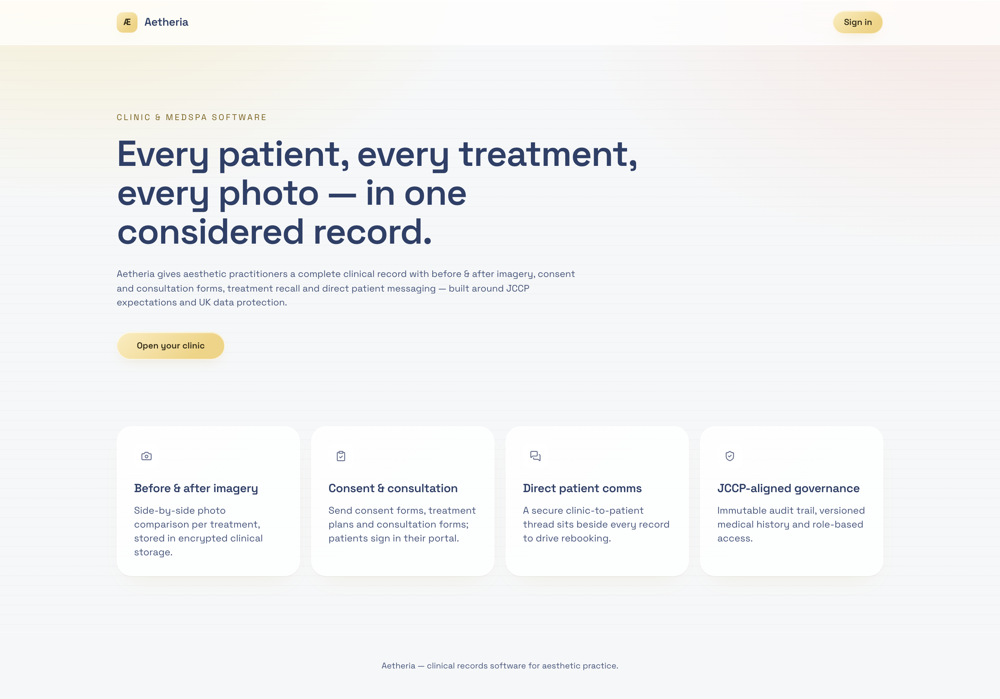
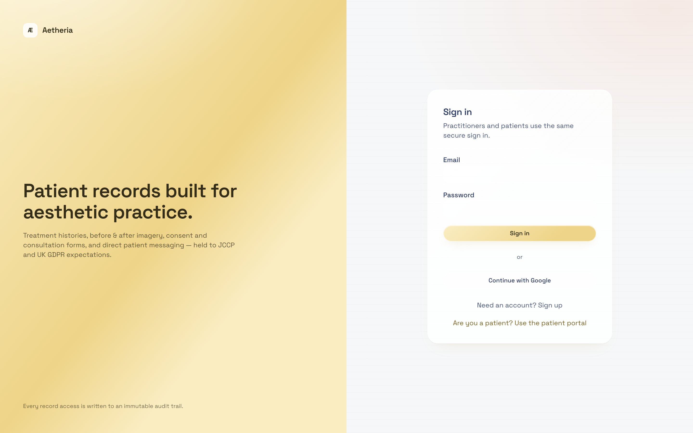
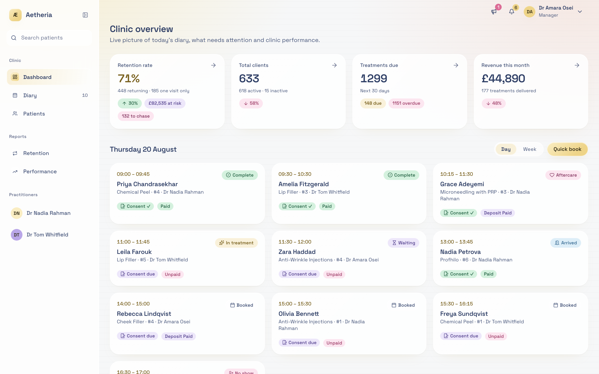
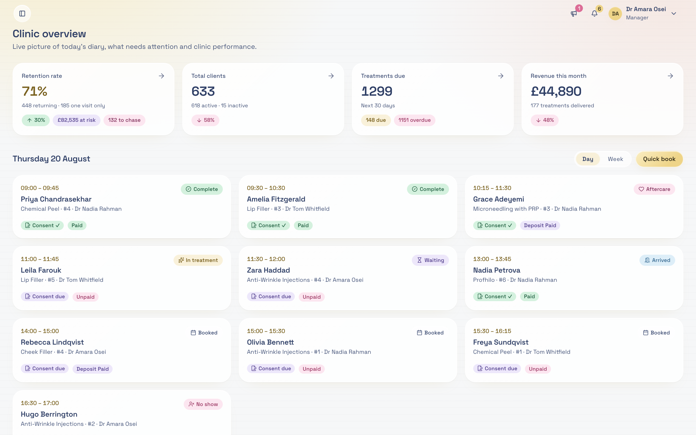
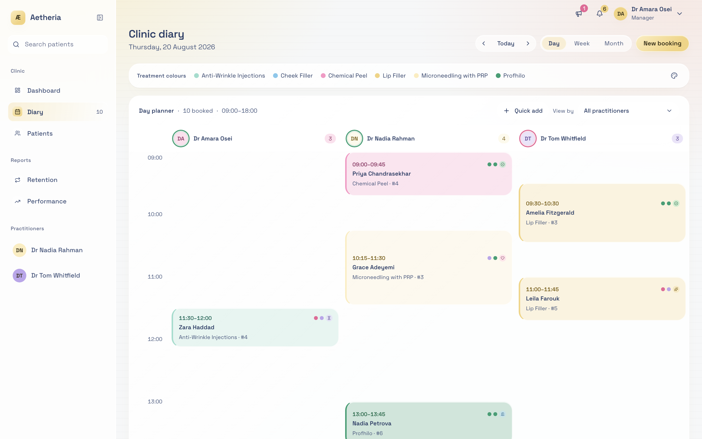
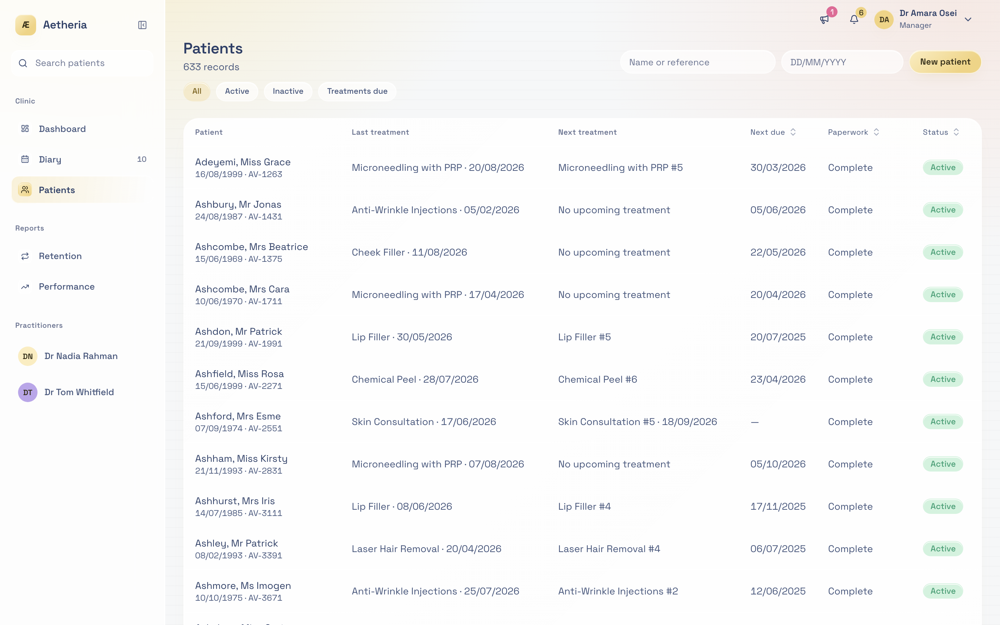
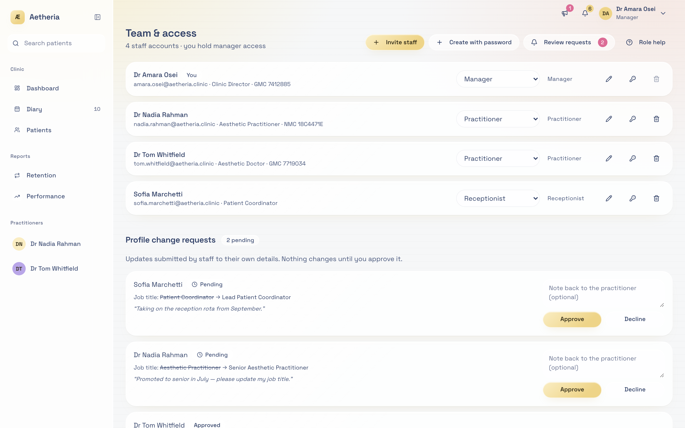
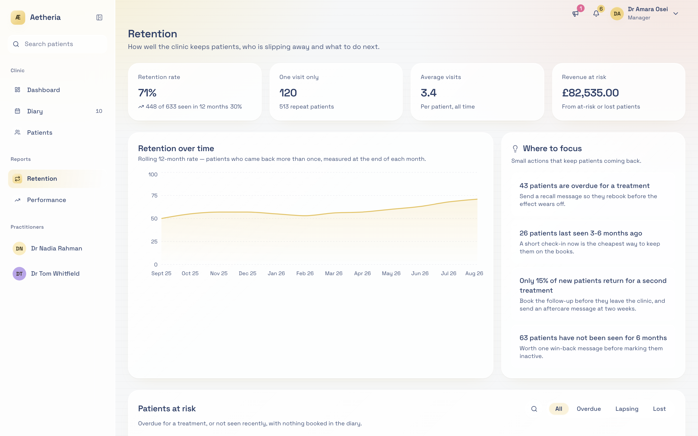
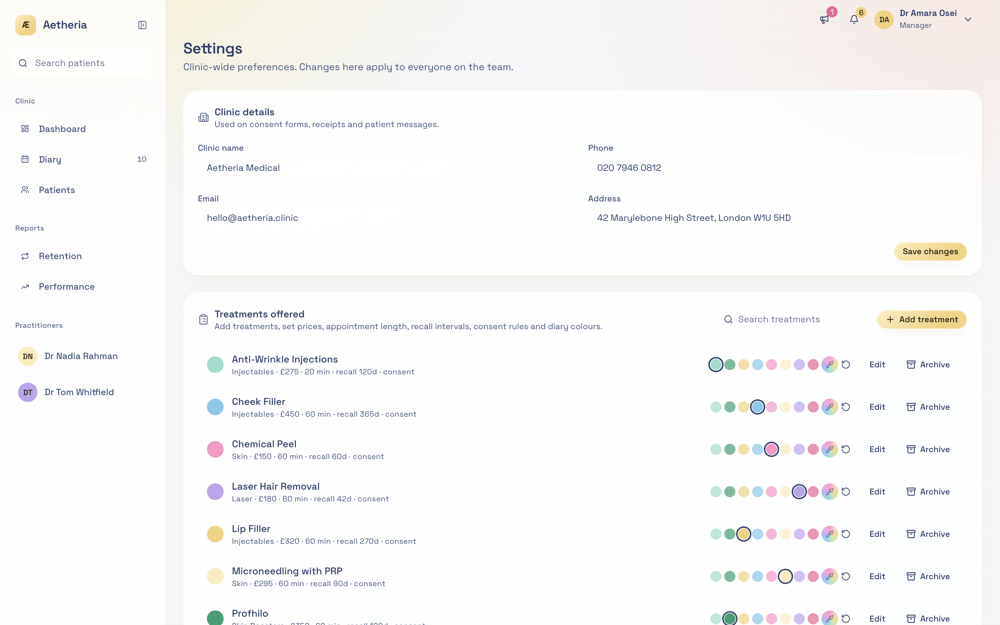

# Aetheria — Uncommitted Changes Audit & Work Log

**Status note:** Git index has **0 staged files**. The “59 changes” are **unstaged working-tree** changes: **55 modified** + **4 untracked**. Branch: `main` @ `1be36ae`.

**Totals:** ~**+1,998 / −848** on modified files; +4 new files (~221 lines).

---

## Executive summary

This batch is one cohesive product pass across three themes:

1. **Shell redesign** — sticky top nav → collapsible/resizable left sidebar with search, diary badge, practitioner list, and floating toolbar.
2. **Design-system refresh** — Bright Pastels token remap in CSS; quieter chrome (`accent-ink` → `ink-3`, hovers → `accent-wash`); shared `.page-title` / `.page-header`.
3. **Treatment duration + ops UX** — `duration_minutes` end-to-end (migration → catalogue → booking); richer dashboard KPIs; day/week diary; Quick Book; retention/patients polish; demo staff provisioning script.

---

## Screenshots

Captured from `npm run dev:demo` (fixture data, Manager persona) at 1440×900 @2x. Images live in [`docs/audit-screenshots/`](audit-screenshots/). Regenerate with `node docs/audit-screenshots/capture.mjs` while demo is on port 8081.

### Brand — landing & auth

*Public landing — Æ BrandLockup and quieter feature icons.*

*Staff auth — BrandLockup on the gold panel.*

### Shell — sidebar open & collapsed

*New shell: grouped sidebar (Clinic / Reports / Practitioners), patient search, Diary badge, floating alerts + account toolbar, KPI chips, Day/Week diary + Quick book.*

*Sidebar collapsed — open control in the sticky toolbar; more horizontal room for the overview.*

### Diary / schedule

*Full-height diary planner, soft-accent view toggles, New booking (catalogue-driven duration).*

### Patients & team

*Patients list — compacted `page-header` toolbar and soft-accent filter chips.*

*Team — invite/create/review actions in the shared page header.*

### Retention & settings

*Retention — simplified stats, at-risk table, breakdown panels.*

*Settings — treatment catalogue appointment length (`duration_minutes`) and quieter section icons.*

---

## Change themes (work streams)

### A. App shell & navigation
Top header replaced by left sidebar (`h-dvh`), grouped nav (Clinic / Reports / You / Practitioners), patient search (`/` focus, `[` toggle), diary count badge (60s poll), resize + localStorage persistence, sticky alerts/account toolbar.

### B. Brand & design tokens
New `BrandMark` / `BrandLockup` (Æ); `:root` hex/rgba remap; body 13.5px; glass radii; button/input/select/tabs quieter selected/hover states; systematic icon demotion from gold accent.

### C. Treatment duration (schema → UI)
Migration adds `duration_minutes`; helpers + clamp; settings field; Quick Add + Schedule auto-fill; types/demo/live `saveCatalogueItem` updated.

### D. Dashboard & booking ops
Day/week diary span; Quick book; KPI chips (at-risk £, chase count, due/overdue split); notes panel resize; follow-up empty state; cache invalidation for sidebar/dashboard after book.

### E. Retention / patients / team chrome
At-risk expand-search; breakdown controlled tabs + titles; patients URL `q` + toolbar; team actions in `page-header`; retention stat simplification.

### F. Ops tooling
Untracked `scripts/provision-staff.mjs` — creates/resets demo staff via service role (hardcoded credentials risk).

---

## Risk register (highest first)

| Risk | Impact |
|------|--------|
| No mobile sidebar drawer | Narrow viewports may be unusable with open sidebar |
| Migration not applied | Catalogue load/save fails on `duration_minutes` |
| `treatmentsDue` semantics changed | Full overdue+dueSoon counts (not capped attention-list length) — KPI jump |
| Extra AppShell/dashboard polling | Perf cost on every staff page |
| Provision script secrets | Service role + printed passwords — demo-only |
| Quick Add local date construction | Possible clinic-TZ edge cases near midnight |
| Duration heuristic drift | TS helpers vs SQL backfill can diverge |

---

## Work log — all 59 files

### New files (4)

| # | File | Category | What changed |
|---|------|----------|--------------|
| 1 | [`src/components/brand-mark.tsx`](../src/components/brand-mark.tsx) | New / brand | `BrandMark` + `BrandLockup` with Æ mark; gold / `on-gold` / light variants |
| 2 | [`src/lib/treatment-duration.ts`](../src/lib/treatment-duration.ts) | New / domain | `defaultDurationMinutes`, `durationForCatalogueItem`, `clampDurationMinutes` (5–480) |
| 3 | [`supabase/migrations/20260819022500_treatment_catalogue_duration.sql`](../supabase/migrations/20260819022500_treatment_catalogue_duration.sql) | New / schema | `duration_minutes NOT NULL DEFAULT 60` + botox/consult backfill |
| 4 | [`scripts/provision-staff.mjs`](../scripts/provision-staff.mjs) | New / ops | Demo staff provision via service role; prints plaintext passwords |

### Major feature / redesign (11)

| # | File | +/− (approx) | Category | Work log |
|---|------|--------------|----------|----------|
| 5 | [`src/components/app-shell.tsx`](../src/components/app-shell.tsx) | +515/−170 | Redesign + feature | Sidebar shell; NavItem/NavGroup/SidebarChrome/ToolbarAlerts/AccountMenu; search; diary badge; practitioners; resize; `[` `/` shortcuts |
| 6 | [`src/components/quick-add-appointment.tsx`](../src/components/quick-add-appointment.tsx) | +363/−83 | Feature + UX | Patient combobox; DOB/email/phone for new patients; date+time; catalogue duration; draggable wider popover; cache invalidation |
| 7 | [`src/styles.css`](../src/styles.css) | +125/−107 | Design system | Bright Pastels token remap; shadows; `.page-title` / `.page-header`; 13.5px body |
| 8 | [`src/routes/_authenticated/dashboard.tsx`](../src/routes/_authenticated/dashboard.tsx) | +122/−29 | Feature + layout | Day/week diary; Quick book; retention KPI merge; flex layout vs 3-col grid |
| 9 | [`src/components/dashboard/notes-panel.tsx`](../src/components/dashboard/notes-panel.tsx) | +135/−12 | Feature | Resizable width/height with keyboard separators; persisted panel size |
| 10 | [`src/components/dashboard/kpi-grid.tsx`](../src/components/dashboard/kpi-grid.tsx) | +110/−50 | Feature + redesign | ChipRow tones; at-risk / chase / due-soon / overdue chips |
| 11 | [`src/components/retention/retention-breakdown.tsx`](../src/components/retention/retention-breakdown.tsx) | +103/−94 | UX | Controlled tabs; dynamic title/hint; empty-state panels |
| 12 | [`src/components/retention/at-risk-table.tsx`](../src/components/retention/at-risk-table.tsx) | +91/−29 | UX | Expand-to-search; soft-accent filters; empty panel polish |
| 13 | [`src/routes/_authenticated/schedule.tsx`](../src/routes/_authenticated/schedule.tsx) | +75/−35 | Feature + layout | Catalogue-driven booking duration; flex full-height diary; cache invalidation |
| 14 | [`src/routes/_authenticated/patients.index.tsx`](../src/routes/_authenticated/patients.index.tsx) | +70/−52 | UX + routing | URL `q`; compacted toolbar; filter chips below header; create Cancel |
| 15 | [`src/components/dashboard/today-snapshot.tsx`](../src/components/dashboard/today-snapshot.tsx) | +56/−5 | Feature | `span` day\|week; day grouping; empty → schedule link |

### Domain / API / data (7)

| # | File | Category | Work log |
|---|------|----------|----------|
| 16 | [`src/lib/clinic.functions.ts`](../src/lib/clinic.functions.ts) | API | Due KPI split (`treatmentsOverdue` / `treatmentsDueSoon`); full `treatmentsDue`; catalogue duration clamp on save |
| 17 | [`src/lib/clinic.functions.demo.ts`](../src/lib/clinic.functions.demo.ts) | Demo parity | Mirrors live KPI + catalogue duration behaviour |
| 18 | [`src/lib/clinic-time.ts`](../src/lib/clinic-time.ts) | Utility | New `clinicWeekRange()` (Mon→Mon clinic TZ) |
| 19 | [`src/lib/demo/data.ts`](../src/lib/demo/data.ts) | Demo seed | Catalogue rows get `duration_minutes` via heuristics |
| 20 | [`src/integrations/supabase/types.ts`](../src/integrations/supabase/types.ts) | Types | `treatment_catalogue.duration_minutes` on Row/Insert/Update |
| 21 | [`src/components/treatment-catalogue-settings.tsx`](../src/components/treatment-catalogue-settings.tsx) | Feature | Appointment length field; list shows `· N min` |
| 22 | [`src/components/dashboard/follow-up-tasks.tsx`](../src/components/dashboard/follow-up-tasks.tsx) | UX | Always show section; dashed empty state instead of `return null` |

### UI primitives (7)

| # | File | Category | Work log |
|---|------|----------|----------|
| 23 | [`src/components/ui/button.tsx`](../src/components/ui/button.tsx) | Redesign | 12.5px / 34px; outline/ghost → accent-wash + lift |
| 24 | [`src/components/ui/input.tsx`](../src/components/ui/input.tsx) | Token | `rounded-[11px]`, `border-edge`, 13.5px type |
| 25 | [`src/components/ui/select.tsx`](../src/components/ui/select.tsx) | Token | Align with input chrome |
| 26 | [`src/components/ui/textarea.tsx`](../src/components/ui/textarea.tsx) | Token | `rounded-[15px]`, border/type align |
| 27 | [`src/components/ui/tabs.tsx`](../src/components/ui/tabs.tsx) | Redesign | Active = soft accent (not gold bloom) |
| 28 | [`src/components/ui/sheet.tsx`](../src/components/ui/sheet.tsx) | Feature | Optional `overlayClassName` |
| 29 | [`src/components/ui/dialog.tsx`](../src/components/ui/dialog.tsx) | Copy | Dismiss hint “Close” → “X” |

### Route / page chrome (14)

| # | File | Category | Work log |
|---|------|----------|----------|
| 30 | [`src/routes/_authenticated/team.index.tsx`](../src/routes/_authenticated/team.index.tsx) | Layout | Invite/create/review/help into `page-header` |
| 31 | [`src/routes/_authenticated/retention.tsx`](../src/routes/_authenticated/retention.tsx) | UX | Simpler Stat (no icon slot); inline % change |
| 32 | [`src/routes/auth.tsx`](../src/routes/auth.tsx) | Brand | ShieldCheck → `BrandLockup` on-gold |
| 33 | [`src/routes/index.tsx`](../src/routes/index.tsx) | Brand + token | BrandLockup; quieter feature icons |
| 34 | [`src/routes/portal.tsx`](../src/routes/portal.tsx) | Brand + token | BrandLockup; icons → `ink-3` |
| 35 | [`src/routes/__root.tsx`](../src/routes/__root.tsx) | Token | Error CTA hover → accent-wash/lift |
| 36 | [`src/routes/_authenticated/earnings.tsx`](../src/routes/_authenticated/earnings.tsx) | Token | `.page-header` / `.page-title`; icon → `ink-3` |
| 37 | [`src/routes/_authenticated/performance.tsx`](../src/routes/_authenticated/performance.tsx) | Token | Same page chrome pattern |
| 38 | [`src/routes/_authenticated/my-record.tsx`](../src/routes/_authenticated/my-record.tsx) | Token | `.page-title` |
| 39 | [`src/routes/_authenticated/profile.tsx`](../src/routes/_authenticated/profile.tsx) | Token | `.page-title` |
| 40 | [`src/routes/_authenticated/settings.tsx`](../src/routes/_authenticated/settings.tsx) | Token + UX | `.page-title`; Access Control moved below clinic/treatments |
| 41 | [`src/routes/_authenticated/patients.$id.tsx`](../src/routes/_authenticated/patients.$id.tsx) | Token | `.page-title`; dashed `edge-2`; upload icon |
| 42 | [`src/routes/_authenticated/team.$id.tsx`](../src/routes/_authenticated/team.$id.tsx) | Token | `.page-title` |
| 43 | [`src/components/notification-bell.tsx`](../src/components/notification-bell.tsx) | Shell integrate | `scrolled` prop; outline when scrolled; accent hover |

### Token / hover cleanup only (16)

| # | File | Diff | Work log |
|---|------|------|----------|
| 44 | [`src/components/access-control-settings.tsx`](../src/components/access-control-settings.tsx) | 2 | Icon `accent-ink` → `ink-3` |
| 45 | [`src/components/appointment-time-editor.tsx`](../src/components/appointment-time-editor.tsx) | 2 | Clock icon → `ink-3` |
| 46 | [`src/components/arrival-alerts.tsx`](../src/components/arrival-alerts.tsx) | 8 | Control hovers → `accent-wash` |
| 47 | [`src/components/clinic-details-settings.tsx`](../src/components/clinic-details-settings.tsx) | 2 | Building icon → `ink-3` |
| 48 | [`src/components/dashboard/attention-list.tsx`](../src/components/dashboard/attention-list.tsx) | 6 | Empty `edge-2`; Bell → `ink-3` |
| 49 | [`src/components/dashboard/role-shortcuts.tsx`](../src/components/dashboard/role-shortcuts.tsx) | 2 | Icons → `ink-3` |
| 50 | [`src/components/invite-staff-dialog.tsx`](../src/components/invite-staff-dialog.tsx) | 4 | Role hover wash; shield → `ink-3` |
| 51 | [`src/components/notes/ios-notes-editor.tsx`](../src/components/notes/ios-notes-editor.tsx) | 2 | Toolbar hover → `accent-wash` |
| 52 | [`src/components/performance/performance-table.tsx`](../src/components/performance/performance-table.tsx) | 2 | MiniStat icons → `ink-3` |
| 53 | [`src/components/period-picker.tsx`](../src/components/period-picker.tsx) | 8 | Compact 34px; soft active (not gradient) |
| 54 | [`src/components/retention/send-recall-dialog.tsx`](../src/components/retention/send-recall-dialog.tsx) | 2 | Chip hover wash |
| 55 | [`src/components/retention/staff-task-hovercard.tsx`](../src/components/retention/staff-task-hovercard.tsx) | 2 | User icon → `ink-3` |
| 56 | [`src/components/retention/suggested-actions.tsx`](../src/components/retention/suggested-actions.tsx) | 2 | Lightbulb → `ink-3` |
| 57 | [`src/components/route-error-boundary.tsx`](../src/components/route-error-boundary.tsx) | 2 | Alert icon → `ink-3` |
| 58 | [`src/components/staff-alert-dialog.tsx`](../src/components/staff-alert-dialog.tsx) | 2 | Non-urgent triangle → `ink-3` |
| 59 | [`src/components/staff-files.tsx`](../src/components/staff-files.tsx) | 4 | FileText → `ink-3` |

---

## Suggested commit split (if you commit later)

1. **schema:** migration + types + `treatment-duration` + catalogue settings + clinic.functions(+demo) + demo data  
2. **shell:** `app-shell`, `brand-mark`, `notification-bell`, related keyboard/search  
3. **tokens:** `styles.css` + UI primitives + bulk icon/hover cleanup  
4. **ops UX:** dashboard, schedule, quick-add, notes, kpi, today-snapshot, follow-ups  
5. **retention/patients/team:** at-risk, breakdown, retention route, patients index, team index  
6. **ops script:** `provision-staff.mjs` alone (or omit from product commits)

---

## Suggested QA checklist

- [ ] Apply migration; Settings → Treatments length save/list
- [ ] Schedule New booking + Dashboard Quick book duration auto-fill
- [ ] Sidebar open/close/resize; `[` and `/`; persistence after refresh
- [ ] Narrow viewport navigation still usable
- [ ] Dashboard day/week toggle; KPI chips; empty follow-ups
- [ ] Patients search deep-link with `?q=`
- [ ] Retention expand-search + breakdown tab titles
- [ ] Auth / landing / portal BrandLockup contrast
- [ ] Do **not** run provision script against production
