# Aetheria — Codebase Quality Audit

**Date:** 22 August 2026
**Commit audited:** `a97236f` on `main`
**Live environment verified:** Supabase project `aljozsxrdqfxiqczhbqn` (`patientsys`, eu-west-1)
**Scope:** 139 TypeScript/TSX files (~30,650 lines), 35 migrations, 75 server-function handlers, 16 routes

This is a quality and risk audit of the whole system: security, database, backend, frontend, design system, UI/UX, accessibility, performance and compliance posture. It is distinct from [AUDIT-2026-08-20.md](AUDIT-2026-08-20.md), which is a change log for one batch of work.

No source files were modified. No writes were made to the live database.

---

## 1. Executive summary

The application is well ahead of where most projects of this age are on **product surface** — 16 routes, four roles, a coherent design system, a working demo mode, and genuinely thoughtful clinical flows like no-show follow-up and appointment overlap prevention. The problems are not in what it does; they are in **who is allowed to do it**.

The single most important finding is architectural. [src/integrations/supabase/auth-middleware.ts](../src/integrations/supabase/auth-middleware.ts) verifies the caller's JWT and then hands every handler a **service-role Supabase client that bypasses Row-Level Security**. The database's 84 RLS policies are therefore *not* enforcing anything for application traffic. Authorization rests entirely on hand-written checks inside each handler — and **around 40 of the 75 handlers have no such check** beyond "is someone logged in".

The practical consequence, verified in code: a patient's own access token can call `listPatients` and receive the clinic's full patient directory.

### Severity dashboard

47 findings, counted by the severity label on each subsection heading below.

| Severity | Count | Where | Theme |
|---|---|---|---|
| Critical | 8 | §4.2–4.6, §8.2–8.4 | Authorization bypass on PHI, staff impersonation, consent forgery, clinic-wide notifications, no password reset, dead-end signup, mobile content unreachable |
| High | 15 | §4.7–4.9, §5.1–5.3, §6.1–6.3, §7.1–7.3, §8.5, §8.7, §9 | Clinic isolation, cascade deletion of medical records, no runtime validation, god-modules, no query error handling |
| Medium | 20 | §4.10–4.11, §5.4–5.9, §6.4–6.6, §7.4–7.7, §8.8–8.9, §9 | Blanket `anon` grants, migration ledger drift, missing indexes, live/demo divergence, duplication, label gaps |
| Low | 4 | §5.10, §7.8–7.9, §9 | Missing FKs, dead code, design-token drift, contrast risk |

Section 5.11 records seven **positive** findings that are load-bearing and should not be regressed.

### The five things to fix first

1. **Add server-side authorization to the ~40 unguarded handlers.** Everything else is secondary. A single `requireStaff` / `requirePatientSelf` middleware layer applied per handler closes the whole class.
2. **Derive `sendMessage.author` from the session, not the request body.** One line; removes staff impersonation.
3. **Scope `signDocument` and `deleteMyDocument` by owner.** Currently any authenticated user can sign any consent document by ID.
4. **Scope staff notifications to their recipient.** The demo implementation already does this correctly; production does not.
5. **Decide the tenancy model.** Either enforce `clinic_id` in RLS and make the column `NOT NULL`, or commit to single-tenant and delete the multi-clinic scaffolding. Right now it is a multi-clinic schema with no multi-clinic enforcement.

### Mitigating context

The live database currently holds **3 patients and 4 user accounts** — this is a staging environment, not production with real patient records. Every critical finding below is therefore a *pre-launch* fix rather than an active breach. That is a considerably better position to be in, and it is the reason this audit is worth acting on now.

---

## 2. Scope and method

### What was analysed

| Layer | Method |
|---|---|
| Server functions | Static read of all 75 handlers in [clinic.functions.ts](../src/lib/clinic.functions.ts) and the demo twin |
| Database | Live introspection of `pg_policies`, `pg_indexes`, `pg_constraint`, `information_schema` on the running project |
| Frontend | Static read of 16 routes plus `src/components/**` |
| UI/UX | Runtime walkthrough in demo mode, 18 screenshots at 1440x900 and 390x844 |
| Accessibility | In-page DOM probes for labels, live regions, focus affordances, overflow |

### What was verified live

Read-only SQL against `aljozsxrdqfxiqczhbqn` confirmed the applied-migration ledger, every RLS policy, all indexes and constraints, table grants, and row counts. The anon-key REST surface was probed read-only to establish real-world reachability.

### What was not verified, and why

- **Patient-role exploitation was not executed.** The live project has no patient portal users, and creating one would be a write. The authorization findings are proven by code inspection, not by a live exploit.
- **Compliance commentary is an engineering view, not legal advice.** Section 10 flags where the data model conflicts with common UK clinical-records expectations; a DPO or clinical governance lead should rule on it.
- **Load and scale behaviour was not measured.** Index recommendations in section 5 are derived from query shapes, not from `EXPLAIN` against production volumes.

### Corrections made during the audit

Three plausible-looking findings did **not** survive runtime verification, and are recorded here so they are not re-raised:

- **Icon-only buttons are labelled.** Probes across all 18 pages found 0 unlabelled icon buttons out of up to 65 per page. `aria-label` coverage is good.
- **Tables do have horizontal scroll containers.** No table was found without a scrollable ancestor.
- **The missing `messages` UPDATE policy does not break read receipts.** It would, if traffic went through RLS — but the service-role client bypasses it. The gap is latent, not live.

---

## 3. Architecture overview

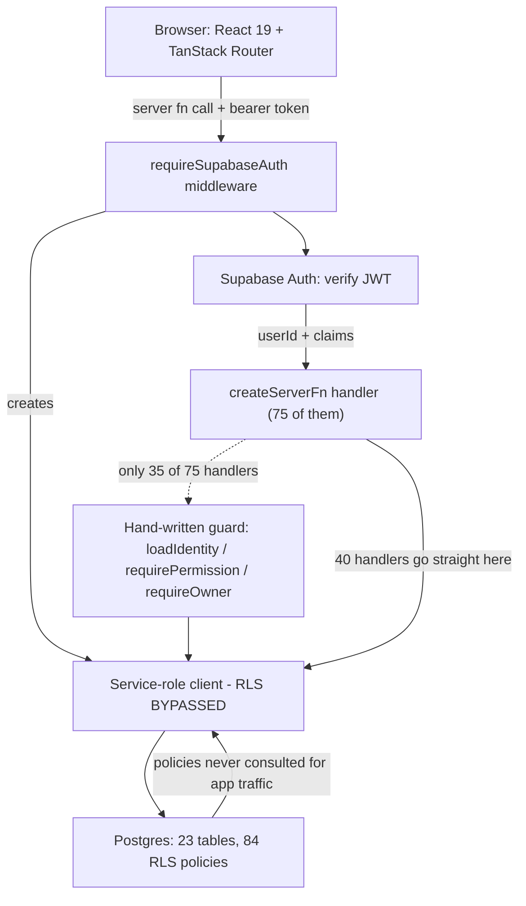

The diagram is the finding. The RLS layer exists and is well populated, but application traffic routes around it. That design is legitimate — it is a documented workaround for the project's ES256 access tokens being rejected by PostgREST — but it moves the entire authorization burden into application code, and that burden has only been half discharged.

The relevant comment in [auth-middleware.ts](../src/integrations/supabase/auth-middleware.ts) is explicit about the contract:

```
// server functions verify the user JWT via Auth, then query the database
// with the service-role key. RLS is not applied on that client - handlers
// must keep using context.userId.
```

"Handlers must keep using `context.userId`" is the requirement. Section 4 measures compliance with it.

One further hazard in this file: line 1 reads `// This file is automatically generated. Do not edit it directly.` — but the ES256 workaround and the entire service-role client construction **are** hand edits to it. Whatever generator owns this file would overwrite the security-critical portion of the request path. Either move the workaround into a file that is not generated, or remove the generated-file marker so the next person does not trust it.

---

## 4. Security and authorization

### 4.1 Authorization coverage

Measured across [clinic.functions.ts](../src/lib/clinic.functions.ts):

| Guard | Occurrences |
|---|---|
| `requireSupabaseAuth` middleware | 75 of 75 handlers |
| `await loadIdentity(...)` | 33 |
| `await requireOwner(...)` | 11 |
| `await requirePermission(...)` | 5 |
| Handlers with **no** guard beyond JWT presence | **~40** |

`loadIdentity` being called does not by itself gate anything — several handlers load identity and then never branch on it. `getDashboard` ([clinic.functions.ts:173](../src/lib/clinic.functions.ts)) is the clearest example: it loads identity, uses it to *filter* a practitioner's view, but never rejects a patient.

### 4.2 CRITICAL — Patient directory and full records readable by any authenticated user

`listPatients` applies only the auth middleware:

_src/lib/clinic.functions.ts lines 397-406_

```ts
export const listPatients = createServerFn({ method: "GET" })
  .middleware([requireSupabaseAuth])
  .handler(async ({ context }) => {
    const supabase = (context as Ctx).supabase;
    const { data, error } = await supabase
      .from("patients")
      .select("id, first_name, last_name, title, date_of_birth, status, reference, last_visit_at, allergies, avatar_url")
      .order("last_name", { ascending: true })
      .order("first_name", { ascending: true });
    if (error) throw new Error(error.message);
```

There is no `isStaff` check. The returned payload includes names, dates of birth and **allergies** — special-category health data under UK GDPR. `getPatient` ([443](../src/lib/clinic.functions.ts)) is worse: it does `select("*")` on the patient plus messages, medical history and photo URLs, with no check that the caller is staff or that the record is their own.

The UI does redirect patients away from these pages ([dashboard.tsx:84](../src/routes/_authenticated/dashboard.tsx), [patients.index.tsx:83](../src/routes/_authenticated/patients.index.tsx)) — but that is a client-side redirect, not an authorization control. The server function is directly callable.

Same pattern, same severity: `listAppointments` ([548](../src/lib/clinic.functions.ts)), `getDashboard` ([173](../src/lib/clinic.functions.ts)).

### 4.3 CRITICAL — Staff impersonation via client-supplied author

`sendMessage` takes the message author from the request body and writes it verbatim:

_src/lib/clinic.functions.ts lines 961-983_

```ts
export const sendMessage = createServerFn({ method: "POST" })
  .validator(
    (data: {
      patient_id: string;
      body: string;
      as: "staff" | "patient";
      attachments?: { path: string; name: string; type: string; size: number }[];
    }) => data,
  )
  .middleware([requireSupabaseAuth])
  .handler(async ({ data, context }) => {
    const body = data.body.trim().slice(0, 2000);
    const attachments = (data.attachments ?? []).slice(0, 5);
    if (!body && attachments.length === 0) throw new Error("Message cannot be empty");
    const { error } = await (context as Ctx).supabase.from("messages").insert({
      clinic_id: CLINIC_ID,
      patient_id: data.patient_id,
      author: data.as,
      author_id: context.userId,
```

A patient posting `as: "staff"` produces a message the UI renders as clinical advice from the clinic. `author_id` is recorded correctly from the session, so the forgery is *traceable* after the fact — but it is not *prevented*, and the patient-facing thread does not display `author_id`. There is also no check that `data.patient_id` is the caller's own record, so a patient can inject messages into another patient's thread.

The fix is to derive `author` from `loadIdentity` and ignore the client value.

### 4.4 CRITICAL — Any user can sign any consent document

_src/lib/clinic.functions.ts lines 1382-1398_

```ts
export const signDocument = createServerFn({ method: "POST" })
  .validator((data: { id: string; signed_name: string }) => data)
  .middleware([requireSupabaseAuth])
  .handler(async ({ data, context }) => {
    const name = data.signed_name.trim().slice(0, 120);
    if (!name) throw new Error("Please type your full name to sign");
    const { error } = await (context as Ctx).supabase
      .from("documents")
      .update({
        status: "signed",
        signed_at: new Date().toISOString(),
        signed_name: name,
        signature_data: name,
      })
      .eq("id", data.id);
```

The update is keyed on document ID alone. Nothing ties the document to `context.userId`. Given consent is the legal basis for performing an aesthetic procedure, a forgeable signature endpoint is the highest-consequence item in this audit even though it is the easiest to fix — add `.eq("patient_id", identity.patient.id)`.

Note also that `signature_data` is set to the same typed string as `signed_name`, so there is no distinct signature artefact at all (see section 10.2).

### 4.5 CRITICAL — Staff notifications are clinic-wide, and any user can clear them

`listStaffNotifications` omits any recipient filter:

_src/lib/clinic.functions.ts lines 1047-1052_

```ts
    const { data: rows } = await ctx.supabase
      .from("staff_notifications")
      .select("id, title, body, patient_id, appointment_id, read_at, created_at, urgent, sender_id, kind")
      .is("read_at", null)
      .order("created_at", { ascending: false })
      .limit(20);
```

`markStaffNotificationRead` ([1219](../src/lib/clinic.functions.ts)) is worse — with `all: true` it marks **every** unread notification in the clinic as read, for everyone, with no recipient predicate and no permission check. The `notifications.delete` permission key exists in `PERMISSION_KEYS` and is checked in the UI, but is never enforced server-side.

The notable detail: **the demo implementation gets this right.**

_src/lib/clinic.functions.demo.ts lines 1153-1158_

```ts
    for (const n of staffNotifications) {
      if (n.read_at || n.recipient_id !== me.userId) continue;
      if (data.id && n.id !== data.id) continue;
      n.read_at = now;
```

Demo mode is stricter than production. Anyone testing this behaviour in demo mode would conclude it works correctly.

### 4.6 CRITICAL — Unguarded clinical mutations

The following write handlers have no staff or ownership check:

| Handler | Line | Effect if called by a patient |
|---|---|---|
| `saveAppointment` | [564](../src/lib/clinic.functions.ts) | Create or edit any appointment |
| `updateAppointmentState` | [726](../src/lib/clinic.functions.ts) | Change any visit's stage |
| `addTreatment` | [829](../src/lib/clinic.functions.ts) | Write a clinical treatment record |
| `addPhoto` | [881](../src/lib/clinic.functions.ts) | Attach arbitrary storage objects to a patient |
| `sendDocument` / `resendDocument` | [908](../src/lib/clinic.functions.ts) | Issue consent documents |
| `reviewHistory` | [1293](../src/lib/clinic.functions.ts) | Mark medical history as clinically reviewed |
| `rescheduleAppointment` | [2370](../src/lib/clinic.functions.ts) | Move anyone's appointment |
| `saveAppointmentNote` | [2811](../src/lib/clinic.functions.ts) | Write clinical visit notes |

`reviewHistory` deserves emphasis: it records that a clinician has reviewed a patient's medical history. A forged review is a patient-safety issue, not merely a data-integrity one.

`addPhoto` additionally trusts a client-supplied `storage_path` with no verification that the object was uploaded by this user or belongs to this patient.

### 4.7 HIGH — `deleteMyDocument` deletes anyone's document

_src/lib/clinic.functions.ts lines 2107-2109_

```ts
    if (!identity.isStaff) throw new Error("Staff access only");
    const { error } = await ctx.supabase.from("staff_documents").delete().eq("id", data.id);
```

The staff gate is present but the ownership predicate is not. Any staff member can delete any other staff member's documents. The handler name says "my"; the query says "any".

### 4.8 HIGH — No runtime input validation anywhere

All 53 `.validator(...)` calls are TypeScript identity functions that assert a shape without checking it:

_src/lib/clinic.functions.ts line 444_

```ts
  .validator((data: { id: string }) => data)
```

TypeScript types are erased at runtime, so these validate nothing. **`zod@3.24.2` is already a dependency** and **zero files import it**. Manual validation exists in four isolated places (an email regex at 1544, a hex colour check at 2444, a password length check at 1604, and `sanitizeNoteHtml` for user notes at 2761), which shows the need was recognised but not generalised.

Note that `saveAppointmentNote` ([2811](../src/lib/clinic.functions.ts)) stores clinical note HTML via a bare `String(...).slice(0, 20000)` **without** the sanitiser that `saveMyNote` uses — a stored-XSS path into a clinical record.

### 4.9 HIGH — Error swallowing masks failure as absence

`requireOwner` cannot distinguish "not an owner" from "the query failed":

_src/lib/clinic.functions.ts lines 1404-1411_

```ts
async function requireOwner(context: Ctx) {
  const { data } = await context.supabase.from("user_roles")...
  if (!data) throw new Error("Manager access required");
}
```

This fails closed, so it is not exploitable — but it produces a misleading error, and it is the same bug class that was already fixed in `loadIdentity` (which now throws loudly on query error). The fix was applied in one place and not the other.

`reviewProfileChange` ([2010](../src/lib/clinic.functions.ts)) is the dangerous inverse: it never destructures `error` from the status update, so a failed write still returns `{ ok: true }` — a profile change can be applied while its request row stays `pending`.

`audit()` ([124](../src/lib/clinic.functions.ts)) discards its error across roughly 40 call sites. A compliance trail that fails silently is worse than one that is absent, because it looks present.

### 4.10 MEDIUM — Blanket table grants to `anon`

Live introspection found that **`anon` and `authenticated` each hold SELECT, INSERT, UPDATE, DELETE, TRUNCATE, REFERENCES and TRIGGER on all 23 public tables**, including `patients`, `treatments`, `documents` and `medical_history_versions`. This comes from the sweeping grant loops in [20260815195805](../supabase/migrations/20260815195805_d2f74df0-e0e2-4843-9d3b-aa2a8a2dad39.sql) and [20260815200314](../supabase/migrations/20260815200314_aa0c8c70-7ecc-4326-8d20-2fef895f2e59.sql):

```sql
FOR t IN SELECT tablename FROM pg_tables WHERE schemaname = 'public' LOOP
  EXECUTE format('GRANT SELECT, INSERT, UPDATE, DELETE ON public.%I TO authenticated', t.tablename);
```

I probed the real reachability with the public anon key rather than assuming the worst:

| Table | `GET /rest/v1/<table>` with anon key |
|---|---|
| `patients` | HTTP 200, `[]` |
| `treatments` | HTTP 200, `[]` |
| `documents` | HTTP 200, `[]` |
| `messages` | HTTP 200, `[]` |
| `audit_log` | HTTP 200, `[]` |
| `user_roles` | HTTP 200, `[]` |
| `profiles` | HTTP 200, `[]` |

**RLS is holding.** No data leaks through the anon key today, which is why this is Medium and not Critical. The residual risk is real but narrower than the grants suggest: `TRUNCATE` is **not subject to RLS** in Postgres, and it is granted to `anon` on all 23 tables. PostgREST exposes no TRUNCATE verb, so there is no route to it via the public API as configured — but it is a loaded weapon sitting behind a door that happens to be locked. Revoke it.

### 4.11 MEDIUM — First-user owner bootstrap has a race

_src/lib/clinic.functions.ts lines 149-161_

```ts
    if (identity.roles.length === 0 && !identity.patient) {
      ...
      if (!count) {
        await supabaseAdmin.from("user_roles").insert({ user_id: context.userId, role: "owner" });
```

The first authenticated user with no roles becomes clinic owner. The check-then-insert is not atomic, so two simultaneous first signups could both become owners. More importantly, `/auth` allows **open self-signup** ([auth.tsx:106](../src/routes/auth.tsx)), so this path is publicly reachable on a fresh deployment — whoever signs up first owns the clinic.

---

## 5. Database and data integrity

All findings in this section were confirmed against the live database.

### 5.1 HIGH — 84 policies, zero clinic isolation

```
policies_with_clinic_predicate: 0
total_policies:                84
```

Every staff policy is of the form `USING (is_staff(auth.uid()))` with no `clinic_id` predicate. Meanwhile `clinic_id` is **nullable on 15 of the 16 tables that have it** (only `staff_notifications` is `NOT NULL`).

So the schema is shaped for multi-tenancy, the application hardcodes a single tenant (`CLINIC_ID` at [clinic.functions.ts:11](../src/lib/clinic.functions.ts)), and the database enforces neither. Several read paths — `listPatients`, `getPatient` — omit `clinic_id` from the query entirely.

This is safe today because there is exactly one clinic. It becomes a cross-tenant data breach on the day a second clinic is added. Pick a direction now, while the cost is a migration rather than an incident.

### 5.2 HIGH — Deleting a patient destroys their medical record

Live FK inspection confirms `ON DELETE CASCADE` from `patients` to every clinical child table: `treatments`, `documents`, `treatment_photos`, `messages`, `medical_history_versions`, `appointments`, `recall_tasks`, `retention_outreach`.

Owners are permitted to delete patients (`"owners delete patients"`). One click therefore erases the treatment history, signed consents, clinical photographs and history versions for that patient, irreversibly and with no legal-hold mechanism.

A `patient_status` enum including `archived` already exists and the UI uses it, so a soft-delete path is *available* — it is simply not the one wired to deletion. Section 10.1 covers the retention-versus-erasure tension this creates.

### 5.3 HIGH — Signed consents remain editable

`"staff edit documents"` grants unrestricted UPDATE on `documents`. No trigger or CHECK constraint prevents modifying `body`, `signature_data`, `signed_at` or `status` after signing. The patient-side UPDATE policy is likewise column-unrestricted.

For a document whose purpose is to evidence informed consent at a point in time, post-hoc mutability undermines the entire artefact. An immutability trigger rejecting updates to signed rows is a small, high-value change.

### 5.4 MEDIUM — Migration ledger has drifted from the live schema

The live ledger contains **33** applied migrations; the repository contains **35** files. The two absent from the ledger are `20260819022500_treatment_catalogue_duration.sql` and `20260821001500_practitioner_no_overlap.sql`.

Both were nevertheless applied — I confirmed `treatment_catalogue.duration_minutes` exists and that the exclusion constraint is live:

```
appointments_no_practitioner_overlap | x |
  EXCLUDE USING gist (practitioner_id WITH =, tstzrange(starts_at, ends_at, '[)') WITH &&)
  WHERE (practitioner_id IS NOT NULL AND status IS DISTINCT FROM 'cancelled')
```

So the schema is correct but the ledger is not, most likely because [scripts/apply-migrations.mjs](../scripts/apply-migrations.mjs) applies SQL directly without recording versions in `supabase_migrations.schema_migrations`. The consequence: a future `supabase db push` will try to re-apply both files. `practitioner_no_overlap` guards itself with `DROP CONSTRAINT IF EXISTS` and will survive; a re-run of the wider set will not be uniformly safe (see 5.6).

Compounding this, the baseline migration `20260811000643_*.sql` was **rewritten in place** in commit `272b6a2` (+83/−37). Already-applied environments keep the old definitions; fresh environments get the new ones. One functional divergence is visible: `documents.access_token` moved from `gen_random_bytes(24)` to `extensions.gen_random_bytes(24)`. Editing an applied migration is also specifically hazardous here because the branch syncs to Lovable.

### 5.5 MEDIUM — `patients.user_id` is not unique, making patient identity ambiguous

Live constraint check on `patients` returns only `patients_pkey`. There is an index on `user_id` but no UNIQUE constraint, while `current_patient_id()` resolves the portal user's record with:

```sql
SELECT id FROM public.patients WHERE user_id = auth.uid() LIMIT 1;
```

`LIMIT 1` with no ordering over a non-unique column is non-deterministic. If two patient rows ever share a `user_id` — plausible, since `handle_new_user()` links by email with no clinic scope — the portal may show a different patient's record between requests. Add the UNIQUE constraint.

### 5.6 MEDIUM — Migrations are largely not re-runnable

Idempotent: the rewritten baseline, `practitioner_no_overlap`, and several `ADD COLUMN IF NOT EXISTS` migrations.

Not idempotent, and will fail on re-run:

- Bare `CREATE TYPE` in `20260811001826`, `20260811141801`, `20260812033941`, `20260811013205`
- `CREATE TABLE` without `IF NOT EXISTS` for `appointment_notes`, `recall_tasks`, `staff_notifications`, `role_permissions`
- Most `CREATE POLICY` without a preceding `DROP POLICY IF EXISTS`
- The `role_permissions` seed in `20260812212456` conflicts with its own `UNIQUE (role, permission)`

There is also an ordering hazard: `00643` creates broad `FOR ALL` staff policies which `02717` then splits into granular per-command policies. Re-running `00643` alone would silently restore the broad policies.

### 5.7 MEDIUM — Four tables have RLS enabled but no UPDATE policy

Live query result: `audit_log`, `messages`, `retention_outreach`, `staff_documents`.

For `audit_log` and `retention_outreach` this is deliberate and correct — they should be append-only. For `messages` it is an oversight: `markMessagesRead` ([1283](../src/lib/clinic.functions.ts)) performs an UPDATE that no policy permits.

**This does not currently break the app**, because the service-role client bypasses RLS. It is a latent failure that would surface the moment any read-receipt write moved to a client-side query — and it means the RLS layer cannot serve as a defence-in-depth backstop for this table.

### 5.8 MEDIUM — Missing indexes on real query patterns

Live index inventory shows 46 indexes, concentrated on `appointments` (4), `treatments` (3), `recall_tasks` (3) and `patients` (3). Cross-referencing against actual filters in [clinic.functions.ts](../src/lib/clinic.functions.ts):

| Query shape | Where | Suggested index |
|---|---|---|
| `.gte("performed_at", ...)` range scans | 214, 236, 271, 1716, 2159 | `treatments(performed_at)` |
| `.eq("author","patient").is("read_at", null)` | 239, 1020 | `messages(author, read_at, created_at DESC)` |
| `.order("last_name").order("first_name")` | 404, 1628 | `patients(last_name, first_name)` |
| `.in("status",["sent","viewed"]).order("sent_at")` | 216 | `documents(status, sent_at)` |
| `.eq("source","patient").order("created_at")` | 222 | `medical_history_versions(source, created_at DESC)` |
| `.eq("role", ...)` role lookups | 536, 1090, 1133 | `user_roles(role)` |
| Overlap pre-check on clinic + practitioner + time | 29–33 | `appointments(clinic_id, practitioner_id, starts_at)` |
| `.eq("patient_id").in("status",["booked"]).gte("starts_at")` | 415 | `appointments(patient_id, status, starts_at)` |
| `.gte("created_at", ...)` on patients | 237, 1724 | `patients(created_at)` |

At 3 patients none of this matters. At 635 patients — the volume the demo fixture models — the dashboard's unbounded scans become the slowest path in the app.

### 5.9 MEDIUM — Unbounded reads

`select("*")` appears 18 times, and several reads have no limit at all: `listPatients` (all patients), `getRetention` (all appointments, no date filter), `listAppointments` (uncapped range), and `getPatient`'s message and history joins. `documents.access_token` — a magic-link secret — is included in `select("*")` payloads at [1321](../src/lib/clinic.functions.ts).

Dashboard and notification reads *are* properly capped (`.limit(10)`–`.limit(25)`), so the pattern is understood; it just has not been applied consistently.

### 5.10 LOW — Missing foreign keys and weak column constraints

No FK on `profiles.id` to `auth.users`, `user_roles.user_id`, `profile_change_requests.user_id`, `audit_log.actor_id`, `staff_notifications.clinic_id` (despite `NOT NULL`), `recall_tasks.assigned_to`, or `treatments.consent_document_id` — the last being inconsistent, since `appointments.consent_document_id` does have one.

`treatments.status` is free text rather than an enum, and there is no CHECK that `appointments.ends_at > starts_at` (the GiST exclusion constraint prevents overlap but not an inverted range).

### 5.11 Positive findings

Worth recording, because they are load-bearing and should not be regressed:

- **All 23 tables have RLS enabled.** No table was left unprotected.
- **Practitioner double-booking is prevented at the database level** by a GiST exclusion constraint, and mirrored by an application pre-check — defence in depth done properly.
- **All five SECURITY DEFINER functions set `search_path = public`**, closing the classic Supabase privilege-escalation vector.
- **`commission_rate` has a column-level REVOKE** from `authenticated`.
- **`appointment_notes.appointment_id` is UNIQUE**, correctly enforcing one note per visit.
- Storage buckets exist for `patient-photos`, `message-attachments` and `staff-files`, and message attachments are path-scoped by `current_patient_id()`.

---

## 6. Backend code quality and SOLID

### 6.1 HIGH — Single Responsibility: `clinic.functions.ts` is a god-module

2,856 lines, 75 exported handlers, one file. At least eight distinct responsibilities are interleaved:

| Responsibility | Where |
|---|---|
| Identity resolution | `loadIdentity` (52–112) |
| Authorization | `requirePermission` (115), `requireOwner` (1404), scattered inline checks |
| Data access | Inline Supabase queries in all 75 handlers |
| Business logic | Dashboard KPI assembly (173–395), overlap detection (16–38) |
| Audit logging | `audit` (124–142) plus ~40 call sites |
| Auth admin API | `createStaffAccount`, `inviteStaffMember` (1450–1578) |
| Response shaping | `listPatients` enrichment (423–440) |
| Domain maths | Partially extracted to `retention.server.ts` / `earnings.server.ts` |

The extraction of `retention.server.ts` and `earnings.server.ts` shows the right instinct — those two are clean, pure, typed and free of Supabase coupling. They are the model for what the other six responsibilities should look like.

The practical cost is not aesthetic. `loadIdentity` issues four queries on **every** guarded call with no caching, so a page firing eight server functions can execute 32 redundant identity queries.

### 6.2 HIGH — Dependency Inversion: handlers are welded to Supabase

_src/lib/clinic.functions.ts line 13_

```ts
type Ctx = { supabase: any; userId: string; claims: Record<string, unknown> };
```

`supabase: any` discards the generated `Database` types from [types.ts](../src/integrations/supabase/types.ts) at the exact boundary where they would be most valuable, and there is no interface to substitute. There is no repository or service layer, so a unit test for any handler requires either a live Supabase or extensive mocking. That is very likely why there are **no tests in the repository at all** — the architecture makes them expensive to write.

### 6.3 HIGH — Open/Closed: role and audience logic requires editing handlers

Adding a role means editing handler bodies rather than extending a policy table:

_src/lib/clinic.functions.ts lines 1127-1132_

```ts
      const wanted =
        data.audience === "managers" ? ["owner"]
          : data.audience === "front_desk" ? ["front_desk"]
          : ["owner", "front_desk", "practitioner"];
```

`PERMISSION_KEYS` is declared twice — [clinic.functions.ts:41–49](../src/lib/clinic.functions.ts) and [permissions.ts:1–9](../src/lib/permissions.ts). `permissions.ts` exports a clean `can()` helper that the **server layer never imports**, so client and server evaluate permissions through two separate code paths that can drift.

### 6.4 MEDIUM — The demo twin duplicates ~80% of the logic, and has already diverged

[clinic.functions.demo.ts](../src/lib/clinic.functions.demo.ts) is 2,340 lines mirroring all 75 handler names, swapped in by a Vite alias at build time. Most behaviour changes therefore require editing two 2,000-line files in parallel. They have not stayed in step:

| Behaviour | Live | Demo | Consequence |
|---|---|---|---|
| Notification listing | Clinic-wide (1047) | Filtered by `recipient_id` (1142) | Demo hides a production security bug |
| Mark notification read | No recipient filter (1219) | Recipient filter (1155) | Same |
| `savePatient` update | Non-owners blocked from identity fields (802) | Full `Object.assign` (508) | Demo misses the owner-only restriction |
| Authentication | `requireSupabaseAuth` on all | **No auth middleware at all** | Demo never exercises auth paths |

The direction of divergence is the worrying part: **demo is stricter than production on security**. Testing in demo mode produces false confidence precisely where confidence matters most.

### 6.5 MEDIUM — N+1 queries and avoidable sequencing

Signed photo URLs are generated in a serial loop:

_src/lib/clinic.functions.ts lines 491-497_

```ts
    for (const photo of photos.data ?? []) {
      const { data: url } = await supabase.storage
        .from("patient-photos")
        .createSignedUrl(photo.storage_path, 3600);
```

Same shape in `getMyRecord` (1332). Both should batch with `Promise.all`. `getDashboard` also issues a sequential `yearTreatments` query at 270 that could join the existing `Promise.all` at 205.

### 6.6 MEDIUM — Type safety at the boundary

30 `any` annotations in the live module, plus `as never` casts used to defeat the earnings types at 1746, 1797 and 1857. Casting to `never` to silence a type error is a signal that the type is wrong, and it disables exactly the checking that would catch a shape mismatch.

---

## 7. Frontend architecture and SOLID

### 7.1 HIGH — God-components

| File | Lines | Tangled concerns |
|---|---|---|
| [schedule.tsx](../src/routes/_authenticated/schedule.tsx) | 2,205 | ~20 local components: stage model, date helpers, booking dialog, payment/consent chips, day planner with drag-drop, week view, month view |
| [today-snapshot.tsx](../src/components/dashboard/today-snapshot.tsx) | 934 | Carousel, appointment card, stage picker, near-copies of two chips from `schedule.tsx` |
| [patients.$id.tsx](../src/routes/_authenticated/patients.$id.tsx) | 905 | 6 mutations, realtime subscription, chat resize, 4 tabs, photo comparison slider |
| [team.index.tsx](../src/routes/_authenticated/team.index.tsx) | 617 | Team CRUD, change requests, 3 inline dialogs, plus the whole treatment-catalogue settings panel |
| [app-shell.tsx](../src/components/app-shell.tsx) | 607 | RBAC nav construction, 3 polling queries, sidebar drag, global search, keyboard shortcuts |
| [quick-add-appointment.tsx](../src/components/quick-add-appointment.tsx) | 528 | Custom combobox, draggable panel, third copy of the booking form |

`schedule.tsx` mixes domain and presentation in a single declaration — `Stage`, `stageOf()` and the colour token map all live together at lines 102–138, and are then duplicated verbatim in `today-snapshot.tsx:47–70`.

### 7.2 HIGH — Booking logic exists in three places

The "create an appointment" flow is implemented three times: the inline dialog in `schedule.tsx` (457–720), `quick-add-appointment.tsx`, and the day-planner quick-add. Each carries its own copy of the cache-invalidation block:

_src/components/quick-add-appointment.tsx lines 245-250_

```ts
      queryClient.invalidateQueries({ queryKey: ["appointments"] });
      queryClient.invalidateQueries({ queryKey: ["staff-notifications"] });
      queryClient.invalidateQueries({ queryKey: ["dashboard"] });
      queryClient.invalidateQueries({ queryKey: ["dashboard-week"] });
      queryClient.invalidateQueries({ queryKey: ["sidebar-diary-count"] });
      queryClient.invalidateQueries({ queryKey: ["messages"] });
```

Six keys, repeated across three call sites. Adding a seventh cache means finding all three — and any one that is missed produces a stale-UI bug that is hard to reproduce.

### 7.3 HIGH — Zero query error handling outside the identity gate

**16 components call `useIdentity()`**, and exactly **one file in `src/routes` references `isError`** — the identity gate added in `_authenticated/route.tsx`. Every data query in every route handles only the success and undefined cases, and **13 routes** render an indefinite `Loading…` for any failure:

_src/routes/_authenticated/patients.$id.tsx lines 259-261_

```ts
  if (!identity) return <div className="p-12 text-sm text-muted-foreground">Loading…</div>;
  if (!identity.isStaff) return <div className="p-12 text-sm text-muted-foreground">Staff access only.</div>;
  if (!data) return <div className="p-12 text-sm text-muted-foreground">Loading record…</div>;
```

A 404 or 500 from `getPatient` shows "Loading record…" forever, with no error text and no retry. Only 3 route files declare an `errorComponent`.

### 7.4 MEDIUM — `useIdentity` opens a realtime channel per call site

_src/lib/use-identity.ts lines 16-35_

```ts
  useEffect(() => {
    if (!sessionReady || DEMO_MODE) return;
    const channelName = `identity-access-${crypto.randomUUID()}`;
    const channel = supabase
      .channel(channelName)
      ...
```

The `["me"]` query is deduplicated by TanStack Query, but the **subscription is not** — each mount opens its own channel. On a dashboard load, the identity gate, the route, `NotificationBell` and `FollowUpTasks` all mount the hook, so four channels open for one piece of state. The fix is a single `IdentityProvider` at the layout, with `useIdentity()` becoming a context read — which also removes the 13 duplicated loading gates, since identity would be guaranteed below the gate.

### 7.5 MEDIUM — Duplication inventory

| Pattern | Copies | Notes |
|---|---|---|
| `ConsentChip` | 2 full implementations (~80 lines each) | `schedule.tsx:1046`, `today-snapshot.tsx:668` |
| `PaymentChip` | 2 full implementations (~180 lines each) | `schedule.tsx:859`, `today-snapshot.tsx:746` |
| `Stage` type + `stageOf` | 2 | Plus a third variant server-side at `clinic.functions.ts:306` |
| Identity loading gate | 13 | Identical JSX |
| `ROLES` constant | 5 files | `team.index`, `team.$id`, `invite-staff-dialog`, `access-control-settings`, `demo/role-switcher` |
| Section heading classes | 23 occurrences across 15 files | `text-[17px] font-semibold tracking-[-0.016em]` |
| Deposit ratio `0.3` | 4 | Despite `payment-link.ts:66` centralising it |
| Empty-state markup | 10+ inline | No shared `EmptyState` |

### 7.6 MEDIUM — Types are regenerated but not used

[types.ts](../src/integrations/supabase/types.ts) contains exactly the discriminated unions the UI needs:

_src/integrations/supabase/types.ts lines 1232-1240_

```ts
      appointment_status: "booked" | "attended" | "cancelled" | "no_show"
      recall_task_status: "sent" | "contacted" | "completed"
```

No component imports them. Instead there are **136 `any` annotations across `.tsx` files**, and status strings are re-declared locally in each consumer. `kpi-grid.tsx:59` types its entire data contract as `kpis: any`.

### 7.7 MEDIUM — Performance

No virtualisation anywhere (0 matches for `virtual` or `react-window`). `patients.index.tsx` renders every row and **recomputes its filter and sort on every render** without `useMemo` (88–130). `DayPlanner` runs a 60-second `setTick` that re-renders the entire 565-line planner and all its cards; there is no `React.memo` on any application component.

The polling stack on an idle staff session:

| Query | Interval |
|---|---|
| `["me"]` | 30s |
| `["staff-notifications"]` | 60s, from two separate call sites |
| `["unread-messages"]` | 60s |
| `["sidebar-diary-count"]` | 60s |
| `["dashboard"]` (arrival alerts) | 60s |

Roughly six requests per minute per open tab, before any realtime channels.

### 7.8 LOW — Dead code and design-token drift

**29 of 46** shadcn primitives are imported nowhere in application code (17 are used). Notably `command.tsx` is unused while `quick-add-appointment.tsx` hand-rolls a ~140-line combobox, and `breadcrumb.tsx` is unused while no page has breadcrumbs.

Token drift: the same raw colour is hardcoded in five files rather than tokenised.

_src/components/app-shell.tsx lines 74-75_

```ts
          ? "bg-[linear-gradient(96deg,var(--accent-soft),transparent_96%)] ..."
          : "text-ink-2 hover:bg-[rgba(47,63,102,0.08)] hover:text-foreground active:bg-[rgba(47,63,102,0.12)]",
```

`rgba(47,63,102,...)` recurs in `app-shell.tsx`, `button.tsx`, `attention-list.tsx` and `rich-notes-editor.tsx`. It is `--foreground` at low alpha and should be a token.

### 7.9 LOW — Tiptap misconfiguration

Every dashboard load logs `[tiptap warn]: Duplicate extension names found: ['link', 'underline']`. In Tiptap v3, `StarterKit` already bundles both, so [rich-notes-editor.tsx](../src/components/notes/rich-notes-editor.tsx) registers them twice. Harmless today, but it is the only recurring console warning in the app.

---

## 8. UI/UX and user flows

### 8.1 Entry and navigation

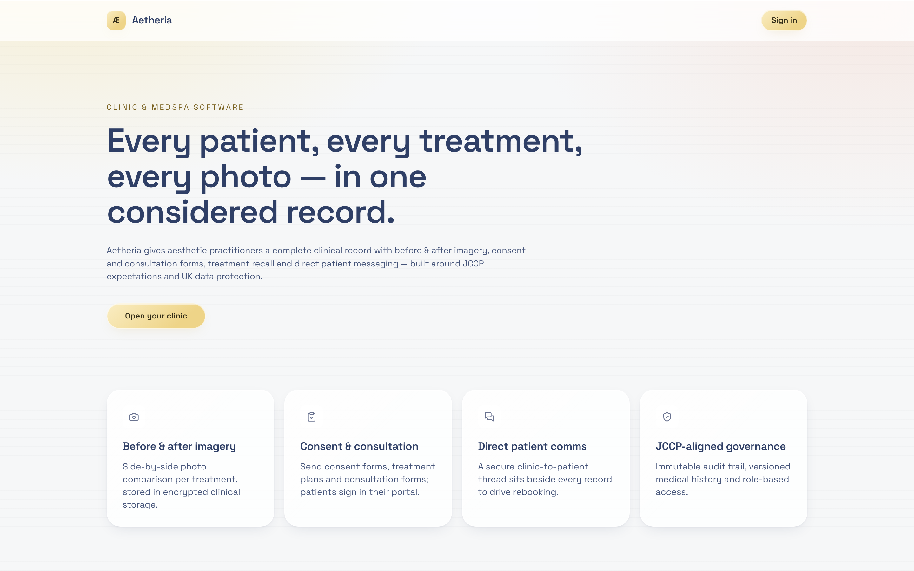

The landing page links only to `/auth`. A patient arriving at the marketing site has **no route to the patient portal** — `/portal` is only discoverable from a secondary link on the staff sign-in page.

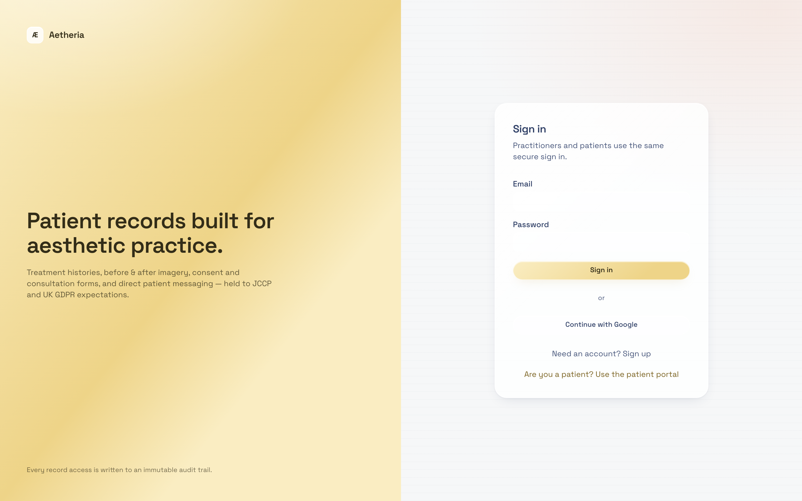

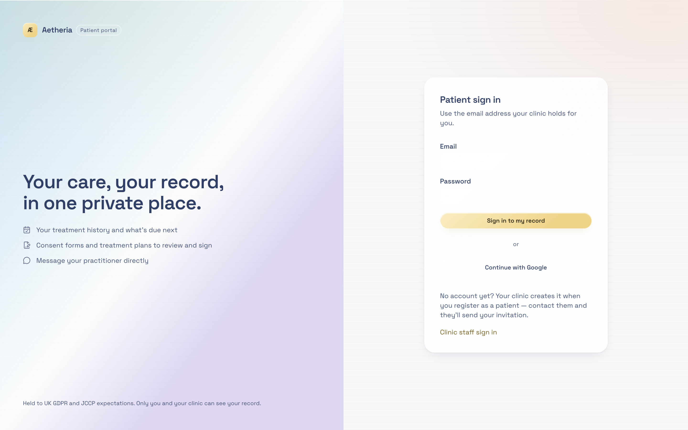

### 8.2 CRITICAL — There is no password reset

No "Forgot password?" link, no `resetPasswordForEmail` call, and no recovery route exists anywhere in `src/`. Both staff and patients can only sign in with a known password. A locked-out user has no self-service path and no in-app guidance.

For a clinical system where a receptionist locked out at 9am cannot check in patients, this is an operational stoppage, not just an inconvenience. It is also the single most commonly used flow in any authenticated product, and its absence will be discovered on day one.

### 8.3 CRITICAL — Self-signup produces a dead-end account

`/auth` allows open signup ([auth.tsx:106](../src/routes/auth.tsx)). Because `getMe` only bootstraps an owner when the clinic has **zero** staff, anyone signing up afterwards receives `roles.length === 0`, no patient link, and `isStaff === false` — so `loadIdentity` classifies them as a patient.

They are then routed to `/my-record` and shown "No record linked yet" with no explanation, no contact route, and no pending-approval state. The account is unusable and the user has no way to understand why. Either close public signup to invite-only, or add an explicit "awaiting clinic approval" state.

### 8.4 CRITICAL — Mobile is unusable, and content is clipped rather than scrollable

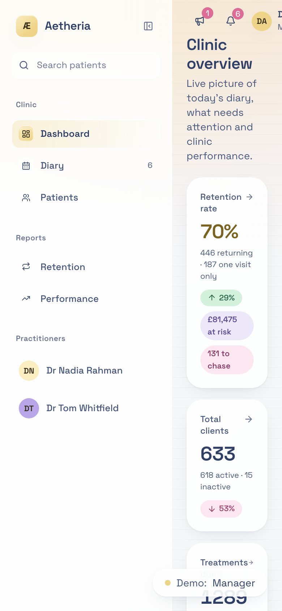

At 390x844 the sidebar occupies roughly **285px of 390px** — 73% of the viewport — leaving about 105px for content. "Clinic overview" wraps onto two lines, KPI values wrap mid-label, and the account name at top right is cut off mid-character.

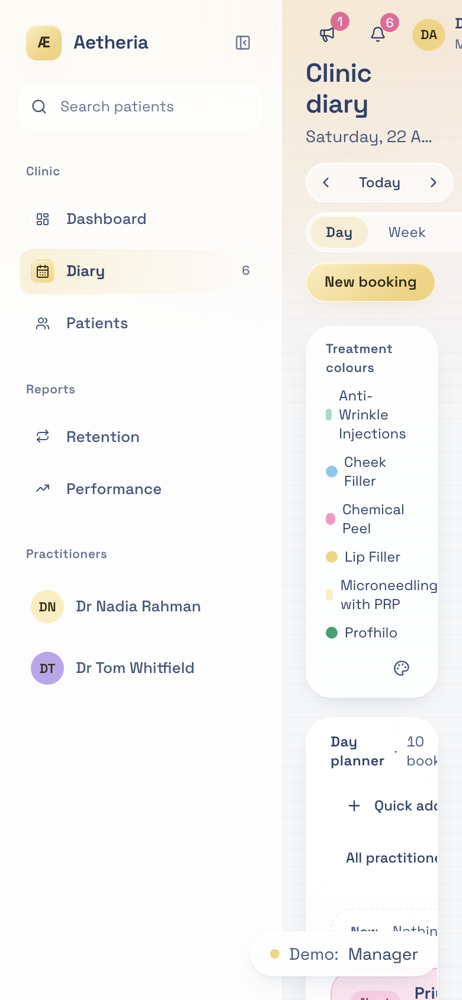

The diary is worse: "Quick add" and "All practitioners" are truncated, and the treatment legend wraps to one word per line.

The important technical detail: **my overflow probe reported no horizontal overflow on any page**, because the layout *clips* rather than scrolls (`scrollWidth === innerWidth` at 390px). So the content is not merely awkward to reach — it is unreachable. There is no pan, no scroll, and no drawer.

The project already contains the solution it is not using. [src/components/ui/sidebar.tsx](../src/components/ui/sidebar.tsx) implements a mobile `Sheet` drawer at lines 189–210, and [use-mobile.tsx](../src/hooks/use-mobile.tsx) defines a 768px breakpoint. Neither is imported by `app-shell.tsx`, which renders a fixed-width `<aside>` with no responsive branch.

### 8.5 HIGH — `/retention` shows fabricated zeros instead of an access denial

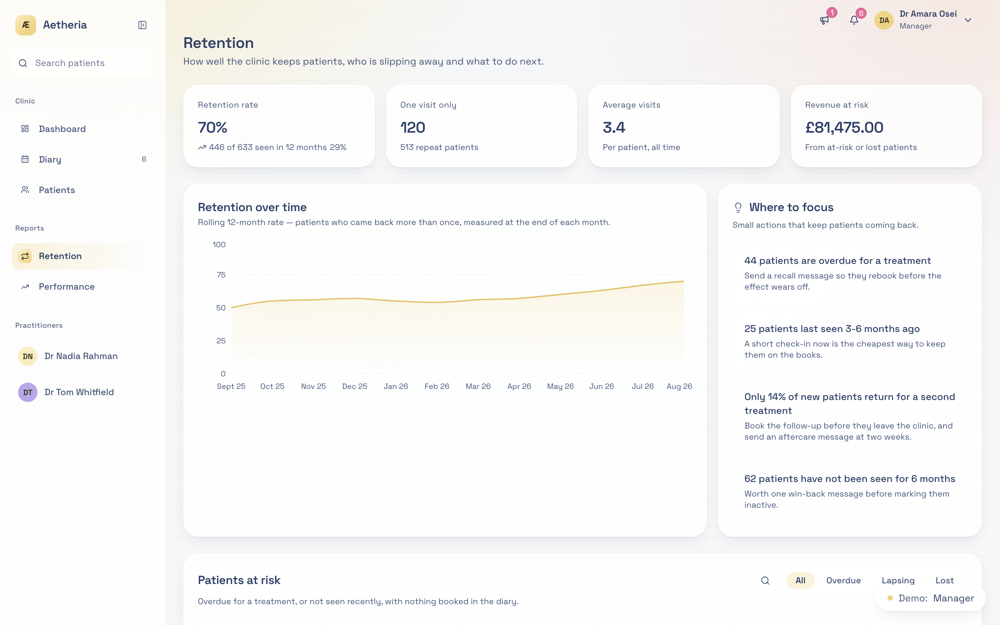

The server enforces the `reports.retention` permission ([clinic.functions.ts:2147](../src/lib/clinic.functions.ts)) by throwing. The client enables the query for any staff member and never inspects `isError`, so a user without the permission sees a fully rendered dashboard of **0% retention, £0 at risk, 0 patients**.

That is worse than an error, because it is indistinguishable from a real empty clinic — a manager could reasonably conclude the clinic has no retention rather than that they lack access. [performance.tsx:61](../src/routes/_authenticated/performance.tsx) already implements the correct pattern with a redirect; retention should mirror it.

### 8.6 Per-role journeys

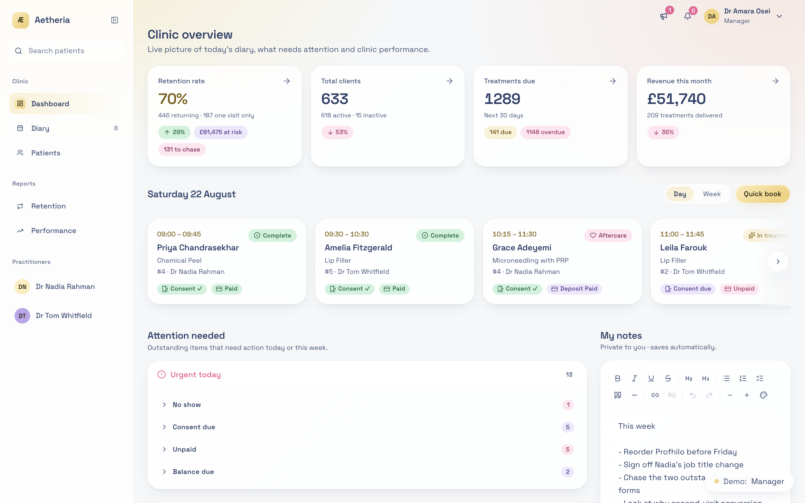

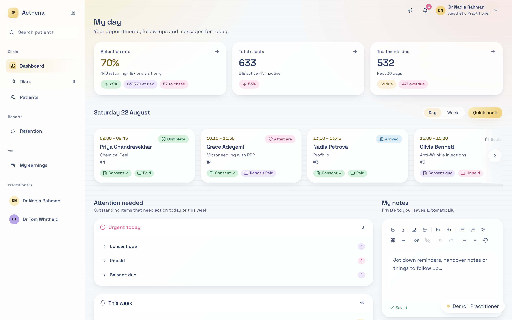

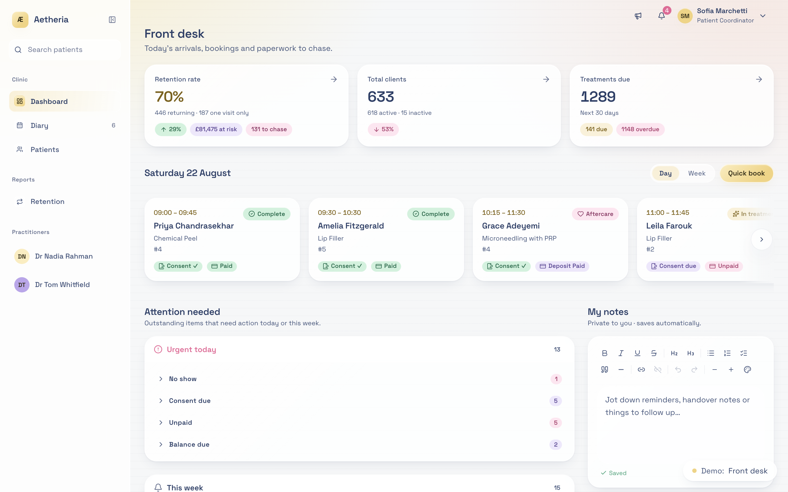

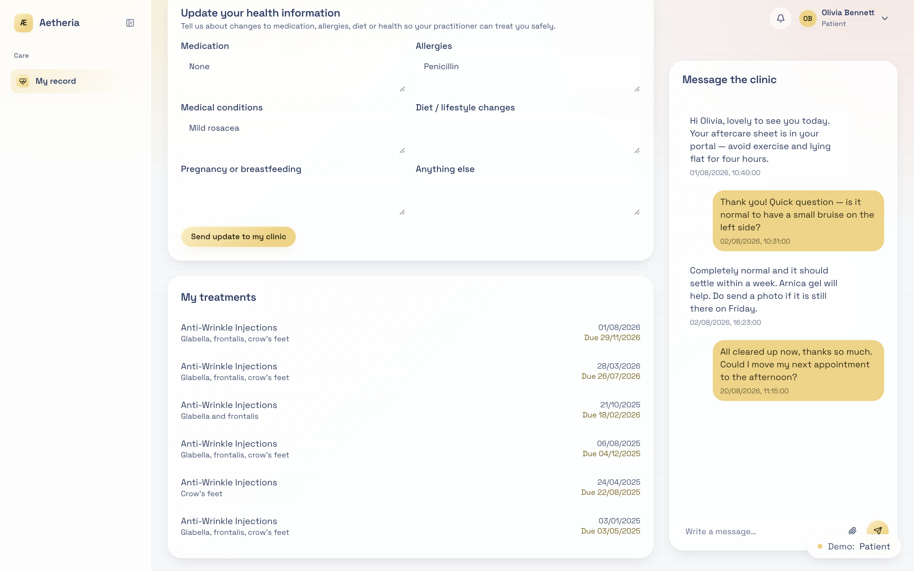

| Role | Sidebar | Gaps found |
|---|---|---|
| Owner | Dashboard, Diary, Patients, Retention, Performance, practitioner list | Settings and Team are **only** in the account dropdown, not the sidebar — the two most owner-specific destinations are the least discoverable |
| Practitioner | As above plus My earnings | `/earnings` is hidden for manager-practitioners because the nav condition is `!identity.isManager` |
| Front desk | Dashboard, Diary, Patients | Can open `/earnings` by URL; the page renders with all zeros rather than denying access |
| Patient | My record only | Some staff routes render a bare "Staff access only." with no shell or navigation, leaving no way back |

Orphan routes reachable by URL but absent from the sidebar: `/profile`, `/settings`, `/team`, `/team/$id`, `/earnings`.

There are **no breadcrumbs** anywhere; `breadcrumb.tsx` sits unused. Detail pages rely on a single back link.

A cosmetic but confusing detail: when a user lacks `team.view`, practitioner entries in the sidebar still render — as non-interactive `<span>` elements ([app-shell.tsx:320](../src/components/app-shell.tsx)). They look like navigation, do nothing when clicked, and explain nothing.

### 8.7 HIGH — Wrong permission copy on the team detail page

[team.$id.tsx:79](../src/routes/_authenticated/team.$id.tsx) tells the user "Manager access only", but the actual gate is the `team.view` permission, which managers can grant to any role. A front-desk user who has been granted `team.view` and still sees this message is being told something untrue.

### 8.8 MEDIUM — Forms and data entry

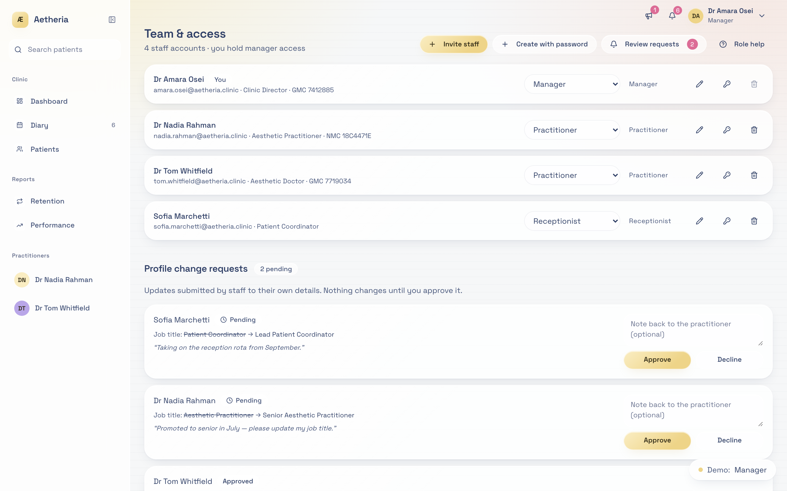

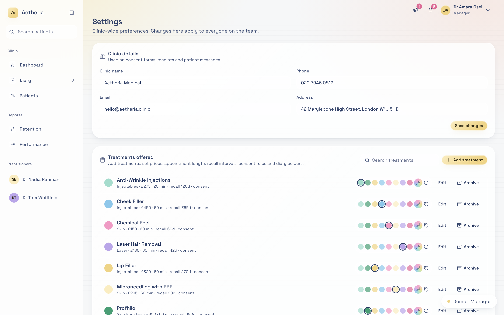

- **No unsaved-changes protection anywhere.** No `beforeunload` handler exists; navigating away from a half-written clinical note loses it silently.
- **Revoking a staff member is a single click with no confirmation** ([team.index.tsx:340](../src/routes/_authenticated/team.index.tsx)), while far less destructive actions do confirm.
- **Validation is HTML5-only** on patient creation, with server errors surfaced as toasts rather than inline field errors.
- **The Record Treatment submit button is not disabled during mutation** ([patients.$id.tsx:357](../src/routes/_authenticated/patients.$id.tsx)), so a double-click can double-post a treatment.
- Managers can edit profile fields but there is **no Save button** in the manager branch ([profile.tsx:151](../src/routes/_authenticated/profile.tsx)).

### 8.9 MEDIUM — Clinical flows

Strong: appointment overlap prevention is genuinely end-to-end (application pre-check plus a database exclusion constraint), and the no-show follow-up dialog is a well-considered multi-step flow.

Weak: the before/after photo flow has no picker on the primary path — the top "Upload" button always saves as `before` and the drop zone always saves as `after` ([patients.$id.tsx:613](../src/routes/_authenticated/patients.$id.tsx), 693). Mislabelling a clinical photograph is easy and there is no way to correct it in the UI.

Also, `patient-photos` has **no storage policy permitting patients to read their own photos** (confirmed live in section 5) — so before/after images can never be shown in the portal as currently configured.

---

## 9. Accessibility

Probed in-page across all 18 captures.

### 9.1 What is already good

Genuinely better than typical, and worth stating plainly because two commonly-assumed problems are absent here:

- **All icon-only buttons are labelled.** 0 unlabelled out of up to 65 per page. `aria-label` coverage is consistent.
- **All tables sit in scrollable containers.** No table lacks a scrollable ancestor.
- **Exactly one `<h1>` per page** across all 18 captures.
- Radix provides focus trapping in dialogs; status chips carry text labels rather than relying on colour alone; `RiskBadge` is properly typed with text.

### 9.2 HIGH — No skip link on any page

0 of 18 pages have a skip-to-content link. With a sidebar containing up to 12 navigation items plus a search field, a keyboard or screen-reader user must traverse the entire nav on every page load.

### 9.3 MEDIUM — Unlabelled form controls

| Page | Unlabelled inputs |
|---|---|
| Team | 7 of 17 |
| Patient record (portal) | 3 of 9 |
| Settings | 1 of 15 |

The portal figure matters most: the consent signature field is a placeholder-only input with no `<label>` ([my-record.tsx:142](../src/routes/_authenticated/my-record.tsx)). A screen-reader user is asked to type their name into an unlabelled box to give medical consent.

### 9.4 MEDIUM — Only one live region, and it is not the alerts

Exactly one `aria-live` element exists per page: Sonner's toast container (`<section aria-live="polite">`). So toasts are announced, but **arrival alerts are not** — the alert panel is `role="region"` with no `aria-live` ([arrival-alerts.tsx:230](../src/components/arrival-alerts.tsx)), so a patient arriving is announced visually only.

Separately, `arrival-alerts.tsx` accepts a `roles` prop and then explicitly discards it (`void roles` at line 86), so alerts are not role-filtered despite the API suggesting they are.

### 9.5 MEDIUM — Toggle state not exposed

The diary's Day/Week/Month controls expose no `aria-pressed` or `aria-current` (probe returned 0 on schedule; the 72 hits on Team and Settings are Radix switches). A screen-reader user cannot tell which view is active. The dashboard's day/week toggles have the same gap.

The carousel `role="region"` on the dashboard has no `aria-label`.

### 9.6 LOW — Contrast risk

The glass theme composites `--ink-3` (`#6a7390`) on translucent `--glass-2` (`rgba(255,255,255,0.62)`) over a gradient page wash. Table headers and `text-2xs` (11px) status text are the highest-risk combinations. This needs a measurement pass with a contrast tool against real rendered pixels — the layered translucency makes it impossible to determine from token values alone.

---

## 10. Compliance posture

Engineering observations, not legal advice. A DPO or clinical governance lead should rule on each.

### 10.1 Erasure conflicts with retention

The schema implements GDPR right-to-erasure through `ON DELETE CASCADE` and gives owners delete rights on patients. UK clinical records are normally retained for years after last contact, and aesthetic procedures carry product-liability traceability expectations. As built, one deletion removes treatment history, signed consents, photographs and history versions with no legal-hold, no retention window and no audit of what was destroyed.

The `archived` patient status already exists and is used by the UI, so the soft-delete concept is present — it is simply not what deletion does.

### 10.2 Consent is not defensible as an artefact

`signDocument` writes the typed name into both `signed_name` and `signature_data`, so there is no distinct signature artefact — the "signature" is the same string as the name field. There is no consent checkbox, no timestamp shown to the patient before signing, no immutability after signing (section 5.3), and no ownership check on who may sign (section 4.4).

Taken together, a signed consent record in this system cannot currently evidence *who* consented, *that* they consented, or *that the record has not since been altered*.

### 10.3 The audit trail is not tamper-evident

`audit_log` has no UPDATE or DELETE policy, which is correct. But `anon` and `authenticated` hold UPDATE, DELETE and TRUNCATE **privileges** on it (section 4.10), `service_role` holds ALL, and the INSERT policy only checks `actor_id = auth.uid()` — so any authenticated user can write arbitrary `action`, `entity` and `meta` values. There is no hash chain or append-only enforcement at the storage layer.

Combined with `audit()` silently discarding write failures (section 4.9), the log should not currently be relied upon as evidence.

### 10.4 Special-category data is broadly readable

`listPatients` returns allergies to any authenticated caller (section 4.2) and `getPatient` returns the full record including medical history. Under UK GDPR this is special-category health data requiring access control proportionate to sensitivity; "is logged in" is not that.

---

## 11. Prioritised remediation backlog

Ordered so that fixes do not conflict. Effort is rough developer-days.

### P0 — Before any real patient data enters the system

| # | Item | Effort | Blast radius |
|---|---|---|---|
| 1 | Add `requireStaff` / `requirePatientSelf` / `requirePermission` middleware and apply to all 40 unguarded handlers | 2–3d | Wide but mechanical; test each role after |
| 2 | Derive `sendMessage.author` from identity; verify `patient_id` ownership | 1h | Isolated |
| 3 | Scope `signDocument` by patient ownership | 1h | Isolated |
| 4 | Scope `deleteMyDocument` by `user_id` | 15m | Isolated |
| 5 | Scope notification list and mark-read by `recipient_id` (port the demo logic) | 1h | Isolated |
| 6 | Sanitise `saveAppointmentNote` HTML with the existing `sanitizeNoteHtml` | 15m | Isolated |
| 7 | `REVOKE TRUNCATE, DELETE, UPDATE ON ALL TABLES IN SCHEMA public FROM anon` | 30m | Verify the app still works via service role |

### P1 — Before launch

| # | Item | Effort | Notes |
|---|---|---|---|
| 8 | Password reset for both staff and patients | 1d | Blocking for real users |
| 9 | Close public signup or add a pending-approval state | 0.5d | Pairs with 8 |
| 10 | Mobile drawer in `app-shell.tsx` using the existing `sidebar.tsx` Sheet | 1–2d | Content is currently unreachable |
| 11 | Immutability trigger on signed `documents` | 0.5d | Consent defensibility |
| 12 | Replace patient CASCADE delete with soft-delete plus legal hold | 1–2d | Needs a governance decision first |
| 13 | Zod schemas on all 53 validators (dependency already installed) | 2d | Do after 1 to avoid churn |
| 14 | Decide tenancy: clinic-scoped RLS, or drop the multi-clinic scaffolding | 1–3d | Decision, then migration |
| 15 | Retention page: mirror `performance.tsx` permission redirect | 1h | Stops fabricated zeros |
| 16 | Fix `team.$id` permission copy | 15m | One string |
| 17 | Patient storage policy for own photos; before/after picker | 0.5d | Portal photos currently unviewable |
| 18 | `UNIQUE` on `patients.user_id` | 15m | Check for existing duplicates first |
| 19 | Add the missing indexes from section 5.8 | 0.5d | Do before data volume grows |
| 20 | Reconcile the migration ledger; stop editing applied migrations | 0.5d | Prevents environment drift |
| 21 | Move the ES256 service-role workaround out of the "automatically generated" `auth-middleware.ts`, or drop the generated marker | 1h | Regeneration would silently revert the auth path |

### P2 — Quality and maintainability

| # | Item | Effort |
|---|---|---|
| 22 | `IdentityProvider` at the layout; remove 13 duplicated loading gates and 15 surplus realtime channels | 1d |
| 23 | Error UI for data queries; distinguish error from loading on all 13 routes | 1d |
| 24 | Extract `lib/appointment-stage.ts` and shared `ConsentChip` / `PaymentChip` / `StageTracker` | 1–2d |
| 25 | Split `schedule.tsx` into planner, week, month and booking dialog | 2–3d |
| 26 | Single shared booking dialog; one `invalidateAppointmentCaches()` helper | 1d |
| 27 | Extract auth, audit and data access out of `clinic.functions.ts`; type `Ctx.supabase` as `SupabaseClient<Database>` | 3–5d |
| 28 | Shared services for live/demo so the two cannot diverge | 3–5d |
| 29 | Skip link, `aria-live` on arrival alerts, `aria-pressed` on view toggles, label the portal consent field | 0.5d |
| 30 | Import the generated enums; remove the 136 `any` annotations in `.tsx` | 2–3d |
| 31 | `lib/roles.ts` to replace 5 `ROLES` copies; shared `PageHeader` / `EmptyState` | 1d |
| 32 | Contrast measurement pass on the glass theme | 0.5d |
| 33 | Delete or adopt the 29 unused primitives; use `Command` for patient search | 0.5d |
| 34 | Fix the Tiptap duplicate-extension warning | 15m |
| 35 | Memoise the patients filter/sort; virtualise long lists | 1d |
| 36 | Introduce a test suite — feasible only after 27 | 3–5d |

---

## 12. Appendices

### A. Metrics

| Metric | Value |
|---|---|
| TypeScript/TSX files | 139 |
| Lines of TS/TSX | ~30,650 |
| Server-function handlers | 75 |
| Handlers with no authorization beyond JWT | ~40 |
| `.validator()` calls that validate nothing | 53 |
| Files importing zod (installed at 3.24.2) | 0 |
| `any` in `clinic.functions.ts` / `.tsx` files | 30 / 136 |
| Migrations: files vs applied | 35 vs 33 |
| Tables / RLS policies | 23 / 84 |
| Policies with a `clinic_id` predicate | 0 |
| Indexes | 46 |
| `useIdentity()` call sites | 16 |
| Routes referencing `isError` | 1 |
| Routes with `errorComponent` | 3 |
| Duplicated `Loading…` gates | 13 |
| UI primitives: total vs used | 46 vs 17 |
| Virtualised lists | 0 |
| Tests | 0 |

### B. Live environment snapshot

Project `aljozsxrdqfxiqczhbqn`, eu-west-1. Row counts at time of audit: `audit_log` 44, `role_permissions` 14, `messages` 10, `staff_notifications` 7, `treatment_catalogue` 7, `appointments` 7, `treatment_colours` 7, `profiles` 4, `user_roles` 4, `patients` 3, `clinics` 1. Auth users: 4 (1 owner, 2 practitioner, 1 front_desk; no patient portal users).

Buckets: `message-attachments`, `patient-photos`, `staff-files` — all private, 20 MB limit. `message-attachments` and `staff-files` are path-scoped per user; `patient-photos` is `is_staff()` only, with no patient read policy.

### C. Route and permission matrix

| Route | In sidebar | Access | Notes |
|---|---|---|---|
| `/` | Public | Anyone | No link to patient portal |
| `/auth` | Public | Anyone | Open signup |
| `/portal` | Public | Anyone | Patients cannot self-register |
| `/dashboard` | Yes | Staff | Patients redirected |
| `/schedule` | Yes | Staff | |
| `/patients`, `/patients/$id` | Yes | Staff | Server-side unguarded |
| `/retention` | If permitted | Staff + permission | Renders zeros when denied |
| `/performance` | If permitted | Staff + permission | Redirects correctly |
| `/earnings` | Practitioner only | Any staff by URL | Hidden from manager-practitioners |
| `/team`, `/team/$id` | Account menu | `team.view` | Wrong denial copy |
| `/settings` | Account menu | Manager or `settings.treatments` | |
| `/profile` | Account menu | Staff | No Save for managers |
| `/my-record` | Yes (patient) | Patient | Dead end for unlinked accounts |

### D. Unused UI primitives (29 of 46)

`accordion`, `alert`, `alert-dialog`, `aspect-ratio`, `breadcrumb`, `calendar`, `chart`, `collapsible`, `command`, `context-menu`, `drawer`, `form`, `input-otp`, `menubar`, `navigation-menu`, `pagination`, `progress`, `radio-group`, `resizable`, `scroll-area`, `separator`, `sheet`, `sidebar`, `skeleton`, `slider`, `table`, `toggle`, `toggle-group`, `tooltip`

`sidebar` and `breadcrumb` are the notable ones: both would directly solve problems identified in section 8.

### E. Reproducing this audit

Live schema introspection used read-only SQL over the pooler endpoint `aws-1-eu-west-1.pooler.supabase.com` with `DATABASE_PASSWORD` from `.env`. Screenshots were captured from `npm run dev:demo` on port 8080 at 1440x900 and 390x844, 2x scale, into [audit-screenshots/flows/](audit-screenshots/flows/).

---

## 13. Status at HEAD `c443aac`

**Refreshed:** 23 August 2026, during Phase 0 of the remediation master plan.
**Delta:** 14 commits since `a97236f`, the commit audited above.

This section is **appended, not merged**. Sections 1–12 remain exactly as written on 22 August so the document stays a reviewable trail; where a figure below contradicts one above, the figure below is the measured current one.

### 13.1 What the 14 commits changed

The work between `a97236f` and `c443aac` was almost entirely staff chat, notifications and UI polish. It resolved one critical finding and introduced no regressions to the others, but it also grew the god-module by roughly a thousand lines.

**Resolved: §4.5 — staff notifications are clinic-wide.** Commit `b6c7516` scoped the query by recipient. [`listStaffNotifications`](../src/lib/clinic.functions.ts) now filters `.eq("recipient_id", ctx.userId)` and carries an explicit comment acknowledging that the service-role client bypasses RLS, which is the right instinct. This closes item 4 of "the five things to fix first" in section 1.

**Partially changed: §8.2 — no password reset.** Two of the three gaps closed. Managers can now set a staff password, and [`ForcePasswordChangeGate`](../src/components/force-password-change-gate.tsx) forces a change on first sign-in, wired into the authenticated route at [route.tsx:191](../src/routes/_authenticated/route.tsx). **Self-service reset is still entirely absent** — `resetPasswordForEmail` appears nowhere in `src`, so a user who forgets their password still has no path that does not involve another human. The finding stands at CRITICAL for patients, who have no manager to ask.

**Still present, verified at HEAD:** §4.2, §4.3, §4.4, §4.6, §4.7, §4.8, §4.9, §4.10, §4.11, and all of §5, §6, §7, §9, §10.

Spot-checks rather than assertions:

- §4.2 — `listPatients` still has no authorization beyond the JWT.
- §4.3 — `sendMessage` still takes `as: "staff" | "patient"` from the request body ([clinic.functions.ts:1284](../src/lib/clinic.functions.ts)). Staff impersonation remains a one-line fix and remains unfixed. **Resolved in Phase 2 — see §14.1.**
- §4.4 — `signDocument` still updates by `.eq("id", data.id)` with no ownership predicate ([clinic.functions.ts:1865](../src/lib/clinic.functions.ts)). Any authenticated user can still sign any consent document by ID. **Resolved in Phase 2 — see §14.1.**
- §4.7 — `deleteMyDocument` still resolves no owner.
- §4.8 — zero files import zod; it remains installed and unused.

### 13.2 Corrected metrics

Section 1 estimated "around 40 of the 75 handlers". That was an estimate; these are measured at `c443aac`.

| Metric | 22 Aug (§12A) | At `c443aac` | Note |
|---|---|---|---|
| Server-function handlers | 75 | **88** | +13, mostly staff chat |
| `clinic.functions.ts` lines | — | **4,106** | single file |
| `schedule.tsx` lines | — | **2,344** | largest route |
| TS/TSX files | 139 | **161** | |
| Lines of TS/TSX | ~30,650 | **39,164** | +28% in one day of commits |
| Migrations | 35 | **43** | |
| `.validator()` calls | — | **62** | of which **20** are bare `(data) => data` pass-throughs |
| Routes | 16 | **18** | |
| Files importing zod | 0 | **0** | unchanged |
| Tests | 0 | **0** | unchanged |

**Authorization coverage.** Classifying all 88 handlers by static inspection of each handler body:

| Tier | Count | Definition |
|---|---|---|
| Explicitly guarded | 20 | calls `requireOwner`, `requireManager`, `requirePermission` or `assertStaffPeer` |
| Self-scoped | 37 | no role guard, but constrains the query to `ctx.userId` |
| Guarded inline | 9 | makes the same decision without a named helper — see the correction below |
| **Open** | **22** | authenticated-only; no role check and no self-scoping |

This is a coarser measure than the master plan's tiering (which reports 53/10/25) because it counts self-scoping as a distinct tier rather than folding it into "guarded". Either way the actionable figure is the same order: roughly a quarter of handlers have no authorization decision in them at all.

The 31 handlers the classifier flagged, named so this is verifiable rather than a number to argue about. Nine of them turned out to be guarded inline; see the correction that follows.

`getDashboard`, `listPatients`, `getPatient`, `getCatalogue`, `listPractitioners`, `listAppointments`, `updateAppointmentState`, `addPhoto`, `resendDocument`, `getUnreadMessages`, `listStaffDirectory`, `getPractitionerDay`, `dismissStaffInboxItem`, `listMessageTemplates`, `deleteMessageTemplate`, `markMessagesRead`, `deleteMyDocument`, `deleteRecallTask`, `listRecallTasks`, `rescheduleAppointment`, `listTreatmentColours`, `listColourThemes`, `deleteColourTheme`, `listCatalogueItems`, `saveCatalogueItem`, `setCatalogueItemActive`, `getClinicDetails`, `updateClinicDetails`, `listRolePermissions`, `saveMyNote`, `getAppointmentNote`.

Not all 31 are equally severe. `getCatalogue` and `listTreatmentColours` are arguably fine for any staff member.

**Correction, Phase 1.** That list of 31 is an overcount, and this paragraph originally named four handlers as configuration writes reachable by a patient's token. They are not. The classifier matched only the named helpers `requireOwner`, `requireManager`, `requirePermission` and `assertStaffPeer`, so it missed nine handlers that make the same decision inline. Each was verified by reading the handler body:

| Handler | Check it actually makes |
|---|---|
| `saveMyNote` | Self-scoped — upserts on `user_id: context.userId` and takes no body ID |
| `deleteMessageTemplate` | `identity.canDelete`, which is owner-only |
| `deleteRecallTask` | `isOwner \|\| permissions.includes("tasks.delete")` |
| `listRecallTasks` | `identity.isStaff` |
| `listRolePermissions` | `identity.isStaff` |
| `deleteColourTheme` | `settings.treatments` |
| `saveCatalogueItem` | `settings.treatments` |
| `setCatalogueItemActive` | `settings.treatments` |
| `updateClinicDetails` | `settings.treatments` |

The corrected count of genuinely unguarded handlers is **22**: 20 tiered as guarded, 37 self-scoped, 22 open, and 9 guarded inline. The per-handler assignment of which guard each of the 22 needs is the decision table in [plans/phase-01-authorization-foundation.md](plans/phase-01-authorization-foundation.md), which is what Phase 2 works from.

Two of the nine carry a residual in-staff IDOR worth noting but not urgent for a single clinic: `listRecallTasks` lets any staff member read any patient's recall tasks, and `deleteMessageTemplate` is owner-gated but unscoped by author.

### 13.3 New findings the 22 August audit predates

**13.3.1 CRITICAL — the clinic cannot send anything.** The audit covered what the code does; it did not test whether the product's central promise holds. It does not. There is **no email or SMS transport anywhere in the system** — no provider SDK, no queue, no outbound worker. Every "reminder", "confirmation" and "payment link" is a row written to an in-app portal thread that a patient can only see if they already have a portal account, and only three of the live users are patients with no portal logins at all.

Until Phase 0 the UI actively concealed this: nine sites reported success naming the patient's email address or mobile number. Staff were told a consent reminder had been delivered to `patient@example.com` when nothing left the building. Patients arrived unconsented and undeposited, and the system reported success.

The copy is corrected as of Phase 0 (see 13.5); **the capability gap is untouched** and is the subject of master plan Phases 7–9.

**13.3.2 HIGH — `listStaffDirectory` omits managers.** [clinic.functions.ts:1411](../src/lib/clinic.functions.ts) filters `.in("role", ["owner", "practitioner", "front_desk"])`. The `manager` role was added the same day in migration `20260823120000` and was never added to this list. Managers are therefore missing from the staff directory and from any alert-recipient picker built on it, so a clinical alert can be addressed to everyone except the person who manages the clinic. This is a functional bug, not a cosmetic one, and it is a direct instance of §6.3 (role logic requires editing handlers, so adding a role silently misses call sites).

**13.3.3 HIGH — staff chat attachment paths are client-supplied.** `sendStaffChatMessage` accepts `attachments: { path, name, type, size }[]` straight from the request body ([clinic.functions.ts:4013](../src/lib/clinic.functions.ts)) and persists them without verifying that the path belongs to the caller or lies within their storage prefix. This is the same class as `addPhoto` in §4.6 and should be fixed with it.

**13.3.4 MEDIUM — the demo twin does not know about the `manager` role.** `tsc` reports at [clinic.functions.demo.ts:171](../src/lib/clinic.functions.demo.ts) that a comparison against `"manager"` has no overlap with the demo's role union, so the branch is dead. Concrete evidence for §6.4: the demo twin has already diverged again, one day later.

**13.3.5 MEDIUM — 52 pre-existing TypeScript errors.** `npx tsc --noEmit` does not pass. Most are `exactOptionalPropertyTypes` violations, several are `TS4111` index-signature accesses, and a few are real latent bugs (`TS2532` object-possibly-undefined in [today-snapshot.tsx:159](../src/components/dashboard/today-snapshot.tsx), `TS7030` not-all-code-paths-return in [__root.tsx:138](../src/routes/__root.tsx)). Because the build does not gate on it, the type system is currently advisory. This makes every later phase riskier than it needs to be — a refactor cannot be validated by "the types still pass" when they never passed. Recommend a ratchet: record the count, fail CI on any increase, drive it down opportunistically.

**13.3.6 MEDIUM — the profile-change approval flow has no entry point.** Found during Phase 1 while trying to exercise `reviewProfileChange`. The review half is fully wired: [team.index.tsx](../src/routes/_authenticated/team.index.tsx) calls `listProfileChangeRequests` and `reviewProfileChange`, and renders an approval queue. The submit half is not — `submitProfileChange` has **no caller anywhere in `src`**, and [profile.tsx](../src/routes/_authenticated/profile.tsx) routes every save, for every role, straight through `saveMyProfile`. The `profile_change_requests` table holds zero rows and always will.

So either staff edits are meant to need approval, in which case `/profile` is bypassing governance for everyone; or they are not, in which case the queue, the table, the three handlers and the `team.approve_changes` permission are dead weight. Both readings are defensible and the product needs to pick one. Worth noting the permission is seeded as a manager baseline in the `manager` migration, which suggests the first reading was intended.

### 13.4 Role model and positive findings to preserve

The audit described four roles. There are now **five**: `owner`, `manager`, `practitioner`, `front_desk`, `patient`. `manager` was added in [20260823120000_add_manager_role.sql](../supabase/migrations/20260823120000_add_manager_role.sql), which also widened `is_staff()` and seeded seven baseline grants.

Section 5.11 records seven positive findings. The RBAC layer adds four more that are **correct today and must not be regressed** by the master plan's Phases 1–3, which rewrite exactly this code:

1. **`role_permissions` writes are `is_owner()`-gated at the database layer.** INSERT, UPDATE and DELETE policies all check `public.is_owner(auth.uid())`; SELECT is `is_staff()`. The read/write asymmetry is deliberate and right.
2. **`setRolePermission` validates against an allowlist.** It checks `isOwner`, then rejects any permission not in `PERMISSION_KEYS` ([clinic.functions.ts:3700](../src/lib/clinic.functions.ts)), then writes an `access.update` audit row. This is the shape every other mutation should copy.
3. **An owner cannot revoke their own access.** [clinic.functions.ts:2112](../src/lib/clinic.functions.ts) throws on `data.userId === ctx.userId`, preventing a clinic from locking itself out. Note this guard is **application-layer only** — there is no equivalent RLS constraint — so it must be carried forward explicitly if handlers are refactored.
4. **Permission grants are data, not code.** Roles draw capabilities from the `role_permissions` table rather than hard-coded conditionals, so a new capability is a row. The `manager` migration demonstrates the pattern working.

The caveat on all four: they are enforced against a service-role client that bypasses RLS, so point 1 protects direct database access only, not application traffic. Fixing that is §4.1 and master plan Phase 1.

### 13.5 Changes made by Phase 0 itself

For the trail, since this document is otherwise strictly read-only. Phase 0 changed **copy only** — no schema, no authorization, no behaviour:

- Nine sites across [today-snapshot.tsx](../src/components/dashboard/today-snapshot.tsx), [schedule.tsx](../src/routes/_authenticated/schedule.tsx), [patients.$id.tsx](../src/routes/_authenticated/patients.$id.tsx) and [payment-link.ts](../src/lib/payment-link.ts) no longer claim an email or text was sent. They now describe what actually happens: a message is written to the patient's portal thread.
- `bookingNotifyDescription()` lost its `email`/`phone` parameters, which existed only to be interpolated into the false claim, and carries a comment stating that dispatch arrives in Phase 9.
- [`invite-staff-dialog.tsx`](../src/components/invite-staff-dialog.tsx) was reviewed and **deliberately left unchanged** — "Invitation created" is accurate, and its "Email instructions" button opens the manager's own mail client rather than claiming a send.

Full record in [WORKLOG.md](WORKLOG.md) and [plans/phase-00-audit-refresh.md](plans/phase-00-audit-refresh.md).

---

## 14. Status after Phase 2

Phase 2 retrofitted the guard layer built in Phase 1. For the first time these findings were verified by **executing the attack** from a real patient session rather than by reading code — the project now has a patient login, which it did not when this document was written.

### 14.1 Resolved

**§4.3 — staff impersonation. RESOLVED.** `sendMessage` now derives the author from the session and ignores `data.as`. Proven by execution: the same request that previously stored `author: 'staff'` from a patient session now stores `author: 'patient'`. The inverse also holds — a staff member passing `as: "patient"` is stored as `staff`. The field remains in the validator so the client still compiles; removing it belongs with the Phase 4 validator work.

**§4.4 — any user can sign any consent document. RESOLVED.** `signDocument` loads the document's `patient_id` and requires it to match the caller's own patient record. Proven both ways: signing another patient's consent form is refused with "Not your record", and a patient signing their own form still succeeds.

**§4.2 and the open-handler set. RESOLVED.** All 22 handlers from the Phase 1 decision table now carry a guard: 16 `requireStaff`, 2 `requireStaffOrOwnPatient`, 2 `requirePermission("settings.treatments")`, 1 branch guard, and `deleteMyDocument` scoped by `user_id`.

**§4.7 — cross-staff document deletion. RESOLVED.** `deleteMyDocument` deletes with `.eq("user_id", identity.userId)`. No manager path regressed: the delete control sits behind `!readOnly`, and `/team/$id` renders `StaffDocuments` read-only.

### 14.2 What the attacks showed

Run as the patient account against the live project, before and after. Every attack succeeded beforehand:

| Attack | Before | After |
|---|---|---|
| Post to own thread as the clinic | stored `author: staff` | stored `author: patient` |
| Write into another patient's thread | message inserted | "Not your record" |
| Sign another patient's consent form | document marked `signed` | "Not your record" |
| Read the whole patient directory | full directory returned | "Staff access only" |
| Read another patient's clinical record | full record returned | "Not your record" |

All test artefacts were removed and the affected rows restored to their prior state.

### 14.3 New finding

**14.3.1 LOW — patients can reach staff route chrome.** [_authenticated/route.tsx](../src/routes/_authenticated/route.tsx) gates on session, not role, and most staff routes check the role inside the component rather than redirecting. A patient who types `/retention` or `/earnings` gets the full staff page shell with empty data; `/profile` and `/team` show "Staff access only" inside that shell. Only `/dashboard` redirects.

No PHI leaks — every query is `enabled`-gated on the client and now guarded on the server, so this is presentation, not exposure. But it reads as a broken page rather than a refusal. A single role gate in the `_authenticated` route would fix all of them; deferred so Phase 2 stays server-side and independently revertable.

### 14.4 Still open, unchanged by Phase 2

`listRecallTasks` lets any staff member read any patient's recall tasks, and `deleteMessageTemplate` is owner-gated but unscoped by author. Both are in-staff IDORs, acceptable for a single clinic, noted for Phase 3. §4.1 — the service-role client bypassing RLS — is architectural and unchanged: every guard added here is application-layer, and the database still enforces nothing for application traffic.

---

## 15. Phase 3 — Capability-based RBAC

Landed 24 Aug 2026. This section supersedes §14.4 where the two in-staff IDORs are concerned, and adds a finding that neither the original audit nor Phase 2 caught.

### 15.1 Critical finding, found while planning Phase 3

**15.1.1 CRITICAL — six clinical write handlers had no authorization of any kind. RESOLVED.**

Phase 2 closed the 22 handlers the audit had enumerated. That list was itself incomplete. A whole-file sweep during Phase 3 planning found 17 of 88 handlers with no guard reference at all; eleven were self-scoped by `user_id = context.userId` and therefore safe by construction, but six were unguarded clinical writers:

| Handler | What any signed-in user could do |
|---|---|
| `savePatient` | Create patients, and rewrite any patient's allergies, medications and conditions |
| `addTreatment` | Write a clinical treatment record against any patient |
| `saveAppointment` | Book, edit and cancel any appointment |
| `sendDocument` | Issue a consent form to any patient |
| `reviewHistory` | Stamp a medical history version as clinically reviewed, under their own user id |
| `saveAppointmentNote` | Write into a clinical note |

Each began directly at `const supabase = (context as Ctx).supabase;`. Because `requireSupabaseAuth` hands the handler a service-role client, RLS enforced nothing behind them.

This was demonstrated, not inferred. Running as the patient test account against the live project, five of the six wrote real rows — including setting another patient's allergies to "none, safe to inject anything" and stamping a medical history as reviewed by a patient's own user id. `addTreatment` and `saveAppointment` reached the database and failed on a foreign key, not on authorization. All rows were restored afterwards.

Root cause is the one §4.1 describes: authorization is application-layer, per-handler and invisible in aggregate. Reading 88 handler bodies is not a control.

### 15.2 The control that replaces reading handler bodies

Access rules now live in [auth/policy.ts](../src/lib/auth/policy.ts) as a single table of 88 entries, and each handler makes exactly one `authorize(ctx, "handlerName")` call that dispatches to the existing guards. `npm run check:policy` fails the build when a handler is missing from the table, when it never calls `authorize`, or when the table names a handler that does not exist. That check is what makes a repeat of §15.1.1 a build failure rather than a discovery.

### 15.3 Resolved from earlier sections

**§14.4 — `deleteMessageTemplate`. RESOLVED as designed.** Now declared `owner`, matching its previous `canDelete` behaviour. It remains unscoped by author, which is correct for a clinic-wide template library.

**§14.4 — `listRecallTasks`. UNCHANGED, accepted.** Still readable by any staff member for any patient. Scoping it would require a product decision about whether a practitioner sees another practitioner's recalls; Phase 3 declared scope rather than changing it.

**§9 — `notifications.delete` enforced client-side only. RESOLVED.** `dismissStaffInboxItem` and `dismissStaffInboxItems` now require the capability. `markStaffNotificationRead` deliberately does not: marking read is not clearing, and the bell marks read for every staff role.

### 15.4 Capability model

Seven keys became thirteen. `patients.delete` from the master plan was dropped — no handler hard-deletes a patient or its child rows, so the key would have been a switch governing nothing. `patients.edit` replaced it and governs `savePatient`, one of the six.

Capabilities describe staff only. Patients hold no grants and are governed by ownership rules, which is why `sendMessage` carries `staffKey: "comms.send"` — the capability applies to the staff side, and the portal composer is unaffected.

### 15.5 Scope, declared not changed

`resolveScope` centralises the three handlers that already narrowed data, preserving their behaviour exactly. Putting them side by side exposes an inconsistency worth a product decision: `getDashboard` and `getRetention` narrow a practitioner who is not a manager, while `listOpenRecallTasks` narrows anyone below manager, front desk included. Every other handler declares clinic scope explicitly.

### 15.6 Still open

§4.1 is unchanged and remains the architectural root cause: the service-role client bypasses RLS, so the database enforces nothing for application traffic. The policy map makes a missing guard a build failure, which is a real control, but it is still a control in the application layer.

§14.3.1 is unchanged: patients can still reach staff route chrome with empty data.

Practitioner and front desk still have no test logins, so their behaviour under the new capability checks is verified by the grant table and by reasoning, not by signing in as them.
