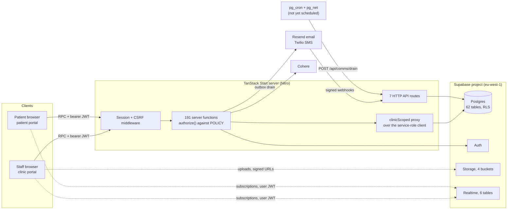
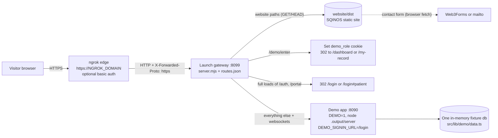
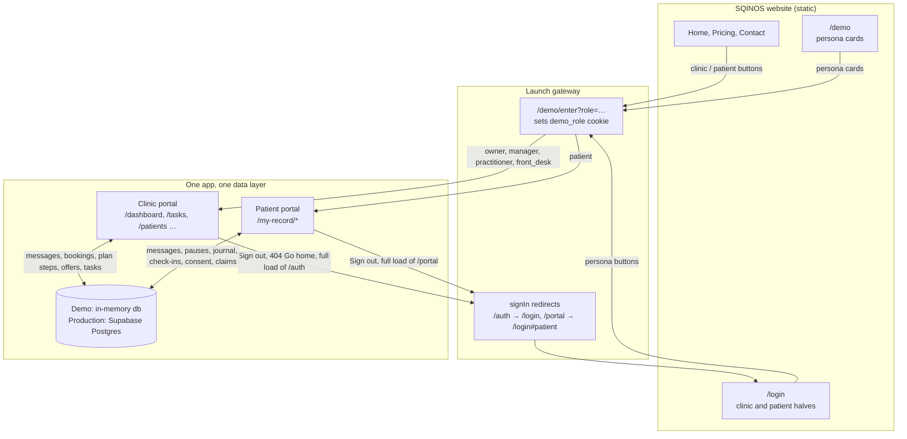
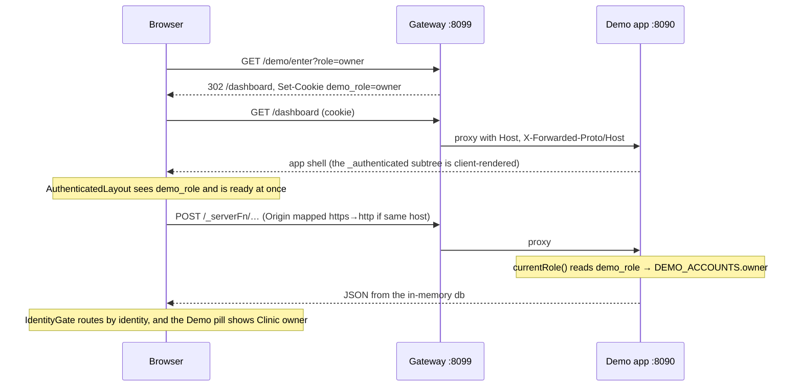
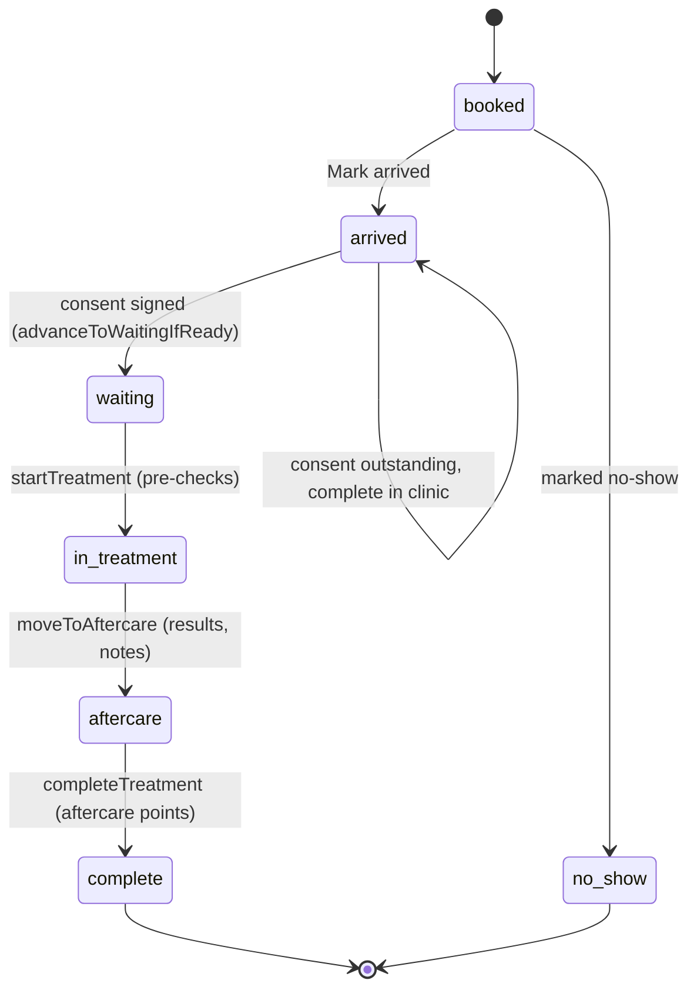
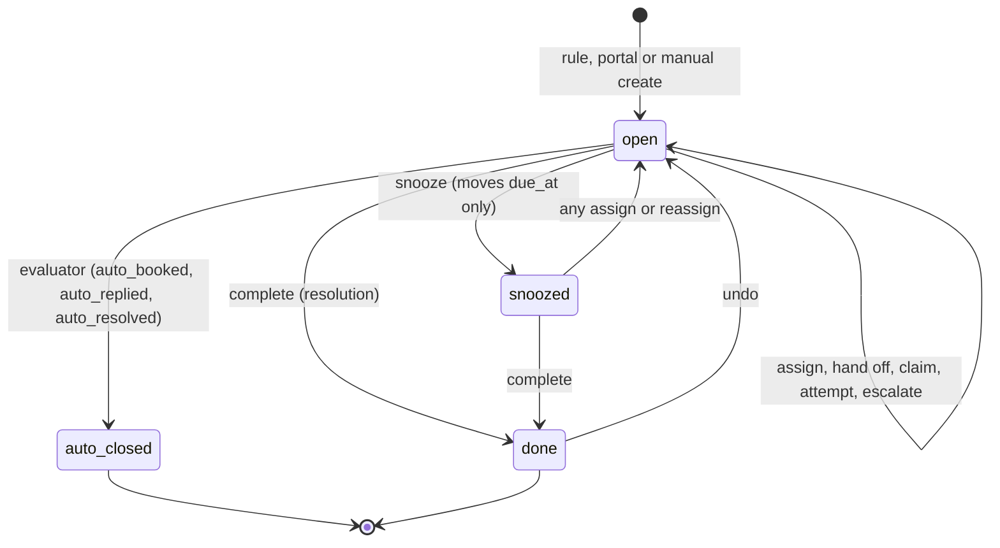

# Aetheria — Technical Documentation (HLD & LLD)

Sep 30, 2026 · @Karn Deb · Code state: branch `e2e_exp`, HEAD `175a06c` (29 Sep 2026)

> **Scope of this revision.** This document replaces the 26 Sep 2026 edition, which described `94fc1b6`. It covers the 77 commits since then and, for the first time, all three surfaces and how they connect: the **clinic portal**, the **patient portal**, and the **SQINOS marketing website** with the **launch gateway** that puts the website and the demo app behind one public URL. Sections that did not change are carried over and marked where their numbers moved. Every figure was checked against the source at `175a06c`; results that come from work logs rather than a fresh run are labelled "recorded".

## 1. Executive summary

Aetheria is a clinical-records and practice-management web app for UK aesthetic clinics and medspas. The product is being rebranded to **SQINOS**: the app's mark, wordmark, favicon and invoices already say SQINOS, while page titles, sign-in emails and most internal names still say Aetheria (§7.8). One codebase serves two portals: a **clinic portal** for staff (owner, manager, practitioner, receptionist) and a **patient portal** at `/my-record`. It is a TanStack Start app (React 19, SSR) on one Supabase project (Postgres, Auth, Storage, Realtime), with a fixture-driven **demo mode** that runs the whole product with no backend.

A third surface now sits in front of it: a static **Astro marketing website** (`launch-plan/website`, branded SQINOS) and a dependency-free **Node gateway** (`launch-plan/gateway`) that serves the website and proxies everything else to the demo app on one port, tunnelled to the internet by ngrok. Visitors enter the demo by picking a persona on the website; the gateway sets a `demo_role` cookie and lands them in the clinic or patient portal, and signing out hands them back to the website (§6, §7).

**Current build state (branch `e2e_exp`, HEAD `175a06c`, 29 Sep 2026):**

| Dimension | Measure (26 Sep figure in brackets) |
| --- | --- |
| Source size | ~103,200 lines across 371 files in `src/` (76,000 / 288); `clinic.functions.ts` is 11,008 lines (8,168), the demo twin 8,239 (6,011) |
| Server functions | 191 `createServerFn` handlers in production and 191 in the demo twin (161 / 161): 36 added, 6 removed; every one registered in the `POLICY` map (191 entries) |
| Database | 62 public tables (52), 25 enums (22), 13 callable SQL functions (unchanged), 89 migrations (73), 200 `create policy` statements (180) |
| Routes | 44 route modules: 26 authenticated pages (15 staff, 11 portal), 3 layouts, 7 public pages, 7 HTTP API routes (6), plus `__root.tsx`. New page: `/tasks`. `/earnings` is now a redirect to `/profile` |
| Access model | 65 permission keys (56): 23 capabilities (15) + 42 visibility keys (41) in 9 groups; 6 login roles (unchanged) plus clinic-defined **named roles** (access packs); 9 access kinds in `POLICY` (8), including the new `managerCapability`; 61 catalogue nodes (58) |
| Tests | 35 unit files / 254 cases (16 / 133), last recorded 243 pass and 11 fail; a new metrics suite (17 cases, 16 pass); 27 regression Playwright specs / 184 declarations (19 / 107), last full run 195 of 205 passed; 12 gateway tests and a 40-test website stitching suite |
| Marketing website | Astro 5.18 static site, 6 pages (`/`, `/login`, `/pricing`, `/contact`, `/demo`, `/404`), 17 components (one unused), ~57 KB of JavaScript gzipped |
| Git | 172 commits, 18 Aug to 29 Sep 2026; 77 since the last edition; `e2e_exp` is 119 ahead of `main` and has not been pushed |

**What is built and working (demo-verified):**

- **Clinic floor.** Diary with day, week and month planners, a guided visit-stage machine and a **Needs action** filter; patient records with treatments, photos, consent, documents and medical history; a three-page treatment form (arrival to complete); **Records** table with a patient drawer and a generated "Suggested next step"; a **Journey board** of six triage tiles over a practitioner × phase map.
- **Tasks.** A rule-driven **Tasks** page: seven automation rules raise, escalate and auto-close follow-up tasks (chases, no-show rebooks, urgent portal questions, recalls, win-back approvals, progress photos); role views, delegation, pools, attempt tracking, undo, and a dashboard summary.
- **Reports on one metrics layer.** Insights, Retention, Performance and the dashboard read the same pure definitions (`src/lib/metrics/*`), with cross-page invariants tested and a rendered-number check against a demo snapshot route.
- **Staff management.** A redesigned staff profile (Overview, Performance & earnings, Schedule & time off, Documents, Security, Access) in three modes; working patterns with approval; time off with approval; bookable treatments; monthly practitioner invoices (schedule, send, print); profile change requests with owner or delegated approval; named roles; an owner set-up gate; manager delegation keys.
- **Communication.** Staff 1:1 chat and team alerts in the floating dock (Team and Patients tabs), replies to alerts, practitioner day cards from the sidebar; an email/SMS outbox with Resend and Twilio adapters, PECR preferences and unsubscribe; consent magic links; stage-based offers with pictures, AI drafting, rules (applies to, one per patient, no stacking) and results per template.
- **Patient portal.** Eleven pages: plan timeline, journal, routine, records, appointments, offers and an AI care assistant; now responsive with a drawer shell on phones.
- **Website and public demo.** SQINOS site with a WebGL hero, five coded journey screens, pricing, contact form and a demo page; the gateway's persona entry, sign-in redirects and hand-off back to the website; ngrok scripts with a pre-flight check and a stitching QC suite.

**What is not yet production-real:**

- No live email or SMS has ever been sent (sandbox only); the `pg_cron` drain is not scheduled.
- Application traffic runs on the service-role client, so RLS is defence-in-depth, not enforcement.
- None of the 16 new migrations is recorded as applied to the live project; a live roster read on 28 Sep shows the `20260930…` set missing, and the Team page, profile and Tasks page read their columns and tables.
- `tasks` is not in the Realtime publication, rules run only when staff read, and staff working patterns and time off are not yet read by the diary or booking.
- The public demo shares one in-memory dataset between all visitors, lets any visitor become Software admin, and has an open redirect in `/demo/enter?next=`.
- `npm run verify` and CI are red: `check:validators` fails on a comment the checker misreads, `check:metrics` fails on an audit test, and 11 unit tests fail.
- The root `README.md` publishes working passwords for provisioned live staff accounts and personal email addresses.
- Phases 6 (auth hardening), 10 (portal onboarding), 11 (architecture and tests) and 12 (accessibility) of the remediation programme remain open; `tsc --noEmit` reports ~106 errors (none new since the 109 baseline).

### 1.1 Latest update: 26–29 Sep 2026 (`94fc1b6` → `175a06c`, 77 commits)

Thirteen workstreams landed in four days: 601 text files, +116,097 / −9,812 lines (inside `src/`: 223 files, +35,661 / −8,490). No npm dependency of the app changed.

| Workstream | Commits | Date | What landed |
| --- | --- | --- | --- |
| Responsive Stage 2 | `8b977a2`, `9e3d241` | 26 Sep | Off-canvas sidebar below 1024 px, dialog and layering fixes, 16 px fields on phones, 24 px tap targets, 10 px type floor, stacked week diary on phones, and a responsive **gate** (`RESPONSIVE_GATE`) that later programmes used on every phase |
| Launch plan | `1e85160`, `a21909d`, `95cc4eb` | 26 Sep | `launch-plan/`: ngrok scripts, gateway, first website (W0–W2), pitch material, docs exports |
| Portal feedback P0–P12 and review corrections | `a7e060b` … `841e713` (14) | 27 Sep | The owner's 145-bullet to-do list (124 done, 18 follow-on, 1 deferred, 2 reverted at review): shared **metrics layer** and `check:metrics`; 6 migrations (deposit rules, details-incomplete flag, task due dates, compliance fields, 2 capability keys, offer rules); Settings tabs with Payments and deposits; diary Needs action; pagination; confirmations, unsaved-changes guard and wording rules; Team compliance and last-active; offer rules, preview and results |
| SQINOS website | `321da22` | 27 Sep | Website rebranded to SQINOS; five coded journey screens; `/pricing`, `/contact`, `/demo`; standalone build |
| Merges | 5 | 27 Sep | Three merge commits and a personal text file (`zaisam.txt`); no code |
| Roles, governance, team chat, treatment due, metrics restructure | `a9913cc` … `21dee87` (15) | 27–28 Sep | Earnings moved into My profile; profile change requests with `requires_owner`; **named roles** and owner set-up gate; manager may invite; opt-in approval delegation; access grid rebuild and history; Team tab in the chat window; replies to alerts; practitioner day card; `plan-step-state.ts`; Book from the plan card; metrics split into `period`, `rules`, `visits`, `money`, `funnel`, `book`, `retention`, `dashboard` |
| Changelog harness | `c291ab1` | 28 Sep | Per-commit before/after capture pages for the 28 Sep pull; README demo and live account tables |
| Profile redesign R1 (P0–P10) | `786cf13` … `b2bf012` (12) | 28–29 Sep | SQINOS app mark and favicon; `team.manage_profiles` and `team.commission` with the `managerCapability` access kind; 4 staff tables; 12 handlers; `StaffProfilePage` in three modes |
| Website ↔ demo stitching | `d61d85d` | 28 Sep | Gateway sign-in redirects, `manager` persona, `next=` deep links; app hand-off back to the website (`src/lib/demo/handoff.ts`); QC suite `launch-plan/qc` |
| Profile round 2 (P0–P7) | `fc1f672` … `c96c591` (10) | 29 Sep | Themed time and date pickers; invoice document and print sheet; working-pattern **requests** with approval; invoices raised on a colleague's behalf; "Requests to approve" on the dashboard |
| Pickers fix | `ff89a40` | 29 Sep | Popover surfaces made opaque, glass moved to an inner well |
| Patients & Tasks (P0–P8) | `0bd63f3` … `f042fdf` (10) | 29 Sep | `tasks`, `task_events`, `automation_rules`; rule evaluator and task service; 13 handlers replacing 6 recall-task handlers; Records tab and patient drawer; triage-tile Journey board; `/tasks`; dashboard Tasks summary |
| Tasks QC | `42f1bc1`, `175a06c` | 29 Sep | Demo "Viewing as" pill on Tasks, ten-a-page pagination, nav label wrap |

**What changed for each part of the system:**

- **Clinic portal.** New `/tasks` page and sidebar badge; the patients list became the Records tab with a drawer; the journey board became triage tiles; the dashboard lost its task list for a read-only Tasks summary and gained deposit-rule copy, compliance rows, profile-change rows and "Requests to approve"; `/profile` and `/team/$id` share one redesigned staff profile; `/earnings` redirects to `/profile`; Team gained named roles, an owner set-up gate, delegated approvals and an access history; the floating dock gained a Team tab; Settings gained tabs and Payments and deposits.
- **Patient portal.** No page added or removed and no portal handler changed apart from emergency-contact phone validation. It became responsive (drawer shell, type floor, tap targets), took the SQINOS mark, and feels clinic-side changes indirectly: automated portal-only offer cards, "Applies to" lines, messages that now reach staff through chat and Question tasks, and plan steps booked from the staff plan card (§4.4).
- **Website and gateway.** New surface. The website moved from an Aetheria-branded first draft to SQINOS with pricing, contact and demo pages; the gateway gained persona entry for `manager`, sign-in redirects and deep links; the app gained a hand-off module so every exit returns to the website in the public demo (§6, §7).
- **Authorization.** 8 new capability keys and 1 new view key; the `managerCapability` access kind; named roles whose grants replace the built-in role's; `team.approve_changes` became owner-granted; several handlers re-gated (§3.4).
- **Database.** 16 migrations, 10 new tables, 3 new enums, 20 new policies, new columns on 7 existing tables; `recall_tasks` deprecated in favour of `tasks` (§9).
- **Quality.** Metrics invariants, rendered-number e2e, a review capture pack, a changelog capture harness, a responsive gate and the launch QC suite; unit files grew from 16 to 35 and regression specs from 19 to 27 (§11).

### 1.2 Previous update: pull of 26 Sep 2026 (`dc9539d` → `b2e554e`)

Six commits (25 Sep) turned the fixed role model into a per-role **visibility catalogue** (41 `view.*` keys edited by a software-developer `admin` at `/access`), added the `admin` role and the "Software admin" demo persona, browser-autofill detection on sign-in forms, and pictures on offers (five placements, public `offer-images` bucket). Three migrations; no new server functions. Everything described there still holds except where §3.4 and §10.16 give newer counts.

### 1.3 How the three surfaces connect, in one paragraph

In the public demo, one gateway port serves the website's static files and proxies every other path, including server-function calls and websockets, to the demo app. The website never talks to the app except through links to `/demo/enter?role=<persona>`, which the gateway answers by setting the `demo_role` cookie and redirecting to `/dashboard` or `/my-record`. The demo data layer reads that cookie on every request and picks the persona. The clinic and patient portals share one in-memory dataset in the same Node process, so a message, pause request or booking made on one side is visible on the other within a poll (4–60 s). Full loads of `/auth` and `/portal`, Sign out, the app's 404 "Go home" and brand links all hand the visitor back to the website. In production the clinic and patient portals are the same app on one Supabase project, joined by Postgres rows and Realtime; the website links to the real sign-in pages instead (§7).

## 2. Repository map and tech stack

The repo is a single TanStack Start application (Lovable template `tanstack_start_ts_current`) with the server layer, demo layer, schema and tests side by side, plus a self-contained `launch-plan/` folder for the website, gateway and public-demo tooling. It syncs to Lovable through GitHub, so published history must never be rewritten (`AGENTS.md`).

### 2.1 Stack

The app's dependencies are byte-identical to 26 Sep (`package-lock.json` and `bun.lock` unchanged). The website and gateway are separate packages that the app build never touches.

| Layer | Choice | Notes |
| --- | --- | --- |
| Runtime | Node 22.23.2 (`.node-version`), engines `>=22.12` | Node 22 is mandatory: older Node lacks native WebSocket and Supabase Realtime fails at `getMe` |
| UI | React 19.2, TypeScript 5.8 (`exactOptionalPropertyTypes` on), Tailwind CSS 4.2 | shadcn-style primitives on Radix UI; `lucide-react` icons; `sonner` toasts; `vaul` drawers; `cmdk`; `react-day-picker` 9 for the new date picker |
| Routing / SSR | TanStack Start 1.168 + TanStack Router 1.170 (file-based) | `_authenticated` subtree is `ssr: false` (client-rendered behind auth) |
| Data fetching | TanStack Query 5 + `createServerFn` RPCs | Every read and write is a server function; the browser queries Supabase directly only for Realtime subscriptions and Storage |
| Forms / validation | react-hook-form 7 + zod 3 | One zod schema set (145 exported schemas) shared by client forms and server validators |
| Rich text | Tiptap 3 | Staff notes and visit notes |
| Charts | Recharts 2.15 | Performance, retention, insights; a shared brand palette in `lib/chart-palette.ts` (partly adopted) |
| Backend | Supabase JS 2.112 (Postgres, Auth, Storage, Realtime) | Project ref `aljozsxrdqfxiqczhbqn` (`patientsys`, eu-west-1) |
| Comms | Resend (email), Twilio (SMS, browser Voice) | Raw `fetch` adapters, no provider SDKs server-side; practitioner invoices also go out through the Resend adapter |
| AI | Cohere v2 chat (`command-a-plus-05-2026`) | Care assistant, demo AI patient replies, offer drafting, product-link extraction; canned fallbacks without a key |
| Build / deploy | Vite 8, Nitro 3 beta, Cloudflare target via `@lovable.dev/vite-tanstack-config` | The public demo builds a Node server bundle instead (`NITRO_PRESET=node-server` with `launch-plan/ngrok/vite.demo.config.ts`) |
| Quality | ESLint 9, Prettier 3, Vitest, Playwright 1.63 | CI in `.github/workflows/verify.yml` (unchanged since 26 Sep) |
| Marketing website | Astro 5.18 (static output, no islands), GSAP 3.15 + ScrollTrigger, Lenis 1.3, self-hosted Space Grotesk Variable and Instrument Serif | `launch-plan/website/package.json` (`aetheria-website`, Node ≥ 22); plain `<script>` modules; one WebGL shader with no three.js |
| Launch gateway | Node ≥ 22 built-ins only (`http`, `fs`, `path`) | `launch-plan/gateway/package.json` (`aetheria-launch-gateway`); `npm start`, `npm test` (`node --test`) |
| Public tunnel | ngrok agent v3 | Free plan: one static `*.ngrok-free.dev` domain, interstitial page, 1 GB and 20,000 requests a month |

### 2.2 Folder map

| Path | What lives there |
| --- | --- |
| `src/routes/` | File-based routes: `__root.tsx`, 7 public pages, `_authenticated/` (15 staff pages, 11 portal pages, 3 layouts), 7 `api.*.ts` HTTP handlers. `routeTree.gen.ts` is generated |
| `src/lib/clinic.functions.ts` | Production data layer: 191 server functions (11,008 lines) |
| `src/lib/clinic.functions.demo.ts` | Demo twin (8,239 lines), swapped in by a Vite plugin when `DEMO=1` |
| `src/lib/auth/` | `policy.ts` (191-entry access map, 9 access kinds), `guards.server.ts` (`authorize`, `readIdentity`, `requireManagerCapability`), `session-middleware.server.ts`, `clinic-scope.server.ts` (tenant proxy, 53 scoped tables), MFA, throttle, OAuth, surfaces |
| `src/lib/permissions.ts`, `access-catalogue.ts` | 65 permission keys in 9 groups (with the new `managerOnly` flag); 61-node visibility catalogue; generic defaults for named roles |
| `src/lib/staff-access.ts`, `clinic-roles.ts`, `profile-change-policy.ts` | Pure rules for colleague management (`canManageProfiles`, `canSetCommission`), invites and named-role names, and change-request approval routing |
| `src/lib/metrics/` (new) | The shared metrics layer: `period`, `rules`, `visits`, `definitions`, `appointment-flags`, `money`, `funnel`, `book`, `retention`, `dashboard`, `compliance`, `snapshot`, `demo-rows` (`windows.ts` is dead code) |
| `src/lib/tasks/` (new) | Task vocabulary, urgent-message triage, rule snapshot and evaluator, task service (visibility, transitions, summary), production I/O, outcome lists |
| `src/lib/patients/` (new) | Records-tab summaries and suggested next step, Journey board risk and tiles |
| `src/lib/staff-schedule.ts`, `invoices.server.ts`, `invoice-document.ts`, `staff-file-storage.ts`, `field-parse.ts` (new) | Working patterns, time off, bank holidays and invoice maths; invoice email and delivery; the shared invoice document; staff file upload; clock and day parsing |
| `src/lib/plan-step-state.ts`, `staff-lane.ts`, `phone.ts`, `format.ts`, `journey-phases.ts`, `chart-palette.ts`, `practitioner-day-alerts.ts`, `staff-alert-title.ts` (new) | Plan-step booking state; staff lane colours and short names; phone validation; money, date and name formatting; phase names; chart colours; day-card alert folding; team alert title parsing |
| `src/lib/validation/` | `schemas.ts` (145 zod schemas), `primitives.ts` (adds `phone`, `optionalPhone`, `optionalDateOnly`), `parse.ts` |
| `src/lib/comms/`, `offers/`, `portal/` | Outbox and providers (the drain now delivers due invoices first); offers (adds `results.ts`, rules in `send.ts`); portal view shaping |
| `src/lib/demo/` | `data.ts` (5,898-line fixture clinic), `enabled.ts` (`DEMO_MODE`, `DEMO_NOW`, `DEMO_SIGNIN_URL`), `handoff.ts` and `switch-role.ts` (new), `persona.ts`, AI patient responder |
| `src/lib/*.server.ts` | Report engines (`retention`, `retention-insights`, `earnings`, `insights`, `insights-ingest`), `visit-stage`, `documents/access`, `invoices` |
| `src/components/` | 131 feature components (102) plus 48 primitives in `ui/` (46). New folders: `profile/` (19 files), `tasks/` (5), `patients/` (9, rebuilt); new `dashboard/tasks-summary-card.tsx`, `retention/patient-tasks-panel.tsx`, `schedule/*`, `owner-setup-gate.tsx`, `confirm-dialog.tsx`, `pagination-bar.tsx`, `info-hint.tsx`, `ui/time-field.tsx`, `ui/date-field.tsx` |
| `src/integrations/supabase/` | Browser and service-role clients; `types.ts` (hand-maintained blocks for every new table) |
| `supabase/migrations/` | 89 SQL migrations, 11 Aug to 3 Oct 2026 file dates (all 16 files added since 26 Sep carry file dates after their commit dates) |
| `scripts/` | Provisioning, ledger-aware migration runner, DB snapshot, static checks (policy, validators, tenancy, metrics), responsive report, QC capture scripts, `changelog/*` capture harness, `ipad-viewports.mjs` |
| `tests/unit/` · `tests/metrics/` · `e2e/` | Vitest units · metrics invariants · Playwright specs (regression, responsive, metrics, review, changelog) |
| `launch-plan/` (new) | `gateway/` (server, route table, tests), `ngrok/` (start, stop, doctor scripts, demo Vite config, agent config template), `scripts/` (`load-env.sh`, `check-isolation.sh`), `website/` (Astro site), `qc/` (stitching suite and report), `pitch/`, `docs/` (26 Sep exports of this document, the launch plan and the execution plan), `.env.example` |
| `docs/` | Audits, WORKLOG, phase plans, clinic-portal guide, RBAC baseline, patient-portal specs and wireframes, `CODEBASE_MAP.md` (new), `audits/` (Insights number audit), and one folder per workstream with README, per-phase worklog and captures: `portal-feedback/`, `profile-redesign/` (+ `r2/`), `patients-tasks/`, `changelog/`, `responsive/` + `responsive-worklog.md` |
| `.cursor/plans/` · `.lovable/plan/` | 35 committed Cursor plans (7 new) and 11 Lovable plans; the client feedback PDF is now committed under `.cursor/feedback/` |
| `Claude outputs/` | HTML mock-ups, `sqinos-mockups/`, the owner to-do list, and **stale duplicate copies** of `launch-plan/` and the website (easy to edit the wrong one) |

### 2.3 Environments and modes

| Mode | Command | Data | Identity |
| --- | --- | --- | --- |
| Live dev | `npm run dev` (port 8080) | Supabase via service role | Supabase Auth session |
| Demo | `npm run dev:demo` (`DEMO=1`) | In-memory fixtures (`demo/data.ts`), mutable per server boot | `demo_role` cookie: `owner`, `manager` (new persona Maya Chen), `practitioner`, `front_desk`, `patient`, `admin`; a role switcher pill sits bottom-left (a compact "Demo" pill on phones), and signing in with a known demo email picks the matching persona |
| Public demo (new) | `launch-plan/ngrok/start-public.sh` | Demo fixtures in one Node process on 8090, shared by every visitor | Persona from the website via the gateway's `/demo/enter?role=`; the app is built with `DEMO_SIGNIN_URL=/login`, so its sign-in pages and Sign out hand back to the website (§6.9, §7) |
| Regression tests | `npm run test:e2e` | Demo on 8091, fresh server per run, serial | `demo_role` cookie set by the fixture |
| Metrics / review / changelog | `npm run test:metrics`, `review:captures`, `node scripts/changelog/walk-commits.mjs` | Demo on 8093 / 8092 / 8093 with a pinned `DEMO_NOW` | Cookie per persona |
| Launch QC | `launch-plan/qc/run.sh` | Demo on 8094 behind a gateway on 8097, `DEMO_SIGNIN_URL=/login` | Via `/demo/enter` |
| Production | Lovable publish (Nitro → Cloudflare) | Supabase | Supabase Auth |

### 2.4 Configuration

- **App** (`.env.example`, unchanged): Supabase URL and keys duplicated as `VITE_*` for the browser, `SUPABASE_SERVICE_ROLE_KEY` (server only), `DATABASE_URL` (scripts), `COMMS_SANDBOX`, `COMMS_DRAIN_SECRET`, `RESEND_*`, `TWILIO_*`, `APP_ORIGIN`, `AUTH_DEV_SHOW_OTP`, `COMMS_UNSUBSCRIBE_SECRET`, `COHERE_API_KEY` / `COHERE_MODEL`.
- **App build-time defines** (`vite.config.ts`): `__DEMO_MODE__` (`DEMO=1`), `__DEMO_NOW__` (`DEMO_NOW`), and new `__DEMO_SIGNIN_URL__` (`DEMO_SIGNIN_URL`). All three are baked into the bundle, so the public demo rebuilds on every start.
- **Launch settings** (`launch-plan/.env.local`, git-ignored, template `.env.example`): `NGROK_AUTHTOKEN`, `NGROK_DOMAIN`, `NGROK_BASIC_AUTH_USER` / `_PASS`, `APP_PORT` (8090), `GATEWAY_PORT` (8099), `APP_MODE` (`preview` | `dev`), `APP_DIR`, `DEMO_DEFAULT_ROLE` (`owner`), `DEMO_SIGNIN_REDIRECT` (on), `DEMO_SIGNIN_URL` (`/login`), `DEMO_NOW` (§6.9).
- **Website build** (`launch-plan/website/.env.local`): `PUBLIC_CLINIC_SIGNIN_URL`, `PUBLIC_PATIENT_SIGNIN_URL`, `PUBLIC_DEMO_PERSONAS`, `PUBLIC_CONTACT_EMAIL`, `PUBLIC_CONTACT_FORM_KEY`, `PUBLIC_CONTACT_FORM_ENDPOINT`, `SITE_URL`, and `PUBLIC_PREVIEW_MODE` (set by the preview builds) (§6.4).

## 3. High-level design (HLD)

Aetheria is a server-function monolith: both portals are one React SPA that calls 191 typed RPCs on a TanStack Start server, which verifies the Supabase JWT, wraps a **service-role** Supabase client in a clinic-isolation proxy, and applies a declarative access rule before touching Postgres. The marketing website is a separate static site that only links into the app (§6).



Browsers talk to the server only through server functions; the two direct Supabase connections are Realtime subscriptions and Storage uploads or signed-URL reads, which run with the user's JWT and so do hit RLS.

### 3.1 Logical components

| Component | Responsibility | Key files |
| --- | --- | --- |
| Clinic portal | Staff SPA: dashboard, diary, patients (Records and Journey board), record, **tasks**, reports, offers, team, staff profile, settings, access | `routes/_authenticated/*.tsx` (not `my-record*`), `components/app-shell.tsx` |
| Patient portal | Patient SPA under `/my-record/*` with its own sidebar and dock (chat + AI) | `routes/_authenticated/my-record*.tsx`, `components/portal/*` |
| Public surfaces | App landing, staff sign-in, patient sign-in, consent magic link, unsubscribe; in the public demo the first three hand off to the website | `routes/index.tsx`, `auth.tsx`, `portal.tsx`, `d.$token.tsx`, `u.$token.tsx` |
| Session layer | Client middleware attaches and refreshes the bearer token; server middleware verifies it and builds `Ctx` | `lib/supabase-session-middleware.ts`, `lib/auth/session-middleware.server.ts` |
| Authorization | `POLICY` map (191 entries, 9 access kinds), capability keys, named roles, visibility catalogue (`canSee`, 61 nodes), `authorize()`, scope rules, MFA and step-up | `lib/auth/policy.ts`, `lib/auth/guards.server.ts`, `lib/permissions.ts`, `lib/access-catalogue.ts`, `lib/staff-access.ts`, `lib/clinic-roles.ts` |
| Tenancy | Proxy that filters and stamps `clinic_id` on 53 tables | `lib/auth/clinic-scope.server.ts` |
| Domain layer | Server functions plus pure engines (visit stage, plan-step state, offers, portal shaping, staff schedule, invoices) | `lib/clinic.functions.ts`, `lib/*.server.ts`, `lib/offers/*`, `lib/staff-schedule.ts` |
| Metrics layer (new) | One definition per number (due, overdue, to chase, visit, first-to-second, earned, collected, outstanding) used by every report, the dashboard, both data layers and the tests | `lib/metrics/*` |
| Tasks engine (new) | Seven automation rules evaluated on read; task service for visibility, transitions, grouping and summaries; production I/O | `lib/tasks/*`, `lib/patients/*` |
| Comms | Outbox, dispatch with retry, provider adapters, webhooks, unsubscribe; the drain also delivers scheduled practitioner invoices | `lib/comms/*`, `lib/invoices.server.ts`, `routes/api.comms.*` |
| Demo layer | Same exports over in-memory fixtures; Vite resolves `clinic.functions.ts` to the demo file; hand-off to the website in the public demo | `vite.config.ts`, `lib/clinic.functions.demo.ts`, `lib/demo/*` |
| Data | Postgres schema, RLS, triggers, RPCs; Storage buckets; Realtime publication | `supabase/migrations/*` |
| Marketing website (new) | Static SQINOS site: story, pricing, contact, demo page, sign-in chooser | `launch-plan/website/*` |
| Launch gateway (new) | One port for website and app: route table, persona entry, sign-in redirects, proxy, websocket pass-through, CSRF origin mapping | `launch-plan/gateway/server.mjs`, `routes.json` |
| Public-demo tooling (new) | ngrok start/stop/doctor scripts, Node-server demo build, stitching QC | `launch-plan/ngrok/*`, `launch-plan/scripts/*`, `launch-plan/qc/*` |

### 3.2 Request lifecycle (server function)

1. **Browser.** A component calls `useServerFn(fn)` inside TanStack Query. The global client middleware `ensureSupabaseSession` waits up to 3 s for a session, refreshes it if it expires within 60 s (one refresh in flight at a time), and adds `Authorization: Bearer <jwt>`.
2. **Request middleware.** `errorMiddleware` renders a branded 500 page for uncaught errors; `createCsrfMiddleware` (`src/start.ts`) refuses cross-site server-function calls by comparing `Origin` (or `Sec-Fetch-Site`) with the request's own origin. Behind the launch gateway, the gateway rewrites a same-host `https://` origin to `http://` so this check passes (§6.8).
3. **`.validator()`.** `parseInput(Schema, data)` runs the zod schema; unknown keys are stripped and a failure becomes one readable sentence for the toast.
4. **`requireSupabaseAuth`.** Verifies the JWT with `auth.getClaims` (tokens are ES256, which PostgREST rejects), resolves the caller's `clinic_id` from `profiles` or `patients`, and passes `Ctx { supabase: clinicScoped(serviceClient), clinicId, userId, claims, accessToken }`.
5. **`authorize(ctx, name, {patientId?})`.** Looks up `POLICY[name]`, loads identity once per request, applies the rule, then enforces the owner/manager email-MFA gate. Identity (`readIdentity`, WeakMap-cached) now runs **six parallel queries plus one count**: profile, roles, built-in role grants, patient link, the clinic's `has_separate_manager` / `owner_setup_at`, all `clinic_role_permissions` rows, and a count of the caller's treatments in the last 365 days (`treatsPatients`). Any failed read fails closed.
6. **Handler.** Queries through the scoped client, applies extra in-handler checks where the rule depends on the target (self versus colleague, `requires_owner`, task visibility), writes `audit_log` rows after mutations, may enqueue communications or staff notifications, returns plain JSON. Five read handlers (`listTasks`, `getTasksSummary`, `listPatientTasks`, `listPatients`, `getDashboard`) first run the task-rule sync, throttled to once per 15 s per clinic (§10.8).
7. **Browser.** TanStack Query caches under keys like `["dashboard"]`, `["tasks", …]`, `["patient", id]`; mutations invalidate them. Realtime events and polling (19 `refetchInterval` sites; demo-only 4–5 s intervals) refresh live views.

### 3.3 Authentication and identity model

- **Two sign-in surfaces.** `/auth` for staff and `/portal` for patients. `destinationFor(surface, identity)` sends staff to `/dashboard` and patients to `/my-record`, and signs out an account on the wrong surface.
- **Methods.** Email + password, native Supabase OAuth (Google, Microsoft), self-service reset (`/auth/reset`), login throttle (5 failures in 15 min locks for 15 min, per email and surface).
- **Staff gates** in `_authenticated/route.tsx` (`IdentityGate`), in order: session present → `getMe` succeeds → revoked-staff kick-out → forced password change (invites) → email-code MFA for owner/manager (only when Resend is configured) → **owner set-up gate** (new: an owner whose clinic has no `owner_setup_at` answers "Does someone else manage the clinic day to day?", which sets `clinics.has_separate_manager`) → welcome dialog → 15-minute idle watchdog.
- **Step-up.** Destructive and permission-changing actions (archive, revoke, access grid switches) need a password re-confirmed within 5 minutes (`auth_step_up`).
- **Bootstrap.** The first user with no roles becomes clinic owner in `getMe`; a user linked to a `patients` row gains the `patient` role. The `handle_new_user` trigger creates a `profiles` row for every auth user and links patients by email. The `admin` role (software developer) signs in on the staff surface, holds every key, counts as a manager and is hidden from team lists and team chat.
- **Named roles keep a login role.** A person assigned to a clinic-defined role (§3.4) still holds a built-in `app_role`: `practitioner` when the pack grants `treatments.record`, otherwise `front_desk` (`loginRoleForClinicPack`). Only their permissions come from the pack.
- **Demo identity** (demo and public demo only). No password is involved. `currentRole()` in `clinic.functions.demo.ts` reads the `demo_role` cookie on every request (accepting `owner`, `manager`, `practitioner`, `front_desk`, `patient`, `admin`; anything else becomes `owner`) and maps it to a fixture user. `AuthenticatedLayout` treats the page as signed in whenever that cookie exists. In the public demo the cookie is set by the gateway (§7.3) or by the in-app Demo pill (`switchDemoRole`, which writes the cookie and reloads).

### 3.4 Authorization model

Authorization has two layers that share one grant model and one evaluator (`can()` in `lib/permissions.ts`), plus a third source of grants for people on a named role.

1. **Capabilities** (23 keys) govern what a role may **do**; the owner edits them for built-in roles and named roles in Team → Staff access.
2. **Visibility** (42 `view.*` keys in the access catalogue, §10.16) governs what a role may **see**: pages, tabs and major components. Only the software-developer admin edits these, at `/access`, and only for built-in roles.
3. **Named roles (access packs, new).** An owner or manager can create clinic-specific roles (`clinic_roles`), each with its own copy of the grid (`clinic_role_permissions`). A person with `profiles.clinic_role_id` set gets **only** that pack's enabled keys; the built-in role's rows are ignored. A new pack starts from a least-privilege seed (`GENERIC_STAFF_DEFAULTS`: 23 floor keys such as the dashboard, diary, contact details, documents and team view; nothing clinical or financial). Reserved names (owner, manager, practitioner, receptionist, front desk, admin) are refused.

Owners and admins hold every key in code. `npm run check:policy` fails the build when a handler lacks a `POLICY` entry or never calls `authorize`.

**Access kinds.** Nine kinds cover all 191 handlers:

| Kind | Rule | Handlers |
| --- | --- | --- |
| `self` | Any signed-in user acting on their own data; optionally also a `view` key | 34 |
| `staff` | Any staff role (owner, admin, manager, practitioner, front desk) | 57 |
| `capability(key)` | Staff holding the key (owner and admin always) | 63 |
| `owner` | Clinic owner only | 9 |
| `manager` | Management tier: owner, admin or the manager role | 7 |
| `managerCapability(key)` (new) | Owner or admin, or someone holding the **manager login role** who also holds the key; a named pack cannot qualify | 8 |
| `staffOrOwnPatient(staffKey?)` | Staff (optionally with a key) or the patient the record belongs to | 6 |
| `patientSelf` | The patient acting on their own row | 3 |
| `accessAdmin` | Owner or admin | 4 |

**Capability keys and defaults.** Defaults are the values the migrations seed on the live database for rows nobody has edited. The demo fixture (`rolePermissions` in `src/lib/demo/data.ts`) differs in five cells, shown in brackets. "—" means manager-only: the grid shows a dash instead of a switch for practitioner and receptionist.

| Group | Key | Label | Manager | Practitioner | Receptionist | Change since 26 Sep |
| --- | --- | --- | :-: | :-: | :-: | --- |
| Clinical record | `patients.edit` | Patient records (contact details) | on | on | on | Wording narrowed |
| | `patients.edit_clinical` | Edit clinical record | on | on | off | **New**; gates viewing treatment forms in the UI only |
| | `treatments.record` | Record treatments & notes | on | on | on (demo: off) | Unchanged: the 24 Aug seed enabled it for receptionists and no later migration turned it off |
| | `documents.send` | Send documents | on | on | on | — |
| | `photos.manage` | Clinical photos | on | on | on (demo: off) | Same as `treatments.record` |
| Diary | `appointments.edit` | Manage the diary | on | on | on | — |
| Communication | `comms.send` | Send messages | on | on | on | — |
| | `notifications.delete` | Clear notifications | on | off (demo: on) | off | — |
| Marketing | `offers.manage` | Design and automate offers | **on** | off | off | Manager default turned on |
| Reports | `reports.insights` | Insights | on | **on** | **off** | Practitioner turned on, receptionist turned off |
| | `reports.retention` | Retention report | on | on | off (demo: on) | — |
| | `reports.performance` | Performance & earnings | on | off | off | Commission split moved to the next key |
| | `reports.commission` | Commission and payouts | **off** | off | off | **New**; money on Performance and colleagues' commission |
| Team | `team.view` | Team & staff details | on | off (demo: on) | on | Wording |
| | `team.approve_changes` | Approve profile change requests | **off** | off | off | Now owner-granted (was on for managers) |
| | `team.manage_profiles` | Edit staff profiles | on | — | — | **New**, manager-only |
| | `team.commission` | Set staff commission | on | — | — | **New**, manager-only; described as needing the key above too |
| Tasks | `tasks.assign_any` | Assign tasks to anyone | on | off | off | **New** |
| | `tasks.handoff` | Hand tasks to the front desk | on | on | off | **New** |
| | `tasks.claim` | Claim pooled tasks | on | off | on | **New** |
| | `tasks.complete` | Complete tasks | on | on | on | **New** |
| Clinic settings | `settings.treatments` | Treatments & colours (also deposit rules) | on | off | off | The 29 Sep review turned the demo's receptionist default off; the live seed was already off |
| | `tasks.delete` | Delete tasks | on | off | off | Orphaned: no handler uses it since recall tasks were removed |

The demo differences matter when reading demo-based tests and screenshots: a live practitioner cannot see the Team page or clear notifications by default, and a live receptionist cannot open Retention but can record treatments.

Default flips apply only to rows with `updated_by IS NULL`, so a clinic that edited a grant by hand keeps its choice. Named packs never receive the new keys automatically (no migration back-fills `clinic_role_permissions`).

**Owner, manager and admin powers:**

| Power | Owner | Manager (role) | Admin (software developer) |
| --- | --- | --- | --- |
| Capability keys | All, in code | Per `role_permissions` (defaults above) | All, in code |
| Owner set-up gate, enable manager access | Yes | No | No |
| See and edit the Staff access grid on `/team` | Yes (grid renders for owners only) | No UI; can read grants through `listRolePermissions` | Server allows edits; no grid UI (edits `view.*` at `/access`) |
| Invite staff | Any level (Manager only when the clinic has a separate manager) | Practitioner, receptionist, named roles | Server allows; no Invite button |
| Create a named role | Yes | Yes | Yes (server) |
| Edit a named role's grants | Yes, with step-up | No | Yes, with step-up (server only) |
| Edit a colleague's profile, pattern, bookable treatments, time off | Yes | With `team.manage_profiles` (default on) | Yes |
| See and set colleague commission, their earnings, raise their invoice | Yes | With `team.manage_profiles` and `team.commission` in the UI; the server's `setCommissionRate` checks `team.commission` only | Yes |
| Clinic commission and payout figures (Performance, Team cards) | Yes | With `reports.commission` (default off) | Yes |
| Approve profile change requests | Yes, including owner-only requests | Only if granted `team.approve_changes`; never owner-only requests; never their own | Yes |
| Own identity fields (name, title, registration, work email, arrangement) | Save directly | Must request; the request needs the owner | Save directly |
| Revoke, restore, set passwords and emails, create accounts | Yes | No | No |
| Archive a patient | Yes | Yes (was owner-only) | Yes |

**Separate-manager switch.** `clinics.has_separate_manager` decides whether the Manager level exists: when false the Manager column, invite chip and role option are hidden and the server refuses `role: "manager"` on invite and role change. Existing clinics with a manager were migrated to true. There is no way back to false once enabled.

**Scope rules.** `practitionerOwnBook` (dashboard, retention) is unchanged; `nonManagerOwnAssignments` was removed with the recall-task handlers. Task visibility is decided inside the task handlers (`canSeeTask`, §10.8).

**What the server enforces versus the UI.** Eight visibility keys are also enforced on the server (`getDashboard`, the staff side of `getPatient`, `getMyProfile`, own figures in `getMyEarnings`, and the four portal plan reads). Everything else in the catalogue, including the new `view.tasks` and the `patients.edit_clinical` capability, is a presentation rule only. `docs/CODEBASE_MAP.md` lists further "checks that exist only in the frontend".

### 3.5 Tenancy

Every request runs on the service-role client, so RLS does not bind application traffic. Isolation is enforced by the `clinicScoped` proxy, which adds `.eq("clinic_id", id)` to every select, update and delete and stamps inserts on the **53** clinic-scoped tables (43 on 26 Sep; added: `clinic_roles`, `clinic_role_permissions`, `staff_working_patterns`, `staff_time_off`, `practitioner_treatments`, `practitioner_invoices`, `staff_pattern_requests`, `automation_rules`, `tasks`, `task_events`). Nine tables stay knowingly unscoped (for example `user_roles`). RESTRICTIVE `clinic_isolation` policies and `current_clinic_id()` are the second line for traffic that uses the user's JWT. `npm run check:tenancy` fails when a table is unclassified (62 classified).

`user_roles` being unscoped matters for the new staff features: `profileManagerIds` and `invoiceStoreFor` read every clinic's owners and managers, which is harmless while there is one clinic but would send notifications and "owner" invoices across tenants in a multi-clinic deployment (§13.1).

### 3.6 Deployment topology

**Production (unchanged):**

- One Supabase project (eu-west-1) holds Postgres, Auth, four Storage buckets (`patient-photos`, `message-attachments`, `staff-files`, public `offer-images`) and Realtime on `messages`, `staff_notifications`, `staff_chat_messages`, `staff_conversation_reads`, `role_permissions`, `user_roles`. No new bucket or publication was added; `tasks` is **not** published (§9.5).
- The app builds with Vite + Nitro to a Cloudflare Workers bundle, published through Lovable from the synced GitHub branch.
- The outbox drain (which now delivers due practitioner invoices first) is a secret-protected HTTP route meant for `pg_cron` + `pg_net`; the schedule is not yet configured.
- Providers: Resend (email and Svix-signed webhooks), Twilio (SMS with SHA1-signed webhooks; Voice), Cohere (AI).

**Public demo (new, runs on a laptop):**



`start-public.sh` builds the website if needed, builds and starts the demo app, starts the gateway and opens the tunnel; `stop.sh` stops all three. The target for launch is three hosts on one gateway (`www.` website, `clinic.` staff app, `my.` patient app); the gateway's `hostRoots` already send the root of `clinic.*` to `/auth` and `my.*` to `/portal`, but the rest of the routing is host-agnostic (§7.7).

## 4. Patient portal

The patient portal is an eleven-page subtree at `/my-record/*`, ported from the V4 wireframes on 22 Sep 2026 and corrected after client feedback on 24 Sep. Every page reads from a purpose-shaped `getPortal*` server function whose only access rule is `self` (the caller's own patient row, never a `patient_id` argument). **No portal page, route or handler was added or removed since 26 Sep**, and the only patient-facing handler that changed in substance is `updatePortalProfile` (emergency-contact phone validation). What moved is the shell (responsive, SQINOS mark), the public-demo entry, and what the clinic side does with the patient's actions.

### 4.1 Entry, gating and shell

- **Sign-in** at `/portal` (email/password, Google/Microsoft OAuth, reset). `?next=` is honoured, so an offer email link like `/portal?next=/my-record?offer=<id>` lands on the offer after login. Signed-out hits on any `/my-record*` path redirect there via `loggedOutDestination`.
- **Public demo entry (new).** Visitors never see `/portal`: the website's patient buttons go to `/demo/enter?role=patient`, which sets `demo_role=patient` and lands on `/my-record` as Olivia Bennett. With `DEMO_SIGNIN_URL` set, a full load of `/portal` is redirected by the gateway to the website's `/login#patient`, and a client-side render of `/portal` replaces itself with the same URL. Sign out clears the cookie and returns to the website's `/login` (top of the page, not `#patient`).
- **Gate.** `IdentityGate` forces any non-staff identity into the `/my-record` subtree. `my-record.tsx` is the layout: staff who type the URL see an explanatory card; a patient account with no linked `patients` row sees "No record linked yet". Each portal page, plan sub-tab, the dock chat and the avatar-menu items are gated by `view.portal.*` keys (all on by default); a page switched off redirects to the first page the patient can still see. The new owner set-up gate is staff-only.
- **Shell.** The same `AppShell` as staff, with a patient sidebar: **Care** (Home, Skin Plan & Journey with sub-nav Overview / Timeline / Journal / Skincare Routine, My Clinic, My Profile / Records, Appointments) and **Support** (Resources). Billing, Settings and "My record" sit in the avatar menu. Below 1024 px the sidebar is now an off-canvas drawer (closed by default, closes on navigation), and the account pill is avatar-only on phones. The brand lockup shows the SQINOS ring-and-drop mark and wordmark.
- **Portal dock** (`components/portal/portal-dock.tsx`): two butter-gradient bubbles bottom-right, chat (clinic thread via `getPatientMessages` / `sendMessage`, unread badge from `getUnreadMessages`) and AI (care assistant). `openPortalChat(draft?)` opens the chat from anywhere with a pre-filled message. The dock dropped from `z-[60]` to `z-40` so dialogs are never covered, and on phones its panels pin to the viewport (`max-h-[min(70dvh,32rem)]`).

### 4.2 Page inventory

| Route | Page | What it shows | Server functions | Tables read / written |
| --- | --- | --- | --- | --- |
| `/my-record` | Home | Greeting; KPI strip (current plan, completion ring, next appointment, clinician); Clinic news; Special offers (patient's own offers first, then clinic broadcast); Please confirm your appointment (Confirm / Reschedule) or a booking CTA; Latest message with read state and Reply; Your plan progress track (now carries `data-qc="metric:portal.planDone/planTotal"` hooks); Quick actions | `getPortalHome`, `confirmAppointment`, `markOfferViewed`, `claimOffer` | patients, treatment\_plans, plan\_milestones, appointments, clinic\_news, clinic\_offers, messages, patient\_offers, profiles |
| `/my-record/plan` | Plan Overview | KPI strip; Today / Next action; Recovery check-in sliders (redness, sensitivity, dryness, persisted on release, with a note); Before & After progress; Journey snapshot; Safe to Proceed? checklist | `getPortalPlan`, `submitRecoveryCheckin`, `toggleChecklistItem` | recovery\_checkins, plan\_milestone\_checklist, treatment\_photos |
| `/my-record/plan/timeline` | Timeline | Month-grouped roadmap; Step details panel with three states (completed, in progress, upcoming with due and booked dates); Pause plan modal with reason, notes and validation | `getPortalTimeline`, `requestPlanPause`, `toggleChecklistItem` | plan\_milestones, plan\_milestone\_checklist, plan\_pause\_requests, treatment\_sessions |
| `/my-record/plan/journal` | Journal | Entries with kind tags, one Tags filter, search, calendar, New entry, Share with clinic | `getPortalJournal`, `createJournalEntry`, `deleteJournalEntry` | journal\_entries, journal\_attachments |
| `/my-record/plan/routine` | Skincare Routine | Morning and evening steps, practitioner note, adherence ring, upcoming reminder (Mark as complete / Snooze), skin response, product guide; per-step product-link override | `getPortalRoutine`, `markRoutineComplete`, `snoozeRoutineReminder`, `extractProductFromLink`, `saveRoutineOverride`, `clearRoutineOverride` | skincare\_routines, routine\_items, routine\_item\_overrides, routine\_completions |
| `/my-record/clinic` | My Clinic | Your clinician (Message Clinician), clinic details, upcoming and completed treatments, treatment history at other clinics | `getPortalClinic`, `addExternalTreatment`, `deleteExternalTreatment` | profiles, clinics, appointments, treatments, external\_treatments |
| `/my-record/records` | My Profile / Records | Personal details and emergency contact (edit; the phone is now validated), medical history, health update form, treatment timeline, results and labs, clinic documents with in-portal signing, Before & After gallery | `getPortalRecords`, `updatePortalProfile`, `submitHistoryUpdate`, `signDocument` | patients, medical\_history\_versions, treatments, documents, treatment\_photos |
| `/my-record/appointments` | Appointments | Upcoming (confirm) and past treatments | `getPortalClinic`, `confirmAppointment` | appointments, treatments |
| `/my-record/billing` | Billing | Treatments billed (read-only; no payments) | `getPortalClinic` | treatments |
| `/my-record/settings` | Settings | Contact preferences and the email/text log (never shows provider diagnostics) | `getPortalRecords`, `saveCommsPreferences`, `listCommunications` | patients (PECR columns), communications |
| `/my-record/resources` | Resources | Clinic news, your offers (claimed marked), featured retail products | `getPortalHome`, `getMyRecord` | clinic\_news, patient\_offers, retail\_products |

**Changes since 26 Sep, file by file** (all other portal files are byte-identical):

| File | Change | Commit |
| --- | --- | --- |
| `my-record.index.tsx` | Plan-track label 9.5 → 10.5 px with wrapping; state note and offer flag to 10 px; metric hooks on "N of M milestones" | `9e3d241`, `81fd858` |
| `my-record.plan.index.tsx` | Header chips left-aligned and full width on phones | `9e3d241` |
| `my-record.plan.journal.tsx` | Header controls wrap; search full width on phones; entry meta 11 px | `9e3d241` |
| `my-record.plan.routine.tsx` | Step meta 11 px; "Your product" chip 10 px | `9e3d241` |
| `my-record.records.tsx` | Emergency-contact phone `type="tel"`, validated on blur and submit with `checkPhone()` (country-aware digit counts), inline error; server `assertPhone(..., true)` in `updatePortalProfile` | `a9913cc`, `9e3d241` |
| `my-record.resources.tsx`, `portal-offers.tsx` | Offer flag 10 px, expiry 11 px | `9e3d241` |
| `portal/plan-tabs.tsx` | Tab track scrolls sideways on phones | `9e3d241` |
| `portal/ui.tsx` | 24 px hit area on `PortalLink`, `min-w-0` tiles, 34 px slider hit area | `9e3d241` |
| `portal/portal-dock.tsx` | `z-40`; viewport-pinned panels on phones | `8b977a2`, `9e3d241` |

### 4.3 Key patient journeys

1. **Confirm an appointment.** Home card → `confirmAppointment` → SQL `confirm_appointment(p_appointment_id)` (SECURITY DEFINER, only the caller's own, booked, future appointment) stamps `appointments.patient_confirmed_at`. Patients never get UPDATE on `appointments`.
2. **Pause a plan.** Timeline → Pause plan → `requestPlanPause` (own plan only, one pending request at a time, audited) → `plan_pause_requests` → staff see it on the dashboard Pause requests card → `decidePlanPause` (`treatments.record`) sets the plan to `paused`. Pause requests are **not** routed into Tasks and have no duration.
3. **Sign a consent form.** In Records (`signDocument`, `patientSelf`) or via the emailed magic link `/d/$token` with no session. After signing, `advanceToWaitingIfReady` moves an arrived booking to `waiting` and notifies the practitioner. Signed documents are immutable by trigger.
4. **Submit a health update.** Records → `submitHistoryUpdate` writes a `medical_history_versions` row with `source = patient`; staff mark it reviewed (`reviewHistory`) on the record's **Medical history** tab (renamed from "History updates").
5. **Message the clinic.** Dock chat → `sendMessage` (author forced from the session) → `messages`. On the staff side the message now arrives as a chat toast and in the floating chat window's Patients tab, **not** in the bell (the bell lists new bookings only). A `patient_message` staff notification is still written but no longer rendered. If the text reads as urgent (keyword triage in `lib/tasks/urgent-triage.ts`: swelling, redness, lump, pain, infection, vision, "is this normal", "should I" and similar) and no staff reply follows, the `urgent_portal_question` rule raises a **Question** task for the patient's practitioner with a 4-hour target and escalation to the owner; a staff reply auto-closes it on the next pass.
6. **Ask the care assistant.** Dock AI → `askCareAssistant` builds context (first name, plan, current step, next appointment) → Cohere. A keyword list bypasses the model and refers the patient to Messages; the prompt forbids diagnosis and dosage changes; without a key a deterministic fallback answers.
7. **Claim an offer.** Email button → portal → `?offer=<id>` scrolls to and flashes the card → `markOfferViewed` → Claim (`claimOffer`) → `offer_claimed` notification → Book with this offer opens the dock chat with the code quoted. New since 26 Sep: a template limited to certain treatments appends "Applies to: A, B." to the body; one-per-patient and no-stacking rules mean fewer overlapping cards; and **automation now creates portal-only cards** for patients without marketing consent when the template shows in the portal (never an email or text).

### 4.4 Cross-portal sync

**Patient → clinic:**

| Patient action | Staff surface | Mechanism (production / demo) |
| --- | --- | --- |
| Message | Chat toast and floating chat window (Patients tab), record Open chat; urgent wording also becomes a Question task on `/tasks` | Realtime `message-alerts` and `patient-messages-<id>` / demo polling every 4 s; task on the next rule sync |
| Pause request | Dashboard Pause requests card | Query refetch (60 s) or navigation |
| Journal entry shared, recovery check-in | Record → From the patient (journal, check-ins); shared journal photos on an active plan raise a `plan_support` "Review progress photos" task | Refetch; task on the next rule sync. The portal has no photo upload control yet, so the photo rule only fires on fixture or legacy attachments |
| Consent signed | Diary card stage moves to Waiting; the practitioner is notified (a `patient_waiting` row, which refreshes the dashboard and diary but is not listed in the bell) | `advanceToWaitingIfReady` |
| Health update | Record → Medical history tab | Refetch |
| Offer claimed | Contact tab Offers card, claimed-offer chip on the diary card (only when the offer applies to that booking's treatment) | `offer_claimed` notification is written, but the bell no longer lists it |
| Appointment confirmed | Diary card confirmation state | Refetch |

**Clinic → patient:**

| Staff action | Patient surface |
| --- | --- |
| Message | Portal chat and a "New message from your clinic" toast (demo polls 4 s; its Open action goes to `/my-record`, not the dock) |
| Milestone update, completed treatment session | Timeline step state and visit note |
| **Book from the plan card** (new) | The staff plan card's Book passes `milestone_id` to `saveAppointment`, which links the booking to the step (`plan_milestones.appointment_id`); the patient's Timeline shows that step with its booked date and time |
| Document issued, photo marked `visible_to_patient` | Records documents and gallery |
| Offer sent (manual or automated) | Home and Resources offer cards; email or text only with consent |

**Nothing from the task system reaches the patient.** No portal page reads `tasks`; the Tasks page's "Reply", "Call" and "Send booking link" record an outcome or attempt and send nothing (§10.8).

### 4.5 Portal gaps worth knowing

- **No-show and cancelled steps still read as "booked".** Staff classify plan steps with `planStepState` (booked, other booking, no-show, overdue), but the portal still selects the linked appointment without its `status`, so a step whose booking was missed or cancelled shows its booked date to the patient while staff see "No show".
- Patient-visible "Aetheria" strings remain: the document title ("Aetheria — Clinic & Medspa Patient Records"), sign-in page titles, the "Aetheria Skin Clinic" fallback in Records and the treatment record view.
- Features the website's journey screens show but the portal does not have yet are listed in §6.10 (journal photo and voice capture, personal share link, pause duration, routine reminder schedule, photo-consent withdrawal, milestone celebration banner).

### 4.6 Design lineage

| Version | Date | Artefact | Outcome |
| --- | --- | --- | --- |
| v1 | 12–13 Sep | `docs/patient-portal/v1`: spec, handoff, HTML wireframes (v0.4) | Scope and information architecture |
| v2 | 15 Sep | Wireframe decks, deep-research report, 15 reference images | Direction setting |
| v3 | 15 Sep | Interactive Vite app with three patient and three clinic themes | Vivara layout chosen as the reference |
| v4 | 22 Sep | Navigable app recreating the 8 mockups in the glass theme | Signed-off design |
| Live | 22–25 Sep | Integrated on `e2e`; parity capture at 1672×941 | Portal as built |
| Responsive | 26 Sep | Stage 2 fixes and gate (`docs/responsive/`) | Portal usable on iPhone SE to desktop |
| Website screens | 27 Sep | Coded SQINOS journey screens (`JourneyScreen.astro`) | Marketing view of the portal; runs ahead of the product in places (§6.10) |

## 5. Clinic portal

The clinic portal is organised around daily questions (who is in, what is unfinished, who is this patient, is the book healthy) and, since 29 Sep, around one design rule from the Patients & Tasks programme: **"the Patients page is for seeing, the Tasks page is for doing."** One route per job; the same `/dashboard` is re-titled by role ("Clinic overview" for owner and manager, "Reception", "My day" for practitioners).

### 5.1 Navigation and access

| Nav group | Items | Gate |
| --- | --- | --- |
| Clinic | Dashboard, Diary, Patients, **Tasks** (new, with an open-count badge), Access (admin only) | `canSee` on `dashboard`, `schedule`, `patients`, `tasks`; `isAccessAdmin` |
| Reports | Insights, Retention, Performance | `canSee` on `insights`, `retention`, `performance` (backed by `reports.*`) |
| Team | Live roster: signed-in user hidden, online first then by name, scrolls inside a five-row box with "See all N on the Team page"; each avatar opens a **practitioner day card** (today's free slots, up to three urgent alerts they sent, Send message); the name links to `/team/$id` | `canSee(identity, "team")` |
| Account menu | My profile, Access (admin only), Team, Offers, Settings, Sign out | `view.profile`, admin role, `team.view`, `offers.manage`, `view.settings` |

Removed since 26 Sep: the "You → Earnings" group (earnings now live on My profile, and `/earnings` redirects there) and the Diary count badge with its per-minute query. The Tasks badge shows `getTasksSummary().openForMe` (for managers, tasks assigned to them, not the team total), `99+` capped.

Toolbar (sticky, transparent, chips fade in over the first 72 px of scroll): Alert team, **Team alerts** (was "Sent staff alerts"; alerts only, not chat), notification bell (new bookings only), account pill (avatar-only on phones). A butter ring appears on toolbar icons only once the page scrolls. Below 1024 px the sidebar becomes a left drawer. Keyboard: `/` focuses patient search, `[` toggles the sidebar (238 px default, resizable 180–420 px).

### 5.2 Page inventory

| Route | Purpose | Main components | Server functions |
| --- | --- | --- | --- |
| `/dashboard` | Morning huddle: KPIs, today's book, what to sort before appointments, pause requests, task summary, plan journeys | `KpiGrid`, `TodaySnapshot`, `QuickAddAppointment`, `AttentionList`, `PauseRequests`, `TasksSummaryCard`, `TreatmentJourneys`, floating notes | `getDashboard`, `listAppointments`, `getClinicDetails`, `getTasksSummary`, `listPatients`, `getCatalogue`, `listPractitioners`, `listAccountsMissingEmail` |
| `/schedule` | Diary (2,815 lines): day planner, week, month; guided stage menu; booking dialog; **Needs action** filter; colour key; own-column default for practitioners | `DayPlanner`, `WeekView`, `MonthView`, `NeedsActionControl`, `ColourKey`, `StageTracker`, `VisitNoteChip`, `NoShowFollowUpDialog` | `listAppointments`, `saveAppointment`, `rescheduleAppointment`, `updateAppointmentState`, `sendPaymentRequest`, `resendDocument`, `sendMessage`, `savePatient`, `getClinicDetails` |
| `/patients` | **Records** tab (table + patient drawer) and **Journey board** tab (triage tiles over a practitioner × phase map) | `RecordsTab`, `RecordsFilterBar`, `RecordsTable`, `PatientDrawer`, `AssignTaskDialog`, `JourneyBoard`, `SendOfferDialog`, `SendRecallDialog` | `listPatients`, `listTreatmentPlans`, `savePatient`, `sendOffer`, `sendRecall`, `createTask`, `getTasksSummary` |
| `/patients/$id` | The clinical object: header actions, tabs, plan card, tasks panel, floating chat | Tabs: Treatments (Treatment plan card, `PatientTasksPanel`, history), Before and after, Documents, **Medical history**, From the patient, Contact; `TreatmentFormDialog` (`?treat=`), `TreatmentRecordView` (`?record=`) | `getPatient`, `listTreatmentPlans`, `listPatientTasks`, `addTreatment`, `addPhoto`, `sendDocument`, `reviewHistory`, `archivePatient`, `getUnreadMessages`, treatment-session functions |
| **`/tasks`** (new) | Work the task list: role views, groups by due, delegation, pools, outcomes, attempts, undo | `TasksNav`, `TaskRow`, `DelegatePanel`, `OutcomePanel`, `TeamPanel` / `YourDayPanel` / `TodaysCallsPanel`, `AssignTaskDialog`, `PaginationBar` | `listTasks`, `getTasksSummary`, `createTask`, `assignTasks`, `handOffToPool`, `claimTask`, `logTaskAttempt`, `completeTask`, `completeTasks`, `escalateToClinician`, `snoozeTask`, `undoTaskEvent`, `listPatients` |
| `/insights` | Funnel (online enquiries → booked → consulted → treated), Patient base, source mix, "Needs a next step" lists | `FunnelTiles`, `FunnelChart`, `SourceMix`, `PatientMetrics`, `ActionList`, `PeriodPicker` | `getInsights`, `getPatientMetrics` |
| `/retention` | Chase desk: rolling rate, one-visit cohort, revenue at risk, trend, where to focus, at-risk table (Overdue / Due soon / Lapsing / Lost), cohorts | `RetentionTrend`, `SuggestedActions`, `AtRiskTable`, `SendRecallDialog`, `StaffTaskHoverCard`, `RetentionBreakdown` | `getRetention`, `logRetentionOutreach`, `sendRecall`, `createTask` |
| `/performance` | Earned = collected + outstanding, booked ahead, trends, per-practitioner rows, retail share and What sold; money gated by `reports.commission` | `StaffPerformanceKpis` (unused now), `PerformanceTrends`, `PerformanceTable`, `Bestsellers`, `InfoHint` | `getPractitionerPerformance` |
| `/earnings` | **Redirect** to `/profile` (Overview tab) | — | — |
| `/offers` | Four stage cards with automation switch, inline delay, subset labels, switch-on preview; one-off templates; rules; results per template; pictures; AI drafting; send history | `OfferTemplateEditor`, `OfferAutomationDialog`, `OfferSendHistoryDialog`, `OfferPreview`, `StageDelay` | `listOfferTemplates`, `saveOfferTemplate`, `previewOfferStage`, `setOfferAutomation`, `draftOfferTemplate`, `listOfferSends`, `archiveOfferTemplate`, `getCatalogue` |
| `/team` | Current / Former team, member meta, invite, named roles, owner-only Staff access grid, profile change requests, Enable manager access | `InviteStaffDialog`, `AccessControlSettings`, `RequestCard`, `EnableManagerControl`, `StaffSearch`, `ConfirmDialog` | `listTeam`, `inviteStaffMember`, `createClinicRole`, `updateStaffMember`, `revokeStaffAccess`, `restoreExTeamMember`, `listProfileChangeRequests`, `reviewProfileChange`, `dismissProfileChangeRequest`, `listRolePermissions`, `setRolePermission`, `setClinicRolePermission`, `enableSeparateManager` |
| `/team/$id` | Colleague's staff profile in **manage** or **front-desk** mode (own id redirects to `/profile`) | `StaffProfilePage`, `FrontDeskView` | `getStaffProfile`, `getStaffSchedule`, staff schedule, time-off, bookable-treatment and invoice functions, `getMyEarnings({userId})`, `updateStaffMember`, `restoreExTeamMember` |
| `/profile` | Own staff profile in **self** mode | `StaffProfilePage` (Overview, Performance & earnings, Schedule & time off, Documents, Security) | `getMyProfile`, `listMyDocuments`, `getStaffSchedule`, `getMyEarnings`, `listPractitionerInvoices`, `createPractitionerInvoice`, `requestTimeOff`, `requestWorkingPatternChange`, `saveMyProfile`, `saveMyInstantProfile`, `submitProfileChange`, security functions |
| `/settings` | Tabs **Clinic / Treatments / Products / Payments and deposits** (`?tab=`) | `ClinicDetailsSettings`, `TreatmentCatalogueSettings` (10 per page, archived behind a toggle), `RetailProductSettings`, `PaymentsDepositsSettings` | catalogue, colour, theme, retail, clinic-detail functions, `updateDepositRules` |
| `/access` | Visibility catalogue editor (admin only); now also hosts the Insights ingest key card | `AccessCatalogueEditor`, `InsightsIntegrationsSettings` | `listRolePermissions`, `setRolePermission`, `getInsightsIngestKeyStatus`, `rotateInsightsIngestKey` |

Every sidebar item, dashboard card, patients tab, record tab and button, Insights tab, Team tab and shell control still renders only when `canSee(identity, node)` is true, and a page the caller cannot see redirects to their first visible staff page.

### 5.3 Dashboard

The layout is the same for every role; each section is gated by its catalogue node. Order after the 27 Sep review corrections:

1. **KPI grid** (`KpiGrid`). Cards link to their pages: Retention → `/retention`; Total clients and Active skin plans → `/patients`; Treatments due → `/patients?view=due`; Revenue this month → `/performance`. Chips are separate links: "£ at risk" and "N to chase" → `/retention`; "N due" and "N overdue" → `/patients?view=due`; "N overdue steps" → `/patients?tab=board&risk=1`. Figures come from the metrics layer (`dashboardKpis`, `dueState`): **Treatments due = overdue + due within 30 days, nothing booked**; **To chase = overdue + due soon + lapsing + lost** (identical to Retention's at-risk total). Skeletons show until the first answer, never "0" or "£0"; failures show "Couldn't load … Retry".
2. **Diary** (`dashboard-diary`): day/week toggle, Quick book, `TodaySnapshot` cards ("Session 3 of 6", details-incomplete chip, claimed-offer flag only when the offer applies to that treatment). A practitioner's week view asks the server for their own bookings only.
3. **Attention needed** (`#attention`), captioned "Today and this week: what to sort out before appointments happen. Deposits must be paid at least N day(s) before the appointment" (N from Settings). Kinds in order: no-show, deposit due, consent due, payment due, balance due, **tasks** (at most two aggregate rows: "Tasks — N overdue" urgent, "Tasks — N due today"), incomplete profile, **profile change request** (owner, admin and manager role), **requests to approve** (working pattern and time-off requests; viewers who can manage profiles), **registration or insurance** (lapsed or expiring within 60 days; managers). Deposit urgency: urgent inside the clinic's lead days, "This week" up to 10 clinic days out, one card per patient. The per-step "Skin-plan treatment due" rows of 28 Sep were replaced by the tasks aggregate on 29 Sep.
4. **Pause requests** (`dashboard-pauses`) and **My tasks**, now `TasksSummaryCard`: headline ("N open across the team" for managers, "N open for you" otherwise), overdue and due-today counts, a chip per task type linking to `/tasks?types=`, role figures (team load bars for managers; questions / assigned / with others for practitioners; queue / pool / booked today / retries for front desk), and one action, **Open Tasks**.
5. **Treatment journeys** (`dashboard-journeys`), last for everyone: two-line plan names, links to `/patients/$id?tab=treatments#plan`.

The 27 Sep one-line Attention summary and week strip were built and then removed at review.

### 5.4 Diary

| Feature | What the user sees | Code |
| --- | --- | --- |
| Needs action | A pill left of "View by" with a count. The main button highlights everything outstanding; the caret opens a menu of Unpaid, Deposit due, Consent due, Running late and Details incomplete with counts (zero-count types disabled); "All clear" in green at zero. Matching cards get a ring, tag chips and 100 px height; the rest fade. Month cells show a count only | `components/schedule/needs-action-control.tsx`, `needs-action.ts`; flags from `lib/metrics/appointment-flags.ts` |
| Deposit lead days | Deposit-due urgency follows Settings → Payments and deposits (default 3 days) | `getClinicDetails().deposit_lead_days` |
| Details incomplete | Quick book marks a booking `details_incomplete`; a full edit clears it; a chip shows on day, week and dashboard cards | `appointments.details_incomplete` |
| Colour key | A "Colours" row under the day and week timetables, one swatch per treatment in view | `components/schedule/colour-key.tsx` |
| Own diary default | A practitioner who is not a manager opens on their own column; "My appointments" filter | `schedule.tsx` |
| Touch | Tapping status glyphs toggles the hover card on touch devices; the stage menu opens on tap | `ChipRow`, `today-snapshot.tsx` |
| Clinic time | Free slots are computed in London time even on a UTC server | `lib/clinic-time.ts` (`clinicDayRangeForKey`, `clinicMinutesOfDay`) |
| Phones | The week grid stacks one day per row under 768 px; month rows keep their counts | `schedule.tsx` |

Still true: `getPractitionerDay` and the day card assume 09:00–18:00; staff working patterns and approved time off are not read by the diary, booking or free-slot logic, although the profile copy says they will be (§13.1).

### 5.5 Patients: Records and Journey board

`/patients` keeps the page header, a Records | Journey board pill and the New patient dialog; search params are `view, q, tab, page, risk, prac, sel, tiles`; `tab=metrics` still redirects to `/insights?tab=book`.

**Records tab** (`components/patients/records-*.tsx`, `patient-drawer.tsx`):

- **Filter bar:** practitioner chips (lane initials, short name, count, multi-select), My patients (for anyone who treats), Show everyone, a removable deep-linked view token (`all | mine | active | inactive | due | nobooking`; `due` = overdue or due soon, `nobooking` = not booked), a **Select** toggle for bulk offers (only with `comms.send`), and name or reference search (date-of-birth search was dropped). A practitioner defaults to their own book; `prac=all` opts out.
- **Table:** four columns — Patient (avatar with practitioner badge, surname-first name, type line "Skin plan · 5/8" / "Regular" / "New patient", " · Inactive"), Last treatment (relative), Next treatment (booked / due / overdue / later / none), Tasks (one pill in the top task's colour with assignee and count). 25 rows a page, page in the URL; a `sel` deep link lands on the patient's page.
- **Drawer** (side column at ≥ 1280 px, otherwise a sheet): type pill; **Suggested next step** with up to two actions (priority: inactive → urgent question → no-show → pending win-back offer → photos → overdue → due within 14 days → new patient with consultation → plan-support task → booked → due later); Last / Next tiles; plan segment bar; open tasks (each opens `/tasks?task=<id>`, plus "+ Assign task"); recent activity. Actions: Book (Quick add), Send booking link / form reminder / message (the marketing-purpose `sendRecall`, so PECR opt-ins apply), Call (`tel:` or the recall dialog), Approve offer (one-off Send offer), Review photos, Reactivate, Assign.
- **Bulk offer:** "Select all N matching", selection kept across pages, and a warning "N of M haven't opted into marketing, so they'll see it in their portal only."
- **Data:** `listPatients` returns every non-deleted patient with `dueState`, `nextDue`, practitioner ids, contact and consent fields, `openTasks` and a `summary` per patient built by `lib/patients/records-rows.ts`. Filtering and paging happen in the browser over the full list.

**Journey board tab** (`components/patients/journey-board.tsx`, `lib/patients/board-risk.ts`), information only:

- Six triage tiles: **Overdue** (step date passed, nothing booked), **No-show** (missed a booked step), **Wrong booking** (booked for a different treatment), **No booking** (next step not in the diary), **Due this week** (unbooked steps due within 7 days), **On track** (next step booked). Each shows a count and up to five faces; tiles toggle and combine with OR; `tiles=` in the URL; `?risk=1` from the dashboard lights Overdue, No-show and No booking.
- A practitioner × phase map (consult, foundation, build, results; one row per practitioner, busiest first) of patient pills with a risk dot; lit tiles fill matches and fade the rest; pills link to the Records drawer. Risk precedence: no-show → booked for the step → wrong booking → overdue → no booking.
- There are no Book or assign buttons on the board; "Follow-ups live on the Tasks page."

### 5.6 Patient record

| Feature | What the user sees | Roles |
| --- | --- | --- |
| Header | "Miss Grace Adeyemi", "last seen today", visits line with "· £N lifetime spend" (owner only; prices still reach every role that can open the record); **Record treatment** button; **Open chat** with an unread badge (opens the floating chat window on this patient; the docked chat panel was deleted); ⋯ menu with Send form, Send offer, Archive / Restore | Record treatment: `treatments.record`; Send offer: `comms.send`; Archive: manager tier (was owner), confirm dialog states the 8-year retention clock, restore goes through step-up |
| Treatments tab | **Treatment plan card** at the top (`#plan`): per active plan, phase and practitioner, risk chip, "n of m steps", the next step with "Due …" / "n days overdue" / "Booked …", a note for a no-show ("Did not attend 24 Sep") or a mismatched booking ("23 Oct booking is for Profhilo, not this step"), and **Book** whenever no booking fulfils the step (opens Quick add with patient, practitioner and `milestoneId` pre-filled). Then **Tasks** (`PatientTasksPanel`, `#tasks` with a `#recall` alias): open tasks (each opens `/tasks?task=`), Assign task, Open Tasks, "Recently closed". Then treatment history ("View record" only with `patient-edit-clinical`, otherwise a "Recorded" badge) | Tab: `view.patients.treatments`; booking needs `appointments.edit` on the server |
| Other tabs | Before and after, Documents, **Medical history** (renamed), From the patient (journal, check-ins), Contact (preferences, what went out; provider diagnostics and Process queue for admins only), Offers card above Contact preferences | Per-tab `view.patients.*` keys; receptionist defaults lost Medical history and From the patient |
| Deep links | `#plan`, `#tasks` / `#recall` scroll after load; `?chat=1` opens the chat; `?treat=`, `?record=`, `?tab=` as before | — |

### 5.7 Tasks

`/tasks` (`src/routes/_authenticated/tasks.tsx`, 848 lines) is where follow-up work is done. Tasks come from three sources: **rules** (seven automation rules evaluated whenever staff read tasks, patients or the dashboard), **portal** (urgent patient questions and progress photos), and **manual** (Assign task from the drawer, record, New task, the no-show dialog and the Retention hand-off). The engine is described in §10.8.

- **Search params:** `view`, `types` (comma list), `person` (managers), `task` (deep link that finds the task's page, scrolls to it and rings it for 1.6 s), `page`.
- **Header:** "Tasks", "{name} · {role}", a demo-only **Viewing as** pill (Owner / manager · Practitioner · Front desk) that switches persona and reloads, and **New task** (patient picker → Assign dialog).
- **Views per role** (default in bold):

| Role | Views |
| --- | --- |
| Owner / manager | My tasks · **Whole team** · Unassigned · Front desk pool · Created by rules · Done today; plus `?person=` from the Team rail |
| Practitioner | **Assigned to me** · Clinical questions · My patients, with others · Done today |
| Front desk | **My queue** · Front desk pool · Retries due today · Done today |

- **List:** type chips (Chase, Rebook no-show, Urgent question, Recall, Send offer, Plan support; questions hidden for front desk), groups **Overdue · Today · Later this week · Later** (sorted by priority, then due, then created), ten rows a page with "· continued" when a group spans pages. Each row shows photo and name (link to the Records drawer), title, context, type pill and source line ("Rule · Skin plan step overdue", "Assigned by …"), note, a three-bar attempt tracker ("Retry Thu · Attempt 2 of 3"), action pills, assignee avatar ("FD" for pool, "?" unassigned) and a due label ("2 days late", "3h 22m left", "Tomorrow").
- **Right rail:** managers get a Team panel (load bars; rows are drop targets for drag-assign; click filters to that person; pool and unassigned tiles); practitioners get "Your day"; front desk gets "Today's calls" (handled of total, queue, pool, booked today, retries).
- **Actions by role:**

| Role and row | Actions → server call |
| --- | --- |
| Manager, any open row | Primary (Call / Reply / Approve / Review / Open) → `completeTask`; Delegate or Reassign → inline panel (suggested teammate first, up to five, Today / Tomorrow / In 3 days, note) → `assignTasks`; ✓ Handled; bulk select → tap a teammate or "Mark handled" (`completeTasks`); drag a row onto a teammate |
| Practitioner, own question | Reply → `completeTask replied`; Snooze 2 h → `snoozeTask` |
| Practitioner, own other task | Done… → Booked / Spoke, will book / Not continuing (`completeTask`) or "No answer, pass to front desk" (`handOffToPool`); Hand to front desk |
| Practitioner, a colleague's task on their patient | Take over / Take it → `claimTask` (fails under the default grants, §13.1) |
| Front desk, own task | Call or Log outcome… → Booked (`completeTask`), No answer / Left voicemail (`logTaskAttempt`; the third miss escalates to the owner), Needs clinician (`escalateToClinician`), Pass to colleague (`handOffToPool`, fails under the default grants); Send booking link (`logTaskAttempt link_sent`) |
| Front desk, pool row | Claim → `claimTask`; Send booking link → claim then log |

Every action is optimistic, shows a 5-second toast with **Undo** (`undoTaskEvent`), and rolls back on error. None of the actions sends anything to the patient: "Reply", "Call" and "Send booking link" record an outcome or an attempt only.

**Assign task dialog** (`components/tasks/assign-task-dialog.tsx`): six type chips, a per-type message template (display only), a "Who" list from the team summary with a SUGGESTED badge and reason (without `tasks.assign_any` only the viewer is listed), due presets (Within 4 hours, Today, Tomorrow, In 3 days), switches for close automatically, notify, and "make it a rule" (recorded on the task's created event only; no rule is created).

### 5.8 Reports

All three pages read the shared metrics layer (§10.6) and a rebuilt period picker (`1w` = 7 London days ending today; `1m` = this calendar month; `6m` / `1y` = that many whole calendar months ending this month; custom). Every card names its window ("in the last 12 months", "this month").

- **Insights** (`reports.insights` + `view.insights.pipeline` / `view.insights.book`; now on for practitioners, off for receptionists). Tabs **Funnel** (was Pipeline) and **Patient base** (was Book). Funnel tiles online enquiries → booked → consulted → treated count each person once; the "Waiting for a first booking" and "Consulted, nothing booked" lists return full sets, page ten at a time, show "Nd waiting", and offer Schedule and Send offer. Patient base: total, active, inactive, new, dormant, a **Patients by last visit** donut (under 3 / 3–6 / 6–12 / 12+ months / never), composition "Of the N patients seen … once / two or more", first-to-second (180-day rule with "Too early"), sources. Made-up benchmarks were removed; What sold moved to Performance.
- **Retention** (`reports.retention`; practitioners see their own book). At-risk rows come from the shared due state: overdue has no cut-off, a patient with a live booking is never at risk, and there is a new **Due soon** level. The headline is always the rolling 12-month repeat rate (the hint says so). The at-risk table pins the patient column and drops the practitioner column. Send recall offers owners and managers "Or hand it to the team → Assign to…", which now creates one `recall` task per teammate ticked (`createTask`). Cohort cells read "Too early", "N · R% so far" or final.
- **Performance** (`reports.performance`, manager only by default). One period for the whole page (trend pills removed). Money model: **Earned = Collected + Outstanding**, with Booked ahead shown separately and never counted as collected; an "i" hint explains it. Practitioner rows show treatments completed. "Retail £N (X% of treatment and retail revenue)" and a **What sold** list (treatments and products by revenue). Without `reports.commission` the server strips every money figure (`withoutMoney`) and the UI hides the money row, earnings chart and payout columns; counts, attendance and retention remain.

### 5.9 Offers

`/offers` (`offers.manage`, now on for managers):

- Stage cards with subset labels ("Signed up, no consultation booked or held"; "Consulted, nothing booked, no plan"; "One treatment, not booked, no plan"; "Plan of three or more sessions, one session or less left"), live counts, an inline delay field saved on blur, and the automation switch.
- Switching on shows a preview: "N patients will get this now, M by portal only", with both groups listed. Automation now sends portal-only cards to patients without marketing consent when the template shows in the portal.
- Template editor **Rules** block: valid days, One per patient, No stacking, Applies to (catalogue checkboxes). The send path skips "Already had this offer" and "Has a live offer already" and appends "Applies to: …". An unsaved-changes guard asks before closing.
- **Results** on every template: "N sent → N claimed → N booked → £X revenue" (booked = an appointment created after the claim; revenue = treatments after the claim within validity + 90 days).
- One-off grid is one column until a second template exists; archiving confirms with a dialog.

### 5.10 Team, staff access and named roles

- **Page subtitle:** "You're the clinic owner" or "You hold manager access". **Invite** for owners and managers (`canInviteStaff`); **Enable manager access** for owners of clinics without a separate manager.
- **Member cards:** last active ("today", "N days ago", "Not signed in yet"), a compliance chip (lapsed registration or insurance = bad; expiry within 60 days or missing essential documents = warn; else "Compliant"), "N% commission" (only for the owner or `reports.commission` holders), "Access set by X · date", the named role's name. Role changes and Remove access confirm first; removal also needs step-up.
- **Invite dialog** (rebuilt): role chips Receptionist, Practitioner, Manager (owner, and only with a separate manager), Clinic owner (owner only), then each named role; "+ Add a role" creates a named role inline (`createClinicRole`); each chip describes its access from the live grants; registration fields for clinical roles.
- **Staff access grid** (`components/access-control-settings.tsx`, owner only): columns Manager (hidden without a separate manager), Receptionist, Practitioner, then one per named role; rows are the 23 capabilities in 8 collapsible groups with per-column "granted/total" pills and "n of 23 on" in the pinned header; manager-only keys show a dash for practitioner and receptionist; each switch shows "changed by … · date"; a Recent changes popover and an **Access history** dialog. Switches go through step-up; built-in roles call `setRolePermission`, named roles `setClinicRolePermission` (turning `treatments.record` on or off for a pack also rewrites its members' login role).
- **Profile change requests** (queue visible with `team.approve_changes`): old → new for name, job title, registration body, number and expiry, work email and working arrangement; "Needs clinic owner" badge; Approve / Decline only for someone allowed to review (pending, not their own, owner-only requests to owners); reviewed cards show "Approved by / Declined by" when more than one person could have approved, and a "Clear from inbox" ✕. Working-pattern and time-off requests are **not** in this queue; they surface on the dashboard and the colleague's Schedule tab.

### 5.11 Staff profile (`/profile` and `/team/$id`)

One component tree (`components/profile/*`, `StaffProfilePage`) renders in three modes:

| Mode | Where | Who |
| --- | --- | --- |
| `self` | `/profile` | Any staff member on their own page |
| `manage` | `/team/$id` | Owner, admin, or a manager holding Edit staff profiles |
| `frontdesk` | `/team/$id` | Everyone else, including a manager with that key off |

**Tabs:**

| Tab | self | manage | frontdesk |
| --- | --- | --- | --- |
| Overview | yes | yes | Own read-only layout |
| Performance & earnings | If the person treats patients | If they treat and the viewer can set commission | — |
| Schedule & time off | yes | yes | — |
| Documents (badge "N/10" while essentials are missing) | yes | read-only | — |
| Security | yes | — | — |
| Access (effective permissions) | — | yes | — |

- **Hero:** badge avatar, name, "Job title · NMC 18C4471E · Self-employed", chips for registration renewal, insurance renewal and documents to upload; actions "Create & send invoice" (when the person can invoice) and "Request time off" (self) or "Add time off" (manage).
- **Overview:** Personal details (name, job title, work email, working arrangement; manage adds access level and, with commission rights, commission rate). Owners and admins save their own identity fields directly (`saveMyProfile`); everyone else sends them for approval (`submitProfileChange`), which finally wires the approval queue that had no entry point on 26 Sep. Registration and insurance card with a days-to-renewal ring, "I've renewed" (date picker → direct save or request), links to the NMC, GMC, GDC, GPhC, HCPC and JCCP registers, and "Update policy" (saved instantly, `saveMyInstantProfile`). Qualifications chips (instant). "Treatments front desk can book you for" (set by a manager). Month-so-far earnings card, "Your week" card (next four days, bookings, days off, time off), documents summary.
- **Performance & earnings:** one calendar month with a stepper back 11 months and an invoice note ("1–28 Sep · month in progress", "Invoice sent · paid 5 Sep", "Invoice scheduled for 1 Oct"); KPI cards in share terms (your share, collected, outstanding, treatments; "Your share at 45%"); tiles (patients seen, new patients, attendance, retention); a bar per day; a table by day, month or treatment; Export CSV; Create invoice.
- **Invoice dialog:** period buttons, notes, recipient Payroll team (clinic email) or Clinic owner, and by state: current month "Schedule to send on 1 <Mon>" or Send now; past unsent month Send now; sent month Download PDF only. The right pane previews the same invoice document the email carries; Download PDF prints an A4 sheet through the browser. Managers with commission rights can raise a colleague's invoice ("Nadia has been told"). There is no "Mark paid" button yet.
- **Schedule & time off:** Working pattern card (hour bars 07:00–21:00, weekly hours; owners, admins and managers edit directly; everyone else edits and **sends for approval**, sees "Change requested · awaiting your manager / the clinic owner" with a diff, and can withdraw; approvers see "Proposed change from <First>" with Approve / Decline, or "Only the clinic owner can decide this one" for a manager's own request). Month calendar (working, holiday, training, sickness, pending), time-off summary (taken, booked, pending), requests list with withdraw or approve / decline, next three bank holidays (England and Wales, 2026–2027), and a time-off sheet (type, date range, half days, working-day count, the number of booked patients affected, note) that submits `requestTimeOff` (self) or `addTimeOff` (manage, lands approved).
- **Documents:** progress ring, "Needs uploading" with upload (10 MB, `staff-files` bucket), "On file" with status chips (Renew by, Valid to, Optional, Awaiting check), replace.
- **Front-desk view:** avatar, name, job title, a prescriber chip, "Cleared to practise" or the compliance label, **Book with <First>** (Quick add with the practitioner pre-selected), bookable treatments, hours and upcoming unavailable days. No registration numbers, insurance, earnings or documents.

### 5.12 Settings

`/settings` has tabs in the URL: **Clinic** (details, reminders; unsaved-changes guard), **Treatments** (catalogue, 10 per page, "Show archived (N)", reset-colour only when changed, archive confirms), **Products** (retail, text Archive / Restore with confirmation), **Payments and deposits** (new: deposit lead days 0–30, deposit percent 0–100; saved with `updateDepositRules`, which needs `settings.treatments` and is audited; drives dashboard deposit urgency and the money model). The Insights ingest key moved to `/access`.

### 5.13 Live floor overlays

- **Floating dock** (bottom-right, now `z-40`): the **alert bubble** carousel (arrival prompts, consent-outstanding and "X is waiting" cards; it no longer peeks while the chat is open) and the **chat window**, now with two tabs: **Team** (default; every colleague with last line and unread chip; opens an embedded 1:1 staff chat) and **Patients** (patient threads, voice call button). The launcher badge adds patient and team unread counts. Pages register context with the dock (`requestChat`, `requestTeamChat` with an optional focused alert).
- **Team alerts:** raised with Alert team (`sendStaffAlert`). Recipients can **Acknowledge**, **Dismiss** (with `notifications.delete`) and **Reply** (`replyToStaffAlert`, text only; the reply quotes the alert, reaches the sender's toast, Team alerts list and thread). Opening an alert from a day card jumps to it in the Team tab and focuses the reply box.
- **Notification bell:** for staff it lists only new bookings (`kind = appointment`, title "New booking"). Patient messages raise a chat toast that opens the dock thread instead. Profile, pattern, time-off, invoice and task notifications are still written as `staff_notifications` rows but have no list surface in the bell (§13.1).
- **Quick-reply toast:** reduced to a notice with Open, draggable off the left edge to dock with a 15% peek.
- In demo mode an **AI patient** replies to staff chat messages after 4–8 s.

### 5.14 Core staff journeys

1. **Book at the desk.** Quick book (marks the booking details-incomplete) or New booking → optional inline new patient → practitioner, catalogue item, treatment number, time, payment mode, visit note → `saveAppointment` (overlap check) → confirmation and reminders queued in the outbox.
2. **Arrive → treat → complete.** Mark Arrived → auto-Waiting if consent is signed, else "Complete consent in clinic" (typed signature, witnessed) → practitioner notified → three-page treatment form → treatment row, photos, plan step and visit note written on Complete.
3. **Sort before appointments.** Attention needed and the diary's Needs action (unpaid, deposit due, consent due, running late, details incomplete) → diary card or record → send form or payment link.
4. **Book the next plan step.** Record → Treatment plan card → Book → Quick add with `milestone_id` → the step shows as booked for staff and on the patient's timeline; any `chase_booking` task for that step auto-closes as "auto_booked" on the next rule pass.
5. **Work the task list.** Rules raise chases, rebooks, questions, recalls, win-back approvals and photo reviews; front desk claims from the pool and logs attempts (three misses escalate to the owner); practitioners reply to questions or hand contact tasks to the pool; managers delegate, drag-assign and bulk-close; Undo is always one tap away.
6. **Retain.** Retention at-risk row → Mark contacted (`logRetentionOutreach`), Send recall (marketing send, PECR-checked) or Assign to… (one `recall` task per teammate).
7. **Market.** Design a stage template with rules → preview → switch on automation (runs at the start of each outbox drain) or send one-off from the record, the Records bulk select or Insights → watch results per template.
8. **Staff admin.** Invite (built-in or named role) → set access in the grid → staff request profile, pattern and time-off changes → owner or delegated manager approves from the dashboard, Team queue or the colleague's Schedule tab → monthly invoices are scheduled or sent from the practitioner's profile.
9. **Offboard.** Team → Remove access (confirm + step-up) → auth user banned, 90-day Former archive → restore or automatic purge of HR data (clinical records are never deleted).

## 6. Marketing website and launch gateway

`launch-plan/` holds everything needed to show the product publicly from a laptop: a static **SQINOS marketing website**, a **gateway** that puts the website and the demo app behind one port, **ngrok** scripts that publish that port, a stitching **QC** suite, pitch material and exported docs. It was added on 26 Sep (`1e85160`), rebranded to SQINOS on 27 Sep (`321da22`) and stitched to the demo app on 28 Sep (`d61d85d`). Apart from the seven app files `d61d85d` touched for the hand-off (§7.4), it does not change the app.

### 6.1 Folder map

| Path | Contents |
| --- | --- |
| `README.md`, `PLAN.md` | Operator guide (prerequisites, one-time ngrok setup, `doctor.sh`, `qc/run.sh`, `start-public.sh`, stop, troubleshooting, custom domain) and the short execution plan |
| `.env.example` → `.env.local` | Script settings (§6.9); `.env.local` is git-ignored |
| `gateway/` | `server.mjs`, `routes.json`, `test.mjs` (12 tests), `package.json` |
| `ngrok/` | `start-public.sh`, `start-demo.sh`, `stop.sh`, `doctor.sh`, `vite.demo.config.ts`, `ngrok.example.yml`, `README.md` |
| `scripts/` | `load-env.sh` (sourced by every script), `check-isolation.sh` |
| `website/` | Astro site (§6.2–§6.7) |
| `qc/` | Playwright stitching suite and the committed `REPORT.md` (§11.8) |
| `pitch/` | Script (2:50), run-sheet, leave-behind |
| `docs/` | 26 Sep exports of this document, the launch plan (ngrok, domains, pitch, website strategy) and the execution plan; diagrams and screenshots |
| `.run/` (runtime, ignored) | Logs, pid files, `public-url`, generated traffic policy |

### 6.2 Website stack and pages

Astro `^5.18.2` with `output: "static"`, `build.format: "directory"`, `trailingSlash: "ignore"`, `site: SITE_URL || "http://localhost:8099"`. No UI framework islands: interaction is plain `<script>` modules. Runtime libraries: GSAP 3.15 (+ ScrollTrigger) and Lenis 1.3 for motion; fonts self-hosted. A production build is six pages, about 700 KB without screenshots, with ~57 KB of JavaScript gzipped (mostly GSAP and Lenis). The site never imports from the app's `src/`.

| Route | Title | Contents |
| --- | --- | --- |
| `/` | "SQINOS — the clinic platform where the journey is the treatment" | Loader, Hero, Doors, Journey, Bento (Clinic OS), Journal, Safety, Roles, Closing CTA |
| `/login` | "Sign in · SQINOS" (no top bar or footer) | Split page: `#clinic` half ("Run today's clinic.") with persona buttons Clinic owner, Manager, Practitioner, Front desk (one "Sign in to the clinic portal" button when personas are off); `#patient` half with "Open the patient portal"; a fixed note "Demo environment: fictional clinic and patients, no real data". Reads `?idle=1` ("You were signed out after a period of inactivity…") and `?role=unknown` ("That demo role does not exist…"). A 400 ms butter wipe plays before navigation |
| `/pricing` | "Pricing · SQINOS" | Four tiers, Monthly / Annually toggle, "On every plan", market comparison, FAQ (§6.5) |
| `/contact` | "Contact · SQINOS" | Talk to sales / General enquiry toggle, form, "What happens next" (§6.6) |
| `/demo` | "Demo · SQINOS" | A window frame ("app.sqinos / demo") with a video when `public/media/sqinos-demo.mp4` exists at build time, else a frosted placeholder over the Book screen with "Demo video coming soon"; then five persona cards (owner, manager, practitioner, front desk, patient) |
| `/404` | "Page not found · SQINOS" | "This step isn't on the plan yet." Back to the start, Sign in |

`/about`, `/investors` and `/sitemap.xml` are routed by the gateway but not built. "How it works", "For clinics" and "For patients" are anchors on the home page.

### 6.3 Website components

| Component | Lines | Role |
| --- | --- | --- |
| `TopBar.astro` | 324 | Glass bar with the SQINOS mark and wordmark; nav (How it works, For clinics, For patients, Pricing, Contact); **Sign in ▾** panel (Clinic team, Patients, All sign-in options); **Explore the demo** → `/demo`; mobile menu |
| `Footer.astro` | 157 | Product, Sign in and Contact links; "A note on care"; motion pause |
| `Hero.astro` + `scripts/hero-gl.ts` | 330 + 347 | "The journey is the treatment." A real `<h1>` behind a plain-WebGL serum-drop shader (drop, ripple, pointer-following lens bead); SVG fallback when WebGL, motion or data saver is unavailable |
| `Loader.astro` | 102 | First-visit droplet → S loader (≤ 1.2 s), skipped on repeat visits and reduced motion |
| `Doors.astro` | 259 | "Two doors, one journey": patient side with a portal screenshot and animated roadmap; clinic side with a dashboard screenshot and animated diary cards |
| `Journey.astro` | 499 | Pinned five-chapter scroll story with a gold thread: Book (clinic diary) → Treat (patient record) → Aftercare (patient plan) → Progress (patient timeline) → Return (offers); a stacked list on phones and with reduced motion |
| `JourneyScreen.astro` | 1,659 | Coded app mock-ups for the five chapters, sized in container-query units; SQINOS brand; fictional "Harper Skin Clinic" |
| `Bento.astro` | 836 | "Clinic OS" tiles: diary (three live captures of the Needs action filter), where to focus, funnel, alert the team, practitioner KPIs, journey board, access you control; Pause motion |
| `Journal.astro` | 612 | Looping illustration of a patient journal entry (note, photo, voice note) saved and shared, captioned as an illustration |
| `Safety.astro` | 179 | Seal animation and copy on isolation, role access, emailed codes, audit trail, UK GDPR (the count-up figures were removed) |
| `Roles.astro` | 151 | "Everyone in the room": Clinic owner, Practitioner, Front desk, Patient cards, each linking to that persona ("Try this view →") |
| `ClosingCta.astro` | 81 | Explore the clinic portal, Explore the patient portal, Talk to us |
| `MacWindow.astro`, `Pill.astro`, `Mark.astro`, `DemoNote.astro` | 66, 33, 18, 51 | Window chrome; segmented control (`pill:change` event); SQINOS mark (serif S in a butter droplet); preview-mode note that replaces demo links |
| `BeforeAfter.astro` | 355 | Illustrated before/after slider, **not used** on any page |

Shared code: `layouts/Base.astro` (`lang="en-GB"`, canonical and Open Graph URLs, skip link, `initMotion()`); `scripts/motion.ts` (Lenis wired to GSAP, anchor glide, reveals, magnetic buttons, a global motion pause stored in `localStorage` and broadcast as `aetheria:motion`); `styles/tokens.css` (palette and glass vocabulary **copied by hand** from the app's `src/styles.css`, plus a skin-tone ramp and motion tokens); `styles/global.css` (base, page header, pill, glass, buttons, reveal, reduced-motion rules, cross-document view transitions).

Accessibility: real headings behind WebGL, skip link, visible focus, Escape closes the sign-in panel, keyboard-operable pills, `prefers-reduced-motion` removes the loader, WebGL, smooth scroll and pinning, and WCAG 2.2.2 pause buttons.

### 6.4 Where the website's links go

`src/lib/links.ts`:

```ts
export const previewMode = env.PUBLIC_PREVIEW_MODE === "true";
const demo = (url) => (previewMode ? "#demo-note" : url);
links = {
  clinic:       demo(env.PUBLIC_CLINIC_SIGNIN_URL  || "/demo/enter?role=owner"),
  patient:      demo(env.PUBLIC_PATIENT_SIGNIN_URL || "/demo/enter?role=patient"),
  manager:      demo("/demo/enter?role=manager"),      // hard-coded
  practitioner: demo("/demo/enter?role=practitioner"), // hard-coded
  frontDesk:    demo("/demo/enter?role=front_desk"),   // hard-coded
  showPersonas: (env.PUBLIC_DEMO_PERSONAS ?? "true") !== "false",
  contactEmail, contactFormKey, contactFormEndpoint,
};
```

| Variable (build time) | Default | Effect |
| --- | --- | --- |
| `PUBLIC_CLINIC_SIGNIN_URL` | `/demo/enter?role=owner` | Every clinic button (top bar, doors, closing CTA, footer, `/login` owner, `/demo` owner, Roles owner) |
| `PUBLIC_PATIENT_SIGNIN_URL` | `/demo/enter?role=patient` | Every patient button |
| `PUBLIC_DEMO_PERSONAS` | `true` | Persona buttons on `/login`; does not affect `/demo` cards or Roles cards |
| `PUBLIC_CONTACT_EMAIL` | empty | Shown on `/contact`; mailto fallback |
| `PUBLIC_CONTACT_FORM_KEY` / `_ENDPOINT` | empty / Web3Forms | Contact form delivery |
| `PUBLIC_PREVIEW_MODE` | unset | Set by the preview builds: demo links become `#demo-note` |
| `SITE_URL` | `http://localhost:8099` | Canonical and `og:url`; `start-public.sh` does not set it |

The only app path the website may link to is `/demo/enter`; the QC suite fails any other crossing.

### 6.5 Pricing (proposal, GBP ex VAT)

| Tier | Monthly | Annual (10 months for 12) | Seats | Adds |
| --- | --- | --- | --- | --- |
| Solo | £79 | £66/mo, £790/yr | 1 practitioner, 1 location | Unlimited patients, full portal with AI aftercare assistant, diary and online booking, witnessed consent, records and photos, deposits, payments, invoices |
| Clinic ("Most popular") | £229 | £191/mo, £2,290/yr | Up to 5 practitioners, 1 location | Retention scoring and recall tasks, stage-based offers, earnings and commission, insights and performance, role dashboards |
| Group | £449 | £374/mo, £4,490/yr | Up to 15 practitioners, up to 3 locations | Shared records across sites, cross-site reporting, priority support |
| Enterprise | Custom | — | Unlimited | Onboarding and migration, custom reporting, named contact |

All figures come from `src/lib/pricing.ts`. "On every plan" lists six commitments (non-treating staff free, no per-patient or booking fees, portal included, free migration and export, texts at cost, monthly contracts). The market comparison (£290–£480 a month for four practitioners and two front desk, UK published prices, no competitor named) and seven FAQs are on the page. The website README marks pricing as a proposal to confirm before anything is signed.

### 6.6 Contact form

Static page; `?topic=sales` preselects sales and reveals clinic fields; `?plan=` fills a hidden field. Fields: name, email, clinic, current software, practitioners, locations, message, plus a honeypot. With a Web3Forms key the browser POSTs JSON to the endpoint and shows "Thank you"; with only an email it opens a prefilled `mailto:`; with neither it says "Sending is not set up on this preview yet." **It never touches the app or Supabase.** The app's `website_leads` table and `POST /api/insights/events` are for clinic customers' own websites feeding Insights, not for the SQINOS site.

### 6.7 Website builds

| Command | Output | Use |
| --- | --- | --- |
| `npm run build` (run by `start-public.sh` when `dist/index.html` is missing or with `--rebuild`) | `website/dist/` (6 pages, `_astro/*`, `favicon.svg`, `robots.txt`, `site.webmanifest`, `img/shots/*`) | What the gateway serves |
| `node scripts/artifact-build.mjs` | `website/artifact/` (preview mode; `_astro/` renamed `assets/` because the host reserves `_`; relative URLs) | claude.ai hosted preview of the home and login pages |
| `node scripts/standalone-build.mjs [outDir]` | `home.html`, `login.html` with CSS, fonts, images and a single bundled script inlined | Opens straight from a folder or a design canvas |

All three outputs are git-ignored. `robots.txt` allows `/` and disallows `/demo/`, `/auth`, `/dashboard`, `/my-record` (which also hides the Demo page itself from indexing). No sitemap is built.

### 6.8 Gateway

`launch-plan/gateway/server.mjs` is a dependency-free Node server (default port 8099).

**Route table** (`routes.json`; keys starting with `$` are comments):

| Key | Content |
| --- | --- |
| `website.exact` (12) | `/`, `/login`, `/pricing`, `/contact`, `/demo`, `/about`, `/investors`, `/404`, `/robots.txt`, `/sitemap.xml`, `/favicon.svg`, `/site.webmanifest` |
| `website.prefixes` (11) | `/for-patients`, `/for-clinics`, `/compliance`, `/journal`, `/watch`, `/legal`, `/_astro/`, `/media/`, `/img/`, `/fonts/`, `/og/` |
| `demoRoles` | `owner`, `manager`, `practitioner`, `front_desk` → `/dashboard`; `patient` → `/my-record`. `admin` is deliberately absent |
| `signIn` | `/auth` → `/login`; `/portal` → `/login#patient` |
| `hostRoots` | `clinic.` → `/auth`; `my.` → `/portal` (root of custom-domain hosts) |

The website must never claim an app-owned path (`/patients`, `/auth`, `/portal`, `/dashboard`, `/my-record`, `/api`, …).

**Request order** (`handle(req, res)`):

1. `/healthz` → `200 ok`.
2. `/demo/enter` (any method, any host) → role from `?role` (else `DEMO_DEFAULT_ROLE`); an unknown role → `302 /login?role=unknown` with no cookie; otherwise `302` to `safeNextPath(?next)` or the role's landing, with `Set-Cookie: demo_role=<role>; Path=/; Max-Age=86400; SameSite=Lax` and `Cache-Control: no-store`.
3. `GET`/`HEAD` of `/auth` or `/portal` while `DEMO_SIGNIN_REDIRECT` is not `false` → `302` to `/login` or `/login#patient`, keeping `?idle=1`. Deeper paths (`/auth/callback`, `/auth/reset`) stay with the app.
4. `/` on a host starting with a `hostRoots` prefix → `302 /auth` or `/portal`.
5. `GET`/`HEAD` of a website path → the file from `dist` (tries `<path>`, `<path>/index.html`, `<path>.html`), else the site's 404 with status 404, else `503` when the site is not built. Path traversal is refused.
6. Everything else → proxied to the app with the original method, path and headers plus `X-Forwarded-*`; upstream errors become `502`.

Websocket upgrades are piped to the app for every path (Vite HMR in dev mode; Supabase Realtime never passes through the gateway).

**Headers.** Website files get a MIME type, `immutable` one-year caching for `/_astro/`, `must-revalidate` otherwise, `nosniff`, a referrer policy and byte-range support. Proxied app responses are passed through untouched. There is no compression, CSP, HSTS or rate limiting. One log line per request (`GATEWAY_QUIET` silences it).

**CSRF origin mapping.** The gateway keeps an incoming `X-Forwarded-Proto` (ngrok sends `https`), sets `X-Forwarded-Host`, and when `Origin` equals `https://` + the request's own `Host`, rewrites it to `http://<host>`, because the app behind the gateway computes its origin as plain HTTP. Any other origin passes unchanged, so cross-site server-function calls are still refused.

**Environment:** `GATEWAY_PORT` (8099), `APP_HOST` (127.0.0.1), `APP_PORT` (8090), `WEBSITE_DIST` (`../website/dist`), `DEMO_DEFAULT_ROLE` (`owner`), `DEMO_SIGNIN_REDIRECT` (on), `GATEWAY_QUIET`.

### 6.9 ngrok tooling and the demo build

| Script | What it does |
| --- | --- |
| `scripts/load-env.sh` | Loads `.env.local`, applies defaults (`APP_PORT=8090`, `GATEWAY_PORT=8099`, `APP_MODE=preview`, `APP_DIR=..`, `DEMO_DEFAULT_ROLE=owner`), normalises `NGROK_DOMAIN`, sets `PUBLIC_URL` (`https://$NGROK_DOMAIN` or `http://localhost:$GATEWAY_PORT`) and the run directory |
| `ngrok/doctor.sh` | Read-only pre-flight: Node ≥ 22, ngrok, `.env.local`, token, domain shape, basic-auth rules, app and website built, ports free, git isolation, and that `qc/REPORT.md` says passed. Exit 1 on any failure |
| `ngrok/start-public.sh [--rebuild] [--local]` | Builds the website if needed → `start-demo.sh --background` → gateway → unless `--local`, `ngrok http $GATEWAY_PORT [--url https://$NGROK_DOMAIN] [--traffic-policy-file …]`; polls the ngrok inspector for the URL, writes `.run/public-url`, prints the links, and stops everything on exit |
| `ngrok/start-demo.sh [--background]` | Runs the app from the repo root with `DEMO=1`, `DEMO_NOW`, `DEMO_SIGNIN_URL=${DEMO_SIGNIN_URL-/login}`, `APP_ORIGIN=$PUBLIC_URL`, allowed hosts for ngrok domains, and placeholder Supabase variables when no repo `.env` exists. `APP_MODE=preview`: `NITRO_PRESET=node-server vite build --config launch-plan/ngrok/vite.demo.config.ts`, then `node .output/server/index.mjs` on `APP_PORT`, with a smoke check on `/auth` and a fallback to dev mode. `APP_MODE=dev`: `vite dev` |
| `ngrok/stop.sh` | Stops ngrok, gateway and app by pid file |
| `scripts/check-isolation.sh` | Fails when git shows changes outside `launch-plan/` |
| `ngrok/ngrok.example.yml` | Agent config template: one endpoint → 8099, optional basic auth, commented `www.`, `clinic.`, `my.` endpoints for a paid plan |

**Why a custom Vite config.** The app's default Nitro target is Cloudflare, which does not run locally, and a node-server bundle without rolldown's `strictExecutionOrder` crashes on a circular chunk ("createCsrfMiddleware is not a function"):

```ts
// launch-plan/ngrok/vite.demo.config.ts
import { mergeConfig, type ConfigEnv } from "vite";
import appConfig from "../../vite.config.ts";
const strictOrder = { output: { strictExecutionOrder: true } };
export default async (env: ConfigEnv) =>
  mergeConfig(await appConfig(env), {
    build: { rolldownOptions: strictOrder },
    environments: { ssr: { build: { rolldownOptions: strictOrder } } },
  });
```

`DEMO`, `DEMO_NOW` and `DEMO_SIGNIN_URL` are baked in at build time, so the script rebuilds on every start. The build writes to the repo's own `.output/`, replacing any Cloudflare build there.

**Request budget.** A cold page load costs about 55 requests in preview mode (about 430 in dev mode). The free plan's 20,000 requests a month are also consumed by demo polling, which the published budget does not count: with no Realtime in the demo, the bell, Team alerts, chat bubble, alert toaster and open chat poll every 4–5 s, roughly 80–90 requests a minute for one visible staff tab (estimated from the intervals, not measured). Hidden tabs pause polling.

### 6.10 Website screens versus the product

The five coded journey screens are marketing mock-ups built from the SQINOS design mock-ups. Most of what they show exists; some does not yet.

| Website shows | Product today | Status |
| --- | --- | --- |
| Patient nav, plan tabs, journey snapshot ring, roadmap by month with states, next-step card, Safe to proceed? checklist, before and after | Same features in the portal | Built |
| Book with this offer → pre-filled chat → clinic reply | `PortalOffer`, `openPortalChat(draft)`, dock chat | Built |
| Offer template "Send by Email · Text · Portal", daily automation once per patient | `send_email`, `send_sms`, `show_in_portal`; automation at each drain, once per patient per stage, one-per-patient rule | Built (production drain schedule pending) |
| "Ask about your aftercare · AI" inline card | Care assistant in the dock's AI bubble | Built, different placement |
| "From your practitioner" note on the plan Overview | Practitioner note on the Routine page | Partly built |
| One-scale recovery check-in | Three sliders and a note | Built, different form |
| Routine with per-step ticks, per-column progress, "Reminders on" at set times | Per-period completion, fixed reminder copy, no reminder schedule or push | Partly built |
| Pause with reason chips and "How long" | Reason select and notes; no duration | Partly built |
| "Sent to Dr … to approve" | Dashboard Pause requests card for anyone with the view key and `treatments.record` | Partly built |
| Journal photo, voice note and "Personal link" | Text entries; photos and voice render only when present; no capture control; no personal link | Partly built |
| "Month 2 complete" celebration banner | None | Not built |
| Photo consent with the right to withdraw | `treatment_photos.marketing_consent` exists; no patient control | Not built |
| Clinic record "Synced to Grace's portal" chip; diary front-desk panel and "now" line; patient Overview tab | From the patient and Medical history tabs, Tasks panel; no sync chip | Mostly built; chip not built |

The Journey intro says "Everything below runs on demo data", which overstates this; the Doors patient screenshot shows an "Anti-Wrinkle Maintenance Plan", which the website README flags against UK rules on promoting prescription-only medicines to the public.

## 7. How the three surfaces connect

The website, the clinic portal and the patient portal are joined in two different ways. The **website ↔ app** join is a set of links, a cookie and redirects, all handled by the gateway and a small hand-off module in the app. The **clinic ↔ patient** join is data: both portals are the same application reading and writing the same rows (in-memory in the demo, Postgres in production).



### 7.1 Personas

| Persona (`demo_role`) | Fixture user | Pill label | Lands on | Reachable from the website |
| --- | --- | --- | --- | --- |
| `owner` | Dr Amara Osei | Clinic owner | `/dashboard` | Yes (default clinic button) |
| `manager` | Maya Chen (new) | Manager | `/dashboard` | Yes (`/login`, `/demo`) |
| `practitioner` | Dr Nadia Rahman | Practitioner | `/dashboard` | Yes (`/login`, `/demo`, Roles) |
| `front_desk` | Sofia Marchetti | Receptionist | `/dashboard` | Yes (`/login`, `/demo`, Roles) |
| `patient` | Olivia Bennett | Patient | `/my-record` | Yes (every patient button) |
| `admin` | Software developer | Software admin | `/dashboard` (and `/access`) | No: the gateway refuses it, but the in-app Demo pill offers it and a hand-set cookie works (§13.1) |

The persona list is maintained in six places (`routes.json`, `links.ts`, `login.astro`, `demo.astro`, the app's role switcher and `DEMO_ACCOUNTS`); the QC suite cross-checks them.

### 7.2 Entry: website → app

| Website element | Link (defaults) | Gateway result | Lands on |
| --- | --- | --- | --- |
| Top bar Sign in → Clinic team; Doors "See the clinic portal"; closing CTA; footer; `/login` Clinic owner; `/demo` owner card; Roles owner card | `/demo/enter?role=owner` | `302 /dashboard`, cookie `owner` | Clinic dashboard as Clinic owner |
| `/login` Manager; `/demo` Manager | `/demo/enter?role=manager` | `302 /dashboard` | Dashboard as Manager |
| `/login` Practitioner; `/demo` Practitioner; Roles Practitioner | `/demo/enter?role=practitioner` | `302 /dashboard` | Dashboard as Practitioner ("My day") |
| `/login` Front desk; `/demo` Front desk; Roles Front desk | `/demo/enter?role=front_desk` | `302 /dashboard` | Dashboard as Receptionist |
| Every patient button | `/demo/enter?role=patient` | `302 /my-record` | Portal home as the patient |
| Manual deep link | `/demo/enter?role=owner&next=%2Fpatients%3Ftab%3Dboard` | `302 /patients?tab=board` | Journey board |
| Unknown role | `/demo/enter?role=nurse` | `302 /login?role=unknown`, no cookie | Website login with a notice |
| "Explore the demo" | `/demo` | Website page | — |

**Sequence for one entry:**



### 7.3 Inside the app

- `AuthenticatedLayout` (`_authenticated/route.tsx`, `ssr: false`) is ready immediately in demo mode when `document.cookie` has `demo_role`; without it the app runs `supabase.auth.getSession()` and `applyDemoRoleForEmail()`. Demo mode never redirects to `/auth` on its own.
- Every server function in `clinic.functions.demo.ts` calls `currentRole()`, which parses `demo_role` from the request cookie and maps it to a fixture user. Authorization in the demo twin mirrors production rules through `requireStaff`, `requireCapability`, `requireManager`, `requireManagerCapability` and `requireAccessAdmin`.
- `IdentityGate` forces patients into `/my-record/*` and redirects staff away from pages `canSee()` denies.
- The **Demo pill** (`DemoRoleSwitcher`) lets a visitor change persona in place: `switchDemoRole()` writes the cookie and reloads to `/my-record` for the patient, `/dashboard` when leaving the portal or `/access`, else the same URL. The Tasks page has its own "Viewing as" pill using the same helper.

### 7.4 Return: app → website

All hand-off code is inert unless the app was built with `DEMO_SIGNIN_URL` (`src/lib/demo/enabled.ts`); plain `npm run dev:demo` and every e2e config leave it unset.

| Trigger | Mechanism | Lands on |
| --- | --- | --- |
| Sign out (staff or patient; both use `AppShell.signOut`) | Clears the query cache and Supabase session, then `clearDemoRole()` and `handoffToWebsite("staff")` → `location.replace("/login")` | Website `/login` (top of the page for patients too) |
| Full load of `/auth` or `/portal` (typed, bookmarked, or a `location.replace("/auth")` from the app's error or revoked-staff handlers) | Gateway `signIn` 302 | `/login` or `/login#patient` |
| `/auth?idle=1` | Gateway keeps `?idle=1` (the idle watchdog itself is off in the demo) | `/login?idle=1` with the inactivity notice |
| Client-side render of `/auth` or `/portal` | `auth.tsx` / `portal.tsx` call `demoHandoffUrl(...)` and `location.replace`, rendering nothing | `/login…` / `/login#patient` |
| App 404 "Go home", brand links on sign-in, consent and unsubscribe pages | Client route `/` → `index.tsx` → `demoHandoffUrl("home")` = `/` → full load → gateway serves the website | Website home |
| Typo path not in the website table | Proxied to the app → app 404 → Go home | Website home |

The seven app files changed for this (`d61d85d`): `src/lib/demo/enabled.ts`, new `src/lib/demo/handoff.ts`, `src/routes/auth.tsx`, `portal.tsx`, `index.tsx`, `src/components/app-shell.tsx`, `vite.config.ts`.

### 7.5 Clinic ↔ patient: how the portals share data

**Demo and public demo.** One Node process holds one module-level fixture (`export const db = {…}` in `src/lib/demo/data.ts`) for one clinic. Every demo server function reads and mutates that object; the persona only chooses the `userId`. Staff and patient therefore see each other's writes immediately at the data layer, and the browser catches up through TanStack Query refetches and demo-only short polls (the bell, chat and Team alerts every 4 s; tasks every 5 s; identity every 30 s), because Realtime is dead with the placeholder Supabase URL. Consequences:

- State is lost on restart and is **shared by every visitor** to the public URL.
- Showing both sides at once needs two cookie jars (a second browser or a private window): switching persona in one tab changes the identity of every other tab on that origin.
- The demo's task rules run on the same reads (throttled to 5 s), so a patient's urgent message becomes a Question task as soon as any staff page loads.

**Production.** Both portals are one SPA on one Supabase project. Staff and patient requests reach the same Postgres rows through the clinic-scoped service-role client; the patient side is limited to `self` and `patientSelf` rules on their own row. Realtime channels (`patient-messages-<id>`, `message-alerts`, `staff-notification-alerts`, staff chat, identity) plus 20–60 s polls keep both sides fresh; the task channel subscribes but receives nothing until `tasks` is added to the Realtime publication. No demo cookie is read in production (`currentRole()` exists only in the demo module).

The full list of patient → clinic and clinic → patient flows is in §4.4.

### 7.6 What connects the website to the product's data

Nothing. The website is static, carries no API calls to the app, and its contact form posts to Web3Forms or opens email. Its journey screens are hand-coded mock-ups, its Doors section uses screenshots from the demo fixture, and its Bento diary tile uses live captures of the Needs action filter. Palette tokens are copied from the app by hand and can drift.

### 7.7 The same flows on real domains

The launch plan targets `www.` (website), `clinic.` (staff app) and `my.` (patient app) on one gateway port, with the apex redirected to `www`. Settings the current code would need:

| Layer | Setting |
| --- | --- |
| Website build | `PUBLIC_CLINIC_SIGNIN_URL=https://clinic.<domain>/auth`, `PUBLIC_PATIENT_SIGNIN_URL=https://my.<domain>/portal`, `PUBLIC_DEMO_PERSONAS=false`, `SITE_URL=https://www.<domain>`, a contact key or email |
| Gateway | `DEMO_SIGNIN_REDIRECT=false` for a live app; `hostRoots` as is |
| App | Live mode (no `DEMO`, no `DEMO_SIGNIN_URL`), Supabase site and redirect URLs for both hosts, `APP_ORIGIN`, provider webhooks, Resend domain |

Resulting flows: the clinic button → `clinic.<domain>/auth` → Supabase sign-in → `/dashboard`; the patient button → `my.<domain>/portal` → `/my-record`; `clinic.<domain>/` and `my.<domain>/` redirect to their sign-in pages. Sessions are per origin, so staff and patients stay separate.

What breaks on that topology today:

1. Routing is host-agnostic apart from the root: `clinic.<domain>/pricing` serves the website and `www.<domain>/dashboard` serves the staff app.
2. `/demo/enter` has no off switch; on a live app it lands visitors on `/dashboard`, which bounces to `/auth`.
3. Leaving `DEMO_SIGNIN_REDIRECT` on in front of a live app loops (`/auth` → `/login` → `/demo/enter` → `/dashboard` → `/auth` …); the gateway flag and the app's `DEMO_SIGNIN_URL` must change together, and nothing enforces it.
4. The `/demo` persona cards, Roles cards, the "Demo environment" note and the Journey intro stay demo-only whatever the build flags; a separate demo host or a production build variant is needed.
5. `demoHandoffUrl("home")` is same-origin, and patient Sign out goes to `/auth` in live mode, including on `my.`.
6. `/favicon.svg`, `/robots.txt` and `/site.webmanifest` on `clinic.` and `my.` come from the website.
7. The QC suite has no host-based tests.

### 7.8 Brand across the surfaces

| Where | Name |
| --- | --- |
| Website: every title and description, top bar, footer, `/login`, mark (serif S in a butter droplet), favicon, manifest, pricing, contact subjects, journey screen brand, "app.sqinos" window label | **SQINOS** |
| App: `BrandMark` / `BrandLockup` (navy ring with a gold drop, "SQINOS" wordmark) on the sidebars, sign-in, landing, consent and unsubscribe pages; `favicon.svg`; invoice documents and emails | **SQINOS** |
| App: every route `<title>` and `og:title` (for example "Aetheria — Clinic & Medspa Patient Records"), landing copy, staff sign-in emails ("Your Aetheria sign-in code"), default sender, "Aetheria Skin Clinic" fallbacks, toast helper names, demo emails `@aetheria.clinic`, fixture clinic "Aetheria Medical", Vite plugin name; 79 occurrences in 37 `src` files | Aetheria |
| Website and gateway internals: package names, DOM events and storage keys (`aetheria:*`), gateway banner, script output | Aetheria |
| Fictional clinic: website mock-ups "Harper Skin Clinic", app fixture "Aetheria Medical" | Mismatch |
| Behind the gateway the app's `/favicon.svg` request is answered by the website's file, so app tabs show the website's droplet mark, not the app's ring-and-drop | Mismatch |

The profile-redesign work log records the route titles and email copy as a deliberate follow-up.

## 8. UI/UX and design system

Both portals share one visual system, "Bright Pastels on Notebook Lines": translucent glass cards on a paper-and-ruled-line wash, butter-gold primary actions, Space Grotesk throughout, and colour reserved for meaning. All tokens live in `src/styles.css` (1,263 lines, up from 1,063), mapped into Tailwind 4 through an `@theme inline` block. The website copies the same palette and glass vocabulary into its own `tokens.css`.

### 8.1 Tokens

| Token | Value | Meaning |
| --- | --- | --- |
| `--background` | `#f6f7f8` + yellow and peach radial blooms + 14 px ruled lines | Page wash; must stay visible through glass |
| `--foreground` / `--ink-2` / `--ink-3` | `#2f3f66` / `#46557a` / `#6a7390` | Primary, secondary, meta text |
| `--glass` / `--glass-2` | white 82% / 62% | Cards / inset wells and inputs |
| `--accent` / `--accent-hi` / `--accent-ink` | `#eed488` / `#faedc2` / `#7a6220` | Primary CTA, active nav, confirmed |
| `--success` | `#4a9d75` | Done, paid, complete |
| `--consent` | `#b9a6e8` | Waiting on someone (consent, waiting stage) |
| `--sky` | `#8fc7ea` | Arrived, informational |
| `--destructive` | `#dc6c96` | Urgent, unpaid, overdue |
| `--aftercare` | `#ef9bc4` | Aftercare stage only |
| `--noshow` / `--noshow-bg` / `--noshow-ink` (new) | `#e59a64` / `rgba(255,218,194,.55)` / `#8a4a1f` | Peach: a missed booked step or no-show, distinct from overdue's pink (Journey board, rebook tasks) |
| `--lane-1` … `--lane-8` | eight pastels | Staff avatar lanes; `lib/staff-lane.ts` gives every surface the same lane per person |
| `--radius` | 0.875 rem base; cards 22 px, wells 11 px, pills full | Hierarchical radius |

Typography: page title 22 px/600, section title 17 px/600, KPI figures 27 px tabular, body 13.5 px, meta 11 px, **floor 10 px** (enforced by the responsive gate). Form fields are 16 px below 768 px so iOS does not zoom on focus. Money is always `en-GB` GBP; totals drop pence at £1,000 and above (`moneyWhole`), individual prices keep them.

**Chart palette** (`lib/chart-palette.ts`): butter, sky, pink, green, lilac in an order that keeps neighbours apart. Only Insights' funnel chart and patient metrics use it so far; Retention and Performance charts keep their own colours.

### 8.2 House rules (enforced by `.cursor/rules`, plus rules adopted since 26 Sep)

- **No left accent rails** on cards, rows, popovers or dialogs; status is carried by wash, chip, avatar and sheen.
- **Pill controls sit right of the title on the same row** (`.page-header`); one track style, one active style, full-word labels.
- Colour is semantic: green finished, lilac waiting, rose urgent, peach missed. Diary events are coloured by **treatment**, not practitioner.
- Tables are hand-rolled `glass-table`; empty states are dashed glass wells with one sentence.
- **Popover surfaces stay opaque; glass is an inner well** (`ff89a40`): a translucent popover over content made the new pickers unreadable.
- **Confirm** every archive, remove and role change (`ConfirmDialog`); **guard unsaved changes** (`useUnsavedChanges`, TanStack `useBlocker` + `beforeunload`).
- **Never show "0" or "£0" while loading** (`LoadingCard`), and give every failed card a one-line Retry.
- **Every figure names its window** ("in the last 12 months"); an "i" hint replaces "How to read this" paragraphs (`InfoHint`).
- Timestamps never show seconds (`dateTime`); "today" / "yesterday" instead of "0 days ago" (`daysAgoLabel`); names in natural order except the sortable patients table (`displayName`).
- Wording: "Receptionist" for the `front_desk` role (the rename has regressed in newer copy: "Front desk pool", "front desk can book").

### 8.3 Component system

- **Primitives** (`components/ui`, 48 files): shadcn/Radix rebuilt as glass. New `TimeField` (types "930", "9.30" or "5pm" and normalises to `HH:MM`; hour column 06–22 and :00/:15/:30/:45 minutes) and `DateField` (UK, ISO and "13 Nov 2027" input, Monday-first calendar, `enGB`), used only on the staff profile for now. `Checkbox` and `Switch` gained 24 px hit areas without visual change; `Dialog` and `Sheet` scroll wide children and fit phones; Sonner re-spaces the stack from live toast heights.
- **Brand:** `BrandMark` is an inline SVG ring-and-drop (ring in `--foreground` or `#f6f7f8` on gold; drop in a radial gradient `#fffaf0 → #eed488 → #c9a64a`), replacing the "Æ" gold tile; `BrandLockup` reads "SQINOS" with wide tracking. Assets: `public/sqinos-mark.svg`, `sqinos-mark-inverse.svg`, `favicon.svg`, rebuilt `favicon.ico`.
- **Clinic blocks:** `AppShell` (drawer below 1024 px, Tasks badge, Team rows with practitioner day cards), `PeriodPicker` (rebuilt on `metrics/period.ts`), `QuickAddAppointment` (`defaultPatientId`, `defaultPractitionerId`, `milestoneId`), `NeedsActionControl`, `ColourKey`, `KpiGrid`, `AttentionList`, `TasksSummaryCard`, `RecordsTable`, `PatientDrawer`, `JourneyBoard`, `TaskRow`, `AssignTaskDialog`, `TreatmentPlanCard`, `PatientTasksPanel`, `StaffProfilePage` and its cards, `InvoiceSheet`, `AccessControlSettings`, `InviteStaffDialog`, `OwnerSetupGate`, `StaffChatPanel`, `NotificationBell`, `FloatingDock`.
- **Shared helpers:** `PaginationBar` + `usePagination` ("Showing a–b of N", hidden on one page; used by Tasks, Records, catalogue, Insights lists), `ConfirmDialog`, `InfoHint`, `LoadingCard` / `LoadError`, `lib/format.ts`, `lib/phone.ts`, `lib/journey-phases.ts` (Consultation & prep, Foundation, Build & support, Results & review).
- **Portal blocks** (`components/portal/ui.tsx`): stat tile, progress ring, pill tabs, milestone track, interactive sliders, photo block, banner, note callout, equal-height card grid.
- **Editors:** `RichNotesEditor` and `IosNotesEditor` on Tiptap; HTML sanitised with a regex sanitiser.
- **Dead code left behind:** `performance/staff-performance-kpis.tsx`, the `StaffDocCompliance` component, `StaffDocuments` in `staff-files.tsx`, `lib/metrics/windows.ts`, the `.earnings-open-rows` CSS, and the `--dock-h` variable (written, no longer read).

### 8.4 UX patterns worth preserving

- One page, role-shaped copy (dashboard titles, KPI labels that say whose book they count, task views per role).
- Status on the card: payment, consent, stage, details-incomplete and claimed-offer chips on every diary card.
- **Seeing versus doing:** Patients and the Journey board show state; every follow-up is a task with one owner, a due time and an outcome.
- Deep links as workflow glue: `?view=due`, `?chase=1`, `?tab=photos`, `?treat=`, `?record=`, `?offer=`, `?tab=board&risk=1`, `?sel=<patient>`, `/tasks?task=<id>`, `/tasks?types=…`, `/team/<id>?tab=schedule`, `#plan`, `#tasks`.
- Honest copy: toasts describe what actually happened; offer previews state who gets a portal card only.
- Guided state changes: invalid stage options are disabled with the reason inline.
- **Undo instead of confirm** for task actions: every task change returns an event id and a 5-second Undo.
- Container queries for panes that sit beside a chat column.

### 8.5 Responsive design

Stage 1 (in the previous edition's baseline) built a seven-device harness: iPhone SE 375, iPhone 15 393, iPad Mini 768 and iPad Pro 1194 in WebKit with touch, and 1366, 1440 and 1920 in Chromium. Stage 2 (`8b977a2`, `9e3d241`, 26 Sep) fixed the findings:

| Fix | Where |
| --- | --- |
| Sidebar becomes a left drawer below 1024 px (closed by default, closes on navigation); account pill avatar-only on phones | `app-shell.tsx`, `use-mobile.tsx` |
| Docks and demo switcher at `z-40` so dialogs (`z-50`) are never covered; alert stack stops peeking below 1280 px | `floating-dock/*`, `portal-dock.tsx`, `role-switcher.tsx` |
| Dialogs fit phones, scroll wide children, tall dialogs scroll | `ui/dialog.tsx`, `ui/sheet.tsx` and nine call sites |
| Toolbars stack or scroll sideways (`.scroll-x-plain`, `.scroll-x-shadows`) | patients, record, schedule, insights, period picker, performance, settings |
| Week diary stacks one day per row under 768 px; month cells keep counts | `schedule.tsx` |
| 24 px tap targets and a 10 px type floor | checkbox, switch, swatches, dock controls, portal links and sliders, chat meta |
| Stage menu and hover cards open on tap | `today-snapshot.tsx`, `schedule.tsx` |

Result (recorded 26 Sep): zero blocker and zero major findings on all seven devices (from up to 281 blockers on iPhone SE), 186–204 advisory minors on phones and tablets, 0 on laptops. The gate (`npm run test:responsive:gate`, `RESPONSIVE_GATE=major`) then ran on every later phase: 434/434 at the portal-feedback baseline, 441/441 after the profile redesign, 126/126 for Patients & Tasks and 28/28 after Tasks QC. It is not part of `verify` or CI. The harness grew to 38 page entries and 36 overlay states. Still open: 44 px phone targets (a design decision) and a sideways finger pan of the day planner on a real iPad.

### 8.6 Screenshot and capture index

| Set | Location | Count | What it captures |
| --- | --- | --- | --- |
| Clinic portal guide | `docs/clinic-portal/screenshots` | 24 | Every staff page per role (13 Sep) |
| Audit captures | `docs/audit-screenshots` | 9 + 18 | Pre-remediation state (Aug) |
| Patient portal v2 / v3 / V4 | `docs/patient-portal/*` | 15 + 8 + 22 | Reference images, mockups, V4 vs live parity |
| RBAC access baseline | `docs/rbac/screenshots` | 50 | Every page per role before the access editor (26 Sep) |
| Responsive audit | `docs/responsive/` | report + review | Stage 1 findings and the Stage 2 outcome per device |
| Portal feedback review pack (new) | `docs/portal-feedback/captures` | 63 | 21 scenes × 3 devices mapped to the owner's to-do bullets in `REVIEW.md` (generated before the review corrections) |
| Profile redesign (new) | `docs/profile-redesign/captures`, `r2/captures` | 78 + 99 | Before/after for 21 scenes (R1), 9 profile scenes and 16 website-stitching flows (R2) |
| Patients & Tasks (new) | `docs/patients-tasks/` | 119 | Before/after for Records, Journey board, Tasks, dashboard and record |
| Changelog (new) | `docs/changelog/2026-09-28-e2e-live/` | 648 | Per-commit before/after for the 28 Sep pull at 1440 px and iPad Mini landscape and portrait (images not present in every checkout) |
| Website | `launch-plan/website/public/img/shots` | — | Demo-fixture screenshots and live diary captures used by the site; several are no longer referenced |

Capture tooling: the older scripts in `docs/` and `scripts/qc-*.mjs`, plus `npm run review:captures`, `scripts/changelog/walk-commits.mjs`, the responsive harness, and `launch-plan/qc` (landing captures, git-ignored).

## 9. Backend and Supabase

The database is a 62-table Postgres schema in one Supabase project, multi-tenant by `clinic_id` on 53 tables, with RLS on every table, RESTRICTIVE clinic-isolation policies, immutability and no-hard-delete triggers, and a handful of SECURITY DEFINER RPCs. Application traffic bypasses RLS via the service role, so these controls are the second line behind the app layer.

### 9.1 Table catalogue by domain

New tables and columns since 26 Sep are in bold.

| Domain | Tables |
| --- | --- |
| Tenant and identity | `clinics` (name, contact, `reminder_offsets`, insights ingest key hash, **`deposit_lead_days`** (0–30, default 3), **`deposit_percent`** (0–100, default 30), **`has_separate_manager`**, **`owner_setup_at`**), `profiles` (staff, `commission_rate`, registration body/number, **`registration_expiry`**, **`insurance_provider`**, **`insurance_expiry`**, **`qualifications`**, **`working_arrangement`**, **`clinic_role_id`**), `user_roles`, `role_permissions`, `profile_change_requests` (+ **`registration_expiry`**, **`work_email`**, **`working_arrangement`**, **`requires_owner`**, **`inbox_cleared_at`**), `ex_team_members`, `staff_documents`, `user_notes` |
| Named access packs (new) | **`clinic_roles`** (name unique per clinic, case-insensitive), **`clinic_role_permissions`** (PK `(clinic_role_id, permission)`, `enabled`, `updated_by/at`) |
| Staff schedule and pay (new) | **`staff_working_patterns`** (one row per weekday, Monday = 0; both times null = day off), **`staff_pattern_requests`** (proposed seven rows as JSON, `requires_owner`, status), **`staff_time_off`** (holiday / training / sickness / other, half days, `working_days`, status pending / approved / declined / withdrawn), **`practitioner_treatments`** (what front desk may book a practitioner for), **`practitioner_invoices`** (`INV-<initials>-YYYY-MM`, period, recipient payroll / owner, status scheduled / sent / paid, `scheduled_for`, amount, treatment count) |
| Patients | `patients` (identity, clinical summary, address, emergency contact, PECR flags, retention fields, `user_id` link), `medical_history_versions`, `external_treatments` |
| Diary | `appointments` (`status`, `stage`, `payment_status`, `consent_document_id`, `patient_confirmed_at`, `catalogue_id`, price, treatment number, **`details_incomplete`**), `appointment_notes` |
| Clinical record | `treatments`, `treatment_sessions`, `treatment_photos`, `documents`, `document_access_events` |
| Plans (journeys) | `treatment_plans`, `plan_milestones` (`appointment_id` now set by the plan card's Book), `plan_milestone_checklist`, `plan_pause_requests` |
| Patient self-care | `journal_entries`, `journal_attachments`, `recovery_checkins`, `routine_completions`, `skincare_routines`, `routine_items`, `routine_item_overrides` |
| Clinic content | `treatment_catalogue`, `treatment_colours`, `treatment_colour_themes`, `clinic_news`, `clinic_offers`, `retail_products`, `message_templates` |
| Messaging and alerts | `messages`, `staff_notifications` (+ **`reply_to_id`**, self-reference, `on delete set null`; new kinds `profile_change`, `pattern_change`, `pattern_reviewed`, `time_off_request`, `time_off_reviewed`, `invoice`, `task_assigned`, `task_escalated`), `staff_conversations`, `staff_chat_messages`, `staff_conversation_reads` |
| Comms outbox | `communications` |
| Tasks and automation (new) | **`automation_rules`**, **`tasks`**, **`task_events`** (§9.2) |
| Retention and marketing | `recall_tasks` (**deprecated**: rows copied into `tasks`, nothing reads or writes it; kept, with `due_at` added on 27 Sep), `retention_outreach`, `offer_templates` (+ **`applies_to_catalogue_ids`**, **`one_per_patient`**, **`no_stacking`**), `patient_offers`, `website_leads`, `product_sales` |
| Audit and auth | `audit_log`, `auth_login_events`, `auth_email_otp`, `auth_step_up` |

Core relationships: `clinics` 1–n everything; `patients` 1–n appointments, treatments, documents, photos, messages, plans, communications, offers, **tasks**; `appointments` 1–1 `treatment_sessions` and `appointment_notes`; `treatments` n–1 appointment; plan milestones link to their booking via `plan_milestones.appointment_id`; `profiles.id` = `auth.users.id` and is the `practitioner_id`, `user_id` and `assignee_id` everywhere; `profiles.clinic_role_id` → `clinic_roles` (set null on delete).

### 9.2 New tables in detail

**`tasks`** (one follow-up about one patient):

| Column | Notes |
| --- | --- |
| `patient_id`, `type` (`task_type`), `title`, `context` | Every task is about one patient; rule titles are generated ("Chase to book microneedling session 2", `Reply: "…"`, "Approve win-back offer for <first>") |
| `source` (`task_source`), `source_label`, `rule_id` | `rule`, `portal` or `manual`; "Rule · Skin plan step overdue" or "Assigned by <actor>" |
| `dedupe_key` | One reason = one open task; partial unique index while open or snoozed |
| `assignee_id`, `assignee_role` | Assignee null + role = pooled (`front_desk`, `practitioner`, `manager`); both null = unassigned |
| `created_by`, `note`, `priority` (1–3, 1 highest) | Rule tasks have no creator |
| `due_at`, `escalate_at`, `escalated_at`, `escalated_to` | Escalation happens once |
| `attempts`, `next_retry_at`, `snoozed_until` | Contact attempts (3 = escalate); snooze only moves `due_at` |
| `status` (`task_status`), `resolution`, `resolved_by`, `resolved_at`, `auto_close` | Resolutions include `booked`, `will_book`, `no_answer`, `voicemail`, `not_continuing`, `replied`, `approved`, `handled`, `auto_booked`, `auto_replied`, `auto_resolved` |
| `links` (jsonb) | `plan_id`, `milestone_id`, `appointment_id`, `message_id`, `recall_task_id`, `group_id`, `treatment_name`, `due_date`, `last_visit_at` |

Indexes: `tasks_open_dedupe` (unique), open-by-due, assignee-open, pool-open, per patient, resolved.

**`task_events`** (`bigserial` id, `task_id`, `actor_id` null for the system, `kind`, `data` with the previous state for Undo). Kinds written: `created`, `assigned`, `reassigned`, `claimed`, `handed_off`, `attempt`, `snoozed`, `escalated`, `done`, `auto_closed`, `undone`.

**`automation_rules`** (`key` unique per clinic, `name`, `enabled`, `trigger`, `conditions` jsonb, `action`, `task_type`, `assign_strategy` of `patient_practitioner` / `owner` / `front_desk_pool` / `person`, `assign_person`, `due_offset_hours`, `escalate_after_hours`, `escalate_to_role`, `resolve_on`). Seven rules are seeded per existing clinic (§10.8). `trigger`, `action`, `resolve_on` and some condition keys are descriptive only: the evaluator hard-codes the behaviour, and there is no UI to edit rules.

**Staff tables** share one shape: `clinic_id` and `user_id` foreign keys with cascade, text + CHECK instead of enums, server-maintained `updated_at`, and indexes by clinic and person. Constraints worth knowing: `staff_working_patterns` unique `(user_id, weekday)` and "both times or neither, end after start"; `practitioner_invoices` unique `(user_id, period_start)` with a partial index on scheduled rows for the drain; `staff_pattern_requests` "one pending per person" enforced by the server only.

### 9.3 Enums

`app_role` (owner, practitioner, front\_desk, patient, manager, admin; unchanged: named roles are rows, not enum values) · `visit_stage` · `appointment_status` · `payment_status` · `document_kind` / `document_status` · `communication_channel` / `_purpose` / `_status` · `recall_task_status` (legacy) · `treatment_plan_phase` / `_status` · `plan_milestone_kind` / `_status` · `plan_pause_status` · `journal_entry_kind` / `journal_attachment_kind` · `routine_period` · `photo_kind` · `message_author` · `patient_status` · `change_request_status` · **`task_type`** (chase\_booking, recall, question, send\_offer, plan\_support, rebook\_no\_show, custom) · **`task_status`** (open, snoozed, done, auto\_closed, cancelled; `cancelled` has no writer) · **`task_source`** (rule, portal, manual). 25 in total.

### 9.4 RLS and grant model

- **Per-table pattern** (house style): `"staff manage <table>"` FOR ALL using `is_staff(auth.uid())`; `"patients read own <table>"` using `patient_id = current_patient_id()`; patient-writable self-care tables add insert, update and delete on own rows; plus a RESTRICTIVE `clinic_isolation` policy.
- **All ten new tables** use one shape: RLS on; `REVOKE ALL` from public, anon and authenticated, then `GRANT SELECT, INSERT, UPDATE, DELETE TO authenticated`; one permissive `is_staff` FOR ALL policy; one RESTRICTIVE `clinic_isolation` policy (20 new policies, 200 in total). The task tables also grant `service_role` and the `task_events` sequence. None has a patient policy, and none has an `updated_at` trigger.
- **Consequence:** the finer rules (who sees which task, owner-only requests, commission) exist only in server functions. Any staff JWT could read or write these tables directly through PostgREST, including `clinic_role_permissions` and `task_events`, if a browser client ever queried them.
- **Grants** (Phase 5): `anon` SELECT only; `authenticated` INSERT/UPDATE/DELETE governed by RLS, no TRUNCATE; default privileges apply to future tables. Owner-only writes on `role_permissions`; `user_roles` forbids an owner removing their own role.

### 9.5 SQL functions, triggers, storage, realtime

No SQL function, trigger, bucket or publication was added since 26 Sep (21 function definitions, 20 triggers, 6 published tables in both snapshots).

| Kind | Name | Purpose |
| --- | --- | --- |
| RPC | `has_role`, `is_staff`, `is_owner` | Role checks used by policies (`is_staff` includes admin) |
| RPC | `current_clinic_id()`, `current_patient_id()` | Caller's tenant and patient row |
| RPC | `confirm_appointment(p_appointment_id)` | Patient confirms own future booking |
| RPC | `claim_queued_communications(_limit)` | Row-locking claim for the drain; service role only |
| RPC | `check_login_throttle`, `record_login_event` | Login lockout |
| RPC | `match_reauthentication_otp` | Email-code verification |
| RPC | `patient_retain_until(id)`, `erase_patient(id, reason)` | 8-year retention clock; the only hard-delete door |
| Trigger | `on_auth_user_created` → `handle_new_user` | Creates `profiles`; links one patient by email |
| Trigger | `documents_signed_immutable`, `patients_no_hard_delete` | Signed documents immutable; no patient deletes outside `erase_patient` |
| Trigger | `*_updated` (×14) | `updated_at` maintenance on older tables only |
| Constraint | `appointments_no_practitioner_overlap` | GiST exclusion: no two live bookings overlap for one practitioner |
| Storage | `patient-photos`, `message-attachments`, `staff-files`, public `offer-images` | Staff documents upload to `staff-files` through the new `uploadStaffFile` helper (10 MB) |
| Realtime | `messages`, `staff_notifications`, `staff_chat_messages`, `staff_conversation_reads`, `role_permissions`, `user_roles` | **`tasks` is not published**, so `useTasksLiveSync` receives nothing in production; `clinic_role_permissions` changes are not pushed either (identity catches up on its 30 s refetch) |

### 9.6 Migration history (89 files)

| Window | Migrations | What landed |
| --- | --- | --- |
| 11–15 Aug | 33 | Base schema |
| 19–23 Aug | 10 | Catalogue duration, overlap, recall reassign, notifications, staff chat, manager role, ex-team archive |
| 24–26 Aug | 7 | Phase 3 capability keys; Phase 5 hardening |
| 10–15 Sep | 7 | Login throttle, step-up, email OTP, comms outbox, drain RPC, reminders |
| 17–20 Sep | 2 | Treatment plans, insights |
| 22–26 Sep | 11 | Portal, confirmation, plan kind, routine overrides, treatment sessions, catalogue result template, offers |
| 27–28 Sep file dates (committed 25 Sep) | 3 | `admin` on `app_role`; `is_staff()` with admin and default `view.*` grants; offer images |
| **29 Sep file dates (committed 27 Sep, portal feedback P2)** | 6 | `20260929000000_clinic_deposit_rules`, `…000100_appointment_details_incomplete`, `…000200_recall_task_due_at`, `…000300_profile_compliance_fields`, `…000400_capability_keys_commission_clinical` (seeds `reports.commission` and `patients.edit_clinical`; defaults review on untouched rows), `…000500_offer_rules` |
| **30 Sep file dates (committed 27–28 Sep)** | 5 | `20260930000200_profile_governance`, `…000300_clinic_setup_roles` (named roles, owner set-up, separate-manager flag), `…000400_manager_approve_changes_opt_in`, `…000500_profile_change_inbox_cleared`, `…000600_staff_notifications_reply_to` |
| **1–3 Oct file dates (committed 28–29 Sep)** | 5 | `20261001000100_team_profile_keys`, `…000200_staff_schedule_invoices_bookable`, `20261002000100_staff_pattern_requests`, `20261003000100_tasks` (3 enums, 3 tables, 7 seeded rules per clinic, copies every `recall_tasks` row into `tasks`, marks `recall_tasks` deprecated), `20261003000200_tasks_permissions` |

All 16 new files are additive in schema terms (new columns with defaults or nullable, new tables, `ON CONFLICT DO NOTHING` seeds) and no earlier migration was edited, but they are not all re-runnable (several `CREATE TABLE`, `CREATE TYPE` and one `ADD COLUMN` are unguarded) and five update existing rows (the default flips in `…0929000400` and `…0930000400`, the `due_at` back-fill in `…0929000200`, and the `owner_setup_at` / `has_separate_manager` back-fills in `…0930000300`). Seeds cover clinics that exist when the migration runs; a clinic created later gets no task rules, no `team.manage_profiles` / `team.commission` rows and no task permission rows. All 16 carry file dates after their commit dates.

`scripts/apply-migrations.mjs` is ledger-aware (`--only` to hold one back); `scripts/db-snapshot.mjs` prints grants, policies, triggers, indexes, row counts and the ledger.

### 9.7 Live-apply status and data on hand

- **Live project** (`patientsys`): not reachable from this session. A roster read from the live project on 28 Sep (recorded in the root `README.md`) says `profiles.clinic_role_id` does not exist, so the `20260930…` migrations were not applied then, and no work log records applying the `20260929…` or `202610…` sets. Treat all 16 as unapplied until the ledger says otherwise. The Team page, staff profile, dashboard and Tasks page all read their columns and tables, so deploying the code before the migrations would break them.
- **Demo fixture** (`src/lib/demo/data.ts`, 5,898 lines, seeded PRNG, dates relative to the demo clock): clinic "Aetheria Medical" (Marylebone); owner Dr Amara Osei, **manager Maya Chen** (new), practitioners Dr Nadia Rahman and Dr Tom Whitfield, receptionist Sofia Marchetti, former Dr Helen Cho, portal patient Olivia Bennett, software admin; ~641 patients. New fixture sets: working patterns (for example Nadia 39 h over five days), time off (taken, booked and pending), bookable treatments, a paid invoice for Nadia's previous month that reconciles with her earnings, a pending pattern request from Tom, the seven automation rules, recall fixture rows collapsed to one `recall` task per group, four manual tasks (one escalated and late, one unassigned), and two unread urgent patient messages so the question rule fires on first read. Other rule tasks are derived on the first read, not stored.

## 10. Low-level design (LLD)

The domain logic is split between one large server-function module (I/O, authorization, persistence) and small pure modules that production, the demo twin, the UI and the tests all import, so the rules cannot drift between them. Since 26 Sep the pure side grew considerably: `lib/metrics/*` (every number), `lib/tasks/{types,urgent-triage,evaluate-rules,snapshot,service}.ts` (the task engine), `lib/patients/*`, `lib/plan-step-state.ts`, `lib/staff-schedule.ts`, `lib/invoice-document.ts`, `lib/staff-access.ts`, `lib/clinic-roles.ts` and `lib/profile-change-policy.ts`.

### 10.1 Server-function anatomy

```typescript
// src/lib/clinic.functions.ts (simplified)
export const saveAppointment = createServerFn({ method: "POST" })
  // 1. zod validation with friendly error messages
  .validator((data: SaveAppointmentInput) =>
    parseInput(schemas.SaveAppointment, data))
  // 2. verify JWT, build Ctx with a clinic-scoped service client
  .middleware([requireSupabaseAuth])
  .handler(async ({ data, context }) => {
    // 3. POLICY rule: capability appointments.edit
    await authorize(context as Ctx, "saveAppointment");
    const supabase = (context as Ctx).supabase;

    // 4. domain guard
    await assertNoPractitionerOverlap(supabase, { ... });

    // 5. write (details_incomplete defaults to false on a full save)
    if (data.id) {
      await supabase.from("appointments").update(payload).eq("id", data.id);
      await audit(context as Ctx, "update", "appointment", data.id, data.patient_id);
      return;
    }
    const { data: created } = await supabase.from("appointments")
      .insert(payload).select().single();

    // 6. audit trail (logs, never throws)
    await audit(context as Ctx, "create", "appointment", created.id, data.patient_id);

    // 7. new booking from a plan card: link it to the plan step
    if (data.milestone_id)
      await linkMilestoneToAppointment(supabase, data.milestone_id, created.id);

    // 8. side effects: confirmation message, reminders queued in the
    //    outbox, and a "New booking" staff notification
  });
```

Conventions: GET for reads, POST for writes; `clinicIdOf(ctx)` for inserts; `adminClient(ctx)` when the Auth admin API or a write to a staff-only table on a patient's behalf is needed (still clinic-scoped); `audit()` logs but never throws because the mutation has already committed; demo twins export identical names and signatures. Newer handlers add a second, target-dependent check after `authorize()` (self versus colleague through `staff-access.ts`, `requires_owner`, task visibility through `canSeeTask`).

### 10.2 Handler catalogue by domain

191 handlers. New handlers are in bold; re-gated ones give old → new access.

| Domain | Handlers (access) |
| --- | --- |
| Session and security (9) | `getMe`, `changeOwnPassword`, `sendPasswordEmailCode`, `acknowledgeWelcome`, `confirmStepUp`, `listMySessions`, `revokeOtherSessions` (self); `sendLoginEmailCode`, `verifyLoginEmailCode` (manager) |
| Dashboard and patient reads | `listPatients` (staff; now runs the task-rule sync and returns `dueState`, `nextDue`, practitioner ids, consent fields, `openTasks` and a Records `summary` per patient), `getCatalogue`, `listPractitioners` (staff; includes named-role members whose pack grants `treatments.record`); `getDashboard` (`view.dashboard`; deposit urgency, compliance rows, profile-change and staff-request rows, task aggregate); `getPatient` (staffOrOwnPatient, staff side needs `view.patients`); `getPatientMetrics` (`reports.insights`; takes `from` / `to`) |
| Diary | `listAppointments` (staff; optional `practitioner_id`, a convenience filter, not a boundary), `getPractitionerDay` (staff; London day, folded urgent alerts), `getAppointmentNote` (staff); `saveAppointment` (+ `details_incomplete`, `milestone_id`), `updateAppointmentState`, `rescheduleAppointment` (`appointments.edit`); `saveAppointmentNote` (`treatments.record`) |
| Clinical record | `savePatient` (`patients.edit`); `archivePatient` (owner → **manager**); `addTreatment`, `reviewHistory` (`treatments.record`); `addPhoto`, `deletePhoto` (`photos.manage`); `sendDocument`, `resendDocument`, `completeConsentInClinic` (`documents.send`); `getAppointmentConsent` (staff) |
| Plans and treatment form | `listTreatmentPlans` (staff; `patient_id` filter, `nextBookingAt`, `stepBookedAt`, `otherBookingTreatment`, `noShowAt`, `atRisk`, `riskReason`, `risk`, `dueBucket`), `getTreatmentSession`, `getTreatmentRecord`, `listPlanPauseRequests` (staff); `createTreatmentPlan`, `updatePlanMilestone`, `startTreatment`, `moveToAftercare`, `completeTreatment`, `saveTreatmentSessionDraft`, `decidePlanPause` (`treatments.record`) |
| **Tasks (13, new)** | **`listTasks`**, **`getTasksSummary`**, **`listPatientTasks`**, **`createTask`** (staff; assigning to someone else needs `tasks.assign_any` in the handler), **`undoTaskEvent`** (staff; actor or manager); **`assignTasks`**, **`completeTasks`** (`tasks.assign_any`); **`handOffToPool`** (`tasks.handoff`); **`claimTask`** (`tasks.claim`); **`logTaskAttempt`**, **`completeTask`**, **`escalateToClinician`**, **`snoozeTask`** (`tasks.complete`) |
| Messaging and comms | `sendMessage`, `listCommunications` (staffOrOwnPatient + `comms.send` for staff); `getPatientMessages`, `markMessagesRead`, `saveCommsPreferences` (staffOrOwnPatient); `sendPaymentRequest`, `enqueueCommunication`, `drainCommunications`, `sendStaffAlert`, `sendRecall`, `sendOffer` (`comms.send`); `listPatientThreads`, voice config/token/target, `logCallAttempt`, templates (staff); `deleteMessageTemplate` (owner); `getUnreadMessages` (self) |
| Patient portal (27, unchanged) | `getMyRecord`, 7 `getPortal*` reads (plan, timeline, journal, routine also need their `view.portal.*` key), journal, check-in, pause, confirm, routine (complete, snooze, extract, override, clear), checklist, `updatePortalProfile` (now validates the emergency-contact phone), external treatments, `askCareAssistant`, `submitHistoryUpdate` (self); `signDocument`, `markOfferViewed`, `claimOffer` (patientSelf) |
| Staff notifications and chat | List, directory, sent and incoming alerts, mark read, `getStaffChat` (now returns `dismissed`, `reply_to_id`), `sendStaffChatMessage`, `markStaffChatRead`, **`listStaffThreads`**, **`replyToStaffAlert`** (staff; the caller must be the alert's recipient); dismiss single and bulk (`notifications.delete`) |
| Team administration | `listTeam` (staff; adds `lastActiveAt`, `commissionRate` for the owner or `reports.commission` holders, `compliance`, `accessChanged`, named-role name), `getStaffProfile` (staff; `canManage`, `canCommission`, pattern, bookable treatments, upcoming unavailability, compliance; private fields stripped for the front-desk view); `listExTeamMembers` (`team.view`); `inviteStaffMember` (owner → **manager**, plus `assertStaffInvite`); **`createClinicRole`** (manager); **`completeOwnerSetup`**, **`enableSeparateManager`** (owner); revoke, restore, set password, set email, patient email, create account (owner); `updateStaffMember` (manager → **managerCapability `team.manage_profiles`**); `setCommissionRate` (owner → **managerCapability `team.commission`**); `listAccountsMissingEmail` (owner → **manager**) |
| Own profile and governance | `getMyProfile` (`view.profile`; adds pattern, bookable treatments), `saveMyProfile` (staff; owner and admin only in the handler), **`saveMyInstantProfile`** (staff; insurance and qualifications, no approval), `setMyAvatar` and own documents (staff; a colleague's needs `canManageProfiles`), `submitProfileChange` (staff); `getMyNote`, `saveMyNote` (self); `listProfileChangeRequests`, `reviewProfileChange`, **`dismissProfileChangeRequest`** (`team.approve_changes`) |
| **Staff schedule, time off, bookable treatments, invoices (14, new)** | **`getStaffSchedule`**, **`requestWorkingPatternChange`**, **`withdrawWorkingPatternChange`**, **`requestTimeOff`**, **`withdrawTimeOff`**, **`listBookableTreatments`**, **`listPractitionerInvoices`**, **`createPractitionerInvoice`** (staff; a colleague's schedule, invoices or invoice creation need `canManageProfiles` / `canSetCommission` in the handler); **`setWorkingPattern`**, **`reviewWorkingPatternChange`**, **`reviewTimeOff`**, **`addTimeOff`**, **`setBookableTreatments`** (managerCapability `team.manage_profiles`); **`markInvoicePaid`** (managerCapability `team.commission`; no UI calls it) |
| Reports | `getInsights` (`reports.insights`), `getPractitionerPerformance` (`reports.performance`; money only with `reports.commission`), `getRetention` (`reports.retention`), `getMyEarnings` (`view.earnings` → **staff**; own figures need `view.earnings`, a colleague's need `canSetCommission`), `logRetentionOutreach` (staff) |
| Offers | `listOfferTemplates` (adds `results`), `listPatientOffers` (staff); save, archive, automation, draft, preview (adds the portal-only split and rule skips), sends (`offers.manage`) |
| Settings and access | `listTreatmentColours`, `getClinicDetails` (adds deposit rules), `listRetailProducts` (staff); colours, themes, catalogue, clinic details, retail, **`updateDepositRules`** (`settings.treatments`); `listRolePermissions` (accessAdmin → **manager**; adds `changes`, `clinicRoles`, `clinicRoleGrants`, `clinicRoleChanges`, `hasSeparateManager`); `setRolePermission`, **`setClinicRolePermission`** (accessAdmin + step-up); `getInsightsIngestKeyStatus`, `rotateInsightsIngestKey` (owner → **accessAdmin**) |
| Removed | `createRecallTask`, `updateRecallTask`, `setRecallTaskStatus`, `deleteRecallTask`, `listRecallTasks`, `listOpenRecallTasks` (replaced by the task handlers on 29 Sep) |

### 10.3 Visit stage machine and treatment form



Rules live in `lib/visit-stage.ts` (pure) and `lib/visit-stage.server.ts` (I/O), unchanged since 26 Sep. `consentReady` accepts only `signed`: every treatment needs a signed form before Waiting. `advanceToWaitingIfReady` runs after arrival, in-clinic signing, portal signing and magic-link signing, and notifies the booking's practitioner (`patient_waiting`). `holdArrivedUntilConsent` corrects stale Waiting rows on read. The running-late flag in the diary uses `phaseOf(startsAt, now)` from `metrics/appointment-flags.ts` (late after 5 min, overdue after 15 min, still `booked`).

**Treatment form** (`TreatmentFormDialog`, `?treat=<appointmentId>`), one `treatment_sessions` row per appointment:

| Step | Server call | Effect |
| --- | --- | --- |
| Open | `getTreatmentSession` | Appointment, safety data, consent state, draft, last five visit notes, last same-type treatment, aftercare points, pre-checks, photos, plan step |
| Page 1 | `startTreatment(pre_checks)` | Refused unless `canStartTreatment`; five checks; stage → `in_treatment` |
| Page 2 | `moveToAftercare(results, notes)` | Results, visit note, photos; stage → `aftercare` |
| Page 3 | `completeTreatment(aftercare_points)` | Inserts `treatments` (price, `next_due_at`, commission snapshot, links); marks the plan milestone done; stage → `complete`; idempotent. A done step drops out of the task rules' `valid` set, so its chase task auto-closes |
| Any time | `saveTreatmentSessionDraft` | Debounced autosave |
| After | `getTreatmentRecord` | Printable record view |

**Linking a booking to a plan step** (new, `9202460`): `linkMilestoneToAppointment(supabase, milestoneId, appointmentId)` clears the appointment from any other milestone, then sets `plan_milestones.appointment_id`. It does not check that the milestone's plan belongs to the appointment's patient.

### 10.4 Comms outbox pipeline

1. **Invoices first** (new): `drainDueCommunications` calls `deliverDueInvoices` in its own try/catch before offer automation and the patient outbox (§10.10).
2. **Offer automation**: builds each switched-on stage's cohort and sends through `sendOfferToPatients`, now including a portal-only bucket for patients without marketing consent when the template shows in the portal.
3. **Enqueue** (`enqueueCommunication`, the only insert): resolves the address, applies `assertCanSend` (PECR), inserts `queued` with `scheduled_for`.
4. **Claim**: `claim_queued_communications` (row lock) or a select + optimistic update fallback; `sending` rows older than 5 minutes are reclaimable.
5. **Deliver** (`deliverRow`): SMS via Twilio; email via Resend with text and optional HTML; non-transactional email gets an HMAC one-click unsubscribe footer. Sandbox when demo, `COMMS_SANDBOX=1` or a missing key: logs only and marks `sent` with provider `sandbox`.
6. **Outcome** (`applyDelivery`): success → `sent`; failure → back to `queued` with backoff `min(15 × 2^(n−1), 3600)` s; 8 attempts → `failed`.
7. **Webhooks**: Resend (Svix HMAC) and Twilio (SHA1), fail closed; delivered → `sent`, bounce or complaint → `bounced`.
8. **What sends**: booking confirmation, time-change notice, reminders at `clinics.reminder_offsets` (168 h and 24 h by default), consent magic link, payment or deposit link, recall (marketing), staff invite, offers, and (outside the outbox, via `sendEmail`) staff sign-in codes and practitioner invoices. The task system sends nothing.

**PECR truth table** (`comms/preferences.ts`): no address → refuse; transactional → always send; `unsubscribed_at` set → refuse reminder and marketing; reminder → needs `reminders_opt_in` (default on); marketing → needs `marketing_opt_in` plus the channel's opt-in (default off). A portal card needs no consent.

### 10.5 Consent magic link

Unchanged. `sendDocument` issues a document with a unique `access_token` and 14-day expiry and emails `/d/$token`. The public page calls `GET /api/documents/access/$token` (unknown, malformed and expired all return one uniform 404; already signed returns 409) and `POST` to sign with a typed name. Signing records name, IP and user agent, is single-use through the immutability trigger, logs `document_access_events` and runs the Waiting rule.

### 10.6 Metrics layer (`src/lib/metrics/`)

The goal is one definition per idea, so every page shows the same number. Built in the portal-feedback programme (P3–P4, 27 Sep) and restructured into one file per question on 28 Sep. The module header records the decisions: a **visit** is one attended appointment; **booked** means not cancelled; money is in integer **pence**; **dormant** = no visit in 12 months; the default range is the 12 whole London calendar months ending this month; deleted patients are excluded; every rate is clamped 0–100% and is null when its denominator is 0.

| File | Holds |
| --- | --- |
| `period.ts` | London-time periods: `CLINIC_TIME_ZONE = "Europe/London"`, `PeriodSelection` (`key`, `offset`, preset `1w/1m/6m/1y/custom`), `DEFAULT_PERIOD`, `resolvePeriod`, `previousPeriod`, `calendarMonthsWindow`, `trailingDaysWindow`, `inWindow`, `asOf` (never after now), `chartBuckets` (hours up to 1.5 days, days up to 10, weeks up to 45, months beyond; no bucket after now) |
| `rules.ts` | `isOnList`, `isActivePatient`, `isBooked`, `isAttended`, `isLiveFuture`, `isConsultation`, source normalisation, `rate`, `percent`, `sharePercents` (largest remainder, sums to 100) |
| `definitions.ts` | Due-state model (below) |
| `visits.ts` | `buildVisits`, `composition` (never / once / two or more, always adds up), `firstToSecond` (cohort = first visit in window and at least 180 days old; returned = second visit within 180 days; younger first visits are "Too early"), `repeatRate` |
| `appointment-flags.ts` | Booking flags `unpaid`, `deposit_due` (only before the day), `balance_due`, `consent_due`, `running_late`, `no_show`, `details_incomplete`; the diary's Needs action order; deposit urgency for Attention needed (urgent inside the clinic's lead days, "This week" up to 10 days, one card per patient) |
| `money.ts` | Money model (below): `toPence`, `shareOf`, `lineMoney`, `moneyLines`, `sumLines`, `moneyTotals`, `bookedAhead`, `whatSold` |
| `funnel.ts` | `funnelMetrics`: enquiries → booked → consulted → treated, each person once, nested stages; the two next-step lists with days waiting |
| `book.ts` | `bookMetrics`: Insights Patient base |
| `retention.ts` | `rollingRetention` (12-month repeat rate as of a point) |
| `dashboard.ts` | `dashboardKpis` (clients, active, inactive, revenue this month, change chips) |
| `compliance.ts` | `complianceReminders`: Attention rows for registration or insurance expiring within 60 days (urgent at 14 days or once lapsed) |
| `snapshot.ts`, `demo-rows.ts` | `metricsSnapshot(rows, {nowMs, window, practitionerId?, patientId?})` computes every headline number once (dashboard, retention, insights, performance per practitioner, offers stages and results, portal plan progress); `demoSnapshotRows()` feeds it the demo fixture |
| `windows.ts` | Dead code, superseded by `period.ts` |

**Due states** (`dueState`, evaluated in order): archived → `none`; has an upcoming live booking → `booked` (never due, never to chase); no visits → `never`; next due date before today → `overdue` (no cut-off however old); due within 30 days → `due_soon`; more than 180 days since the last visit → `lost`; 90 days or more → `lapsing`; else `current`. The next due date is the **most recent treatment that has one**, not the earliest date on file. Derived counts: **Treatments due = overdue + due soon**; **To chase = overdue + due soon + lapsing + lost**. Production passes the clinic's London day key.

**Money model:** **Earned** = value of treatments performed in the period, minus refunds. **Collected** = what has been received for them: a `paid` booking in full, a `deposit_paid` booking at `clinics.deposit_percent`, `refunded` and `unpaid` at 0. **Outstanding** = Earned − Collected. **Booked ahead** = live future bookings, never counted as collected. A treatment with no linked booking counts as paid (an open question since P3). Practitioner share is worked out per line at the commission snapshot (or current rate) and rounded once per line, so practitioners add up to the clinic exactly.

**Who uses it:** `getDashboard` and `listPatients` (due states, KPIs, deposit urgency, compliance), `retention.server.ts`, `earnings.server.ts`, `insights.server.ts`, `offers/cohorts.ts`, the Records and task snapshots, the diary's Needs action, the period picker, the demo fixture and `GET /api/demo/metrics`.

**Invariants** (`tests/metrics/consistency.test.ts`, 16 tests over the real fixture with a pinned clock): treatments due = overdue + due soon; to chase = at-risk; every patient with a live booking is `booked`; one-visit-only = composition once; composition adds up; first-to-second is one shared object; earned = collected + outstanding in total and per practitioner; booked ahead ≥ 0; no future chart bucket; and four builder-equality checks (retention, patient base, earnings, offer stages). `npm run check:metrics` runs the suite and prints a reconciliation table.

### 10.7 Report engines

| Engine | Core rules (current) |
| --- | --- |
| Retention (`retention.server.ts`) | At-risk rows from `dueState` (levels Overdue, **Due soon**, Lapsing, Lost; a booked patient is never at risk); one-visit-only and repeat from `composition` over patients seen in the window; cohorts and first-to-second on the 180-day rule with "Too early"; headline = rolling 12-month repeat rate; revenue at risk; practitioners see their own book |
| Earnings and performance (`earnings.server.ts`) | `earningsInputs` → `moneyLines` → totals, per-practitioner earned / collected / outstanding and shares, trend buckets from the page period, booked ahead; `earningsLines` gives each line its share and payout; `whatSold` ranks treatments and products and gives the retail share; `withoutMoney` strips every figure for callers without `reports.commission` |
| Insights (`insights.server.ts`, ~550 lines smaller) | `funnelMetrics` and `bookMetrics`; full next-step lists (caps removed); sources website / instagram / referral / walk-in / other; external events at `POST /api/insights/events` with a per-clinic bearer key |
| Offers (`offers/*`) | Stages: pre-consultation (0 d), post-consultation with nothing booked (7 d), single treatment (21 d), plan ending (≤ 1 session left or > 80% of duration, 0 d). One send path, `sendOfferToPatients`, for every surface, which now reads existing offers once per batch and skips "already had this offer" (one per patient) and "has a live offer" (no stacking), appends "Applies to: …", and after a manual send closes the patient's open `recall` / `send_offer` tasks. `previewStage` returns `{willSend, portalOnly, skipped}`. `offers/results.ts` computes sent → claimed → booked → revenue per template. Pictures are snapshotted onto each patient offer |

### 10.8 Tasks engine

The engine is split so production and demo run the same rules: pure modules (`tasks/types.ts`, `urgent-triage.ts`, `snapshot.ts`, `evaluate-rules.ts`, `service.ts`, `outcomes.ts`) and one production I/O module (`tasks.server.ts`); the demo twin has its own loaders over the fixture.

**When rules run.** There is no cron, queue, trigger or listener: rules run **on read**. Production `syncRuleTasks(ctx, now)` is called by the loaders behind `listTasks`, `getTasksSummary` and `listPatientTasks`, and by `listPatients` and `getDashboard`, throttled per clinic by an in-process map (15 s; the demo uses 5 s). Because the sidebar badge (`getTasksSummary`, 30 s stale) mounts on every staff page, any signed-in staff session keeps the clinic's rules evaluated; a clinic with nobody signed in accumulates nothing.

**Snapshot** (`buildRuleSnapshot`). Production reads, through the clinic-scoped admin client: enabled rules; non-archived patients; treatments for 730 days; appointments from 120 days ago; active plans and milestones; messages for 30 days; journal entries for 14 days with attachments; live patient offers; open tasks; the team. It derives plan facts through `planStepState` (§10.9), each patient's primary practitioner (plan → next booking → last treatment), visits and next due date, lifetime spend, live bookings, recent misses, live offers, the first staff reply after each patient message, and shared journal photos. None of these reads is paged.

**The seven rules** (seeded per clinic; `evaluateRules(snapshot) → {create, close, escalate, valid}`):

| Rule | Fires when | Dedupe key | Assigned to | Due | Escalates |
| --- | --- | --- | --- | --- | --- |
| `no_show` (plan step) | The plan's next step has a no-show and no new step booking | `no_show:<milestone>` | Front-desk pool | Miss + 8 h | Due + 24 h → owner |
| `plan_step_overdue` | Step overdue by at least 2 days (`grace_days`), not booked | `plan_step_overdue:<milestone>` | Front-desk pool | 18:00 London on the grace day | Due + 48 h → patient's practitioner (else owner) |
| `plan_step_due_unbooked` | Not overdue, not booked, due within 7 days (`within_days`) | `plan_step_due:<milestone>` | Front-desk pool | Now + 24 h | — |
| `progress_photos` | Shared journal photos in the last 7 days on an active plan | `photos:<patient>:<day>` | Patient's practitioner | Next visit, else now + 72 h | — |
| `urgent_portal_question` | Patient message ≤ 7 days old, no later staff message, triaged urgent | `portal_question:<message>` | Patient's practitioner | Message + 4 h | Message + 4 h → owner |
| `no_show` (regular) | Active patient without a plan, nothing upcoming, a miss in the last 14 days | `no_show_appt:<appointment>` | Front-desk pool | Miss + 8 h | Due + 24 h → owner |
| `rebook_window` | Active regular without a plan or booking, next due date passed by ≥ 7 days, last visit under 120 days | `rebook_window:<patient>:<due date>` | Front-desk pool | 18:00 today + 24 h | — |
| `lapsing_regular` | Active regular, ≥ 2 visits, nothing upcoming, no live offer, ≥ 120 days since the last visit | `lapsing:<patient>:<last visit day>` | Owner (else manager pool) | Now + 72 h | — |

Per plan only the first of no-show → overdue → due is proposed. `rebook_window` and `lapsing_regular` are capped at 12 and 6 open tasks by code defaults (`DEFAULT_MAX_OPEN`), which a rule's `conditions.max_open` can override (none is seeded), creating only the free room while keeping every matching key in `valid`. Priority 1 for no-shows, questions and steps more than 14 days late; 3 for win-backs; else 2.

**Urgent triage** (`triageMessage`): word lists for symptoms (swelling, redness, lump, pain, bleeding, infection, vision and others), worries ("is this normal", "should I be worried") and questions ("ok to", "should I", "can I"), with noise patterns for thanks and confirmations.

**Auto-close.** For each open task with `auto_close`: a rule or portal task whose key is no longer valid closes as `auto_replied` (question answered or gone), `auto_booked` (a contact task whose patient now has a live booking created after the task, or whose step is booked) or `auto_resolved`; a manual contact task closes `auto_booked` once any live booking is created after it. Each close writes an `auto_closed` event with the previous state. Disabling a rule drops its keys from `valid`, so its open tasks auto-close too.

**Escalation.** An open task past `escalate_at` and not yet escalated is reassigned once to the rule's target and a `task_escalated` notification is sent. A candidate whose escalation time has already passed is created already escalated (the P8 fix), so a back-filled no-show does not appear in the pool on one read and move to the owner on the next.

**Idempotency.** One dedupe key per reason plus the partial unique index; production inserts one row at a time and treats Postgres `23505` as "another pass got there first". Closes and escalations have no lock, so two concurrent passes could both write an event or notification for the same row.

**Lifecycle:**



`cancelled` exists in the enum but nothing writes it; there is no delete or cancel path, so a wrongly created task can only be completed.

**Transitions** (`service.ts`, each returns `{patch, event}` and every event stores the previous state): `planAssign` (`assigned` / `reassigned`; a manual task's source label becomes "Assigned by <actor>"), `planHandOff` (`handed_off`), `planClaim` (`claimed`), `planAttempt` (`attempt`; the third attempt assigns the owner and records `escalated`; otherwise the next retry is two days later at 10:00 server time), `planComplete` (`done`), `planAutoClose` (`auto_closed`), `planSnooze` (`snoozed`), `planEscalate` (`escalated`), `planUndo` (`undone`; only the task's latest non-undone event, by its actor or a manager). `planTakeOver` is defined but no handler uses it.

**Visibility** (`taskRole`, `canSeeTask`): owner and admin → owner; manager tier → manager; practitioner role → practitioner; else front desk. Owners and managers see every task. Practitioners see tasks assigned to them, practitioner-pooled tasks and every task on patients whose primary practitioner they are. Front desk sees tasks assigned to them and unassigned tasks in the front-desk pool or with no role, but never a pooled or unassigned `question` (a question a manager assigns to them directly is visible). A view outside the caller's list falls back to their default; `?person=` is managers only.

**Row permissions** (`shapeTask` → `can`): `delegate` manager and open; `handoff` open, practitioner or manager, mine, contact type; `claim` open, front desk, pool, not a question; `takeOver` open, practitioner, not mine, own patient; `complete` open and (manager or mine); `attempt` open, mine, contact type, front desk or manager; `escalateToClinician` open, front desk, mine; `snooze` open, mine, question.

**Summary and dashboard** (`summarise`, `taskAttentionItems`): open for me (the badge), open, overdue, due today, unassigned, pool, auto-closed this week, counts by type and per view, team load (computed over all rows), and role figures. Attention needed gets at most two aggregate rows linking to `/tasks`.

**Notifications:** `task_assigned` on create (unless `notify: false`) and on every assign; `task_escalated` on the third missed attempt, on Needs clinician and on rule escalation. In-app only, although the Assign dialog says "in the app and by email". The actor is never notified of their own change.

**Migration from recall tasks:** every `recall_tasks` row was copied into `tasks` as type `recall` (completed → done / handled; contacted → open with one attempt; due date kept or created + 7 days; old ids in `links`). Production copies each row of a shared group separately; the demo fixture collapses each group to one task, so task counts after migration will differ from the demo story.

### 10.9 Plan-step state (`src/lib/plan-step-state.ts`)

Inputs: the plan's next milestone (id, kind, due date, linked appointment), the plan's catalogue item, the patient's live and no-show appointments (no-shows looked back 90 days), the clinic day key and now.

- A booking **fulfils the step** if the milestone's `appointment_id` points at it, or, for session steps only, its catalogue item equals the plan's (so a booking meant for a later session also counts).
- `stepBookedAt` = earliest live booking that fulfils the step; `nextBookingAt` = earliest live booking of any kind; `otherBookingTreatment` = that booking's treatment when it does not fulfil the step; `noShowAt` = latest fulfilling no-show when no live step booking exists; `overdue` = due date before today and no step booking.
- Consumers: `listTreatmentPlans` (`atRisk`, `riskReason` "No show" / "Next step overdue" / "No upcoming booking", `risk` via `boardRisk`, `dueBucket`), the task rules, the plan card and the Journey board. Copy comes from `components/patients/plan-step-copy.ts` (`dueLabel`, `bookedLabel`, `overdueLabel` "n days overdue", `bookingMismatchLine`, `noShowLine`); these format dates in the browser's zone while the state uses the clinic day, so a non-London browser near midnight can disagree by a day.

### 10.10 Staff schedule, time off, bookable treatments and invoices

**Pure rules** (`lib/staff-schedule.ts`, 578 lines, all days `YYYY-MM-DD` clinic-local): pattern helpers (`weeklyHours`, `patternSummary` "Mon, Wed 9–5:30 · Thu 12–8", `patternChanges`, `patternChangeSummary` "Thu 09:00–17:00 (was 12:00–20:00)"), time off (`workingDaysBetween` against the person's pattern with half days, `timeOffTotals` → taken / booked / pending, `dayState` for the calendar), England and Wales bank holidays for 2026–2027 only, invoice numbering (`INV-<initials>-YYYY-MM`) and month windows shared with the metrics layer, and earnings grouping by day, month and treatment.

**Working patterns.**

- `setWorkingPattern` (managerCapability `team.manage_profiles`) validates seven rows, deletes and re-inserts them (not transactional), and withdraws any pending request ("Superseded by a direct change"). Audit `staff.pattern_set`.
- `requestWorkingPatternChange` (staff): owners and admins apply directly. Everyone else replaces their pending request with a new one; `requires_owner` is set when the requester is a non-owner manager. Approvers are notified (`pattern_change`; owners only when `requires_owner`). Audit `staff.pattern_requested`.
- `reviewWorkingPatternChange` (managerCapability): the request must be pending, not the reviewer's own, and owner-only requests need an owner or admin. Approval writes the pattern. The requester gets `pattern_reviewed`.

**Time off.**

- `requestTimeOff` (staff) inserts a pending row with `working_days` frozen from the requester's current pattern and notifies the profile managers (`time_off_request`, "Nadia asked for Holiday · 4 working days (Mon 9 – Fri 13 Nov)").
- `reviewTimeOff` (managerCapability) approves or declines, with no self-review or owner-only rule. The requester gets `time_off_reviewed`.
- `addTimeOff` (managerCapability) inserts an already-approved row for a colleague, or for the caller.
- There is no overlap check, bank holidays are not deducted, and nothing downstream reads approved time off.

**Bookable treatments.** `setBookableTreatments` (managerCapability) deletes and re-inserts up to 200 catalogue ids; `listBookableTreatments` (staff). Booking does not filter by them yet.

**Invoices** (`invoices.server.ts`, `invoice-document.ts`):

- `createPractitionerInvoice({userId?, year, month, recipient, note?, mode: send | schedule})`. Raising your own invoice needs only staff; raising one for a colleague needs `canSetCommission`. The month must have started and must not be sent already.
- The amount and treatment count come from `practitionerMonthShare`, the same share maths as `getMyEarnings`, at the current commission rate.
- The row is upserted by `(user, period_start)` as `scheduled`, with `scheduled_for` set to the 1st of next month (schedule) or today (send).
- `send` delivers at once through `sendInvoiceNow`: an email with a text body and `invoiceDocumentHtml` as HTML, owner notifications, then `markSent`. It marks the invoice sent even when there is no address or the email fails.
- On a colleague's behalf the practitioner is notified (`invoice`).
- **Scheduled delivery:** `deliverDueInvoices` runs first in every outbox drain, groups due rows by clinic and sends each one. In production its store passes owner and practitioner emails as null, so a scheduled "owner" invoice is marked sent without an email. The demo store has emails.
- **Document:** `buildInvoiceDocument` (due = issued + 14 days) feeds the dialog preview, the print sheet (`printInvoice` sets `body[data-printing="invoice"]` and calls `window.print()`, and the global `@page` is A4 with 14 mm margins) and the email HTML (escaped fields, inline styles and SVG mark, no scripts).
- `markInvoicePaid` exists (managerCapability `team.commission`) but no UI calls it.

**Dashboard rows.** When the viewer can manage profiles, `getDashboard` loads pending pattern and time-off requests and adds `staff_request` rows ("<Name> — working pattern" or "— time off", linking to `/team/<id>?tab=schedule`), skipping the viewer's own requests and, for non-owners, owner-only ones.

### 10.11 Profile governance, named roles and set-up

**Identity fields.** Owners and admins save name, job title, registration body, number and expiry, work email and working arrangement directly (`saveMyProfile`, which also updates the Auth email). Everyone else submits `profile_change_requests` (`submitProfileChange`, with an optional note). A non-owner manager's request is `requires_owner`. Insurance and qualifications save instantly (`saveMyInstantProfile`).

**Approver routing** (`profileChangeApproverIds`). Owners and admins are always approvers. When the request is not `requires_owner`, anyone whose built-in role or named pack holds `team.approve_changes` is also an approver. The requester never is. Each approver gets a `profile_change` notification, and a failure to notify does not roll back the request.

**Review.** `reviewProfileChange` requires a pending request that is not the reviewer's own; owner-only requests need an owner or admin. Approval copies the fields to `profiles` and the Auth email, then stamps the review (not atomic). `dismissProfileChangeRequest` sets `inbox_cleared_at` on reviewed cards. It does not check `requires_owner` and writes no audit row.

**Named roles:**

1. `createClinicRole` (manager) validates the name. It inserts the role and one `clinic_role_permissions` row per permission key from `GENERIC_STAFF_DEFAULTS`. Audit `clinic_role.create`.
2. `inviteStaffMember` with `clinicRoleId` checks the pack is on this clinic and derives the login role (`practitioner` if the pack grants `treatments.record`, else `front_desk`). It sets `profiles.clinic_role_id` and replaces the non-patient `user_roles`.
3. `setClinicRolePermission` (accessAdmin + step-up) upserts one grant. Toggling `treatments.record` rewrites every member's login role in a loop that is not atomic and has no per-member audit.
4. `readIdentity` and `effectiveCapabilities` then use only the pack's rows.
5. `listPractitioners` includes treating pack members.
6. **Caveat:** any `updateStaffMember` call writes `clinic_role_id = null`. The profile redesign's manage-mode cards use it for every save, so editing a pack member's qualifications moves them back onto the built-in role's grants.

**Owner set-up.**

- `completeOwnerSetup({hasSeparateManager})` (owner) refuses if the clinic is already set up, then sets `owner_setup_at` and the flag. Audit `clinic.setup`.
- `enableSeparateManager` (owner) turns the flag on later. There is no way back.
- The migration back-filled `owner_setup_at` for existing clinics so owners are not trapped.
- The demo forces the gate with a `demo_owner_setup=pending` cookie.

### 10.12 Team chat and alerts

| Function | Behaviour |
| --- | --- |
| `listStaffThreads` (new) | Peers = every owner, manager, practitioner and front-desk user except the caller (admin excluded); joins conversations, the latest 400 chat messages, the caller's read marks and the latest 400 urgent or `staff_message` alerts involving them; returns last line, time, whether it was theirs and unread count (alerts count as the last line but not as unread) |
| `replyToStaffAlert({alertId, body})` (new) | The original must exist, be addressed to the caller, be `urgent` or `staff_message` and come from someone else; inserts a `staff_message` to the original sender titled "Reply from <name>[: topic]" with `reply_to_id`, marks the original read, audits |
| `getStaffChat` | Pair thread plus alerts between the pair, now with `dismissed` and `reply_to_id`; still creates the conversation row on first read |
| `getPractitionerDay` | Urgent alerts the practitioner sent (up to 60) folded by `practitionerDayAlerts` into at most three (one per title, body and minute; the viewer's own copy preferred; dismissed ones dropped); free slots ≥ 15 min between 09:00 and 18:00 London time |

Alert titles are parsed by `lib/staff-alert-title.ts` (`Message|Urgent|Reply from <Name>[: topic]`). The bell's staff list is filtered to new bookings by kind and title string.

### 10.13 Frontend state and realtime

- **Identity:** `useIdentity()` = query `["me"]` on `getMe`, `staleTime: 0`, refetch on focus and every 30 s, plus a Realtime channel on `role_permissions` and `user_roles`. Changes to `clinic_role_permissions` or `profiles.clinic_role_id` arrive only on the 30 s refetch.
- **Query keys** mirror handlers. New keys: `["tasks", view, types, person]`, `["tasks-summary"]`, `["patient-tasks", id]`, `["treatment-plans", "board" | "patient", id]`, `["staff-threads"]`, `["staff-chat", peer]`, `["role-permissions"]`, `["clinic-details"]`, `["staff-schedule", self | userId, year]`, `["staff-profile", id]`, `["my-profile"]`, `["my-earnings", self | userId, from, to]`, `["practitioner-invoices", …]`, `["practitioner-day", id, date]`. `["recall-tasks"]` is still invalidated by the no-show dialog but read by nothing.
- **Realtime channels:** `message-alerts` (staff now get a chat toast that opens the dock), `staff-notification-alerts` (also invalidates team threads and chat), `staff-alert-acks:<uid>`, `staff-chat-<conversation>`, `patient-messages-<patientId>`, `staff-online` (presence), identity, and `tasks-<uuid>` / `tasks-patient-<id>` from `useTasksLiveSync` (inert in production until `tasks` is published). The old recall-task channel is gone.
- **Polling:** team threads 30 s (20 s in the open inbox), unread messages 60 s, tasks summary 30 s stale. In demo mode, because there is no Realtime: bell and unread 4 s, Team alerts 4 s, open staff chat 4 s, alert toaster 5 s, tasks 5 s while visible.
- **Optimistic task writes** (`use-task-actions.ts`): patch every cached task list, call the server, show a 5-second Undo toast that replays `undoTaskEvent` for the returned event ids, roll back on error; a busy ref drops a second action while one is in flight.
- **Floating state:** `FloatingDockProvider` (patient and team chat requests with a sequence counter, focused alert) and `FloatingNotesProvider` sit above the routes.

### 10.14 Validation

145 zod schemas in `validation/schemas.ts` (116 on 26 Sep) on shared primitives, now including `phone`, `optionalPhone`, `nullablePhone` (country-aware digit counts from `lib/phone.ts`) and `optionalDateOnly`. New schemas cover deposit rules, patient-metric windows, the 13 task handlers, staff schedule, time off, bookable treatments, invoices, named roles, owner set-up and alert replies; five recall schemas were removed. `parseInput` flattens failures to one sentence; no schema uses `.uuid()` because demo ids are not UUIDs. `npm run check:validators` currently **fails** with two findings on `saveAppointment` ("missing milestone_id", "unknown field set"): the checker's regex reads the doc comment above `milestone_id` ("…set by a Book button on a plan") as a field named `set`. The schema is correct; the fix is a one-word comment change or a checker fix.

### 10.15 Demo layer

`vite.config.ts` registers `aetheria:demo-data-layer`, which resolves any import of `clinic.functions.ts` to `clinic.functions.demo.ts` when `DEMO=1`, and defines `__DEMO_MODE__`, `__DEMO_NOW__` and `__DEMO_SIGNIN_URL__`. The demo twin reads identity from the `demo_role` cookie (six personas including the new `manager`), mutates the in-memory `db` (lost on restart), mirrors every rule through the shared pure modules and its own `requireStaff` / `requireCapability` / `requireManager` / `requireManagerCapability` / `requireAccessAdmin` helpers, uses sandbox comms, runs AI features with canned fallbacks, derives rule tasks on first read (`demoSyncRuleTasks`), and delivers due invoices at the start of its drain. `guards.server.ts` never loads in demo, so demo authorization is a mirror, not the real thing.

New demo modules:

- `demo/handoff.ts`: `demoHandoffUrl`, `clearDemoRole`, `handoffToWebsite`. They are inert without `DEMO_SIGNIN_URL` (§7.4).
- `demo/switch-role.ts`: `switchDemoRole(next)` writes the cookie and reloads to a page the persona can open. The floating Demo pill and the Tasks "Viewing as" pill both use it.
- `GET /api/demo/metrics?practitioner=&patient=|patientUser=&period=month` (`routes/api.demo.metrics.ts`) returns `metricsSnapshot(demoSnapshotRows(), …)`, or 404 outside demo mode. It is unauthenticated in demo mode and reachable through the public gateway (fixture data only).

### 10.16 Access catalogue

`src/lib/access-catalogue.ts` declares `ACCESS_CATALOGUE`: **61 nodes** (25 pages, 13 tabs, 23 components), each `{ id, parentId, kind, label, route, permission, columns, defaults }`.

- **New nodes:** `patient-edit-clinical` (component under the patient record, `patients.edit_clinical`), `performance-commission` (component under Performance, `reports.commission`) and `tasks` (page `/tasks`, `view.tasks`, on for all staff).
- **Changed nodes:** "Tasks summary" (was follow-ups); "Medical history" (was History updates; receptionist default off); From the patient (receptionist off); "Approve profile change requests" (manager default off); settings editing (receptionist off); Insights and its tabs "Funnel" and "Patient base" (practitioner on, receptionist off); "Earnings on My profile" (route `/profile`); Offers (manager on).
- **New exports:** `GENERIC_STAFF_DEFAULTS` / `genericStaffDefaults()` (the least-privilege seed for a named role) and `loginRoleForClinicPack()`.

| Function | Rule |
| --- | --- |
| `canSee(identity, nodeId)` | True only if the node's key **and every ancestor's key** pass `can()`; owner and admin always pass |
| `pageNodeForPath(pathname)` | Most specific page node for a URL |
| `firstVisibleStaffPath` / `firstVisiblePortalPath` | Redirect target when a page is hidden |
| `isAccessAdmin(identity)` | Admin and not owner: the only caller `/access` admits |
| `catalogueGrantRows()` / `viewGrantRows()` | Default grant rows used to seed `role_permissions` |

Flow: the admin flips a switch in `AccessCatalogueEditor` → `setRolePermission` → Realtime on `role_permissions` invalidates `["me"]` everywhere → `IdentityGate`, `AppShell` and each page re-render. `/access` edits built-in roles only; a named role's visibility keys can be changed by nobody through the UI, so a pack that gains `treatments.record` still lacks the treatment, photo and history tabs unless its rows are edited directly. "Delete follow-up tasks" (`tasks.delete`) is still in the catalogue but guards nothing.

## 11. Testing and Playwright automation

Verification is layered: four static checks, 254 Vitest unit cases over the pure rules, a metrics invariant suite, 184 regression Playwright declarations over the product in demo mode, a rendered-number suite, a seven-device responsive gate, capture harnesses for review and changelogs, and, for the launch, gateway unit tests and a stitching suite. `npm run verify` chains `check:policy && check:validators && check:tenancy && check:metrics && test:unit && test:e2e`. **It currently stops at step 2** (§11.1), and CI (`.github/workflows/verify.yml`, unchanged) would fail at the same point.

### 11.1 Static checks

| Check | Script | Fails when | State at `175a06c` |
| --- | --- | --- | --- |
| Policy | `scripts/check-policy.mjs` | A server function has no `POLICY` entry, never calls `authorize`, or the map names a missing handler | **Passes**, 191 handlers (run for this edition) |
| Validators | `scripts/check-validators.mjs` | Pass-through validators, unused schemas, prod/demo mismatch, schema/type drift | **Fails**, 2 findings on `saveAppointment`: a checker false positive on a doc comment, introduced 28 Sep (`9202460`) (run for this edition; §10.14) |
| Tenancy | `scripts/check-tenancy.mjs` | An unclassified table, hardcoded clinic ids, raw `supabaseAdmin` beyond the allowlist of 4, a missing `clinicScoped()` wrap | **Passes**, 62 tables (53 scoped, 9 exempt) (run for this edition) |
| Metrics (new) | `scripts/check-metrics.mjs` | The metrics suite fails or its snapshot is missing | **Fails** (recorded 16/17): `vitest.metrics.config.ts` also includes `docs/audits/**/*.audit.test.ts`, and the Insights recalculation audit has failed since 28 Sep |
| Types | `npx tsc --noEmit` | Not gated; tracked as a delta | ~106 errors at the last recorded run, none new against the 109 baseline |
| Lint | `npm run lint` | Non-blocking in CI | Root ESLint also lints `launch-plan/**` TypeScript |

### 11.2 Unit tests (`tests/unit`, Vitest, node environment)

35 files, 254 cases (16 / 133 on 26 Sep). Last recorded run: **243 passed, 11 failed**; the failures have been carried unchanged since the profile redesign began (`earnings` 1, `insights` 4, `period-picker` 5, `policy-scope` 1; the last still expects `inviteStaffMember` to be owner-only).

| File | Cases | Covers | |
| --- | --- | --- | --- |
| `metrics-definitions` (new) | 20 | Due states, next due, composition, first-to-second, flags, money lines, buckets | |
| `staff-schedule` (new) | 19 | Patterns, time off, calendar, bank holidays, invoice numbering, grouping, pattern change summary | |
| `offers-stages` | 17 | Stage classification, delays, rendering, pictures, claim URL, expiry | |
| `comms-templates`, `visit-stage` | 13 each | Templates and reminder times; consent state, Waiting rule, guided menu | |
| `comms-preferences` | 11 | PECR truth table | |
| `evaluate-rules` (new) | 10 | Plan rules (4), questions (1), regulars (3), closing and escalating (2) | |
| `offers-send` | 10 (6) | Portal-only split, one per patient, no stacking, applies-to line | |
| `payment-link`, `profile-change-policy` (new) | 9 each | Payment messages; approver routing, reviewer display, Attention items | |
| `comms-dispatch`, `document-access`, `insights`, `period-picker`, `phone` (new), `records-summary` (new) | 8 each | Claim and backoff; token resolution; funnel and composition; period windows; phone digit rules; patient type, next treatment, suggested next step | |
| `field-parse` (new) | 7 | Clock and day parsing | |
| `comms-config`, `comms-webhooks`, `permissions`, `policy-scope` | 6 each | Sandbox and backoff; signatures; `can()`; scope rules (lost the recall-task case) | |
| `access-catalogue`, `task-types` (new) | 5 each | Catalogue ancestry and seeds; task vocabulary and due labels | |
| `board-risk` (new), `comms-unsubscribe`, `invoice-document` (new) | 4 each | Journey board risk; unsubscribe tokens; invoice document fields, escaping, no scripts | |
| `clinic-roles` (new), `invoices` (new), `staff-alerts-manager` (new), `staff-lane-triage` (new), `staff-requests` (new) | 3 each | Invite rules and reserved names; invoice delivery; demo manager inbox; lanes and urgent triage; staff-request Attention items | |
| `earnings` (new), `generic-staff-defaults` (new), `plan-step-copy` (new) | 2 each | `withoutMoney`, What sold; named-role floor and login role; skin-plan attention copy (unused by the app) | |
| `offers-results` (new) | 1 | Results funnel | |

### 11.3 Metrics suite (new)

`vitest.metrics.config.ts` (`__DEMO_MODE__ = true`, `__DEMO_NOW__` pinned to `2026-09-20T12:00:00Z` unless `DEMO_NOW` is set) runs `tests/metrics/consistency.test.ts` (16 invariants, §10.6) and `docs/audits/insights-recalc.audit.test.ts` (an independent recalculation of every Insights number from the raw seed in pence and London time). The audit (`docs/audits/insights-numbers.md`) found 81 of 174 rows mismatched before the 28 Sep fix; one assertion still fails. `check:metrics` prints a reconciliation table (page · metric · value · definition) from the snapshot it writes to `test-results-metrics/`.

### 11.4 End-to-end regression suite (`e2e/`, Playwright, Chromium)

Harness unchanged: `playwright.config.ts` boots `vite dev --port 8091` with `DEMO=1`, a fresh server per run, one worker, serial; `e2e/fixtures.ts` sets the `demo_role` cookie per spec (now including `admin`), hides the demo switcher and the dock. The config now ignores `responsive/`, `metrics/`, `review/` and `changelog/`.

| Spec | Tests (26 Sep) | What it proves |
| --- | --- | --- |
| `patient-portal/controls` | 20 | Every portal control acts |
| `feedback-corrections` | 14 (9) | Rolling labels, dashboard order and links, deposit copy, the toolbar ring only once scrolled, Performance, profile, earnings, the Tasks summary card |
| `patients` | 12 (3) | Search, record tabs and header, plan steps ("a booking only counts when it is for the step", "…becomes a rebook task"), attention aggregates tasks for three roles, deposit de-duplication |
| `offers` | 11 (9) | Capability gating, subset labels, results, grid width, inline delay, rules, now / portal-only split, sends, claim |
| `patient-portal/navigation` | 10 | Every nav item and deep link; brand link now found by "SQINOS" |
| `profile-redesign` (new) | 9 | Practitioner self (hero, tabs, cards, qualification chips, renew → approval, earnings stepper, CSV, invoice dialog, time-off request and withdraw, colleague = front-desk view); owner on a colleague (commission, pattern edit, bookable editor, approve time off); manager with and without Edit staff profiles; front desk sees no private strings |
| `patients-records` (new) | 9 | 25 a page, practitioner chip and view token, type lines, drawer, `sel` deep link, drawer Book and Assign task, Select and bulk offer, portal-only line, sheet below xl, practitioner own book |
| `tasks` (new) | 9 | Owner views, groups, badge, chips, deep link, pagination, Viewing as pill, delegate + undo, bulk select, drag assign, New task; practitioner outcomes, snooze, hand-off; front desk queue, no questions, claim, three misses escalate |
| `rbac` | 8 | Route access per role (practitioner sees Insights but not Performance; front desk has no Insights, Performance or Earnings) |
| `patient-portal/pages` | 8 | Each page renders with zero console errors |
| `profile-r2` (new) | 8 | Time and date fields, tile order and print isolation, pattern request → approve → withdraw, owner declines, manager's own request needs owner, front desk sees nothing, invoice on a colleague's behalf |
| `patient-portal/sync` | 7 (6) | Staff message and milestone reach the patient; patient pause and journal reach staff; a patient's message reaches the clinician "in the chat box, not the bell"; two-way message toasts |
| `schedule` | 6 (3) | Needs action counts, ring and fade, menu, Clear, colour key, week and month, own-column default, My appointments |
| `portal`, `team-chat-dock` (new) | 6 each | Portal signing and paths; toolbar lists team alerts not chat, chat window opens on Team, day-card alert opens in place, replies reach the sender's toast, alerts list and thread |
| `retention`, `team`, `treatment-workflow` | 5 each | Pinned column, Assign to (finds the recall task on `/tasks`), Too early; last active, compliance, commission, Recent changes; arrival to complete |
| `clinic-setup` (new), `consent-magic-link`, `journey-board` (new) | 4 each | Owner first-login set-up, named roles start generic, manager can invite but not see owner or the grid, delegated approval; public signing; tiles, faces, `risk=1`, practitioner own row |
| `comms`, `profile-governance` (new), `smoke` | 3 each | Outbox drain and admin-only diagnostics; owner saves identity fields while staff request approval, qualifications save instantly, profile changes on Attention needed; route smoke |
| `documents`, `unsubscribe` | 2 each | Document issue and remind; public unsubscribe |
| `reminders` | 1 | Booking ahead queues reminders — **still failing** |

**Last full run** (recorded at `d9b66fc`, P8): 205 executed, 195 passed, 7 failed, 3 not run. The failures are recorded as pre-existing (`feedback-corrections` ×3, the `patients` Insights period picker, `reminders`, `treatment-workflow` and its serial followers); Tasks QC then added two passing tests.

### 11.5 Other Playwright suites

| Config | Port / server | Devices | Purpose |
| --- | --- | --- | --- |
| `playwright.responsive.config.ts` (`test:responsive`, `test:responsive:gate`, `qc:responsive`) | 8091 | 7 projects (4 WebKit touch, 3 Chromium) | Device matrix and touch checks; output `test-results-responsive/`; `RESPONSIVE_GATE` (`blocker`, `major` or `minor`) turns findings into failures |
| `playwright.metrics.config.ts` (`test:metrics`, new) | 8093, `DEMO_NOW` pinned | Chromium | **Rendered-number check** (`e2e/metrics/rendered.spec.ts`): for each persona and page, every `data-qc="metric:*"` or `data-metric` element must equal `GET /api/demo/metrics` for the same persona (19 generated cases). Recorded 19/19 at profile round 2, but the four `/patients` cases lost their hooks in the Records rewrite and are expected to fail until the spec or page is updated |
| `playwright.review.config.ts` (`review:captures`, new) | 8092 | iPhone 15, iPad Mini, Chromium 1440×1400 | Review capture pack: 21 scenes × 3 devices into `docs/portal-feedback/captures/` and `REVIEW.md` |
| `playwright.changelog.config.ts` (new) | none (uses `CHANGELOG_BASE_URL`, default 8093) | Chromium 1440, iPad Mini landscape and portrait | Per-commit before/after captures driven by `scripts/changelog/walk-commits.mjs` (a worktree per commit, demo with a pinned clock), `compose.mjs` and `write-docs.mjs`; output in `docs/changelog/<set>/` |
| `launch-plan/qc/playwright.config.ts` (new) | App 8094 behind a gateway on 8097 | Desktop Chromium; iPhone 15 WebKit for links and entry | Website ↔ demo stitching (§11.8) |

### 11.6 Gateway unit tests (`launch-plan/gateway/test.mjs`, `node --test`)

12 tests, all passing (run for this edition on Node 22): website answers its own paths; unknown website paths get the site 404; app paths are proxied with host and proto preserved; same-host https Origin mapping; demo entry sets the cookie and redirects (front desk, patient, manager); unknown roles go back to `/login` without a cookie (`admin`, `nurse`, `$comment`); same-origin `next` honoured, off-site ignored; sign-in pages redirect in the demo and `/auth/callback`, `/auth/reset` stay with the app; the redirect can be switched off; custom-domain hosts open the right portal; path traversal refused; websocket upgrades pass through. The ngrok README still says "8/8".

### 11.7 CI

`.github/workflows/verify.yml` is unchanged: lint (non-blocking), `check:policy`, `check:validators`, `check:tenancy`, unit and e2e, on pushes to `main` and on pull requests. It does not run `check:metrics`, the metrics or responsive suites, the gateway tests or the launch QC, and it does not trigger on `e2e_live` or `e2e_exp`. On this code it would fail at `check:validators` and on the 11 unit failures.

### 11.8 Launch QC suite (`launch-plan/qc/`)

`./launch-plan/qc/run.sh [--rebuild]` builds the website if needed and runs Playwright with a demo app (`vite dev`, `DEMO=1`, `DEMO_SIGNIN_URL=/login`) behind a gateway. A custom reporter writes `REPORT.md`.

| Spec | Tests | What it proves |
| --- | --- | --- |
| `routes` | 5 | Every website page is in `routes.json`; every exact path resolves or is a known placeholder; every website persona link exists in `demoRoles` and every gateway role is reachable; the app's Demo pill knows each role; no website path collides with an app route; `signIn` maps to website pages |
| `links` | 6 per device | Every link on `/`, `/pricing`, `/contact`, `/demo`, `/login`, `/404` works; only `/demo/enter` may cross into the app; every asset returns 200 and `_astro` assets are immutable |
| `demo-entry` | 7 per device | `/demo/enter` for every role, unknown role, `next`; every persona button on `/login`, the Sign in panel, Roles cards and `/demo` cards, verified by landing path, pill label, heading and cookie; deep link to the Journey board |
| `return-paths` | 6 | Full-load redirects for `/auth`, `/portal`, `?idle=1`; callback and reset reach the app; Sign out → website and cookie cleared; app 404 Go home → website |
| `gateway-health` | 3 | Health check, proxying, `/api/demo/metrics`, website 404s, a server-function round trip through the gateway |

Last report: **passed** at `83c9669` (29 Sep 00:22 UTC), 40 tests, 411 checks. It has not been re-run since the Tasks commits and the Demo-pill change, and `doctor.sh` only checks that the committed report says "passed", not that it matches HEAD. It runs the app in dev mode (the preview bundle the public demo serves is never exercised), over plain HTTP (the Origin rewrite is never hit end to end), and its CSRF check passes when no error text appears.

### 11.9 What is not covered

- Live Supabase: RLS, triggers, auth flows and every new production handler path (tasks, staff schedule, invoices, named roles) run only against the demo layer; the unique-index race, Realtime and the invoice drain against a real database are untested.
- Untested task actions: practitioner Take over, front desk Pass to colleague, Needs clinician, Send booking link; `markInvoicePaid`; self-approval rules for time off.
- No live Resend or Twilio send, bounce or webhook has been observed.
- No load testing; accessibility checks are limited to the responsive harness's tap-target and type probes; the website's contact form, pricing toggle, demo video path, basic auth, ngrok itself and multi-visitor interference are untested.

## 12. Commit history and evolution

In 43 days (18 Aug to 29 Sep 2026) the project went from a Lovable-generated clinic PMS to a remediated two-portal product with a marketing website and a public-demo stack: 172 commits on `e2e_exp`. The last 77 (26–29 Sep) were split almost evenly between two contributors (40 and 37) and delivered as thirteen workstreams, each with a plan, a per-phase work log and before/after captures.

### 12.1 Branches

| Branch | Tip | Relation | Contents |
| --- | --- | --- | --- |
| `e2e_exp` (checked out) | `175a06c` | 119 ahead of `main`; 12 ahead of `e2e_live` (the Patients & Tasks programme and Tasks QC); **not pushed** (no remote branch) | Everything in this document |
| `e2e_live` | `ff89a40` | 24 ahead of `origin/e2e_live` (`c291ab1`) | Up to the pickers fix: portal feedback, website, the 28 Sep pull, changelog, profile redesign R1 and R2, stitching |
| `e2e` = `origin/e2e` | `a21909d` | Backup of `e2e_live` taken at portal-feedback P0 (fast-forward from `94fc1b6`); 46 ahead of `main` | The 26 Sep state plus responsive Stage 2 and the first launch-plan commits |
| `main` = `origin/main` | `3b05aa7` | Base | Phases 0–9 foundations up to 13 Sep |
| `patient0` | `3c7aa71` local, `baa584b` as last fetched | Stale | Patient portal specs and early insights |

Working tree at the time of writing: `src/lib/clinic.functions.ts` has an uncommitted, indentation-only change (128 lines in, 128 out); untracked plan files for the last four workstreams, design hand-off folders under `Claude outputs/`, and a local helper script. `AGENTS.md` is unchanged: the repo is Lovable-connected, so published history must never be rewritten.

### 12.2 Timeline (newest first)

| Date | Commits | Milestone |
| --- | --- | --- |
| 29 Sep | `42f1bc1`, `175a06c` | **Tasks QC**: demo Viewing as pill, ten-a-page pagination, nav label wrap |
| 29 Sep | `0bd63f3` … `f042fdf` (10) | **Patients & Tasks** P0–P8: tasks tables and rules, evaluator and service, 13 handlers replacing recall tasks, Records tab and drawer, triage-tile Journey board, `/tasks`, dashboard Tasks summary |
| 29 Sep | `ff89a40` | Pickers: opaque popover surface |
| 29 Sep | `fc1f672` … `c96c591` (10) | **Profile round 2**: time and date pickers, invoice document and print, working-pattern requests with approval, invoices on a colleague's behalf, Requests to approve |
| 28 Sep | `d61d85d` | **Website ↔ demo stitching**: gateway sign-in redirects, manager persona, deep links, app hand-off, launch QC suite |
| 28–29 Sep | `786cf13` … `b2bf012` (12) | **Profile redesign R1**: SQINOS app mark, manager-capability keys, staff schedule, time off, bookable treatments, invoices, `StaffProfilePage` |
| 28 Sep | `c291ab1` | Per-commit changelog harness and pages for the 28 Sep pull; README account tables |
| 27–28 Sep | `a9913cc` … `21dee87` (15) | **Roles and governance pull**: earnings into My profile, change requests, named roles, owner set-up, delegated approvals, access grid rebuild, Team chat tab, alert replies, practitioner day card, plan-step state, Book from the plan card, metrics restructure |
| 27 Sep | 5 | Merge commits and a personal text file (no code) |
| 27 Sep | `321da22` | **SQINOS website**: rebrand, coded journey screens, pricing, contact, demo pages, standalone build |
| 27 Sep | `a7e060b` … `841e713` (14) | **Portal feedback** P0–P12 and review corrections: metrics layer, deposit rules, capability keys, Settings tabs, Needs action, pagination, confirmations, Team compliance, offer rules and results, rendered-number e2e |
| 26 Sep | `1e85160`, `a21909d`, `95cc4eb` | **Launch plan**: ngrok scripts, gateway, first website, pitch, docs |
| 26 Sep | `8b977a2`, `9e3d241` | **Responsive Stage 2** and gate |
| 26 Sep | `8ac2fbb`, `94fc1b6` | Responsive Stage 1 harness and report; the previous edition of this document |
| 25 Sep (pulled 26 Sep) | `98ec3d9` … `b2e554e` (6) | Access catalogue, `/access`, admin role, login autofill, offer pictures |
| 24–25 Sep | `08534f3`, `e5ce9e3`, `91d04c4`, `dc9539d` | Period picker ranges; consent before Waiting; treatment workflow and record polish |
| 24 Sep | `85d202a`, `ecccbb6`, `4d44fe9`, `92cb3ef` | Offers and marketing; treatment workflow; feedback corrections |
| 22 Sep | `5ae7d4e`, `3c7aa71`, `bb2b7b9`, `24005d1` | V4 wireframes; patient portal integrated |
| 17–20 Sep | `9fe6e08` … `baa584b` | Clinic portal v3 upgrade, performance/retention/earnings rebuild, floating dock and voice, insights |
| 10–15 Sep | `f992570` … `6230ea4` | Phases 6–9 (auth hardening, outbox, providers, real flows), regression suite, consent magic links |
| 18 Aug – 26 Aug | `37e17a4` … `0e383a8` | Initial PMS, code audit, Phases 0–5 (honest copy, guards, POLICY, zod, database hardening) |

### 12.3 Remediation programme status

| Phase | Scope | Status |
| --- | --- | --- |
| 0–5 | Audit refresh, authorization foundation, guard retrofit, capability RBAC and POLICY check, runtime validation, database hardening | Complete |
| 6 | Identity and authentication | In progress (SMTP, TOTP, SAML, closing public signup) |
| 7–9 | Comms schema and outbox, provider adapters, wiring to real flows | Complete (no live send yet) |
| 10 | Patient portal and onboarding | Pending (portal UI built; invitations and patient storage policy remain) |
| 11 | Architecture and tests | Pending; the pure-module pattern keeps growing but the god modules grew too |
| 12 | UX, mobile, accessibility | Partly addressed: the responsive Stage 2 work resolved mobile navigation, tap targets and type floor; skip links and `aria-live` regions remain absent in the app |

### 12.4 Working method

Every workstream since 26 Sep follows the same pattern: a plan in `.cursor/plans/`; a `docs/<workstream>/README.md` index with a phase table and commit hashes; a per-phase work log (what changed, how it was verified, deferred items, residual risk); baseline and after captures; and a final verification phase that re-runs the static checks, unit tests, the full Chromium suite, the metrics suite and the responsive gate, recording pre-existing failures separately from new ones. `docs/CODEBASE_MAP.md` ("How the app works today") is a useful companion to §3.4 and §10.11.

## 13. Known gaps, risks and tech debt

The biggest structural risk is unchanged since the August audit: authorization and tenancy hold only because every handler goes through `authorize()` and the `clinicScoped` proxy, since the service-role client bypasses RLS. The new staff and task tables widen that exposure, because their finer rules exist only in handlers. The biggest delivery risks are now two: no real email or SMS has ever left the system, and 16 migrations the new screens depend on are not recorded as applied to the live project.

### 13.1 Risk register

**Carried over (still true):**

| Area | Issue | Impact |
| --- | --- | --- |
| Security | Service-role client for all app traffic; RLS is defence-in-depth only | A handler that skips `authorize` or a query that bypasses the proxy is open |
| Security | Demo layer never loads guards; it mirrors rather than enforces production rules | Demo is not evidence of production authorization |
| Security | `sanitizeNoteHtml` is a regex, not DOMPurify | Self-XSS on private notes |
| Security | `deleteMessageTemplate` is owner-gated but not scoped by author | In-staff over-delete |
| Auth | Public signup open; Supabase Auth SMTP not configured; email MFA inactive without Resend; no TOTP or SAML | Owner and manager MFA not enforced until Resend is set up |
| Tenancy | `handle_new_user` picks the oldest clinic; `user_roles` is unscoped and now read by `profileManagerIds` and `invoiceStoreFor` | A second tenant would get new users in the wrong clinic, and notifications and "owner" invoices could cross tenants |
| Data | `erase_patient` is irreversible (guarded by legal hold, 8-year window, audit) | Permanent loss of a record on misuse |
| Comms | No live send, bounce or webhook proven; `pg_cron` drain not scheduled; SPF/DKIM/DMARC and UK sender ID pending | Reminders, consent links, offers and invoices do not leave the building in production |
| Comms | Reminders do not reflow when `reminder_offsets` change; sandbox "sent" reads like delivery | Stale reminder times |
| Roles | Receptionists hold `treatments.record` and `photos.manage` in the live seed (the demo has them off) | Receptionists can write clinical notes on live by default |
| Bug | `updateStaffMember` saves profile edits before the self-demotion check throws | Partial write on a refused action |
| Access | 34 of the 42 view keys are enforced in the UI only (for example `view.tasks`); `patients.edit_clinical` is UI-only and narrower than its label | Visibility is a presentation rule, not a data boundary |
| Access | `admin` passes every check and may edit grants; `provision-staff.mjs` creates it with a default password committed to the repo | Running the script against live creates a clinic-wide superuser with a known password |
| Tests | `reminders.spec.ts` still failing; no live-Supabase tests | Reminder regressions and live-only bugs go unseen |

**New since 26 Sep:**

| Area | Issue | Impact | Where |
| --- | --- | --- | --- |
| Ops | None of the 16 new migrations is recorded as applied live; the 28 Sep roster shows the `20260930…` set missing | Deploying this code before the migrations breaks Team, the staff profile, the dashboard and Tasks | §9.7 |
| Security | Root `README.md` publishes working passwords for provisioned live staff accounts, including the admin superuser, and personal email addresses | Anyone with repo access can sign in to live if those accounts exist | `c291ab1` |
| Public demo | **Open redirect** in `/demo/enter?next=`: `safeNextPath` accepts a tab character, so `next=%2F%09%2Fevil.example.com` redirects off-site (confirmed against a live gateway) | Phishing links that start on the trusted demo domain | `gateway/server.mjs` |
| Public demo | No authentication and one shared in-memory dataset for every visitor; anyone can become Software admin through the in-app pill or a hand-set cookie and change what every persona sees | Defacement during an investor session; state lost on restart | §7.5 |
| Public demo | The app reload-loops if opened directly (without the gateway) while built with `DEMO_SIGNIN_URL` | Confusing rehearsals from `start-demo.sh` alone | `demo/handoff.ts` |
| Public demo | `DEMO_SIGNIN_REDIRECT` (gateway) and `DEMO_SIGNIN_URL` (app build) must be flipped together for a live app; routing is host-agnostic; `/demo/enter` has no off switch | A live launch on `www.` / `clinic.` / `my.` needs a production variant | §7.7 |
| Public demo | Request budget ignores 4–5 s demo polling (~80–90 requests a minute per visible staff tab); no compression | The free ngrok plan runs out in hours of open tabs | §6.9 |
| Tasks | `tasks` is not in the Realtime publication | Production task screens refresh only on refetch or focus | §9.5 |
| Tasks | Front desk sees clinical question titles through `listPatients` (`openTasks` is not filtered by `canSeeTask`), and any staff JWT can read every task through PostgREST | Breaks "questions never reach front desk" | §10.8 |
| Tasks | Practitioner Take over and front-desk Pass to colleague fail under default grants; the Retention hand-off to a teammate now needs `tasks.assign_any`, so it fails for non-managers | Error toasts on visible buttons; none is covered by e2e | §5.7 |
| Tasks | Rules run on read with an in-process throttle; closes and escalations have no lock; snapshot reads are unpaged | Duplicate events or notifications in a race; truncated data in large clinics; nothing evaluated while nobody is signed in | §10.8 |
| Tasks | Rule configuration is seed-only: no editor, new clinics get no rules, several columns are ignored, disabling a rule closes its tasks | The schema promises configurability that is not there | §9.2 |
| Tasks | "Reply", "Call" and "Send booking link" record outcomes without contacting the patient; the no-show dialog's task has no dedupe key (possible duplicate with the `no_show` rule); no cancel or delete; production `closeRecallTasks` writes no event | Tasks can be closed as "replied" with nothing sent; incomplete audit | §5.7, §10.8 |
| Staff | Named-role members silently lose their pack on any colleague edit (`updateStaffMember` writes `clinic_role_id = null`); packs never receive new keys; manager-only switches in pack columns can never take effect | Access changes nobody intended | §10.11 |
| Staff | `updateStaffMember` lets a manager with Edit staff profiles set `role: "manager"`, change the owner's role and set commission without `team.commission`; `setCommissionRate` and `markInvoicePaid` check `team.commission` alone while the UI needs both keys | Server looser than the UI | §3.4 |
| Staff | A manager can approve or add their own time off and set their own working pattern through the API, bypassing the owner | Self-approval | §10.10 |
| Staff | Working patterns, approved time off and bookable treatments are not read by the diary, booking or free-slot logic, although the UI says they are | Staff can be booked on a day off | §5.4 |
| Staff | Scheduled "owner" invoices are marked sent without an email in production; no Mark paid UI; invoice numbers are not unique across staff with the same initials | Invoices that never arrive | §10.10 |
| Staff | `listTeam` returns colleagues' registration and insurance expiry dates and document counts to every staff role; the front-desk schedule payload leaks reviewer notes; the day card shows another person's urgent alerts to any viewer | In-staff over-read | §5.10, §10.12 |
| Staff | New notification kinds (profile, pattern, time off, invoice, task, offer claimed) are written but not listed in the bell, which shows new bookings only | Missed notifications | §5.13 |
| Portal | No-show and cancelled steps still read as "booked" to the patient | Patient and clinic disagree about a step | §4.5 |
| Metrics | Four `/patients` cases in the rendered-number suite have no hooks since the Records rewrite; walk-ins count as paid; the revenue chip compares a partial month with a full one | Red suite; soft numbers | §10.6 |
| Quality | `check:validators` false positive, `check:metrics` audit failure and 11 unit failures keep `verify` and CI red; CI runs none of the new suites and does not trigger on the working branches | Real regressions hide among known failures | §11 |
| Brand | SQINOS mark with Aetheria titles, emails and fixture names; two different marks across website and app; the website favicon shadows the app's behind the gateway | Mixed brand in front of prospects | §7.8 |
| Website | Journey screens show unbuilt features while saying "runs on demo data"; a patient screenshot shows an anti-wrinkle plan (UK rules on promoting prescription-only medicines); pricing is a proposal; canonical URLs point at localhost; `robots.txt` hides the Demo page | Marketing claims to review before going public | §6.10 |
| Repo | `zaisam.txt`, `launch-plan/website/.tmp-claude/` (zips and dumps) and stale copies of the website and gateway under `Claude outputs/` are committed | Noise and wrong-copy edits | §2.2 |

**Retired since 26 Sep:** `listRecallTasks` over-read (handler removed; replaced by the Records exposure above); `submitProfileChange` having no UI entry point (now wired from the profile cards); "no mobile drawer navigation" (resolved by responsive Stage 2).

### 13.2 Tech debt

- **God modules grew:** `clinic.functions.ts` 11,008 lines, demo twin 8,239, `schedule.tsx` 2,815, `patients.$id.tsx` 1,406, `today-snapshot.tsx` 1,309, `treatment-form-dialog.tsx` 1,024, `tasks.tsx` 848. Phase 11 plans to split them by domain; the new pure modules show the pattern.
- **Duplication:** every handler exists twice (prod + demo), and the tasks and staff features added demo-specific loaders; parity is enforced for names and schemas, not behaviour (the recall migration and invoice drain already differ).
- **Types:** `Ctx.supabase` is `any`; `types.ts` is hand-maintained for every new table, so a blind regeneration can drop columns; ~106 `tsc` errors.
- **Non-transactional writes:** working patterns and bookable treatments delete then insert; profile change approval updates the profile before stamping the request; the pack login-role rewrite loops per member.
- **Client-side paging over full loads:** Records and Insights lists page in the browser; `listPatients` still loads every patient (and now their tasks and summaries). `auth.admin.listUsers({ perPage: 200 })` caps staff email lookups in several handlers.
- **Time handling outside `clinic-time`:** task retries at 10:00 server-local, weekday labels in the runtime's zone, some flag and plan-copy dates in the browser's zone.
- **Dead code:** `metrics/windows.ts`, `StaffPerformanceKpis`, `StaffDocCompliance`, `StaffDocuments`, `treatment_due` branches in the Attention list, `skinPlanDueForAttention`, `.earnings-open-rows` CSS, `--dock-h`, `tasks.delete`, `["recall-tasks"]`, `recall_tasks` (kept deliberately), `BeforeAfter.astro`.
- **Stale copy and docs:** hovercard and no-show dialog copy describe the old shared recall task; "front desk" wording has returned; `REVIEW.md` tallies predate the review corrections; the ngrok README says 8/8 tests; `launch-plan/README.md` says the app runs unmodified and names `e2e_live`; the website README describes removed count-ups.
- **Website:** tokens copied by hand from the app; the persona list lives in six places; three copies of the site in the repo.
- **Accessibility:** no skip links and no app-authored `aria-live` regions (only Sonner's); contrast unverified.
- **Repo hygiene:** large `.git`; tracked binaries in `docs/patient-portal/files`; hundreds of capture images across the workstream folders.

### 13.3 Open questions

- Should the platform move off the service-role client so RLS becomes the enforcing layer? The ten new staff-only tables make the answer more pressing.
- Which order for live: apply the 16 migrations, rotate the README credentials, then deploy? Who confirms against the ledger?
- Should task rules move to a scheduled job (and `tasks` into the Realtime publication) before real clinics rely on escalations, and should rules get an editor or stay code?
- Should the Tasks page actually send (chat, dialler, booking link through the outbox), or is outcome logging the intended design?
- Should working patterns and time off block or warn in the diary and booking now, given the UI already promises it?
- Is the public demo meant to be read-only, per-visitor, or reset between sessions? Should Software admin be removed from the public pill?
- What is the brand plan: rename titles, emails, fixture clinic and internal names to SQINOS, and align the website and app marks?
- Should front desk keep `treatments.record` on live, and should named roles inherit newly added keys?
- Is multi-clinic tenancy near-term? If so, `handle_new_user`, the unscoped `user_roles` reads and the invoice routing need work first.

## 14. Appendix

### 14.1 Full route map

**App** (44 route modules):

| Path | Surface | Access |
| --- | --- | --- |
| `/` | App landing (staff sign-in and patient portal split); in the public demo it hands off to the website home | Public |
| `/auth`, `/auth/reset`, `/auth/callback` | Staff sign-in, password reset, OAuth callback (`/auth` hands off to the website's `/login` in the public demo, keeping `?idle=1`) | Public |
| `/portal` | Patient sign-in (`?next=` supported; hands off to `/login#patient` in the public demo) | Public |
| `/d/$token`, `/u/$token` | Consent signing, one-click unsubscribe | Token |
| `/dashboard` | Clinic overview / Reception / My day | `view.dashboard` |
| `/schedule` | Diary | `view.schedule` |
| `/patients` | Records and Journey board (`?view, q, tab, page, risk, prac, sel, tiles`) | `view.patients` |
| `/patients/$id` | Patient record (`?tab, treat, record, chat, chase`, `#plan`, `#tasks`) | `view.patients.record` |
| `/tasks` (new) | Tasks (`?view, types, person, task, page`) | `view.tasks` (all staff by default; UI-only) |
| `/insights`, `/retention`, `/performance` | Reports | `reports.insights`, `reports.retention`, `reports.performance` (money also `reports.commission`) |
| `/earnings` | Redirect to `/profile` | — |
| `/offers` | Offer templates and automation | `offers.manage` |
| `/team`, `/team/$id` | Team; colleague profile (`?tab=` overview, earnings, schedule, documents, access) | `team.view` |
| `/profile` | Own staff profile (`?tab=` overview, earnings, schedule, documents, security) | `view.profile` |
| `/settings` | Clinic settings (`?tab=` treatments, products, payments) | `view.settings` (edits by capability) |
| `/access` | Visibility catalogue editor and ingest key | Admin role only |
| `/my-record` + `/plan`, `/plan/timeline`, `/plan/journal`, `/plan/routine`, `/clinic`, `/records`, `/appointments`, `/billing`, `/settings`, `/resources` | Patient portal | Patient (self) |

**Website** (served by the gateway): `/`, `/login`, `/pricing`, `/contact`, `/demo`, `/404`; routed but not built: `/about`, `/investors`, `/sitemap.xml` and the `/for-patients`, `/for-clinics`, `/compliance`, `/journal`, `/watch`, `/legal` prefixes; static assets under `/_astro/`, `/img/`, `/media/`, `/fonts/`, `/og/`, plus `/favicon.svg`, `/robots.txt`, `/site.webmanifest`.

**Gateway-owned:** `GET /healthz`; `/demo/enter?role=<persona>[&next=<path>]`.

### 14.2 HTTP API routes

| Method and path | Auth | Purpose |
| --- | --- | --- |
| `POST /api/comms/drain` | `Bearer COMMS_DRAIN_SECRET` | Deliver due practitioner invoices, run offer automation (including portal-only cards), then drain the outbox across all clinics |
| `POST /api/comms/webhooks/resend` | Svix HMAC | Email delivery, bounce, complaint |
| `POST /api/comms/webhooks/twilio` | Twilio SHA1 | SMS delivery status |
| `POST /api/comms/unsubscribe/$token` | HMAC token | Apply unsubscribe |
| `GET` / `POST /api/documents/access/$token` | Document access token | Read or sign a consent document |
| `POST /api/insights/events` | Per-clinic bearer ingest key (SHA-256 stored) | Clinic websites' leads and product sales (not the SQINOS site) |
| `GET /api/demo/metrics` (new) | None; 404 unless demo mode | Metrics snapshot over the demo fixture (`practitioner`, `patient` or `patientUser`, `period=month`), used by the rendered-number suite |

### 14.3 npm scripts and tooling

| Command | Purpose |
| --- | --- |
| `npm run dev` / `dev:demo` | Live on 8080 / fixture demo |
| `npm run build` / `preview` | Production build (Nitro, Cloudflare) |
| `npm run check:policy` / `check:validators` / `check:tenancy` / `check:metrics` (new) | Static gates; the metrics check runs the invariant suite and prints a reconciliation table |
| `npm run test:unit` / `test:e2e` / `verify` | Vitest / Playwright regression / the full chain |
| `npm run test:metrics` (new) | Rendered-number e2e against `/api/demo/metrics` (port 8093) |
| `npm run review:captures` (new) | Review capture pack (port 8092) |
| `npm run test:responsive` / `qc:responsive` / `test:responsive:gate` (new) | Device matrix and report / gate at major severity |
| `node scripts/changelog/walk-commits.mjs [--only <sha>]`, `compose.mjs`, `write-docs.mjs` | Per-commit before/after capture pages |
| `node scripts/ipad-viewports.mjs` | Opens iPad Mini portrait and landscape windows as the owner (dev aid; `public/ipad-qc.html` is a static two-iPad frame) |
| `node scripts/provision-remote.mjs`, `ensure-owner.mjs`, `provision-staff.mjs` | Buckets, owner and staff accounts (includes the admin account) |
| `node scripts/apply-migrations.mjs [--only]`, `db-snapshot.mjs` | Ledger-aware SQL apply; diffable database snapshot |
| `launch-plan/ngrok/doctor.sh` | Public-demo pre-flight |
| `launch-plan/ngrok/start-public.sh [--rebuild] [--local]` / `stop.sh` | Build and start website, demo app, gateway and tunnel / stop them |
| `launch-plan/ngrok/start-demo.sh [--background]` | Demo app only (preview bundle or dev) |
| `launch-plan/qc/run.sh [--rebuild]` | Website ↔ demo stitching suite; writes `qc/REPORT.md` |
| `cd launch-plan/gateway && npm test` | Gateway unit tests |
| `cd launch-plan/website && npm run dev` / `build`; `node scripts/artifact-build.mjs`; `node scripts/standalone-build.mjs [outDir]` | Website dev server (4321) and build; hosted-preview build; self-contained HTML files |

### 14.4 Key constants

Staff idle timeout 15 min · step-up validity 5 min · email OTP expiry 10 min, MFA session 12 h · login lockout 5 failures in 15 min for 15 min · outbox max 8 attempts, claim 20 rows, stale `sending` 5 min, backoff cap 1 h · consent link expiry 14 days · reminders 168 h and 24 h before · ex-team archive 90 days · patient retention 8 years · **due soon 30 days, lapsing 90 days, lost 180 days, dormant 12 months, second-visit horizon 180 days** · **deposit lead days default 3 (0–30), deposit percent default 30; "This week" deposits up to 10 days out** · **compliance reminders 60 days ahead, urgent at 14** · **task rule sync every 15 s per clinic (demo 5 s); question reply target 4 h; 3 contact attempts then escalate; retry after 2 days at 10:00; snooze 1–72 h (default 2); rebook window nudge 7 days; lapsing regular 120 days; caps 12 rebook and 6 win-back tasks open** · **Tasks 10 per page; Records 25 per page; Insights lists 10 per page** · **invoice terms 14 days; invoice sends on the 1st of the next month; staff file uploads 10 MB** · **bank holidays England and Wales 2026–2027** · **gateway port 8099, app 8090; persona cookie 24 h** · **demo poll intervals 4–5 s**.

### 14.5 Glossary

| Term | Meaning |
| --- | --- |
| Visit stage | Operational state of one appointment on the day (booked → complete, or no show), separate from `appointments.status` |
| Treatment plan / journey | Multi-session course with milestones, shown as the portal timeline, the plan card and the Journey board |
| Visit | One attended appointment; several treatments on it count once (metrics layer) |
| Due state | `booked`, `never`, `overdue`, `due_soon`, `lapsing`, `lost`, `current` or `none` for one patient; drives Treatments due, To chase and Retention |
| Earned / Collected / Outstanding / Booked ahead | Treatments performed; money received for them; the difference; live future bookings (never collected) |
| Task | One follow-up about one patient with an owner (a person or a pool), a due time, a status and an outcome; stored in `tasks` with an event log |
| Rule task | A task raised by one of the seven automation rules; closes itself when its reason goes away |
| Pool | Unassigned tasks waiting for a role (front desk, practitioner or manager) to claim them |
| Escalation | A one-time reassignment of an overdue or thrice-missed task to the owner or the patient's practitioner |
| Recall | A `recall` task type (was the `recall_tasks` table, now deprecated); contacts are logged in `retention_outreach` |
| Triage tile | One of the six Journey board filters (Overdue, No-show, Wrong booking, No booking, Due this week, On track) |
| Named role / access pack | A clinic-defined role whose own grant rows replace the built-in role's grants; the person keeps a practitioner or front-desk login role |
| Manager capability | An access kind that admits the owner, admin, or the manager role holding a specific key (`team.manage_profiles`, `team.commission`) |
| Separate manager | The clinic flag that decides whether the Manager level exists |
| Profile change request | A staff member's request to change identity fields, approved by the owner or a delegated approver (`requires_owner` for managers' own requests) |
| Working pattern / time off | A person's weekly hours (with change requests) and absences (with approval) |
| PECR | UK Privacy and Electronic Communications Regulations: marketing needs opt-in, reminders are opt-out, transactional always allowed |
| JCCP | Joint Council for Cosmetic Practitioners; linked from the registration card |
| Step-up | Re-entering a password before a destructive or permission-changing action |
| Sandbox | Comms mode that logs instead of calling providers (always on in demo) |
| Demo twin | The fixture-backed copy of every server function in `clinic.functions.demo.ts` |
| Persona | A demo identity chosen by the `demo_role` cookie |
| Gateway | The launch-plan Node server that serves the website and proxies the demo app on one port |
| Hand-off | Returning the browser from the demo app to the website (Sign out, sign-in pages, Go home) when `DEMO_SIGNIN_URL` is set |
| SQINOS | The product's new name; used by the website and the app's mark, not yet by titles, emails and internal names |
| Capability | A `role_permissions` key such as `comms.send`; owners and admins hold all |

### 14.6 Sources consulted

Read for this edition (30 Sep 2026): the full source trees of `94fc1b6` and `e2e_exp` at `175a06c` compared file by file (`git diff --no-index`), with a per-commit numstat log of the 77 commits; `package.json`, `vite.config.ts`, all Playwright and Vitest configs, CI workflow; all 89 migrations (the 16 new ones in full); `src/lib/auth/*`, `permissions.ts`, `access-catalogue.ts`, `staff-access.ts`, `clinic-roles.ts`, `profile-change-policy.ts`, `clinic.functions.ts` and its demo twin (every new and changed handler, with a whitespace-insensitive body comparison), `src/lib/metrics/*`, `src/lib/tasks/*`, `src/lib/patients/*`, `plan-step-state.ts`, `staff-schedule.ts`, `invoices.server.ts`, `invoice-document.ts`, `src/lib/demo/*`, `src/styles.css`, the changed routes and components of both portals; unit, metrics and e2e specs; `launch-plan/` in full (gateway, ngrok scripts, website sources and build scripts, QC suite and report); the workstream docs (`docs/portal-feedback/`, `docs/profile-redesign/` and `r2/`, `docs/patients-tasks/`, `docs/changelog/`, `docs/responsive-worklog.md`, `docs/audits/`, `docs/CODEBASE_MAP.md`) used as a map and checked against the code; the root and launch-plan READMEs; `git log`, branches and working-tree status in the user's repository. Run for this edition: `check:policy` (191 ok), `check:tenancy` (62 ok), `check:validators` (2 findings), gateway tests (12/12). Taken from work logs, not re-run: unit, metrics, e2e, responsive and launch QC results (no installed `node_modules` in the analysis copy). The live Supabase project was not reachable. Screenshots and other binaries were not inspected.
