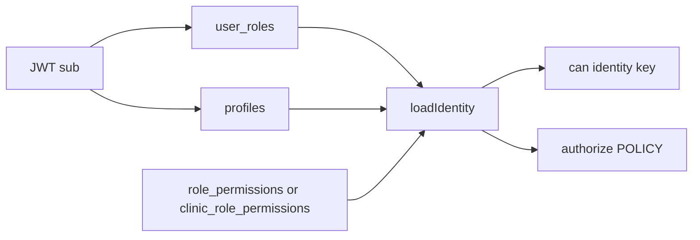
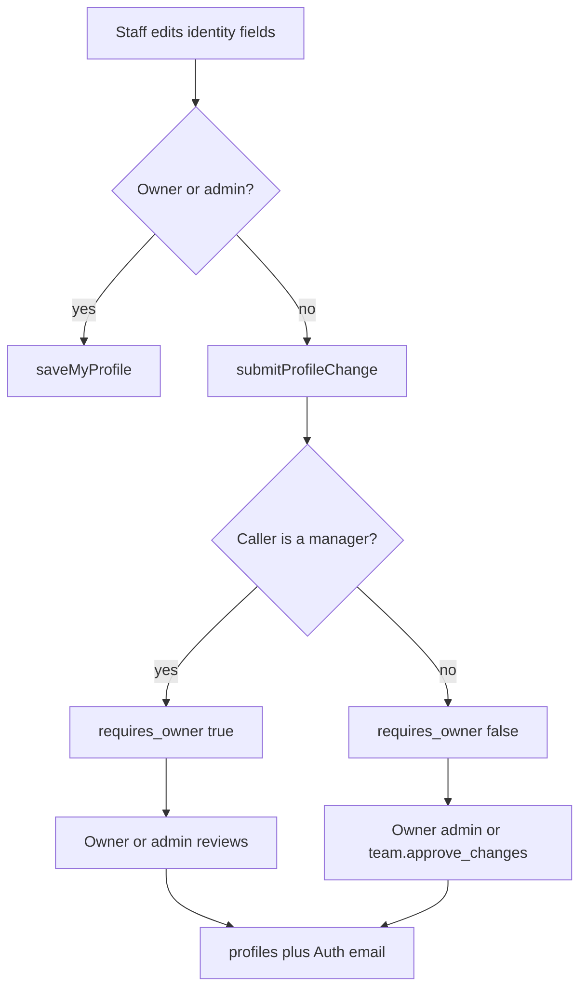

# How the app works today

This describes current behaviour in the repo, including the uncommitted profile-governance work.

## Roles and how they are checked

Login roles live in Postgres enum `app_role` and table `user_roles` (`user_id`, `role`). The values are `owner`, `admin`, `manager`, `practitioner`, `front_desk`, and `patient`. There is no separate staff id: a person is their Supabase Auth user id, and a staff record is a row in `profiles` with the same id.

Capabilities are a second layer. Keys are listed in [`src/lib/permissions.ts`](../src/lib/permissions.ts) (`PERMISSION_KEYS`). Grants are stored per clinic in `role_permissions` (built-in roles) and `clinic_role_permissions` (named access packs). A named pack is a row in `clinic_roles`; when `profiles.clinic_role_id` is set, that pack replaces the built-in role’s grants. Owner and software admin skip the tables and receive every key in code.

`can()` in [`src/lib/permissions.ts`](../src/lib/permissions.ts) is the check: owner or admin always passes; everyone else must have the key in `identity.permissions`. The UI catalogue in [`src/lib/access-catalogue.ts`](../src/lib/access-catalogue.ts) maps pages and tabs onto those keys and supplies default grants for manager, practitioner, front desk, and patient. `team.approve_changes` is off for managers by default ([`supabase/migrations/20260930000400_manager_approve_changes_opt_in.sql`](../supabase/migrations/20260930000400_manager_approve_changes_opt_in.sql)).

On the server, almost every handler calls `authorize()` in [`src/lib/auth/guards.server.ts`](../src/lib/auth/guards.server.ts), which looks up [`src/lib/auth/policy.ts`](../src/lib/auth/policy.ts). Rule kinds are `self`, `staff` (any staff role), `manager` (owner, admin, or manager), `owner`, `capability` (a specific key), `accessAdmin` (owner or admin), plus patient-self variants. Some handlers add a second check after that (earnings, documents, profile review). Postgres RLS (`is_staff`, `is_owner`, `has_role`) exists, but app traffic uses the service-role client, which bypasses RLS. Clinic isolation is the `clinicScoped` wrapper, not RLS.

`isManager` in identity means owner, admin, or the manager role. It is a management tier, not “has every permission.”

## Authentication, sessions, and who the server thinks you are

Production auth is Supabase Auth. The browser stores the access and refresh tokens in `localStorage` ([`src/integrations/supabase/client.ts`](../src/integrations/supabase/client.ts)). There is no app session cookie for the real user.

Each server function is wrapped by [`src/lib/auth/session-middleware.server.ts`](../src/lib/auth/session-middleware.server.ts). The client middleware ([`src/lib/supabase-session-middleware.ts`](../src/lib/supabase-session-middleware.ts)) attaches `Authorization: Bearer <access_token>`, refreshing if the token expires within 60 seconds. The server calls `auth.getClaims`, sets `context.userId` to the JWT `sub`, resolves `context.clinicId` from `profiles.clinic_id` or `patients.clinic_id`, and queries through a service-role client scoped to that clinic.

`getMe` ([`src/lib/clinic.functions.ts`](../src/lib/clinic.functions.ts)) is the “who am I” API. `loadIdentity` loads roles, profile, patient link, and permissions. The client caches that as `useIdentity()`. The `_authenticated` layout waits for a Supabase session, then calls `getMe`, and redirects with `canSee` if the current path is not in the catalogue for that person. That redirect is client-side only.

Owners and managers also pass an email one-time code when Resend is configured (or `AUTH_DEV_SHOW_OTP=1`). Codes live in `auth_email_otp`; a successful check lasts 12 hours. `authorize()` blocks other handlers until that check passes. Destructive actions use a separate password step-up (`auth_step_up`). Idle sign-out is 15 minutes in the browser. Revoked staff are banned in Auth and rejected by `getMe`.

Demo mode (`DEMO=1`, `npm run dev:demo`) swaps [`src/lib/clinic.functions.ts`](../src/lib/clinic.functions.ts) for [`src/lib/clinic.functions.demo.ts`](../src/lib/clinic.functions.demo.ts). The server then trusts a `demo_role` cookie, not the JWT. MFA and idle logout are off.

## Staff / team member data model

There is no `staff` or `team` table. A team member is Auth user + `profiles` + one non-patient `user_roles` row.

`profiles` columns:

- `id` (same as Auth user id), `clinic_id`, `clinic_role_id`
- `full_name`, `job_title`, `avatar_url`
- `registration_body`, `registration_number`, `registration_expiry`
- `insurance_provider`, `insurance_expiry`, `qualifications`
- `working_arrangement`, `commission_rate` (0–100; revoked from the `authenticated` role, so only the service role reads it)
- `created_at`, `updated_at`

Work email is `auth.users.email`, not a profile column. Sign-in time and ban state also live on the Auth user.

Related tables:

- `user_roles` — `id`, `user_id`, `role`, `created_at`
- `role_permissions` / `clinic_roles` / `clinic_role_permissions` — capability grants
- `profile_change_requests` — proposed identity fields, `work_email`, `working_arrangement`, `requires_owner`, `status` (`pending` / `approved` / `declined`), reviewer fields
- `staff_documents` — metadata for HR files (`user_id`, `title`, `category`, `path`, `file_name`, `file_type`, `file_size`, `created_at`); bytes live in the `staff-files` bucket
- `ex_team_members` — 90-day archive after revoke (name, email, role, commission, registration, `retain_until`)
- `user_notes` — a personal note, not an HR file
- `treatments.commission_rate_snapshot` — the rate frozen when a treatment was recorded

Invites are not a table. `inviteStaffMember` uses Supabase `inviteUserByEmail`, then upserts `profiles` and `user_roles`. `createStaffAccount` creates the Auth user with a password (owner only).

`listTeam` returns an aggregated view: user id, role, named pack, email, name, job title, registration, whether they have signed in, commission (only if owner or `reports.commission`), and a compliance summary (essential docs on file, registration and insurance expiry).

## My Profile

Staff My Profile is [`src/routes/_authenticated/profile.tsx`](../src/routes/_authenticated/profile.tsx) at `/profile`. `/earnings` redirects there. Patient “my record” routes are a different product.

The page calls:

- `getMe` via `useIdentity()` — roles, permissions, profile subset, email, MFA flags, clinic flags
- `getMyProfile` — requires `view.profile`. Returns `profile` (identity fields, no commission), `email`, `isOwner`, `isManager`, `canSelfApply`, `requiresOwner`, `hasSeparateManager`, and up to 20 of the caller’s `profile_change_requests`
- `saveMyInstantProfile` — writes insurance provider, insurance expiry, and qualifications immediately. Returns `{ ok: true }`
- `saveMyProfile` — owner or admin only. Writes name, job title, registration, working arrangement, insurance, qualifications, and optionally Auth email. Returns `{ ok: true }`
- `submitProfileChange` — everyone else. Inserts a request. Returns `{ ok: true }`

Tabs in [`src/components/profile-account-tabs.tsx`](../src/components/profile-account-tabs.tsx):

- Performance, shown when the person is a practitioner or the owner. Calls `getMyEarnings` with `{ from, to }` from the period picker (default is the trailing 12 months)
- Security. Calls `listMySessions`, `revokeOtherSessions`, `changeOwnPassword`, `sendPasswordEmailCode`
- Documents. Calls `listMyDocuments`, `addMyDocument`, `deleteMyDocument`, and `setMyAvatar` after a direct Storage upload

## Earnings

Per-day and per-month figures are not stored. `getMyEarnings` loads treatments for that practitioner in the selected range (`price`, `performed_at`, `commission_rate_snapshot`, linked appointment) and appointments (`payment_status`). [`src/lib/earnings.server.ts`](../src/lib/earnings.server.ts) `buildStats` and [`src/lib/metrics/money.ts`](../src/lib/metrics/money.ts) `collectedFor` compute the numbers in memory.

A line’s share is `price × (snapshot rate, or the current profile rate if there is no snapshot) / 100`. Collected money follows the appointment: full price if `paid`, deposit percent (clinic setting, default 30) if `deposit_paid`, zero otherwise. A treatment with no appointment counts as paid. The API returns practitioner share only: earned, collected, outstanding, booked-ahead, rate, averages, treatment and patient counts, retention, attendance, and a flat `lines` array. It does not return clinic revenue.

The UI groups those lines. If the range is longer than 45 days, [`periodGroupsByMonth`](../src/components/period-picker.tsx) buckets them by month; shorter ranges bucket by day. The clinic Performance page is separate: `getPractitionerPerformance` (requires `reports.performance`) and `buildTrend`, which buckets by day under 62 days and by month above that. Money on that page is stripped unless the caller has `reports.commission`.

`getMyEarnings` is policy `staff`, then the handler requires `view.earnings` for your own figures, or `isManager` to pass another `userId`.

## Documents

Two systems.

Patient consents are rows in `documents` (body text, status `draft` → `sent` → `signed`, `access_token`, signature fields). `sendDocument` (capability `documents.send`) inserts the row and enqueues email. The patient opens `/d/$token`, which calls `GET /api/documents/access/$token` with no session. Signing is `signDocumentByToken` or in-clinic `completeConsentInClinic`. A trigger in [`supabase/migrations/20260826002000_documents_signed_immutable.sql`](../supabase/migrations/20260826002000_documents_signed_immutable.sql) blocks updates and deletes once signed, including for the service role. Resend may only refresh send and expiry times.

Staff HR files are uploaded by the browser to the private `staff-files` bucket at `{userId}/documents/{uuid}-{filename}`, then `addMyDocument` stores metadata. Categories are the ten essential types in [`src/lib/staff-doc-compliance.ts`](../src/lib/staff-doc-compliance.ts) (right to work, DBS, JCCP, statutory registration, indemnity, BLS, infection control, safeguarding, GDPR, contract) plus `other`. Opening a file uses a one-hour signed URL from the browser client.

Who can read staff files:

- `listMyDocuments`: self, or anyone `isManager` considers a manager (via the admin client, so RLS is skipped)
- `getStaffProfile`: document rows only for self or manager; other staff get category names for the compliance count, not file paths
- `deleteMyDocument`: only the owner of the row
- Storage RLS: the folder must be your own user id, or you must be clinic `owner`. A manager who is not the owner can be given metadata by the server function and still fail to open the file

## Change requests and manager review

Identity fields (name, job title, registration, work email, working arrangement) are not free-typed for most people. Rules are in [`src/lib/profile-change-policy.ts`](../src/lib/profile-change-policy.ts).

- Owner or software admin: `saveMyProfile` writes immediately
- A manager who is not the owner: `submitProfileChange` with `requires_owner = true`. Only an owner or admin can approve it
- Other staff: `submitProfileChange` with `requires_owner = false`. Approvers are owners and admins, plus anyone whose built-in role or named pack has `team.approve_changes`
- Insurance and qualifications: `saveMyInstantProfile`, no queue

On submit, the server inserts `profile_change_requests` and writes `staff_notifications` (`kind: profile_change`) to those approvers. There is no email for this.

Review is `listProfileChangeRequests` and `reviewProfileChange`, both requiring `team.approve_changes`. The list hides `requires_owner` rows from non-owners. Approve copies the fields onto `profiles` and, if present, updates Auth email, then marks the request `approved` or `declined`. The profile write and the status update are not one transaction. The Team page shows the queue when `can(identity, "team.approve_changes")`.

Direct table updates are still owner-only in RLS. Granted managers approve only through the server function and the admin client.

## Jobs, email, notifications, PDF

What exists:

- An outbox table `communications`. `enqueueCommunication` is the only write path. Rows sit `queued` until `scheduled_for`
- Drain: `POST /api/comms/drain` with bearer `COMMS_DRAIN_SECRET`, or a staff action `drainCommunications` (`comms.send`). [`src/lib/comms/dispatch.server.ts`](../src/lib/comms/dispatch.server.ts) sends email through Resend and SMS through Twilio, with backoff. Offer automation runs at the start of a drain
- Webhooks for Resend and Twilio
- In-app `staff_notifications` (profile changes, waiting room, alerts), readable by the recipient
- Appointment reminders are rows enqueued at booking time with a future `scheduled_for`, not a separate sweeper

What does not exist in the repo:

- Supabase Edge Functions
- A `pg_cron` schedule (the drain migration says production URL and secret must be wired outside the repo)
- A Redis-style job queue
- Server-side PDF generation. Earnings “Print / PDF” is the browser print dialog. Patient consents are stored as text, not generated PDF files

## Checks that exist only in the frontend

These are places the UI hides something while the matching server rule is only “any staff,” so a staff session can still call the function.

- Team directory. The Team page calls `listTeam` only when `can(identity, "team.view")` ([`src/routes/_authenticated/team.index.tsx`](../src/routes/_authenticated/team.index.tsx)). Policy for `listTeam` and `getStaffProfile` is `staff`. Any practitioner or receptionist can list the team and open a colleague’s profile payload. Former-team listing is different: `listExTeamMembers` does require `team.view`
- Patient list. Nav and the patients page use `view.patients`. `listPatients` is `staff`, so any staff member can list patients without that key. Patient-record tabs (photos, documents, history, contact) are hidden with `canSee`; several underlying reads are also `staff` (`getTreatmentRecord`, `listTreatmentPlans`, `getAppointmentConsent`, `listAppointments`)
- Route guard. [`src/routes/_authenticated/route.tsx`](../src/routes/_authenticated/route.tsx) redirects when `canSee` fails. That does not run on a direct server-function call
- Shell chrome. Dashboard widgets, diary, search, dock, and alerts use `view.*` keys in the catalogue. The handlers behind them (`getDashboard` pieces, `listStaffDirectory`, `listStaffNotifications`, `getStaffChat`) are `staff`
- Access grid visibility. Staff access on Team is rendered only for the owner. `listRolePermissions` is `manager`, so a manager can fetch the grant grid even though the screen is hidden. Changing a grant still requires `accessAdmin`
- Lifetime spend on a patient header is shown only when `identity.isOwner`. `getPatient` still returns treatment prices to anyone who can load the patient, and the total is added up in the browser
- Performance tab on My Profile is shown for practitioner or owner, not for `view.earnings`. The server does enforce `view.earnings` on `getMyEarnings`, so this one is the UI being looser than a later server error, not an open API. Clinic Performance (`reports.performance`) is enforced on both sides
- Staff file download. The Documents copy says managers can open files. Listing another person’s metadata is allowed for `isManager`. The storage policy that creates the signed URL allows only the file’s owner folder or the clinic owner

UI that is stricter than the server, and is enforced when the API is called: revoke access, set password, set commission, and restore a former member are owner-only on the server. Invite is manager, with an extra rule that only the owner can invite an owner or manager. Deleting a message template is shown to managers and rejected unless the caller is owner.
