# 02 · Named clinic roles, an owner set-up question, and a rebuilt Invite staff dialog

[← 01](01-a9913cc.md) · [Index](../README.md) · [03 →](03-d15817d.md)

| | |
| --- | --- |
| Commit | `3b3d678923e8f7a0342656f1871e8ad68e31d315` · [on GitHub](https://github.com/legitzaisam/patientsys/commit/3b3d678923e8f7a0342656f1871e8ad68e31d315) |
| Parent (the "before") | `a9913cc` |
| Author | legitzaisam |
| Date | 27 September 2026 at 21:56 (London) |
| Size | 20 files, +1420 / −213 |

> **In one line:** Clinics can define their own named access packs, the owner is asked once whether the clinic has a separate manager, and inviting staff picks a role from chips.

## Commit message

> Enhance access control and role management: Introduce new clinic role and permissions structure, update access control settings to accommodate named roles, and refine staff invitation process. Adjust UI components for better role selection and permissions display. Update database types to support new role functionalities and ensure proper integration with existing systems.

## What changed, compared with the commit before

**Who sees it:** owners (set-up gate, Staff access grid, invite any level); managers (invite practitioners and receptionists only); everyone else nothing new.

- **Owner set-up gate.** The first time an owner signs in after this change, a full-screen card asks whether the clinic has a separate manager or the owner manages it themselves. The answer sets `clinics.has_separate_manager` and stamps `owner_setup_at`. Existing clinics are not trapped: the migration marks them set up. In the demo the gate does not show because the fixture clinic is already set up.
- **Named roles (access packs).** Owners can add a role such as "Skin therapist". It starts with **generic floor access** (diary, bookings, contact details, documents) and nothing clinical or financial until the owner turns capabilities on. Reserved names (owner, manager, practitioner, receptionist, admin) are refused. Packs are permission copies stored in `clinic_roles` and `clinic_role_permissions`; a staff member on a pack has `profiles.clinic_role_id` set, and the pack's grants replace the built-in role's.
- **Invite staff dialog** is rebuilt around role chips: Clinic owner, Manager (only when the clinic has a separate manager), Practitioner, Receptionist, plus any named roles, with an inline **Add a role** field. Only the owner may invite owner or manager access; a manager may invite the rest.
- **Staff access grid** gains a column per named role; the Manager column only appears when the clinic has a separate manager. The Team page shows an **Enable manager access** button when it does not, and role selects hide Manager accordingly. Member cards show the named role next to the person.

**Tests:** `e2e/clinic-setup.spec.ts` (asks whether the clinic has a separate manager; owner adds a named role that starts generic; a manager can invite but cannot see owner, manager or the access grid), `tests/unit/clinic-roles.test.ts`, `tests/unit/generic-staff-defaults.test.ts`.

**Server-only:** migration `20260930000300_clinic_setup_roles.sql`; server functions to complete set-up, create a role and set a named role's permission; `assertStaffInvite` enforces the invite rules on the server as well.

## Observed in the captures

- The **Invite** dialog changes from "Invite a team member" with an Access level row (Receptionist, Practitioner, Manager, Clinic owner) to "Invite someone" with a **Role** row (Receptionist, Practitioner, Manager, Clinic owner) and an inline **+ Add a role** action.
- The owner set-up gate does not appear in the demo because the fixture clinic is already set up with a separate manager, so the dashboard capture is unchanged.

## Before and after

Left: the app at `a9913cc`. Right: the app at `3b3d678`. Both run the demo fixture with the clock pinned to 2026-09-28T09:30:00Z. Desktop is shown inline; the iPad captures are folded underneath. Where a control did not exist before the commit, the note under the image says so.

### Team page (owner)

Scene `team` · signed in as the clinic owner

**Desktop 1440** — [before](../states/a9913cc/team--chromium-1440.jpg) · [after](../states/3b3d678/team--chromium-1440.jpg)

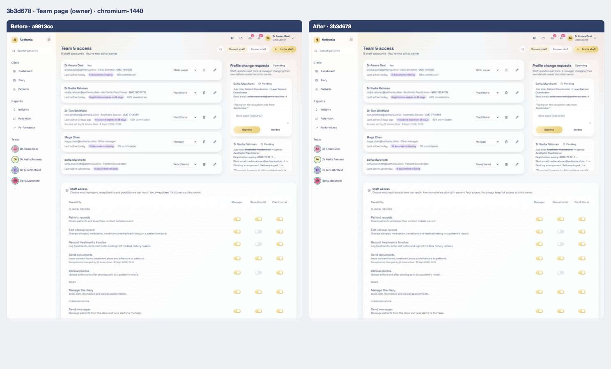

<strong>iPad landscape</strong> — <a href="../states/a9913cc/team--ipad-landscape.jpg">before</a> · <a href="../states/3b3d678/team--ipad-landscape.jpg">after</a>

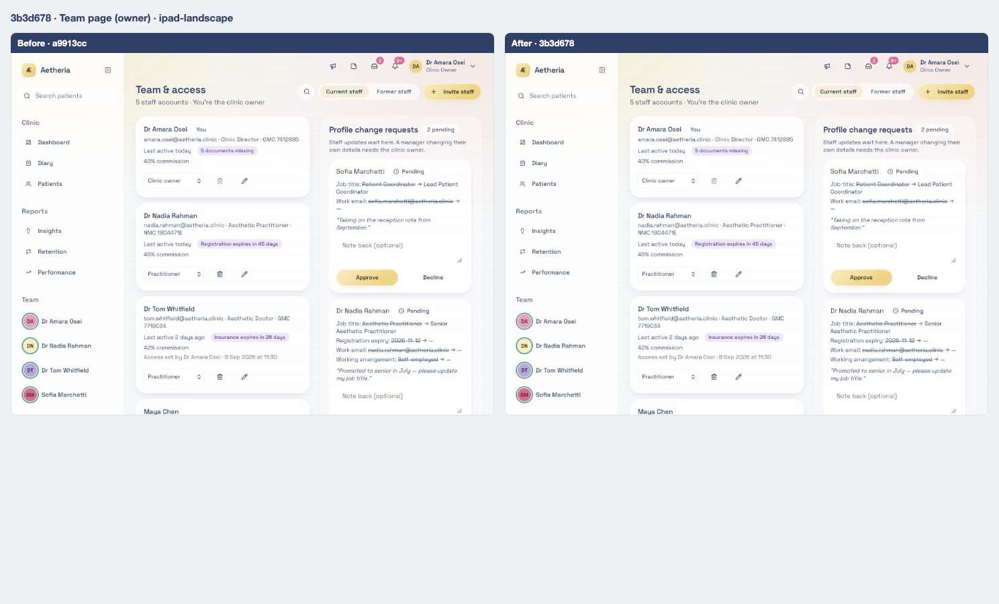

<strong>iPad portrait</strong> — <a href="../states/a9913cc/team--ipad-portrait.jpg">before</a> · <a href="../states/3b3d678/team--ipad-portrait.jpg">after</a>

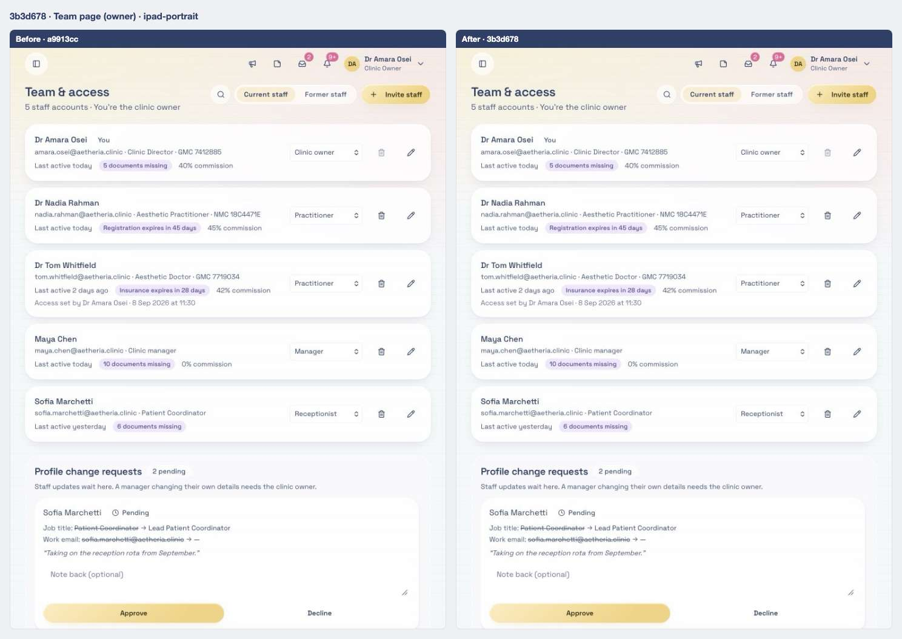

### Team page with every access panel expanded

Scene `team-access` · signed in as the clinic owner

**Desktop 1440** — [before](../states/a9913cc/team-access--chromium-1440.jpg) · [after](../states/3b3d678/team-access--chromium-1440.jpg)

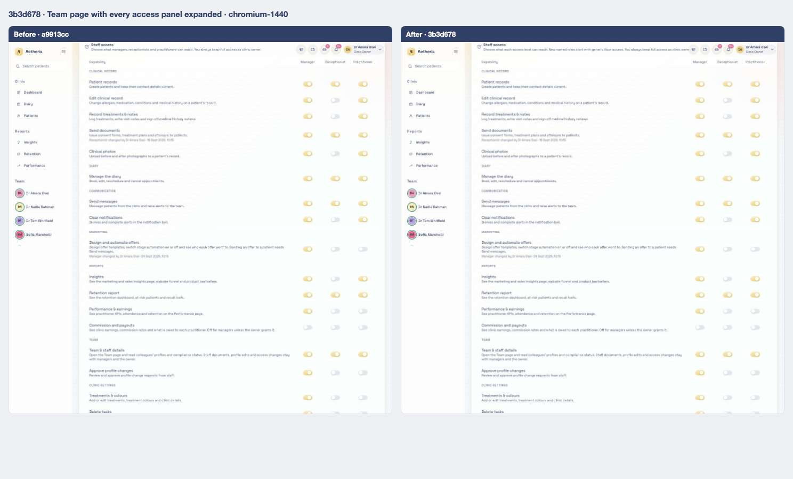

<strong>iPad landscape</strong> — <a href="../states/a9913cc/team-access--ipad-landscape.jpg">before</a> · <a href="../states/3b3d678/team-access--ipad-landscape.jpg">after</a>

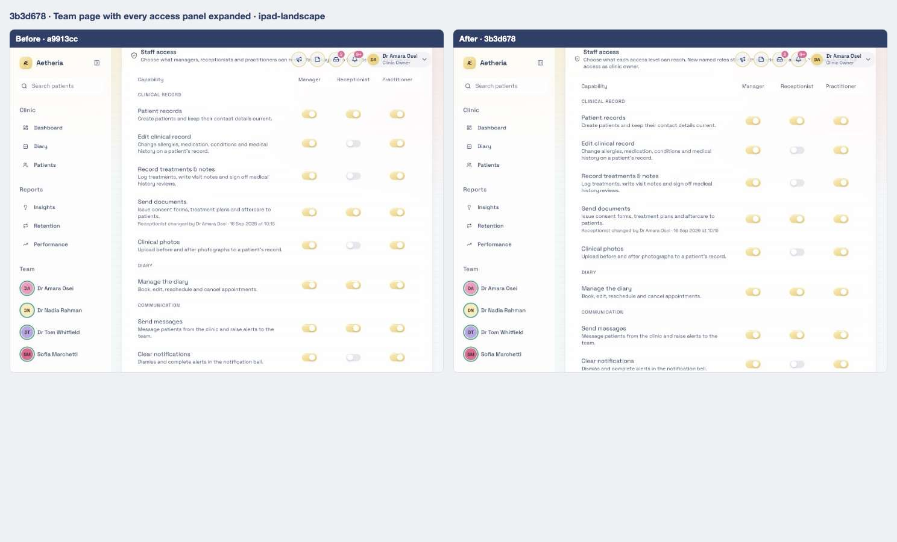

<strong>iPad portrait</strong> — <a href="../states/a9913cc/team-access--ipad-portrait.jpg">before</a> · <a href="../states/3b3d678/team-access--ipad-portrait.jpg">after</a>

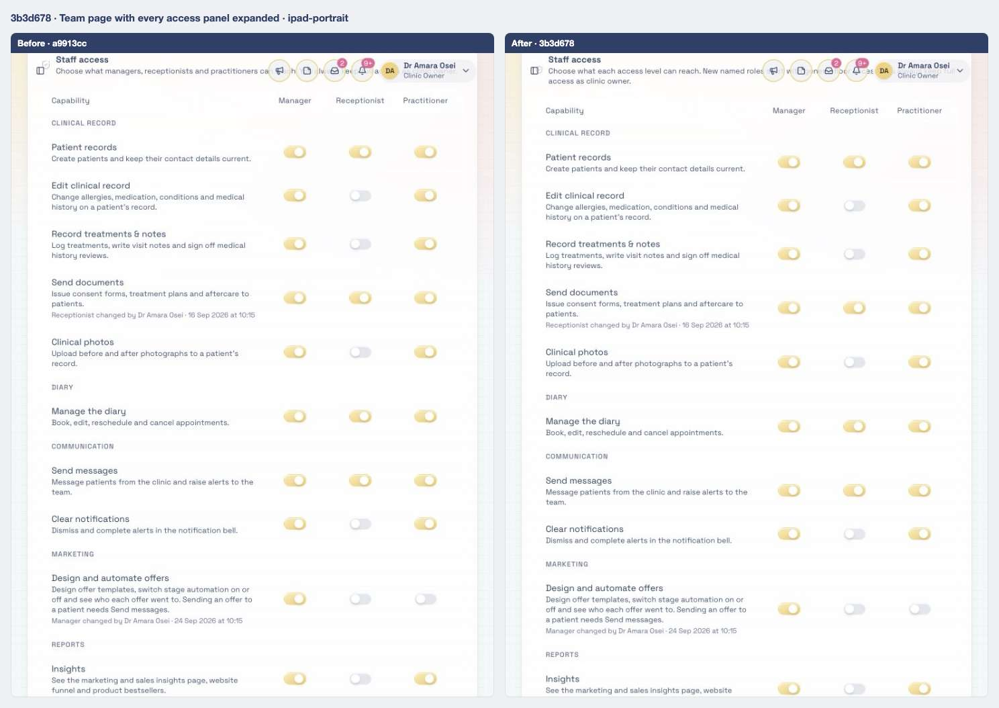

### Invite staff dialog

Scene `invite-staff` · signed in as the clinic owner

**Desktop 1440** — [before](../states/a9913cc/invite-staff--chromium-1440.jpg) · [after](../states/3b3d678/invite-staff--chromium-1440.jpg)

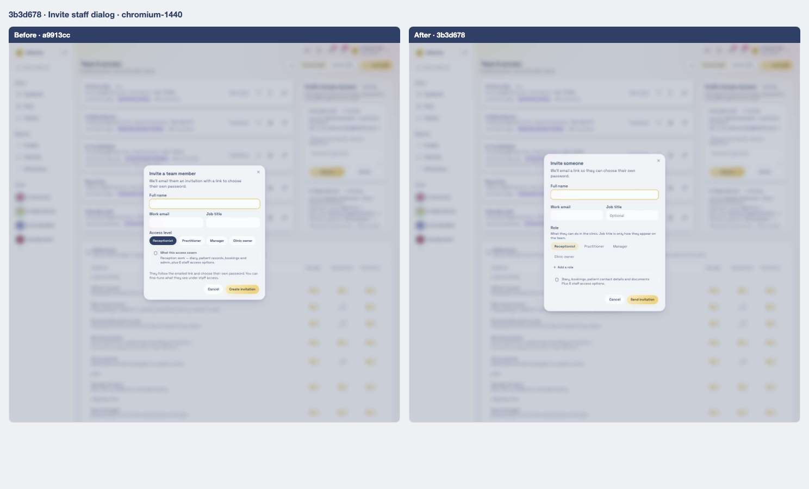

<strong>iPad landscape</strong> — <a href="../states/a9913cc/invite-staff--ipad-landscape.jpg">before</a> · <a href="../states/3b3d678/invite-staff--ipad-landscape.jpg">after</a>

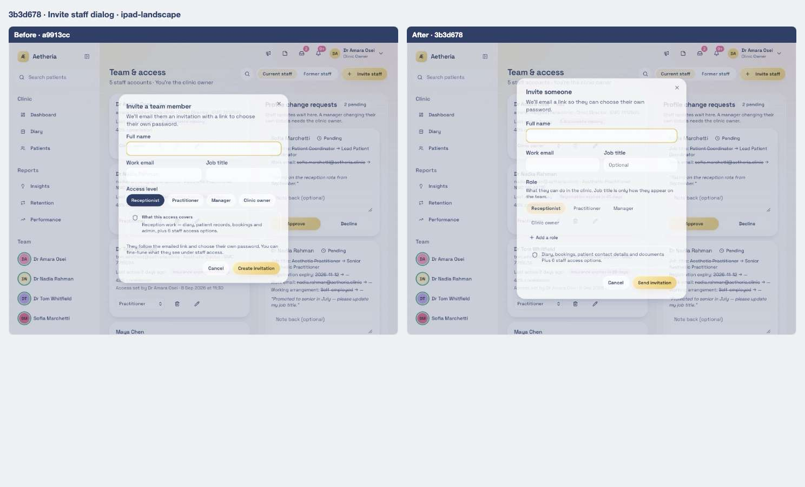

<strong>iPad portrait</strong> — <a href="../states/a9913cc/invite-staff--ipad-portrait.jpg">before</a> · <a href="../states/3b3d678/invite-staff--ipad-portrait.jpg">after</a>

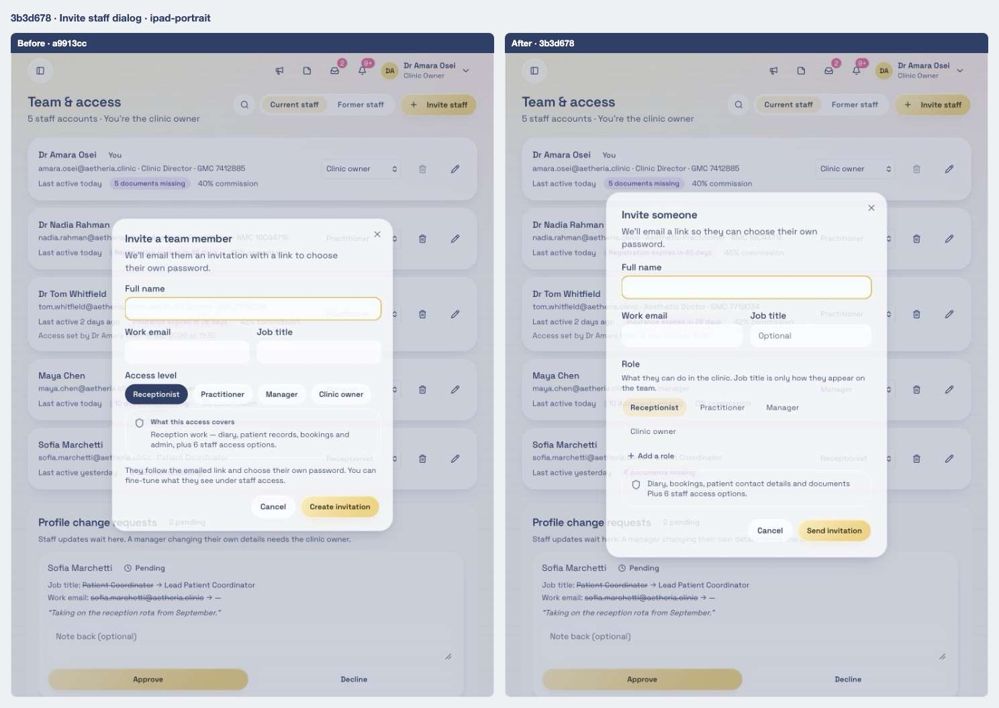

### Owner dashboard

Scene `dashboard-owner` · signed in as the clinic owner

**Desktop 1440** — [before](../states/a9913cc/dashboard-owner--chromium-1440.jpg) · [after](../states/3b3d678/dashboard-owner--chromium-1440.jpg)

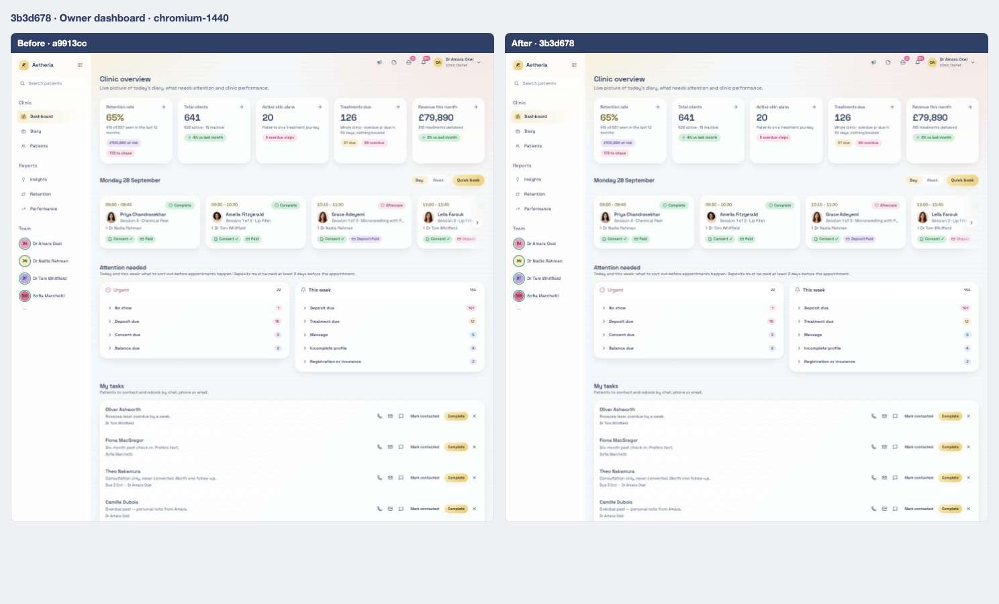

<strong>iPad landscape</strong> — <a href="../states/a9913cc/dashboard-owner--ipad-landscape.jpg">before</a> · <a href="../states/3b3d678/dashboard-owner--ipad-landscape.jpg">after</a>

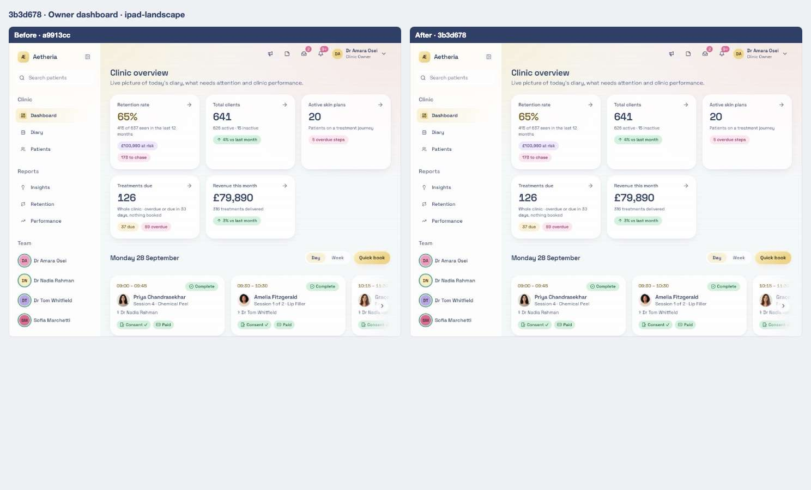

<strong>iPad portrait</strong> — <a href="../states/a9913cc/dashboard-owner--ipad-portrait.jpg">before</a> · <a href="../states/3b3d678/dashboard-owner--ipad-portrait.jpg">after</a>

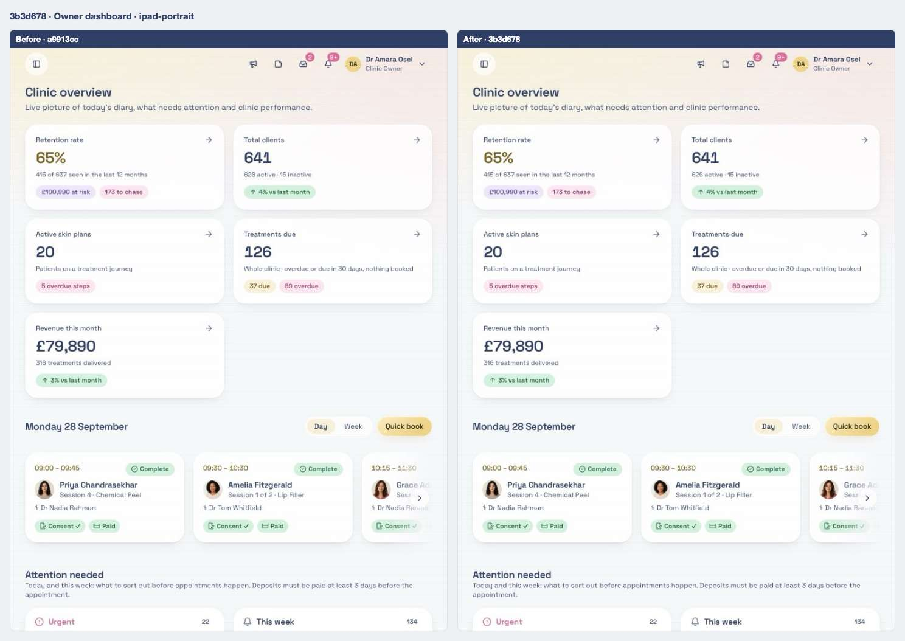

## Files

<strong>Components</strong> · 3 files, +401 / −157

| File | + | − |
| ---- | -: | -: |
| `src/components/access-control-settings.tsx` | 67 | 37 |
| `src/components/invite-staff-dialog.tsx` | 231 | 120 |
| `src/components/owner-setup-gate.tsx` | 103 | 0 |

<strong>Routes (pages)</strong> · 2 files, +59 / −3

| File | + | − |
| ---- | -: | -: |
| `src/routes/_authenticated/route.tsx` | 6 | 0 |
| `src/routes/_authenticated/team.index.tsx` | 53 | 3 |

<strong>Library and server functions</strong> · 10 files, +729 / −52

| File | + | − |
| ---- | -: | -: |
| `src/integrations/supabase/types.ts` | 90 | 0 |
| `src/lib/access-catalogue.ts` | 46 | 1 |
| `src/lib/auth/clinic-scope.server.ts` | 2 | 0 |
| `src/lib/auth/guards.server.ts` | 55 | 14 |
| `src/lib/auth/policy.ts` | 6 | 2 |
| `src/lib/clinic-roles.ts` | 40 | 0 |
| `src/lib/clinic.functions.demo.ts` | 209 | 17 |
| `src/lib/clinic.functions.ts` | 259 | 18 |
| `src/lib/demo/data.ts` | 7 | 0 |
| `src/lib/validation/schemas.ts` | 15 | 0 |

<strong>Database migrations</strong> · 1 file, +100 / −0

| File | + | − |
| ---- | -: | -: |
| `supabase/migrations/20260930000300_clinic_setup_roles.sql` | 100 | 0 |

<strong>End-to-end tests</strong> · 2 files, +69 / −1

| File | + | − |
| ---- | -: | -: |
| `e2e/clinic-setup.spec.ts` | 68 | 0 |
| `e2e/fixtures.ts` | 1 | 1 |

<strong>Unit tests</strong> · 2 files, +62 / −0

| File | + | − |
| ---- | -: | -: |
| `tests/unit/clinic-roles.test.ts` | 35 | 0 |
| `tests/unit/generic-staff-defaults.test.ts` | 27 | 0 |

[← 01](01-a9913cc.md) · [Index](../README.md) · [03 →](03-d15817d.md)
