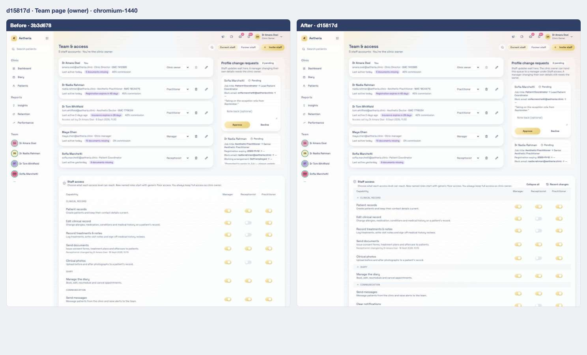
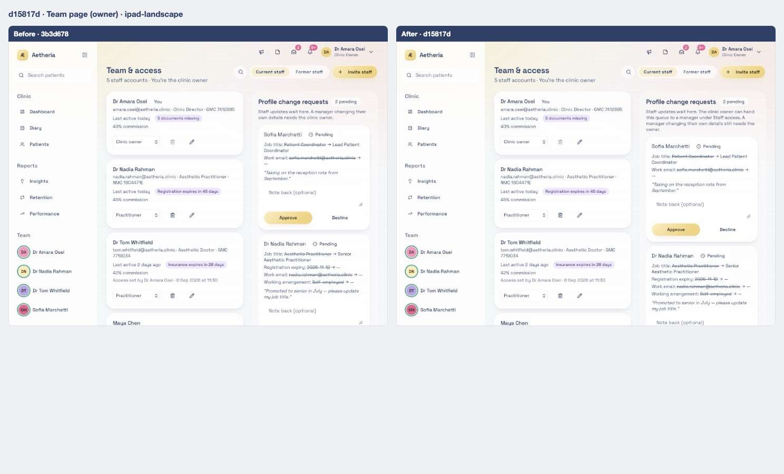
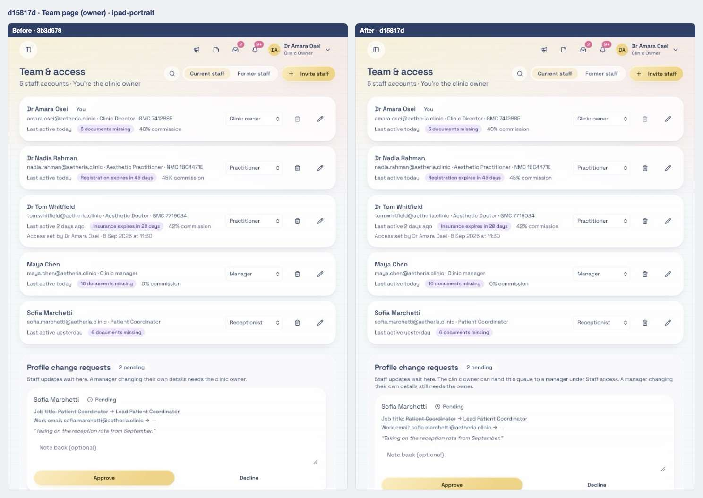
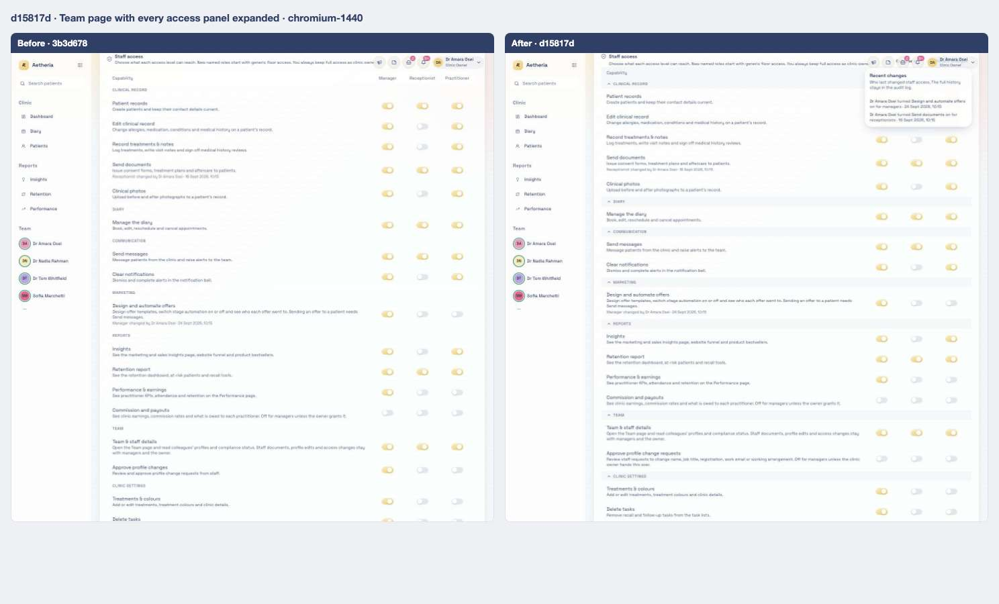
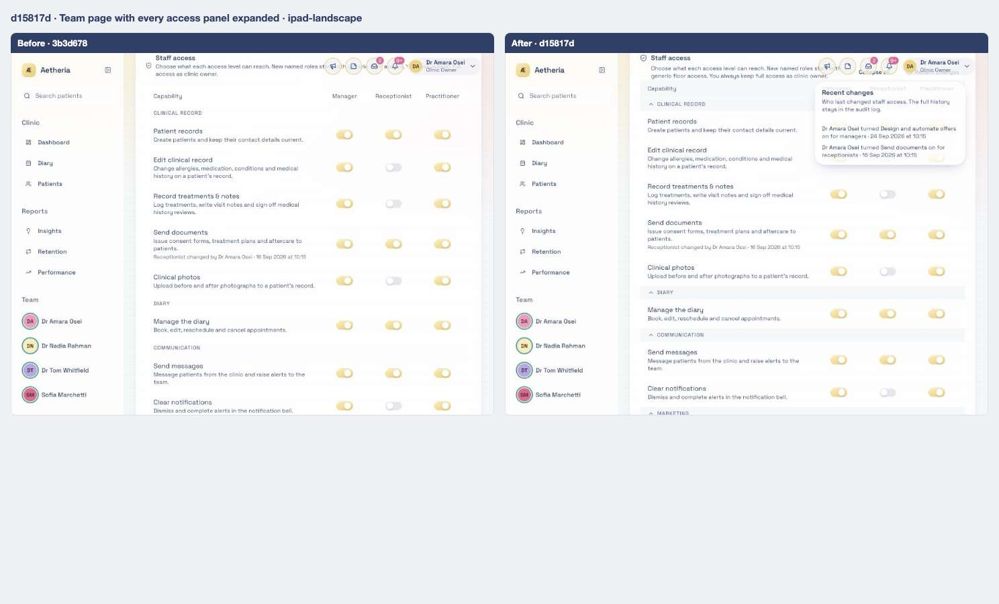
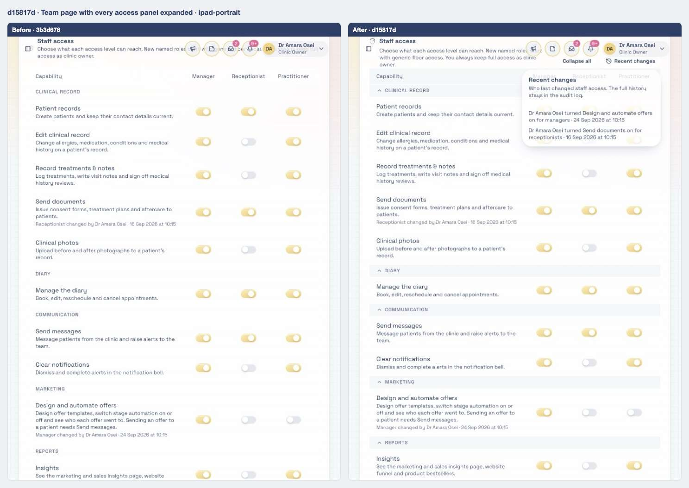
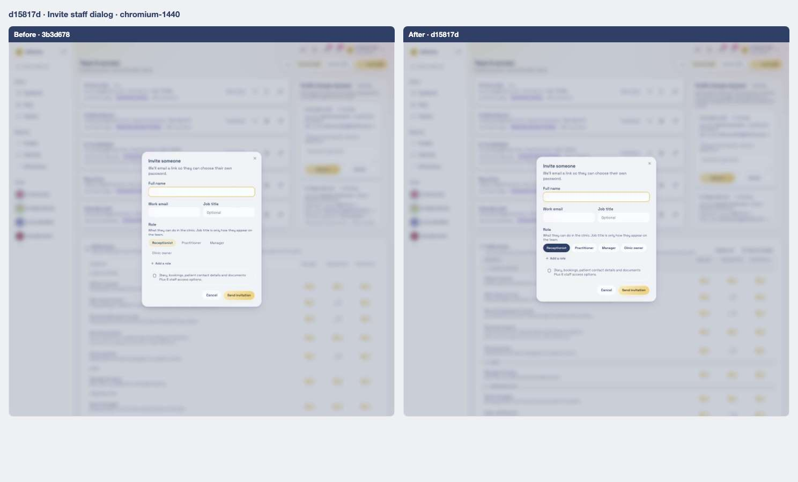
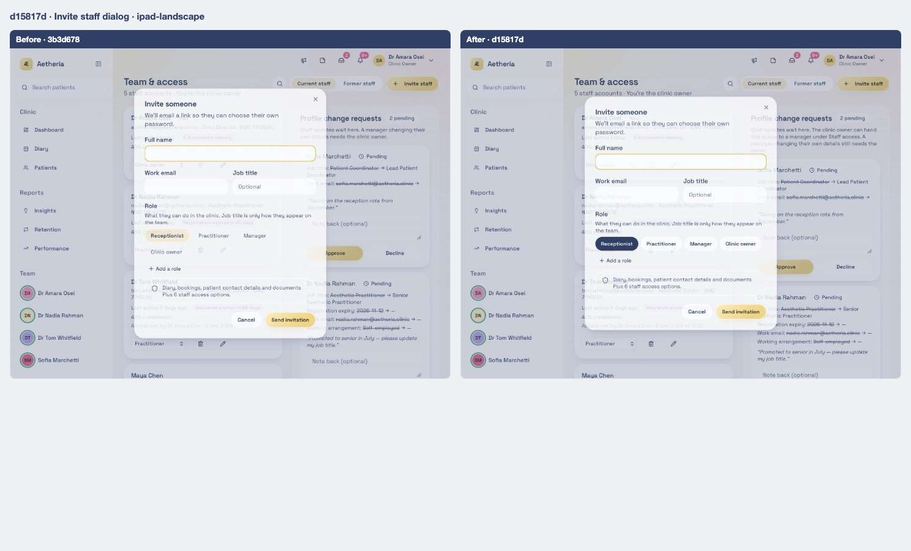
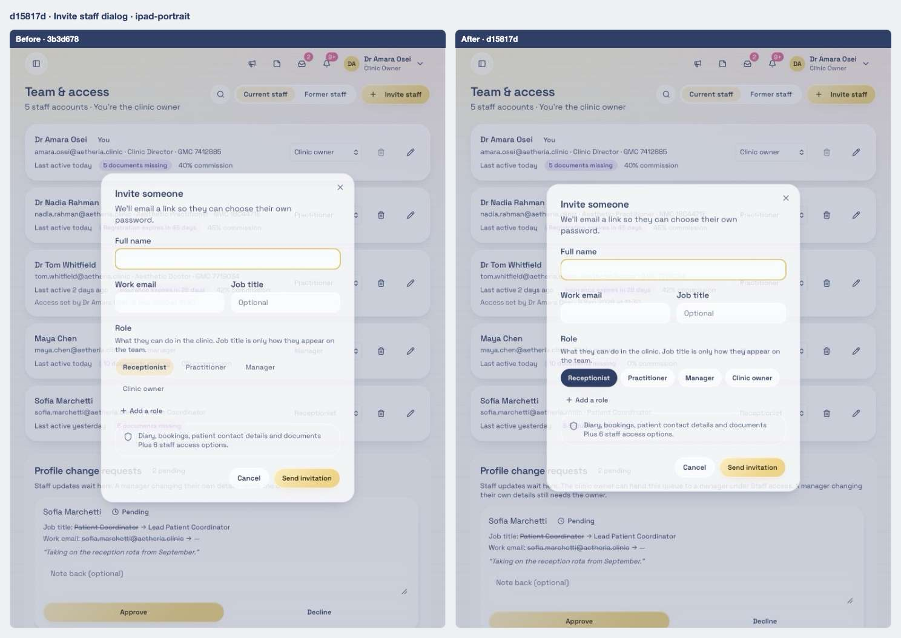

# 03 · Profile change approvals can be handed to managers; Staff access gets groups and a change log

[← 02](02-3b3d678.md) · [Index](../README.md) · [04 →](04-20a1e58.md)

| | |
| --- | --- |
| Commit | `d15817dcdf2e2d6ed8b5e5ad2342502595598f99` · [on GitHub](https://github.com/legitzaisam/patientsys/commit/d15817dcdf2e2d6ed8b5e5ad2342502595598f99) |
| Parent (the "before") | `3b3d678` |
| Author | legitzaisam |
| Date | 27 September 2026 at 22:37 (London) |
| Size | 15 files, +525 / −127 |

> **In one line:** Approving staff profile changes stays with the owner unless the owner grants it, approvers are notified accordingly, and the Staff access panel is reorganised into collapsible groups with a Recent changes popover.

## Commit message

> Implement profile change request approval system: Introduce functionality for owners to grant profile change request approvals to managers, update UI components for better visibility of approval status, and refine access control settings. Adjust tests to validate new behavior and ensure proper integration with existing role management. Update permissions and documentation to reflect changes in approval processes.

## What changed, compared with the commit before

**Who sees it:** owners (grant the capability, see the change log); managers (see the approval queue only once granted).

- **Approve profile change requests** is now a capability the owner switches on per access level. It is **off for managers by default**; the migration turns it off wherever a manager grant was never edited by the owner, and leaves owner-made grants alone. The catalogue text explains what it covers (name, job title, registration, work email, working arrangement).
- **Who gets notified:** `profileChangeApproverIds` always includes owners and software admins, adds anyone whose role or named pack has the capability, never the requester, and keeps a manager's own request with the owner even if that manager can approve others.
- **Staff access panel:** the capability list is split into collapsible groups (all open at first), headed by **Staff access** with a shield icon and a one-line explanation that differs for owners and read-only viewers. A **Recent changes** popover lists who turned which capability on or off for which level, newest first.
- **Team page:** the approval queue appears for a manager once the grant is on (tested end to end).
- **docs/CODEBASE_MAP.md** is added: how roles, capabilities, server authorisation and clinic isolation fit together.

**Tests:** `e2e/clinic-setup.spec.ts` ("the grant starts off; turning it on shows the queue to the manager"), `tests/unit/profile-change-policy.test.ts` (owner always notified, requester never; manager only when granted; manager self-changes stay with the owner).

**Server-only:** migration `20260930000400_manager_approve_changes_opt_in.sql`.

## Observed in the captures

- The Staff access panel gains its shield heading and the capability rows are grouped; the last row of the grid, **Approve profile change requests**, is now off for Manager.

## Before and after

Left: the app at `3b3d678`. Right: the app at `d15817d`. Both run the demo fixture with the clock pinned to 2026-09-28T09:30:00Z. Desktop is shown inline; the iPad captures are folded underneath. Where a control did not exist before the commit, the note under the image says so.

### Team page (owner)

Scene `team` · signed in as the clinic owner

**Desktop 1440** — [before](../states/3b3d678/team--chromium-1440.jpg) · [after](../states/d15817d/team--chromium-1440.jpg)

<strong>iPad landscape</strong> — <a href="../states/3b3d678/team--ipad-landscape.jpg">before</a> · <a href="../states/d15817d/team--ipad-landscape.jpg">after</a>

<strong>iPad portrait</strong> — <a href="../states/3b3d678/team--ipad-portrait.jpg">before</a> · <a href="../states/d15817d/team--ipad-portrait.jpg">after</a>

### Team page with every access panel expanded

Scene `team-access` · signed in as the clinic owner

**Desktop 1440** — [before](../states/3b3d678/team-access--chromium-1440.jpg) · [after](../states/d15817d/team-access--chromium-1440.jpg)

<strong>iPad landscape</strong> — <a href="../states/3b3d678/team-access--ipad-landscape.jpg">before</a> · <a href="../states/d15817d/team-access--ipad-landscape.jpg">after</a>

<strong>iPad portrait</strong> — <a href="../states/3b3d678/team-access--ipad-portrait.jpg">before</a> · <a href="../states/d15817d/team-access--ipad-portrait.jpg">after</a>

### Invite staff dialog

Scene `invite-staff` · signed in as the clinic owner

**Desktop 1440** — [before](../states/3b3d678/invite-staff--chromium-1440.jpg) · [after](../states/d15817d/invite-staff--chromium-1440.jpg)

<strong>iPad landscape</strong> — <a href="../states/3b3d678/invite-staff--ipad-landscape.jpg">before</a> · <a href="../states/d15817d/invite-staff--ipad-landscape.jpg">after</a>

<strong>iPad portrait</strong> — <a href="../states/3b3d678/invite-staff--ipad-portrait.jpg">before</a> · <a href="../states/d15817d/invite-staff--ipad-portrait.jpg">after</a>

## Files

<strong>Components</strong> · 2 files, +163 / −105

| File | + | − |
| ---- | -: | -: |
| `src/components/access-control-settings.tsx` | 159 | 96 |
| `src/components/invite-staff-dialog.tsx` | 4 | 9 |

<strong>Routes (pages)</strong> · 1 file, +2 / −2

| File | + | − |
| ---- | -: | -: |
| `src/routes/_authenticated/team.index.tsx` | 2 | 2 |

<strong>Library and server functions</strong> · 6 files, +92 / −17

| File | + | − |
| ---- | -: | -: |
| `src/lib/access-catalogue.ts` | 2 | 2 |
| `src/lib/clinic.functions.demo.ts` | 20 | 4 |
| `src/lib/clinic.functions.ts` | 25 | 8 |
| `src/lib/demo/data.ts` | 1 | 1 |
| `src/lib/permissions.ts` | 3 | 2 |
| `src/lib/profile-change-policy.ts` | 41 | 0 |

<strong>Database migrations</strong> · 1 file, +9 / −0

| File | + | − |
| ---- | -: | -: |
| `supabase/migrations/20260930000400_manager_approve_changes_opt_in.sql` | 9 | 0 |

<strong>End-to-end tests</strong> · 2 files, +45 / −3

| File | + | − |
| ---- | -: | -: |
| `e2e/clinic-setup.spec.ts` | 34 | 0 |
| `e2e/team.spec.ts` | 11 | 3 |

<strong>Unit tests</strong> · 2 files, +42 / −0

| File | + | − |
| ---- | -: | -: |
| `tests/unit/generic-staff-defaults.test.ts` | 1 | 0 |
| `tests/unit/profile-change-policy.test.ts` | 41 | 0 |

<strong>Docs and scripts</strong> · 1 file, +172 / −0

| File | + | − |
| ---- | -: | -: |
| `docs/CODEBASE_MAP.md` | 172 | 0 |

[← 02](02-3b3d678.md) · [Index](../README.md) · [04 →](04-20a1e58.md)
