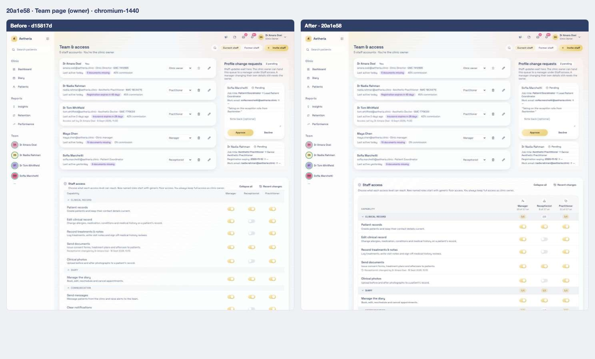
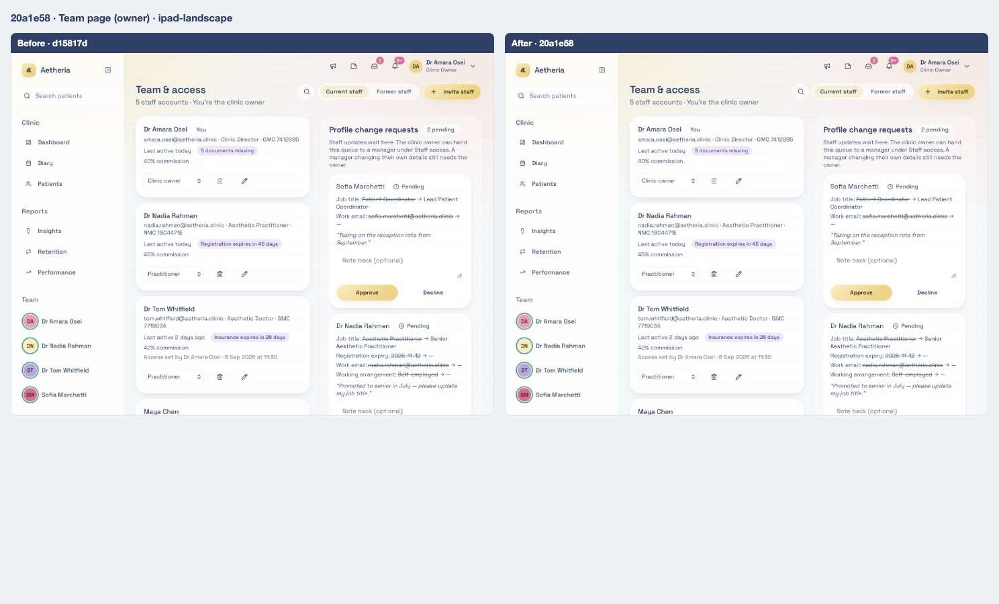
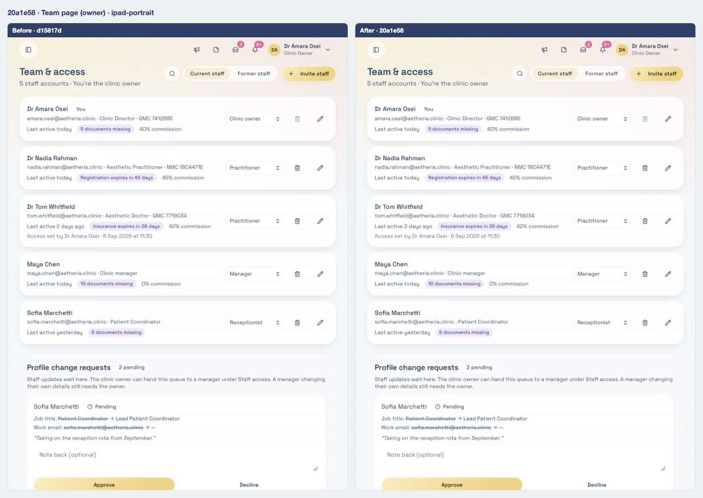
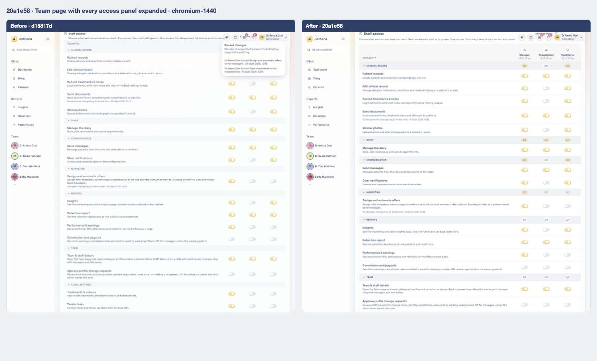
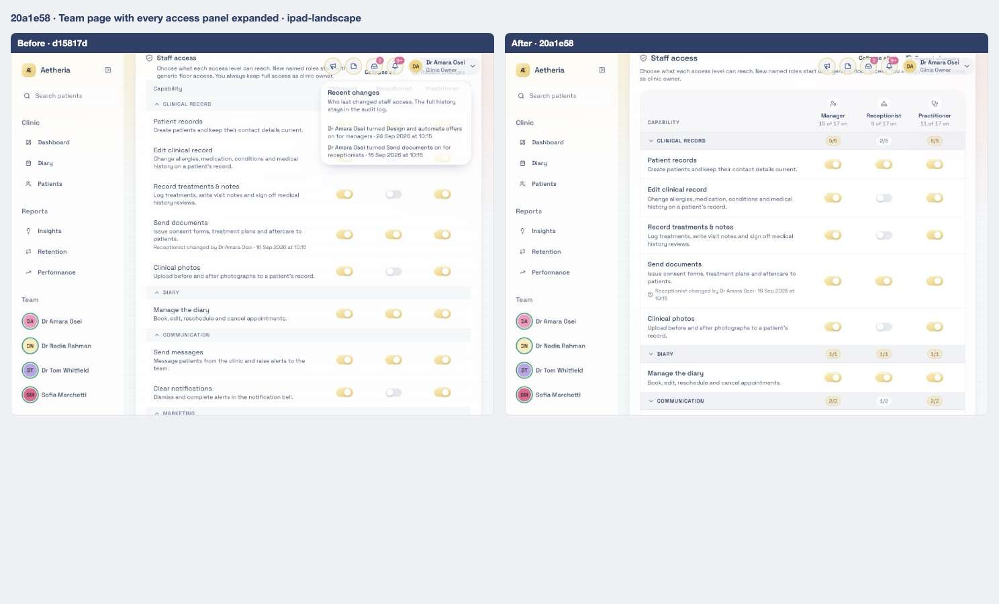
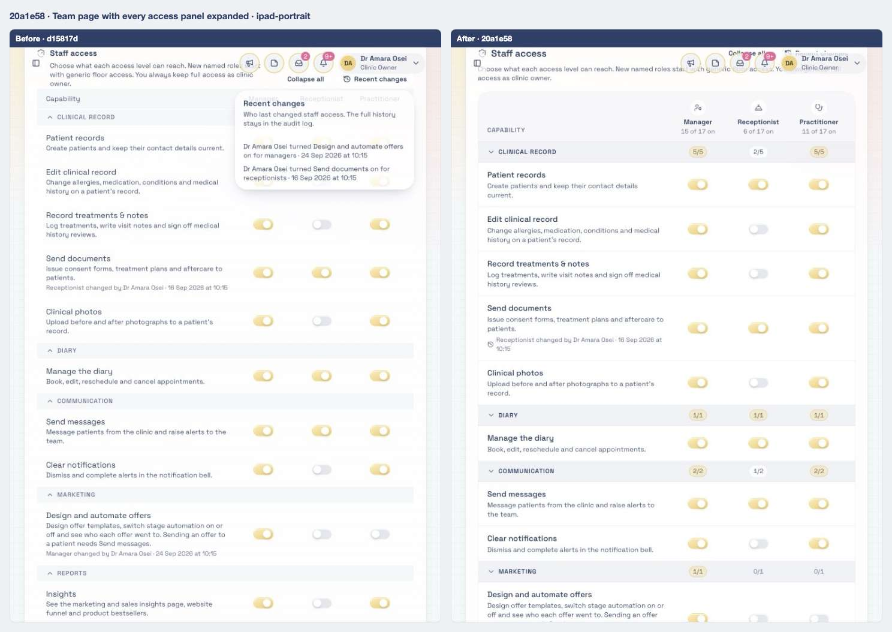

# 04 · Staff access grid: icons, counts, pinned header and animated groups; reviewed requests can be cleared

[← 03](03-d15817d.md) · [Index](../README.md) · [05 →](05-142563a.md)

| | |
| --- | --- |
| Commit | `20a1e582bf63ec7a93941aa0adf5965a98bd23cd` · [on GitHub](https://github.com/legitzaisam/patientsys/commit/20a1e582bf63ec7a93941aa0adf5965a98bd23cd) |
| Parent (the "before") | `d15817d` |
| Author | legitzaisam |
| Date | 27 September 2026 at 23:16 (London) |
| Size | 13 files, +521 / −159 |

> **In one line:** The access grid gets role icons, per-group granted counts, a header that pins while scrolling and animated collapsible groups; reviewed profile change cards show who reviewed them and can be cleared from the Team inbox.

## Commit message

> Enhance access control settings and UI: Introduce new styles for the staff access column header and collapsible panels, improving visual clarity and user interaction. Update the AccessControlSettings component to include role icons, adjust layout for better responsiveness, and implement header pinning functionality for improved usability. Refine animations for collapsible panels to enhance user experience.

## What changed, compared with the commit before

**Who sees it:** owners (grid editing), managers with the approval grant (inbox), the requester (their own history is untouched).

- **Grid header:** each access level has an icon and a "n of 17 on" count; every group row shows a granted count such as 5/5 or 2/5. The header **pins under the page toolbar** while the grid scrolls (watched with an IntersectionObserver against the main scroll container), with a shadow line when pinned.
- **Groups animate** open and closed on the height Radix measures (`.collapsible-panel` keyframes), and a **Collapse all / Expand all** button toggles them.
- **Reviewed requests in the Team inbox** show "Approved by" or "Declined by" with the reviewer's name, and a **Clear from inbox** cross removes the card for the clinic without deleting the request from the staff member's own history (`inbox_cleared_at`). Clearing needs the approval capability.
- Layout is more responsive: column widths come from the number of levels (`minmax(13rem,1fr) repeat(n, 6rem)`).

**Tests:** `e2e/clinic-setup.spec.ts` extended; `tests/unit/profile-change-policy.test.ts` covers when the approval queue is visible (off when only the owner can approve; on when a manager is granted; still off for a manager's own request).

**Server-only:** migration `20260930000500_profile_change_inbox_cleared.sql`; `dismissProfileChangeRequest` server function.

## Observed in the captures

- Column headers carry role icons and "n of 17 on"; each group header shows a granted count (5/5, 2/5); **Collapse all** and **Recent changes** sit on the panel header.

## Before and after

Left: the app at `d15817d`. Right: the app at `20a1e58`. Both run the demo fixture with the clock pinned to 2026-09-28T09:30:00Z. Desktop is shown inline; the iPad captures are folded underneath. Where a control did not exist before the commit, the note under the image says so.

### Team page (owner)

Scene `team` · signed in as the clinic owner

**Desktop 1440** — [before](../states/d15817d/team--chromium-1440.jpg) · [after](../states/20a1e58/team--chromium-1440.jpg)

<strong>iPad landscape</strong> — <a href="../states/d15817d/team--ipad-landscape.jpg">before</a> · <a href="../states/20a1e58/team--ipad-landscape.jpg">after</a>

<strong>iPad portrait</strong> — <a href="../states/d15817d/team--ipad-portrait.jpg">before</a> · <a href="../states/20a1e58/team--ipad-portrait.jpg">after</a>

### Team page with every access panel expanded

Scene `team-access` · signed in as the clinic owner

**Desktop 1440** — [before](../states/d15817d/team-access--chromium-1440.jpg) · [after](../states/20a1e58/team-access--chromium-1440.jpg)

<strong>iPad landscape</strong> — <a href="../states/d15817d/team-access--ipad-landscape.jpg">before</a> · <a href="../states/20a1e58/team-access--ipad-landscape.jpg">after</a>

<strong>iPad portrait</strong> — <a href="../states/d15817d/team-access--ipad-portrait.jpg">before</a> · <a href="../states/20a1e58/team-access--ipad-portrait.jpg">after</a>

## Files

<strong>Components</strong> · 1 file, +240 / −140

| File | + | − |
| ---- | -: | -: |
| `src/components/access-control-settings.tsx` | 240 | 140 |

<strong>Routes (pages)</strong> · 1 file, +37 / −3

| File | + | − |
| ---- | -: | -: |
| `src/routes/_authenticated/team.index.tsx` | 37 | 3 |

<strong>Library and server functions</strong> · 8 files, +186 / −15

| File | + | − |
| ---- | -: | -: |
| `src/integrations/supabase/types.ts` | 3 | 0 |
| `src/lib/auth/policy.ts` | 1 | 0 |
| `src/lib/clinic.functions.demo.ts` | 41 | 1 |
| `src/lib/clinic.functions.ts` | 71 | 14 |
| `src/lib/demo/data.ts` | 3 | 0 |
| `src/lib/profile-change-policy.ts` | 5 | 0 |
| `src/lib/validation/schemas.ts` | 2 | 0 |
| `src/styles.css` | 60 | 0 |

<strong>Database migrations</strong> · 1 file, +7 / −0

| File | + | − |
| ---- | -: | -: |
| `supabase/migrations/20260930000500_profile_change_inbox_cleared.sql` | 7 | 0 |

<strong>End-to-end tests</strong> · 1 file, +15 / −0

| File | + | − |
| ---- | -: | -: |
| `e2e/clinic-setup.spec.ts` | 15 | 0 |

<strong>Unit tests</strong> · 1 file, +36 / −1

| File | + | − |
| ---- | -: | -: |
| `tests/unit/profile-change-policy.test.ts` | 36 | 1 |

[← 03](03-d15817d.md) · [Index](../README.md) · [05 →](05-142563a.md)
