# 05 · Access history dialog; the staff bell shows new bookings only

[← 04](04-20a1e58.md) · [Index](../README.md) · [06 →](06-46dff1a.md)

| | |
| --- | --- |
| Commit | `142563a64ec3926afa67080b50579d67168d5c96` · [on GitHub](https://github.com/legitzaisam/patientsys/commit/142563a64ec3926afa67080b50579d67168d5c96) |
| Parent (the "before") | `20a1e58` |
| Author | legitzaisam |
| Date | 27 September 2026 at 23:33 (London) |
| Size | 9 files, +202 / −67 |

> **In one line:** Recent access changes move into an Access history dialog, the staff notification bell stops carrying patient messages (they live in the chat bubble), and several tests are aligned with the front desk claim flow.

## Commit message

> Enhance UI and functionality in various components: Implement scrolling behavior in profile change approval tests, update front desk claim visibility in patient portal tests, and refine access control settings with a new dialog for access history. Adjust notification bell to clarify message handling for staff and improve styling for better user experience. Update treatment workflow tests to reflect changes in patient handling and streamline access control UI for better responsiveness.

## What changed, compared with the commit before

**Who sees it:** owners (Access history); all staff (bell contents).

- **Access history** replaces the popover: a dialog listing the latest change to each capability, newest first, opened from the Staff access header. The header sticky rule is hardened so a later `position: relative` cannot undo it.
- **Notification bell, staff:** now "new bookings only". Patient messages no longer appear in the bell for staff and no longer raise a staff toast; they are read in the chat bubble. Patients still get a toast for a new message from their clinic. The subtitle "Bookings and patient messages" goes.
- **Tests:** a patient's message must reach the clinician in the chat box and not the bell; front desk sees the claim on the record and the diary card; treatment workflow and offers specs adjusted; profile approval tests scroll the main container.

## Observed in the captures

- The bell popover before lists patient messages (Leila Farouk, Zara Haddad, Sienna Clarke, Olivia Bennett) under "Bookings and patient messages"; after it reads **New bookings** and shows only the booking alert.

## Before and after

Left: the app at `20a1e58`. Right: the app at `142563a`. Both run the demo fixture with the clock pinned to 2026-09-28T09:30:00Z. Desktop is shown inline; the iPad captures are folded underneath. Where a control did not exist before the commit, the note under the image says so.

### Team page (owner)

Scene `team` · signed in as the clinic owner

**Desktop 1440** — [before](../states/20a1e58/team--chromium-1440.jpg) · [after](../states/142563a/team--chromium-1440.jpg)

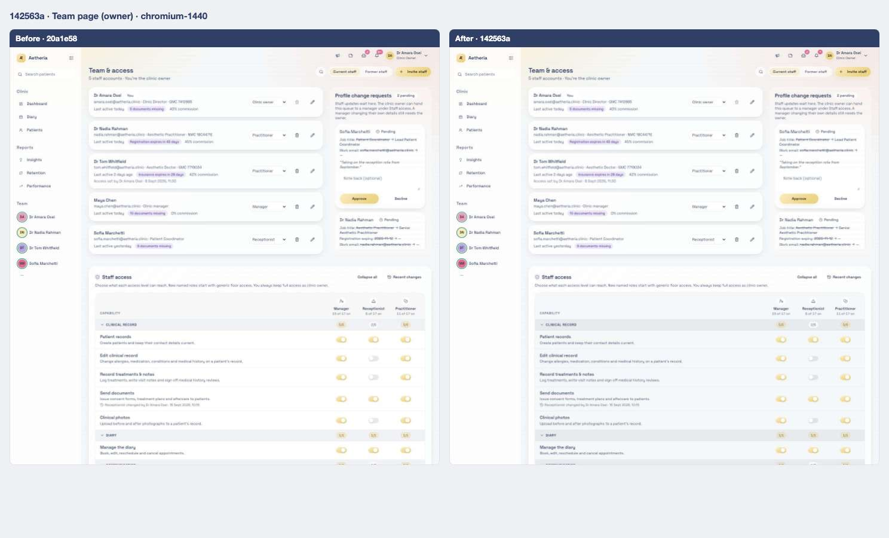

<strong>iPad landscape</strong> — <a href="../states/20a1e58/team--ipad-landscape.jpg">before</a> · <a href="../states/142563a/team--ipad-landscape.jpg">after</a>

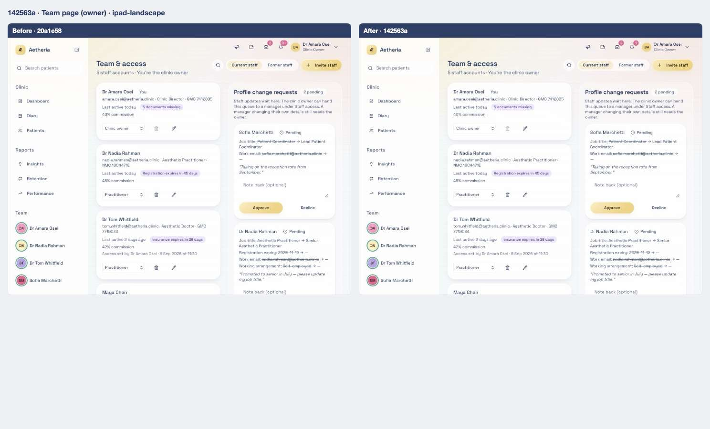

<strong>iPad portrait</strong> — <a href="../states/20a1e58/team--ipad-portrait.jpg">before</a> · <a href="../states/142563a/team--ipad-portrait.jpg">after</a>

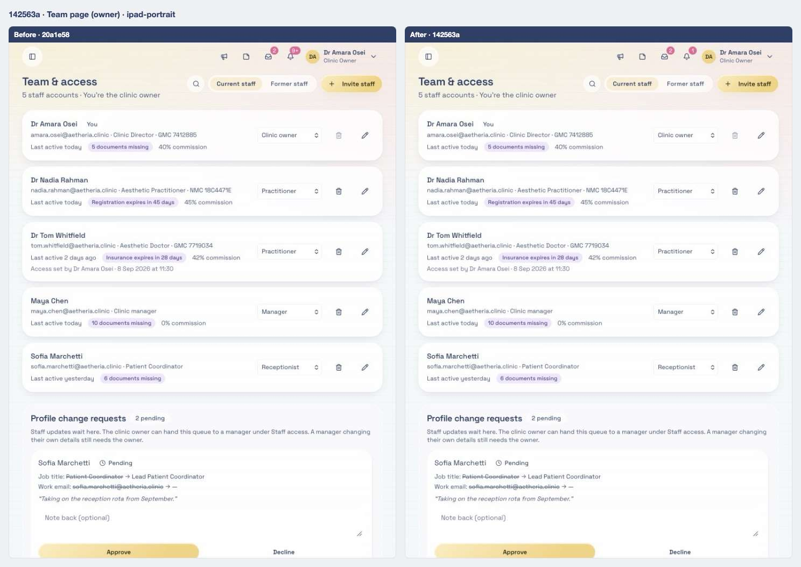

### Team page with every access panel expanded

Scene `team-access` · signed in as the clinic owner

**Desktop 1440** — [before](../states/20a1e58/team-access--chromium-1440.jpg) · [after](../states/142563a/team-access--chromium-1440.jpg)

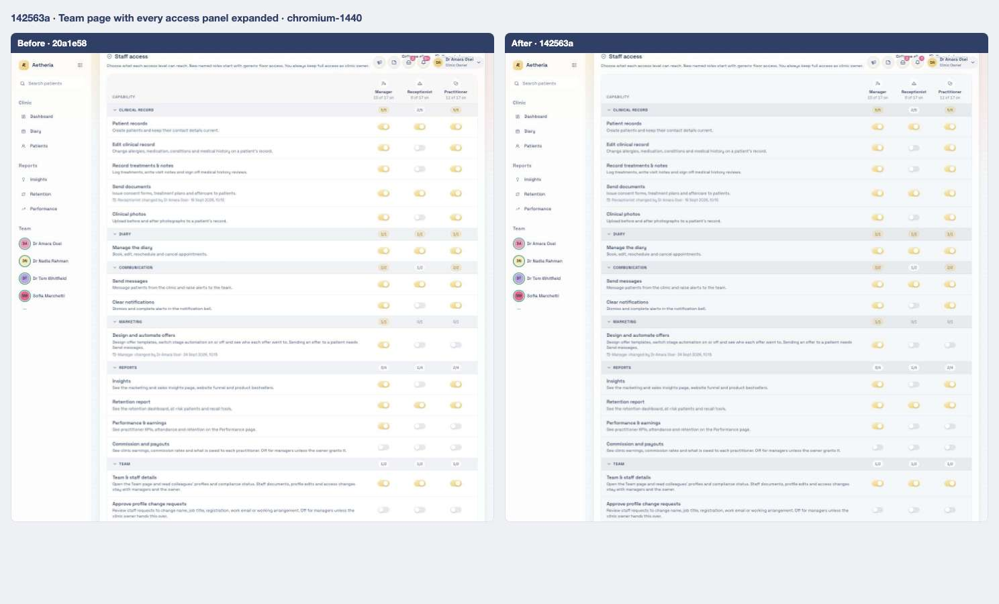

<strong>iPad landscape</strong> — <a href="../states/20a1e58/team-access--ipad-landscape.jpg">before</a> · <a href="../states/142563a/team-access--ipad-landscape.jpg">after</a>

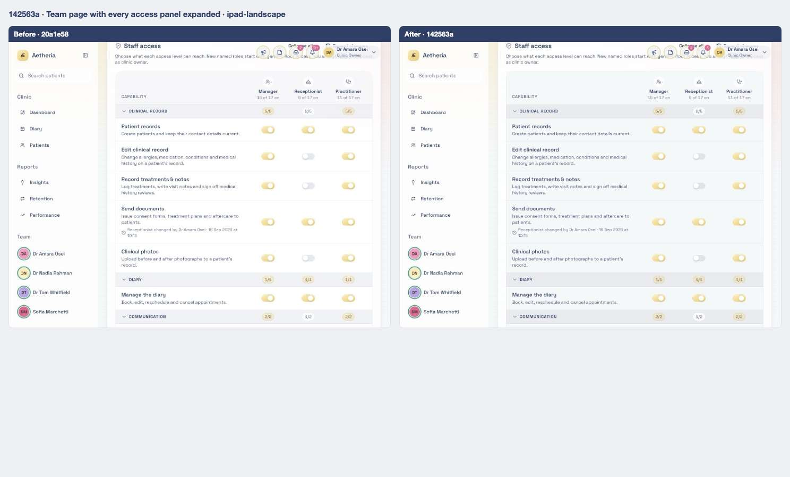

<strong>iPad portrait</strong> — <a href="../states/20a1e58/team-access--ipad-portrait.jpg">before</a> · <a href="../states/142563a/team-access--ipad-portrait.jpg">after</a>

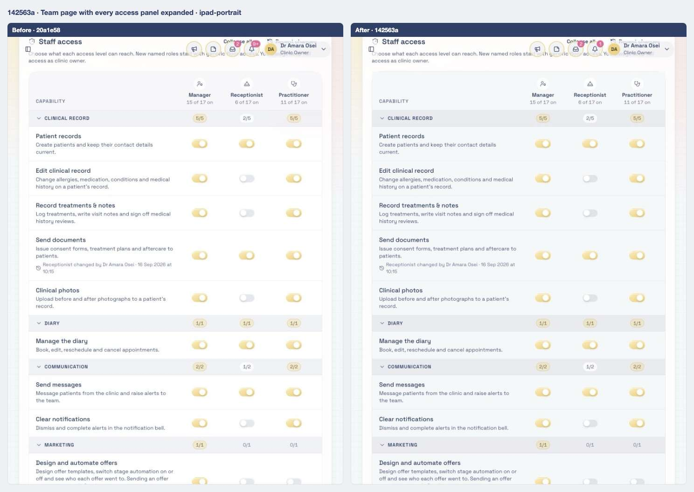

### Notification bell open

Scene `bell` · signed in as the clinic owner

**Desktop 1440** — [before](../states/20a1e58/bell--chromium-1440.jpg) · [after](../states/142563a/bell--chromium-1440.jpg)

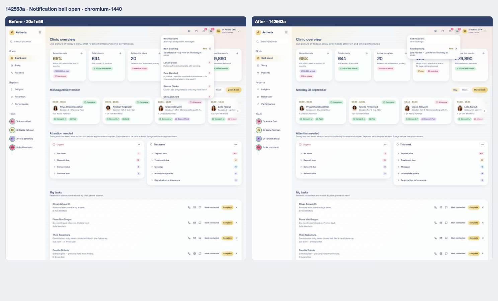

<strong>iPad landscape</strong> — <a href="../states/20a1e58/bell--ipad-landscape.jpg">before</a> · <a href="../states/142563a/bell--ipad-landscape.jpg">after</a>

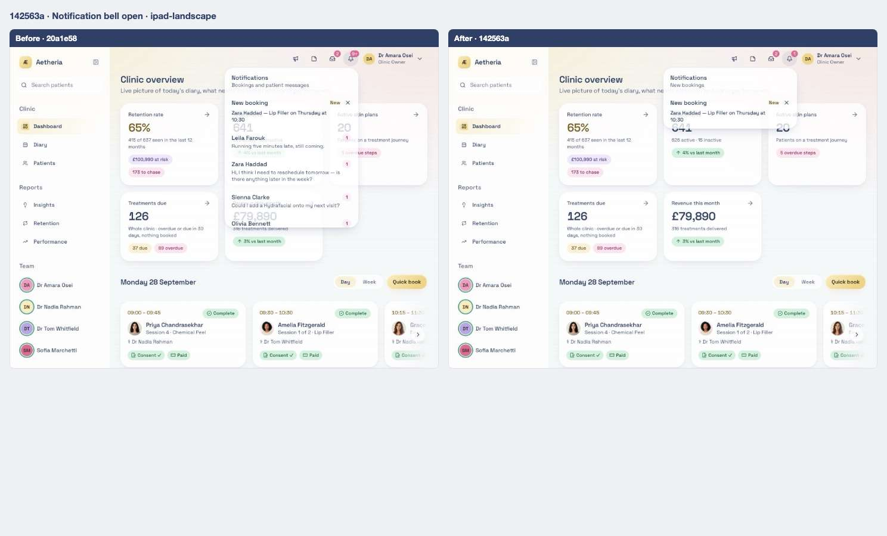

<strong>iPad portrait</strong> — <a href="../states/20a1e58/bell--ipad-portrait.jpg">before</a> · <a href="../states/142563a/bell--ipad-portrait.jpg">after</a>

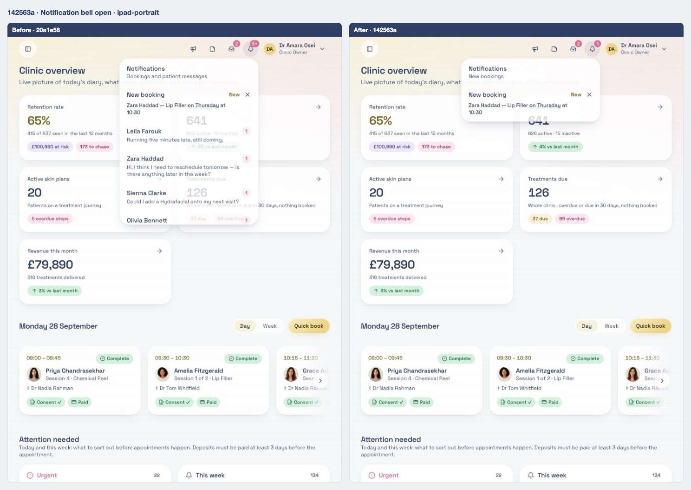

### Patient portal home

Scene `portal-home` · signed in as a patient

**Desktop 1440** — [before](../states/20a1e58/portal-home--chromium-1440.jpg) · [after](../states/142563a/portal-home--chromium-1440.jpg)

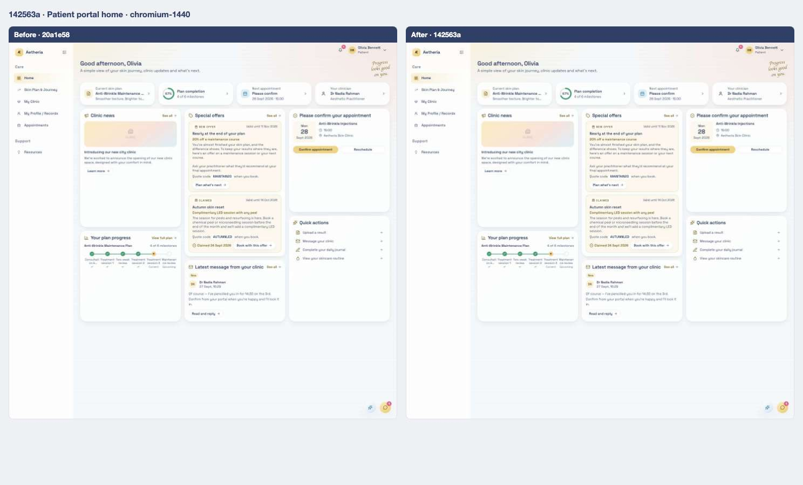

<strong>iPad landscape</strong> — <a href="../states/20a1e58/portal-home--ipad-landscape.jpg">before</a> · <a href="../states/142563a/portal-home--ipad-landscape.jpg">after</a>

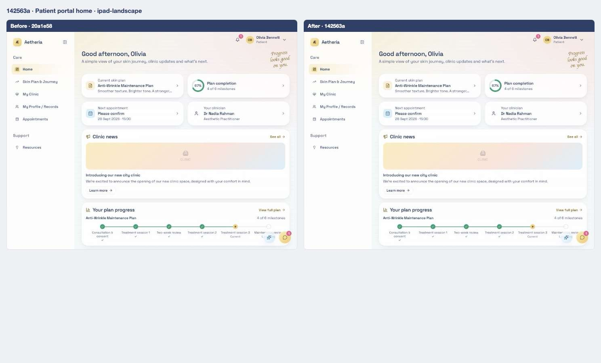

<strong>iPad portrait</strong> — <a href="../states/20a1e58/portal-home--ipad-portrait.jpg">before</a> · <a href="../states/142563a/portal-home--ipad-portrait.jpg">after</a>

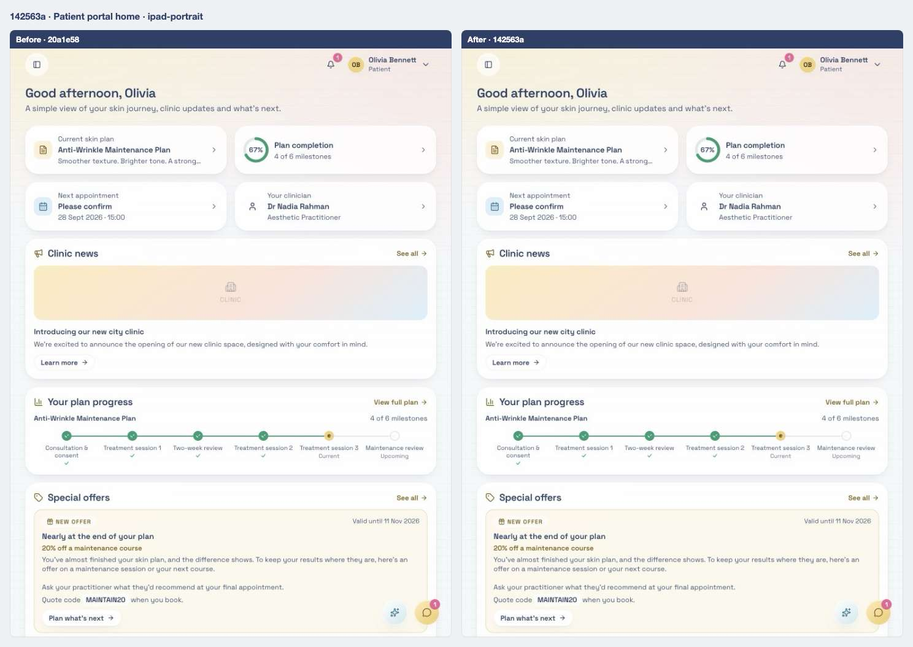

## Files

<strong>Components</strong> · 2 files, +129 / −31

| File | + | − |
| ---- | -: | -: |
| `src/components/access-control-settings.tsx` | 112 | 19 |
| `src/components/notification-bell.tsx` | 17 | 12 |

<strong>Routes (pages)</strong> · 1 file, +15 / −15

| File | + | − |
| ---- | -: | -: |
| `src/routes/_authenticated/team.index.tsx` | 15 | 15 |

<strong>Library and server functions</strong> · 1 file, +21 / −3

| File | + | − |
| ---- | -: | -: |
| `src/styles.css` | 21 | 3 |

<strong>End-to-end tests</strong> · 5 files, +37 / −18

| File | + | − |
| ---- | -: | -: |
| `e2e/clinic-setup.spec.ts` | 3 | 0 |
| `e2e/offers.spec.ts` | 4 | 7 |
| `e2e/patient-portal/sync.spec.ts` | 9 | 3 |
| `e2e/team.spec.ts` | 11 | 1 |
| `e2e/treatment-workflow.spec.ts` | 10 | 7 |

[← 04](04-20a1e58.md) · [Index](../README.md) · [06 →](06-46dff1a.md)
