# 06 · Team chat in the floating dock

[← 05](05-142563a.md) · [Index](../README.md) · [07 →](07-d625c36.md)

| | |
| --- | --- |
| Commit | `46dff1a54806d1be9a4cf8c4b8e55d7458abce5c` · [on GitHub](https://github.com/legitzaisam/patientsys/commit/46dff1a54806d1be9a4cf8c4b8e55d7458abce5c) |
| Parent (the "before") | `142563a` |
| Author | legitzaisam |
| Date | 27 September 2026 at 23:47 (London) |
| Size | 10 files, +578 / −182 |

> **In one line:** The chat window gains a Team tab for 1:1 staff conversations next to the Patients tab, opening alerts jump to the right teammate, and the toolbar inbox keeps team alerts separate from chat.

## Commit message

> Implement team chat functionality and enhance chat UI: Introduce a new team chat tab in the floating dock, allowing staff to engage in 1:1 conversations. Update the notification bell to handle team chat alerts and refine the chat window to support both team and patient threads. Adjust related components for improved user experience and ensure proper integration with existing chat functionalities.

## What changed, compared with the commit before

**Who sees it:** all staff.

- **Two tabs in the chat window:** **Team** (1:1 staff chat, opens first) and **Patients** (portal threads). The bubble shows the combined unread count; each tab shows its own. Team conversations list each colleague with their last message ("You: …") or job title; the header reads "Team messages and alerts".
- **Opening a team alert** (from the toolbar inbox or a toast) jumps to that teammate's conversation in the Team tab.
- **Toolbar inbox** (bell) lists team alerts, not team chat messages.
- **Server:** new `listStaffThreads` (staff only) returns a thread per colleague with unread counts; demo data layer implements the same.
- `sent-staff-alerts` and `staff-chat-panel` are refactored to render inside the window; the dock context tracks the open tab and thread.

**Tests:** `e2e/team-chat-dock.spec.ts` (toolbar inbox lists alerts not chat; window opens on Team and Patients holds the patient threads; opening an alert jumps to the teammate).

## Observed in the captures

- Before, the chat bubble opened straight into patient conversations with no Team tab (recorded as missing). After, the window opens on **Team** with the colleagues listed and unread counts on both tabs.
- The alerts pill is unchanged.

## Before and after

Left: the app at `142563a`. Right: the app at `46dff1a`. Both run the demo fixture with the clock pinned to 2026-09-28T09:30:00Z. Desktop is shown inline; the iPad captures are folded underneath. Where a control did not exist before the commit, the note under the image says so.

### Floating dock, chat window

Scene `dock-chat` · signed in as the clinic owner

**Desktop 1440** — [before](../states/142563a/dock-chat--chromium-1440.jpg) · [after](../states/46dff1a/dock-chat--chromium-1440.jpg)

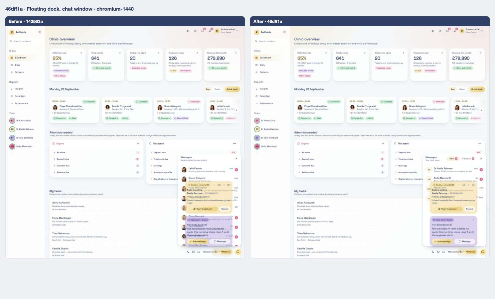

<strong>iPad landscape</strong> — <a href="../states/142563a/dock-chat--ipad-landscape.jpg">before</a> · <a href="../states/46dff1a/dock-chat--ipad-landscape.jpg">after</a>

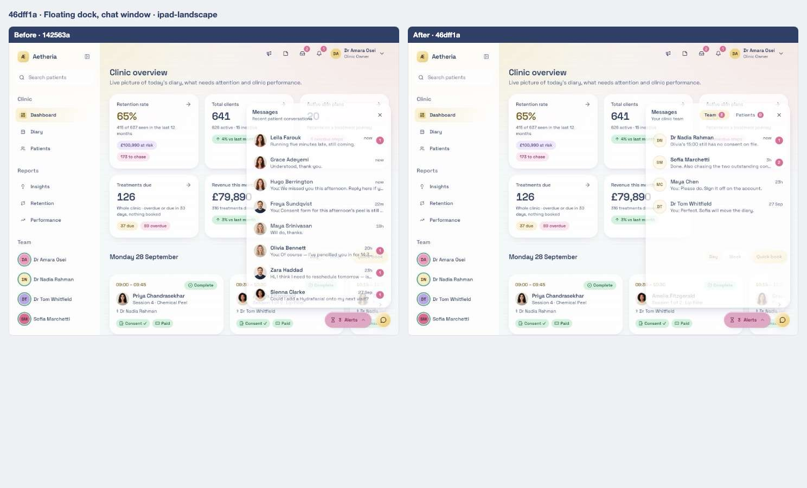

<strong>iPad portrait</strong> — <a href="../states/142563a/dock-chat--ipad-portrait.jpg">before</a> · <a href="../states/46dff1a/dock-chat--ipad-portrait.jpg">after</a>

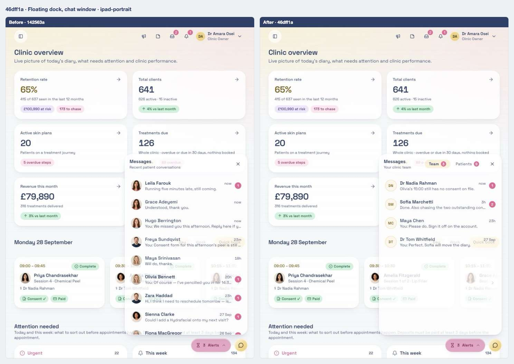

### Chat window, Team tab

Scene `dock-chat-team` · signed in as the clinic owner

**Desktop 1440** — [before](../states/142563a/dock-chat-team--chromium-1440.jpg) · [after](../states/46dff1a/dock-chat-team--chromium-1440.jpg)

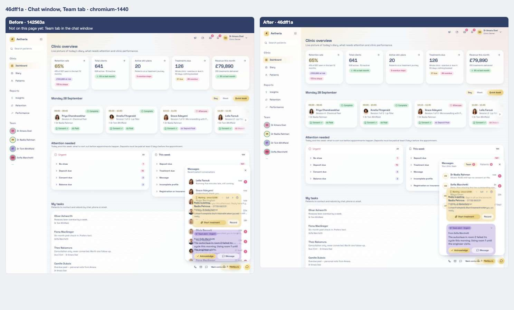

> Before: not on the page yet — Team tab in the chat window.

<strong>iPad landscape</strong> — <a href="../states/142563a/dock-chat-team--ipad-landscape.jpg">before</a> · <a href="../states/46dff1a/dock-chat-team--ipad-landscape.jpg">after</a>

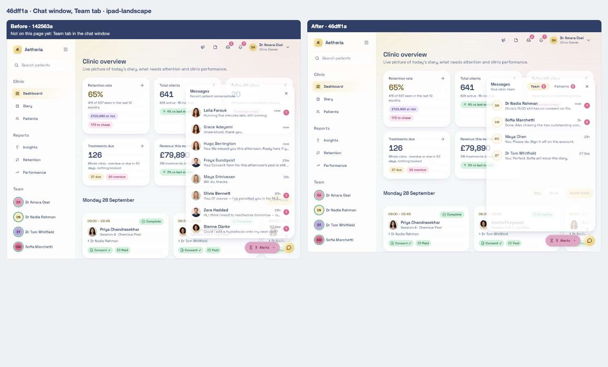

> Before: not on the page yet — Team tab in the chat window.

<strong>iPad portrait</strong> — <a href="../states/142563a/dock-chat-team--ipad-portrait.jpg">before</a> · <a href="../states/46dff1a/dock-chat-team--ipad-portrait.jpg">after</a>

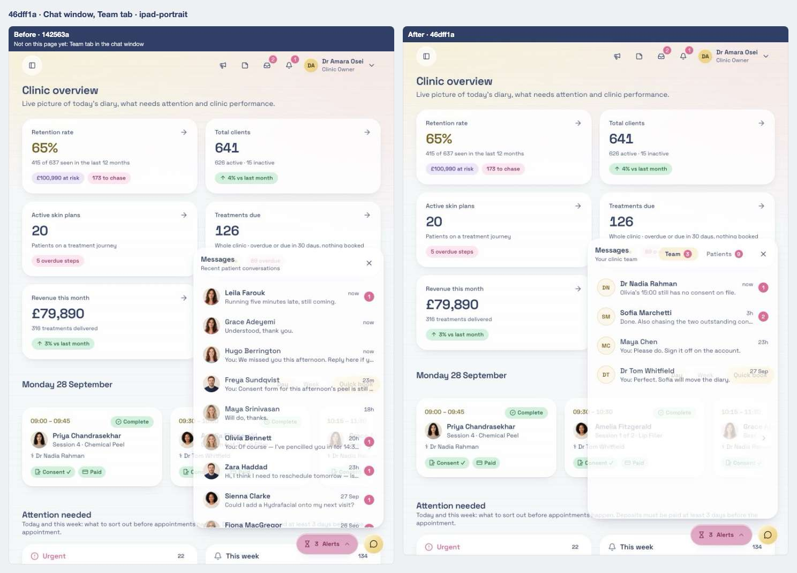

> Before: not on the page yet — Team tab in the chat window.

### Chat window, a team conversation open

Scene `dock-chat-thread` · signed in as the clinic owner

**Desktop 1440** — [before](../states/142563a/dock-chat-thread--chromium-1440.jpg) · [after](../states/46dff1a/dock-chat-thread--chromium-1440.jpg)

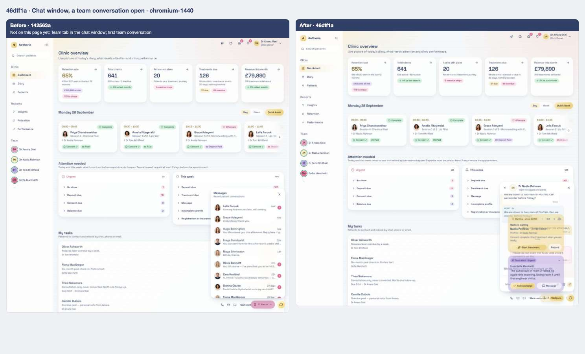

> Before: not on the page yet — Team tab in the chat window; first team conversation.

<strong>iPad landscape</strong> — <a href="../states/142563a/dock-chat-thread--ipad-landscape.jpg">before</a> · <a href="../states/46dff1a/dock-chat-thread--ipad-landscape.jpg">after</a>

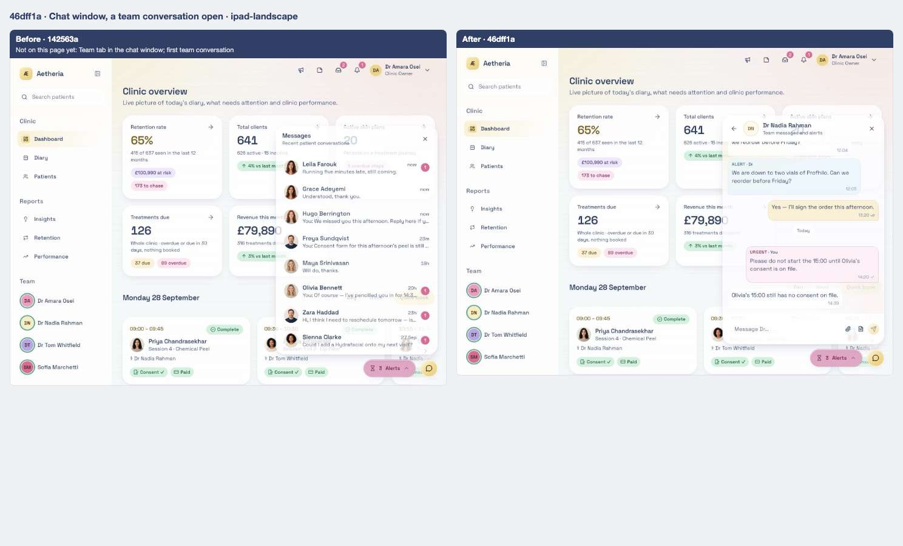

> Before: not on the page yet — Team tab in the chat window; first team conversation.

<strong>iPad portrait</strong> — <a href="../states/142563a/dock-chat-thread--ipad-portrait.jpg">before</a> · <a href="../states/46dff1a/dock-chat-thread--ipad-portrait.jpg">after</a>

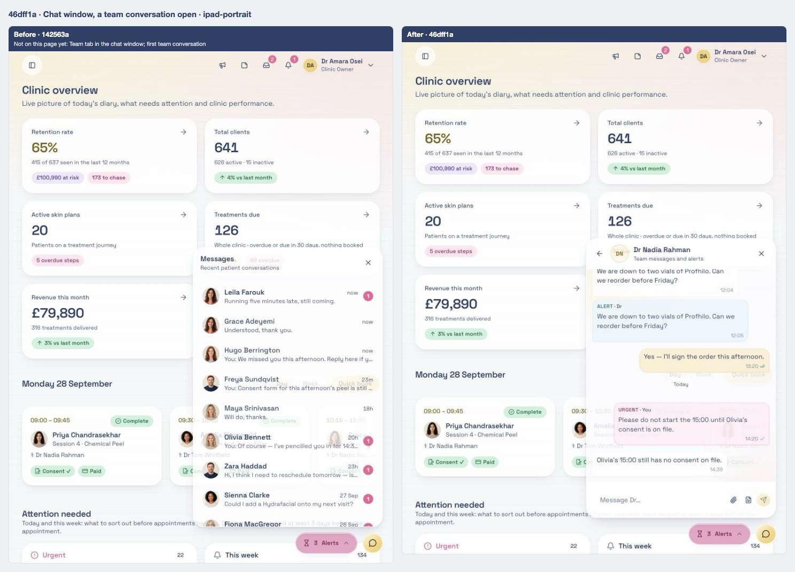

> Before: not on the page yet — Team tab in the chat window; first team conversation.

### Notification bell open

Scene `bell` · signed in as the clinic owner

**Desktop 1440** — [before](../states/142563a/bell--chromium-1440.jpg) · [after](../states/46dff1a/bell--chromium-1440.jpg)

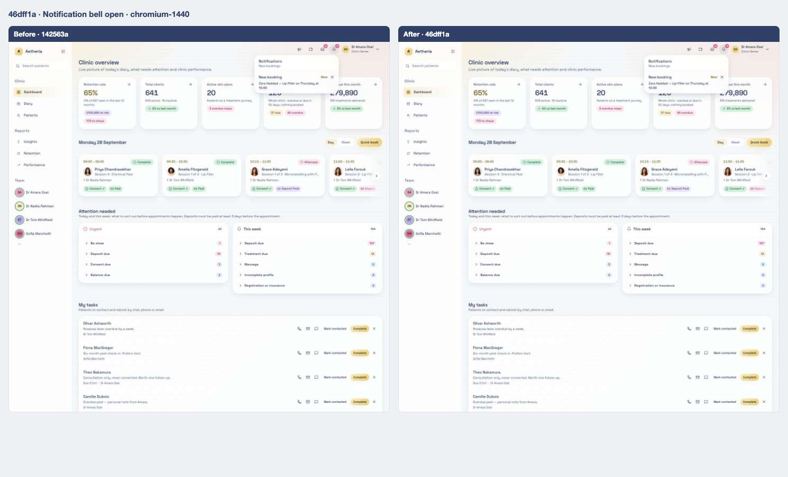

<strong>iPad landscape</strong> — <a href="../states/142563a/bell--ipad-landscape.jpg">before</a> · <a href="../states/46dff1a/bell--ipad-landscape.jpg">after</a>

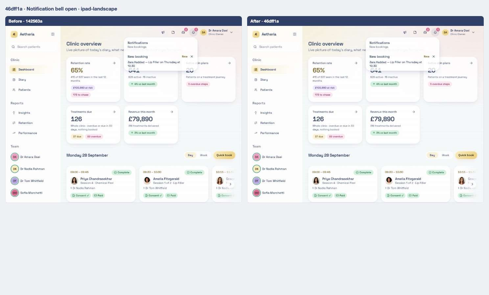

<strong>iPad portrait</strong> — <a href="../states/142563a/bell--ipad-portrait.jpg">before</a> · <a href="../states/46dff1a/bell--ipad-portrait.jpg">after</a>

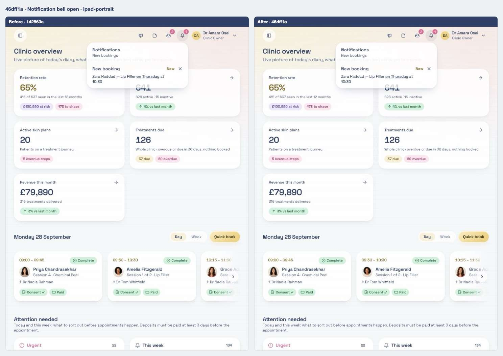

### Clinic alerts panel

Scene `alerts` · signed in as the clinic owner

**Desktop 1440** — [before](../states/142563a/alerts--chromium-1440.jpg) · [after](../states/46dff1a/alerts--chromium-1440.jpg)

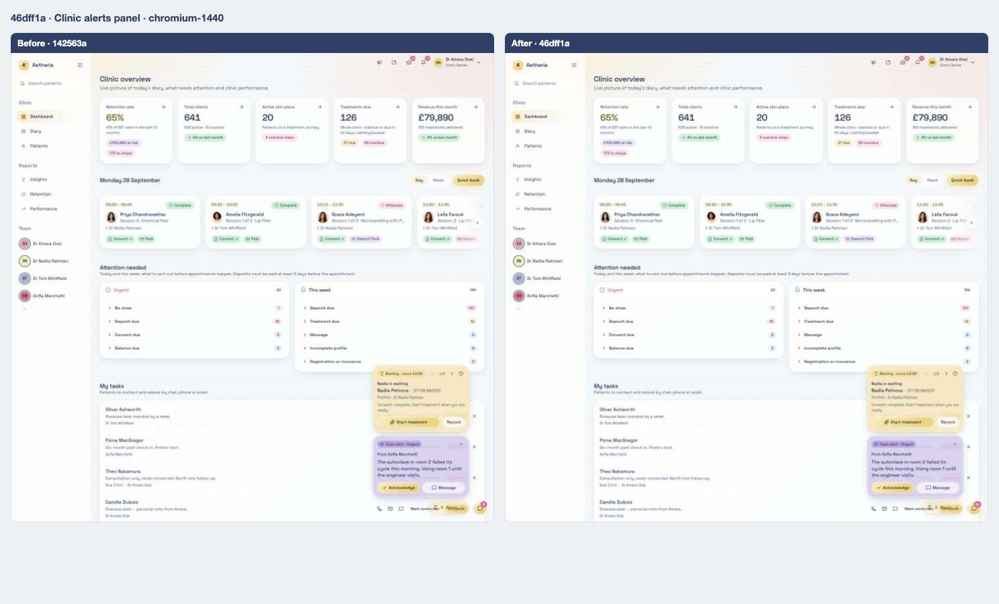

<strong>iPad landscape</strong> — <a href="../states/142563a/alerts--ipad-landscape.jpg">before</a> · <a href="../states/46dff1a/alerts--ipad-landscape.jpg">after</a>

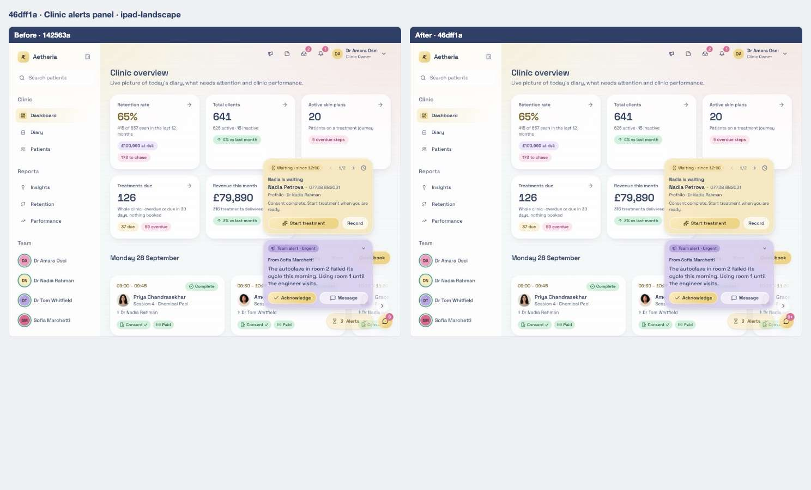

<strong>iPad portrait</strong> — <a href="../states/142563a/alerts--ipad-portrait.jpg">before</a> · <a href="../states/46dff1a/alerts--ipad-portrait.jpg">after</a>

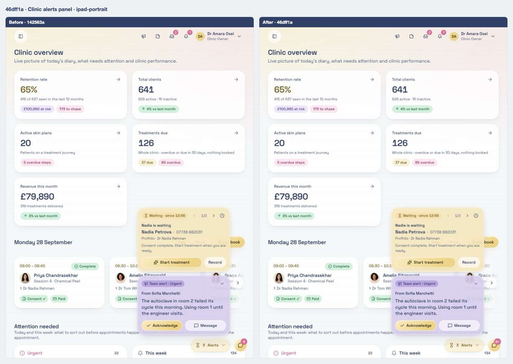

## Files

<strong>Components</strong> · 5 files, +402 / −182

| File | + | − |
| ---- | -: | -: |
| `src/components/floating-dock/chat-bubble.tsx` | 207 | 32 |
| `src/components/floating-dock/dock-context.tsx` | 42 | 6 |
| `src/components/notification-bell.tsx` | 15 | 20 |
| `src/components/sent-staff-alerts.tsx` | 21 | 28 |
| `src/components/staff-chat-panel.tsx` | 117 | 96 |

<strong>Library and server functions</strong> · 3 files, +124 / −0

| File | + | − |
| ---- | -: | -: |
| `src/lib/auth/policy.ts` | 1 | 0 |
| `src/lib/clinic.functions.demo.ts` | 42 | 0 |
| `src/lib/clinic.functions.ts` | 81 | 0 |

<strong>End-to-end tests</strong> · 2 files, +52 / −0

| File | + | − |
| ---- | -: | -: |
| `e2e/patient-portal/sync.spec.ts` | 2 | 0 |
| `e2e/team-chat-dock.spec.ts` | 50 | 0 |

[← 05](05-142563a.md) · [Index](../README.md) · [07 →](07-d625c36.md)
