# 07 · Practitioner card from the sidebar: availability, urgent notes, message; alerts can be acknowledged or dismissed

[← 06](06-46dff1a.md) · [Index](../README.md) · [08 →](08-765c1cc.md)

| | |
| --- | --- |
| Commit | `d625c368cf2cb6ebcb6bc62819d017f8e9df0cad` · [on GitHub](https://github.com/legitzaisam/patientsys/commit/d625c368cf2cb6ebcb6bc62819d017f8e9df0cad) |
| Parent (the "before") | `46dff1a` |
| Author | legitzaisam |
| Date | 28 September 2026 at 00:00 (London) |
| Size | 10 files, +541 / −378 |

> **In one line:** Sidebar team avatars open a card with today's free slots, the practitioner's recent urgent alerts and a Send message button; the team chat panel lets recipients acknowledge or dismiss alerts.

## Commit message

> Enhance practitioner hovercard and chat functionalities: Introduce new components for displaying practitioner availability and urgent notes in the sidebar. Update the notification bell to streamline team chat interactions and improve alert handling. Refactor staff chat panel to support alert acknowledgment and dismissal, enhancing user experience in team communications. Integrate new functionalities for managing practitioner day alerts and improve overall chat UI responsiveness.

## What changed, compared with the commit before

**Who sees it:** all staff (sidebar card); alert recipients (acknowledge, dismiss).

- **Sidebar team list:** each avatar is now a press target that opens a **practitioner card** showing today's availability (free slots, "No free slots left today" when none), the practitioner's latest urgent alerts (`practitioner-day-alerts.ts`: team-wide alerts stored once per recipient are folded into one entry, the viewer's own copy preferred; dismissed ones drop out; three at most) and a **Send message** button. Online colleagues get a green ring.
- **Team chat panel:** an alert the viewer received can be **acknowledged** ("Alert acknowledged") or **dismissed** (needs `notifications.delete`); the panel has a stored font size.
- **Team member page** loses its side-by-side messages column and resizable chat; messaging happens in the dock.
- Bell and dock context simplified to hand thread requests to the chat window.

## Observed in the captures

- Before, the sidebar avatars were not pressable (recorded as missing). After, pressing Dr Nadia Rahman opens her card with **Today's availability**, the free slots and **Send message**.
- On the iPad the sidebar sits in a drawer; the card opens over it.

## Before and after

Left: the app at `46dff1a`. Right: the app at `d625c36`. Both run the demo fixture with the clock pinned to 2026-09-28T09:30:00Z. Desktop is shown inline; the iPad captures are folded underneath. Where a control did not exist before the commit, the note under the image says so.

### Practitioner card from the sidebar avatar

Scene `sidebar-hovercard` · signed in as the clinic owner

**Desktop 1440** — [before](../states/46dff1a/sidebar-hovercard--chromium-1440.jpg) · [after](../states/d625c36/sidebar-hovercard--chromium-1440.jpg)

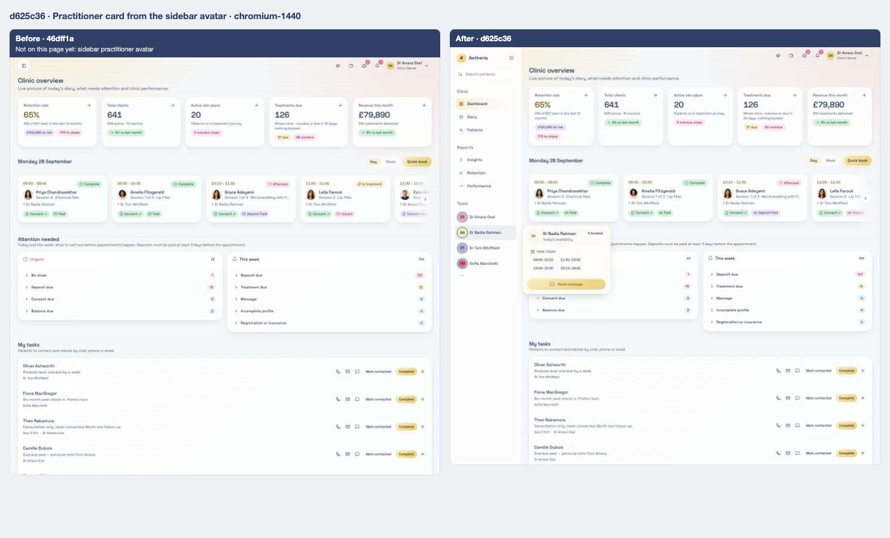

> Before: not on the page yet — sidebar practitioner avatar.

<strong>iPad landscape</strong> — <a href="../states/46dff1a/sidebar-hovercard--ipad-landscape.jpg">before</a> · <a href="../states/d625c36/sidebar-hovercard--ipad-landscape.jpg">after</a>

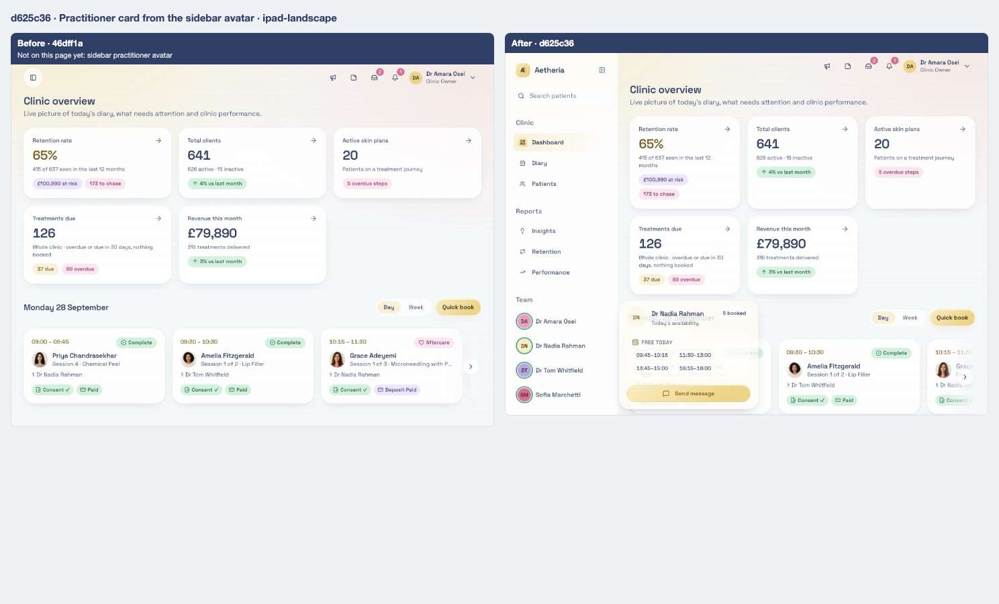

> Before: not on the page yet — sidebar practitioner avatar.

<strong>iPad portrait</strong> — <a href="../states/46dff1a/sidebar-hovercard--ipad-portrait.jpg">before</a> · <a href="../states/d625c36/sidebar-hovercard--ipad-portrait.jpg">after</a>

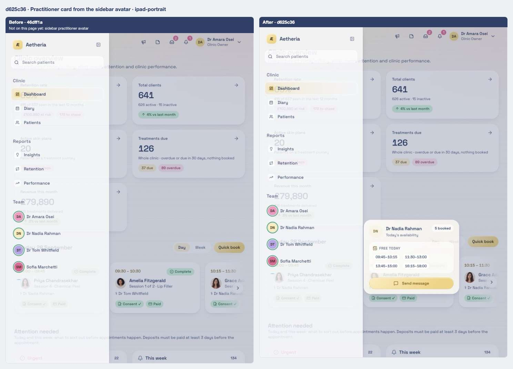

> Before: not on the page yet — sidebar practitioner avatar.

### Floating dock, chat window

Scene `dock-chat` · signed in as the clinic owner

**Desktop 1440** — [before](../states/46dff1a/dock-chat--chromium-1440.jpg) · [after](../states/d625c36/dock-chat--chromium-1440.jpg)

<strong>iPad landscape</strong> — <a href="../states/46dff1a/dock-chat--ipad-landscape.jpg">before</a> · <a href="../states/d625c36/dock-chat--ipad-landscape.jpg">after</a>

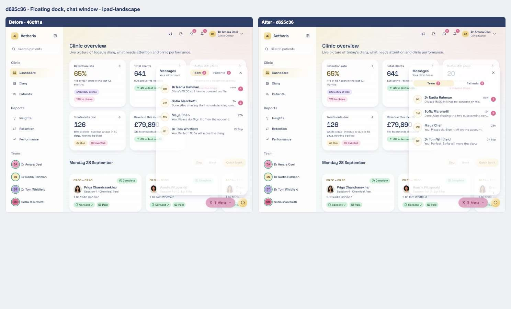

<strong>iPad portrait</strong> — <a href="../states/46dff1a/dock-chat--ipad-portrait.jpg">before</a> · <a href="../states/d625c36/dock-chat--ipad-portrait.jpg">after</a>

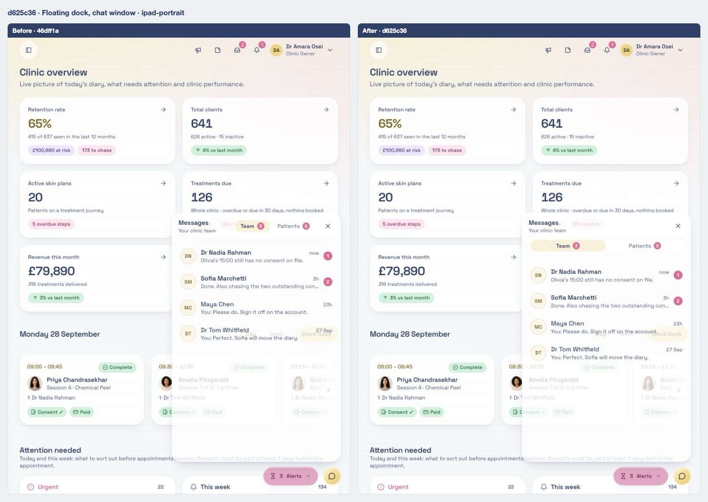

### Chat window, Team tab

Scene `dock-chat-team` · signed in as the clinic owner

**Desktop 1440** — [before](../states/46dff1a/dock-chat-team--chromium-1440.jpg) · [after](../states/d625c36/dock-chat-team--chromium-1440.jpg)

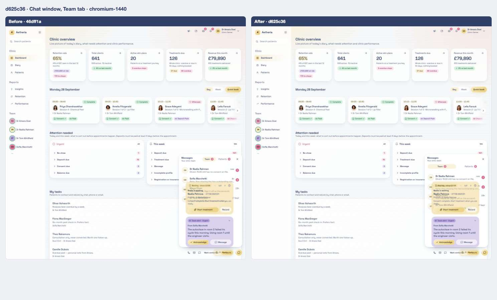

<strong>iPad landscape</strong> — <a href="../states/46dff1a/dock-chat-team--ipad-landscape.jpg">before</a> · <a href="../states/d625c36/dock-chat-team--ipad-landscape.jpg">after</a>

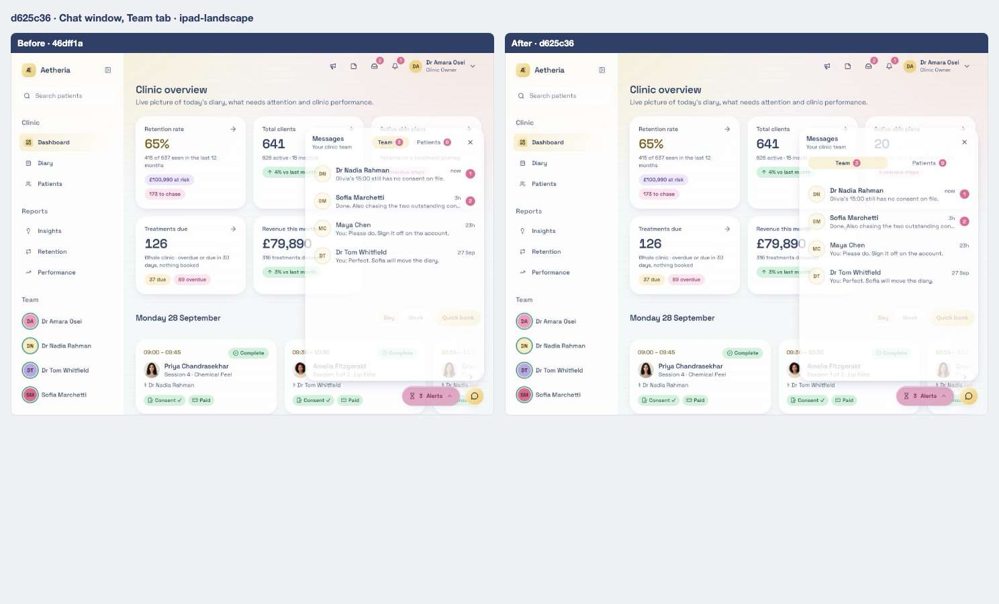

<strong>iPad portrait</strong> — <a href="../states/46dff1a/dock-chat-team--ipad-portrait.jpg">before</a> · <a href="../states/d625c36/dock-chat-team--ipad-portrait.jpg">after</a>

### Notification bell open

Scene `bell` · signed in as the clinic owner

**Desktop 1440** — [before](../states/46dff1a/bell--chromium-1440.jpg) · [after](../states/d625c36/bell--chromium-1440.jpg)

<strong>iPad landscape</strong> — <a href="../states/46dff1a/bell--ipad-landscape.jpg">before</a> · <a href="../states/d625c36/bell--ipad-landscape.jpg">after</a>

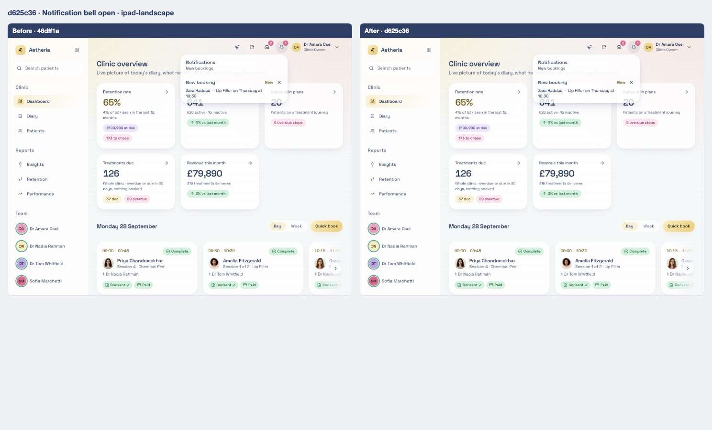

<strong>iPad portrait</strong> — <a href="../states/46dff1a/bell--ipad-portrait.jpg">before</a> · <a href="../states/d625c36/bell--ipad-portrait.jpg">after</a>

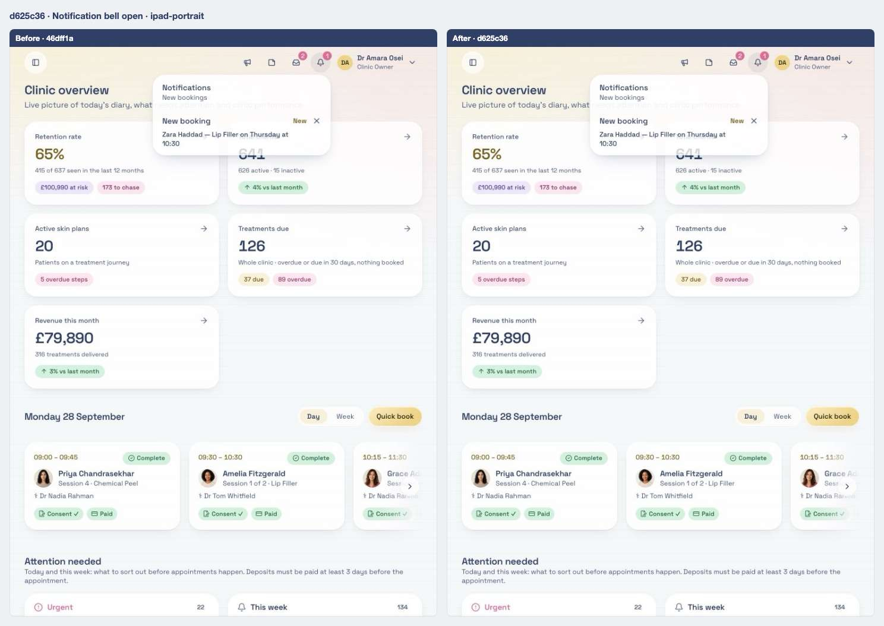

### A team member's page

Scene `team-member` · signed in as the clinic owner

**Desktop 1440** — [before](../states/46dff1a/team-member--chromium-1440.jpg) · [after](../states/d625c36/team-member--chromium-1440.jpg)

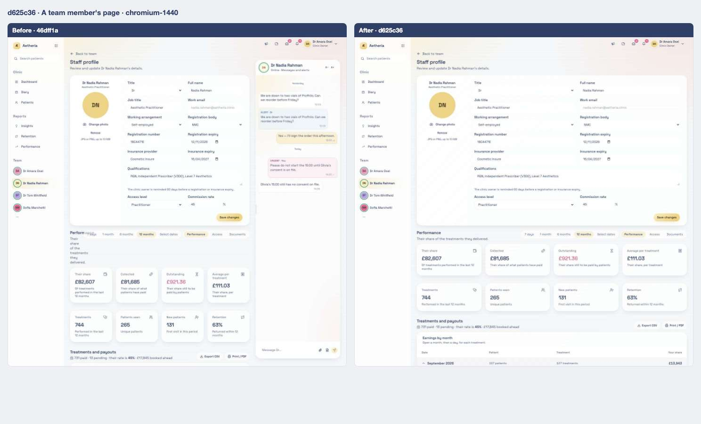

<strong>iPad landscape</strong> — <a href="../states/46dff1a/team-member--ipad-landscape.jpg">before</a> · <a href="../states/d625c36/team-member--ipad-landscape.jpg">after</a>

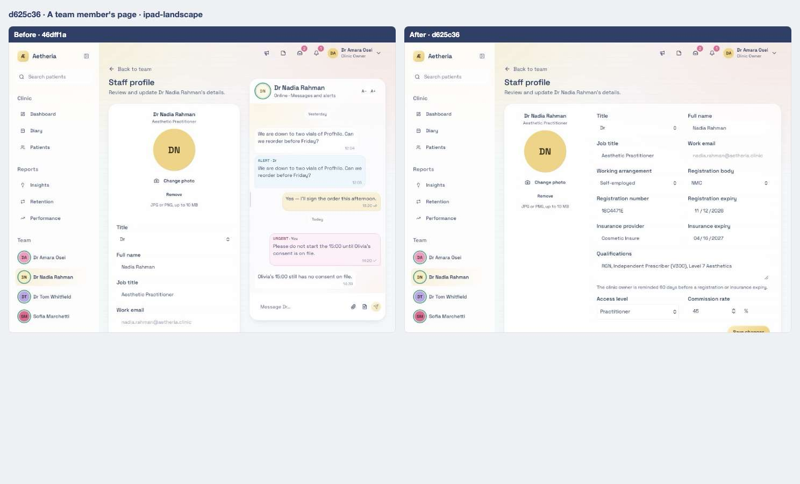

<strong>iPad portrait</strong> — <a href="../states/46dff1a/team-member--ipad-portrait.jpg">before</a> · <a href="../states/d625c36/team-member--ipad-portrait.jpg">after</a>

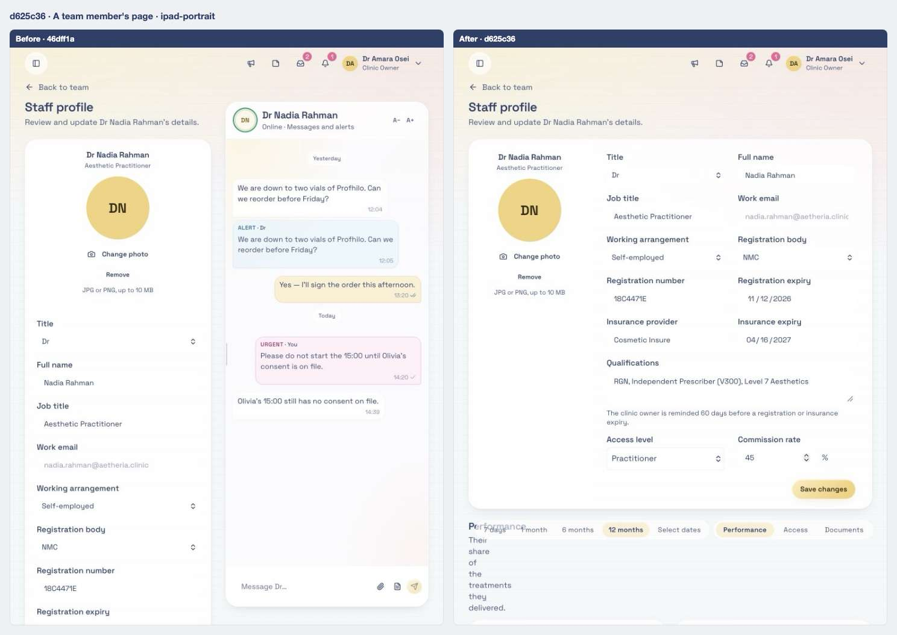

### Owner dashboard

Scene `dashboard-owner` · signed in as the clinic owner

**Desktop 1440** — [before](../states/46dff1a/dashboard-owner--chromium-1440.jpg) · [after](../states/d625c36/dashboard-owner--chromium-1440.jpg)

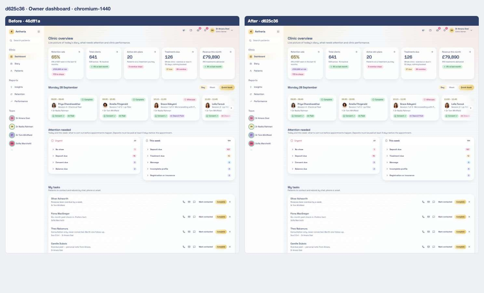

<strong>iPad landscape</strong> — <a href="../states/46dff1a/dashboard-owner--ipad-landscape.jpg">before</a> · <a href="../states/d625c36/dashboard-owner--ipad-landscape.jpg">after</a>

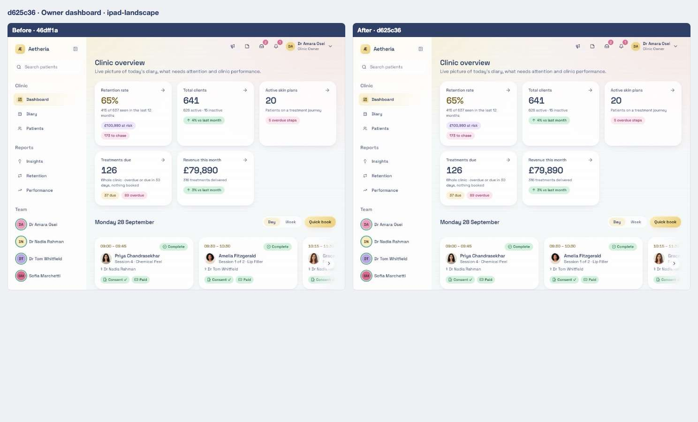

<strong>iPad portrait</strong> — <a href="../states/46dff1a/dashboard-owner--ipad-portrait.jpg">before</a> · <a href="../states/d625c36/dashboard-owner--ipad-portrait.jpg">after</a>

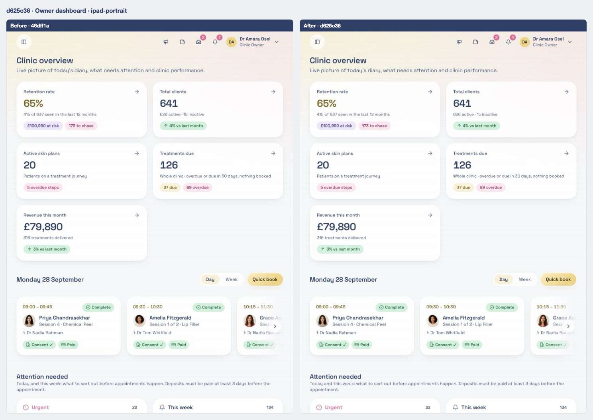

## Files

<strong>Components</strong> · 6 files, +473 / −307

| File | + | − |
| ---- | -: | -: |
| `src/components/app-shell.tsx` | 51 | 21 |
| `src/components/floating-dock/chat-bubble.tsx` | 66 | 42 |
| `src/components/floating-dock/dock-context.tsx` | 4 | 20 |
| `src/components/notification-bell.tsx` | 6 | 8 |
| `src/components/practitioner-hovercard.tsx` | 194 | 113 |
| `src/components/staff-chat-panel.tsx` | 152 | 103 |

<strong>Routes (pages)</strong> · 1 file, +3 / −63

| File | + | − |
| ---- | -: | -: |
| `src/routes/_authenticated/team.$id.tsx` | 3 | 63 |

<strong>Library and server functions</strong> · 3 files, +65 / −8

| File | + | − |
| ---- | -: | -: |
| `src/lib/clinic.functions.demo.ts` | 11 | 4 |
| `src/lib/clinic.functions.ts` | 7 | 4 |
| `src/lib/practitioner-day-alerts.ts` | 47 | 0 |

[← 06](06-46dff1a.md) · [Index](../README.md) · [08 →](08-765c1cc.md)
