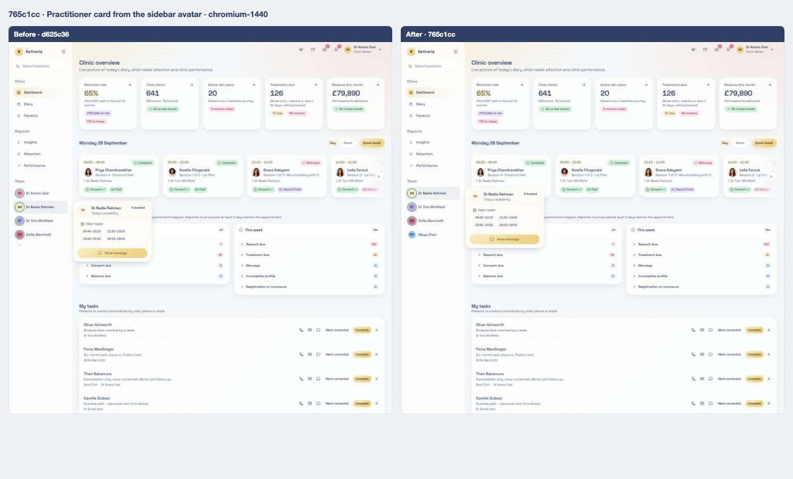
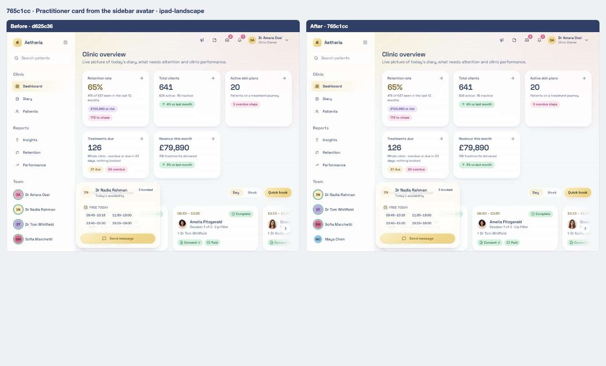
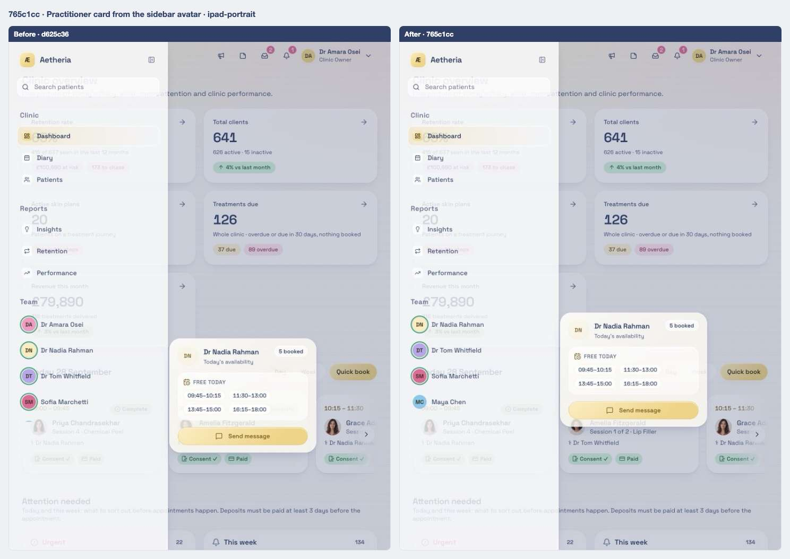
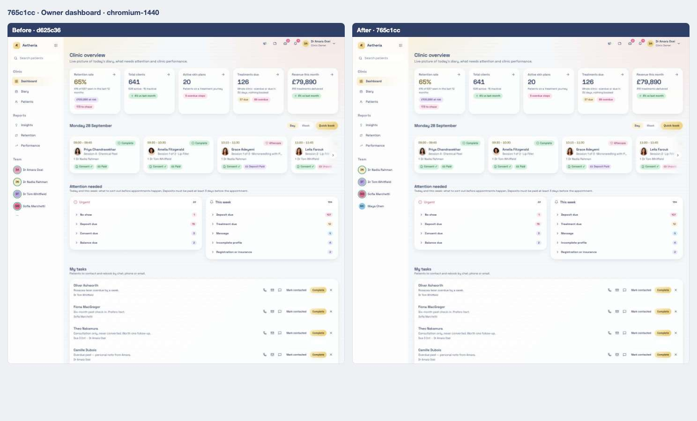
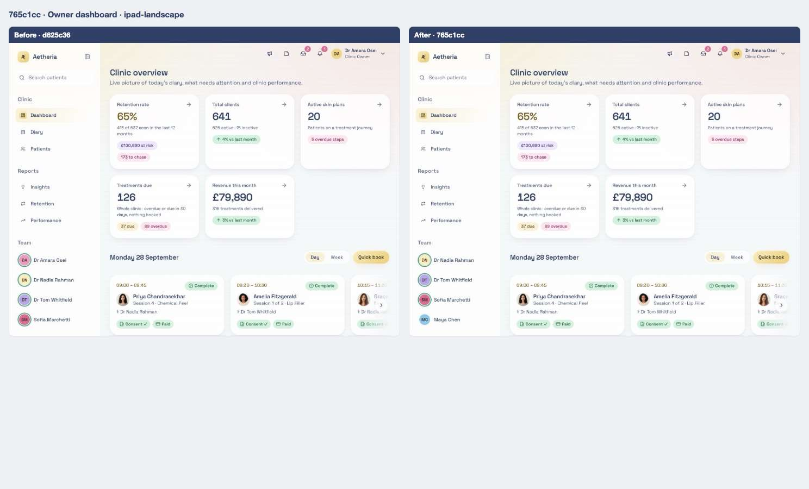
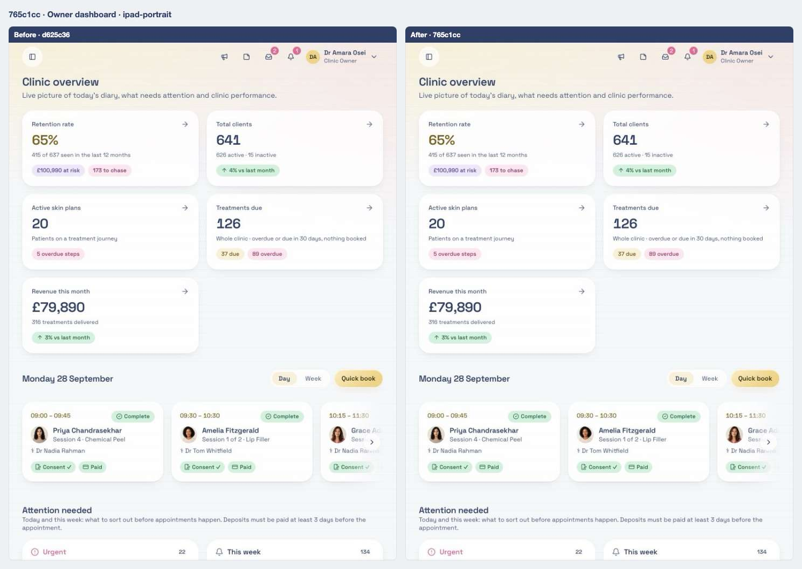
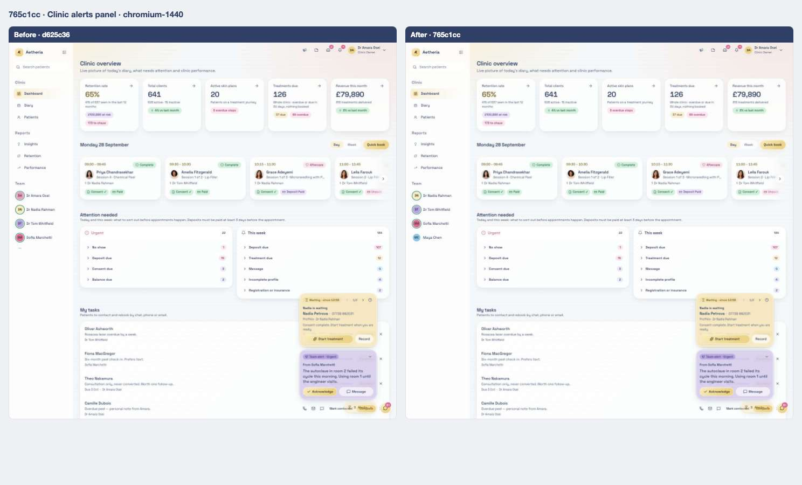
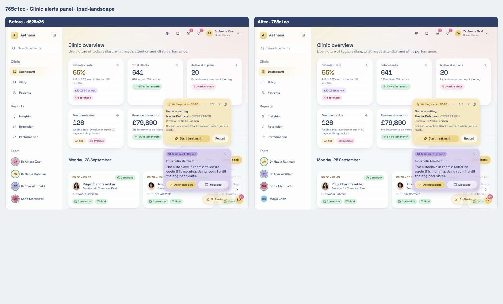
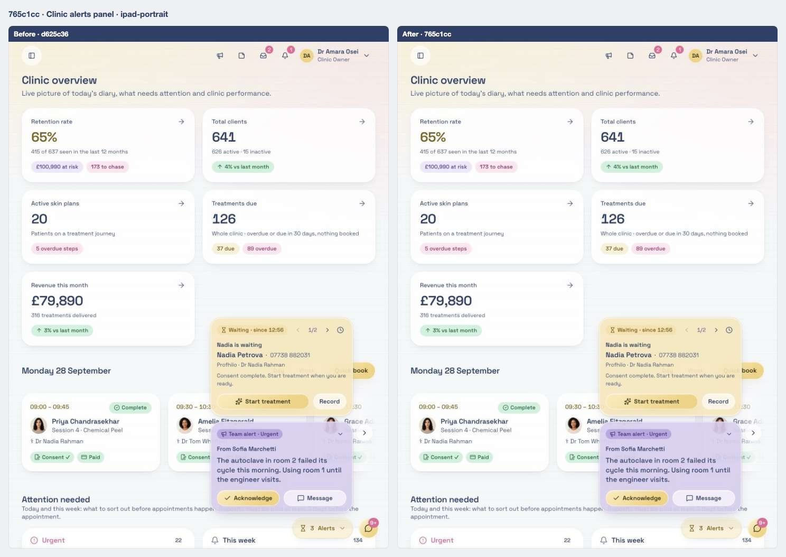

# 08 · Online colleagues first; day-card alerts open in the chat, ready to act on

[← 07](07-d625c36.md) · [Index](../README.md) · [09 →](09-a4c6f6d.md)

| | |
| --- | --- |
| Commit | `765c1cc0f48ed58efecf5ee2a5a4500529b8cf67` · [on GitHub](https://github.com/legitzaisam/patientsys/commit/765c1cc0f48ed58efecf5ee2a5a4500529b8cf67) |
| Parent (the "before") | `d625c36` |
| Author | legitzaisam |
| Date | 28 September 2026 at 00:02 (London) |
| Size | 5 files, +91 / −38 |

> **In one line:** The sidebar sorts online teammates first, an alert on a teammate's day card opens the Team chat focused on that alert, and the alert peek no longer covers the chat window.

## Commit message

> Enhance team chat and alert functionalities: Add a test for urgent alerts on teammate day cards, ensuring alerts open in the chat window with appropriate focus. Refactor sidebar navigation to streamline team member display and improve sorting logic. Update practitioner hovercard and day card components to support alert interactions, enhancing user experience in managing alerts and messages.

## What changed, compared with the commit before

**Who sees it:** all staff.

- **Sidebar order:** online colleagues first, then alphabetical; the viewer is left out of the list.
- **Day card alerts:** the urgent alerts on a practitioner's card are buttons; pressing one closes the card and opens the Team chat on that teammate with the alert in focus, its acknowledge and **Dismiss alert** buttons visible and the reply box focused.
- **Alert bubble:** a passive peek of the alert panel is suppressed while the chat window is open, so it never covers the conversation; opening the pill on purpose still works.

**Tests:** "an urgent alert on a teammate's day card opens where it lives, ready to act on".

## Observed in the captures

- The sidebar Team list drops the signed-in owner and lists online colleagues first.

## Before and after

Left: the app at `d625c36`. Right: the app at `765c1cc`. Both run the demo fixture with the clock pinned to 2026-09-28T09:30:00Z. Desktop is shown inline; the iPad captures are folded underneath. Where a control did not exist before the commit, the note under the image says so.

### Practitioner card from the sidebar avatar

Scene `sidebar-hovercard` · signed in as the clinic owner

**Desktop 1440** — [before](../states/d625c36/sidebar-hovercard--chromium-1440.jpg) · [after](../states/765c1cc/sidebar-hovercard--chromium-1440.jpg)

<strong>iPad landscape</strong> — <a href="../states/d625c36/sidebar-hovercard--ipad-landscape.jpg">before</a> · <a href="../states/765c1cc/sidebar-hovercard--ipad-landscape.jpg">after</a>

<strong>iPad portrait</strong> — <a href="../states/d625c36/sidebar-hovercard--ipad-portrait.jpg">before</a> · <a href="../states/765c1cc/sidebar-hovercard--ipad-portrait.jpg">after</a>

### Owner dashboard

Scene `dashboard-owner` · signed in as the clinic owner

**Desktop 1440** — [before](../states/d625c36/dashboard-owner--chromium-1440.jpg) · [after](../states/765c1cc/dashboard-owner--chromium-1440.jpg)

<strong>iPad landscape</strong> — <a href="../states/d625c36/dashboard-owner--ipad-landscape.jpg">before</a> · <a href="../states/765c1cc/dashboard-owner--ipad-landscape.jpg">after</a>

<strong>iPad portrait</strong> — <a href="../states/d625c36/dashboard-owner--ipad-portrait.jpg">before</a> · <a href="../states/765c1cc/dashboard-owner--ipad-portrait.jpg">after</a>

### Clinic alerts panel

Scene `alerts` · signed in as the clinic owner

**Desktop 1440** — [before](../states/d625c36/alerts--chromium-1440.jpg) · [after](../states/765c1cc/alerts--chromium-1440.jpg)

<strong>iPad landscape</strong> — <a href="../states/d625c36/alerts--ipad-landscape.jpg">before</a> · <a href="../states/765c1cc/alerts--ipad-landscape.jpg">after</a>

<strong>iPad portrait</strong> — <a href="../states/d625c36/alerts--ipad-portrait.jpg">before</a> · <a href="../states/765c1cc/alerts--ipad-portrait.jpg">after</a>

## Files

<strong>Components</strong> · 3 files, +68 / −34

| File | + | − |
| ---- | -: | -: |
| `src/components/app-shell.tsx` | 10 | 25 |
| `src/components/floating-dock/alert-bubble.tsx` | 4 | 1 |
| `src/components/practitioner-hovercard.tsx` | 54 | 8 |

<strong>Library and server functions</strong> · 1 file, +7 / −4

| File | + | − |
| ---- | -: | -: |
| `src/lib/practitioner-day-alerts.ts` | 7 | 4 |

<strong>End-to-end tests</strong> · 1 file, +16 / −0

| File | + | − |
| ---- | -: | -: |
| `e2e/team-chat-dock.spec.ts` | 16 | 0 |

[← 07](07-d625c36.md) · [Index](../README.md) · [09 →](09-a4c6f6d.md)
