# 09 · Diary and chat clean-up: My appointments, a lighter quick-reply toast, simpler persona switching

[← 08](08-765c1cc.md) · [Index](../README.md) · [10 →](10-971c04c.md)

| | |
| --- | --- |
| Commit | `a4c6f6d8e94aad41732b2df23ec6f4a5b41573df` · [on GitHub](https://github.com/legitzaisam/patientsys/commit/a4c6f6d8e94aad41732b2df23ec6f4a5b41573df) |
| Parent (the "before") | `765c1cc` |
| Author | legitzaisam |
| Date | 28 September 2026 at 00:11 (London) |
| Size | 8 files, +123 / −502 |

> **In one line:** The diary's View by pill says My appointments for the signed-in practitioner and drops the needs-action hint line, the chat quick-reply toast becomes a small dockable notice, and the demo persona switcher reloads to a page the new persona can open.

## Commit message

> Refactor schedule and chat components for improved functionality: Update end-to-end tests for the schedule page, ensuring accurate visibility of appointment counts and enhancing user interactions. Simplify the practitioner hovercard by removing unnecessary state management for message dialogs, streamlining the chat functionality. Adjust styles and logic in various components to enhance user experience and maintain consistency across the application.

## What changed, compared with the commit before

**Who sees it:** practitioners (diary label), all staff (toast), demo users (persona switcher).

- **Diary:** when the only selected practitioner is the signed-in user, the View by pill and column header read **My appointments** instead of the name. The one-line **needs-action hint** under the planner header ("n appointments today need something…") is removed along with its helper.
- **Quick-reply toast:** the 353-line toast with an inline reply textarea (fetching and sending chat from inside the toast) is replaced by a compact notice with a title, description and **open** action; it can be dragged to dock off the left edge with a 15% peek.
- **Practitioner card:** the message dialog state is removed; **Send message** goes straight to the dock chat.
- **Demo persona switcher:** switching now does a full reload to a page the new persona can open (patient goes to `/my-record`; leaving the portal or the Access page lands on `/dashboard`), instead of clearing the query cache in place.
- A few styles for the old toast are deleted.

## Observed in the captures

- The one-line hint under the Day planner header ("n appointments today need something…") is gone; otherwise the diary is unchanged.

## Before and after

Left: the app at `765c1cc`. Right: the app at `a4c6f6d`. Both run the demo fixture with the clock pinned to 2026-09-28T09:30:00Z. Desktop is shown inline; the iPad captures are folded underneath. Where a control did not exist before the commit, the note under the image says so.

### Diary, day view

Scene `diary-day` · signed in as the clinic owner

**Desktop 1440** — [before](../states/765c1cc/diary-day--chromium-1440.jpg) · [after](../states/a4c6f6d/diary-day--chromium-1440.jpg)

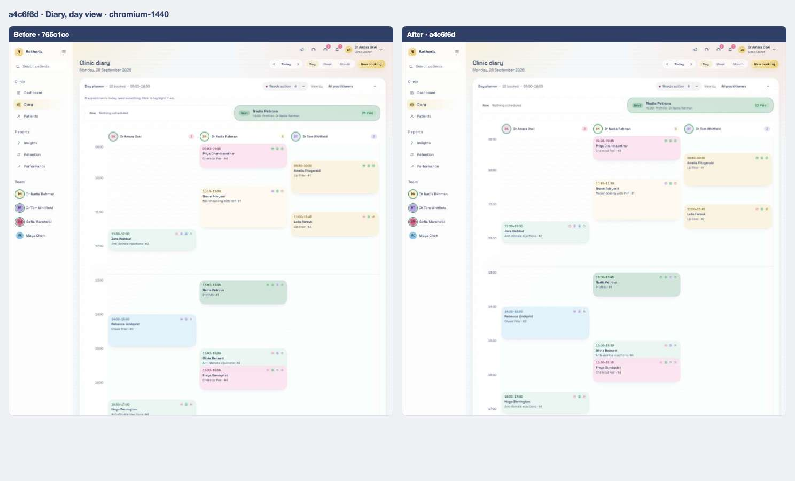

<strong>iPad landscape</strong> — <a href="../states/765c1cc/diary-day--ipad-landscape.jpg">before</a> · <a href="../states/a4c6f6d/diary-day--ipad-landscape.jpg">after</a>

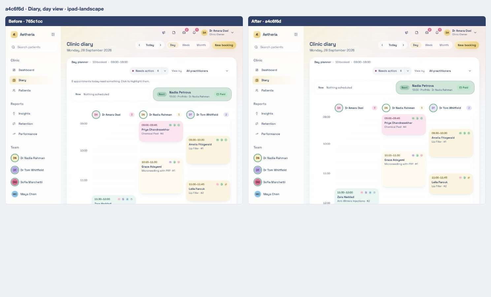

<strong>iPad portrait</strong> — <a href="../states/765c1cc/diary-day--ipad-portrait.jpg">before</a> · <a href="../states/a4c6f6d/diary-day--ipad-portrait.jpg">after</a>

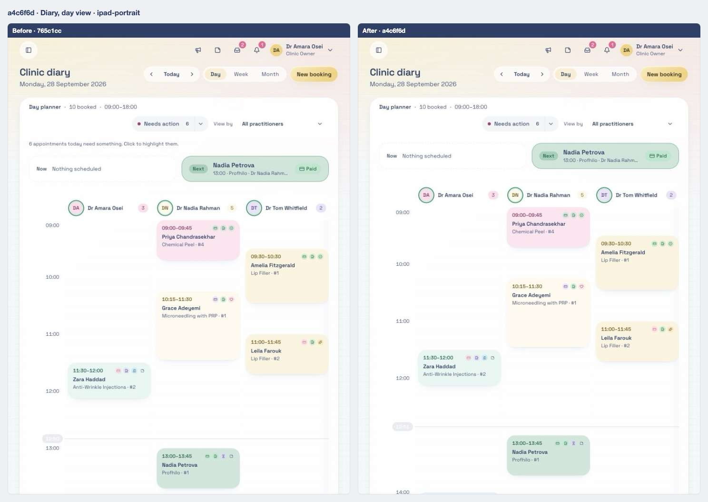

### Practitioner card from the sidebar avatar

Scene `sidebar-hovercard` · signed in as the clinic owner

**Desktop 1440** — [before](../states/765c1cc/sidebar-hovercard--chromium-1440.jpg) · [after](../states/a4c6f6d/sidebar-hovercard--chromium-1440.jpg)

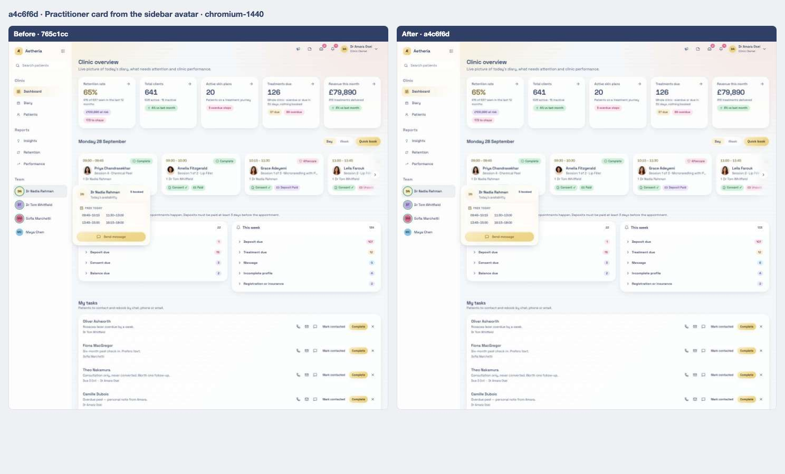

<strong>iPad landscape</strong> — <a href="../states/765c1cc/sidebar-hovercard--ipad-landscape.jpg">before</a> · <a href="../states/a4c6f6d/sidebar-hovercard--ipad-landscape.jpg">after</a>

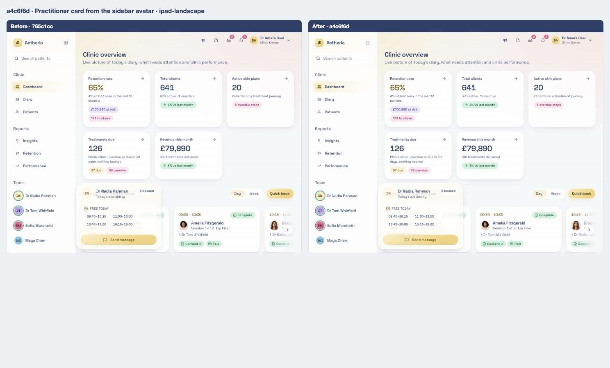

<strong>iPad portrait</strong> — <a href="../states/765c1cc/sidebar-hovercard--ipad-portrait.jpg">before</a> · <a href="../states/a4c6f6d/sidebar-hovercard--ipad-portrait.jpg">after</a>

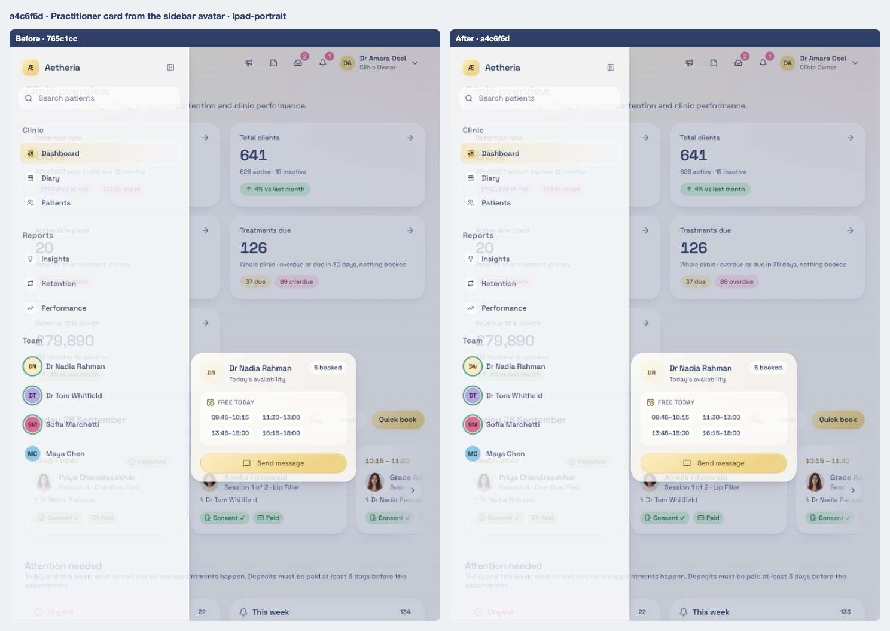

### Owner dashboard

Scene `dashboard-owner` · signed in as the clinic owner

**Desktop 1440** — [before](../states/765c1cc/dashboard-owner--chromium-1440.jpg) · [after](../states/a4c6f6d/dashboard-owner--chromium-1440.jpg)

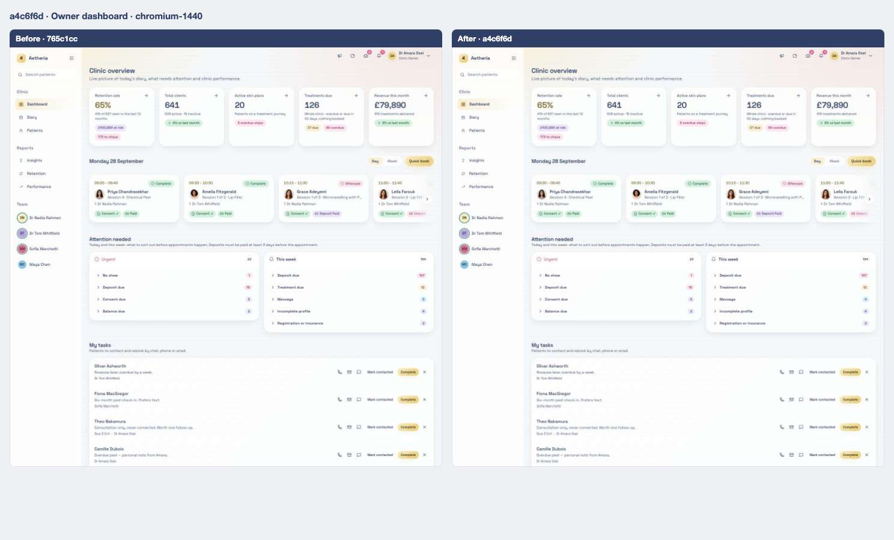

<strong>iPad landscape</strong> — <a href="../states/765c1cc/dashboard-owner--ipad-landscape.jpg">before</a> · <a href="../states/a4c6f6d/dashboard-owner--ipad-landscape.jpg">after</a>

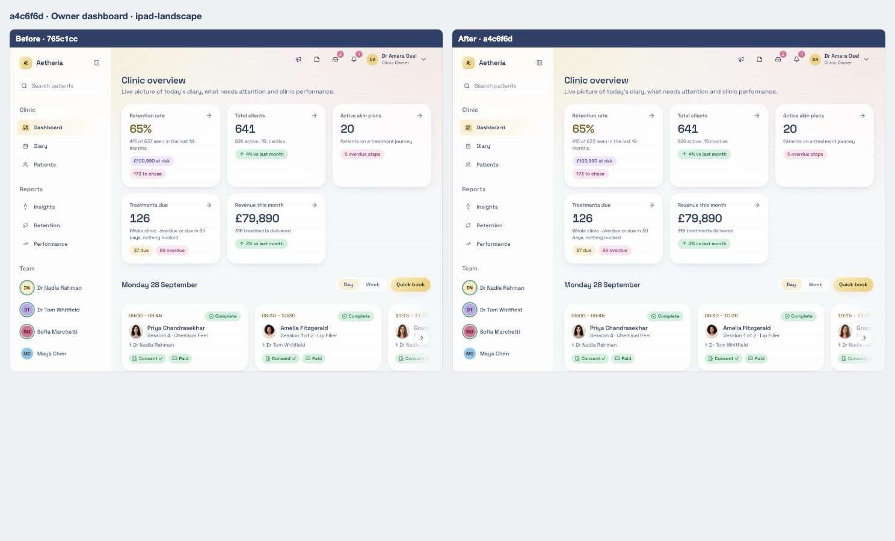

<strong>iPad portrait</strong> — <a href="../states/765c1cc/dashboard-owner--ipad-portrait.jpg">before</a> · <a href="../states/a4c6f6d/dashboard-owner--ipad-portrait.jpg">after</a>

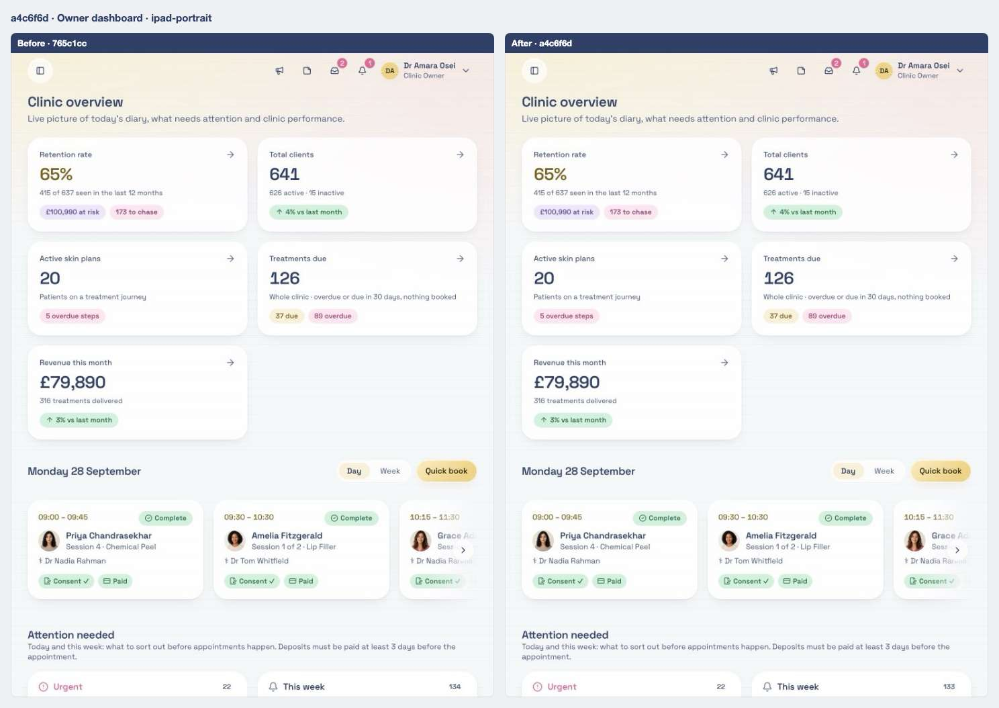

### New booking dialog from the diary

Scene `quick-add` · signed in as front desk

**Desktop 1440** — [before](../states/765c1cc/quick-add--chromium-1440.jpg) · [after](../states/a4c6f6d/quick-add--chromium-1440.jpg)

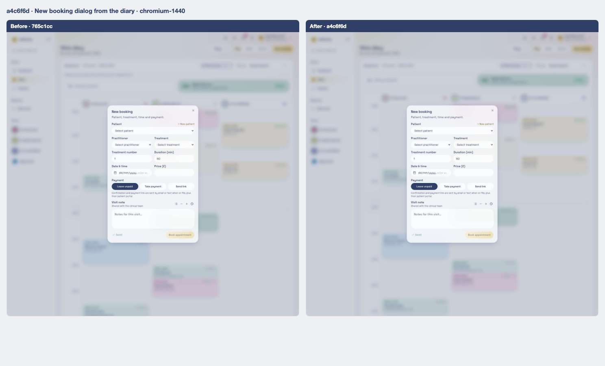

<strong>iPad landscape</strong> — <a href="../states/765c1cc/quick-add--ipad-landscape.jpg">before</a> · <a href="../states/a4c6f6d/quick-add--ipad-landscape.jpg">after</a>

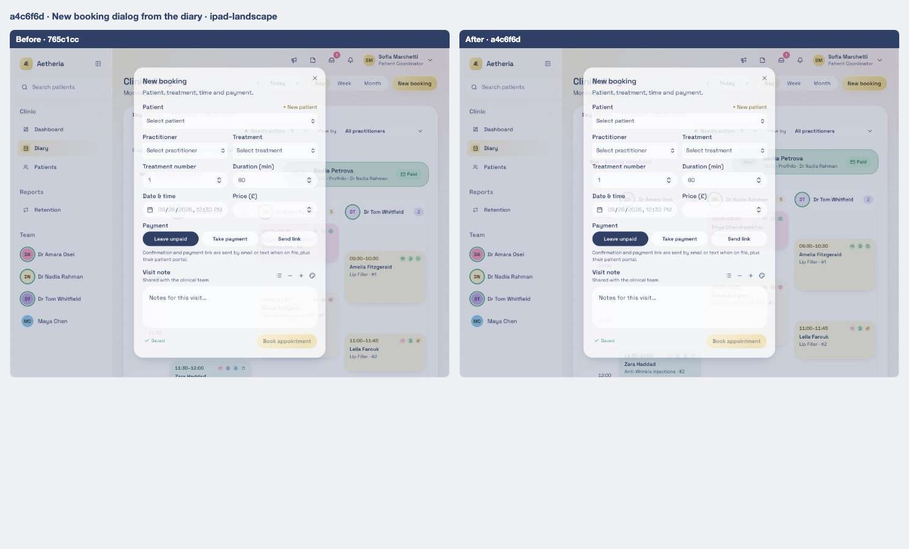

<strong>iPad portrait</strong> — <a href="../states/765c1cc/quick-add--ipad-portrait.jpg">before</a> · <a href="../states/a4c6f6d/quick-add--ipad-portrait.jpg">after</a>

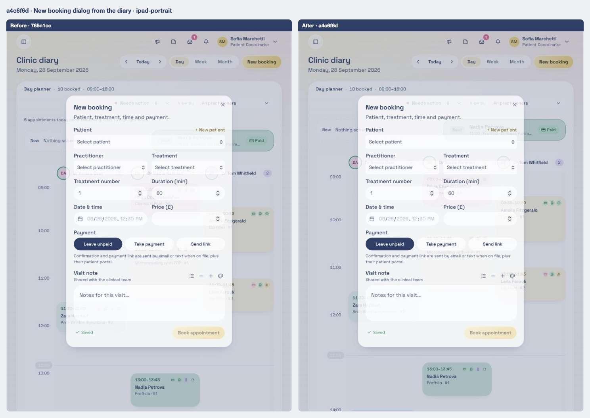

## Files

<strong>Components</strong> · 5 files, +106 / −460

| File | + | − |
| ---- | -: | -: |
| `src/components/chat-quick-reply-toast.tsx` | 32 | 353 |
| `src/components/demo/role-switcher.tsx` | 16 | 13 |
| `src/components/practitioner-hovercard.tsx` | 55 | 74 |
| `src/components/schedule/needs-action.ts` | 2 | 19 |
| `src/components/ui/sonner.tsx` | 1 | 1 |

<strong>Routes (pages)</strong> · 1 file, +15 / −23

| File | + | − |
| ---- | -: | -: |
| `src/routes/_authenticated/schedule.tsx` | 15 | 23 |

<strong>Library and server functions</strong> · 1 file, +0 / −13

| File | + | − |
| ---- | -: | -: |
| `src/styles.css` | 0 | 13 |

<strong>End-to-end tests</strong> · 1 file, +2 / −6

| File | + | − |
| ---- | -: | -: |
| `e2e/schedule.spec.ts` | 2 | 6 |

[← 08](08-765c1cc.md) · [Index](../README.md) · [10 →](10-971c04c.md)
