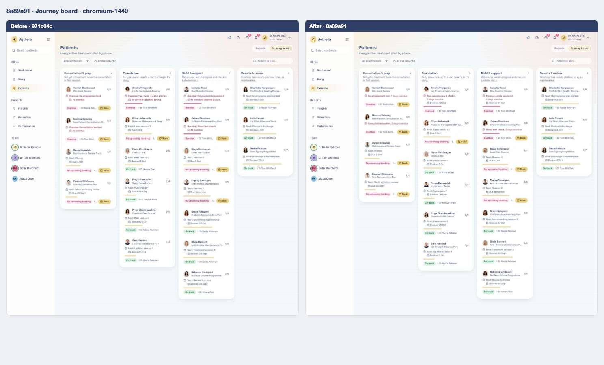
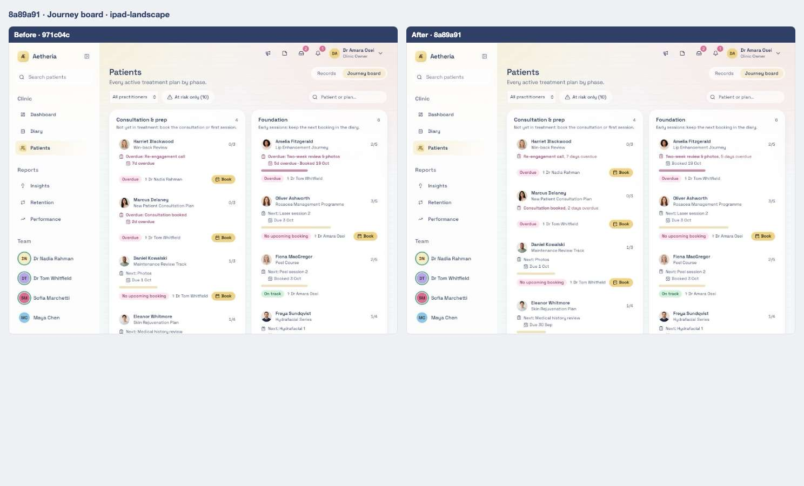
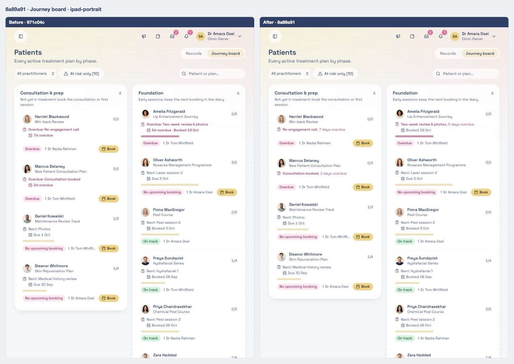
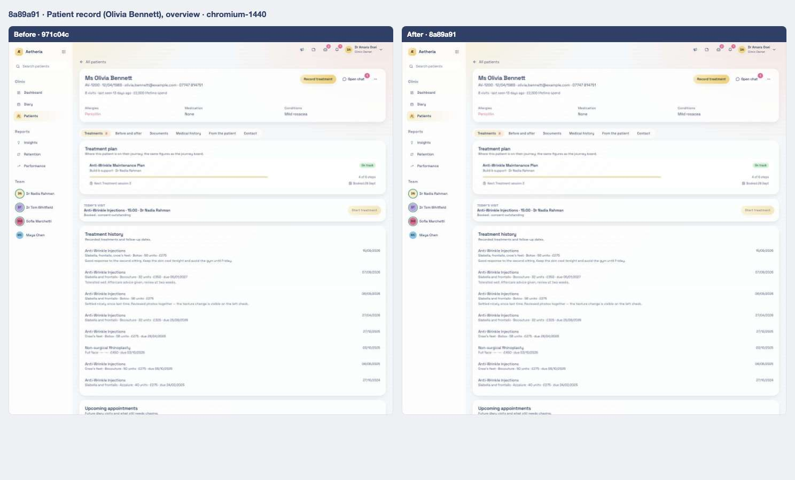
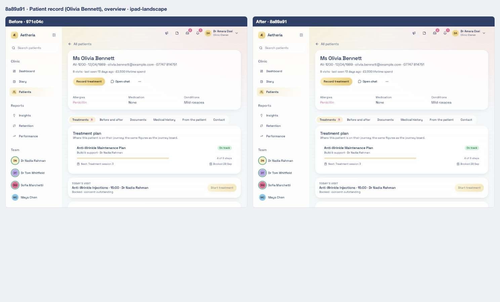
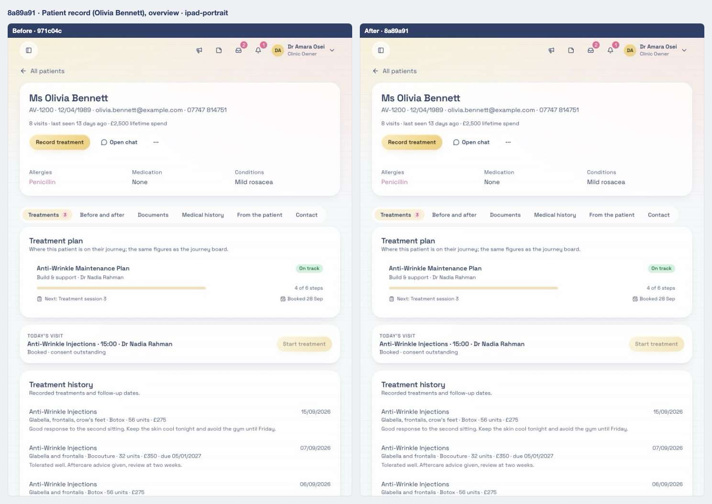
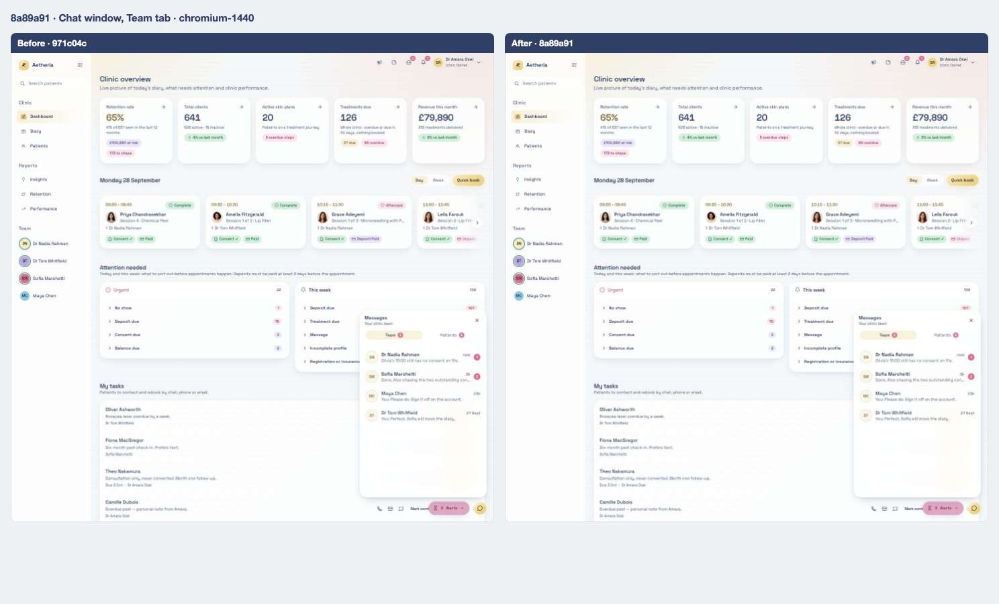
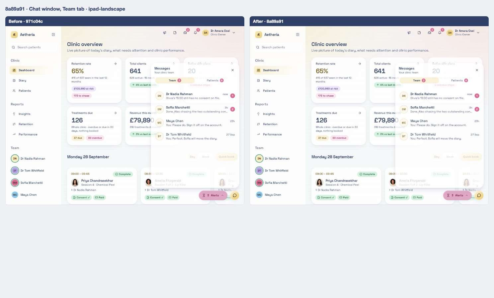
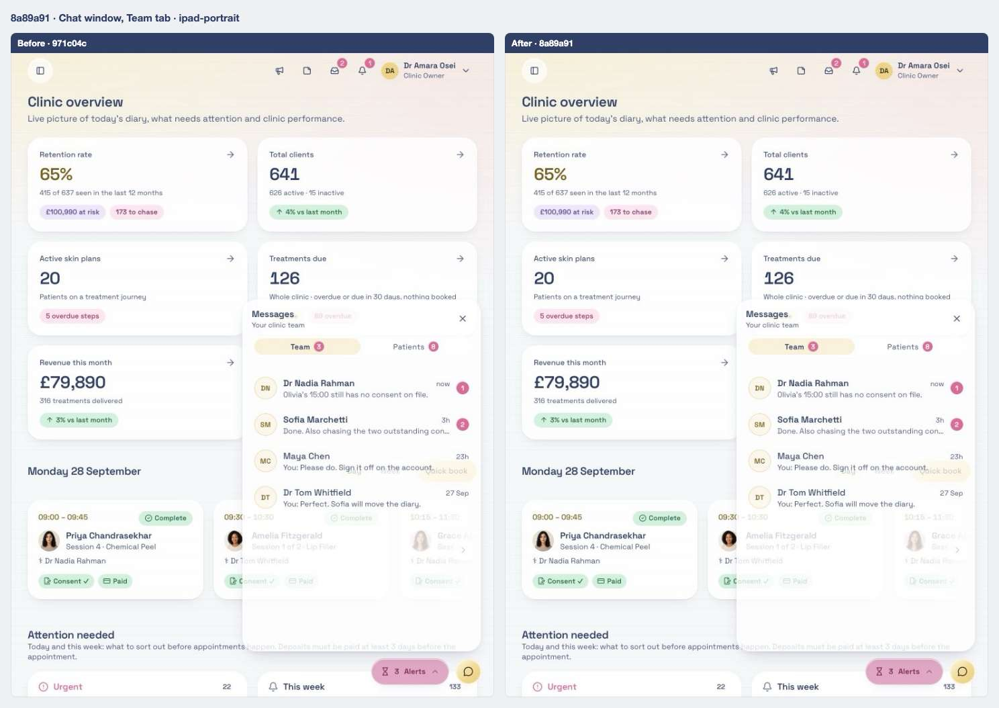

# 11 · Overdue steps say how late they are

[← 10](10-971c04c.md) · [Index](../README.md) · [12 →](12-789f666.md)

| | |
| --- | --- |
| Commit | `8a89a911387af36a38ee500033659cef1abedc6c` · [on GitHub](https://github.com/legitzaisam/patientsys/commit/8a89a911387af36a38ee500033659cef1abedc6c) |
| Parent (the "before") | `971c04c` |
| Author | legitzaisam |
| Date | 28 September 2026 at 00:36 (London) |
| Size | 6 files, +107 / −37 |

> **In one line:** A late plan step shows "n days overdue" beside its title on the journey board and the plan card, the date line keeps only the booking, and replying to an alert is tested end to end.

## Commit message

> Refactor journey board and treatment plan components: Introduce overdue label functionality to enhance visibility of overdue steps in patient journey. Update related components to streamline overdue display and improve user experience. Adjust tests to ensure accurate representation of overdue statuses in the UI.

## What changed, compared with the commit before

**Who sees it:** owners, managers and practitioners (journey board, patient record Treatments tab).

- **overdueLabel:** "7 days overdue" (at least "1 day overdue") for a slipped step; the step line becomes "**Title**, 7 days overdue" and the date line shows only the booking when there is one. The Overdue chip is unchanged, so the word appears on the chip and on the step line, not three times. `nextStepLine` no longer prefixes "Overdue:" or "Next:".
- **Team chat panel** wording adjusted for reply rows.

**Tests:** board cards now expect the two-place overdue wording; `e2e/team-chat-dock.spec.ts` gains "replying to an alert sends it to the sender's Team alerts with a toast" (the chip names the alert, attachments are hidden, the sent list shows Reply).

## Observed in the captures

- Late steps on the board read "Title, n days overdue" next to the Overdue chip.

## Before and after

Left: the app at `971c04c`. Right: the app at `8a89a91`. Both run the demo fixture with the clock pinned to 2026-09-28T09:30:00Z. Desktop is shown inline; the iPad captures are folded underneath. Where a control did not exist before the commit, the note under the image says so.

### Journey board

Scene `journey-board` · signed in as the clinic owner

**Desktop 1440** — [before](../states/971c04c/journey-board--chromium-1440.jpg) · [after](../states/8a89a91/journey-board--chromium-1440.jpg)

<strong>iPad landscape</strong> — <a href="../states/971c04c/journey-board--ipad-landscape.jpg">before</a> · <a href="../states/8a89a91/journey-board--ipad-landscape.jpg">after</a>

<strong>iPad portrait</strong> — <a href="../states/971c04c/journey-board--ipad-portrait.jpg">before</a> · <a href="../states/8a89a91/journey-board--ipad-portrait.jpg">after</a>

### Patient record (Olivia Bennett), overview

Scene `patient-record` · signed in as the clinic owner

**Desktop 1440** — [before](../states/971c04c/patient-record--chromium-1440.jpg) · [after](../states/8a89a91/patient-record--chromium-1440.jpg)

<strong>iPad landscape</strong> — <a href="../states/971c04c/patient-record--ipad-landscape.jpg">before</a> · <a href="../states/8a89a91/patient-record--ipad-landscape.jpg">after</a>

<strong>iPad portrait</strong> — <a href="../states/971c04c/patient-record--ipad-portrait.jpg">before</a> · <a href="../states/8a89a91/patient-record--ipad-portrait.jpg">after</a>

### Chat window, Team tab

Scene `dock-chat-team` · signed in as the clinic owner

**Desktop 1440** — [before](../states/971c04c/dock-chat-team--chromium-1440.jpg) · [after](../states/8a89a91/dock-chat-team--chromium-1440.jpg)

<strong>iPad landscape</strong> — <a href="../states/971c04c/dock-chat-team--ipad-landscape.jpg">before</a> · <a href="../states/8a89a91/dock-chat-team--ipad-landscape.jpg">after</a>

<strong>iPad portrait</strong> — <a href="../states/971c04c/dock-chat-team--ipad-portrait.jpg">before</a> · <a href="../states/8a89a91/dock-chat-team--ipad-portrait.jpg">after</a>

## Files

<strong>Components</strong> · 4 files, +58 / −30

| File | + | − |
| ---- | -: | -: |
| `src/components/patients/journey-board.tsx` | 20 | 10 |
| `src/components/patients/plan-step-copy.ts` | 23 | 8 |
| `src/components/patients/treatment-plan-card.tsx` | 10 | 9 |
| `src/components/staff-chat-panel.tsx` | 5 | 3 |

<strong>End-to-end tests</strong> · 2 files, +49 / −7

| File | + | − |
| ---- | -: | -: |
| `e2e/patients.spec.ts` | 8 | 7 |
| `e2e/team-chat-dock.spec.ts` | 41 | 0 |

[← 10](10-971c04c.md) · [Index](../README.md) · [12 →](12-789f666.md)
