# 14 · Reporting periods in London time, one set of counting rules, and the Insights audit written up

[← 13](13-9202460.md) · [Index](../README.md) · [15 →](15-21dee87.md)

| | |
| --- | --- |
| Commit | `58d3dbe417f9a901c5fc9dce5e0c99f057fa8e66` · [on GitHub](https://github.com/legitzaisam/patientsys/commit/58d3dbe417f9a901c5fc9dce5e0c99f057fa8e66) |
| Parent (the "before") | `9202460` |
| Author | legitzaisam |
| Date | 28 September 2026 at 01:46 (London) |
| Size | 11 files, +798 / −23 |

> **In one line:** Adds the period and rules modules that define what a window, a visit, a booking and money mean everywhere, records the Insights numbers audit, and aligns the deposit horizon with the new urgency rule.

## Commit message

> Update insights data and recalculate logic: Change match status to true in insights JSON, add staff details, and refine visit calculation logic in recalc function to improve accuracy of treatment tracking. Adjust urgency determination for deposits in dashboard calculations to enhance clarity on payment statuses.

## What changed, compared with the commit before

**Who sees it:** owners (Settings copy, dashboard deposit lists); mostly groundwork that `21dee87` wires into the pages.

- **metrics/period.ts:** reporting windows in Europe/London. "12 months" and "6 months" are whole calendar months ending with the current month, "1 month" is the current calendar month, "7 days" the seven days ending today, custom ranges run midnight to end of day, and the previous period is the same span immediately before. Nothing after now is counted or charted.
- **metrics/rules.ts:** one place for status and exclusion rules: on the list (not deleted), booked (not cancelled, including no-shows and future), attended (status attended and started), live future booking, consultation.
- **Deposit horizon:** the Attention deposit query looks ahead by the lead days plus 10 clinic days rather than a flat 30, and uses the urgency helper; the Settings copy reads "under This week until 10 days out".
- **docs/audits/insights-numbers.md** records the audit: definitions agreed before the fix (visit, no-show, earned, collected, outstanding, dormant, default window, rounding) and the before/after tables; `render-table.mjs` prints them.

**Tests:** `tests/unit/metrics-definitions.test.ts` extended.

## Observed in the captures

- Settings → Payments and deposits: the deposit rule copy ends "under This week until 10 days out". Dashboard and Insights numbers are unchanged in the demo at this commit (the recalculation lands in 21dee87).

## Before and after

Left: the app at `9202460`. Right: the app at `58d3dbe`. Both run the demo fixture with the clock pinned to 2026-09-28T09:30:00Z. Desktop is shown inline; the iPad captures are folded underneath. Where a control did not exist before the commit, the note under the image says so.

### Settings, Payments and deposits

Scene `settings-payments` · signed in as the clinic owner

**Desktop 1440** — [before](../states/9202460/settings-payments--chromium-1440.jpg) · [after](../states/58d3dbe/settings-payments--chromium-1440.jpg)

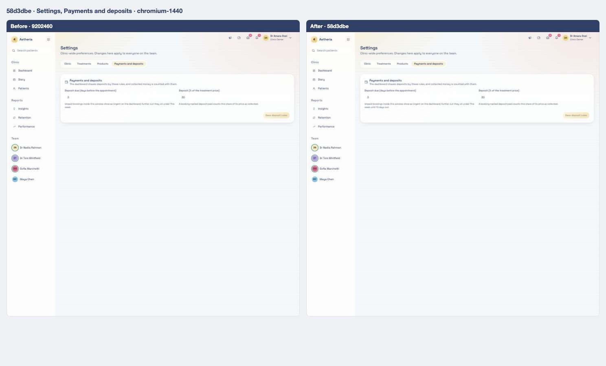

<strong>iPad landscape</strong> — <a href="../states/9202460/settings-payments--ipad-landscape.jpg">before</a> · <a href="../states/58d3dbe/settings-payments--ipad-landscape.jpg">after</a>

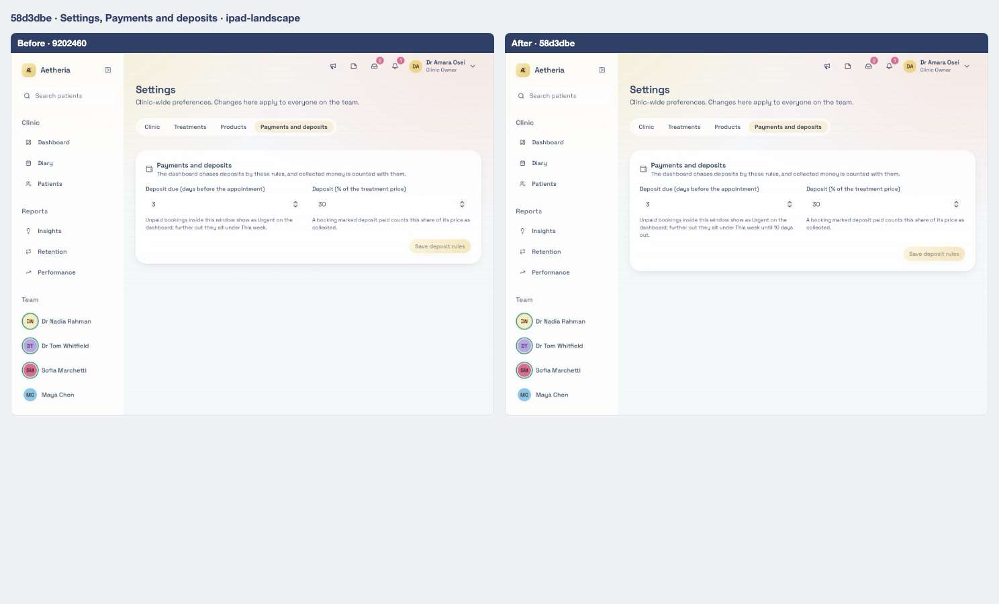

<strong>iPad portrait</strong> — <a href="../states/9202460/settings-payments--ipad-portrait.jpg">before</a> · <a href="../states/58d3dbe/settings-payments--ipad-portrait.jpg">after</a>

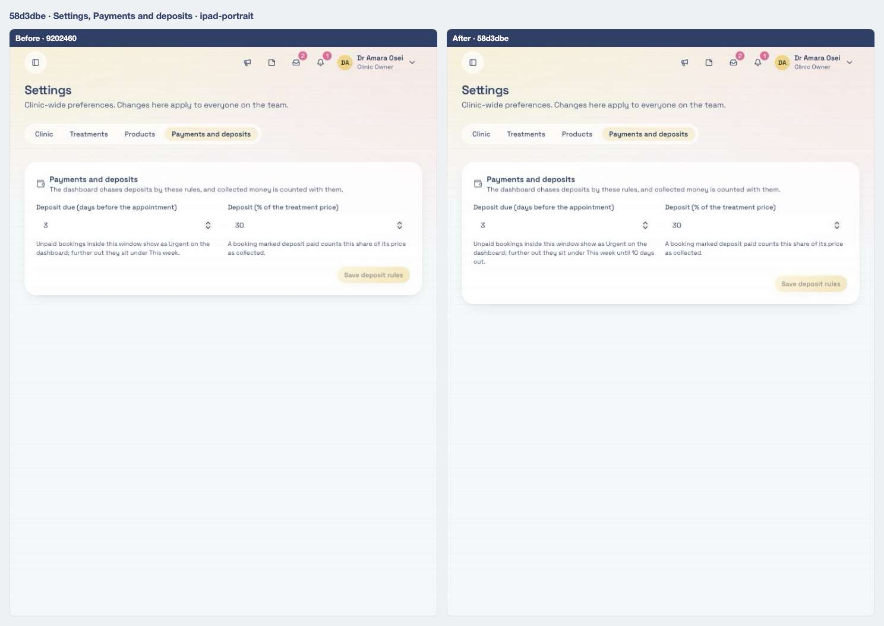

### Owner dashboard

Scene `dashboard-owner` · signed in as the clinic owner

**Desktop 1440** — [before](../states/9202460/dashboard-owner--chromium-1440.jpg) · [after](../states/58d3dbe/dashboard-owner--chromium-1440.jpg)

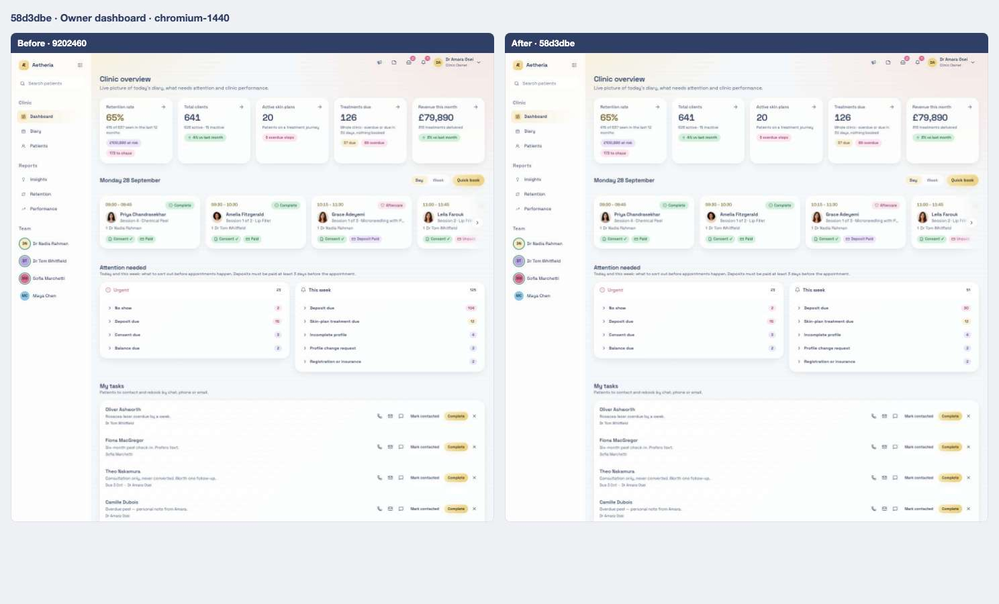

<strong>iPad landscape</strong> — <a href="../states/9202460/dashboard-owner--ipad-landscape.jpg">before</a> · <a href="../states/58d3dbe/dashboard-owner--ipad-landscape.jpg">after</a>

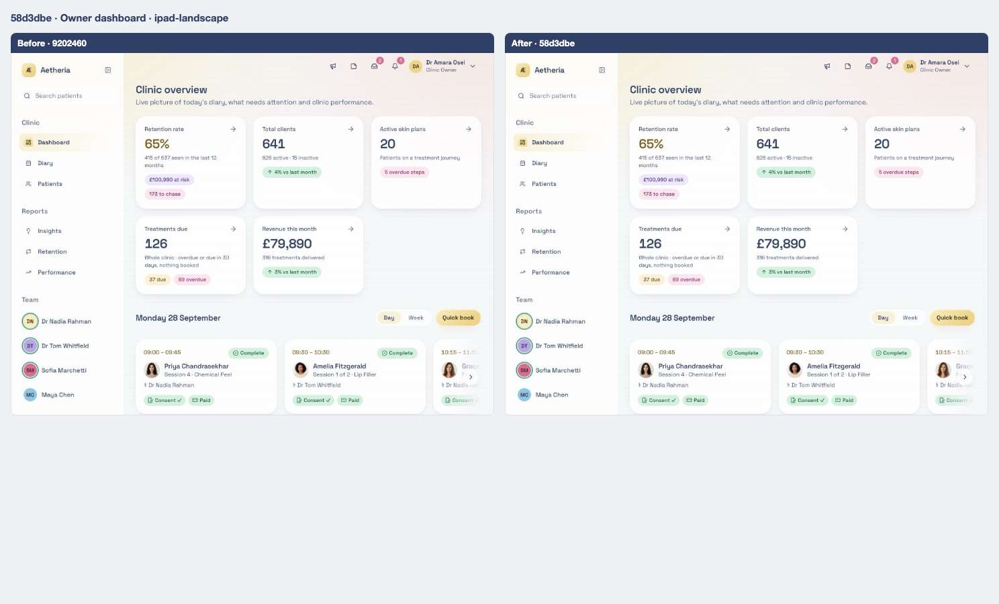

<strong>iPad portrait</strong> — <a href="../states/9202460/dashboard-owner--ipad-portrait.jpg">before</a> · <a href="../states/58d3dbe/dashboard-owner--ipad-portrait.jpg">after</a>

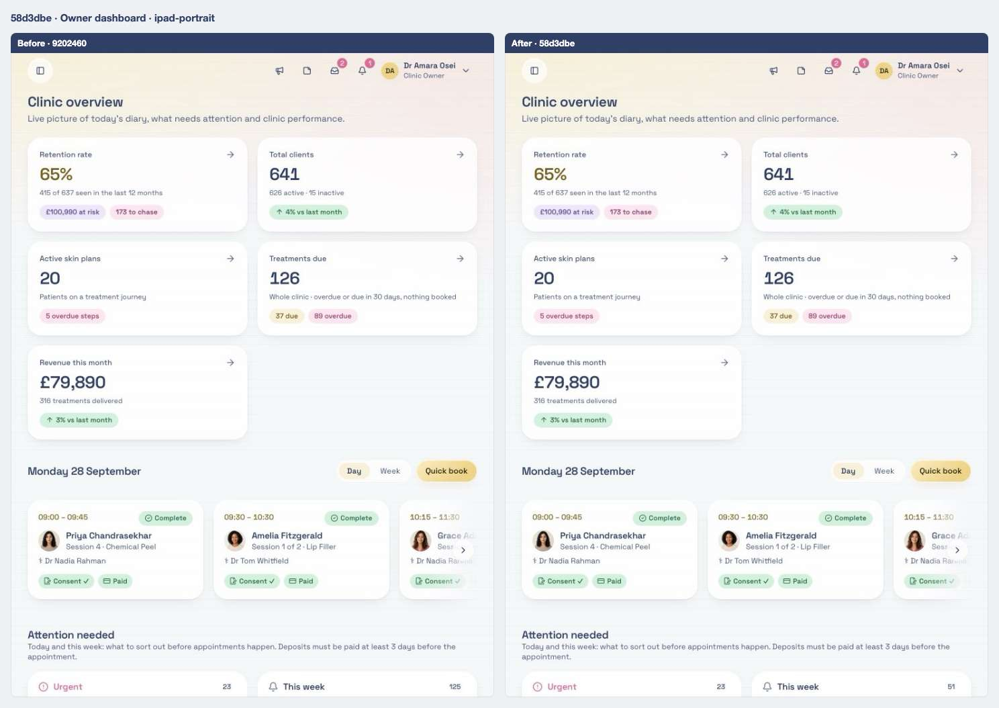

### Insights, Patient base

Scene `insights-book` · signed in as the clinic owner

**Desktop 1440** — [before](../states/9202460/insights-book--chromium-1440.jpg) · [after](../states/58d3dbe/insights-book--chromium-1440.jpg)

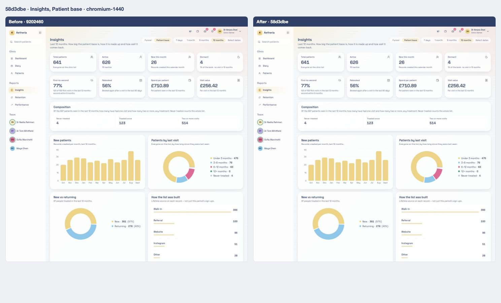

<strong>iPad landscape</strong> — <a href="../states/9202460/insights-book--ipad-landscape.jpg">before</a> · <a href="../states/58d3dbe/insights-book--ipad-landscape.jpg">after</a>

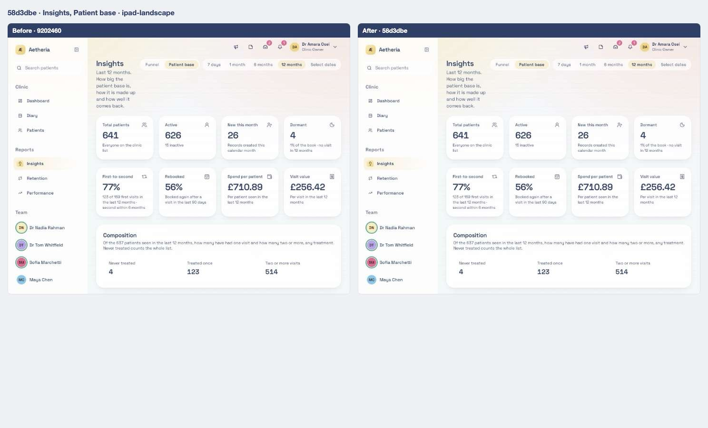

<strong>iPad portrait</strong> — <a href="../states/9202460/insights-book--ipad-portrait.jpg">before</a> · <a href="../states/58d3dbe/insights-book--ipad-portrait.jpg">after</a>

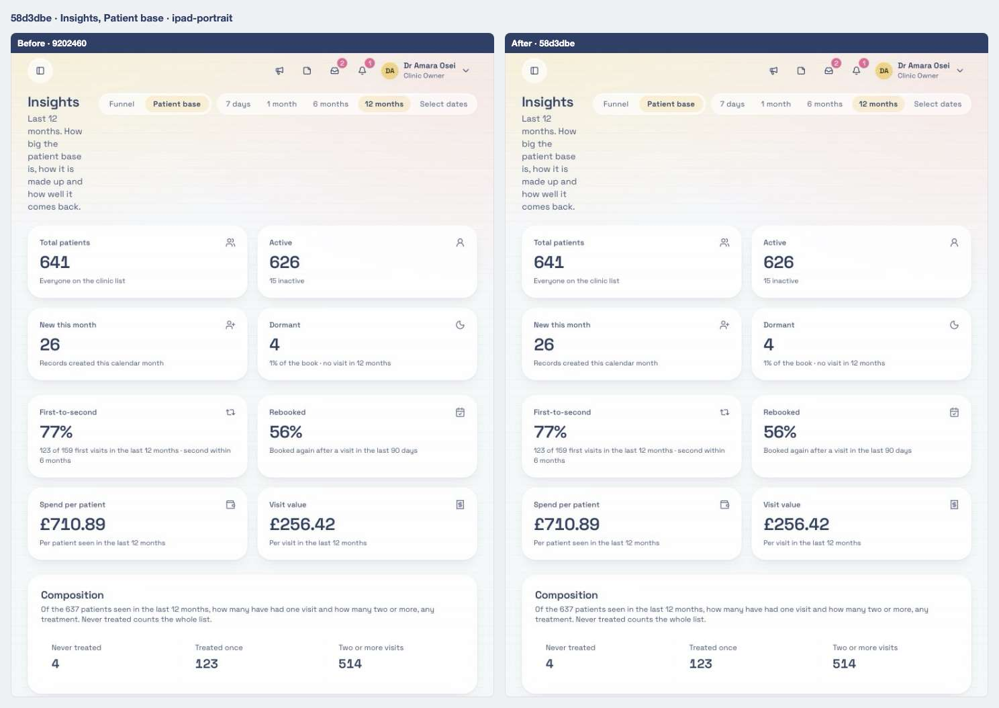

### Insights, Marketing

Scene `insights-marketing` · signed in as the clinic owner

**Desktop 1440** — [before](../states/9202460/insights-marketing--chromium-1440.jpg) · [after](../states/58d3dbe/insights-marketing--chromium-1440.jpg)

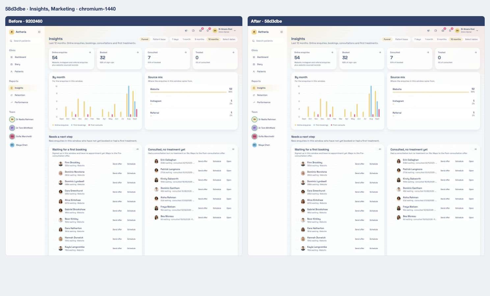

<strong>iPad landscape</strong> — <a href="../states/9202460/insights-marketing--ipad-landscape.jpg">before</a> · <a href="../states/58d3dbe/insights-marketing--ipad-landscape.jpg">after</a>

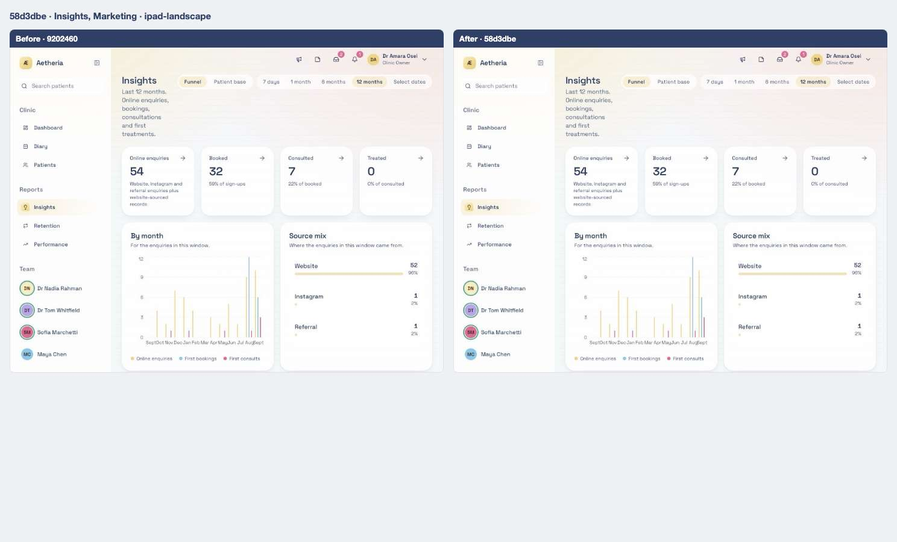

<strong>iPad portrait</strong> — <a href="../states/9202460/insights-marketing--ipad-portrait.jpg">before</a> · <a href="../states/58d3dbe/insights-marketing--ipad-portrait.jpg">after</a>

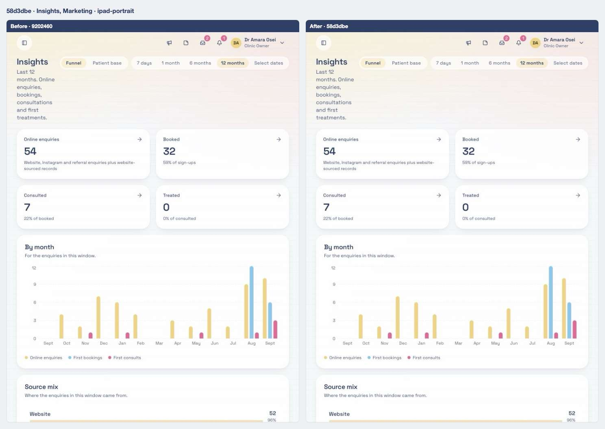

### Patients list

Scene `patients-list` · signed in as the clinic owner

**Desktop 1440** — [before](../states/9202460/patients-list--chromium-1440.jpg) · [after](../states/58d3dbe/patients-list--chromium-1440.jpg)

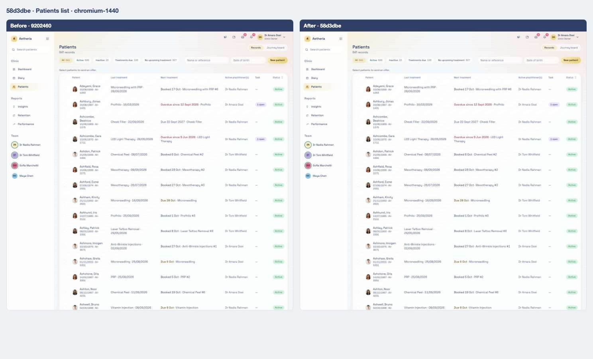

<strong>iPad landscape</strong> — <a href="../states/9202460/patients-list--ipad-landscape.jpg">before</a> · <a href="../states/58d3dbe/patients-list--ipad-landscape.jpg">after</a>

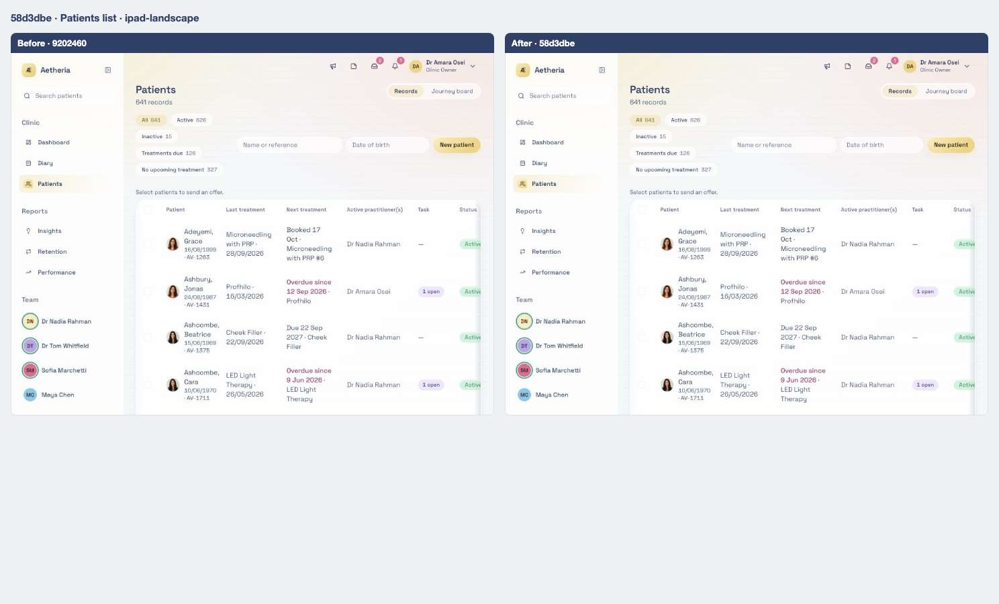

<strong>iPad portrait</strong> — <a href="../states/9202460/patients-list--ipad-portrait.jpg">before</a> · <a href="../states/58d3dbe/patients-list--ipad-portrait.jpg">after</a>

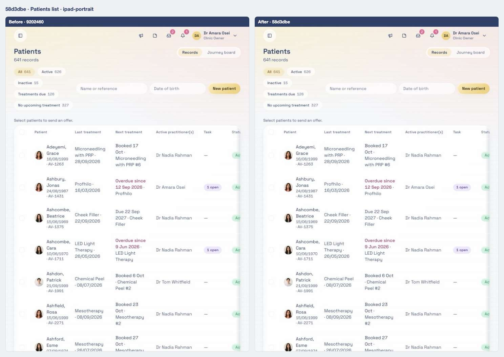

## Files

<strong>Components</strong> · 1 file, +1 / −1

| File | + | − |
| ---- | -: | -: |
| `src/components/payments-deposits-settings.tsx` | 1 | 1 |

<strong>Library and server functions</strong> · 4 files, +392 / −10

| File | + | − |
| ---- | -: | -: |
| `src/lib/clinic.functions.demo.ts` | 5 | 4 |
| `src/lib/clinic.functions.ts` | 8 | 6 |
| `src/lib/metrics/period.ts` | 285 | 0 |
| `src/lib/metrics/rules.ts` | 94 | 0 |

<strong>End-to-end tests</strong> · 1 file, +3 / −1

| File | + | − |
| ---- | -: | -: |
| `e2e/patients.spec.ts` | 3 | 1 |

<strong>Unit tests</strong> · 1 file, +10 / −0

| File | + | − |
| ---- | -: | -: |
| `tests/unit/metrics-definitions.test.ts` | 10 | 0 |

<strong>Docs and scripts</strong> · 4 files, +392 / −11

| File | + | − |
| ---- | -: | -: |
| `docs/audits/insights-numbers.before.json` | 12 | 3 |
| `docs/audits/insights-numbers.md` | 255 | 0 |
| `docs/audits/insights-recalc.ts` | 3 | 8 |
| `docs/audits/render-table.mjs` | 122 | 0 |

[← 13](13-9202460.md) · [Index](../README.md) · [15 →](15-21dee87.md)
