# Aetheria Clinic Portal — UI, UX and information architecture

**Audience:** designers, engineers and clinic operators who need a single reference for how the staff product is structured, why each page exists, and how the visual system holds together.

**Captured:** 13 September 2026, from the fixture clinic in demo mode (`npm run dev:demo`) as clinic owner **Dr Amara Osei**, except where a practitioner or receptionist persona is noted.

**Source of truth in code**

| Concern | Where it lives |
|---|---|
| Routes | `src/routes/_authenticated/*.tsx`, `src/routes/auth.tsx` |
| Shell | `src/components/app-shell.tsx` |
| Theme / tokens | `src/styles.css` |
| Permissions | `src/lib/permissions.ts` |
| Demo clinic | `src/lib/demo/data.ts` |
| Patient-facing sibling | `docs/patient-portal/` — not this guide |

Screenshots sit next to this file in [`screenshots/`](screenshots/). Recapture with [`capture-screens.mjs`](capture-screens.mjs) while demo is running on port 5174.

---

## 1. What the clinic portal is for

Aetheria is clinical-records software for aesthetic clinics and medspas. The **clinic portal** is the staff half of the product. A receptionist, practitioner or owner signs in and uses it to run the floor, keep the patient book, and see whether the practice is retaining people and collecting money.

The patient half (portal sign-in at `/portal`, current staff-facing stub at `/my-record`) is a separate surface. Same tokens and the same `AppShell`, different job.

From a clinic’s point of view the software has to answer four questions every day:

1. **Who is in, and what happens next?** — diary, arrivals, stage of visit.
2. **What is unfinished?** — deposits, consent, no-shows, overdue treatments, unread messages.
3. **Who is this person, clinically?** — history, photos, forms, notes, messaging.
4. **Is the book healthy?** — retention, earnings, commission, who on the team can do what.

The information architecture is built around those four questions, not around database tables.

---

## 2. How the application is structured

### 2.1 Mental model — three layers

Staff navigation is grouped so a busy clinic can find “today” without walking through “the business”.

| Nav group | Pages | Clinic meaning |
|---|---|---|
| **Clinic** | Dashboard, Diary, Patients | Run the floor. This is the default working set. |
| **Reports** | Retention, Performance | Look up from the floor. Shown only if the role is granted `reports.retention` / `reports.performance`. |
| **You** | My earnings | A practitioner’s own commission book. Hidden from managers (they already have Performance). |
| **Team** | Live roster in the sidebar | Jump to a colleague’s profile or 1:1 chat. Online people sort to the top. |
| **Account menu** | My profile, Team, Settings, Sign out | Practice administration. Team and Settings also require permission. |

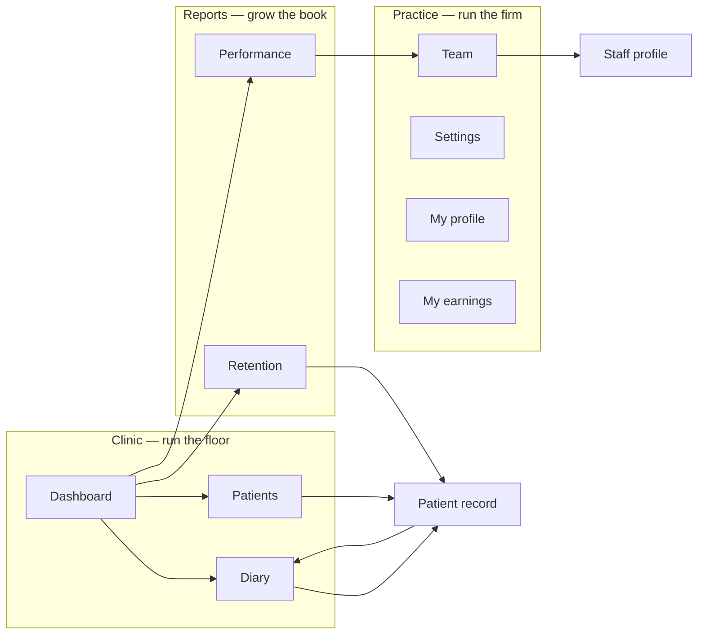
```mermaid
flowchart LR
  subgraph floor [Clinic — run the floor]
    D[Dashboard]
    S[Diary]
    P[Patients]
  end
  subgraph book [Reports — grow the book]
    R[Retention]
    F[Performance]
  end
  subgraph practice [Practice — run the firm]
    T[Team]
    G[Settings]
    M[My profile]
    E[My earnings]
  end
  D --> S
  D --> P
  D --> R
  D --> F
  S --> Rec[Patient record]
  P --> Rec
  R --> Rec
  Rec --> S
  T --> SP[Staff profile]
  F --> T
```

Nothing important is duplicated across those groups. Retention is not also a Dashboard tab. Settings does not restated Team. The patient record is not a top-level item — you arrive from the list, the diary, or a chase.

### 2.2 A clinic day, as the product sees it

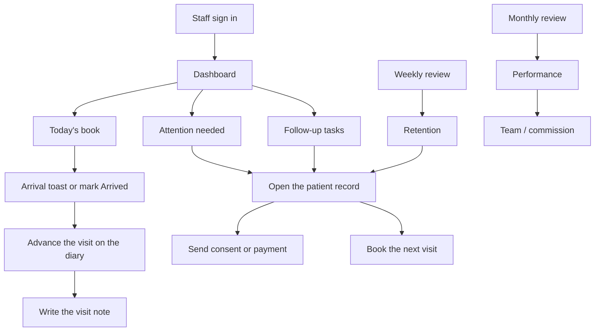
```mermaid
flowchart TD
  Signin[Staff sign in] --> Home[Dashboard]
  Home --> Book[Today's book]
  Book --> Arrive[Arrival toast or mark Arrived]
  Arrive --> Stage[Advance the visit on the diary]
  Stage --> Note[Write the visit note]
  Home --> Chase[Attention needed]
  Chase --> Record[Open the patient record]
  Record --> Paper[Send consent or payment]
  Record --> Next[Book the next visit]
  Home --> Recall[Follow-up tasks]
  Recall --> Record
  Week[Weekly review] --> Ret[Retention]
  Ret --> Record
  Month[Monthly review] --> Perf[Performance]
  Perf --> Team[Team / commission]
```

Typical paths:

- **Reception, 8:50am.** Dashboard titled “Front desk”. Today’s carousel, then chase deposits and consent. Arrival toasts fire as people check in.
- **Practitioner, between patients.** Dashboard titled “My day” — own list, own follow-ups, private notes. Diary is the treatment room clock. Earnings is their own cut.
- **Owner, Monday.** Dashboard titled “Clinic overview”. KPIs first, then the floor. Retention and Performance sit in Reports. Team and Settings stay in the account menu so they do not compete with today’s list.

Headings change with role on purpose. The page is the same route (`/dashboard`); the copy tells the person what *their* day is.

### 2.3 Who can see what

Owners hold every capability. Other roles use explicit grants (`src/lib/permissions.ts`).

| Capability | Typical owner | Manager | Practitioner | Reception |
|---|---|---|---|---|
| Dashboard, Diary, Patients | Yes | Yes | Yes | Yes |
| Retention | Yes | Grant | Grant | Grant |
| Performance | Yes | Grant | — | — |
| My earnings | — | — | Yes (if not a manager) | — |
| Team page | Yes | If `team.view` | If `team.view` | If `team.view` |
| Edit staff / invite / revoke | Yes | — | — | — |
| Settings (clinic + catalogue) | Yes | If `settings.treatments` | Read-only if they can open it | Read-only if they can open it |
| Archive a patient | Owner only | — | — | — |

The sidebar Team list is staff-only. Patients never see Clinic / Reports — they are redirected to `/my-record`.

---

## 3. Theme and design language

The clinic theme is **Bright Pastels on Notebook Lines** (`src/styles.css`). It is one system for staff and patients. Do not fork a second palette.

### 3.1 Page wash

The canvas is not a flat grey admin theme. `body` uses:

- paper fill `--background` `#f6f7f8`
- a yellow radial bloom top-left (`--wash-1`)
- a peach radial bloom top-right (`--wash-2`)
- a 14px repeating horizontal rule (`--rule`) so the product reads like a clinic notebook, not a SaaS dashboard

Glass cards sit on that wash. The wash must stay visible through translucent surfaces — do not flatten `--glass` to opaque white.

### 3.2 Tokens

| Token | Value | Use |
|---|---|---|
| `--foreground` | `#2f3f66` | Primary ink |
| `--ink-2` | `#46557a` | Secondary copy, idle nav |
| `--ink-3` | `#6a7390` | Meta, timestamps, table headers |
| `--glass` / `--glass-2` | white 82% / 62% | Cards, wells, inputs |
| `--edge` / `--edge-hi` | white 70% / 92% | Hairline and lit top edge |
| `--accent` / `--accent-hi` | `#eed488` / `#faedc2` | Primary CTA, active nav tile, confirmed gold |
| `--accent-ink` | `#7a6220` | Type on / next to gold |
| `--accent-soft` | gold 30% | Active pill, selected tab |
| `--success` / `--success-ink` | `#4a9d75` / `#2d6a4c` | Done, paid, complete, active |
| `--consent` / `--consent-ink` | `#b9a6e8` / `#5c4a94` | Needs the patient to act (consent, waiting) |
| `--sky` / `--arrived-ink` | `#8fc7ea` / `#3d6f96` | Arrived, informational |
| `--destructive` / `--destructive-ink` | `#dc6c96` / `#a3456e` | Urgent, no-show, unpaid, overdue |
| `--aftercare` / `--aftercare-ink` | `#ef9bc4` / `#8a3d66` | Aftercare stage only |

**Semantic rule.** Green is finished and safe. Lilac / gold-soft is “waiting on someone”. Rose is urgent or destructive. Do not use rose as decoration. A receptionist scanning the diary has to trust the colour.

### 3.3 Type

One family: **Space Grotesk**, loaded in `src/routes/__root.tsx`.

| Role | Class / size | Weight |
|---|---|---|
| Page title | `.page-title` · 22px / −0.016em | 600 |
| Page subtitle | `.page-subtitle` · 14px, `--ink-2` | 400 |
| Section title | `.section-title` · 17px / −0.016em | 600 |
| KPI figure | 27px / −0.02em, tabular | 600 |
| Stat figure | 22px / −0.016em, tabular | 600 |
| Body | 13.5px / 1.5 | 400 |
| Controls | 12–12.5px | 500–600 |
| Meta | 11px (`text-2xs`), `--ink-3` | 400 |

Money is always `en-GB` / GBP, tabular.

### 3.4 Surfaces and radius

Radius is hierarchical. Do not collapse it to one value.

| Surface | Radius | Notes |
|---|---|---|
| `.glass-card` / `Card` | 22px | Translucent fill, blur 26px, sheen, `shadow-glass` |
| Nav rows, inputs, `.glass-item` | 11px | Inset well on an already-white card |
| Brand mark | 9px | Gold tile with Æ |
| Buttons, pills, chips, tabs | full | Same track everywhere |
| Dialogs | 22px | Match the card, not a sharp modal |

**No left accent rails.** Do not use a coloured `border-l-*` bar or `absolute left-0 w-[3px]` on cards, rows or popovers. Status is carried by wash, chip, avatar and sheen.

### 3.5 Controls

**Primary button** — gold gradient (`accent-hi` → `accent`), bloom shadow, 12.5px semibold, `h-9`, scales to 0.98 on press.

**Outline / secondary** — glass fill, inset highlight, ink label.

**Pills** (period, day/week, Current/Former) always sit **to the right of the title**, on the same row. Track:

```
flex h-[34px] items-center gap-0.5 rounded-full border border-edge bg-glass-2 p-0.5 shadow-inset-hi
```

Active segment: `bg-accent-soft font-semibold` with an inset edge. Labels stay full words (“This month”, not “Month”).

**Page header** uses `.page-header`. On `sm+` it is a row; the last child aligns to the title line so a wrapping subtitle cannot push a pill down.

### 3.6 Tables

Hand-rolled `<table class="glass-table">` rather than a heavy data-grid. Header type is 11px / 600 / `--ink-3`. Rows hover with `--accent-wash`. Empty states are a dashed glass well, not a blank page.

### 3.7 Practitioner lanes and treatment colour

Team avatars use eight pastel **lanes** (`--lane-1` … `--lane-8`) so people stay identifiable in the sidebar and diary.

Diary events are coloured by **treatment**, not by practitioner. The owner sets those colours on Settings. The day/week/month planners share a treatment legend so “pink = peel” is learnable.

---

## 4. Shared chrome — AppShell

Every authenticated staff page is the same chrome. Do not invent a second header.

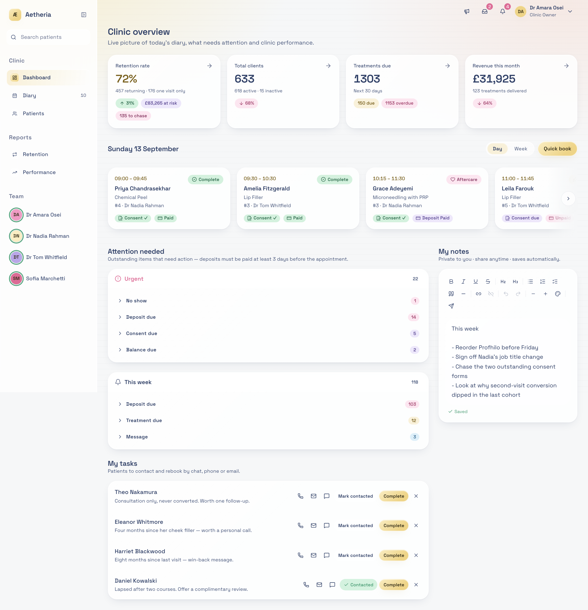

### 4.1 Sidebar

- Default width 238px, resizable 180–420px, persisted in `localStorage`.
- Collapse with `[` (when not typing) or the panel button. Open again from the overlay toolbar.
- Brand lockup (Æ + “Aetheria”) links to `/dashboard`.
- **Search patients** — `/` focuses it. Submit goes to `/patients?view=all&q=…`.
- Active item: gold-soft wash, inset edge, gold icon tile.
- Diary shows today’s booking count as a quiet numeral, not a red badge.
- Team members show initials, lane colour, and a green ring when online.

### 4.2 Overlay toolbar

The toolbar is **sticky and transparent**, not a solid app bar. Glass chips fade in over the first ~72px of scroll (`--toolbar-chip-blend`). Right cluster:

1. **Alert team** — megaphone, opens `StaffAlertDialog` (urgent / room issues).
2. **Sent staff alerts** — what you have already raised.
3. **Notification bell** — deposits, consent, messages, recalls.
4. **Account pill** — avatar, name, role label, menu.

Page titles live **in the canvas**, not in this toolbar.

### 4.3 Live floor overlays

Staff get a bottom-right stack that is not a page:

- `ArrivalAlerts` — “Has X arrived?” with Arrived / No show.
- `UrgentStaffAlerts` — room / equipment / help-needed cards.
- `AlertAckToaster` — acknowledgement of those alerts.

They are part of running the floor. They are hidden in most screenshots below so the page itself is readable.

### 4.4 Narrow widths

The product does not grow a second navigation model. The sidebar collapses; the same page stacks to one column. Title, KPIs, then the diary carousel.

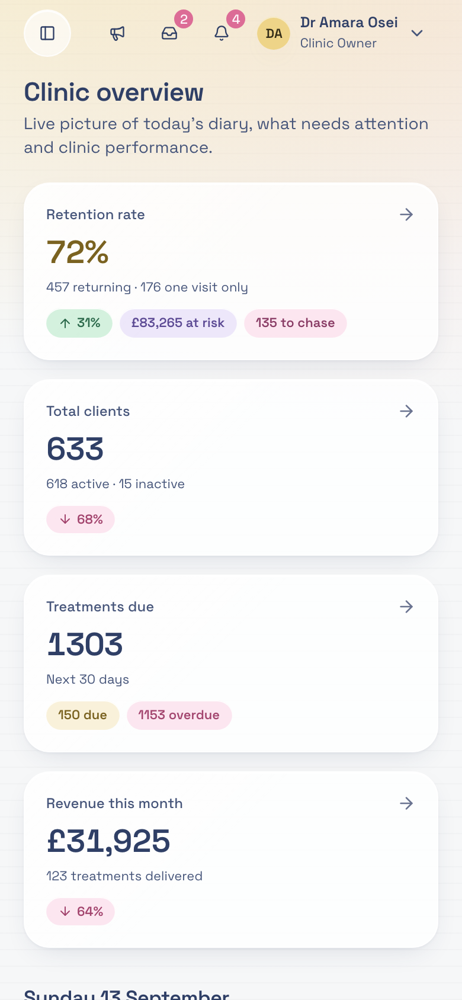

---

## 5. Entry surfaces

These are not “clinic pages” in the sidebar, but they are how staff get in.

### 5.1 Marketing home — `/`

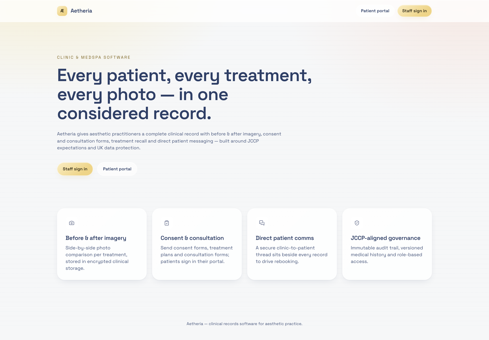

**Reasoning.** A public hello, not a working screen. It states the four clinical promises (imagery, consent, messaging, JCCP-aligned governance) and splits **Staff sign in** from **Patient portal** so the two surfaces never share a form.

**Components.** `BrandLockup`, `Button` (gold + outline), four `.glass-card` feature tiles.

### 5.2 Staff sign in — `/auth`

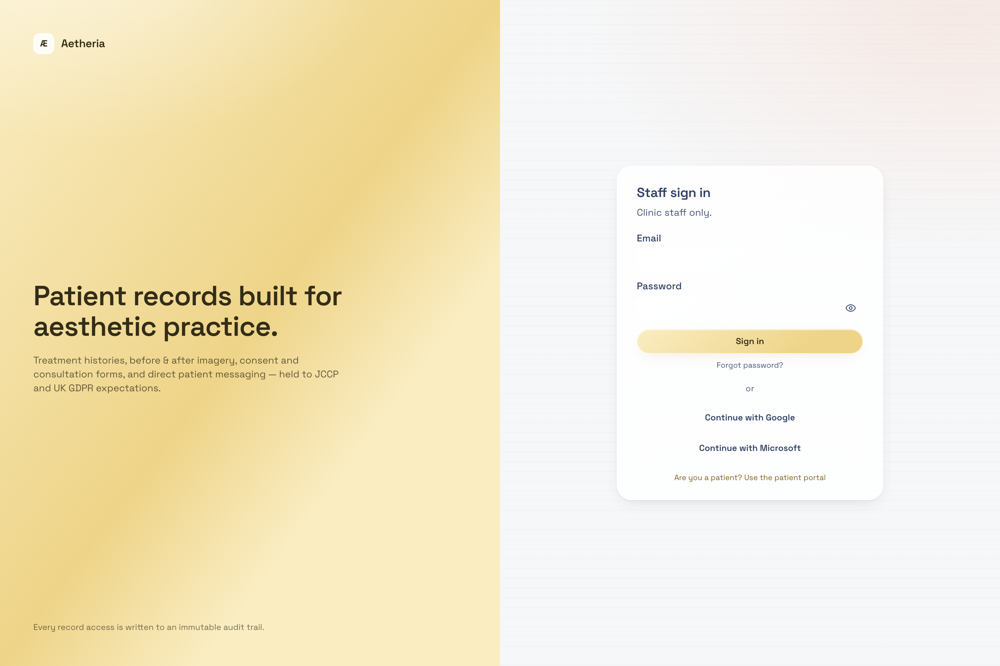

**Reasoning.** Staff and patients must not share a login. Copy says “Clinic staff only.” A patient is sent to `/portal`. Failed or wrong-surface identities are signed out (`destinationFor` in `src/lib/auth/surfaces.ts`).

**Layout.** Split: gold brand panel (hidden below `lg`) and a `.glass-card` form.

**Components.** `BrandLockup`, `Input`, `Label`, `Button`, `OAuthButtons`, `PasswordResetRequest` (forgot mode), password visibility toggle.

**Related.** `/auth/reset` (choose a new password from email). After invite, `ForcePasswordChangeGate` then an optional `StaffWelcomeDialog`. MFA (`MfaGate`) and idle sign-out (`IdleWatchdog`) wrap the authenticated tree. Demo mode skips MFA.

---

## 6. Clinic pages

### 6.1 Dashboard — `/dashboard`

**Who.** All staff. Heading is “Clinic overview” (manager/owner), “Front desk” (receptionist), or “My day” (practitioner).

**Why it exists.** This is the morning huddle. Numbers first, today’s book second, unfinished work third, a private notepad last. A manager should see the business; a nurse should see their list. Same page, different emphasis.


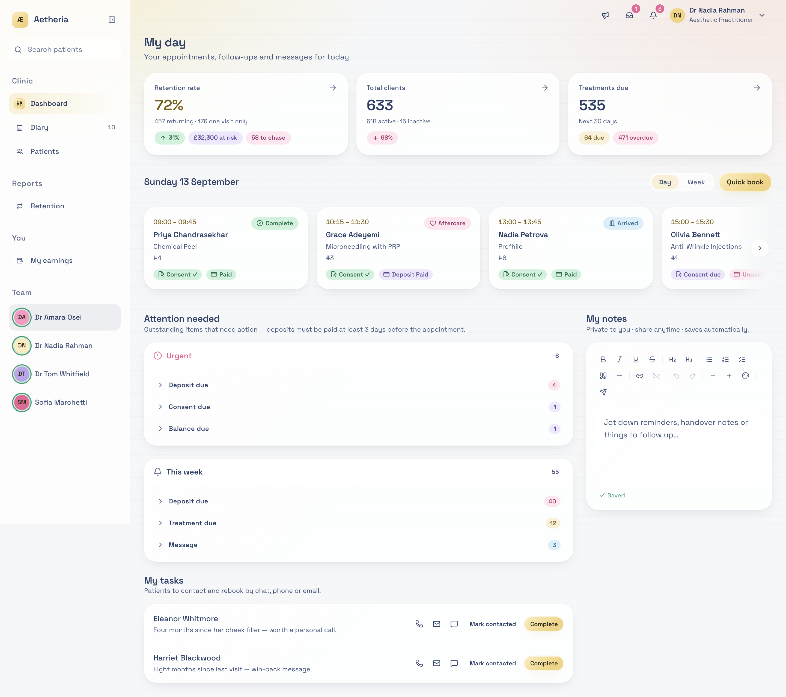

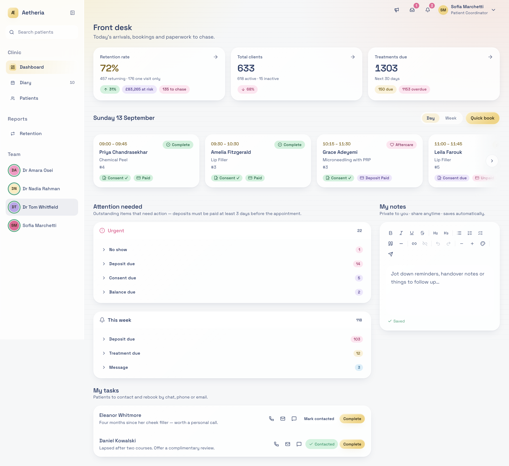

**Layout**

1. `.page-header` with role-specific title and one-line subtitle.
2. `KpiGrid` — four (or fewer) glass tiles. Retention and revenue hide when the role lacks the grant. Each tile is a link (Retention, Patients, Treatments due, Performance).
3. Today’s date + day/week pill + **Quick book**.
4. `TodaySnapshot` — horizontal appointment carousel, starting at the next / in-progress visit.
5. Two columns on `lg+`: **Attention needed** + **Follow-up tasks** | **My notes**.

**Components**

| Component | File | Role |
|---|---|---|
| `KpiGrid` | `src/components/dashboard/kpi-grid.tsx` | Linked KPI tiles + tone chips |
| `TodaySnapshot` | `src/components/dashboard/today-snapshot.tsx` | Day/week appointment cards, stage, consent, payment |
| `QuickAddAppointment` | `src/components/quick-add-appointment.tsx` | Book without leaving the dashboard |
| `AttentionList` | `src/components/dashboard/attention-list.tsx` | Grouped chase list (no-show, deposit, consent, balance, incomplete profile, …) |
| `FollowUpTasks` | `src/components/dashboard/follow-up-tasks.tsx` | Recall / rebook tasks with phone / email / message |
| `NotesPanel` | `src/components/dashboard/notes-panel.tsx` | Private rich notes, resizable, autosave |
| `Period`-style pill | inline | Day / week |

**Flow.** KPI → deep page. Attention row → patient or diary. Carousel card → same stage machine as the diary. Notes never leave this page (they are the practitioner’s scrap paper, not the clinical record).

---

### 6.2 Clinic diary — `/schedule`

**Who.** All staff. `appointments.edit` is required to change bookings.

**Why it exists.** The diary is the operational clock. Aesthetic clinics run rooms, not “calendars of events”. The page is a **planner**: practitioners as columns (day), days as columns (week), a month heat-map for looking ahead. Colour is treatment. Stage, consent and payment sit on the card so reception does not open a second screen to ask “have they signed?”.

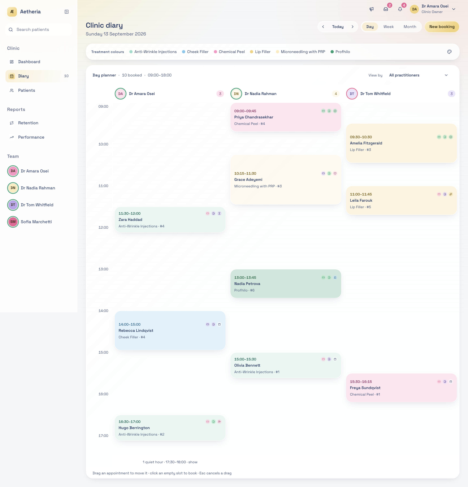

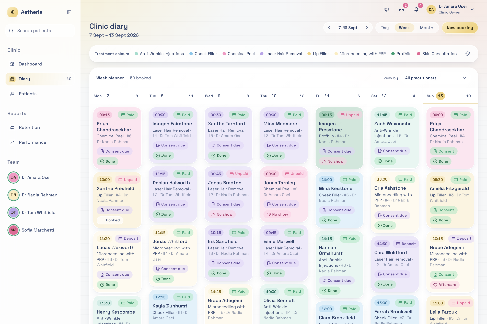

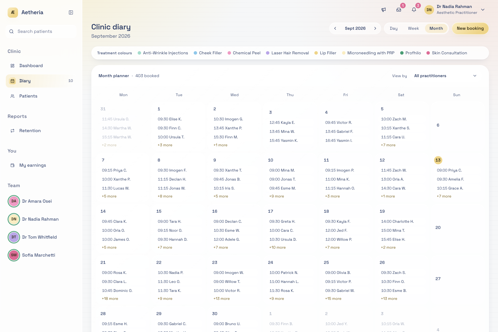

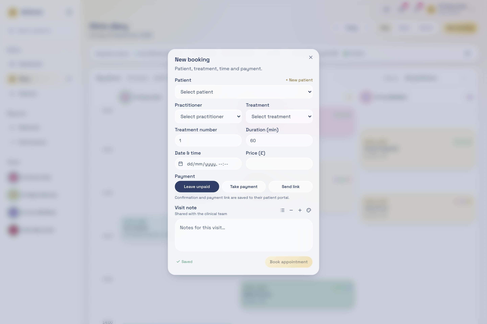

**Header.** Title “Clinic diary”, subtitle is the visible range. Right cluster: prev / Today / next pill, day–week–month pill, **New booking**.

**Day.** Time grid, one column per practitioner, filter “View by”. Drag to move, click an empty slot to book. Footer hints (quiet hour, Esc to cancel a drag).

**Week.** Seven day columns, weekend slightly washed, today in accent-wash. Compact cards: time, name, treatment #, practitioner, payment, consent, stage.

**Month.** One cell per day, first few names, “+N more”. Clicking a day drops you onto that day view.

**New booking.** Patient (or inline new patient), practitioner, treatment (fills duration and price), treatment number, datetime, payment mode (leave unpaid / take payment / send link), visit note shared with the team.

**Components**

| Component | Role |
|---|---|
| Day / week / month views | In `schedule.tsx` (`DayPlanner`, `WeekView`, `MonthView`) |
| `StageTracker` | Booked → Arrived → Waiting → In treatment → Aftercare → Complete, plus No show |
| `TreatmentLegend` | Colour key for the catalogue |
| `PractitionerFilter` | Limit columns to one book |
| `AppointmentTimeEditor` | Nudge a slot without a full edit |
| `VisitNoteChip` | Open the visit note from the card |
| `NoShowFollowUpDialog` | After a no-show, create a recall task |
| `QuickAddAppointment` / booking `Dialog` | Create a visit |
| `HoverCard` / `PractitionerHoverCard` | Peek a colleague |
| Payment + consent chips | Paid / deposit / unpaid, signed / due |

**Stage colour language**

| Stage | Fill |
|---|---|
| Booked | Glass, muted ink |
| Arrived | Sky |
| Waiting | Lilac |
| In treatment | Gold-soft |
| Aftercare | Peach / aftercare ink |
| Complete | Mint |
| No show | Rose |

**Flow.** Dashboard carousel and diary share the same appointment state. Completing a visit, requesting payment, or writing a note here is what the patient record’s Visit notes and chase lists read.

---

### 6.3 Patients — `/patients`

**Who.** All staff.

**Why it exists.** The master list is a **working roster**, not a CRM dump. Columns are last treatment, next treatment, next due, paperwork, status — the questions reception actually asks on the phone. Filters (All / Active / Inactive / Treatments due) are the same views the dashboard KPI tiles deep-link into (`?view=due`).

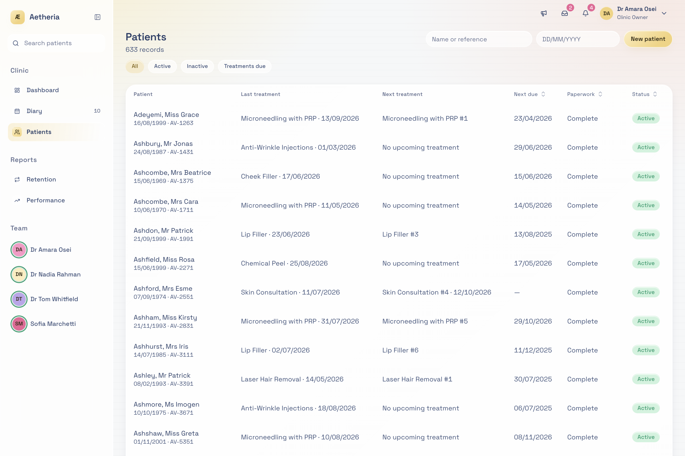

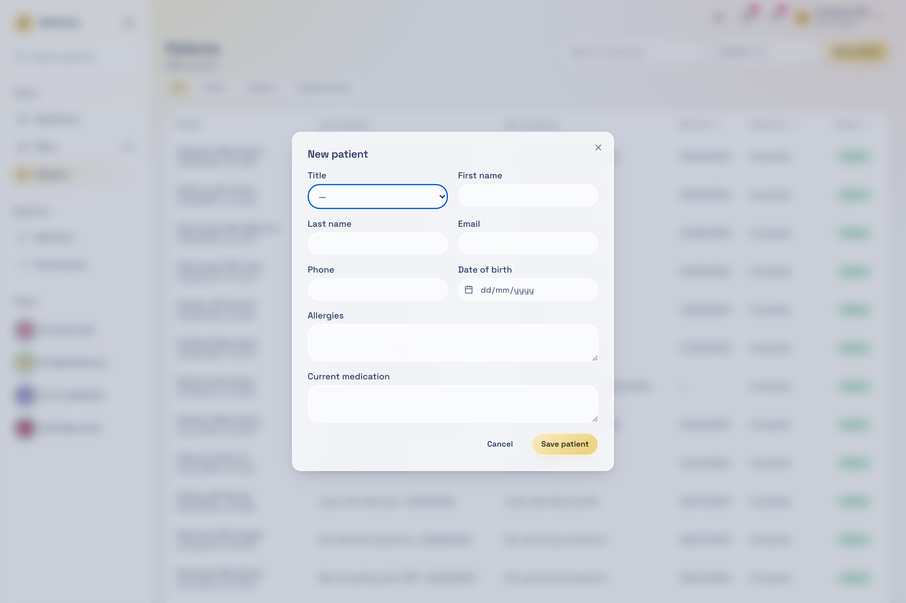

**Header.** Title + live count. Right: name/reference search, DOB search (`DD/MM/YYYY`), **New patient**. Sidebar search lands here with `q` filled.

**New patient.** Title, names, email, phone, DOB, allergies, medication. Validated with the same `SavePatient` schema the server uses. Clinical depth (conditions, photos, forms) happens on the record, not at create — create has to be fast at the desk.

**Components.** `AppShell`, `Card`, `Input`, `Button`, `Badge`, `Dialog`, `Form` + `SavePatient` pick, `glass-table`, filter chips, `StatusBadge`.

**Flow.** Row → `/patients/$id`. “Treatments due” is the 30-day recall list the dashboard already counted.

---

### 6.4 Patient record — `/patients/$id`

**Who.** All staff. Archive / restore is owner-only and step-up gated.

**Why it exists.** This is the clinical object the whole product orbits. Everything else is a way to get here or a report over many of these. The page is a **split record**: identity and clinical tabs on the left, a private thread on the right. Chat is always present because aesthetic aftercare and rebooking live in conversation, not in a separate inbox app.

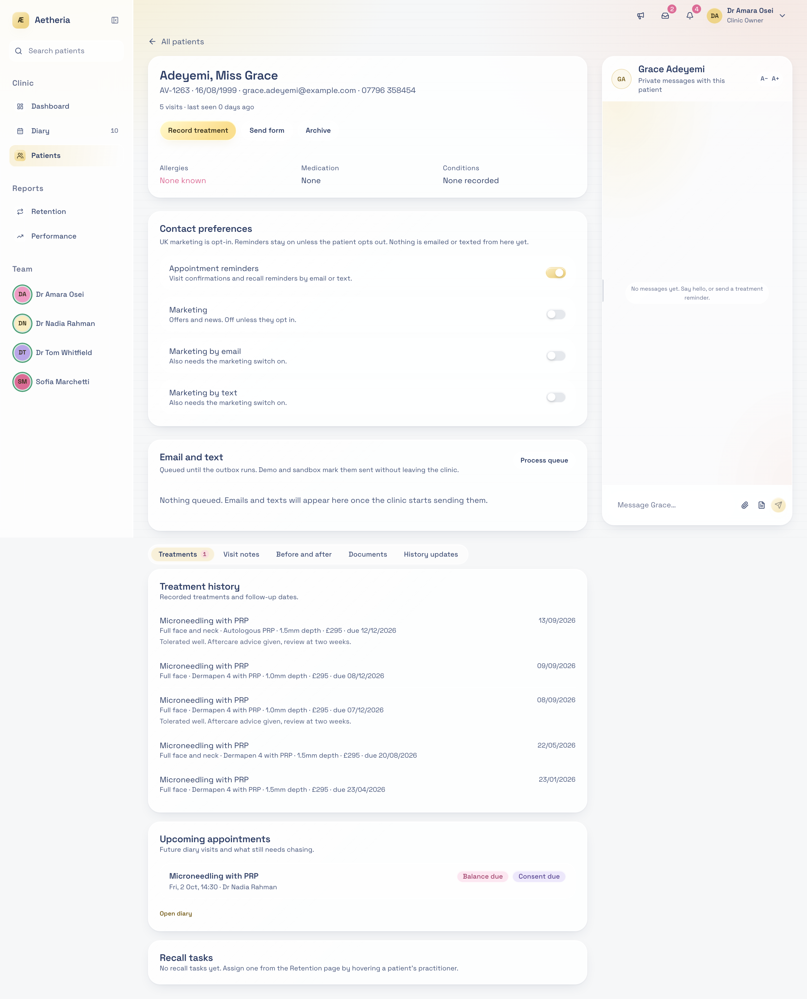

**Identity card.** `Last name, Title First name`, reference, DOB, email, phone. Retention `RiskBadge` + visit count + last seen. Actions: **Record treatment**, **Send form**, **Archive** (owner). Safety strip: allergies (alert ink), medication, conditions.

**Always-on comms (above the tabs).** `CommsPreferencesCard` (reminders / marketing email / marketing SMS — UK opt-in) and `CommsLogCard` (outbox for email and text). The clinic should see preference and delivery on the same scroll as the record, not in Settings.

**Tabs** — full-width record tabs are the one place a pill bar may sit without a title beside it.

#### Treatments (default)

History with area / product / dose / price / next due. Upcoming appointments that still need chasing (deposit, balance, consent) with issue chips and a link back to the diary. `RecallTasksPanel` for this patient.

#### Visit notes

Notes written from diary appointments, grouped by day. Empty state sends you to the diary — notes are not invented here.

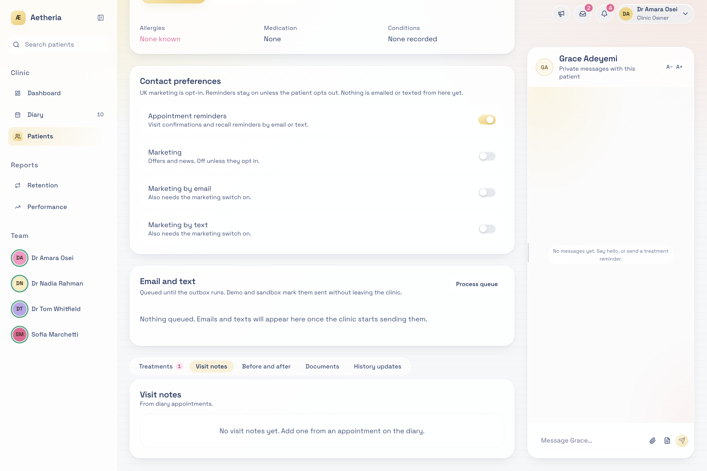

#### Before and after

Side-by-side comparison (two points in the course) plus upload well, tagged to a treatment. This is the aesthetic differentiator: photos belong to a treatment, not a generic gallery.

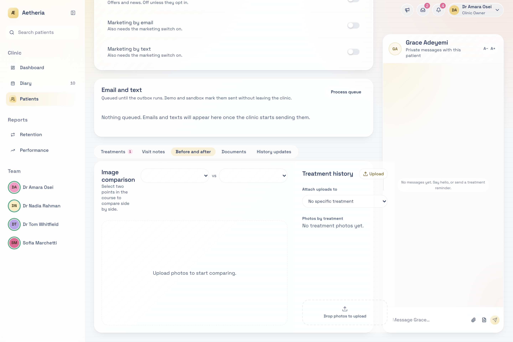

#### Documents

Consent, consultation, treatment plan, aftercare, payment/other. Status chip; **Remind** if unsigned. Issuing a form puts it in the patient portal.

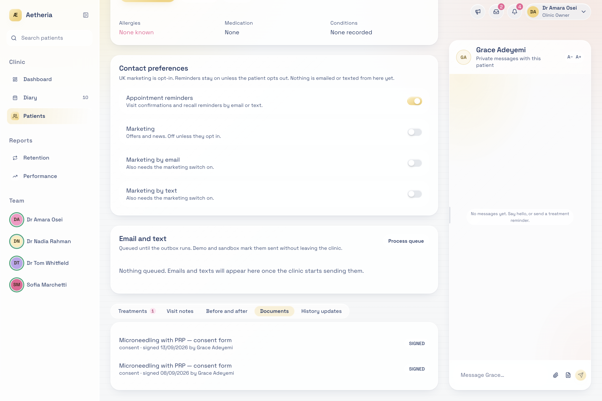

#### History updates

Patient-submitted medical history. Staff **Mark reviewed**. Supports JCCP-style governance: the patient can update, the clinician signs off.

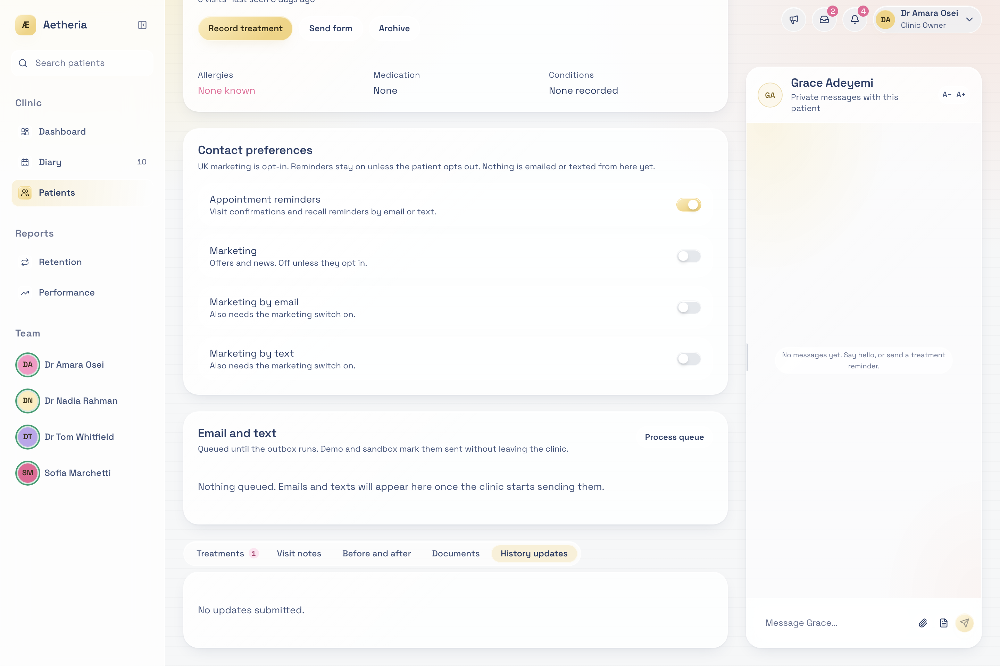

**Right rail.** `PatientChatPanel` — resizable 280–520px (`usePanelWidth`). Staff bubbles are butter glass; patient bubbles are frost. A− / A+ scales the thread.

**Components.** `RiskBadge`, `PatientChatPanel`, `CommsPreferencesCard`, `CommsLogCard`, `RecallTasksPanel`, `Tabs`, `Dialog` (treatment / form / archive), `useStepUp`, `Badge`, `Card`.

**Query params.** `?tab=photos` etc. `?chase=1` opens Treatments and scrolls to upcoming bookings (from Attention / Retention).

---

## 7. Report pages

### 7.1 Retention — `/retention`

**Who.** `reports.retention`. A non-manager practitioner sees **their own book** only.

**Why it exists.** Aesthetic clinics make money on the second and third visit. The diary cannot tell you who quietly stopped coming. Retention is a **chase desk**: rate, one-visit cohort, revenue at risk, a suggested next action, then a filterable at-risk table.

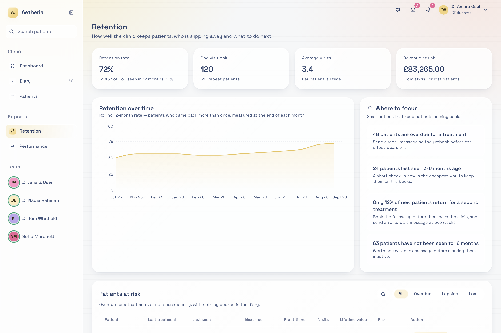

**Layout**

1. Four stats (rate, one-visit only, average visits, revenue at risk).
2. `RetentionTrend` (rolling 12-month returners) + `SuggestedActions` (“Where to focus”).
3. `AtRiskTable` — search + All / Overdue / Lapsing / Lost. Mark contacted. Managers can assign. Row opens the patient (`?chase=1` when relevant).
4. `RetentionBreakdown` — cohorts (2nd / 3rd visit conversion) and repeat rate by treatment.

**Risk language**

| Badge | Meaning |
|---|---|
| Overdue | Due for a treatment, nothing booked |
| Lapsing | Last seen 3–6 months, going quiet |
| Lost | Not seen ~6 months+, inactive |

**Components.** `Card` stats, `RetentionTrend`, `SuggestedActions`, `AtRiskTable`, `RiskBadge`, `SendRecallDialog`, `StaffTaskHoverCard`, `RetentionBreakdown`.

**Flow.** Suggestion click sets the table filter. Contacted writes `logRetentionOutreach`. Tasks appear on the dashboard Follow-up list and on the patient record.

---

### 7.2 Performance — `/performance`

**Who.** `reports.performance` (typically owner / manager). Others are sent back to the dashboard.

**Why it exists.** This is the commercial twin of Retention. Retention asks “who is leaving?”. Performance asks “what did we earn, collect, and owe practitioners?”. Commission is edited on Team, not here — this page is read-out, not payroll setup.

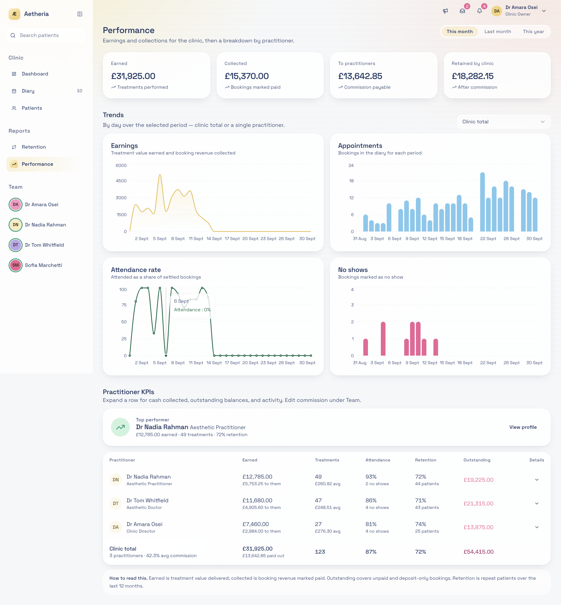

**Header.** Title + subtitle; `PeriodPicker` (This month / Last month / This year) on the title row.

**Body.** Four totals (Earned, Collected, To practitioners, Retained by clinic). `PerformanceTrends` — earnings, appointments, attendance, no-shows; optional single-practitioner filter. `PerformanceTable` — expandable practitioner KPIs, clinic total row, link to the staff profile. A glass footnote explains the vocabulary so “earned ≠ collected” stays explicit.

**Components.** `PeriodPicker`, `Card`, `PerformanceTrends` (Recharts), `PerformanceTable`.

---

### 7.3 My earnings — `/earnings`

**Who.** Practitioners who are not managers. In the **You** group.

**Why it exists.** Associates should see their own cut without seeing the whole clinic P&L. Same period pill and money language as Performance, scoped to `getMyEarnings`.

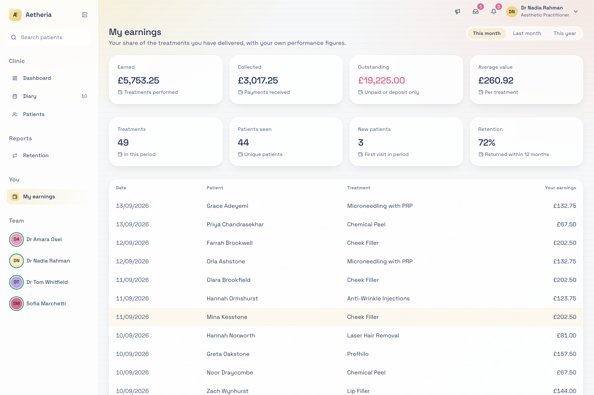

**Layout.** Four money stats (outstanding uses destructive ink). Four activity stats (treatments, patients, new patients, retention). `glass-table` of date / patient / treatment / share.

**Components.** `PeriodPicker`, `Card`, `glass-table`.

---

## 8. Practice pages

### 8.1 Team & access — `/team`

**Who.** `team.view`. Invite, role changes, revoke, passwords: owner. Approve profile changes: `team.approve_changes`.

**Why it exists.** A small aesthetic clinic is a named room of people, not an SSO directory. This page is **who can sign in, as what, and what they may touch**. Current / Former is a 90-day safety net: names stay after revoke so you still know who treated a patient; clinical records are never deleted with the account.

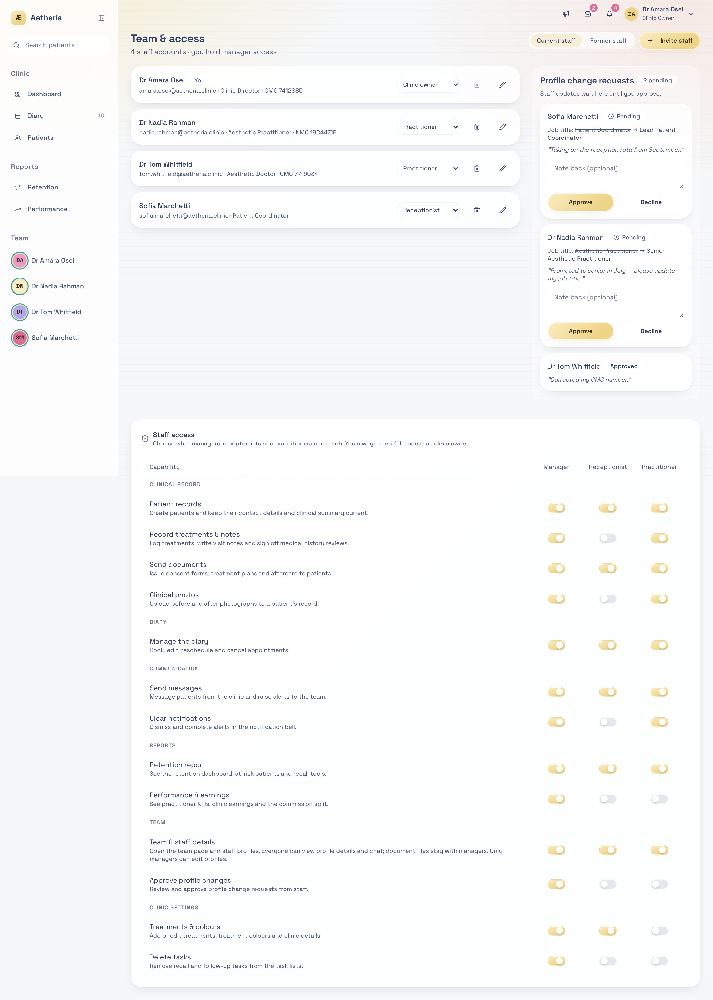

**Header.** Count + “you hold manager access”. Current / Former pills + **Invite staff** (owner).

**Current.** Member cards (name → profile, role select, revoke, edit / set password). Sticky **Profile change requests** aside. **Staff access** grid — `AccessControlSettings` grouped exactly like `PERMISSION_GROUPS` (Clinical record, Diary, Communication, Reports, Team, Clinic settings).

**Former.** Restore access (owner). Copy explains the 90-day window.

**Components.** `InviteStaffDialog`, `AccessControlSettings`, `Tabs`, `Card`, `Badge`, `useStepUp`, `RoleSelect`, `EditStaffDialog`.

**Flow.** Invite → email + password gate → welcome. Revoke is step-up confirmed, undoable from the toast. Approving a request updates the live profile.

---

### 8.2 Staff profile — `/team/$id`

**Who.** Anyone with `team.view`. Own user id redirects to `/profile`. Managers edit; others read. Document files stay with managers (`StaffDocuments` vs `StaffDocCompliance`).

**Why it exists.** The colleague page is the HR/clinical-governance twin of the patient record: identity, what they are allowed to do, the documents JCCP/UK practice expect, and a 1:1 staff thread (alerts land here too).

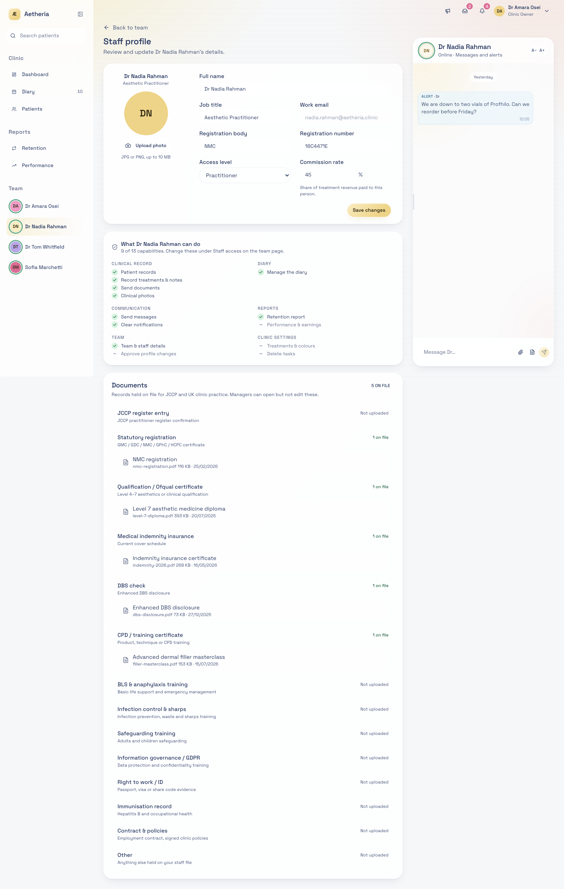

**Layout.** Same identity card pattern as My profile (aside avatar + form). Managers see role and commission %. `EffectivePermissions` lists the live grant set. Documents or a compliance checklist. `StaffChatPanel` on the right (same resize behaviour as patient chat). Revoked people get a restore banner instead of chat.

**Components.** `StaffAvatar`, `StaffDocuments`, `StaffDocCompliance`, `EffectivePermissions`, `StaffChatPanel`, `Form` + `StaffProfileSchema`.

---

### 8.3 Settings — `/settings`

**Who.** Staff can open it from the account menu when they are a manager or hold `settings.treatments`. Non-editors see a read-only catalogue.

**Why it exists.** Two clinic-wide facts that every other page reads: **who we are** (name, phone, email, address — used on forms, receipts, messages) and **what we sell** (catalogue: price, duration, recall interval, consent rule, diary colour).

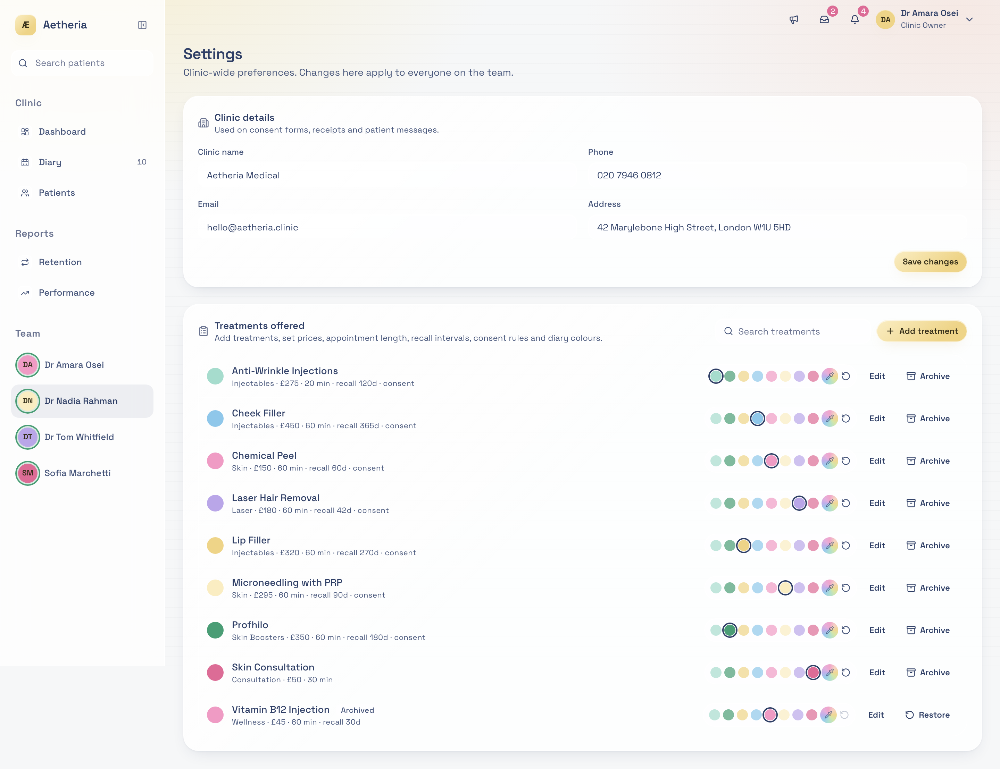

**Components.** `ClinicDetailsSettings`, `TreatmentCatalogueSettings`, `ColourWheelButton`, `Switch` (active / archive), search + add treatment.

**Flow.** Changing a colour here is what the diary legend and week cards pick up (`useTreatmentColours`). Archiving a treatment hides it from new bookings; historical visits keep the name.

---

### 8.4 My profile — `/profile`

**Who.** The signed-in staff member.

**Why it exists.** Your own name, job title, registration and files — not Team, so a practitioner can keep GMC/NMC current without having staff-admin rights. Security (sessions, MFA copy) lives here because it is personal, not clinic-wide.

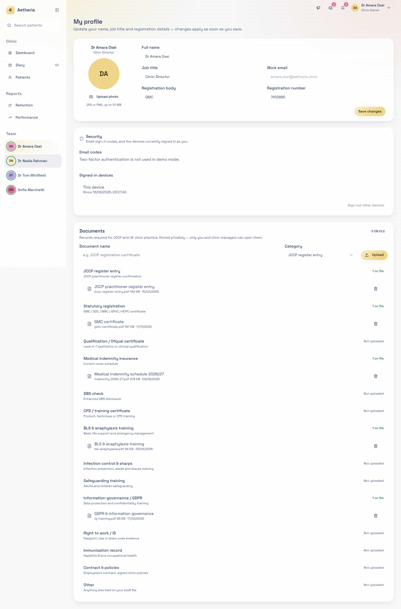

**Layout.** Identity card (avatar + fields). Optional history of older change requests. `SecuritySettings`. `StaffDocuments` for the JCCP/UK file set (register entry, indemnity, DBS, CPD, …).

**Components.** `StaffAvatar`, `SecuritySettings`, `StaffDocuments`, `Card`, `Input`, `Button`.

---

## 9. Component inventory

### 9.1 Primitives (`src/components/ui`)

Used as the only control kit. The important ones on clinic pages:

`Button`, `Card` (always `.glass-card`), `Input`, `Label`, `Textarea`, `Badge`, `Dialog`, `DropdownMenu`, `HoverCard`, `Tabs`, `Form`, `Switch`, `Checkbox`, `Select`, `Popover`, `Sonner` toasts (`.aetheria-toast`).

### 9.2 Clinic-specific building blocks

| Block | Used on |
|---|---|
| `AppShell` | Every authenticated page |
| `BrandLockup` / `BrandMark` | Shell, auth, landing |
| `PeriodPicker` | Performance, Earnings |
| `QuickAddAppointment` | Dashboard, Diary |
| `VisitNoteChip` / notes editors | Diary, Dashboard carousel |
| `RiskBadge` | Patient record, Retention |
| `PatientChatPanel` / `StaffChatPanel` | Patient record, Staff profile |
| `NotificationBell`, `StaffAlertDialog`, `ArrivalAlerts` | Shell |
| `InviteStaffDialog`, `AccessControlSettings` | Team |
| `ClinicDetailsSettings`, `TreatmentCatalogueSettings` | Settings |
| `SecuritySettings`, `StaffDocuments` | Profile, Staff profile |

### 9.3 Layout recipes to reuse

- **Page:** `.page-header` > title block + actions/pills > sections with 24px gaps > `max-w-[1400px]`.
- **KPI row:** 1 / 2 / 4 columns, `Card` `p-5` or `p-[18px]`, 22–27px figure, 11px chips.
- **Split record:** `minmax(0,1fr)` + `--chat-width` (280–520).
- **List card:** `glass-table` or `divide-y divide-glass-line` inside a 22px card.
- **Empty:** dashed `border-edge-2` well, one sentence, optional link.

---

## 10. Cross-page flows (clinic POV)

### Book a new patient at the desk

Landing / Auth → Dashboard **Quick book** or Diary **New booking** → toggle new patient → record is created and the slot is held → Patient list now contains them → open the record to send consent.

### Arrive, treat, finish

Arrival toast or Diary **Arrived** → Waiting / In treatment / Aftercare / Complete → visit note on the card → payment chip (deposit / paid / send link) → aftercare form from the record if needed.

### Chase a deposit or consent

Dashboard **Attention needed** → patient (`?chase=1`) or diary card → send form / payment link → preference + outbox on the record show what actually went out.

### Keep someone who is slipping

Retention suggestion or at-risk row → patient → `RecallTasksPanel` / message → task appears on Dashboard **My tasks**. Marking contacted stops the nag without deleting the clinical history.

### Pay a practitioner

Performance (clinic) or My earnings (associate) → Team staff profile to change commission % → next period’s figures follow. Do not bury commission on Settings.

### Offboard a colleague

Team → revoke (step-up) → they appear under Former for 90 days → patient records they wrote stay → restore if it was a mistake. Owners cannot be surprised by a silent delete.

---

## 11. Related surfaces (out of scope here)

| Surface | Route | Notes |
|---|---|---|
| Patient portal (current) | `/my-record` | Single record view; being redesigned — see `docs/patient-portal/` |
| Patient sign-in | `/portal` | Separate auth surface |
| Password reset | `/auth/reset` | From email link |
| Comms webhooks / drain | `/api/comms/*` | Not a UI page |

---

## 12. Recapturing screenshots

```bash
DEMO=1 npx vite dev --port 5174 --strictPort
# in another shell, with Playwright available:
AETHERIA_SHOTS=docs/clinic-portal/screenshots node docs/clinic-portal/capture-screens.mjs
```

The capture script uses the `demo_role` cookie (`owner` / `practitioner` / `front_desk`). It hides the demo role switcher and the live alert stack so the pages stay readable. Patients and Retention are viewport shots — those lists are hundreds of rows in the fixture clinic.
