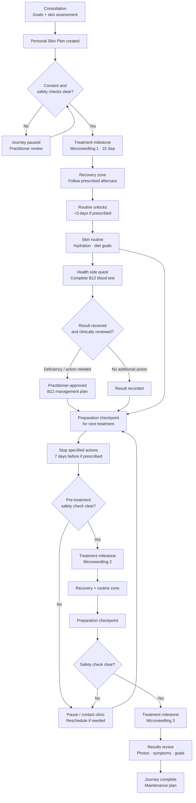

# Gamified “Skin Plan / Journey” for a Patient Portal

## Executive summary

The strongest version of this product is **not a checklist with points added on top**. It is a clinically governed care-plan engine presented to the patient as a reassuring, game-like journey.

The crucial architectural principle is:

> **Clinical truth determines what the patient may do; the game layer only visualises and motivates progress.**

That separation matters because a skin-treatment pathway contains dependencies, contraindications, changing appointment dates, recovery periods and potentially unrelated clinical work such as vitamin B12 investigation. A patient must never be able to “unlock” a treatment because they collected enough points, maintained a streak or manually ticked a task. Treatment readiness must be determined by clinical rules and practitioner review.

This is particularly important for microneedling. Even fairly simple-looking scheduling assumptions cannot safely be hard-coded. For example, the user's illustrative plan says to restart skincare after three days, stop actives seven days before treatment and undergo three sessions across roughly three months. A Chelsea and Westminster Hospital NHS scar-treatment protocol instead describes four to six sessions normally at least six weeks apart, use of only prescribed gel during the first 24 hours, simple moisturiser thereafter, various 72-hour restrictions and specific pre-treatment checks. The same NHS guidance lists active infection, active skin cancer, local-anaesthetic allergy, pregnancy, keloid history, recent sun exposure and recent laser treatment among its pre-treatment considerations or contraindications. These differences demonstrate why timing and safety rules belong in **clinician-configurable protocols rather than UI code**. citeturn21view0turn21view2

The B12 element requires the same discipline. NICE guidance distinguishes causes of vitamin B12 deficiency and different replacement strategies, including oral and intramuscular treatment. Therefore the portal should not implement the logic **“blood result low → tell patient to take vitamins”**. It should implement **“result received → clinical interpretation required → practitioner-approved management plan → medication/supplement task if appropriate”**. citeturn17search0turn22search0

The desired patient experience should instead feel approximately like this:

**Consultation → personalised plan appears → first treatment milestone → recovery zone → skincare habit zone → blood-test side quest → health-review checkpoint → preparation zone → second treatment → recovery/habit zone → final treatment → results/review milestone.**

The visual metaphor should be closer to a **journey map or elegant board game** than a medical to-do list: a character/avatar progresses along a path; large destinations represent treatment sessions; smaller stepping stones represent preparation, recovery, routines and investigations. However, game mechanics should primarily reinforce **competence, clarity and progress**, rather than competition. Research into patient attitudes towards gamified medication apps found that participants saw potential value in gamification but emphasised purpose, trust and personal choice, while expressing concern about trivialising healthcare. citeturn15view4

A particularly strong product model would therefore have four simultaneous layers:

| Layer | Purpose |
|---|---|
| **Clinical plan** | Authoritative appointments, treatment rules, contraindications, tests, medication and escalation |
| **Journey map** | Translates the plan into understandable stages and milestones |
| **Today / Next Action** | Removes cognitive load by showing the one or two things that matter now |
| **Motivation layer** | Progress, celebrations, optional badges, streak alternatives and encouraging feedback |

Gamification should be **optional in intensity**, and clinical actions should never become competitive. A patient can earn “Preparation complete” or “Recovery champion” recognition; they should not earn points for taking extra supplements, undergoing more procedures, achieving a particular laboratory value or suppressing symptoms.

For a UK implementation, health information is special-category personal data and needs an appropriate UK GDPR lawful basis plus a condition for processing special-category data. High-risk processing may require a DPIA. For an NHS England deployment, DTAC currently assesses five areas: clinical safety, data protection, technical assurance, interoperability, and usability/accessibility; organisations accessing NHS patient data and systems also use the Data Security and Protection Toolkit. citeturn18search1turn19search0turn25view4turn25view5

My recommended product proposition is:

> **“Your Skin Journey: know where you are, what comes next, why it matters and what could change the plan.”**

That is stronger than “gamifying compliance”. The latter risks manipulating patients into following a rigid plan; the former gives patients agency while maintaining clinical guardrails.

## Product strategy, users and behavioural model

The portal has three genuinely different users. Trying to satisfy all three with one shared representation will produce an overloaded interface.

| Persona | Core job | What they need to see | Main failure to design against |
|---|---|---|---|
| **Patient** | Understand and follow their individual journey | “Where am I?”, “What do I do today?”, “What happens next?”, “Why?”, “What if something changes?” | Confusion, anxiety, notification fatigue, incorrectly interpreting a routine task as clinical advice |
| **Practitioner** | Create, monitor and safely alter the treatment plan | Clinical state, contraindications, dependencies, exceptions, lab results, adherence signals, messages and next clinical decision | Spending more time administrating the app than treating patients; unsafe automated decisions |
| **Admin/coordinator** | Make the pathway operationally reliable | Bookings, cancellations, reschedules, incomplete forms, communication status, unresolved exceptions | Accidentally changing clinical instructions while solving scheduling problems |

**Patient goal.** The patient should never have to reconstruct their treatment plan from texts, appointment emails, product instructions and memory. One screen should answer: **“What do I need to do next?”** The map then provides context rather than being the primary task manager.

**Practitioner goal.** A practitioner should work with reusable clinical templates. For example, “Microneedling pathway — protocol A” could contain a treatment event, recovery instructions, product restrictions, preparation checklist and follow-up. The practitioner applies the template and changes clinically appropriate variables for that patient. This is safer and faster than manually creating twenty reminders.

**Admin goal.** Administrators need orchestration without clinical authority. For example, they can move an appointment slot, which may trigger recalculation of future date-relative tasks, but they should not be able to remove a contraindication or approve a B12 treatment decision unless their clinical role permits it.

The gamification model should favour **purpose, progress and agency over points**. Patient research published in JMIR found three themes around gamification and incentives in medication adherence: purpose-driven design, trust-based standards and personal choice. Participants thought gamification could be useful but were sensitive to healthcare being trivialised. citeturn15view4 Recent work applying Self-Determination Theory to gamified health experiences similarly provides a useful conceptual lens: the experience should support autonomy, competence and relatedness rather than relying solely on extrinsic rewards. citeturn23search1turn23search0

For this portal that translates to:

**Autonomy** means the patient can choose reminder times, opt out of cosmetic game effects, explain that they could not complete a task, ask for help and see why something has changed.

**Competence** means progress is obvious. Completing today’s preparation makes the next step clearer. Instructions are broken into achievable units. The interface says *why* something matters.

**Relatedness** means the practitioner remains visibly part of the journey. A message such as “Reviewed by Sophie, your practitioner” is potentially more reassuring than another badge.

The game world should therefore use **milestones rather than leaderboards**, **recovery rather than punishment**, and **meaningful achievement rather than infinite points**.

A useful rewards hierarchy would be:

| Level | Example | Appropriate? |
|---|---|---|
| Progress feedback | Path segment illuminates after a valid completed step | **Yes** |
| Milestone celebration | “First treatment complete” | **Yes** |
| Competence badge | “Preparation complete” after all prescribed preparation | **Yes** |
| Consistency acknowledgement | “You followed your routine on 5 of 7 planned days” | **Yes, carefully** |
| Streak | Daily skincare streak | **Optional only** |
| Competitive ranking | Compare adherence against other patients | **Avoid** |
| Points for medication/supplement amount | More doses = more points | **Never** |
| Reward for favourable laboratory result | Badge for normal B12 | **Never** |
| More treatment = more progress | Encourage extra microneedling | **Never** |

The distinction is important: **the desired behaviour is following the plan safely, not maximising an activity.**

## Clinical journey architecture and safety model

The underlying data structure should be a **dependency graph/state machine**, not a calendar full of independent reminders.

A flat calendar fails immediately when an appointment moves. Consider:

> Appointment two is moved from Tuesday to the following Tuesday.

If “stop actives seven days before appointment” was stored as an independent calendar reminder, it is now wrong. In a proper journey engine the rule is stored as:

`start = appointment_2.start - 7 days`

The appointment moves, the dependent task is recomputed, the patient is notified of the change and the previous scheduled reminder is cancelled.

The same applies after treatment:

`routine_resume = procedure_1.completed_at + clinician_defined_offset`

This is materially safer than encoding “18 September” because the latter remains incorrect if the procedure is cancelled on 15 September.

Each journey object should therefore contain at least:

| Attribute | Example |
|---|---|
| `type` | appointment, routine, test, medication, education, safety-check |
| `status` | locked, available, due, completed, overdue, blocked, cancelled |
| `anchor` | treatment one completion |
| `offset` | +3 days |
| `valid_window` | clinician-defined |
| `dependencies` | treatment one completed |
| `blocking_conditions` | active infection reported |
| `completion_source` | patient, practitioner, EHR, lab, scheduling system |
| `clinical_owner` | practitioner/clinic |
| `protocol_version` | microneedling-A-v4 |
| `instructions_version` | aftercare-v7 |
| `escalation_rule` | practitioner review |
| `updated_by` | named user/system |
| `updated_at` | immutable audit timestamp |

The distinction between **locked** and **blocked** is particularly valuable. Locked means “not yet relevant”; blocked means “you have reached this point, but something clinically important must be resolved”. A blocked treatment should never look like failure.

### Illustrative journey model

The following diagram is a UI concept, **not a universal microneedling protocol**. The three-day skincare restart and seven-day “stop actives” rule come from the user's scenario and should exist in the product only when explicitly prescribed. Published NHS microneedling instructions differ by context, demonstrating why these values must remain configurable. citeturn21view0turn21view2



Visually, this can be transformed from a flowchart into a **winding path**:

**Consultation 🏁 → Treatment One ✨ → Recovery 🌙 → Routine 💧 → Blood Test 🧪 → Health Review 🩺 → Prepare 🛡️ → Treatment Two ✨ → Recovery 🌙 → Treatment Three 🏆 → Review 🌱**

The avatar can physically move between those destinations as clinically valid milestones are completed. The important word is *clinically valid*. A patient tapping “done” does not necessarily equal clinical completion.

### Task types and completion semantics

**Appointments** should come from the scheduling system where possible. The patient can view details, add the appointment to their device calendar, request a change and complete prerequisite forms. Attendance should ideally be confirmed by the scheduling/EHR system, rather than by a patient tapping “I attended”.

**Routines** are appropriate for patient completion. They can contain steps such as cleanser, prescribed product and moisturiser, depending on the practitioner's plan. Routine tracking should tolerate imperfection. Missing Tuesday should not make Wednesday feel pointless.

**Tests** need multiple states: ordered/requested → booked → specimen collected → result pending → result received → reviewed → action closed. “I had my blood test” is not equivalent to “my B12 issue has been dealt with”.

**Medication/supplements** require an authoritative treatment instruction. NICE's B12 guidance makes clear that management is not a one-size-fits-all self-supplementation rule, so an abnormal result should create a clinician-review state rather than automatically generating an OTC-vitamin instruction. citeturn17search0turn22search0

**Education and consent** should be first-class tasks rather than a PDF buried elsewhere. Before a treatment, the patient might complete a concise education card and consent process, with the system retaining which version they saw.

**Safety checklists** are gates. NHS microneedling guidance provides a good illustration: the Chelsea and Westminster protocol asks about factors including active skin cancer, local-anaesthetic allergy, active bacterial/fungal/viral skin infection, pregnancy, keloid scarring and recent sun/laser exposure. It also performs an assessment and pre-treatment checklist at the appointment. citeturn21view2 The portal should therefore be able to change a treatment node from **Ready** to **Needs review**, rather than merely recording a checkbox.

**Symptoms / concerns** are escalation events, not achievements. Chelsea and Westminster describes redness, pain/tightness, pigment changes and a small infection risk after microneedling and asks patients to contact the service if concerned about infection or wound formation. The exact red-flag wording in a production portal should come from the clinic's approved protocol. citeturn21view1

A robust state model would be:

`Planned → Available → In progress → Completed`

with alternate transitions:

`Available → Blocked → Reviewed → Available`

`Planned → Rescheduled`

`Available → Cancelled`

`Due → Overdue → Escalated`

and critically:

`Completed ≠ necessarily safe-to-proceed`

The next treatment milestone becomes available only once its clinical gates are satisfied.

## Interface system, game mechanics and patient flows

The best patient home screen should be **decisive rather than comprehensive**.

I would make the mobile hierarchy:

```text
┌──────────────────────────────────────┐
│ YOUR SKIN JOURNEY             38%    │
│ Treatment 1 of 3 complete            │
├──────────────────────────────────────┤
│                                      │
│        🏁──●──✨══●══🧪──○──✨──○──🏆 │
│             ↑                        │
│           YOU                        │
│                                      │
│ Consultation   Treatment 1   B12     │
│   ✓              ✓        NEXT       │
├──────────────────────────────────────┤
│ TODAY                                │
│ 🧪 Book your B12 blood test          │
│ Why: your practitioner wants to      │
│ review your known deficiency.        │
│                       [Book / update] │
├──────────────────────────────────────┤
│ DAILY ROUTINE                        │
│ ○ Morning skincare                   │
│ ✓ Water goal                         │
│ ○ Evening skincare                   │
├──────────────────────────────────────┤
│ NEXT TREATMENT                       │
│ 27 Oct · 10:30                       │
│ Preparation begins in 5 weeks        │
│                     [View details]   │
└──────────────────────────────────────┘
```

The percentage should represent **journey progress**, not a medical-outcome score. A patient with persistent acne or an abnormal lab result has not “failed” the game.

### Component library

| Component | UX treatment | Clinical/product rule |
|---|---|---|
| **Journey / progress map** | Winding map with major destinations, smaller stepping stones and patient avatar | Pure projection of the authoritative care-plan state |
| **Next Action card** | Largest home-screen card: “Your next step” | Prioritised by clinical urgency and date, not reward value |
| **Treatment milestone card** | Date, practitioner, location, readiness state, preparation | Cannot be self-unlocked |
| **Routine card** | Morning/evening checklist with quick completion | Supports “skip”, “couldn't do it” and practitioner instructions |
| **Laboratory card** | Test requested → collected → pending → result → reviewed | Never equate “result available” with “patient understands result” |
| **Medication/supplement card** | Drug/product, clinician instructions, schedule and education | Generated from an approved treatment plan, not a game rule |
| **Progress card** | “You are here”, completed phases, upcoming milestone | Avoid implied treatment efficacy |
| **Checklist** | Simple steps with dependencies and explanation | Some items patient-confirmed; others system/practitioner-confirmed |
| **Rewards / badges** | Small celebratory collection | Reward safe process, not health outcomes or additional dosing |
| **Streaks** | Optional routine consistency display | Prefer flexible consistency to loss-aversion |
| **Calendar sync** | Add appointment/preparation date to Apple/Google/device calendar | Source of truth remains clinical schedule |
| **In-app messaging** | Thread tied to treatment, test or concern | Clear expectations about response times/emergency use |
| **Consent modal** | Versioned information + consent/acknowledgement | Must not use dark patterns or pre-ticked consent |
| **Education modal/card** | “Why this matters”, concise instructions, expandable detail | Content is protocol/version controlled |
| **Contraindication warning** | Prominent “Pause — contact clinic” state | Overrides progress animation and routine nudges |
| **Progress photo card** | Standardised patient photography at selected milestones | Explicit purpose/permissions; no beauty filters |
| **Journey change card** | “Your appointment changed, so we moved these tasks” | Essential after automatic dependency recalculation |

The map should have **three scales of information**. At normal zoom it shows chapters. Tapping a chapter expands its tasks. “Today” always remains accessible outside the map. This avoids the classic game-map problem where a beautiful path becomes slower than a normal list for someone simply trying to discover what to do this morning.

### Interaction patterns

**Progressive disclosure.** Future tasks should be visible enough to give orientation but muted enough not to overwhelm. Patients should see “Preparation phase begins one week before your appointment”, rather than twelve locked checklist items months in advance.

**Why-before-how.** A task card should contain one sentence answering “Why am I being asked to do this?” before detailed instructions. Gamification without clinical meaning quickly becomes decorative.

**Recovery counts as progress.** One of the strongest game mechanics for this use case is explicitly showing recovery as a legitimate stage. After treatment, the avatar enters a “Recovery Zone”. The patient's job may literally be **not to use certain products**. That still advances the journey. NHS post-treatment guidance illustrates why this matters: its scar-service protocol restricts products initially and advises avoiding hot water, saunas, swimming and sweaty exercise for 72 hours or until swelling/bleeding has resolved. citeturn21view0

**No destructive streaks.** A conventional app might say:

> 🔥 23-day streak — don't lose it!

That mechanism is poorly suited to a pathway where a clinician may deliberately tell the patient to pause a routine. Better:

> **Routine rhythm: 5 of 6 planned days completed this week.**

If treatment requires a pause:

> **Recovery day — no routine scheduled. Staying on plan counts. ✓**

That small decision prevents the game from contradicting medicine.

**Rescheduling is a first-class interaction.** When appointment two moves, show:

> **Your journey has changed.**  
> Your treatment is now 3 November. We have moved your preparation window to match.  
> **Changed:** stop specified actives from 27 October.  
> [See changes]

Silently moving tasks would be dangerous because patients may have remembered the previous instructions.

**Exceptions must be effortless.** Every task needs alternatives to “Done”:

`Done` · `Not yet` · `I couldn't do this` · `I need help`

That produces clinically useful information instead of incentivising dishonest completion to preserve the game.

### Notifications and reminders

Notifications need a priority model rather than one global “reminders on/off” setting.

| Priority | Example | Recommended behaviour |
|---|---|---|
| **Safety / clinical exception** | Patient reports active infection before procedure | Immediate in-app warning + clinical workflow; treatment may block |
| **Appointment-critical** | Treatment tomorrow | Push/SMS/email according to clinic policy and preference |
| **Preparation-critical** | Start practitioner-prescribed product hold | Notify at start of valid window; repeat only if still unresolved |
| **Result/follow-up** | B12 result requires review | Tell patient result/status is available as clinically appropriate; create practitioner closure task |
| **Routine** | Evening skincare | User-selected time; bundle and snooze |
| **Lifestyle** | Hydration | Low priority, user-controllable and easy to disable |
| **Celebration** | Treatment milestone complete | In-app primarily; no need to interrupt patient |

Notifications should communicate **action + deadline + reason**, rather than generic nudging:

Bad:

> “Don't forget your Skin Journey!”

Better:

> “Your preparation phase starts today. Your practitioner has asked you to stop the specified active products before your next treatment. Review the products now.”

Gamification research supports caution here: patients value personal choice and can perceive badly executed game or incentive mechanisms as trivialising healthcare. citeturn15view4

### Onboarding flow

The practitioner should create the plan **before** the patient is asked to configure gamification. The onboarding sequence should be:

`Practitioner creates plan → patient receives invitation → identity/authentication → journey explained → consent/education → review major milestones → choose reminder channels/times → choose visual style/gamification intensity → calendar sync → first next-action screen`

A simple personalisation question could be:

> **How would you like progress to feel?**
>
> Calm — simple timeline and gentle reminders  
> Motivating — journey map, celebrations and milestones  
> Playful — avatar, collectibles and achievement badges

Crucially, all three modes use the **same clinical engine**.

### Re-engagement

Do not interpret every absence as loss of motivation.

After a missed routine:

> “Yesterday's routine wasn't recorded. That's OK — would you like to continue today?”

After several missed tasks:

> “It looks like the plan may not be fitting your routine. Update your reminder times, tell your practitioner what's getting in the way, or continue as planned.”

After a missed **clinical gate**, however:

> “Your next treatment cannot be marked ready until this step is reviewed. Contact the clinic.”

Those are fundamentally different situations and should not share an engagement algorithm.

### Accessibility

A visual game map cannot be the only representation of the plan. NHS guidance states that patient- and staff-facing public-sector services must meet WCAG 2.2 AA, and WCAG 2.2 adds criteria including focus-related requirements. citeturn15view11

Therefore every journey map should have an equivalent **linear accessible timeline**:

```text
Your journey — 4 of 11 milestones complete

✓ Consultation — complete
✓ Treatment 1 — complete
✓ Recovery — complete
✓ New skincare routine — started
→ B12 blood test — action needed
○ B12 clinical review — waiting
○ Preparation for Treatment 2 — locked
○ Treatment 2
○ Treatment 3
○ Final review
```

Do not encode states only through red/amber/green colours. Use icon + text + shape. Support keyboard navigation, logical focus order, large target sizes, text resizing, reduced-motion preferences and screen-reader descriptions. On native mobile, frameworks such as React Native expose accessibility APIs for VoiceOver and TalkBack, including labels and accessibility actions. citeturn25view2

Celebratory animation should respect reduced-motion settings; no patient should need to watch an avatar travel across a map before being allowed to access their instructions.

### Visual and asset direction

I would avoid both extremes: **sterile EHR interface** and **children's mobile game**.

A strong aesthetic is “premium wellbeing journey”:

- soft topographic/path illustration;
- rounded clinical cards;
- a small custom avatar or abstract skin/leaf character;
- milestone illustrations rather than cartoon prizes;
- distinct visual “worlds” for **Prepare**, **Treatment**, **Recovery**, **Routine**, **Health Check** and **Review**;
- icons for treatment, calendar, skincare, droplet, meal/nutrition, laboratory vial, supplement/medication, shield/safety and clinician message;
- subtle confetti or path animation at genuine milestones;
- an entirely static equivalent for reduced motion.

Use custom SVG assets rather than stock “before-and-after beauty” imagery. If patient progress photographs are supported, keep them clinically neutral: consistent position/lighting guidance, no beauty filters and explicit controls governing their use.

The avatar should ideally represent **progress through care rather than improvement in attractiveness**. Avoid gradually making the avatar's face “clearer” as the patient completes tasks; that could imply guaranteed efficacy and negatively reinforce appearance concerns.

## Privacy, clinical governance and system integration

The portal will hold sensitive information: treatment history, skin photographs, laboratory results, possible vitamin deficiency, medications, messages and health-related behavioural data. In the UK, health information is special-category personal data. Organisations need an Article 6 lawful basis and an appropriate Article 9 condition; “consent” should therefore not casually be used as a blanket synonym for the organisation's entire legal basis for processing. The correct basis depends on the service and parties involved. citeturn18search1

High-risk uses of health information can require a Data Protection Impact Assessment, so the DPIA should be designed into discovery rather than left until launch. citeturn19search0

Recommended privacy architecture:

| Control | Product implication |
|---|---|
| **Data minimisation** | Do not collect nutrition, water, photography or wearable data simply because the UI could display it |
| **Purpose limitation** | Explain whether a photo is for clinical comparison, patient journalling, research or marketing; these are not interchangeable purposes |
| **Role-based access** | Patient, practitioner, clinical lead and admin should not have identical data access |
| **Auditability** | Record who changed clinical instructions and when |
| **Versioning** | Retain the exact protocol/consent/education version associated with a treatment |
| **Encryption** | Protect data in transit and at rest within the chosen architecture |
| **Retention controls** | Define retention based on clinical/legal purpose rather than indefinite game history |
| **Export/correction workflows** | Support applicable data-subject rights and clinical-record correction processes |
| **Notification privacy** | Lock-screen messages should not unnecessarily reveal sensitive diagnoses |
| **Analytics separation** | Product analytics should avoid copying identifiable health-event payloads into generic analytics tools by default |

For NHS England use, DTAC is particularly relevant. Its five areas are **clinical safety, data protection, technical assurance, interoperability, and usability/accessibility**. The updated DTAC process had fully transitioned to the refreshed form by 6 April 2026. citeturn25view4turn15view10 Organisations with access to NHS patient data and systems also use the Data Security and Protection Toolkit, which measures performance against the National Data Guardian's data-security standards. citeturn25view5

Clinical safety must be treated as software engineering work, not just clinical copywriting. NHS England identifies DCB0129 and DCB0160 as its digital clinical-safety standards; DCB0129 concerns manufacture/development and DCB0160 deployment/use. NHS England announced a review of both standards in June 2026, so a UK/NHS implementation should check the current standard set during procurement and release rather than freezing today's interpretation into a long-lived compliance checklist. citeturn20search0turn20search2turn18search0

This product has obvious software hazards that belong in a clinical hazard log, for example:

| Hazard | Example control |
|---|---|
| Wrong preparation date after appointment reschedule | Relative scheduling + automated recalculation + visible change notification |
| Cancelled treatment leaves aftercare active | Treatment-completion event required before dependent aftercare can start |
| Patient manually “completes” contraindication | Safety clearance requires authorised workflow |
| Lab result displayed but never clinically acted on | Separate `result_received` and `result_reviewed/closed` states |
| Incorrect old aftercare shown | Version-controlled protocols |
| Admin changes clinical instruction | Permission separation |
| Notification arrives after plan changed | Idempotent scheduling and cancellation |
| Gamification encourages contraindicated activity | Game layer cannot unlock clinical actions |
| System integration temporarily unavailable | Clearly distinguish “not yet received” from “normal/no issue” |
| Duplicate treatment event imported | Stable external identifiers + reconciliation |

That hazard perspective should influence architecture from the start.

### Interoperability model

HL7 FHIR is well suited to the semantics of this use case. FHIR's `CarePlan` is explicitly designed to represent intended care across a period and can cover plans combining interventions, laboratory work, counselling and timing relationships. citeturn15view12

A sensible mapping is:

| Skin Journey concept | FHIR-oriented representation |
|---|---|
| Overall journey | `CarePlan` |
| Goal | `Goal` |
| Microneedling request | `ServiceRequest` |
| Completed treatment | `Procedure` |
| Appointment | `Appointment` |
| Action/work item | `Task` |
| B12 test request | `ServiceRequest` |
| B12 measurement | `Observation` |
| Lab report | `DiagnosticReport` |
| Prescribed medicine | `MedicationRequest` |
| Patient-reported medication | `MedicationStatement` |
| Consent | `Consent` and/or versioned document as appropriate |
| Education/document | `DocumentReference` where appropriate |
| Message | `Communication` or vendor-specific messaging adapter |

FHIR's own CarePlan documentation notes that care plans can reference resources including DiagnosticReport, MedicationRequest, MedicationStatement, Observation, Procedure, ServiceRequest and QuestionnaireResponse. citeturn15view12

For embedded EHR/patient-portal deployment, SMART App Launch provides a standards-based mechanism for launching third-party applications inside or outside an EHR user interface and accessing FHIR data using secure authorisation flows. It explicitly covers apps for clinicians and patients. citeturn15view13

For England, NHS Pathology and Laboratory Medicine Reporting has an FHIR API for sending structured pathology results, with its current NHS page updated in August 2026. The exact integration available to a particular clinic will still depend on its laboratory/provider environment. citeturn16search2

A sensible integration boundary is therefore:

```text
                         ┌──────────────────┐
                         │   Patient App    │
                         └────────┬─────────┘
                                  │
                         Journey Experience API
                                  │
              ┌───────────────────┼──────────────────┐
              │                   │                  │
       Clinical Plan        Notification       Messaging
          Engine               Engine            Service
              │
      ┌───────┼────────┬─────────┼──────────┐
      │       │        │         │          │
     EHR   Scheduling Labs   Identity   Analytics
   FHIR/   Adapter/API FHIR   /SSO     de-identified
   SMART
```

The **clinical-plan engine** should own dependencies. Google/Apple/device calendars should receive copies of selected patient events; they should not become the source of clinical truth.

## Evidence from existing gamified health products

No single existing product provides the exact model required here, but four products demonstrate useful design principles.

| Product | Relevant mechanics | What to learn | What **not** to copy blindly | Primary source |
|---|---|---|---|---|
| **mySugr** | Diabetes “monster”, motivating challenges, reminders, logging, graphs and connected glucose meters | A playful metaphor can coexist with serious clinical data. The user's complex condition becomes something manageable rather than a sterile dashboard. Automatic device ingestion also reduces logging burden. | Do not let the skin metaphor obscure clinical state. A cosmetic/skin journey needs even more care around appearance and implied outcomes. | mySugr describes personalised logging, meter connectivity, glucose graphs, sharing with clinicians and “Motivating Challenges” built around “taming your diabetes monster”. citeturn15view6 |
| **Sidekick Health** | Health “missions”, challenges, points and rewards; historically included altruistic rewards | “Mission” is a powerful framing for small health actions because it makes the next step concrete. Meaningful rewards can be stronger than arbitrary coins. | Team competition should not be assumed appropriate for private dermatology/cosmetic care. Social mechanics should be strictly optional. | Sidekick describes users completing individual health missions and team challenges, accumulating points and receiving motivating altruistic rewards. citeturn15view7 |
| **Evidation** | Points/rewards plus passive data from connected apps and wearables | Reduce manual work. Where data can arrive reliably from another system, do not ask the patient to re-enter it. Explain reward rules clearly. | Never import the “more activity = more points” model into treatment/medication behaviour where “more” can be unsafe. | Evidation says users can connect data, receive personalised insights and earn rewards; its support material describes points for healthy actions captured by connected apps/wearables. citeturn17search4turn17search1 |
| **Apple Activity/Fitness** | Highly legible progress rings, awards, personal records and streaks | Progress can be understood almost instantly. A small number of stable visual metaphors can become more powerful than elaborate game worlds. | Circular goal completion is inappropriate for every clinical behaviour; prescribed rest, recovery and exceptions must count correctly. | Apple's support material describes Activity awards for personal records, streaks and major milestones. citeturn16search0 |

The most relevant precedent is arguably **mySugr**, because it demonstrates something easy to overlook: gamification does not require sacrificing medical seriousness. mySugr combines a playful “monster” and challenges with glucose data, meter connections, clinician sharing and regulated medical-device functionality in some markets. citeturn15view6

The lesson for the Skin Journey is not “copy the monster”. It is:

> **Give the emotional experience personality while keeping the clinical information exact.**

Sidekick adds a useful concept: call discrete patient actions **missions** rather than chores. citeturn15view7 A Skin Journey could therefore use restrained language such as:

> **This week's mission**  
> Complete your B12 blood test before your preparation phase begins.

Evidation demonstrates the value of reducing manual reporting. citeturn17search4turn17search1 If the lab has already sent the B12 result, asking the patient “Did you get your result?” is bad UX and can introduce conflicting records.

Apple's progress metaphor demonstrates why the most successful “game” may not look much like a game at all: immediate progress, milestones and continuity are sufficient for many users. citeturn16search0

The evidence also argues against over-gamification. In the JMIR qualitative study of gamification and adherence, participants accepted its potential but emphasised trust, purpose and personal choice while raising concerns about trivialisation. citeturn15view4 That is especially relevant to a portal containing abnormal blood results, infection concerns or treatment contraindications: at those moments the design must be able to drop the playful tone instantly.

## Implementation blueprint

For a portal intended primarily for patients using browsers, I would begin with a **responsive web application/PWA** rather than automatically committing to separate native iOS and Android applications. React is explicitly component-oriented, which aligns naturally with the component library above, and Next.js provides a production web framework around React with routing, server/client rendering and route handlers. citeturn25view0turn25view1

A pragmatic stack might therefore be:

| Layer | Recommended direction |
|---|---|
| Patient portal | React + TypeScript |
| Web application framework | Next.js |
| Design system | Accessible custom component library; Storybook-style isolated component development |
| State/data fetching | Query/cache layer plus server-authoritative clinical state |
| Backend | Typed service layer in the organisation's preferred supported platform |
| Primary transactional database | Relational database such as PostgreSQL |
| Workflow | Explicit journey/rules engine; event-driven recalculation |
| Notifications | Queue-based push/email/SMS adapters |
| Healthcare interoperability | FHIR R4 adapters, SMART where supported |
| Files/photos | Encrypted object storage with access controls and audit |
| Authentication | Established identity provider; NHS Login where relevant/available for NHS pathways |
| Observability | Structured audit, technical telemetry and clinical-safety monitoring separated appropriately |
| Analytics | Privacy-conscious event schema; no generic dumping of clinical payloads |

For a later native application, React Native is a credible route where the team already uses React/TypeScript, and its accessibility APIs expose platform integration with VoiceOver and TalkBack. citeturn25view2 Flutter is another viable cross-platform option with first-class accessibility support according to its documentation; the choice should be driven by team capability and delivery context rather than fashion. citeturn25view3

The domain model should **not** be:

```text
Patient
  has many Tasks
```

That is too weak.

A better conceptual model is:

```text
Patient
  └── Journey
       ├── ProtocolVersion
       ├── Goal[]
       ├── Phase[]
       │    └── Activity[]
       ├── Appointment[]
       ├── ClinicalGate[]
       ├── Result[]
       ├── MedicationPlan[]
       ├── EducationItem[]
       ├── ConsentRecord[]
       ├── MessageThread[]
       └── JourneyEvent[]
```

An `Activity` should support both absolute and relative timing:

```typescript
type JourneyActivity = {
  id: string;
  journeyId: string;

  type:
    | "appointment"
    | "routine"
    | "lab"
    | "medication"
    | "education"
    | "safety_check"
    | "lifestyle";

  status:
    | "locked"
    | "available"
    | "due"
    | "completed"
    | "overdue"
    | "blocked"
    | "cancelled";

  timing:
    | {
        kind: "absolute";
        startsAt: string;
        endsAt?: string;
      }
    | {
        kind: "relative";
        anchorEventId: string;
        offsetMinutes: number;
      };

  dependencyIds: string[];
  clinicalGateIds: string[];

  completionAuthority:
    | "patient"
    | "practitioner"
    | "scheduling_system"
    | "ehr"
    | "laboratory";

  protocolVersion: string;
};
```

The key property is `completionAuthority`. A skincare routine can be patient-confirmed; a laboratory result or procedure attendance should ideally come from the relevant authoritative system. That prevents the gamification UI from becoming the medical record by accident.

Events should be immutable where feasible:

```text
APPOINTMENT_CREATED
APPOINTMENT_RESCHEDULED
PROCEDURE_COMPLETED
ROUTINE_COMPLETED
LAB_SAMPLE_COLLECTED
LAB_RESULT_RECEIVED
LAB_RESULT_REVIEWED
CLINICAL_GATE_BLOCKED
CLINICAL_GATE_CLEARED
PLAN_VERSION_CHANGED
PATIENT_REPORTED_CONCERN
```

The current journey state is derived from these events plus authorised clinical data. This makes questions such as *“Why did the app tell this patient to stop a product on this date?”* far easier to answer during safety investigation.

FHIR should be treated as the **integration vocabulary**, not necessarily the exact internal UX model. HL7 describes `CarePlan` as the representation of intended care and explicitly allows it to be connected with procedures, requests, medications, observations and reports. citeturn15view12 The portal will likely need an internal orchestration model richer in UI state and dependency behaviour, with translation to and from FHIR at the integration boundary.

The implementation should also maintain two visibly different types of rule:

```text
CLINICAL RULE
"Treatment cannot proceed while safety gate X is unresolved."

EXPERIENCE RULE
"Animate avatar to the next destination after milestone completion."
```

An experience rule must **never override, satisfy or edit a clinical rule**.

## Measurement, experimentation and recommended product direction

A superficial product team would measure this portal with daily active users, streak length and tasks ticked. Those metrics could actively reward the wrong product.

A clinical journey should instead have a **balanced scorecard**.

| Dimension | KPI | Why it matters |
|---|---|---|
| **Safety** | Number/rate of contradictory active instructions | Direct measure of plan integrity |
| **Safety** | Unreviewed abnormal/flagged results beyond defined workflow target | Tests must lead to closure, not merely data display |
| **Safety** | Treatment attempts while clinical gate unresolved | Tests whether blocking rules actually work |
| **Safety** | Reschedule propagation failures | Critical for relative preparation/aftercare |
| **Patient comprehension** | % able to correctly identify next action in usability testing | Better measure than “screen viewed” |
| **Patient comprehension** | % able to explain why a task is required | Tests understanding, not button pressing |
| **Adherence/process** | Clinically valid tasks completed within intended window | Core pathway measure |
| **Operations** | No-show/cancellation rate | Scheduling value |
| **Operations** | Practitioner minutes spent managing one active plan | Portal must reduce rather than create admin |
| **Operations** | Number of manual exceptions per journey | Reveals bad automation/template design |
| **Engagement** | Journey-map usage versus list usage | Shows which visual model patients actually prefer |
| **Engagement** | Reminder-to-action conversion | Tests reminder utility |
| **Engagement** | Notification opt-out rate | Detects over-notification |
| **Experience** | Patient-reported clarity | “I know what I need to do next” |
| **Experience** | Patient-reported trust | Critical for health gamification |
| **Accessibility** | Task-success gap by assistive-technology use | Finds exclusion hidden by aggregate conversion |
| **Clinical outcome** | Practitioner-selected outcome measures | Must be interpreted separately from app engagement |

**Do not make streak length a primary KPI.** It would create pressure to design for compulsive app interaction rather than appropriate care.

### High-value A/B tests

A/B testing is appropriate for the **presentation of care**, not the care itself. Do not randomise contraindication thresholds, procedure spacing, prescribed medication, red-flag escalation or other clinical rules simply to improve engagement.

The most informative early experiments are:

| Experiment | Variant A | Variant B | Measure |
|---|---|---|---|
| **Primary navigation** | Journey map first | Today/Next Action first | Next-action comprehension and task completion |
| **Progress visualisation** | Percentage | “4 of 9 stages” | Understanding and anxiety |
| **Gamification framing** | Badge/celebration | Calm milestone acknowledgement | Trust, preference, completion |
| **Routine mechanic** | Consecutive streak | Flexible weekly consistency | Long-term routine completion and negative sentiment |
| **Future visibility** | Entire journey visible | Only current + next two phases | Comprehension and overwhelm |
| **Reminder copy** | “Don't forget…” | Action + reason + deadline | Action conversion, opt-outs |
| **Achievement timing** | Instant celebration after each task | Celebration only at meaningful milestones | Perceived seriousness/trust |
| **Choice architecture** | Default reminder times | User-selected reminder times during onboarding | Completion and notification disablement |
| **Clinical contact** | Generic support button | Named practitioner/team presence | Help-seeking and trust |

Gamification research suggests that personal choice and purpose matter, so tests should look beyond click-through rate to measures of trust and perceived appropriateness. citeturn15view4

### Recommended minimum viable product

The temptation will be to build avatars, badges and animation first because those are visually exciting. That would be backwards.

The first release should prove the **journey engine**:

**Clinical foundation:** practitioner plan builder, relative timing, dependencies, safety gates, protocol versioning, rescheduling, tests/results, practitioner review and audit history.

**Patient foundation:** Today card, linear timeline/map, appointment details, routine checklists, preparation/aftercare, reminders, messaging and calendar sync.

**Safety foundation:** contraindication workflows, escalation, plan-change notices and explicit distinction between patient-completed versus clinically verified activities.

**Accessibility/privacy foundation:** WCAG 2.2 AA-oriented design, screen-reader/list alternative, role-based access, privacy controls and DPIA/clinical-safety work as appropriate. NHS-facing products should take DTAC and the relevant clinical-safety requirements into account from design rather than attempting to retrofit them at procurement. citeturn15view11turn25view4turn20search2

Only then should the richer game layer be added:

**Journey artwork → avatar movement → milestone animations → optional badges → themed chapters → cosmetic personalisation.**

The final experience could look and feel like a game, but underneath it should behave like a well-designed clinical workflow system.

The most compelling visual concept is therefore a **living treatment map**:

> The patient begins at a consultation “base camp”.  
> Each major treatment is a large destination on the horizon.  
> Between them are smaller preparation, recovery and habit milestones.  
> A laboratory investigation appears as a meaningful side path that reconnects with the main journey once reviewed.  
> Safety issues place a temporary bridge or gate across the path, explicitly showing that progress is paused rather than failed.  
> When an appointment changes, the road ahead physically redraws itself and tells the patient why.  
> Recovery days still move the journey forwards.  
> At the end, the reward is not “perfect skin”; it is **“You completed your agreed treatment journey — now review your results and next plan with your practitioner.”**

That final distinction is fundamental. **The game should celebrate participation in safe, informed care—not promise a particular appearance.**